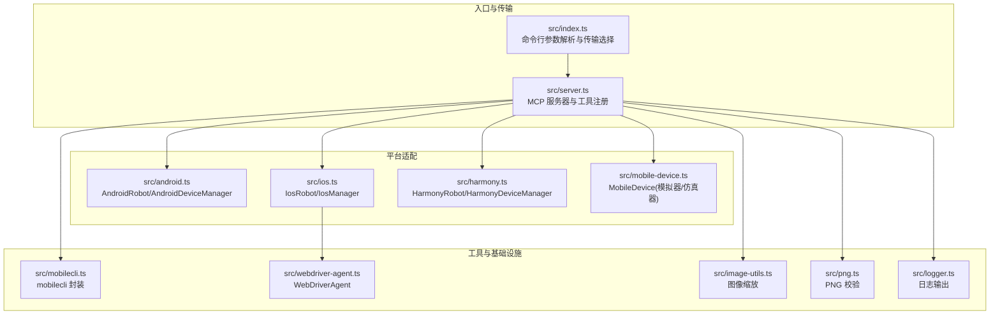
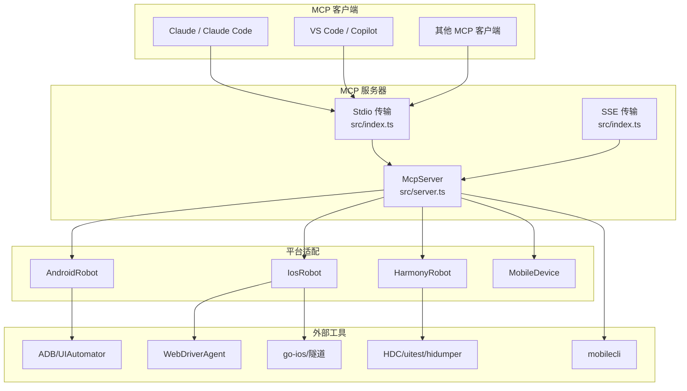
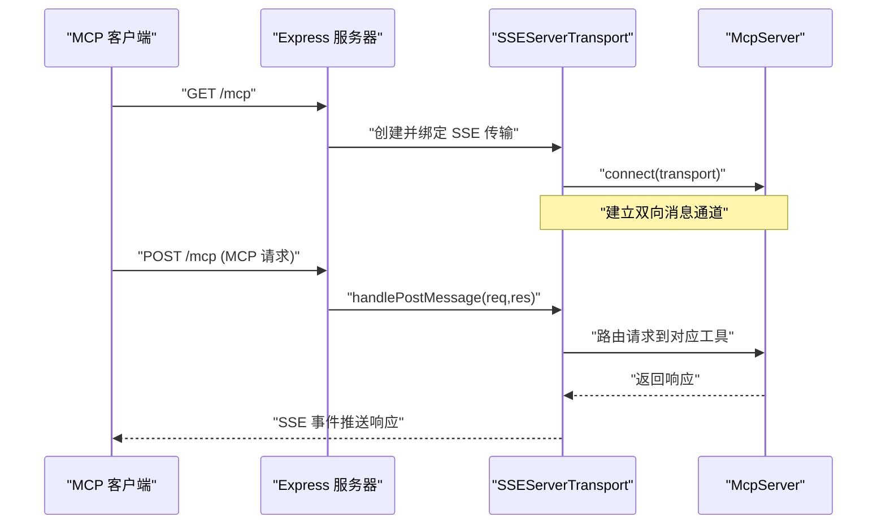
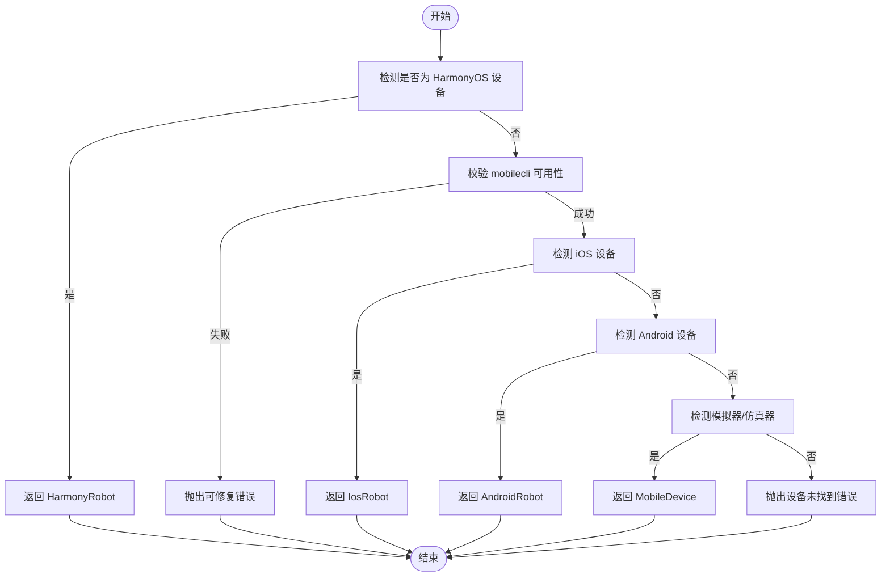
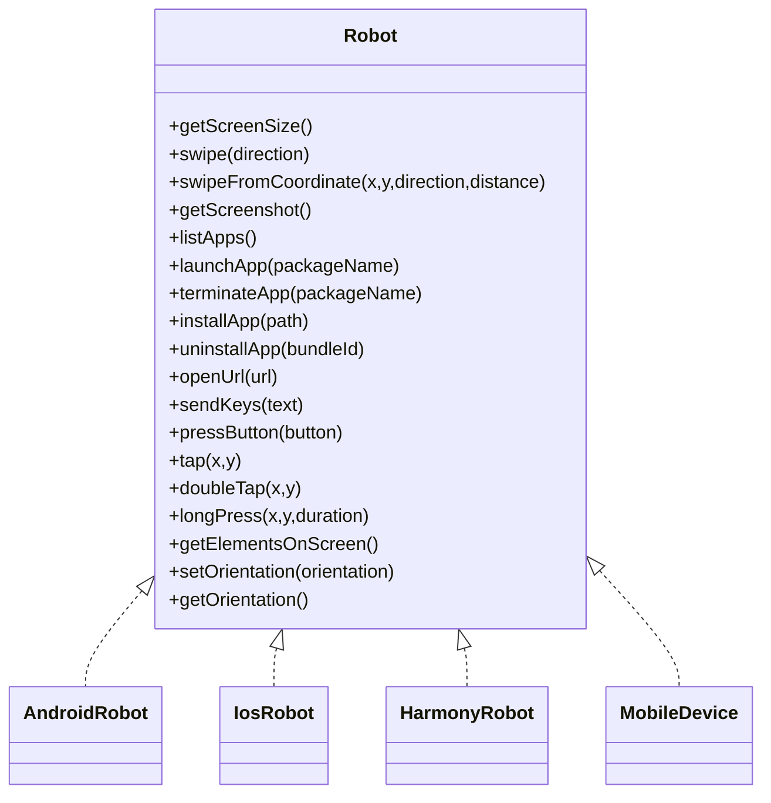
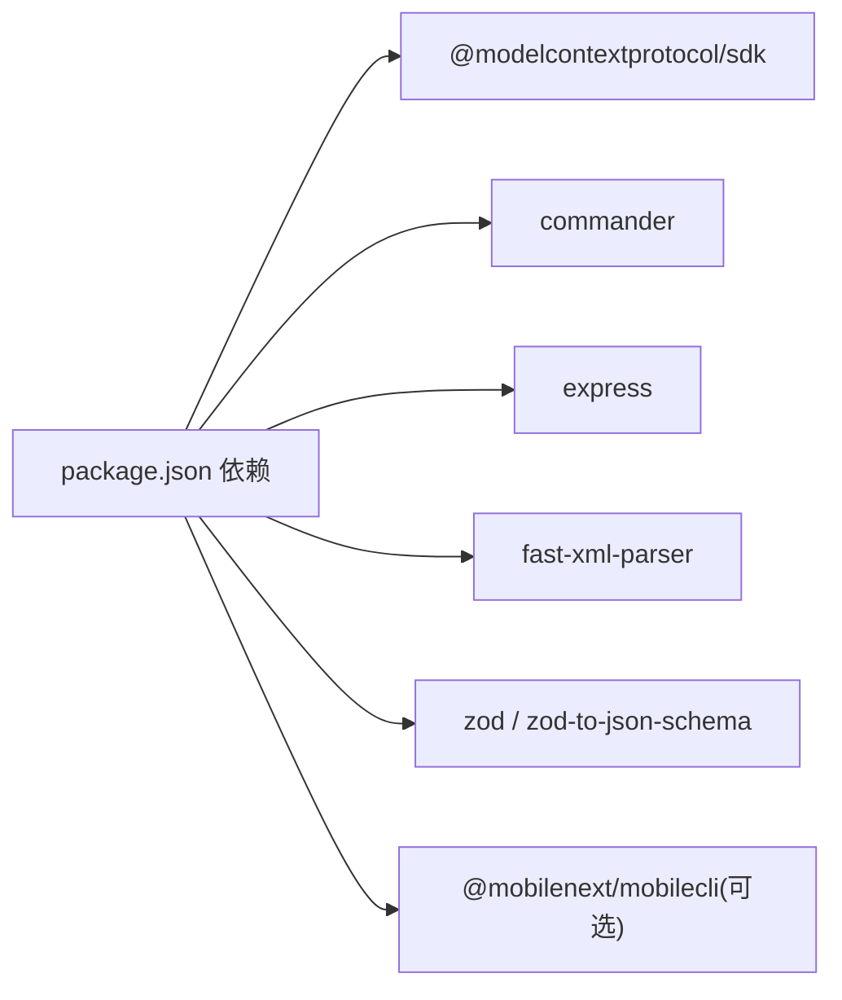

# API 集成

<cite>
**本文引用的文件**
- [package.json](file://package.json)
- [README.md](file://README.md)
- [src/index.ts](file://src/index.ts)
- [src/server.ts](file://src/server.ts)
- [src/robot.ts](file://src/robot.ts)
- [src/android.ts](file://src/android.ts)
- [src/ios.ts](file://src/ios.ts)
- [src/harmony.ts](file://src/harmony.ts)
- [src/mobile-device.ts](file://src/mobile-device.ts)
- [src/mobilecli.ts](file://src/mobilecli.ts)
- [src/webdriver-agent.ts](file://src/webdriver-agent.ts)
- [src/image-utils.ts](file://src/image-utils.ts)
- [src/png.ts](file://src/png.ts)
- [src/logger.ts](file://src/logger.ts)
- [server.json](file://server.json)
- [test/mobilecli.test.ts](file://test/mobilecli.test.ts)
</cite>

## 目录
1. [简介](#简介)
2. [项目结构](#项目结构)
3. [核心组件](#核心组件)
4. [架构总览](#架构总览)
5. [详细组件分析](#详细组件分析)
6. [依赖关系分析](#依赖关系分析)
7. [性能考虑](#性能考虑)
8. [故障排查指南](#故障排查指南)
9. [结论](#结论)
10. [附录](#附录)

## 简介
本文件面向希望在 Mobile MCP HarmonyOS 项目基础上完成 API 集成的开发者，系统性说明 MCP 协议传输模式（Stdio 与 SSE）、HTTP API 接口、第三方工具集成方式，以及与 MCP 客户端（Claude、VS Code Copilot 等）的对接配置、认证机制与错误处理策略。同时提供与 mobilecli、WebDriverAgent 等外部工具的集成指南、网络通信协议、消息格式与数据序列化规范、并发连接与资源管理建议，以及性能优化实践。

## 项目结构
该项目采用“按职责分层”的组织方式，核心入口负责选择传输模式并启动 MCP 服务；服务层注册工具函数并统一错误处理；平台适配层分别封装 Android、iOS、HarmonyOS 的具体操作；工具层负责截图缩放、PNG 校验、日志输出等辅助能力；测试覆盖关键工具行为。

**图表来源**
- [src/index.ts:1-67](file://src/index.ts#L1-L67)
- [src/server.ts:1-708](file://src/server.ts#L1-L708)
- [src/android.ts:1-593](file://src/android.ts#L1-L593)
- [src/ios.ts:1-294](file://src/ios.ts#L1-L294)
- [src/harmony.ts:1-462](file://src/harmony.ts#L1-L462)
- [src/mobile-device.ts:1-217](file://src/mobile-device.ts#L1-L217)
- [src/mobilecli.ts:1-136](file://src/mobilecli.ts#L1-L136)
- [src/webdriver-agent.ts:1-455](file://src/webdriver-agent.ts#L1-L455)
- [src/image-utils.ts:1-165](file://src/image-utils.ts#L1-L165)
- [src/png.ts:1-21](file://src/png.ts#L1-L21)
- [src/logger.ts:1-22](file://src/logger.ts#L1-L22)

**章节来源**
- [src/index.ts:1-67](file://src/index.ts#L1-L67)
- [src/server.ts:1-708](file://src/server.ts#L1-L708)

## 核心组件
- 传输层
  - Stdio 模式：默认启动方式，适合大多数 MCP 客户端直接调用。
  - SSE 模式：通过 HTTP 提供 /mcp SSE 端点，便于某些客户端或代理环境使用。
- 服务器与工具注册
  - 使用 @modelcontextprotocol/sdk 创建 McpServer，注册统一的工具函数集合，包含设备管理、应用管理、屏幕交互、输入与导航等。
  - 工具参数采用 zod 校验，返回内容统一包装为 MCP 文本或图片响应。
- 平台适配
  - Android：ADB + UIAutomator。
  - iOS：WebDriverAgent + go-ios 隧道/转发 + 原生无障碍。
  - HarmonyOS：HDC + uitest + hidumper（无需 mobilecli）。
  - 模拟器/仿真器：通过 mobilecli 提供统一抽象。
- 图像与日志
  - 截图缩放：优先使用 macOS sips 或 ImageMagick，否则降级为 PNG 校验。
  - 日志：可选写入文件，统一输出到控制台。

**章节来源**
- [src/index.ts:9-67](file://src/index.ts#L9-L67)
- [src/server.ts:35-708](file://src/server.ts#L35-L708)
- [src/robot.ts:1-148](file://src/robot.ts#L1-L148)
- [src/image-utils.ts:1-165](file://src/image-utils.ts#L1-L165)
- [src/png.ts:1-21](file://src/png.ts#L1-L21)
- [src/logger.ts:1-22](file://src/logger.ts#L1-L22)

## 架构总览
下图展示 MCP 服务器、传输层、平台适配层与外部工具之间的交互关系。

**图表来源**
- [src/index.ts:1-67](file://src/index.ts#L1-L67)
- [src/server.ts:1-708](file://src/server.ts#L1-L708)
- [src/android.ts:1-593](file://src/android.ts#L1-L593)
- [src/ios.ts:1-294](file://src/ios.ts#L1-L294)
- [src/harmony.ts:1-462](file://src/harmony.ts#L1-L462)
- [src/mobile-device.ts:1-217](file://src/mobile-device.ts#L1-L217)
- [src/mobilecli.ts:1-136](file://src/mobilecli.ts#L1-L136)
- [src/webdriver-agent.ts:1-455](file://src/webdriver-agent.ts#L1-L455)

## 详细组件分析

### 传输模式与 HTTP API
- Stdio 模式
  - 默认启动，适合大多数 MCP 客户端直接通过进程 IO 通信。
  - 错误处理：捕获致命异常并退出进程，避免静默失败。
- SSE 模式
  - 提供 /mcp GET（建立 SSE 连接）与 /mcp POST（接收消息）端点。
  - 通过 Express 托管，SSEServerTransport 负责与 MCP SDK 交互。
- HTTP API 规范
  - GET /mcp：建立 SSE 连接，返回事件流。
  - POST /mcp：提交 MCP 请求消息，由传输层转发给服务器。
  - 状态码：遵循 MCP 协议语义，错误通过响应体携带文本或错误标记。

**图表来源**
- [src/index.ts:9-33](file://src/index.ts#L9-L33)
- [src/index.ts:50-67](file://src/index.ts#L50-L67)

**章节来源**
- [src/index.ts:9-67](file://src/index.ts#L9-L67)

### 工具注册与调用流程
- 工具注册
  - 使用统一的 tool 包装器注册工具，参数通过 zod 校验，返回内容统一为文本或图片。
  - 工具调用包含耗时统计与遥测上报。
- 设备选择逻辑
  - 优先识别 HarmonyOS 设备（无需 mobilecli）。
  - 若非 HarmonyOS，则校验 mobilecli 可用性后，再识别 iOS/Android/模拟器。
- 错误处理
  - ActionableError：用于可指导修复的用户错误，返回可读提示。
  - 其他异常：记录堆栈并返回错误标记，便于客户端感知。

**图表来源**
- [src/server.ts:149-197](file://src/server.ts#L149-L197)

**章节来源**
- [src/server.ts:62-95](file://src/server.ts#L62-L95)
- [src/server.ts:135-197](file://src/server.ts#L135-L197)

### 平台适配层（Android/iOS/HarmonyOS/MobileDevice）
- Android
  - 设备管理：ADB devices 解析，支持获取设备名称/版本。
  - UI 自动化：UIAutomator dump + XML 解析，过滤可见元素。
  - 输入与手势：ADB input、Monkey、UIAutomator swipe/tap/doubleTap/longPress。
  - 应用管理：adb install/uninstall/force-stop，包名查询。
  - 屏幕截图：screencap 输出 PNG，兼容多显示器场景。
- iOS
  - 依赖 go-ios、WebDriverAgent 与本地端口转发。
  - 通过 WebDriverAgent 提供屏幕尺寸、截图、元素树、动作（tap/doubleTap/longPress/swipe）、按键、URL 打开、方向设置/获取。
  - iOS 17+ 需要隧道与端口转发，否则拒绝运行。
- HarmonyOS
  - 通过 HDC 连接设备，uitest 执行输入/手势，hidumper 获取显示信息，snapshot_display 截图。
  - 应用管理：bm（包管理）、aa（Ability 启动/终止）。
  - 方向设置不支持程序化变更。
- MobileDevice（模拟器/仿真器）
  - 通过 mobilecli 统一抽象，提供与真实设备一致的 API。

**图表来源**
- [src/robot.ts:48-147](file://src/robot.ts#L48-L147)
- [src/android.ts:74-504](file://src/android.ts#L74-L504)
- [src/ios.ts:42-232](file://src/ios.ts#L42-L232)
- [src/harmony.ts:43-416](file://src/harmony.ts#L43-L416)
- [src/mobile-device.ts:62-216](file://src/mobile-device.ts#L62-L216)

**章节来源**
- [src/android.ts:1-593](file://src/android.ts#L1-L593)
- [src/ios.ts:1-294](file://src/ios.ts#L1-L294)
- [src/harmony.ts:1-462](file://src/harmony.ts#L1-L462)
- [src/mobile-device.ts:1-217](file://src/mobile-device.ts#L1-L217)

### 外部工具集成指南
- mobilecli
  - 作用：统一抽象 iOS/Android 模拟器/仿真器设备管理与操作。
  - 配置：可通过环境变量 MOBILECLI_PATH 指定二进制路径；自动定位 node_modules 内嵌二进制。
  - 行为：版本检查失败将触发可修复错误；getDevices 支持平台/类型/离线过滤。
- WebDriverAgent
  - 作用：iOS 原生自动化与无障碍树抓取、截图、动作执行。
  - 集成：IosRobot 通过本地端口访问，需 go-ios 隧道与端口转发正常。
- 图像处理
  - 截图缩放：优先 sips（macOS），其次 ImageMagick，否则仅做 PNG 校验。
  - 截图格式：JPEG 时自动缩放并转码；PNG 时校验尺寸有效性。

**章节来源**
- [src/mobilecli.ts:1-136](file://src/mobilecli.ts#L1-L136)
- [src/webdriver-agent.ts:1-455](file://src/webdriver-agent.ts#L1-L455)
- [src/image-utils.ts:1-165](file://src/image-utils.ts#L1-L165)
- [src/png.ts:1-21](file://src/png.ts#L1-L21)

### MCP 工具清单与参数
- 设备管理
  - mobile_list_available_devices：列出所有可用设备（HarmonyOS/Android/iOS/模拟器）。
  - mobile_get_screen_size：获取屏幕尺寸（像素）。
  - mobile_get_orientation / mobile_set_orientation：获取/设置屏幕方向。
- 应用管理
  - mobile_list_apps / mobile_launch_app / mobile_terminate_app / mobile_install_app / mobile_uninstall_app。
- 屏幕交互
  - mobile_take_screenshot / mobile_save_screenshot：截图（Base64 或文件）。
  - mobile_list_elements_on_screen：列出可见 UI 元素及中心坐标。
  - mobile_click_on_screen_at_coordinates / mobile_double_tap_on_screen / mobile_long_press_on_screen_at_coordinates。
  - mobile_swipe_on_screen：支持中心滑动或坐标起点滑动。
- 输入与导航
  - mobile_type_keys：向焦点元素输入文本，可选提交。
  - mobile_press_button：HOME/BACK/VOLUME_* 等物理键。
  - mobile_open_url：在设备浏览器打开 URL。

**章节来源**
- [README.md:47-86](file://README.md#L47-L86)
- [src/server.ts:199-704](file://src/server.ts#L199-L704)

### MCP 客户端集成配置
- 标准配置（适用于大多数客户端）
  - 使用 npx 命令启动服务器，或直接指向构建产物。
- Claude Code / Desktop
  - 提供专用命令添加 MCP 服务器。
- VS Code / Copilot
  - 在用户目录配置 mcp-config.json，声明本地类型与工具通配符。
- 从源码构建
  - 安装依赖后构建，支持 stdio 与 SSE 两种启动方式。

**章节来源**
- [README.md:100-171](file://README.md#L100-L171)

### 认证机制与安全
- 本项目未内置认证/鉴权模块，建议通过以下方式保障安全：
  - 限制本地访问（仅本机监听）。
  - 使用反向代理或容器网络隔离。
  - 对外暴露时配合 TLS 与网关鉴权。

[本节为通用建议，不直接分析具体文件]

## 依赖关系分析
- 外部依赖
  - @modelcontextprotocol/sdk：MCP 协议实现与传输抽象。
  - commander：命令行参数解析。
  - express：SSE HTTP 服务承载。
  - fast-xml-parser：Android UIAutomator XML 解析。
  - zod / zod-to-json-schema：工具参数校验与 JSON Schema 生成。
  - optionalDependencies：@mobilenext/mobilecli（可选，用于 iOS/Android 模拟器/仿真器）。
- 内部耦合
  - server.ts 作为中枢，依赖各平台适配类与工具类。
  - iOS 与 WebDriverAgent 强耦合，需本地端口可达。
  - HarmonyOS 与 mobilecli 无耦合，独立通过 HDC 工具链。

**图表来源**
- [package.json:29-39](file://package.json#L29-L39)

**章节来源**
- [package.json:17-74](file://package.json#L17-L74)

## 性能考虑
- 截图优化
  - JPEG 截图自动缩放并转码，降低体积；PNG 截图先校验尺寸再按需缩放。
  - 缩放依赖 macOS sips 或 ImageMagick，缺失时仅做 PNG 校验。
- 并发与资源
  - 各平台操作通过子进程执行，注意并发数量与超时控制。
  - Android 多显示器场景优先选择活动显示器，避免截屏失败。
  - iOS 隧道与端口转发失败时提前短路，避免无效重试。
- 日志与可观测性
  - 可选写入日志文件，统一输出到控制台。
  - 工具调用耗时与事件上报，便于性能分析。

**章节来源**
- [src/image-utils.ts:1-165](file://src/image-utils.ts#L1-L165)
- [src/png.ts:1-21](file://src/png.ts#L1-L21)
- [src/logger.ts:1-22](file://src/logger.ts#L1-L22)
- [src/server.ts:70-95](file://src/server.ts#L70-L95)

## 故障排查指南
- 设备未被识别
  - HarmonyOS：确认 hdc 在 PATH 或设置 HDC_SDK_PATH。
  - iOS：检查 go-ios 是否安装、隧道与端口转发是否就绪。
  - Android：检查 ANDROID_HOME/adb 是否可用。
  - 模拟器/仿真器：确认 mobilecli 可用且 getDevices 返回有效设备列表。
- 截图异常
  - JPEG 截图：若缩放失败，检查 sips 或 ImageMagick 是否安装。
  - PNG 截图：尺寸为 0 将触发可修复错误，重新尝试。
- 工具调用失败
  - ActionableError：根据错误提示修正参数或环境。
  - 其他异常：查看日志文件与堆栈信息，定位具体平台工具问题。

**章节来源**
- [src/harmony.ts:12-18](file://src/harmony.ts#L12-L18)
- [src/ios.ts:69-92](file://src/ios.ts#L69-L92)
- [src/android.ts:32-54](file://src/android.ts#L32-L54)
- [src/mobilecli.ts:53-92](file://src/mobilecli.ts#L53-L92)
- [src/image-utils.ts:137-165](file://src/image-utils.ts#L137-L165)
- [src/png.ts:10-19](file://src/png.ts#L10-L19)
- [src/server.ts:81-93](file://src/server.ts#L81-L93)

## 结论
本项目通过统一的 MCP 工具集与多平台适配层，实现了对 iOS、Android、HarmonyOS 以及模拟器/仿真器的一致自动化能力。结合 Stdio 与 SSE 两种传输模式，可灵活适配各类 MCP 客户端。通过明确的错误处理、图像优化与日志体系，开发者可以快速完成系统集成并在生产环境中稳定运行。

## 附录

### MCP 服务器元数据与包信息
- server.json 描述了服务器名称、描述、仓库信息、版本占位与传输类型（stdio）。

**章节来源**
- [server.json:1-22](file://server.json#L1-L22)

### 测试要点（mobilecli）
- 版本检查：验证返回版本号格式与调用参数。
- 设备查询：验证参数组合（平台/类型/离线）与调用顺序。

**章节来源**
- [test/mobilecli.test.ts:1-120](file://test/mobilecli.test.ts#L1-L120)