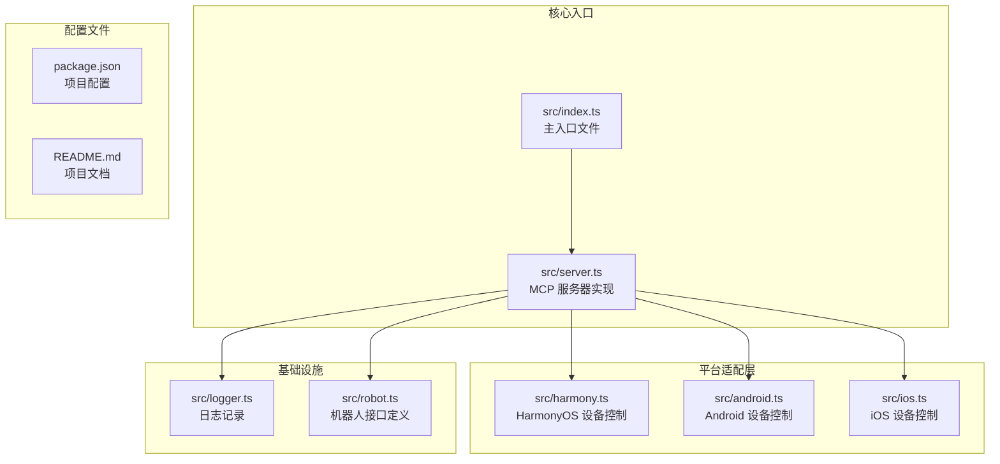
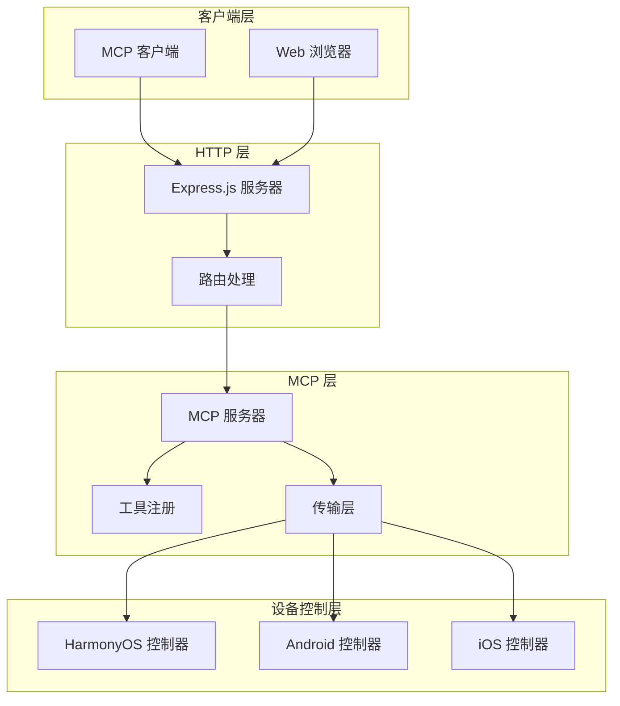
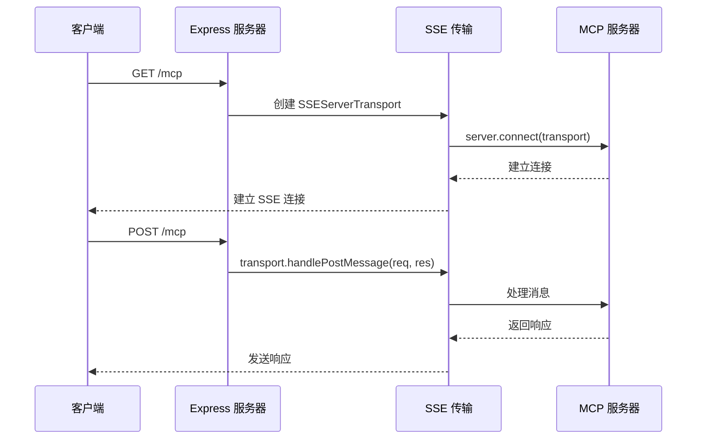
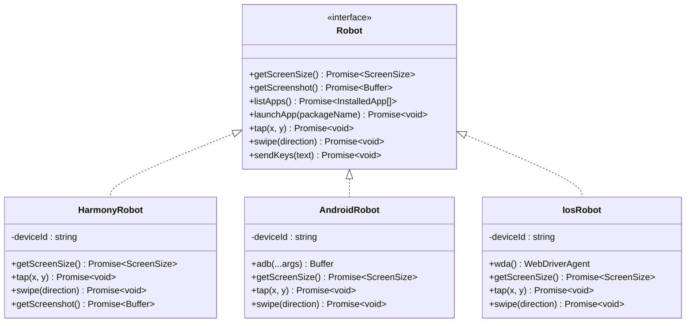
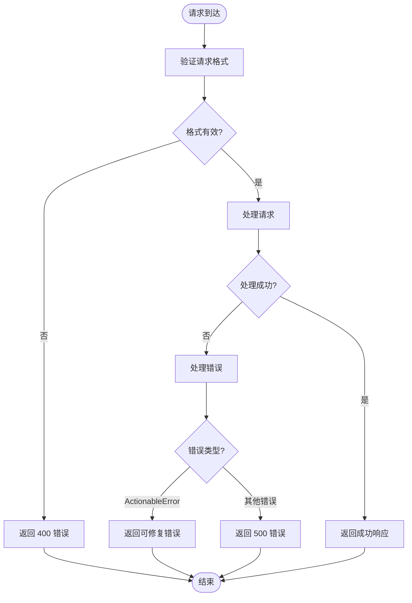
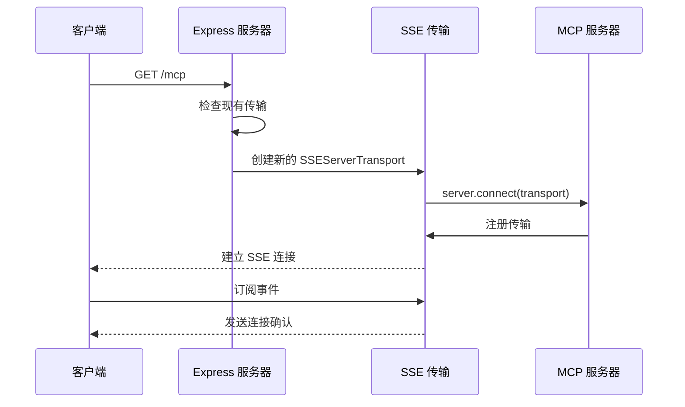
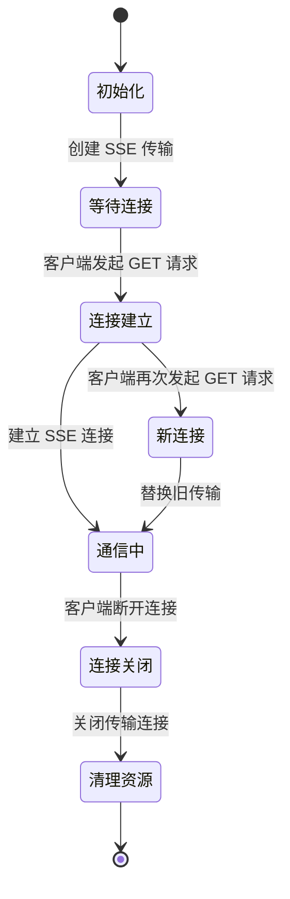
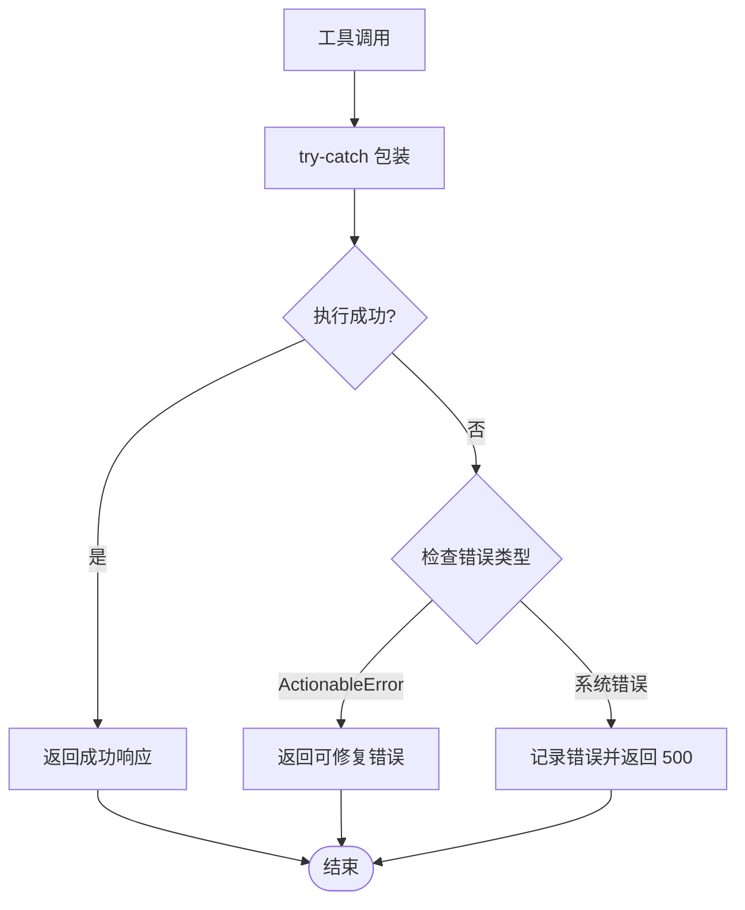

# HTTP API 接口

<cite>
**本文档引用的文件**
- [src/index.ts](file://src/index.ts)
- [src/server.ts](file://src/server.ts)
- [package.json](file://package.json)
- [README.md](file://README.md)
- [src/logger.ts](file://src/logger.ts)
- [src/robot.ts](file://src/robot.ts)
- [src/android.ts](file://src/android.ts)
- [src/harmony.ts](file://src/harmony.ts)
- [src/ios.ts](file://src/ios.ts)
</cite>

## 目录
1. [简介](#简介)
2. [项目结构](#项目结构)
3. [核心组件](#核心组件)
4. [架构概览](#架构概览)
5. [详细组件分析](#详细组件分析)
6. [HTTP API 规范](#http-api-规范)
7. [SSE 连接管理](#sse-连接管理)
8. [错误处理机制](#错误处理机制)
9. [性能考虑](#性能考虑)
10. [故障排除指南](#故障排除指南)
11. [结论](#结论)

## 简介

Mobile MCP HarmonyOS 是一个基于 Model Context Protocol (MCP) 的移动设备自动化服务器，专门为 HarmonyOS、iOS 和 Android 平台提供统一的设备控制接口。该服务器实现了完整的 HTTP API 接口，支持通过 Express.js 提供的 SSE (Server-Sent Events) 连接进行实时通信。

该项目的核心特性包括：
- 支持 HarmonyOS、iOS、Android 三大平台的设备自动化
- 基于 MCP 协议的标准工具集
- 实时的 SSE 连接管理
- 结构化的设备状态管理和错误处理

## 项目结构

项目采用模块化设计，主要文件组织如下：



**图表来源**
- [src/index.ts:1-67](file://src/index.ts#L1-L67)
- [src/server.ts:1-708](file://src/server.ts#L1-L708)

**章节来源**
- [src/index.ts:1-67](file://src/index.ts#L1-L67)
- [src/server.ts:1-708](file://src/server.ts#L1-L708)
- [package.json:1-74](file://package.json#L1-L74)

## 核心组件

### MCP 服务器核心

MCP 服务器是整个系统的核心，负责：
- 注册和管理各种移动设备控制工具
- 处理客户端请求和响应
- 管理设备连接状态
- 实现错误处理和日志记录

### Express HTTP 服务器

Express 服务器提供 HTTP 接口，支持：
- GET /mcp - 建立 SSE 连接
- POST /mcp - 处理 MCP 消息
- 端口配置和网络绑定

### 设备抽象层

通过统一的 Robot 接口，支持多种设备类型：
- HarmonyOS 设备 (无需 mobilecli 依赖)
- Android 设备 (ADB 控制)
- iOS 设备 (WebDriverAgent)

**章节来源**
- [src/server.ts:35-707](file://src/server.ts#L35-L707)
- [src/index.ts:9-33](file://src/index.ts#L9-L33)
- [src/robot.ts:48-147](file://src/robot.ts#L48-L147)

## 架构概览



**图表来源**
- [src/index.ts:9-33](file://src/index.ts#L9-L33)
- [src/server.ts:35-707](file://src/server.ts#L35-L707)

## 详细组件分析

### Express 服务器实现

Express 服务器提供了简洁的 HTTP 接口实现：



**图表来源**
- [src/index.ts:9-33](file://src/index.ts#L9-L33)

### 设备管理架构



**图表来源**
- [src/robot.ts:48-147](file://src/robot.ts#L48-L147)
- [src/harmony.ts:43-200](file://src/harmony.ts#L43-L200)
- [src/android.ts:74-200](file://src/android.ts#L74-L200)
- [src/ios.ts:42-200](file://src/ios.ts#L42-L200)

**章节来源**
- [src/index.ts:9-33](file://src/index.ts#L9-L33)
- [src/robot.ts:48-147](file://src/robot.ts#L48-L147)
- [src/harmony.ts:43-200](file://src/harmony.ts#L43-L200)
- [src/android.ts:74-200](file://src/android.ts#L74-L200)
- [src/ios.ts:42-200](file://src/ios.ts#L42-L200)

## HTTP API 规范

### 基础信息

- **协议版本**: HTTP/1.1
- **默认端口**: 3000 (可配置)
- **服务器名称**: mobile-mcp
- **版本**: 0.2.0

### 端点定义

#### GET /mcp

**功能**: 建立 SSE 连接，用于实时双向通信

**请求参数**:
- 无查询参数

**响应头**:
- Content-Type: text/event-stream
- Cache-Control: no-cache
- Connection: keep-alive
- Access-Control-Allow-Origin: *

**响应体**: SSE 事件流

#### POST /mcp

**功能**: 处理 MCP 协议消息

**请求头**:
- Content-Type: application/json
- Accept: application/json

**请求体**: JSON 格式的 MCP 消息对象

**响应头**:
- Content-Type: application/json
- Access-Control-Allow-Origin: *

**响应体**: JSON 格式的 MCP 响应对象

### 请求/响应格式

#### 请求格式

所有请求必须遵循 MCP 协议规范，基本结构如下：

```json
{
  "jsonrpc": "2.0",
  "id": "unique-request-id",
  "method": "methodName",
  "params": {
    "parameter1": "value1",
    "parameter2": "value2"
  }
}
```

#### 响应格式

成功响应的基本结构：

```json
{
  "jsonrpc": "2.0",
  "id": "unique-request-id",
  "result": {
    "content": [
      {
        "type": "text",
        "text": "操作结果描述"
      }
    ]
  }
}
```

错误响应的基本结构：

```json
{
  "jsonrpc": "2.0",
  "id": "unique-request-id",
  "error": {
    "code": -32603,
    "message": "错误描述信息"
  }
}
```

### 状态码定义

| 状态码 | 描述 | 使用场景 |
|--------|------|----------|
| 200 | OK | 成功处理请求 |
| 400 | Bad Request | 请求格式错误或参数无效 |
| 404 | Not Found | 未找到指定端点 |
| 500 | Internal Server Error | 服务器内部错误 |
| 503 | Service Unavailable | 服务暂时不可用 |

### 错误处理

服务器实现了完善的错误处理机制：



**图表来源**
- [src/server.ts:79-94](file://src/server.ts#L79-L94)

**章节来源**
- [src/index.ts:15-28](file://src/index.ts#L15-L28)
- [src/server.ts:79-94](file://src/server.ts#L79-L94)

## SSE 连接管理

### 连接建立过程



**图表来源**
- [src/index.ts:21-28](file://src/index.ts#L21-L28)

### 连接生命周期



**图表来源**
- [src/index.ts:21-28](file://src/index.ts#L21-L28)

### 消息传递格式

SSE 连接支持双向消息传递：

1. **事件推送**: 服务器向客户端推送事件
2. **请求响应**: 客户端向服务器发送请求
3. **心跳检测**: 保持连接活跃

**章节来源**
- [src/index.ts:9-33](file://src/index.ts#L9-L33)

## 错误处理机制

### 错误分类

服务器将错误分为两类：

#### 可修复错误 (ActionableError)
- **触发条件**: 用户输入错误或配置问题
- **处理方式**: 返回详细错误信息，指导用户修复
- **HTTP 状态**: 200 (逻辑错误，但连接仍有效)

#### 系统错误
- **触发条件**: 服务器内部异常或外部依赖失败
- **处理方式**: 返回 500 错误，记录详细日志
- **HTTP 状态**: 500

### 错误传播



**图表来源**
- [src/server.ts:79-94](file://src/server.ts#L79-L94)

### 日志记录

服务器实现了统一的日志记录机制：

- **日志级别**: INFO
- **输出目标**: 控制台和可选文件
- **日志格式**: ISO 时间戳 + 日志级别 + 消息
- **环境变量**: LOG_FILE (可选，指定日志文件路径)

**章节来源**
- [src/server.ts:79-94](file://src/server.ts#L79-L94)
- [src/logger.ts:1-22](file://src/logger.ts#L1-L22)

## 性能考虑

### 连接池管理

服务器实现了智能的连接池管理：
- **单连接限制**: 每个实例只维护一个活动的 SSE 连接
- **连接复用**: 新连接建立时自动关闭旧连接
- **资源清理**: 连接关闭时释放相关资源

### 内存优化

- **图像处理**: 截图自动压缩，减少内存占用
- **缓冲区大小**: 限制最大缓冲区大小 (4MB)
- **超时控制**: 设置合理的操作超时时间 (30秒)

### 并发处理

- **异步处理**: 所有设备操作都是异步的
- **错误隔离**: 单个操作失败不影响其他操作
- **资源保护**: 设备操作加锁，避免并发冲突

## 故障排除指南

### 常见问题及解决方案

#### 1. 端口占用问题

**症状**: 启动服务器时报端口被占用错误

**解决方案**:
```bash
# 查看端口占用情况
lsof -i :3000

# 更换端口启动
node lib/index.js --port 3001
```

#### 2. 设备连接失败

**症状**: 设备列表为空或操作失败

**排查步骤**:
1. 检查设备连接状态
2. 验证平台特定工具是否正确安装
3. 确认权限设置

#### 3. SSE 连接中断

**症状**: 客户端无法接收服务器推送的消息

**解决方案**:
1. 检查网络连接稳定性
2. 验证防火墙设置
3. 确认客户端支持 SSE 协议

### 调试模式

启用调试日志：
```bash
# 设置日志文件
export LOG_FILE=/tmp/mobile-mcp.log

# 启动服务器
node lib/index.js --port 3000
```

### 性能监控

监控要点：
- **连接数**: 当前活跃连接数量
- **响应时间**: 平均请求处理时间
- **错误率**: 错误请求比例
- **内存使用**: 进程内存占用情况

**章节来源**
- [src/index.ts:50-64](file://src/index.ts#L50-L64)
- [src/logger.ts:1-22](file://src/logger.ts#L1-L22)

## 结论

Mobile MCP HarmonyOS 的 HTTP API 接口设计充分体现了现代 Web 服务的最佳实践：

### 技术优势

1. **标准化协议**: 完全符合 MCP 协议规范
2. **实时通信**: 基于 SSE 的双向实时通信
3. **平台兼容**: 统一接口支持三大移动平台
4. **错误处理**: 完善的错误分类和处理机制
5. **可扩展性**: 模块化设计便于功能扩展

### 使用建议

1. **生产环境部署**: 建议使用反向代理 (如 Nginx) 进行负载均衡
2. **安全考虑**: 在企业环境中添加身份验证和访问控制
3. **监控告警**: 建立完善的监控和告警机制
4. **备份策略**: 定期备份配置和日志文件

### 未来发展

- **WebSocket 支持**: 考虑添加 WebSocket 作为替代传输协议
- **认证机制**: 实现更完善的用户认证和授权
- **性能优化**: 进一步优化大文件传输和并发处理能力
- **API 文档**: 生成自动生成的 API 文档

该 HTTP API 接口为 Mobile MCP HarmonyOS 提供了稳定可靠的通信基础，支持各种 MCP 客户端的无缝集成。