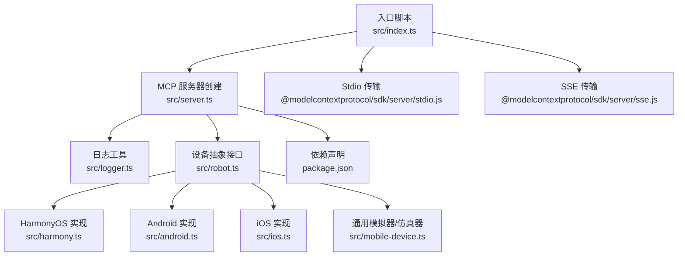
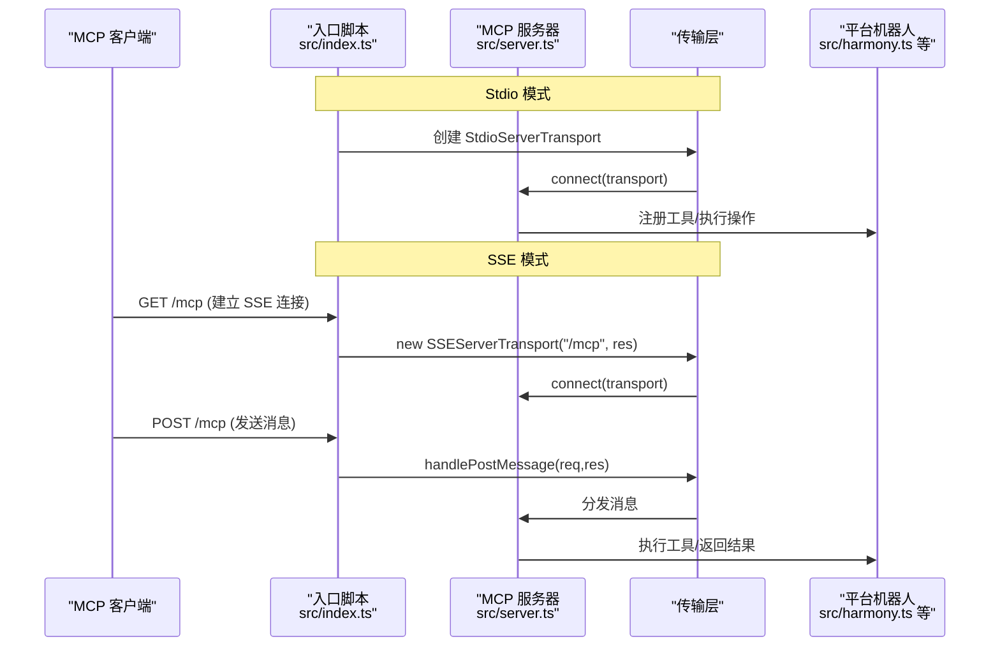
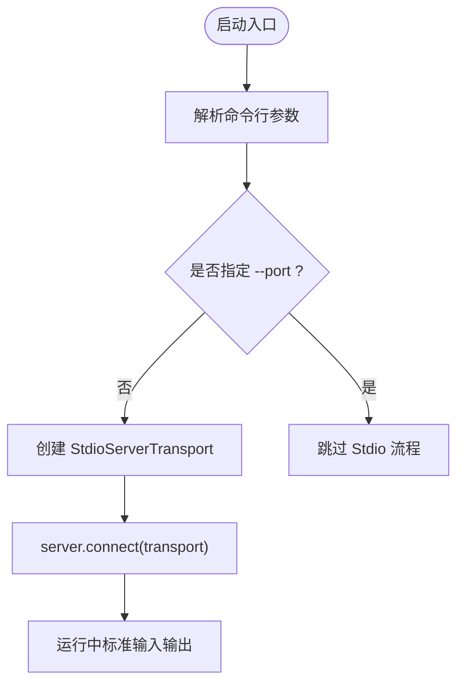
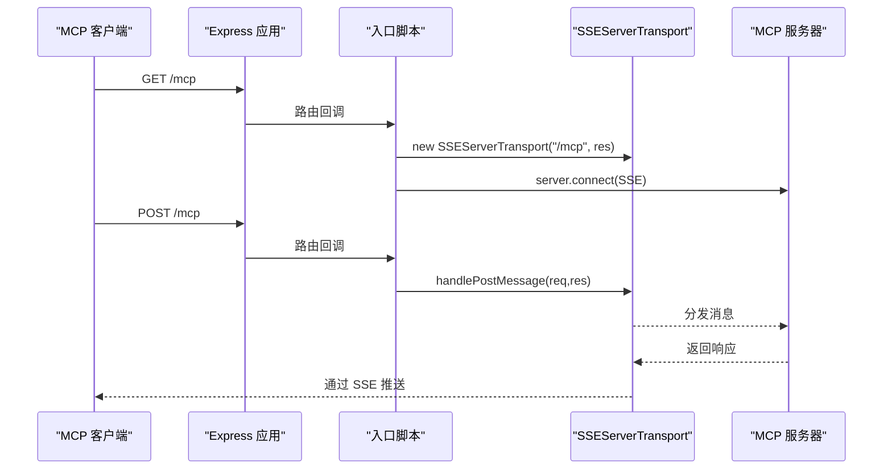
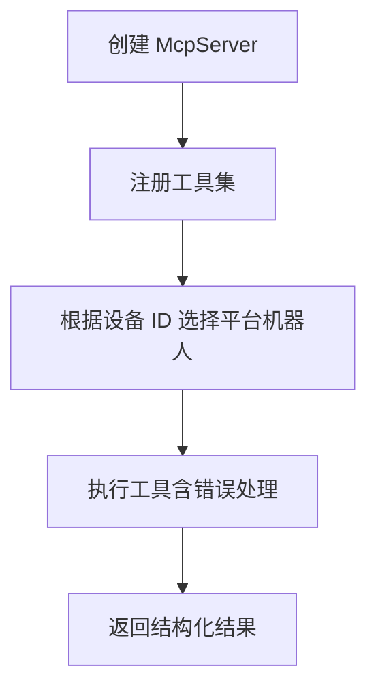
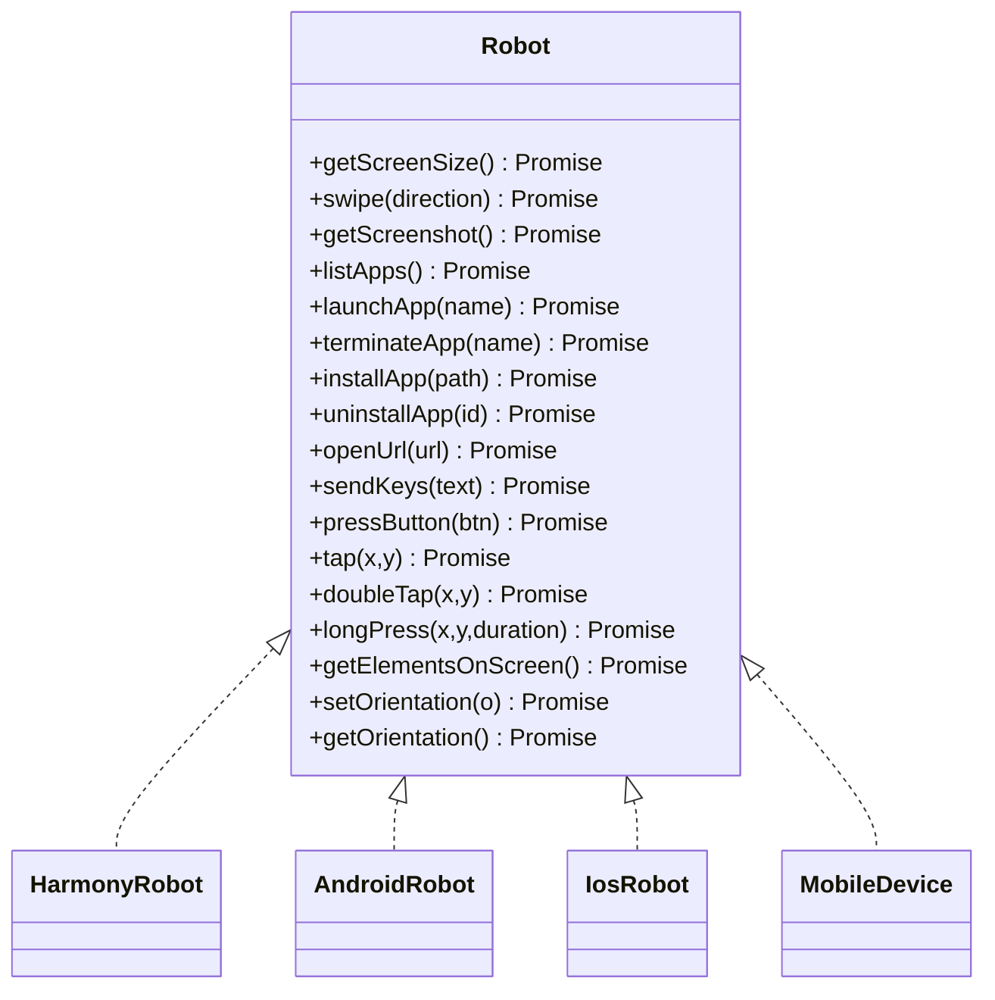
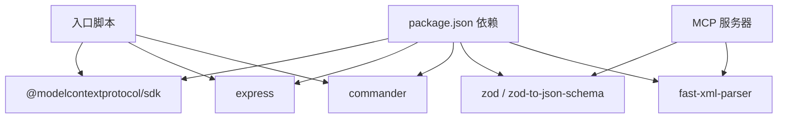

# 传输协议

<cite>
**本文引用的文件**
- [src/index.ts](file://src/index.ts)
- [src/server.ts](file://src/server.ts)
- [src/logger.ts](file://src/logger.ts)
- [src/mobilecli.ts](file://src/mobilecli.ts)
- [src/robot.ts](file://src/robot.ts)
- [src/harmony.ts](file://src/harmony.ts)
- [src/android.ts](file://src/android.ts)
- [src/ios.ts](file://src/ios.ts)
- [src/mobile-device.ts](file://src/mobile-device.ts)
- [package.json](file://package.json)
- [README.md](file://README.md)
</cite>

## 目录
1. [简介](#简介)
2. [项目结构](#项目结构)
3. [核心组件](#核心组件)
4. [架构总览](#架构总览)
5. [详细组件分析](#详细组件分析)
6. [依赖分析](#依赖分析)
7. [性能考量](#性能考量)
8. [故障排查指南](#故障排查指南)
9. [结论](#结论)
10. [附录](#附录)

## 简介
本文件面向 Mobile MCP HarmonyOS 项目，系统化阐述两种传输协议的工作原理、配置方法与使用场景：
- Stdio 传输：通过标准输入输出进行双向通信，适合本地命令行直接运行与集成。
- SSE（Server-Sent Events）传输：基于 HTTP 的服务端推送事件，适合需要通过 HTTP 通道与 MCP 客户端交互的环境。

文档同时提供传输协议选择指南、性能对比、最佳实践、安全与错误处理建议，以及在不同环境中的配置示例与代码片段路径。

## 项目结构
该项目以模块化方式组织，入口文件负责解析命令行参数并选择传输模式；核心服务器封装 MCP 工具集；各平台机器人实现具体设备控制逻辑；日志与辅助工具提供可观测性与诊断能力。

**图表来源**
- [src/index.ts:1-66](file://src/index.ts#L1-L66)
- [src/server.ts:1-708](file://src/server.ts#L1-L708)
- [src/logger.ts:1-22](file://src/logger.ts#L1-L22)
- [src/robot.ts:1-148](file://src/robot.ts#L1-L148)
- [src/harmony.ts:1-462](file://src/harmony.ts#L1-L462)
- [src/android.ts:1-593](file://src/android.ts#L1-L593)
- [src/ios.ts:1-294](file://src/ios.ts#L1-L294)
- [src/mobile-device.ts:1-217](file://src/mobile-device.ts#L1-L217)
- [package.json:1-74](file://package.json#L1-L74)

**章节来源**
- [src/index.ts:1-66](file://src/index.ts#L1-L66)
- [src/server.ts:1-708](file://src/server.ts#L1-L708)
- [package.json:1-74](file://package.json#L1-L74)

## 核心组件
- 入口与传输选择
  - 解析命令行参数，支持 --port 与 --stdio 选项，决定启动 SSE 或 Stdio 模式。
  - SSE 模式：创建 Express 应用，注册 /mcp GET（建立 SSE 连接）与 /mcp POST（接收消息）端点。
  - Stdio 模式：直接创建 StdioServerTransport 并连接 MCP 服务器。
- MCP 服务器
  - 注册工具集（设备管理、应用管理、屏幕交互、输入与导航等），并封装错误处理与遥测上报。
- 平台机器人
  - HarmonyOS：通过 hdc/uitest/hidumper 等工具直接驱动设备。
  - Android：通过 ADB 与 UIAutomator。
  - iOS：通过 WebDriverAgent（WDA）与隧道转发。
  - 通用模拟器/仿真器：通过 mobilecli 执行命令。
- 日志与可观测性
  - 统一日志输出与可选文件落盘，便于问题定位。

**章节来源**
- [src/index.ts:9-48](file://src/index.ts#L9-L48)
- [src/server.ts:35-707](file://src/server.ts#L35-L707)
- [src/harmony.ts:43-416](file://src/harmony.ts#L43-L416)
- [src/android.ts:74-504](file://src/android.ts#L74-L504)
- [src/ios.ts:42-232](file://src/ios.ts#L42-L232)
- [src/mobile-device.ts:62-216](file://src/mobile-device.ts#L62-L216)
- [src/logger.ts:1-22](file://src/logger.ts#L1-L22)

## 架构总览
下图展示两种传输模式的请求/响应与连接生命周期：

**图表来源**
- [src/index.ts:9-33](file://src/index.ts#L9-L33)
- [src/index.ts:35-48](file://src/index.ts#L35-L48)
- [src/server.ts:35-40](file://src/server.ts#L35-L40)

## 详细组件分析

### Stdio 传输模式
- 工作原理
  - 通过标准输入输出与 MCP 客户端进行双向通信，无需额外网络监听。
  - 入口脚本创建 StdioServerTransport 并调用 server.connect(transport) 完成连接。
- 配置与使用
  - 默认模式，无需额外参数；如需切换到 SSE，请使用 --port <port>。
  - 适合本地调试、容器内直接运行、与终端集成的场景。
- 错误处理与退出
  - 异常时记录堆栈并以非零状态码退出，便于外部进程监控。
- 性能特征
  - 无网络开销，延迟低；受限于进程间 I/O 性能与缓冲区大小。

**图表来源**
- [src/index.ts:50-64](file://src/index.ts#L50-L64)
- [src/index.ts:35-48](file://src/index.ts#L35-L48)

**章节来源**
- [src/index.ts:35-48](file://src/index.ts#L35-L48)
- [src/logger.ts:19-21](file://src/logger.ts#L19-L21)

### SSE 传输模式
- 工作原理
  - 基于 Express 提供 HTTP 服务，/mcp GET 建立 SSE 连接，/mcp POST 处理客户端发送的消息。
  - 入口脚本在每次 GET 请求时创建新的 SSEServerTransport，并在关闭旧连接后重新连接。
- 配置与使用
  - 使用 --port <port> 启动 HTTP 服务，监听指定端口。
  - 适合需要通过 HTTP 通道与 MCP 客户端交互的环境（例如某些 IDE 插件或远程客户端）。
- 连接管理
  - 每次 GET 请求都会关闭之前的传输并创建新的 SSEServerTransport，确保每次连接都是独立的。
- 性能特征
  - 存在网络往返与 HTTP 处理开销；适合跨网络或需要 HTTP 生态集成的场景。

**图表来源**
- [src/index.ts:9-33](file://src/index.ts#L9-L33)

**章节来源**
- [src/index.ts:9-33](file://src/index.ts#L9-L33)

### MCP 服务器与工具注册
- 服务器初始化
  - 创建 McpServer，设置名称与版本，注册工具集。
- 工具注册与错误处理
  - 工具执行前记录入参与耗时；异常时区分“可操作错误”与“真实异常”，并返回结构化内容。
- 设备选择逻辑
  - 优先检测 HarmonyOS 设备（无需 mobilecli），再检测 iOS/Android 设备；最后回退到通用模拟器/仿真器。
- 截图与图像处理
  - 支持 PNG/JPEG 格式识别与缩放优化，降低传输体积。

**图表来源**
- [src/server.ts:35-95](file://src/server.ts#L35-L95)
- [src/server.ts:149-197](file://src/server.ts#L149-L197)
- [src/server.ts:585-672](file://src/server.ts#L585-L672)

**章节来源**
- [src/server.ts:35-95](file://src/server.ts#L35-L95)
- [src/server.ts:149-197](file://src/server.ts#L149-L197)
- [src/server.ts:585-672](file://src/server.ts#L585-L672)

### 平台机器人实现要点
- HarmonyOS
  - 通过 hdc/uitest/hidumper/snapshot_display/bm/aa 等工具直接驱动设备，无需 mobilecli。
  - 支持截图、点击、滑动、按键、应用管理、无障碍布局 dump 等。
- Android
  - 通过 ADB 与 UIAutomator，支持多显示器场景下的截图与无障碍树解析。
- iOS
  - 通过 WebDriverAgent（WDA）与隧道转发，支持端口连通性检查与工具链依赖校验。
- 通用模拟器/仿真器
  - 通过 mobilecli 执行命令，统一设备抽象接口。

**图表来源**
- [src/robot.ts:48-147](file://src/robot.ts#L48-L147)
- [src/harmony.ts:43-416](file://src/harmony.ts#L43-L416)
- [src/android.ts:74-504](file://src/android.ts#L74-L504)
- [src/ios.ts:42-232](file://src/ios.ts#L42-L232)
- [src/mobile-device.ts:62-216](file://src/mobile-device.ts#L62-L216)

**章节来源**
- [src/harmony.ts:43-416](file://src/harmony.ts#L43-L416)
- [src/android.ts:74-504](file://src/android.ts#L74-L504)
- [src/ios.ts:42-232](file://src/ios.ts#L42-L232)
- [src/mobile-device.ts:62-216](file://src/mobile-device.ts#L62-L216)

## 依赖分析
- 传输层依赖
  - @modelcontextprotocol/sdk 提供 StdioServerTransport 与 SSEServerTransport。
  - Express 用于 SSE 模式的 HTTP 服务。
- 平台工具链
  - HarmonyOS：hdc/uitest/hidumper/snapshot_display/bm/aa。
  - Android：ADB 与 UIAutomator。
  - iOS：WebDriverAgent（WDA）与 go-ios。
  - 通用：mobilecli。
- 其他依赖
  - fast-xml-parser 用于解析 Android UIAutomator 输出。
  - commander 用于命令行参数解析。
  - zod 与 zod-to-json-schema 用于工具输入校验。

**图表来源**
- [package.json:29-39](file://package.json#L29-L39)
- [package.json:40-59](file://package.json#L40-L59)
- [src/index.ts:2-7](file://src/index.ts#L2-L7)
- [src/server.ts:1-16](file://src/server.ts#L1-L16)

**章节来源**
- [package.json:29-39](file://package.json#L29-L39)
- [package.json:40-59](file://package.json#L40-L59)
- [src/index.ts:2-7](file://src/index.ts#L2-L7)
- [src/server.ts:1-16](file://src/server.ts#L1-L16)

## 性能考量
- Stdio 模式
  - 优点：无网络开销，延迟低，适合本地与容器内运行。
  - 缺点：无法跨网络直接访问，不适合需要 HTTP 通道的集成场景。
- SSE 模式
  - 优点：通过 HTTP 通道与客户端交互，便于远程访问与生态集成。
  - 缺点：存在网络往返与 HTTP 处理开销；需注意连接复用与资源清理。
- 图像处理
  - 截图支持 PNG/JPEG 自动识别与缩放，可显著降低传输体积；建议在高分辨率设备上启用缩放策略。

[本节为通用性能讨论，不直接分析特定文件]

## 故障排查指南
- 常见问题与定位
  - Stdio 模式异常退出：查看日志输出与错误堆栈，确认致命错误并修正。
  - SSE 模式连接失败：检查端口占用与防火墙设置；确认 /mcp GET 是否成功建立连接。
  - 平台工具链缺失：HarmonyOS 需要 hdc；Android 需要 ADB；iOS 需要 go-ios 与 WDA；通用需要 mobilecli。
- 日志与可观测性
  - 使用 LOG_FILE 环境变量将日志写入文件，便于离线分析。
  - 工具执行耗时与错误事件会上报遥测，可用于性能与稳定性分析。
- 连接管理
  - SSE 模式下每次 GET 请求会关闭旧传输并创建新传输，避免连接泄漏；若出现连接异常，可重启服务端。

**章节来源**
- [src/logger.ts:1-22](file://src/logger.ts#L1-L22)
- [src/index.ts:43-47](file://src/index.ts#L43-L47)
- [src/server.ts:97-133](file://src/server.ts#L97-L133)

## 结论
- 选择指南
  - 本地调试与容器内运行：优先 Stdio 模式。
  - 需要 HTTP 通道或远程访问：选择 SSE 模式。
  - 跨平台设备自动化：HarmonyOS 无需 mobilecli，Android/iOS 需要相应工具链。
- 最佳实践
  - 明确日志输出与文件落盘策略，便于问题定位。
  - 对高分辨率设备启用截图缩放，降低传输成本。
  - 在生产环境中为 SSE 模式配置健康检查与超时重试。

[本节为总结性内容，不直接分析特定文件]

## 附录

### 传输协议选择指南
- 何时选择 Stdio
  - 本地命令行直接运行
  - 容器内与宿主进程直连
  - 不需要 HTTP 通道的集成场景
- 何时选择 SSE
  - 需要通过 HTTP 访问 MCP 客户端
  - 远程调试或跨网络部署
  - 需要与 HTTP 生态（如代理、网关）集成

[本节为概念性指导，不直接分析特定文件]

### 配置示例与代码片段路径
- 启动 Stdio 模式（默认）
  - 代码片段路径：[src/index.ts:50-64](file://src/index.ts#L50-L64)
- 启动 SSE 模式（指定端口）
  - 代码片段路径：[src/index.ts:59-60](file://src/index.ts#L59-L60)
- Express SSE 路由与传输创建
  - 代码片段路径：[src/index.ts:9-33](file://src/index.ts#L9-L33)
- MCP 服务器创建与工具注册
  - 代码片段路径：[src/server.ts:35-95](file://src/server.ts#L35-L95)
- 设备选择与平台适配
  - 代码片段路径：[src/server.ts:149-197](file://src/server.ts#L149-L197)
- 截图与图像处理
  - 代码片段路径：[src/server.ts:585-672](file://src/server.ts#L585-L672)
- 日志输出
  - 代码片段路径：[src/logger.ts:19-21](file://src/logger.ts#L19-L21)

**章节来源**
- [src/index.ts:50-64](file://src/index.ts#L50-L64)
- [src/index.ts:9-33](file://src/index.ts#L9-L33)
- [src/server.ts:35-95](file://src/server.ts#L35-L95)
- [src/server.ts:149-197](file://src/server.ts#L149-L197)
- [src/server.ts:585-672](file://src/server.ts#L585-L672)
- [src/logger.ts:19-21](file://src/logger.ts#L19-L21)

### 安全与错误处理
- 安全考虑
  - SSE 模式暴露 HTTP 端口，建议仅在受信任网络内运行，或结合反向代理与认证。
  - Stdio 模式无网络暴露面，但需关注进程权限与 I/O 安全。
- 错误处理
  - 工具执行异常分为“可操作错误”与“真实异常”，前者返回用户可读提示，后者返回错误标记以便上层处理。
  - 平台工具链缺失或不可用时，抛出可操作错误并引导安装与配置。

**章节来源**
- [src/server.ts:79-94](file://src/server.ts#L79-L94)
- [src/server.ts:138-147](file://src/server.ts#L138-L147)
- [src/harmony.ts:418-461](file://src/harmony.ts#L418-L461)
- [src/android.ts:506-592](file://src/android.ts#L506-L592)
- [src/ios.ts:234-293](file://src/ios.ts#L234-L293)