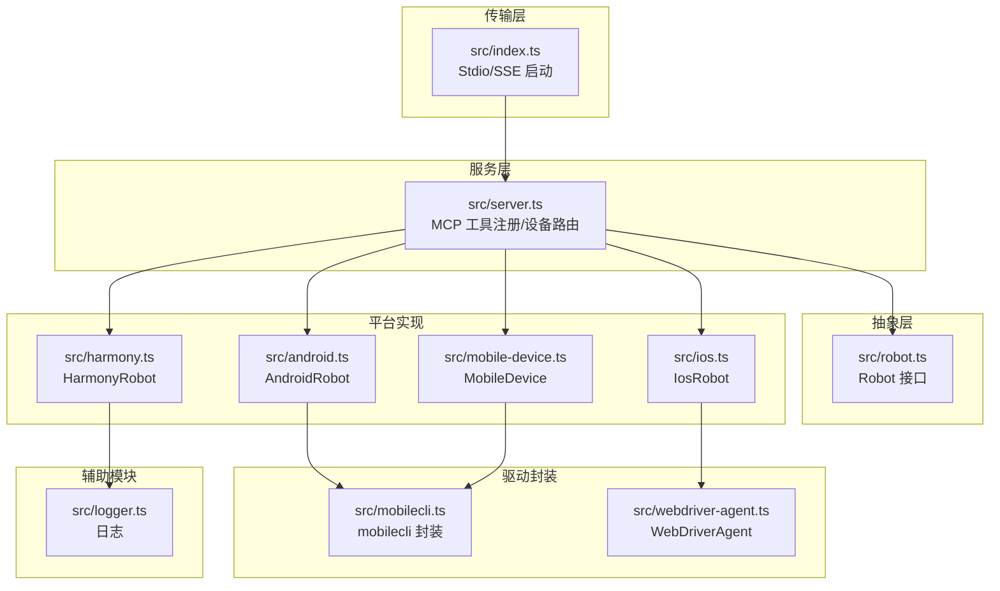
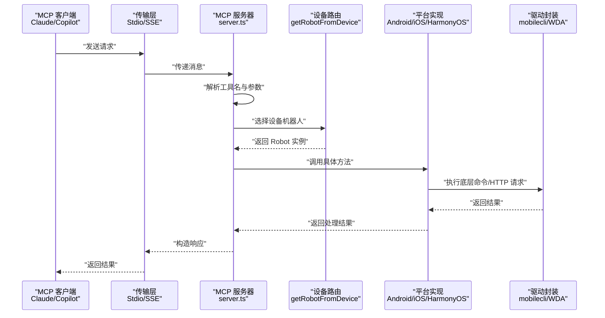
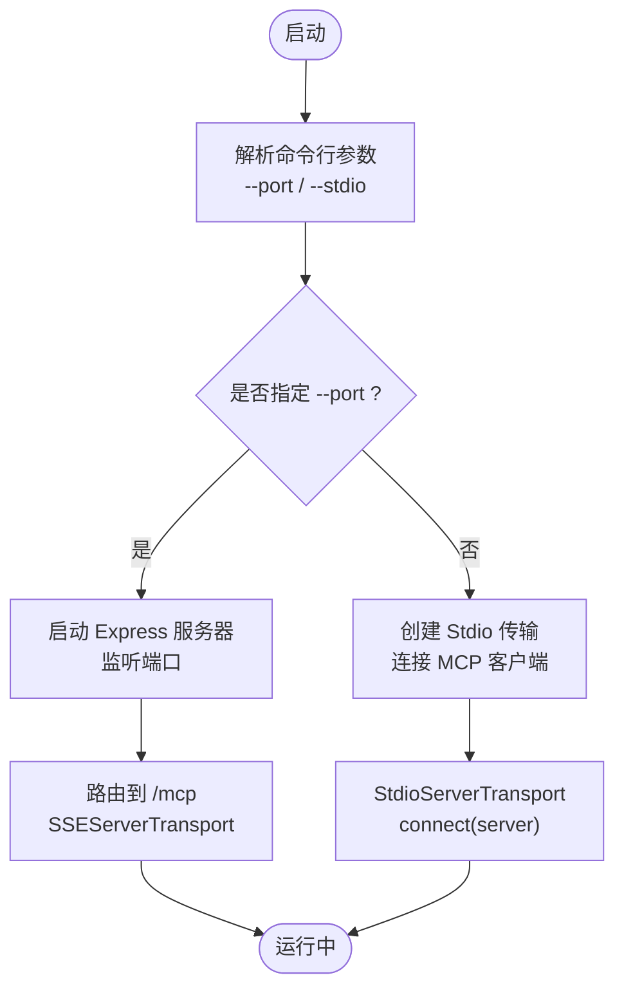
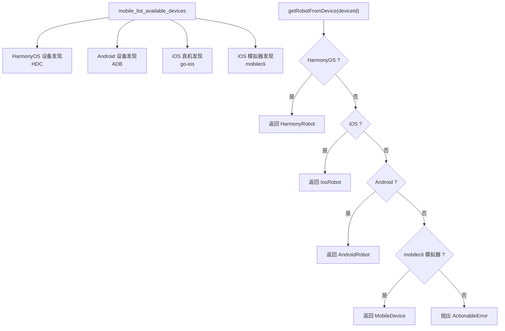
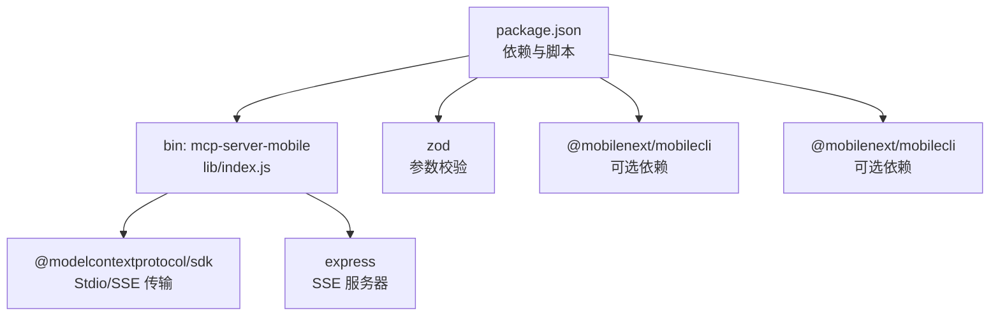

# MCP 客户端集成

<cite>
**本文引用的文件**
- [package.json](file://package.json)
- [README.md](file://README.md)
- [server.json](file://server.json)
- [src/index.ts](file://src/index.ts)
- [src/server.ts](file://src/server.ts)
- [src/robot.ts](file://src/robot.ts)
- [src/android.ts](file://src/android.ts)
- [src/ios.ts](file://src/ios.ts)
- [src/harmony.ts](file://src/harmony.ts)
- [src/mobile-device.ts](file://src/mobile-device.ts)
- [src/mobilecli.ts](file://src/mobilecli.ts)
- [src/webdriver-agent.ts](file://src/webdriver-agent.ts)
- [src/logger.ts](file://src/logger.ts)
- [DEEPWIKI.md](file://DEEPWIKI.md)
- [test/mobilecli.test.ts](file://test/mobilecli.test.ts)
</cite>

## 目录
1. [简介](#简介)
2. [项目结构](#项目结构)
3. [核心组件](#核心组件)
4. [架构总览](#架构总览)
5. [详细组件分析](#详细组件分析)
6. [依赖关系分析](#依赖关系分析)
7. [性能考虑](#性能考虑)
8. [故障排除指南](#故障排除指南)
9. [结论](#结论)
10. [附录](#附录)

## 简介
本指南面向希望在 Claude、VS Code Copilot 等 MCP 客户端中集成移动自动化工具的开发者。项目基于 Model Context Protocol（MCP）协议，提供统一的移动端自动化能力，覆盖 iOS、Android 与 HarmonyOS（鸿蒙）设备，支持设备发现、应用管理、屏幕交互、输入导航、截图与 UI 元素提取等工具。

## 项目结构
项目采用分层架构，核心文件如下：
- 入口与传输层：src/index.ts（Stdio/SSE 服务器启动）
- 服务层：src/server.ts（MCP 工具注册、设备路由）
- 抽象层：src/robot.ts（Robot 接口）
- 平台实现：src/android.ts、src/ios.ts、src/harmony.ts、src/mobile-device.ts
- 驱动封装：src/mobilecli.ts、src/webdriver-agent.ts
- 辅助模块：src/logger.ts、src/image-utils.ts、src/png.ts

图表来源
- [src/index.ts:1-67](file://src/index.ts#L1-L67)
- [src/server.ts:1-708](file://src/server.ts#L1-L708)
- [src/robot.ts:1-148](file://src/robot.ts#L1-L148)
- [src/android.ts:1-593](file://src/android.ts#L1-L593)
- [src/ios.ts:1-294](file://src/ios.ts#L1-L294)
- [src/harmony.ts:1-462](file://src/harmony.ts#L1-L462)
- [src/mobile-device.ts:1-217](file://src/mobile-device.ts#L1-L217)
- [src/mobilecli.ts:1-136](file://src/mobilecli.ts#L1-L136)
- [src/webdriver-agent.ts:1-455](file://src/webdriver-agent.ts#L1-L455)
- [src/logger.ts:1-22](file://src/logger.ts#L1-L22)

章节来源
- [DEEPWIKI.md:32-54](file://DEEPWIKI.md#L32-L54)
- [package.json:1-74](file://package.json#L1-L74)

## 核心组件
- MCP 服务器与工具注册：在 src/server.ts 中创建 MCP 服务器实例，注册 20 个工具（设备管理、应用管理、屏幕交互、输入导航等），并通过 getRobotFromDevice 根据设备类型分发到具体平台实现。
- 传输层：src/index.ts 提供 Stdio（默认）与 SSE（HTTP）两种传输模式，分别用于本地集成与远程场景。
- Robot 接口：src/robot.ts 定义统一的设备操作抽象，所有平台实现均遵循该接口。
- 平台实现：
  - Android：通过 ADB 执行设备操作，解析 UIAutomator XML 获取 UI 元素。
  - iOS：通过 go-ios + WebDriverAgent（WDA）控制真机与模拟器。
  - HarmonyOS：通过 HDC + uitest + hidumper 等工具直接驱动设备。
  - 通用设备：通过 mobilecli 二进制工具桥接。
- 驱动封装：mobilecli.ts 封装原生二进制工具调用；webdriver-agent.ts 封装 WDA HTTP API。
- 日志与遥测：logger.ts 输出到 stderr 并可写入文件；server.ts 内置 PostHog 遥测上报。

章节来源
- [src/server.ts:35-708](file://src/server.ts#L35-L708)
- [src/index.ts:9-67](file://src/index.ts#L9-L67)
- [src/robot.ts:48-148](file://src/robot.ts#L48-L148)
- [src/android.ts:74-504](file://src/android.ts#L74-L504)
- [src/ios.ts:42-232](file://src/ios.ts#L42-L232)
- [src/harmony.ts:43-416](file://src/harmony.ts#L43-L416)
- [src/mobile-device.ts:62-216](file://src/mobile-device.ts#L62-L216)
- [src/mobilecli.ts:27-135](file://src/mobilecli.ts#L27-L135)
- [src/webdriver-agent.ts:25-454](file://src/webdriver-agent.ts#L25-L454)
- [src/logger.ts:1-22](file://src/logger.ts#L1-L22)

## 架构总览
MCP 客户端通过 Stdio 或 SSE 与服务器通信，服务器根据工具名与参数调用相应处理器，处理器通过设备路由选择具体平台实现，最终由平台驱动执行设备操作。

图表来源
- [src/index.ts:9-67](file://src/index.ts#L9-L67)
- [src/server.ts:149-197](file://src/server.ts#L149-L197)
- [src/android.ts:79-504](file://src/android.ts#L79-L504)
- [src/ios.ts:77-232](file://src/ios.ts#L77-L232)
- [src/harmony.ts:48-416](file://src/harmony.ts#L48-L416)
- [src/mobile-device.ts:70-216](file://src/mobile-device.ts#L70-L216)
- [src/mobilecli.ts:39-135](file://src/mobilecli.ts#L39-L135)
- [src/webdriver-agent.ts:30-454](file://src/webdriver-agent.ts#L30-L454)

## 详细组件分析

### 传输层与启动参数
- Stdio 模式（默认）：通过标准输入/输出与 MCP 客户端通信，适合本地集成（如 Claude Desktop、VS Code Copilot）。
- SSE 模式：启动 Express 服务器，监听 --port 参数，提供 GET /mcp 建立 SSE 连接与 POST /mcp 发送消息，适合远程/Web 场景。
- 启动入口：package.json 的 bin 字段将命令 mcp-server-mobile 指向 lib/index.js。

图表来源
- [src/index.ts:50-67](file://src/index.ts#L50-L67)
- [src/index.ts:9-33](file://src/index.ts#L9-L33)
- [src/index.ts:35-48](file://src/index.ts#L35-L48)
- [package.json:62-64](file://package.json#L62-L64)

章节来源
- [src/index.ts:9-67](file://src/index.ts#L9-L67)
- [README.md:100-172](file://README.md#L100-L172)
- [package.json:62-64](file://package.json#L62-L64)

### MCP 工具注册与设备路由
- 工具注册：server.ts 使用 registerTool 注册 20 个工具，每个工具定义输入参数 Schema（Zod），并返回文本或图片内容。
- 设备路由：getRobotFromDevice 根据设备 ID 优先判断 HarmonyOS（无 mobilecli 依赖），再检查 iOS（go-ios + WDA），然后 Android（ADB），最后 mobilecli 模拟器，找不到则抛出可修复错误。
- 错误处理：ActionableError 用于提示用户修复（如设备未连接、工具未安装），普通 Error 标记为 isError 并返回错误前缀。

图表来源
- [src/server.ts:199-295](file://src/server.ts#L199-L295)
- [src/server.ts:149-197](file://src/server.ts#L149-L197)
- [src/server.ts:209-294](file://src/server.ts#L209-L294)

章节来源
- [src/server.ts:35-708](file://src/server.ts#L35-L708)
- [src/robot.ts:48-148](file://src/robot.ts#L48-L148)

### 平台实现要点

#### Android 实现（ADB）
- 截图：adb exec-out screencap -p；多屏设备通过 display ID 指定。
- 点击/滑动/长按：adb shell input tap/swipe/keyevent。
- UI 元素：adb exec-out uiautomator dump /dev/tty → XML 解析。
- 应用管理：adb shell am（启动/停止）、adb install/uninstall。
- 屏幕尺寸/方向：wm size、settings get/put system user_rotation。

章节来源
- [src/android.ts:79-504](file://src/android.ts#L79-L504)

#### iOS 实现（go-ios + WDA）
- 截图：WDA /screenshot 返回 base64 PNG。
- 点击/滑动/长按：WDA W3C Actions API /session/{id}/actions。
- 输入/按键：/wda/keys、/wda/pressButton。
- UI 元素：/source/?format=json → SourceTree 过滤。
- 应用管理：go-ios cli（ios launch/kill/install/uninstall）。
- 屏幕尺寸/方向：/wda/screen、/orientation。

章节来源
- [src/ios.ts:77-232](file://src/ios.ts#L77-L232)
- [src/webdriver-agent.ts:25-454](file://src/webdriver-agent.ts#L25-L454)

#### HarmonyOS 实现（HDC）
- 截图：snapshot_display → 文件传输 recv → 本地读取。
- 点击/滑动/长按：uitest uiInput click/swipe/longClick。
- 输入：uitest uiInput inputText（焦点元素或中心坐标）。
- UI 元素：uitest dumpLayout → JSON 解析。
- 应用管理：bm dump/start/force-stop、aa start/force-stop。
- 屏幕尺寸/方向：hidumper DisplayManagerService。

章节来源
- [src/harmony.ts:48-416](file://src/harmony.ts#L48-L416)

#### 通用设备（mobilecli）
- 通过 mobilecli 二进制工具桥接，命令映射到设备操作（如 device info、io tap、screenshot、apps list 等）。

章节来源
- [src/mobile-device.ts:70-216](file://src/mobile-device.ts#L70-L216)
- [src/mobilecli.ts:39-135](file://src/mobilecli.ts#L39-L135)

### 工具定义与参数规范
- 工具注册：使用 registerTool(name, metadata, handler) 定义工具，输入参数通过 Zod Schema 校验。
- 示例工具（节选）：
  - mobile_list_available_devices：无参数，返回设备列表（含 HarmonyOS、Android、iOS 真机/模拟器）。
  - mobile_get_screen_size：device（设备标识），返回屏幕尺寸。
  - mobile_take_screenshot：device，返回图片内容（image/png 或 image/jpeg，按需压缩）。
  - mobile_list_elements_on_screen：device，返回 UI 元素列表（type、text、label、identifier、rect、focused）。
  - mobile_click_on_screen_at_coordinates：device、x、y，返回点击结果。
  - mobile_swipe_on_screen：device、direction（up/down/left/right）、x/y（可选）、distance（可选）。
  - mobile_type_keys：device、text、submit（布尔），支持提交。
  - mobile_press_button：device、button（HOME/BACK/VOLUME_UP/DOWN/ENTER 等）。
  - mobile_open_url：device、url。
  - mobile_list_apps / mobile_launch_app / mobile_terminate_app / mobile_install_app / mobile_uninstall_app：应用管理工具。
  - mobile_get_orientation / mobile_set_orientation：屏幕方向（HarmonyOS 不支持程序化设置）。

章节来源
- [src/server.ts:199-704](file://src/server.ts#L199-L704)

### MCP 协议与消息格式
- 传输协议：Stdio（默认）与 SSE（HTTP）。
- 请求-响应循环：客户端发送工具调用请求，服务器解析参数、路由到平台实现、执行并返回文本或图片内容。
- 错误处理：ActionableError（可修复）与普通 Error（系统异常）区分返回格式与 isError 标记。

章节来源
- [src/index.ts:9-67](file://src/index.ts#L9-L67)
- [src/server.ts:62-95](file://src/server.ts#L62-L95)

### 客户端集成示例

#### Claude（桌面版）
- 使用 JSON 配置 mcpServers，命令指向 npx @ali/mobile-mcp-harmony@latest。
- 也可使用 Claude CLI 命令添加服务器。

章节来源
- [README.md:115-130](file://README.md#L115-L130)

#### VS Code / Copilot
- 在 ~/.copilot/mcp-config.json 中配置：
  - type: local
  - command: npx
  - tools: ["*"]
  - args: ["@ali/mobile-mcp-harmony@latest"]

章节来源
- [README.md:131-149](file://README.md#L131-L149)

#### 从源码构建与启动
- 构建：npm run build
- 启动（Stdio，默认）：node lib/index.js
- 启动（SSE）：node lib/index.js --port 3000

章节来源
- [README.md:151-172](file://README.md#L151-L172)

### 认证与安全配置
- 本项目未内置认证机制，建议通过以下方式保障安全：
  - 限制本地访问：仅在本机运行 Stdio 模式。
  - 使用反向代理：在 SSE 模式下通过 Nginx/HAProxy 限制来源 IP、启用 TLS。
  - 环境隔离：在容器或沙箱环境中运行，限制文件系统与网络权限。
  - 日志审计：通过 LOG_FILE 记录运行日志，便于审计。

章节来源
- [src/logger.ts:1-22](file://src/logger.ts#L1-22)
- [README.md:100-172](file://README.md#L100-L172)

## 依赖关系分析

图表来源
- [package.json:29-39](file://package.json#L29-L39)
- [package.json:62-64](file://package.json#L62-L64)
- [src/index.ts:2-7](file://src/index.ts#L2-L7)

章节来源
- [package.json:1-74](file://package.json#L1-L74)

## 性能考虑
- 截图优化：mobile_take_screenshot 在检测到有效 PNG/JPEG 后，若可用则进行缩放与 JPEG 压缩，降低传输体积与内存占用。
- 图像处理工具优先级：优先使用 macOS 内置 Sips，跨平台回退到 ImageMagick。
- 平台差异：Android 多屏设备通过 display ID 精确截图；iOS 通过 WDA 获取屏幕尺寸与方向；HarmonyOS 通过 hidumper 获取显示信息。
- 遥测：PostHog 匿名上报工具调用次数、耗时与截图大小，便于性能分析。

章节来源
- [src/server.ts:585-673](file://src/server.ts#L585-L673)
- [src/harmony.ts:55-69](file://src/harmony.ts#L55-L69)
- [src/ios.ts:110-113](file://src/ios.ts#L110-L113)
- [src/android.ts:103-116](file://src/android.ts#L103-L116)

## 故障排除指南
- 连接失败（Stdio）：
  - 检查 MCP 客户端配置是否正确指向 npx @ali/mobile-mcp-harmony@latest。
  - 确认 Node.js 版本满足 >= 18。
- 连接失败（SSE）：
  - 确认 --port 未被占用，且防火墙允许访问。
  - 检查服务器日志（LOG_FILE）与 stderr 输出。
- 设备不可用：
  - Android：检查 ANDROID_HOME 或 ADB 路径，确保 adb devices 正常。
  - iOS：确认 go-ios 安装与版本，iOS 17+ 需要 tunnel 与 WDA 端口转发。
  - HarmonyOS：确认 HDC 在 PATH 或设置 HDC_SDK_PATH，确保 hdc list targets 可用。
- 工具不可用（ActionableError）：
  - 移动端应用未安装、包名错误、URL 无效等，根据错误提示修复后重试。
- 截图异常：
  - 检查 PNG 验证与图像处理工具链（Sips/ImageMagick），确认缩放与压缩流程正常。
- 测试与验证：
  - 使用 test/mobilecli.test.ts 验证 mobilecli 的 getVersion 与 getDevices 行为。

章节来源
- [src/logger.ts:1-22](file://src/logger.ts#L1-22)
- [src/android.ts:32-54](file://src/android.ts#L32-L54)
- [src/ios.ts:33-40](file://src/ios.ts#L33-L40)
- [src/harmony.ts:12-18](file://src/harmony.ts#L12-L18)
- [test/mobilecli.test.ts:1-120](file://test/mobilecli.test.ts#L1-L120)

## 结论
本项目通过统一的 MCP 协议与 Robot 接口，实现了对 iOS、Android 与 HarmonyOS 的一致化自动化能力。结合 Stdio 与 SSE 两种传输模式，可在 Claude、VS Code Copilot 等客户端中灵活集成。通过严格的参数校验、错误分类与截图优化策略，兼顾易用性与性能。建议在生产环境中配合反向代理与日志审计，确保安全与可观测性。

## 附录

### MCP 服务器元数据
- server.json 定义了服务器名称、描述、仓库信息与包信息，声明默认传输为 stdio。

章节来源
- [server.json:1-22](file://server.json#L1-L22)

### 工具清单与注解
- 工具分为只读（readOnlyHint）与写入（destructiveHint）两类，便于客户端与用户理解工具风险与用途。

章节来源
- [src/server.ts:62-95](file://src/server.ts#L62-L95)