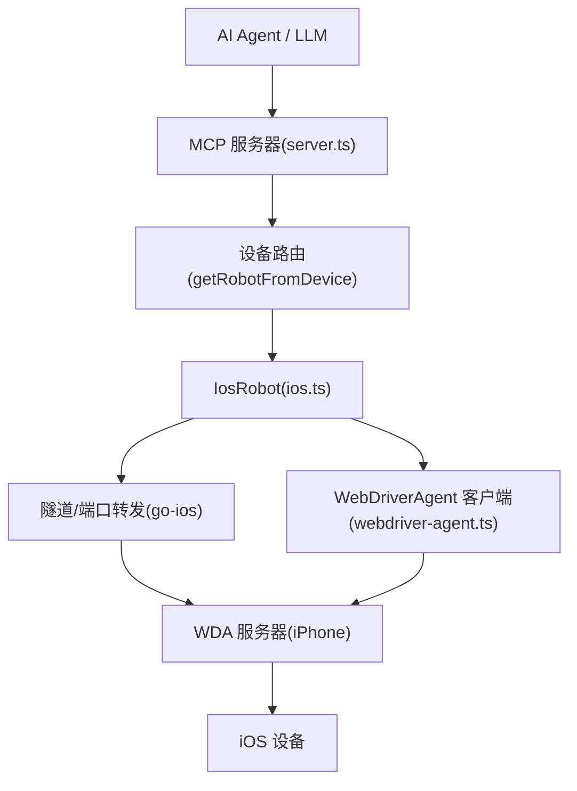
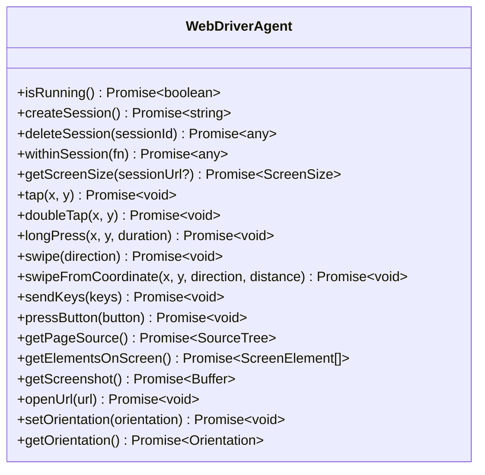
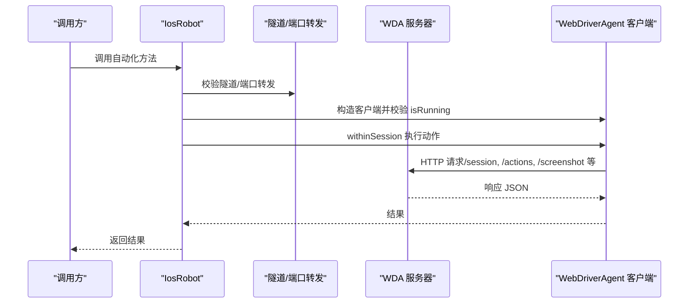
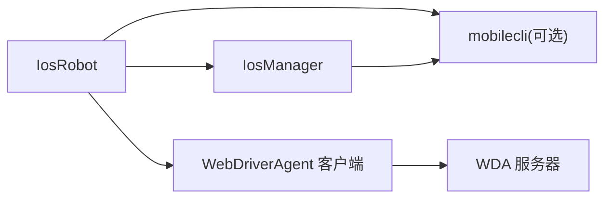

# WebDriverAgent 集成

<cite>
**本文引用的文件**
- [src/webdriver-agent.ts](file://src/webdriver-agent.ts)
- [src/ios.ts](file://src/ios.ts)
- [src/robot.ts](file://src/robot.ts)
- [src/server.ts](file://src/server.ts)
- [src/mobilecli.ts](file://src/mobilecli.ts)
- [README.md](file://README.md)
- [DEEPWIKI.md](file://DEEPWIKI.md)
- [package.json](file://package.json)
- [test/ios.ts](file://test/ios.ts)
</cite>

## 目录
1. [简介](#简介)
2. [项目结构](#项目结构)
3. [核心组件](#核心组件)
4. [架构总览](#架构总览)
5. [详细组件分析](#详细组件分析)
6. [依赖关系分析](#依赖关系分析)
7. [性能考量](#性能考量)
8. [故障排除指南](#故障排除指南)
9. [结论](#结论)
10. [附录](#附录)

## 简介
本文件围绕 WebDriverAgent（WDA）在 iOS 设备自动化中的集成与使用，结合仓库现有实现，系统阐述其工作机制、与 WDA 服务器的通信协议与消息格式、iOS 设备自动化控制（触摸、文本输入、应用管理、屏幕交互等）、服务器启动与配置（端口、网络访问）、与 iOS 真机/模拟器的连接方式（授权、信任、开发者模式），以及常见问题的排查思路。目标读者既包括需要快速上手的工程师，也包括希望深入理解实现细节的架构师。

## 项目结构
该项目基于 Model Context Protocol（MCP）提供统一的移动端自动化能力，支持 iOS、Android、HarmonyOS。与 WebDriverAgent 相关的关键模块如下：
- src/webdriver-agent.ts：WebDriverAgent HTTP 客户端封装，提供与 WDA 服务器的通信能力
- src/ios.ts：iOS 真机机器人实现，负责设备隧道、端口转发、WDA 可用性校验，并通过 WDA 客户端执行自动化动作
- src/robot.ts：跨平台抽象接口（Robot），定义统一的设备控制能力
- src/server.ts：MCP 服务器核心，注册工具、设备路由、错误处理与遥测
- src/mobilecli.ts：mobilecli 二进制工具封装（用于通用设备控制与 iOS 模拟器场景）
- README.md / DEEPWIKI.md：项目说明与深度技术文档
- package.json：依赖与脚本配置
- test/ios.ts：iOS 截图与屏幕尺寸一致性测试样例

```mermaid
graph TB
subgraph "MCP 服务器层"
Server["server.ts<br/>工具注册/设备路由"]
Index["index.ts<br/>传输层(Stdio/SSE)"]
end
subgraph "平台实现层"
IosRobot["ios.ts<br/>IosRobot"]
IosManager["ios.ts<br/>IosManager"]
AndroidRobot["android.ts<br/>AndroidRobot"]
HarmonyRobot["harmony.ts<br/>HarmonyRobot"]
end
subgraph "驱动与客户端"
WDA["webdriver-agent.ts<br/>WebDriverAgent 客户端"]
Mobilecli["mobilecli.ts<br/>mobilecli 封装"]
end
subgraph "抽象接口"
Robot["robot.ts<br/>Robot 接口"]
end
Index --> Server
Server --> IosRobot
Server --> AndroidRobot
Server --> HarmonyRobot
IosRobot --> WDA
IosRobot --> IosManager
IosRobot --> Mobilecli
IosManager --> Mobilecli
IosRobot --> Robot
AndroidRobot --> Robot
HarmonyRobot --> Robot
```

图表来源
- [src/server.ts:35-707](file://src/server.ts#L35-L707)
- [src/ios.ts:42-232](file://src/ios.ts#L42-L232)
- [src/webdriver-agent.ts:25-454](file://src/webdriver-agent.ts#L25-L454)
- [src/robot.ts:48-147](file://src/robot.ts#L48-L147)
- [src/mobilecli.ts:27-135](file://src/mobilecli.ts#L27-L135)

章节来源
- [README.md:1-198](file://README.md#L1-L198)
- [DEEPWIKI.md:32-54](file://DEEPWIKI.md#L32-L54)

## 核心组件
- WebDriverAgent 客户端（src/webdriver-agent.ts）
  - 提供与 WDA 服务器的 HTTP 通信封装，包括会话管理、屏幕尺寸、截图、元素树、输入、按键、滑动、点击、方向等
  - 使用 withinSession 模式自动创建/销毁会话，简化调用方逻辑
- iOS 真机机器人（src/ios.ts）
  - 通过 go-ios + 端口转发 + WDA 的组合实现 iOS 真机自动化
  - 在不同 iOS 版本（17+）下启用隧道（端口 60105）与 WDA 端口转发（端口 8100）
  - 通过 WebDriverAgent 客户端完成具体动作
- 抽象接口（src/robot.ts）
  - 定义统一的设备控制能力，便于在不同平台（iOS/Android/HarmonyOS）实现一致的调用体验
- MCP 服务器（src/server.ts）
  - 注册 20 个工具，设备路由到具体平台实现，统一错误处理与遥测上报
- mobilecli 封装（src/mobilecli.ts）
  - 封装原生二进制工具调用，用于通用设备控制与 iOS 模拟器场景

章节来源
- [src/webdriver-agent.ts:25-454](file://src/webdriver-agent.ts#L25-L454)
- [src/ios.ts:42-232](file://src/ios.ts#L42-L232)
- [src/robot.ts:48-147](file://src/robot.ts#L48-L147)
- [src/server.ts:35-707](file://src/server.ts#L35-L707)
- [src/mobilecli.ts:27-135](file://src/mobilecli.ts#L27-L135)

## 架构总览
下图展示了 iOS 真机自动化在本项目中的整体架构：MCP 服务器通过工具调用路由到 IosRobot，IosRobot 通过 go-ios 建立隧道与端口转发，再通过 WebDriverAgent 客户端与设备上的 WDA 服务器通信，最终完成自动化操作。

图表来源
- [src/server.ts:149-197](file://src/server.ts#L149-L197)
- [src/ios.ts:77-92](file://src/ios.ts#L77-L92)
- [src/webdriver-agent.ts:25-454](file://src/webdriver-agent.ts#L25-L454)

## 详细组件分析

### WebDriverAgent 客户端（src/webdriver-agent.ts）
- 会话管理
  - isRunning：通过 /status 检查 WDA 服务器就绪状态
  - createSession/deleteSession：遵循 WebDriver 协议创建/销毁会话
  - withinSession：自动创建会话并执行回调，结束后销毁会话
- 屏幕与方向
  - getScreenSize：获取屏幕物理尺寸与缩放比
  - setOrientation/getOrientation：设置与获取屏幕方向
- 触摸与手势
  - tap/doubleTap/longPress：通过 W3C Actions API 发送 pointer 事件
  - swipe/swipeFromCoordinate：基于屏幕比例或坐标计算滑动轨迹
- 文本与按键
  - sendKeys：向当前焦点元素输入文本
  - pressButton：按下设备物理按键（HOME/VOLUME_UP/DOWN/ENTER）
- 页面与元素
  - getPageSource：获取无障碍树（Accessibility Tree）
  - getElementsOnScreen：过滤可见 UI 元素并返回结构化数据
- 截图
  - getScreenshot：获取 base64 PNG 截图
- URL 打开
  - openUrl：在设备浏览器中打开 URL

图表来源
- [src/webdriver-agent.ts:25-454](file://src/webdriver-agent.ts#L25-L454)

章节来源
- [src/webdriver-agent.ts:25-454](file://src/webdriver-agent.ts#L25-L454)

### iOS 真机机器人（src/ios.ts）
- 设备隧道与端口转发
  - isListeningOnPort：检查隧道（端口 60105）与 WDA 端口（8100）是否就绪
  - isTunnelRequired：根据 iOS 版本判断是否需要隧道（17+）
  - assertTunnelRunning/isWdaForwardRunning：断言隧道与端口转发状态
- WDA 客户端初始化
  - wda：构造 WebDriverAgent 客户端并校验 isRunning
- 应用管理与设备信息
  - listApps/launchApp/terminateApp/installApp/uninstallApp：通过 go-ios CLI 实现
  - getIosVersion：获取设备 iOS 版本
- 自动化动作委托
  - 将所有 Robot 接口方法委托给 WebDriverAgent 客户端（截图、点击、滑动、输入、按键、方向等）

图表来源
- [src/ios.ts:77-92](file://src/ios.ts#L77-L92)
- [src/webdriver-agent.ts:71-77](file://src/webdriver-agent.ts#L71-L77)

章节来源
- [src/ios.ts:42-232](file://src/ios.ts#L42-L232)

### 通信协议与消息格式
- 会话管理
  - 创建会话：POST /session，请求体包含 capabilities（platformName: "iOS"）
  - 删除会话：DELETE /session/{sessionId}
- 屏幕与方向
  - 获取屏幕尺寸：GET /session/{id}/wda/screen
  - 设置方向：POST /session/{id}/orientation
  - 获取方向：GET /session/{id}/orientation
- 触摸与手势
  - W3C Actions：POST /session/{id}/actions，请求体为 actions 数组（pointerMove/pointerDown/pause/pointerUp）
- 文本与按键
  - 输入文本：POST /session/{id}/wda/keys，请求体包含 value 数组
  - 按键：POST /session/{id}/wda/pressButton，请求体包含 name
- 页面与元素
  - 获取页面源：GET /source/?format=json
  - 过滤可见元素：仅返回特定类型且可见的节点
- 截图
  - GET /screenshot，响应体包含 base64 PNG 数据
- URL 打开
  - POST /session/{id}/url，请求体包含 url

章节来源
- [src/webdriver-agent.ts:42-69](file://src/webdriver-agent.ts#L42-L69)
- [src/webdriver-agent.ts:79-101](file://src/webdriver-agent.ts#L79-L101)
- [src/webdriver-agent.ts:103-147](file://src/webdriver-agent.ts#L103-L147)
- [src/webdriver-agent.ts:149-174](file://src/webdriver-agent.ts#L149-L174)
- [src/webdriver-agent.ts:274-284](file://src/webdriver-agent.ts#L274-L284)
- [src/webdriver-agent.ts:295-300](file://src/webdriver-agent.ts#L295-L300)
- [src/webdriver-agent.ts:302-370](file://src/webdriver-agent.ts#L302-L370)
- [src/webdriver-agent.ts:372-431](file://src/webdriver-agent.ts#L372-L431)
- [src/webdriver-agent.ts:433-453](file://src/webdriver-agent.ts#L433-L453)

### iOS 设备自动化控制实现
- 触摸事件
  - tap/doubleTap/longPress：通过 W3C Actions API 发送 pointer 事件序列
- 文本输入
  - sendKeys：向当前焦点元素输入文本
- 应用管理
  - listApps/launchApp/terminateApp/installApp/uninstallApp：通过 go-ios CLI 实现
- 屏幕交互
  - getScreenshot：获取 base64 PNG 截图
  - getElementsOnScreen：解析无障碍树并过滤可见元素
  - setOrientation/getOrientation：设置与获取屏幕方向
- 与 iOS 真机/模拟器的连接
  - 真机：go-ios + 隧道（端口 60105）+ WDA 端口转发（8100）+ WDA 服务器
  - 模拟器：通过 mobilecli 或 simctl + WDA（无需隧道）

章节来源
- [src/ios.ts:110-231](file://src/ios.ts#L110-L231)
- [src/webdriver-agent.ts:149-174](file://src/webdriver-agent.ts#L149-L174)
- [src/webdriver-agent.ts:103-147](file://src/webdriver-agent.ts#L103-L147)
- [src/webdriver-agent.ts:295-300](file://src/webdriver-agent.ts#L295-L300)
- [src/webdriver-agent.ts:274-284](file://src/webdriver-agent.ts#L274-L284)
- [src/webdriver-agent.ts:433-453](file://src/webdriver-agent.ts#L433-L453)

### 服务器启动与配置
- 启动方式
  - Stdio 模式（默认）：通过标准输入/输出与 MCP 客户端通信
  - SSE 模式：启动 Express 服务器，监听指定端口，支持 GET/POST /mcp
- 端口设置
  - SSE 模式通过 --port 参数指定端口
  - iOS 真机隧道端口：60105（仅 iOS 17+）
  - WDA 端口：8100（需在设备上运行 WDA 并进行端口转发）
- SSL 证书与网络访问
  - 本项目未内置 SSL 证书配置；若需 HTTPS，请在上游网关或反向代理层配置
  - 网络访问权限由 go-ios 隧道与本地端口转发决定，确保防火墙放行相应端口

章节来源
- [src/index.ts:9-33](file://src/index.ts#L9-L33)
- [src/index.ts:50-67](file://src/index.ts#L50-L67)
- [src/ios.ts:7-8](file://src/ios.ts#L7-L8)

### 与 iOS 真机/模拟器的连接方式
- 真机
  - go-ios：设备发现、应用管理、隧道建立
  - 隧道端口：60105（iOS 17+）
  - WDA 端口：8100（需在设备上运行并进行端口转发）
  - WDA 服务器：设备上运行的 WebDriverAgent 服务
- 模拟器
  - mobilecli 或 simctl：模拟器控制与 WDA 集成
  - 无需隧道，WDA 可自动启动（检测到已安装但未运行时）
  - 支持 .zip 安装（自动解压提取 .app）

章节来源
- [src/ios.ts:104-108](file://src/ios.ts#L104-L108)
- [src/ios.ts:77-92](file://src/ios.ts#L77-L92)
- [DEEPWIKI.md:243-287](file://DEEPWIKI.md#L243-L287)

## 依赖关系分析
- 组件耦合
  - IosRobot 依赖 IosManager（设备发现）、WebDriverAgent（WDA 通信）、mobilecli（可选）
  - WebDriverAgent 与 WDA 服务器之间为 HTTP 通信，无强耦合
- 外部依赖
  - go-ios：iOS 设备通信与隧道
  - WDA：iOS UI 自动化代理（设备上运行）
  - mobilecli：通用设备控制（可选）
- 循环依赖
  - 未发现循环依赖；模块职责清晰，接口抽象良好

图表来源
- [src/ios.ts:42-232](file://src/ios.ts#L42-L232)
- [src/webdriver-agent.ts:25-454](file://src/webdriver-agent.ts#L25-L454)
- [src/mobilecli.ts:27-135](file://src/mobilecli.ts#L27-L135)

章节来源
- [src/ios.ts:42-232](file://src/ios.ts#L42-L232)
- [src/webdriver-agent.ts:25-454](file://src/webdriver-agent.ts#L25-L454)
- [src/mobilecli.ts:27-135](file://src/mobilecli.ts#L27-L135)

## 性能考量
- 截图优化
  - 截图链路：PNG → 缩放 → JPEG 压缩，降低传输体积
  - 依据屏幕 scale 进行缩放，提升传输效率
- 会话管理
  - withinSession 模式减少会话创建/销毁开销
- 错误处理
  - 使用 ActionableError 区分用户可修复错误与系统异常，避免重复重试

章节来源
- [src/server.ts:610-672](file://src/server.ts#L610-L672)
- [src/webdriver-agent.ts:71-77](file://src/webdriver-agent.ts#L71-L77)

## 故障排除指南
- 连接问题
  - 隧道未运行：检查 iOS 版本是否为 17+，确认隧道端口 60105 是否监听
  - 端口转发未运行：确认 WDA 端口 8100 是否转发成功
  - WDA 未运行：确认设备上 WDA 服务已启动
- 权限问题
  - iOS 授权与信任：确保设备已信任开发者账号与证书
  - 开发者模式：确保设备已开启开发者模式
- 网络问题
  - 防火墙：确保本地端口 60105/8100 放行
  - 代理：避免代理影响本地隧道与端口转发
- 常见错误定位
  - ActionableError：通常由设备未连接、工具未安装等导致，按提示修复后重试
  - 普通 Error：系统异常，查看日志并重试

章节来源
- [src/ios.ts:69-92](file://src/ios.ts#L69-L92)
- [src/server.ts:79-94](file://src/server.ts#L79-L94)
- [DEEPWIKI.md:690-711](file://DEEPWIKI.md#L690-L711)

## 结论
本项目通过 WebDriverAgent 客户端与 go-ios 隧道/端口转发的组合，实现了对 iOS 真机的稳定自动化控制。其架构清晰、接口抽象良好，便于扩展至其他平台。对于 iOS 设备自动化，建议重点关注隧道与端口转发的正确配置、WDA 服务的可用性，以及设备授权与信任设置。通过本指南，读者可以快速完成 WDA 集成与排障。

## 附录
- 测试示例
  - test/ios.ts：验证截图大小与屏幕尺寸一致性，确保 WDA 返回的尺寸与截图尺寸匹配

章节来源
- [test/ios.ts:1-29](file://test/ios.ts#L1-L29)