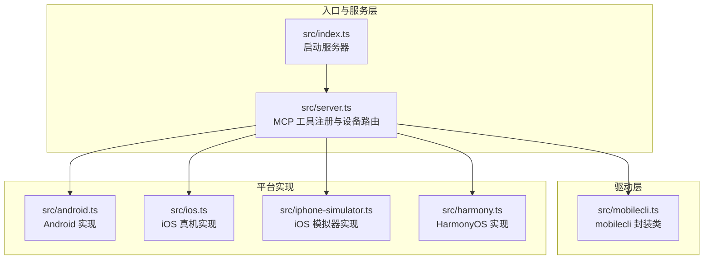
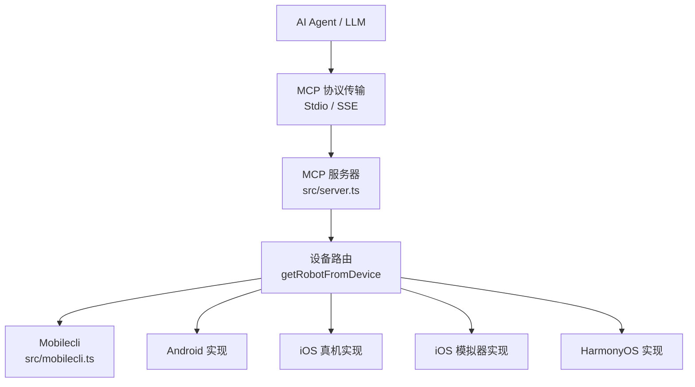
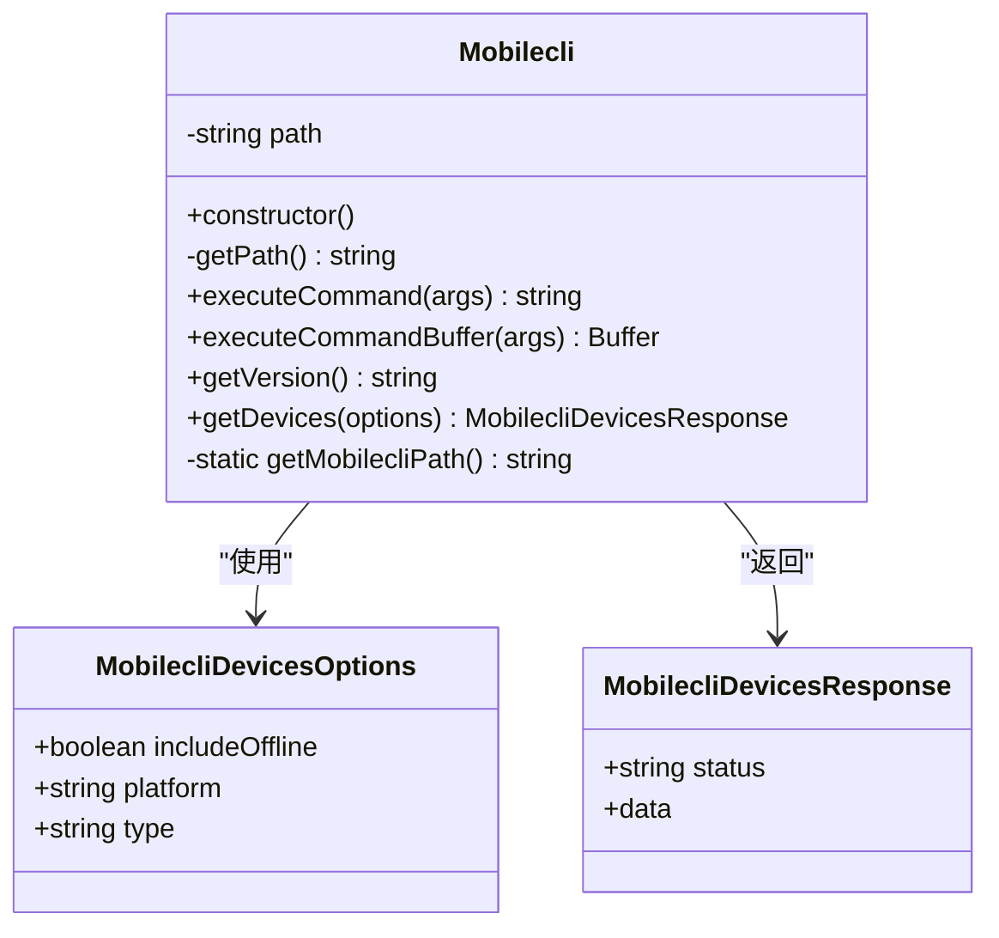
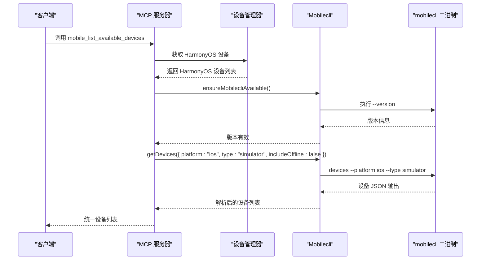
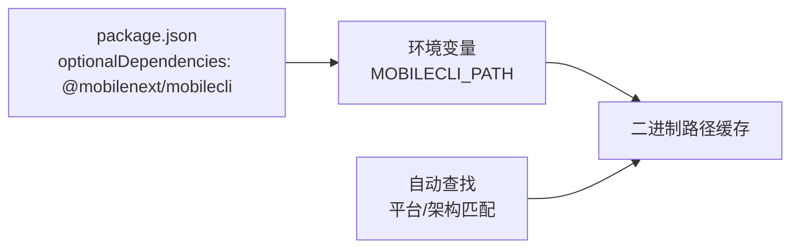

# mobilecli 工具集成

<cite>
**本文档引用的文件**
- [src/mobilecli.ts](file://src/mobilecli.ts)
- [src/server.ts](file://src/server.ts)
- [test/mobilecli.test.ts](file://test/mobilecli.test.ts)
- [package.json](file://package.json)
- [README.md](file://README.md)
- [DEEPWIKI.md](file://DEEPWIKI.md)
</cite>

## 目录
1. [简介](#简介)
2. [项目结构](#项目结构)
3. [核心组件](#核心组件)
4. [架构总览](#架构总览)
5. [详细组件分析](#详细组件分析)
6. [依赖关系分析](#依赖关系分析)
7. [性能考虑](#性能考虑)
8. [故障排除指南](#故障排除指南)
9. [结论](#结论)
10. [附录](#附录)

## 简介
本文件面向需要在 MCP 服务器中集成 mobilecli 工具的开发者，系统性阐述 mobilecli 工具的作用与功能，重点覆盖：
- 设备发现：通过 mobilecli 获取 iOS 模拟器设备列表
- 设备管理命令执行：封装 mobilecli 二进制调用，支持字符串输出与二进制输出
- 跨平台二进制文件管理：自动查找与环境变量覆盖机制
- Mobilecli 类实现细节：构造函数、executeCommand、executeCommandBuffer、getDevices、getVersion 等
- 设备查询选项配置：includeOffline、platform、type 参数
- 使用示例：获取设备列表、处理设备信息、错误处理
- 环境变量配置：MOBILECLI_PATH 的作用与二进制自动查找流程
- 平台特定安装与配置指南：macOS、Windows、Linux 的安装与验证

## 项目结构
该项目围绕 MCP 协议提供统一的移动端自动化能力，其中 mobilecli 作为 iOS 模拟器设备发现与管理的关键依赖，位于驱动层，被服务层通过工具注册与设备路由使用。

图表来源
- [src/index.ts:1-67](file://src/index.ts#L1-L67)
- [src/server.ts:1-200](file://src/server.ts#L1-L200)
- [src/mobilecli.ts:1-136](file://src/mobilecli.ts#L1-L136)

章节来源
- [src/index.ts:1-67](file://src/index.ts#L1-L67)
- [src/server.ts:1-200](file://src/server.ts#L1-L200)
- [src/mobilecli.ts:1-136](file://src/mobilecli.ts#L1-L136)

## 核心组件
- Mobilecli 类：封装 mobilecli 二进制的调用，提供版本查询、设备查询与命令执行能力
- 服务层工具：在 mobile_list_available_devices 等工具中使用 Mobilecli 获取 iOS 模拟器设备
- 设备路由：根据设备标识选择合适的平台实现（Android、iOS 真机、iOS 模拟器、HarmonyOS）

章节来源
- [src/mobilecli.ts:27-136](file://src/mobilecli.ts#L27-L136)
- [src/server.ts:135-197](file://src/server.ts#L135-L197)

## 架构总览
mobilecli 在整体架构中的作用是为 iOS 模拟器提供设备发现与管理能力，与 Android、iOS 真机、HarmonyOS 形成统一的设备列表与操作入口。

图表来源
- [src/server.ts:135-197](file://src/server.ts#L135-L197)
- [src/mobilecli.ts:27-136](file://src/mobilecli.ts#L27-L136)

## 详细组件分析

### Mobilecli 类实现
Mobilecli 类负责：
- 自动定位 mobilecli 二进制文件（支持环境变量覆盖与平台/架构自动匹配）
- 执行命令并返回字符串或二进制结果
- 查询版本与设备列表，并进行参数校验

图表来源
- [src/mobilecli.ts:5-22](file://src/mobilecli.ts#L5-L22)
- [src/mobilecli.ts:27-136](file://src/mobilecli.ts#L27-L136)

章节来源
- [src/mobilecli.ts:27-136](file://src/mobilecli.ts#L27-L136)

#### 构造函数与路径解析
- 构造函数为空，延迟初始化二进制路径
- getMobilecliPath 优先读取环境变量 MOBILECLI_PATH；若未设置，则根据 process.platform/process.arch 自动拼接二进制文件名，并在 node_modules 与父目录两种位置查找

章节来源
- [src/mobilecli.ts:30-92](file://src/mobilecli.ts#L30-L92)

#### executeCommand 与 executeCommandBuffer
- executeCommand：以 UTF-8 字符串形式执行命令，适合文本输出场景
- executeCommandBuffer：以二进制 Buffer 形式执行命令，限制最大缓冲区大小与超时时间，适合大体积输出或非文本数据

章节来源
- [src/mobilecli.ts:39-51](file://src/mobilecli.ts#L39-L51)

#### getDevices 与设备查询选项
- 支持的查询选项：
  - includeOffline：是否包含离线设备
  - platform：过滤平台（ios 或 android）
  - type：过滤设备类型（real、emulator、simulator）
- 参数校验：非法 platform/type 将抛出错误
- 返回值：符合 MobilecliDevicesResponse 结构的 JSON 解析结果

章节来源
- [src/mobilecli.ts:107-134](file://src/mobilecli.ts#L107-L134)

#### getVersion 与错误处理
- 通过执行 --version 获取版本号
- 若无法找到二进制或执行失败，返回包含 "failed" 的字符串

章节来源
- [src/mobilecli.ts:94-105](file://src/mobilecli.ts#L94-L105)

### 服务层中的使用
在服务层中，mobilecli 主要用于：
- 确保 mobilecli 可用性（ensureMobilecliAvailable）
- 获取 iOS 模拟器设备列表（mobile_list_available_devices 工具）
- 设备路由（getRobotFromDevice）中区分 HarmonyOS 与 iOS 真机后，再使用 mobilecli 获取模拟器

图表来源
- [src/server.ts:135-197](file://src/server.ts#L135-L197)
- [src/mobilecli.ts:94-134](file://src/mobilecli.ts#L94-L134)

章节来源
- [src/server.ts:135-197](file://src/server.ts#L135-L197)
- [src/mobilecli.ts:94-134](file://src/mobilecli.ts#L94-L134)

### 设备查询选项配置
- includeOffline：布尔值，控制是否包含离线设备
- platform：枚举值，仅支持 "ios" 或 "android"
- type：枚举值，支持 "real"、"emulator"、"simulator"

参数校验逻辑确保传入值合法，非法值将抛出错误。

章节来源
- [src/mobilecli.ts:107-134](file://src/mobilecli.ts#L107-L134)

### 使用示例与最佳实践
- 获取设备列表：调用 getDevices，不传参则返回默认过滤条件下的设备
- 处理设备信息：解析返回的 JSON，遍历 devices 数组获取 id、name、platform、type、version 等字段
- 错误处理：当 mobilecli 不可用或参数非法时，应捕获异常并提示用户进行安装或修正参数

章节来源
- [src/mobilecli.ts:107-134](file://src/mobilecli.ts#L107-L134)
- [test/mobilecli.test.ts:59-118](file://test/mobilecli.test.ts#L59-L118)

## 依赖关系分析
- 依赖关系
  - package.json 中将 @mobilenext/mobilecli 声明为可选依赖（optionalDependencies）
  - 项目通过 optionalDependencies 机制避免强制安装 mobilecli，但服务层在需要时会进行可用性检查
- 二进制查找策略
  - 优先使用环境变量 MOBILECLI_PATH 指定的路径
  - 若未设置，则根据平台与架构自动拼接二进制文件名，并在 node_modules 与父目录位置查找

图表来源
- [package.json:37-39](file://package.json#L37-L39)
- [src/mobilecli.ts:53-92](file://src/mobilecli.ts#L53-L92)

章节来源
- [package.json:37-39](file://package.json#L37-L39)
- [src/mobilecli.ts:53-92](file://src/mobilecli.ts#L53-L92)

## 性能考虑
- 命令执行超时与缓冲区限制：executeCommandBuffer 对超时与最大缓冲区进行了限制，防止大输出导致内存占用过高
- 二进制查找缓存：Mobilecli 类内部对二进制路径进行缓存，避免重复查找
- 设备查询过滤：通过 includeOffline、platform、type 等参数缩小查询范围，减少不必要的数据量

章节来源
- [src/mobilecli.ts:24-25](file://src/mobilecli.ts#L24-L25)
- [src/mobilecli.ts:32-37](file://src/mobilecli.ts#L32-L37)
- [src/mobilecli.ts:107-134](file://src/mobilecli.ts#L107-L134)

## 故障排除指南
- mobilecli 不可用
  - 现象：getVersion 返回包含 "failed" 的字符串
  - 原因：未安装 mobilecli 或二进制路径不可用
  - 处理：安装 mobilecli 并确保其在 PATH 中，或设置 MOBILECLI_PATH 指向正确的二进制路径
- 二进制路径错误
  - 现象：抛出 "Could not find mobilecli binary for platform" 错误
  - 原因：当前平台/架构对应的二进制不存在
  - 处理：确认平台与架构匹配，或手动设置 MOBILECLI_PATH
- 参数非法
  - 现象：getDevices 抛出错误，提示非法 platform 或 type
  - 处理：修正 platform 为 "ios" 或 "android"，type 为 "real"、"emulator" 或 "simulator"

章节来源
- [src/server.ts:138-147](file://src/server.ts#L138-L147)
- [src/mobilecli.ts:115-129](file://src/mobilecli.ts#L115-L129)
- [test/mobilecli.test.ts:38-47](file://test/mobilecli.test.ts#L38-L47)

## 结论
mobilecli 工具在本项目中承担了 iOS 模拟器设备发现与管理的关键职责。通过 Mobilecli 类的封装，实现了跨平台二进制文件的自动查找、命令执行与参数校验，并在服务层中与 Android、iOS 真机、HarmonyOS 形成统一的设备管理与操作入口。合理配置 MOBILECLI_PATH 与平台依赖，可确保工具链稳定运行。

## 附录

### 环境变量与二进制自动查找机制
- MOBILECLI_PATH：可选环境变量，直接指定 mobilecli 二进制路径
- 自动查找：根据 process.platform/process.arch 生成二进制文件名，并在 node_modules 与父目录位置查找
- 缓存策略：首次解析后缓存二进制路径，后续调用复用

章节来源
- [src/mobilecli.ts:53-92](file://src/mobilecli.ts#L53-L92)

### 平台特定安装与配置指南
- macOS
  - 安装 mobilecli：通过包管理器安装 @mobilenext/mobilecli
  - 验证：执行 mobilecli --version
- Windows
  - 安装 mobilecli：通过包管理器安装 @mobilenext/mobilecli
  - 验证：执行 mobilecli.exe --version
- Linux
  - 安装 mobilecli：通过包管理器安装 @mobilenext/mobilecli
  - 验证：执行 mobilecli --version
- 配置 MCP 客户端
  - 使用 npx 一键拉取最新版本
  - 或本地构建后通过 node lib/index.js 启动

章节来源
- [README.md:90-171](file://README.md#L90-L171)
- [package.json:37-39](file://package.json#L37-L39)

### API 与数据模型
- MobilecliDevicesOptions
  - includeOffline: boolean
  - platform: "ios" | "android"
  - type: "real" | "emulator" | "simulator"
- MobilecliDevicesResponse
  - status: "ok"
  - data.devices: 设备数组，包含 id、name、platform、type、version 等字段

章节来源
- [src/mobilecli.ts:5-22](file://src/mobilecli.ts#L5-L22)
- [src/mobilecli.ts:107-134](file://src/mobilecli.ts#L107-L134)