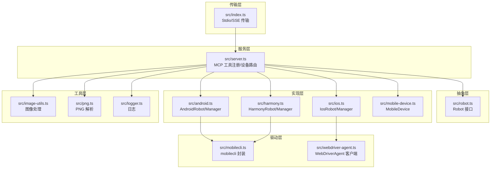
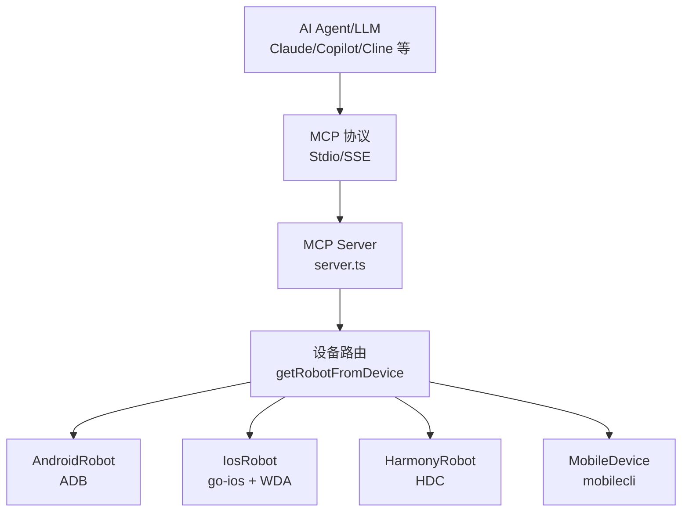
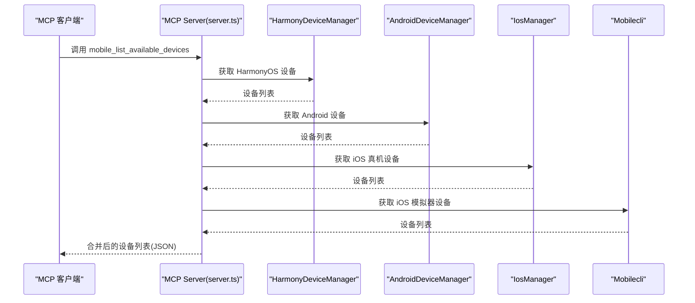
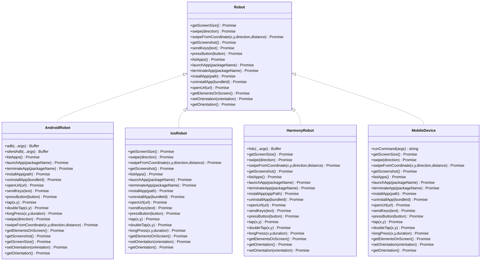
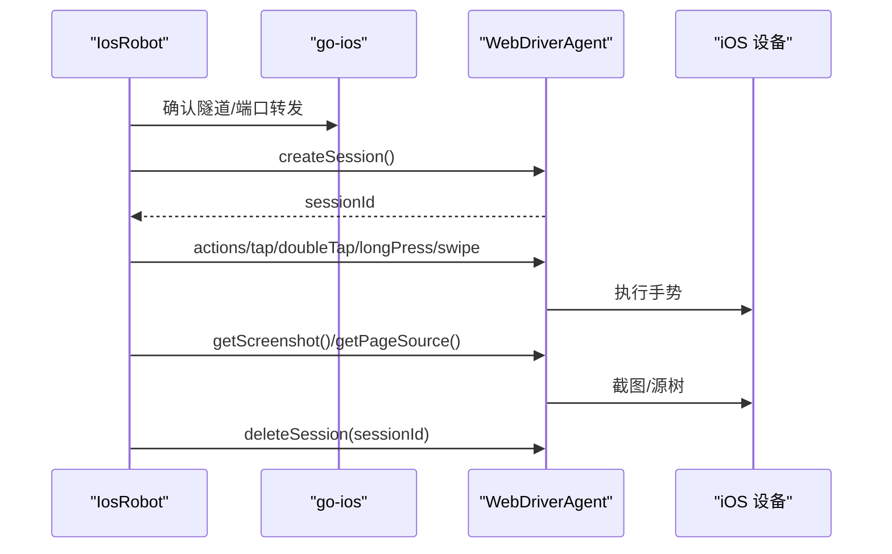
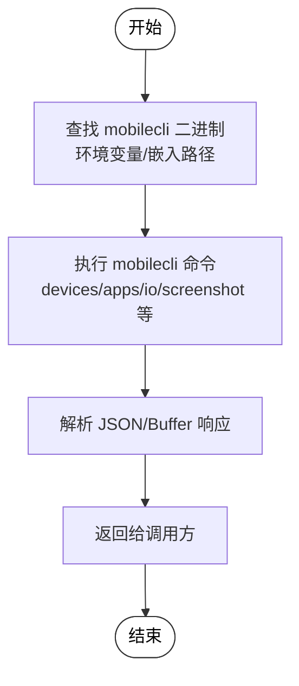
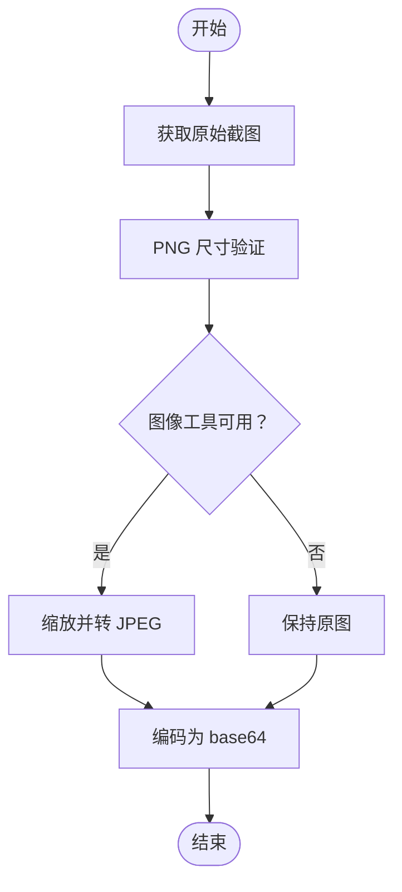
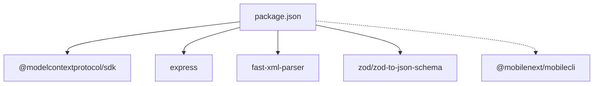

# 第三方工具集成

<cite>
**本文引用的文件**
- [README.md](file://README.md)
- [DEEPWIKI.md](file://DEEPWIKI.md)
- [package.json](file://package.json)
- [tsconfig.json](file://tsconfig.json)
- [eslint.config.mjs](file://eslint.config.mjs)
- [src/index.ts](file://src/index.ts)
- [src/server.ts](file://src/server.ts)
- [src/robot.ts](file://src/robot.ts)
- [src/android.ts](file://src/android.ts)
- [src/ios.ts](file://src/ios.ts)
- [src/harmony.ts](file://src/harmony.ts)
- [src/mobile-device.ts](file://src/mobile-device.ts)
- [src/mobilecli.ts](file://src/mobilecli.ts)
- [src/webdriver-agent.ts](file://src/webdriver-agent.ts)
- [src/image-utils.ts](file://src/image-utils.ts)
- [src/png.ts](file://src/png.ts)
- [src/logger.ts](file://src/logger.ts)
- [test/mobilecli.test.ts](file://test/mobilecli.test.ts)
- [server.json](file://server.json)
</cite>

## 目录
1. [简介](#简介)
2. [项目结构](#项目结构)
3. [核心组件](#核心组件)
4. [架构总览](#架构总览)
5. [详细组件分析](#详细组件分析)
6. [依赖分析](#依赖分析)
7. [性能考虑](#性能考虑)
8. [故障排查指南](#故障排查指南)
9. [结论](#结论)
10. [附录](#附录)

## 简介
本项目是基于 Model Context Protocol (MCP) 的移动端自动化服务器，支持 iOS、Android 与 HarmonyOS（鸿蒙）设备的统一自动化控制。通过 MCP 工具集，AI Agent/LLM 可以以结构化方式与设备交互，完成设备发现、应用管理、屏幕交互、输入导航、截图与元素识别等任务。

项目特性与优势：
- 三端原生应用自动化：iOS、Android、HarmonyOS 统一工具集
- LLM 友好：基于无障碍树（Accessibility Tree）的结构化数据交互
- 视觉兜底：无障碍数据不可用时自动回退到截图坐标分析
- 确定性操作：优先使用结构化数据，减少纯截图方案的歧义
- 结构化数据提取：从屏幕可见内容中提取结构化信息

平台支持与依赖：
- iOS / Android：依赖 mobilecli（@mobilenext/mobilecli）
- HarmonyOS：依赖 HDC（HarmonyOS Device Connector），无需 mobilecli，开箱即用
- 通用：Node.js >= 18

## 项目结构
项目采用分层架构，核心分为传输层、服务层、抽象层、实现层、驱动层与工具层：

- 传输层：src/index.ts，负责 MCP 协议传输（Stdio/SSE）
- 服务层：src/server.ts，注册 MCP 工具、设备路由与参数校验
- 抽象层：src/robot.ts，定义统一的 Robot 接口
- 实现层：src/android.ts、src/ios.ts、src/harmony.ts、src/mobile-device.ts
- 驱动层：src/mobilecli.ts、src/webdriver-agent.ts
- 工具层：src/image-utils.ts、src/png.ts、src/logger.ts

图表来源
- [src/index.ts:1-67](file://src/index.ts#L1-L67)
- [src/server.ts:1-708](file://src/server.ts#L1-L708)
- [src/robot.ts:1-148](file://src/robot.ts#L1-L148)
- [src/android.ts:1-593](file://src/android.ts#L1-L593)
- [src/ios.ts:1-294](file://src/ios.ts#L1-L294)
- [src/harmony.ts:1-462](file://src/harmony.ts#L1-L462)
- [src/mobile-device.ts:1-217](file://src/mobile-device.ts#L1-L217)
- [src/mobilecli.ts:1-136](file://src/mobilecli.ts#L1-L136)
- [src/webdriver-agent.ts:1-455](file://src/webdriver-agent.ts#L1-L455)
- [src/image-utils.ts](file://src/image-utils.ts)
- [src/png.ts](file://src/png.ts)
- [src/logger.ts](file://src/logger.ts)

章节来源
- [DEEPWIKI.md:32-54](file://DEEPWIKI.md#L32-L54)
- [DEEPWIKI.md:102-114](file://DEEPWIKI.md#L102-L114)

## 核心组件
- MCP 服务器与工具注册：src/server.ts 注册 20 个工具，包括设备管理、应用管理、屏幕交互、输入导航等，并提供设备路由与遥测上报。
- 机器人接口与实现：src/robot.ts 定义统一接口，各平台通过 AndroidRobot、IosRobot、HarmonyRobot、MobileDevice 实现。
- 传输层：src/index.ts 支持 Stdio（默认）与 SSE 两种传输模式。
- 驱动层：src/mobilecli.ts 封装 @mobilenext/mobilecli；src/webdriver-agent.ts 封装 WebDriverAgent HTTP API。
- 工具层：图像处理、PNG 解析、日志等通用工具。

章节来源
- [src/server.ts:35-708](file://src/server.ts#L35-L708)
- [src/robot.ts:48-148](file://src/robot.ts#L48-L148)
- [src/index.ts:9-67](file://src/index.ts#L9-L67)
- [src/mobilecli.ts:27-136](file://src/mobilecli.ts#L27-L136)
- [src/webdriver-agent.ts:25-455](file://src/webdriver-agent.ts#L25-L455)

## 架构总览
系统整体架构围绕 MCP 协议，通过传输层接收客户端请求，服务层进行工具分发与设备路由，最终由各平台机器人执行具体操作。HarmonyOS 通过 HDC 直连设备，无需 mobilecli；iOS 通过 go-ios + WDA；Android 通过 ADB。

图表来源
- [src/server.ts:149-197](file://src/server.ts#L149-L197)
- [src/index.ts:9-67](file://src/index.ts#L9-L67)

## 详细组件分析

### 设备管理与发现
- 设备发现：mobile_list_available_devices 统一列出 HarmonyOS、Android、iOS 真机与 iOS 模拟器，内部通过各平台管理器与 mobilecli 获取设备列表。
- 设备路由：getRobotFromDevice 根据设备 ID 选择对应机器人实现，优先 HarmonyOS（无 mobilecli 依赖），再 iOS/Android，最后 mobilecli 模拟器。

图表来源
- [src/server.ts:207-294](file://src/server.ts#L207-L294)
- [src/harmony.ts:418-462](file://src/harmony.ts#L418-L462)
- [src/android.ts:506-593](file://src/android.ts#L506-L593)
- [src/ios.ts:234-294](file://src/ios.ts#L234-L294)
- [src/mobilecli.ts:107-136](file://src/mobilecli.ts#L107-L136)

章节来源
- [src/server.ts:207-294](file://src/server.ts#L207-L294)
- [src/harmony.ts:418-462](file://src/harmony.ts#L418-L462)
- [src/android.ts:506-593](file://src/android.ts#L506-L593)
- [src/ios.ts:234-294](file://src/ios.ts#L234-L294)
- [src/mobilecli.ts:107-136](file://src/mobilecli.ts#L107-L136)

### 移动端自动化工具与实现
- Android：通过 ADB 执行 shell 命令，实现截图、点击、滑动、长按、输入、按键、应用管理、UI 元素解析等。
- iOS：通过 go-ios + WebDriverAgent，实现截图、点击、滑动、长按、输入、按键、应用管理、UI 元素解析等。
- HarmonyOS：通过 HDC + uitest + hidumper，实现截图、点击、滑动、长按、输入、按键、应用管理、UI 元素解析等。
- 通用设备（mobilecli）：通过 @mobilenext/mobilecli 提供的二进制工具，统一 iOS 模拟器与部分通用操作。

图表来源
- [src/robot.ts:48-148](file://src/robot.ts#L48-L148)
- [src/android.ts:74-505](file://src/android.ts#L74-L505)
- [src/ios.ts:42-232](file://src/ios.ts#L42-L232)
- [src/harmony.ts:43-416](file://src/harmony.ts#L43-L416)
- [src/mobile-device.ts:62-217](file://src/mobile-device.ts#L62-L217)

章节来源
- [src/android.ts:74-505](file://src/android.ts#L74-L505)
- [src/ios.ts:42-232](file://src/ios.ts#L42-L232)
- [src/harmony.ts:43-416](file://src/harmony.ts#L43-L416)
- [src/mobile-device.ts:62-217](file://src/mobile-device.ts#L62-L217)

### WebDriverAgent 集成（iOS 自动化）
WebDriverAgent 通过 HTTP API 与 iOS 设备交互，IosRobot 通过 go-ios + WDA 实现：
- 会话管理：withinSession 自动创建/销毁 WebDriver 会话
- 屏幕交互：W3C Actions API 实现点击、双击、长按、滑动
- 输入与按键：WDA keys 与 pressButton
- 截图与元素：/screenshot 与 /source/?format=json
- 方向控制：/orientation GET/POST

图表来源
- [src/ios.ts:77-92](file://src/ios.ts#L77-L92)
- [src/webdriver-agent.ts:42-77](file://src/webdriver-agent.ts#L42-L77)
- [src/webdriver-agent.ts:149-174](file://src/webdriver-agent.ts#L149-L174)
- [src/webdriver-agent.ts:274-284](file://src/webdriver-agent.ts#L274-L284)
- [src/webdriver-agent.ts:295-300](file://src/webdriver-agent.ts#L295-L300)

章节来源
- [src/ios.ts:77-92](file://src/ios.ts#L77-L92)
- [src/webdriver-agent.ts:42-77](file://src/webdriver-agent.ts#L42-L77)
- [src/webdriver-agent.ts:149-174](file://src/webdriver-agent.ts#L149-L174)
- [src/webdriver-agent.ts:274-284](file://src/webdriver-agent.ts#L274-L284)
- [src/webdriver-agent.ts:295-300](file://src/webdriver-agent.ts#L295-L300)

### mobilecli 工具集成（设备管理命令、ADB 通信与设备发现）
- mobilecli 封装：自动查找二进制路径，支持环境变量覆盖，执行命令并返回 JSON/Buffer。
- 设备发现：通过 devices 子命令获取 iOS 模拟器列表，结合 go-ios 与 ADB 获取真实设备。
- ADB 通信：AndroidRobot 通过 execFileSync 调用 adb，实现截图、点击、滑动、输入、按键、应用管理、UI 元素解析等。

图表来源
- [src/mobilecli.ts:39-51](file://src/mobilecli.ts#L39-L51)
- [src/mobilecli.ts:53-92](file://src/mobilecli.ts#L53-L92)
- [src/mobilecli.ts:107-136](file://src/mobilecli.ts#L107-L136)

章节来源
- [src/mobilecli.ts:39-51](file://src/mobilecli.ts#L39-L51)
- [src/mobilecli.ts:53-92](file://src/mobilecli.ts#L53-L92)
- [src/mobilecli.ts:107-136](file://src/mobilecli.ts#L107-L136)
- [src/android.ts:79-92](file://src/android.ts#L79-L92)

### 截图与图像处理
- 截图流程：根据设备类型获取原始截图，验证 PNG 尺寸，若可用则缩放并转为 JPEG，最后返回 base64 图像。
- 图像工具：优先使用 macOS Sips，否则回退到 ImageMagick；PNG 解析用于尺寸验证。

图表来源
- [src/server.ts:597-673](file://src/server.ts#L597-L673)
- [src/image-utils.ts](file://src/image-utils.ts)
- [src/png.ts](file://src/png.ts)

章节来源
- [src/server.ts:597-673](file://src/server.ts#L597-L673)
- [src/image-utils.ts](file://src/image-utils.ts)
- [src/png.ts](file://src/png.ts)

### MCP 客户端集成指南（Claude、VS Code Copilot 等）
- 标准配置（适用于大多数 MCP 客户端）：
  - 使用 npx 命令启动服务器，指向 @ali/mobile-mcp-harmony@latest
- Claude Code/桌面：
  - 使用 claude mcp add 命令添加，或使用 JSON 配置
- VS Code / Copilot：
  - 编辑 ~/.copilot/mcp-config.json，设置 type 为 local，command 为 npx，args 为 @ali/mobile-mcp-harmony@latest

章节来源
- [README.md:100-150](file://README.md#L100-L150)

## 依赖分析
- 运行时依赖：@modelcontextprotocol/sdk、express、fast-xml-parser、zod、zod-to-json-schema
- 可选依赖：@mobilenext/mobilecli
- 开发依赖：ESLint、Mocha、nyc、husky、TypeScript 等

图表来源
- [package.json:29-39](file://package.json#L29-L39)

章节来源
- [package.json:29-39](file://package.json#L29-L39)

## 性能考虑
- 截图优化：优先使用系统内置工具（如 macOS Sips）进行缩放，降低 CPU 与内存占用。
- 命令超时与缓冲区限制：各平台实现均设置合理超时与最大缓冲区，避免长时间阻塞。
- 会话管理：WebDriverAgent 采用 withinSession 模式，减少会话泄漏风险。
- 图像处理链路：PNG → 缩放 → JPEG 压缩，兼顾质量与体积。

章节来源
- [src/android.ts:69-71](file://src/android.ts#L69-L71)
- [src/webdriver-agent.ts:71-77](file://src/webdriver-agent.ts#L71-L77)
- [src/server.ts:615-650](file://src/server.ts#L615-L650)

## 故障排查指南
- mobilecli 不可用：当 mobilecli 版本检查失败时，抛出可修复错误，提示查看安装文档。
- iOS 隧道/端口转发问题：IosRobot 在调用前检查隧道与端口转发状态，必要时抛出可修复错误。
- 设备未发现：检查 ADB/adb、go-ios、HDC 等工具是否正确安装与配置。
- 截图无效：验证 PNG 尺寸，必要时调整图像处理链路或禁用缩放。

章节来源
- [src/server.ts:138-147](file://src/server.ts#L138-L147)
- [src/ios.ts:69-75](file://src/ios.ts#L69-L75)
- [src/server.ts:627-633](file://src/server.ts#L627-L633)

## 结论
本项目通过清晰的分层架构与统一的 Robot 接口，实现了对 iOS、Android 与 HarmonyOS 的一致化自动化控制。借助 MCP 协议，AI Agent/LLM 可以以结构化方式与设备交互，完成从设备发现到应用管理、屏幕交互与元素识别的全流程自动化。HarmonyOS 通过 HDC 直连设备，无需 mobilecli，简化了部署与使用成本。

## 附录
- 构建与运行：npm install → npm run build → npm run watch → npm test → npm run lint
- 环境变量：ANDROID_HOME、GO_IOS_PATH、MOBILECLI_PATH、LOG_FILE
- 服务器元数据：server.json 描述 MCP 服务器信息与包配置

章节来源
- [DEEPWIKI.md:651-688](file://DEEPWIKI.md#L651-L688)
- [server.json:1-22](file://server.json#L1-L22)