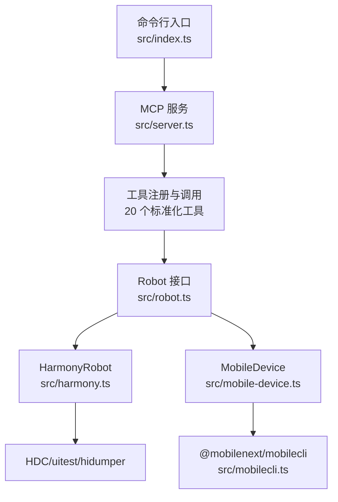
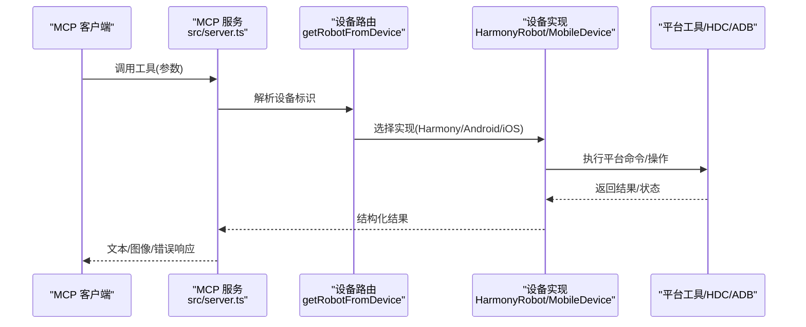
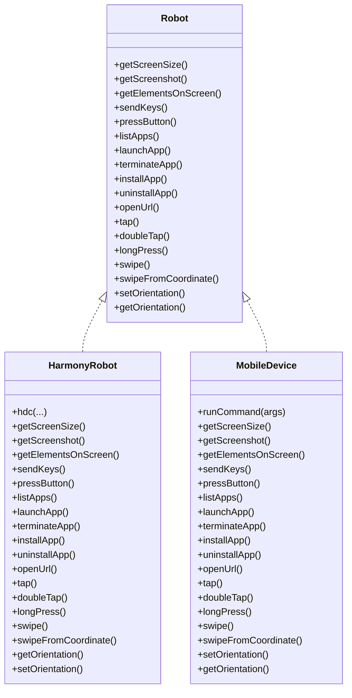

# MCP 工具参考

<cite>
**本文引用的文件**
- [src/index.ts](file://src/index.ts)
- [src/server.ts](file://src/server.ts)
- [src/robot.ts](file://src/robot.ts)
- [src/harmony.ts](file://src/harmony.ts)
- [src/mobile-device.ts](file://src/mobile-device.ts)
- [src/mobilecli.ts](file://src/mobilecli.ts)
- [src/logger.ts](file://src/logger.ts)
- [src/png.ts](file://src/png.ts)
- [README.md](file://README.md)
- [package.json](file://package.json)
- [test/mobilecli.test.ts](file://test/mobilecli.test.ts)
</cite>

## 目录
1. [简介](#简介)
2. [项目结构](#项目结构)
3. [核心组件](#核心组件)
4. [架构总览](#架构总览)
5. [详细组件分析](#详细组件分析)
6. [依赖关系分析](#依赖关系分析)
7. [性能考量](#性能考量)
8. [故障排查指南](#故障排查指南)
9. [结论](#结论)
10. [附录](#附录)

## 简介
本文件为 Mobile MCP HarmonyOS 的 MCP 工具参考文档，覆盖 20 个标准化 MCP 工具的接口规范、参数、返回值、错误处理与最佳实践。工具体系分为四类：
- 设备管理：mobile_list_available_devices、mobile_get_screen_size、mobile_get_orientation、mobile_set_orientation
- 应用管理：mobile_list_apps、mobile_launch_app、mobile_terminate_app、mobile_install_app、mobile_uninstall_app
- 屏幕交互：mobile_take_screenshot、mobile_save_screenshot、mobile_list_elements_on_screen、mobile_click_on_screen_at_coordinates、mobile_double_tap_on_screen、mobile_long_press_on_screen_at_coordinates、mobile_swipe_on_screen
- 输入导航：mobile_type_keys、mobile_press_button、mobile_open_url

文档同时给出工具组合使用场景、性能与安全建议，并提供面向非技术用户的可读说明与可视化图示。

## 项目结构
- 入口与传输层：通过命令行启动，支持 stdio 与 SSE 两种传输；默认 stdio。
- MCP 服务注册：在服务端集中注册 20 个工具，统一输入/输出与错误处理。
- 设备抽象：Robot 接口定义统一能力；不同平台由 HarmonyRobot、AndroidRobot、IosRobot、MobileDevice 实现。
- 平台适配：HarmonyOS 使用 HDC/uitest/hidumper 等原生命令；iOS/Android 通过 mobilecli 与平台工具链协作。

图表来源
- [src/index.ts:1-67](file://src/index.ts#L1-L67)
- [src/server.ts:35-707](file://src/server.ts#L35-L707)
- [src/robot.ts:48-147](file://src/robot.ts#L48-L147)
- [src/harmony.ts:43-416](file://src/harmony.ts#L43-L416)
- [src/mobile-device.ts:62-216](file://src/mobile-device.ts#L62-L216)
- [src/mobilecli.ts:27-135](file://src/mobilecli.ts#L27-L135)

章节来源
- [src/index.ts:1-67](file://src/index.ts#L1-L67)
- [src/server.ts:35-707](file://src/server.ts#L35-L707)
- [README.md:1-198](file://README.md#L1-L198)

## 核心组件
- Robot 接口：定义设备统一能力（屏幕尺寸、截图、元素、输入、应用管理、导航、方向等）。
- HarmonyRobot/MobileDevice：分别针对 HarmonyOS 与通过 mobilecli 的设备实现具体动作。
- MCP 工具注册：在 server.ts 中以工具函数封装，统一参数校验、错误处理与返回格式。
- 传输层：支持 stdio 与 SSE，便于与 MCP 客户端集成。

章节来源
- [src/robot.ts:48-147](file://src/robot.ts#L48-L147)
- [src/harmony.ts:43-416](file://src/harmony.ts#L43-L416)
- [src/mobile-device.ts:62-216](file://src/mobile-device.ts#L62-L216)
- [src/server.ts:62-95](file://src/server.ts#L62-L95)

## 架构总览
MCP 工具的调用流程如下：客户端发起工具请求，服务端解析参数，选择对应设备实现，执行动作并返回结果或错误。

图表来源
- [src/server.ts:149-197](file://src/server.ts#L149-L197)
- [src/harmony.ts:43-416](file://src/harmony.ts#L43-L416)
- [src/mobile-device.ts:62-216](file://src/mobile-device.ts#L62-L216)

## 详细组件分析

### 设备管理工具

#### mobile_list_available_devices
- 功能：列出所有可用设备（HarmonyOS、iOS 真机/模拟器、Android 真机/模拟器）。
- 参数：无
- 返回：设备数组（id、name、platform、type、version、state）
- 错误：当 mobilecli 不可用时，HarmonyOS 设备仍可被发现；若无法检测到任何设备，返回空数组。
- 最佳实践：首次自动化流程先调用该工具获取设备列表，再根据用户选择传入后续工具的 device 参数。

章节来源
- [src/server.ts:199-295](file://src/server.ts#L199-L295)
- [src/harmony.ts:418-461](file://src/harmony.ts#L418-L461)
- [src/mobilecli.ts:107-135](file://src/mobilecli.ts#L107-L135)

#### mobile_get_screen_size
- 功能：获取设备屏幕尺寸（像素）。
- 参数：device（设备标识）
- 返回：文本描述“Screen size is WxH pixels”
- 错误：设备不存在或平台命令失败时抛出可修复错误或系统异常。

章节来源
- [src/server.ts:377-390](file://src/server.ts#L377-L390)
- [src/harmony.ts:55-69](file://src/harmony.ts#L55-L69)
- [src/mobile-device.ts:75-81](file://src/mobile-device.ts#L75-L81)

#### mobile_get_orientation / mobile_set_orientation
- 功能：获取/设置屏幕方向（portrait/landscape）。
- 参数：device、orientation（仅设置）
- 返回：文本描述当前方向或设置成功提示。
- 注意：HarmonyOS 不支持程序化设置方向，调用将抛出可修复错误。

章节来源
- [src/server.ts:675-704](file://src/server.ts#L675-L704)
- [src/harmony.ts:401-415](file://src/harmony.ts#L401-L415)
- [src/mobile-device.ts:208-215](file://src/mobile-device.ts#L208-L215)

### 应用管理工具

#### mobile_list_apps
- 功能：列出设备上已安装的应用。
- 参数：device
- 返回：文本描述“Found these apps on device: A(B), C(D)...”

章节来源
- [src/server.ts:298-311](file://src/server.ts#L298-L311)
- [src/harmony.ts:221-232](file://src/harmony.ts#L221-L232)
- [src/mobile-device.ts:144-150](file://src/mobile-device.ts#L144-L150)

#### mobile_launch_app
- 功能：启动指定包名的应用。
- 参数：device、packageName
- 返回：文本描述“Launched app XXX”

章节来源
- [src/server.ts:313-327](file://src/server.ts#L313-L327)
- [src/harmony.ts:234-262](file://src/harmony.ts#L234-L262)
- [src/mobile-device.ts:152-154](file://src/mobile-device.ts#L152-L154)

#### mobile_terminate_app
- 功能：停止并终止应用。
- 参数：device、packageName
- 返回：文本描述“Terminated app XXX”

章节来源
- [src/server.ts:330-343](file://src/server.ts#L330-L343)
- [src/harmony.ts:264-266](file://src/harmony.ts#L264-L266)
- [src/mobile-device.ts:156-158](file://src/mobile-device.ts#L156-L158)

#### mobile_install_app
- 功能：安装应用（支持 .apk、.ipa、.app、.zip、.hap）。
- 参数：device、path
- 返回：文本描述“Installed app from …”

章节来源
- [src/server.ts:345-359](file://src/server.ts#L345-L359)
- [src/harmony.ts:268-287](file://src/harmony.ts#L268-L287)
- [src/mobile-device.ts:160-162](file://src/mobile-device.ts#L160-L162)

#### mobile_uninstall_app
- 功能：卸载应用。
- 参数：device、bundle_id
- 返回：文本描述“Uninstalled app XXX”

章节来源
- [src/server.ts:361-375](file://src/server.ts#L361-L375)
- [src/harmony.ts:279-288](file://src/harmony.ts#L279-L288)
- [src/mobile-device.ts:164-166](file://src/mobile-device.ts#L164-L166)

### 屏幕交互工具

#### mobile_take_screenshot
- 功能：截取屏幕截图并返回图像数据。
- 参数：device
- 返回：图像内容（PNG/JPEG，Base64 数据），并附带尺寸与 MIME 类型。
- 性能：若检测到 PNG，可能转为 JPEG 并缩放以减小体积；若检测到 JPEG，则按屏幕 scale 缩放。
- 错误：无效截图或异常时返回错误文本并标记 isError。

章节来源
- [src/server.ts:585-673](file://src/server.ts#L585-L673)
- [src/harmony.ts:159-182](file://src/harmony.ts#L159-L182)
- [src/mobile-device.ts:139-142](file://src/mobile-device.ts#L139-L142)
- [src/png.ts:6-20](file://src/png.ts#L6-L20)

#### mobile_save_screenshot
- 功能：将截图保存到本地文件。
- 参数：device、saveTo
- 返回：文本描述“Screenshot saved to …”

章节来源
- [src/server.ts:567-583](file://src/server.ts#L567-L583)
- [src/harmony.ts:159-182](file://src/harmony.ts#L159-L182)

#### mobile_list_elements_on_screen
- 功能：列出屏幕上的 UI 元素及其坐标（中心点），并包含文本/标签/标识等。
- 参数：device
- 返回：文本描述“Found these elements on screen: …”（包含结构化元素列表）

章节来源
- [src/server.ts:445-483](file://src/server.ts#L445-L483)
- [src/harmony.ts:294-332](file://src/harmony.ts#L294-L332)
- [src/mobile-device.ts:194-206](file://src/mobile-device.ts#L194-L206)

#### mobile_click_on_screen_at_coordinates
- 功能：点击屏幕指定坐标。
- 参数：device、x、y
- 返回：文本描述“Clicked on screen at coordinates: x, y”

章节来源
- [src/server.ts:392-407](file://src/server.ts#L392-L407)
- [src/harmony.ts:71-73](file://src/harmony.ts#L71-L73)
- [src/mobile-device.ts:180-182](file://src/mobile-device.ts#L180-L182)

#### mobile_double_tap_on_screen
- 功能：双击指定坐标。
- 参数：device、x、y
- 返回：文本描述“Double-tapped on screen at coordinates: x, y”

章节来源
- [src/server.ts:410-424](file://src/server.ts#L410-L424)
- [src/harmony.ts:75-77](file://src/harmony.ts#L75-L77)
- [src/mobile-device.ts:184-188](file://src/mobile-device.ts#L184-L188)

#### mobile_long_press_on_screen_at_coordinates
- 功能：长按指定坐标（毫秒）。
- 参数：device、x、y、duration（可选，默认 500ms）
- 返回：文本描述“Long pressed on screen at coordinates: x, y for N ms”

章节来源
- [src/server.ts:426-443](file://src/server.ts#L426-L443)
- [src/harmony.ts:79-81](file://src/harmony.ts#L79-L81)
- [src/mobile-device.ts:190-192](file://src/mobile-device.ts#L190-L192)

#### mobile_swipe_on_screen
- 功能：滑动（上/下/左/右），支持从坐标开始滑动并指定距离。
- 参数：device、direction、x（可选）、y（可选）、distance（可选）
- 返回：文本描述“Swiped direction … from coordinates …”或“Swiped direction on screen”

章节来源
- [src/server.ts:517-543](file://src/server.ts#L517-L543)
- [src/harmony.ts:83-157](file://src/harmony.ts#L83-L157)
- [src/mobile-device.ts:83-137](file://src/mobile-device.ts#L83-L137)

### 输入与导航工具

#### mobile_type_keys
- 功能：向焦点元素输入文本；可选提交（发送 ENTER）。
- 参数：device、text、submit（布尔）
- 返回：文本描述“Typed text: …”

章节来源
- [src/server.ts:545-565](file://src/server.ts#L545-L565)
- [src/harmony.ts:184-210](file://src/harmony.ts#L184-L210)
- [src/mobile-device.ts:172-174](file://src/mobile-device.ts#L172-L174)

#### mobile_press_button
- 功能：按下设备物理按键（HOME、BACK、VOLUME_UP/DOWN、ENTER 等）。
- 参数：device、button
- 返回：文本描述“Pressed the button: …”
- 注意：部分按键在 HarmonyOS 上不支持，将抛出可修复错误。

章节来源
- [src/server.ts:485-499](file://src/server.ts#L485-L499)
- [src/harmony.ts:212-219](file://src/harmony.ts#L212-L219)
- [src/mobile-device.ts:176-178](file://src/mobile-device.ts#L176-L178)

#### mobile_open_url
- 功能：在设备浏览器中打开 URL。
- 参数：device、url
- 返回：文本描述“Opened URL: …”

章节来源
- [src/server.ts:501-515](file://src/server.ts#L501-L515)
- [src/harmony.ts:290-292](file://src/harmony.ts#L290-L292)
- [src/mobile-device.ts:168-170](file://src/mobile-device.ts#L168-L170)

## 依赖关系分析

图表来源
- [src/robot.ts:48-147](file://src/robot.ts#L48-L147)
- [src/harmony.ts:43-416](file://src/harmony.ts#L43-L416)
- [src/mobile-device.ts:62-216](file://src/mobile-device.ts#L62-L216)

章节来源
- [src/robot.ts:48-147](file://src/robot.ts#L48-L147)
- [src/harmony.ts:43-416](file://src/harmony.ts#L43-L416)
- [src/mobile-device.ts:62-216](file://src/mobile-device.ts#L62-L216)

## 性能考量
- 截图优化：当返回 PNG 时，可能转换为 JPEG 并按屏幕 scale 缩放，显著降低数据体积；JPEG 直接返回时按 scale 缩放。
- 图像处理：使用 Image 缩放与 PNG 校验，避免无效图像导致的重试成本。
- 设备发现：HarmonyOS 通过 hdc 快速列举目标设备，无需 mobilecli，提升启动速度。
- 并发与超时：平台命令设置最大缓冲与超时，避免阻塞；工具调用记录耗时用于观测。

章节来源
- [src/server.ts:605-650](file://src/server.ts#L605-L650)
- [src/png.ts:6-20](file://src/png.ts#L6-L20)
- [src/harmony.ts:9-18](file://src/harmony.ts#L9-L18)

## 故障排查指南
- mobilecli 不可用：当 mobilecli 未安装或不可执行时，HarmonyOS 设备仍可被发现；其他平台设备需 mobilecli 支持。
- 设备未找到：若传入 device 不存在，将返回可修复错误，提示使用 mobile_list_available_devices 获取可用设备。
- HarmonyOS 方向设置：HarmonyOS 不支持程序化设置方向，调用将抛出可修复错误。
- 截图无效：若截图尺寸为 0 或非 PNG/JPEG，将返回可修复错误，建议重试。
- 日志：可通过 LOG_FILE 环境变量输出日志文件，便于定位问题。

章节来源
- [src/server.ts:138-147](file://src/server.ts#L138-L147)
- [src/server.ts:196](file://src/server.ts#L196)
- [src/harmony.ts:413-415](file://src/harmony.ts#L413-L415)
- [src/server.ts:629-633](file://src/server.ts#L629-L633)
- [src/logger.ts:3-21](file://src/logger.ts#L3-L21)

## 结论
本项目通过统一的 Robot 接口与 MCP 工具集，实现了对 iOS、Android 与 HarmonyOS 的一致化自动化能力。工具覆盖设备管理、应用管理、屏幕交互与输入导航四大类，满足从基础设备发现到复杂 UI 操作的全栈需求。结合错误处理与性能优化策略，可在多种 MCP 客户端环境中稳定运行。

## 附录

### 工具调用最佳实践
- 首次自动化前先调用 mobile_list_available_devices 获取设备列表，明确 device 参数。
- 截图与元素列表应成对使用：先 mobile_list_elements_on_screen 获取坐标，再用 mobile_click_on_screen_at_coordinates 精确点击。
- 文本输入优先使用 mobile_type_keys，必要时配合 mobile_press_button 发送 ENTER。
- 滑动操作建议先获取屏幕尺寸，使用相对百分比距离以适配不同分辨率。

### 安全注意事项
- 仅在可信网络与受控环境中运行 MCP 服务，避免暴露在公网。
- 截图与元素列表可能包含敏感信息，注意数据保护与最小化采集。
- 安装/卸载应用涉及系统权限，应严格限制来源与权限范围。

### 工具组合使用场景案例
- 场景一：登录流程自动化
  - 步骤：mobile_list_available_devices → mobile_get_screen_size → mobile_list_elements_on_screen → mobile_type_keys（用户名）→ mobile_press_button（ENTER）→ mobile_type_keys（密码）→ mobile_press_button（ENTER）
  - 参考工具：mobile_type_keys、mobile_press_button、mobile_list_elements_on_screen
- 场景二：页面滚动与元素定位
  - 步骤：mobile_swipe_on_screen（多次）→ mobile_list_elements_on_screen → mobile_click_on_screen_at_coordinates
  - 参考工具：mobile_swipe_on_screen、mobile_list_elements_on_screen、mobile_click_on_screen_at_coordinates
- 场景三：截图辅助识别
  - 步骤：mobile_take_screenshot → 结合外部视觉识别 → 计算坐标 → mobile_click_on_screen_at_coordinates
  - 参考工具：mobile_take_screenshot、mobile_click_on_screen_at_coordinates

章节来源
- [src/server.ts:545-565](file://src/server.ts#L545-L565)
- [src/server.ts:517-543](file://src/server.ts#L517-L543)
- [src/server.ts:445-483](file://src/server.ts#L445-L483)
- [src/server.ts:585-673](file://src/server.ts#L585-L673)