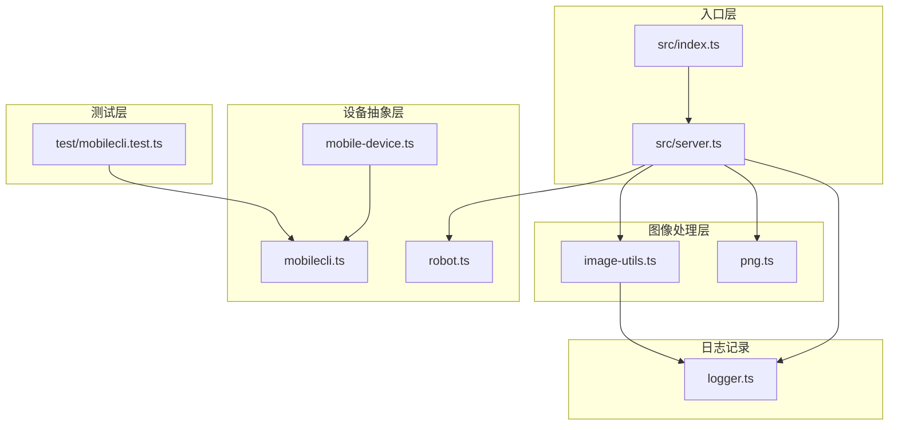
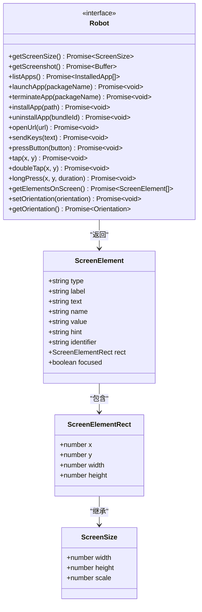
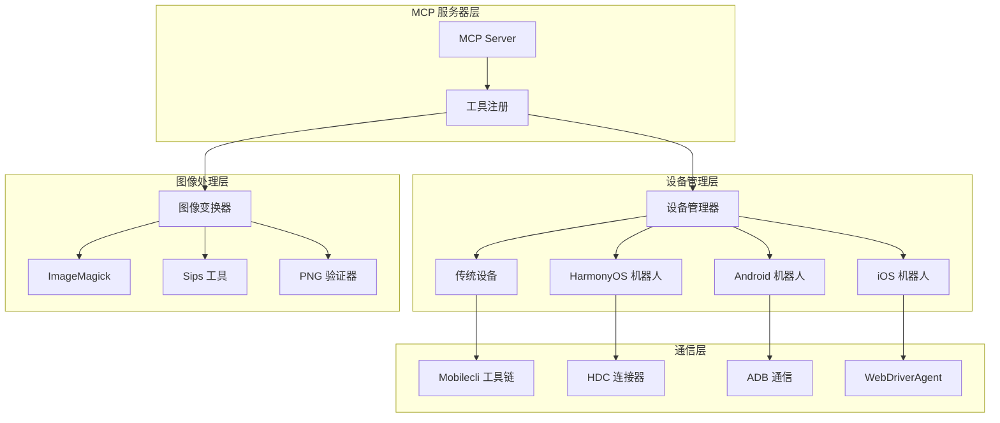
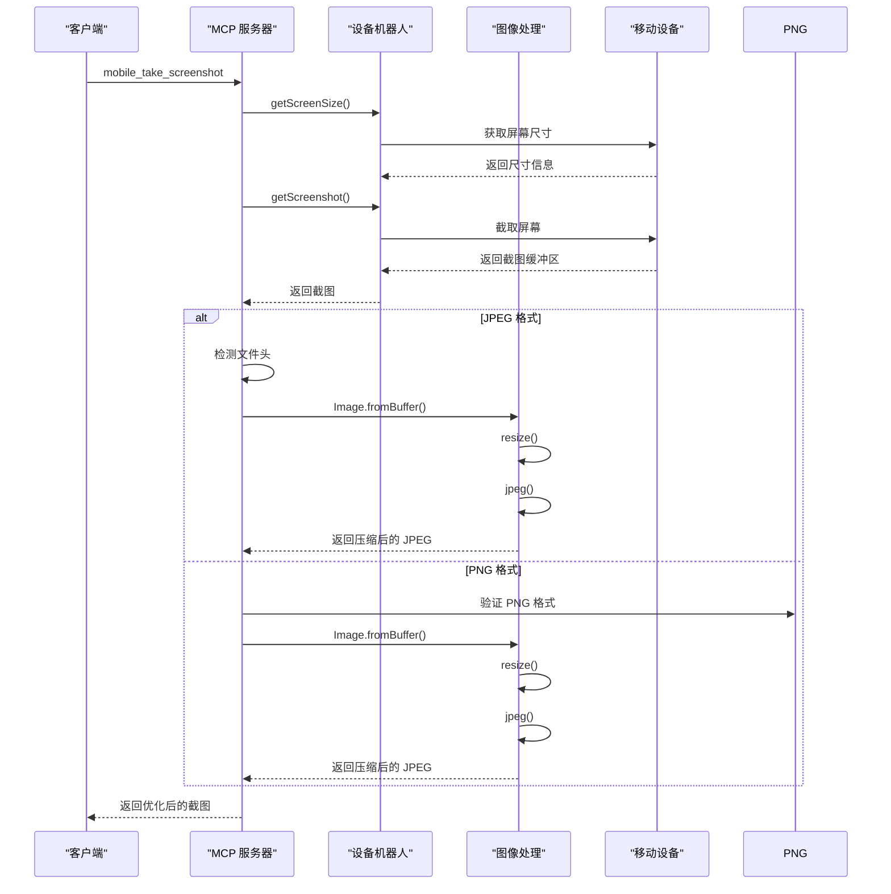
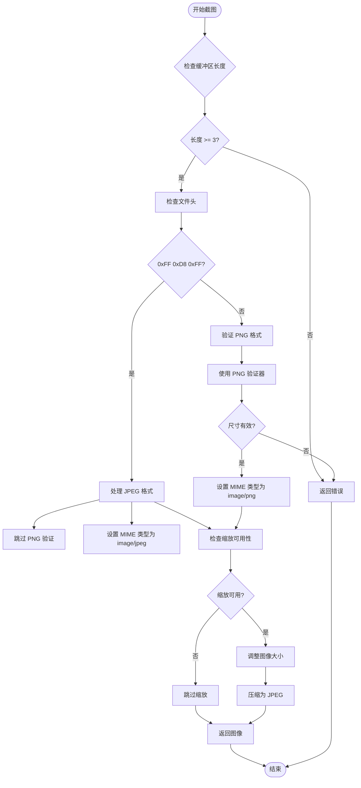
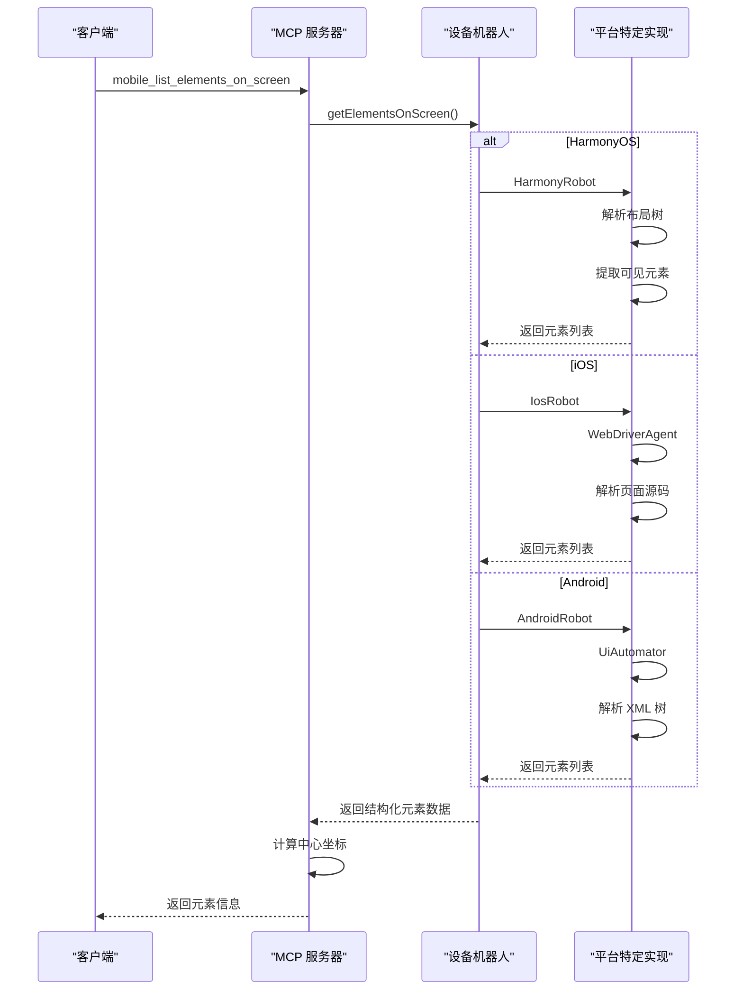
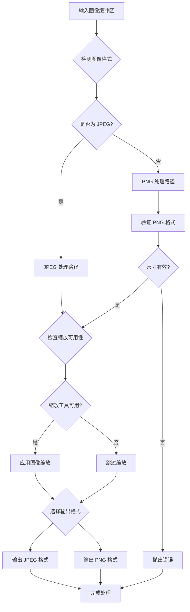

# 屏幕交互工具

<cite>
**本文档引用的文件**
- [src/index.ts](file://src/index.ts)
- [src/server.ts](file://src/server.ts)
- [src/mobile-device.ts](file://src/mobile-device.ts)
- [src/mobilecli.ts](file://src/mobilecli.ts)
- [src/image-utils.ts](file://src/image-utils.ts)
- [src/png.ts](file://src/png.ts)
- [src/robot.ts](file://src/robot.ts)
- [src/logger.ts](file://src/logger.ts)
- [README.md](file://README.md)
- [test/mobilecli.test.ts](file://test/mobilecli.test.ts)
</cite>

## 目录
1. [简介](#简介)
2. [项目结构](#项目结构)
3. [核心组件](#核心组件)
4. [架构概览](#架构概览)
5. [详细组件分析](#详细组件分析)
6. [依赖关系分析](#依赖关系分析)
7. [性能考虑](#性能考虑)
8. [故障排除指南](#故障排除指南)
9. [结论](#结论)

## 简介

屏幕交互工具是基于 Model Context Protocol (MCP) 的移动设备自动化解决方案，专为 iOS、Android 和 HarmonyOS 平台设计。该工具集提供了完整的屏幕交互能力，包括截图捕获、UI 元素识别、坐标点击、手势操作等功能，支持 LLM 和 AI 代理进行智能设备控制。

本项目的核心优势在于：
- **跨平台支持**：统一的 API 接口支持 iOS、Android 和 HarmonyOS 设备
- **LLM 友好**：基于无障碍树的结构化数据交互，无需视觉模型
- **视觉兜底**：当无障碍数据不可用时，自动回退到截图坐标分析
- **确定性操作**：优先使用结构化数据，减少纯截图方案的歧义

## 项目结构

该项目采用模块化的 TypeScript 架构，主要包含以下核心模块：



**图表来源**
- [src/index.ts:1-67](file://src/index.ts#L1-L67)
- [src/server.ts:1-708](file://src/server.ts#L1-L708)
- [src/robot.ts:1-148](file://src/robot.ts#L1-L148)

**章节来源**
- [src/index.ts:1-67](file://src/index.ts#L1-L67)
- [src/server.ts:1-708](file://src/server.ts#L1-L708)

## 核心组件

### 设备抽象接口 (Robot)

Robot 接口定义了所有移动设备交互的标准方法，包括屏幕尺寸获取、截图、应用管理、输入操作等核心功能。



**图表来源**
- [src/robot.ts:26-147](file://src/robot.ts#L26-L147)

### 移动设备实现 (MobileDevice)

MobileDevice 类实现了 Robot 接口，为传统 iOS/Android 设备提供屏幕交互能力。它通过 mobilecli 工具链与设备通信。

**章节来源**
- [src/mobile-device.ts:62-216](file://src/mobile-device.ts#L62-L216)
- [src/robot.ts:48-147](file://src/robot.ts#L48-L147)

### 图像处理工具

图像处理模块提供了高效的图片缩放、格式转换和尺寸检测功能，支持 JPEG 和 PNG 格式的自动识别和优化。

**章节来源**
- [src/image-utils.ts:9-165](file://src/image-utils.ts#L9-L165)
- [src/png.ts:6-21](file://src/png.ts#L6-L21)

## 架构概览

屏幕交互工具采用分层架构设计，确保了良好的可扩展性和维护性：



**图表来源**
- [src/server.ts:135-197](file://src/server.ts#L135-L197)
- [src/mobile-device.ts:62-216](file://src/mobile-device.ts#L62-L216)

## 详细组件分析

### 截图工具 (mobile_take_screenshot)

截图工具提供了高质量的屏幕捕获功能，支持多种图像格式和自动优化。

#### 截图流程



**图表来源**
- [src/server.ts:585-673](file://src/server.ts#L585-L673)
- [src/image-utils.ts:33-48](file://src/image-utils.ts#L33-L48)

#### 图像格式检测机制

系统采用智能的文件头检测机制来区分 JPEG 和 PNG 格式：



**图表来源**
- [src/server.ts:605-650](file://src/server.ts#L605-L650)
- [src/png.ts:10-19](file://src/png.ts#L10-L19)

**章节来源**
- [src/server.ts:585-673](file://src/server.ts#L585-L673)
- [src/image-utils.ts:33-114](file://src/image-utils.ts#L33-L114)

### 屏幕元素识别 (mobile_list_elements_on_screen)

UI 元素识别功能提供了基于无障碍树的结构化数据提取，支持多平台的统一接口。

#### 元素识别流程



**图表来源**
- [src/server.ts:445-483](file://src/server.ts#L445-L483)
- [src/harmony.ts:334-376](file://src/harmony.ts#L334-L376)

#### 元素坐标计算

系统采用精确的坐标计算方法，将矩形区域转换为中心点坐标：

| 元素属性 | 计算公式 | 用途 |
|---------|---------|------|
| 中心点 X 坐标 | `x + width / 2` | 点击操作的目标位置 |
| 中心点 Y 坐标 | `y + height / 2` | 点击操作的目标位置 |
| 可见性判断 | `x >= 0 && y >= 0` | 过滤不可见元素 |
| 元素过滤 | `width > 0 && height > 0` | 排除无效元素 |

**章节来源**
- [src/server.ts:457-479](file://src/server.ts#L457-L479)
- [src/webdriver-agent.ts:236-272](file://src/webdriver-agent.ts#L236-L272)

### 坐标系统和手势操作

#### 坐标系统

屏幕坐标系统采用标准的笛卡尔坐标系，原点位于屏幕左上角：

```mermaid
flowchart TD
Origin[原点 (0,0)] --> XAxis[X 轴向右递增]
Origin --> YAxis[Y 轴向下递增]
Screen[屏幕区域] --> TopLeft[左上角 (0,0)]
Screen --> TopRight[右上角 (width,0)]
Screen --> BottomLeft[左下角 (0,height)]
Screen --> BottomRight[右下角 (width,height)]
Center[屏幕中心] --> CenterCalc["(width/2, height/2)"]
subgraph "坐标约束"
XConstraint["0 ≤ x ≤ width"]
YConstraint["0 ≤ y ≤ height"]
Visible["可见性: x ≥ 0 && y ≥ 0"]
end
```

**图表来源**
- [src/robot.ts:19-38](file://src/robot.ts#L19-L38)

#### 手势操作实现

系统支持多种手势操作，包括点击、双击、长按和滑动：

| 手势类型 | 实现方式 | 参数要求 | 使用场景 |
|---------|---------|---------|---------|
| 点击 (tap) | 直接触摸坐标 | x, y | 一般元素点击 |
| 双击 (doubleTap) | 连续两次点击 | x, y | 快速操作 |
| 长按 (longPress) | 指定持续时间 | x, y, duration | 上下文菜单 |
| 滑动 (swipe) | 起始到结束坐标 | start_x, start_y, end_x, end_y | 页面滚动 |

**章节来源**
- [src/mobile-device.ts:180-192](file://src/mobile-device.ts#L180-L192)
- [src/mobile-device.ts:83-137](file://src/mobile-device.ts#L83-L137)

### 图像处理流程

#### 图像缩放优化

图像处理模块提供了高效的缩放和格式转换功能：



**图表来源**
- [src/image-utils.ts:33-114](file://src/image-utils.ts#L33-L114)

#### 缩放算法实现

系统采用智能的缩放策略，根据平台和图像特性选择最优的处理方式：

**章节来源**
- [src/image-utils.ts:66-114](file://src/image-utils.ts#L66-L114)
- [src/png.ts:10-19](file://src/png.ts#L10-L19)

## 依赖关系分析

### 外部依赖

项目依赖于多个外部工具和库来实现完整的设备自动化功能：

```mermaid
graph TB
subgraph "核心依赖"
MCP[@modelcontextprotocol/sdk]
Zod[zod]
Express[express]
Commander[commander]
end
subgraph "平台特定依赖"
Mobilecli[@mobilenext/mobilecli]
HDC[hdc]
ADB[adb]
WebDriverAgent[WebDriverAgent]
end
subgraph "图像处理依赖"
ImageMagick[ImageMagick]
Sips[Sips 工具]
end
subgraph "开发依赖"
Mocha[mocha]
Chai[chai]
ESLint[eslint]
end
MCP --> Server
Zod --> Server
Express --> Server
Commander --> Server
Mobilecli --> MobileDevice
HDC --> HarmonyRobot
ADB --> AndroidRobot
WebDriverAgent --> IosRobot
ImageMagick --> ImageUtils
Sips --> ImageUtils
```

**图表来源**
- [src/server.ts:1-15](file://src/server.ts#L1-L15)
- [src/mobile-device.ts:1-2](file://src/mobile-device.ts#L1-L2)

### 内部模块依赖

内部模块之间的依赖关系清晰且层次分明：

**章节来源**
- [src/server.ts:1-15](file://src/server.ts#L1-L15)
- [src/mobile-device.ts:1-2](file://src/mobile-device.ts#L1-L2)

## 性能考虑

### 图像处理性能优化

系统在图像处理方面采用了多项优化策略：

1. **智能格式检测**：避免不必要的格式转换
2. **条件缩放**：仅在需要时进行图像缩放
3. **内存管理**：使用临时文件处理大图像
4. **并发处理**：支持多设备同时操作

### 网络通信优化

- **超时控制**：设置合理的命令执行超时时间
- **缓冲区限制**：防止内存溢出
- **错误重试**：在网络不稳定时自动重试

### 内存使用优化

- **流式处理**：避免将整个图像加载到内存
- **及时清理**：自动清理临时文件和资源
- **缓存策略**：合理使用缓存减少重复操作

## 故障排除指南

### 常见问题及解决方案

#### 设备连接问题

**问题症状**：无法发现可用设备
**可能原因**：
- 设备未正确连接
- 驱动程序未安装
- 权限不足

**解决步骤**：
1. 检查设备连接状态
2. 确认驱动程序安装
3. 验证设备权限设置

#### 截图失败问题

**问题症状**：截图工具返回错误
**可能原因**：
- 图像格式不支持
- 缩放工具未安装
- 设备无响应

**解决步骤**：
1. 检查图像格式兼容性
2. 安装 ImageMagick 或 Sips 工具
3. 重启设备后重试

#### 元素识别失败

**问题症状**：UI 元素识别结果不准确
**可能原因**：
- 无障碍服务未启用
- 元素不在可视范围内
- 平台特定问题

**解决步骤**：
1. 启用设备无障碍功能
2. 确保元素在屏幕可视范围内
3. 尝试使用坐标点击替代

### 日志分析

系统提供了详细的日志记录功能，便于问题诊断：

**章节来源**
- [src/logger.ts:15-21](file://src/logger.ts#L15-L21)
- [src/server.ts:70-94](file://src/server.ts#L70-L94)

## 结论

屏幕交互工具提供了一个完整、可靠的移动设备自动化解决方案。通过精心设计的架构和优化的实现，该工具集能够满足各种复杂的自动化需求。

### 主要优势

1. **跨平台兼容性**：统一的 API 接口支持多平台设备
2. **高性能处理**：优化的图像处理和网络通信
3. **稳定性保障**：完善的错误处理和故障恢复机制
4. **易用性设计**：简洁的接口和详细的文档

### 技术特色

- 基于结构化数据的确定性操作
- 智能的图像处理和优化
- 支持多种手势和交互方式
- 完善的日志记录和调试功能

该工具集为 AI 代理和 LLM 提供了强大的移动设备控制能力，是构建智能自动化系统的理想选择。