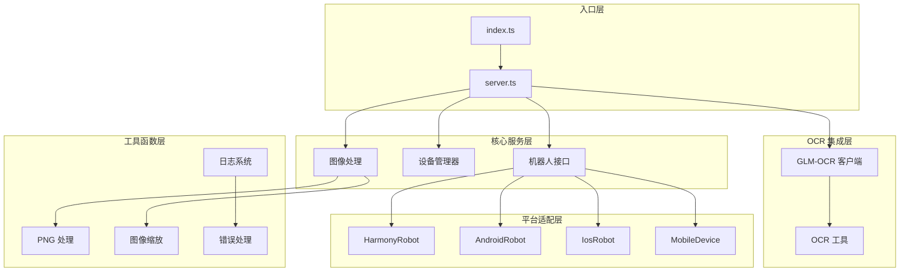
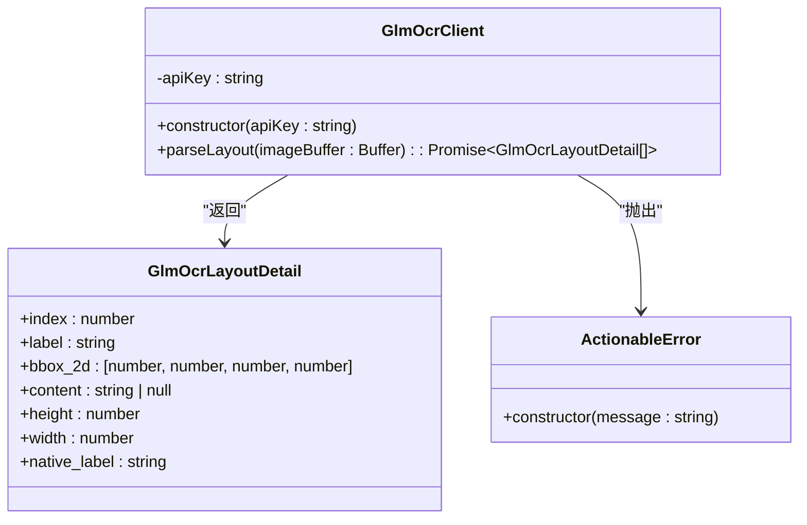
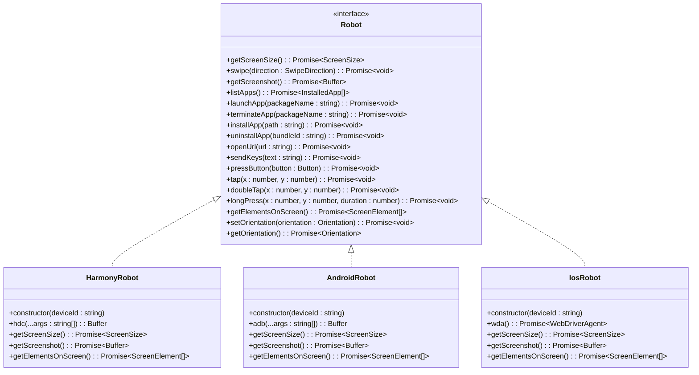
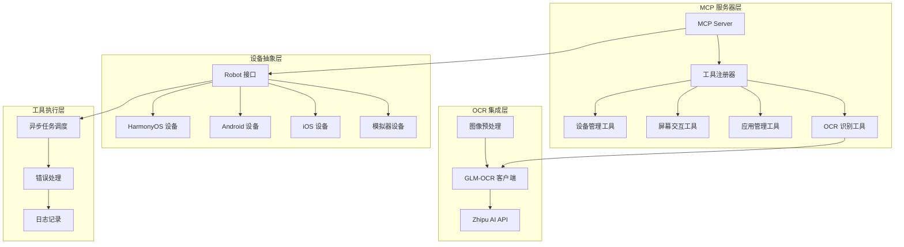
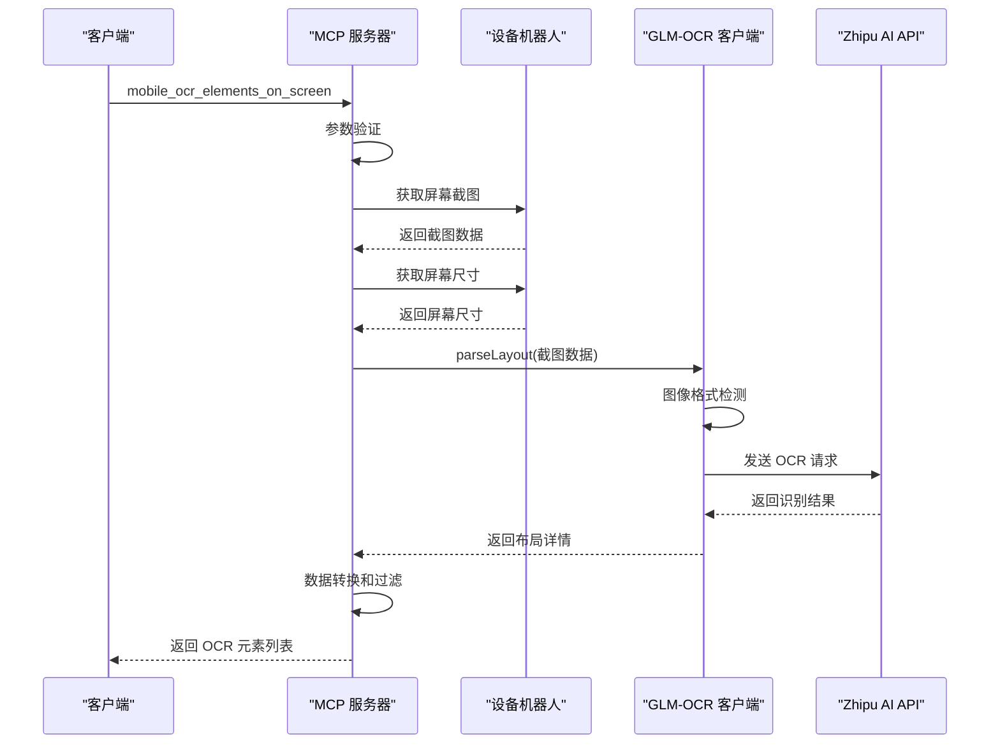
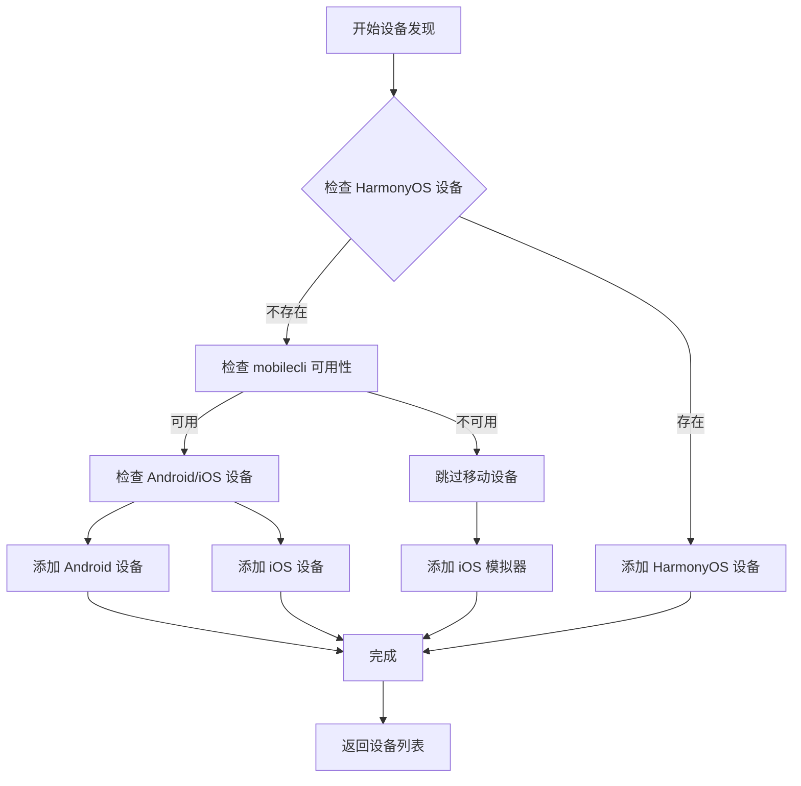
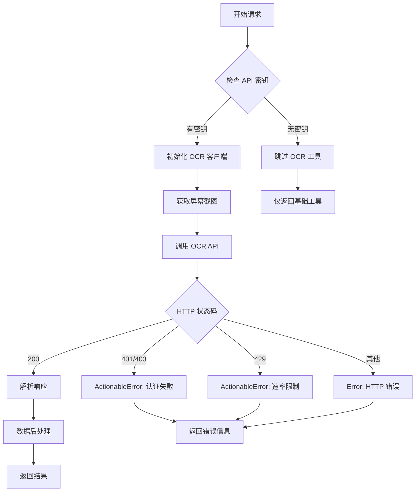
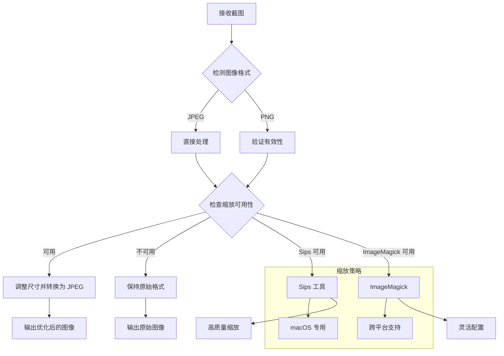
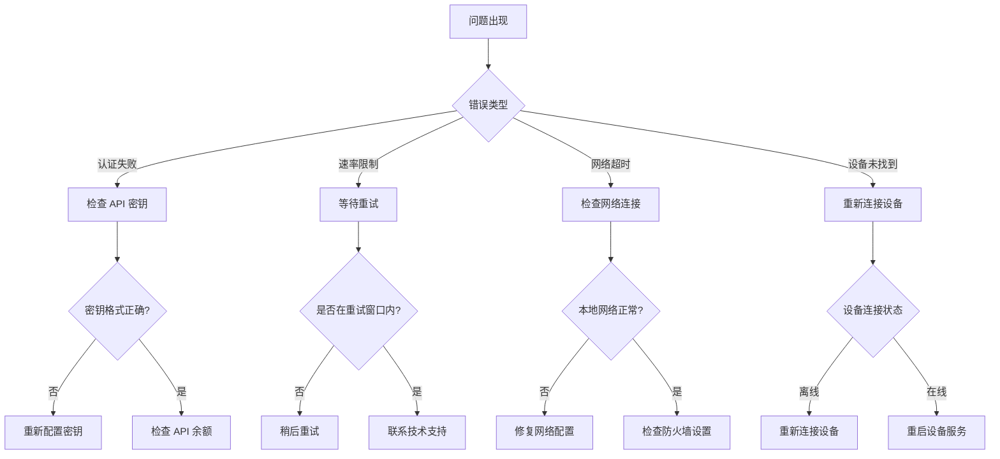

# GLM-OCR 集成

<cite>
**本文档引用的文件**
- [index.ts](file://src/index.ts)
- [server.ts](file://src/server.ts)
- [glm-ocr.ts](file://src/glm-ocr.ts)
- [robot.ts](file://src/robot.ts)
- [mobile-device.ts](file://src/mobile-device.ts)
- [mobilecli.ts](file://src/mobilecli.ts)
- [png.ts](file://src/png.ts)
- [image-utils.ts](file://src/image-utils.ts)
- [harmony.ts](file://src/harmony.ts)
- [android.ts](file://src/android.ts)
- [ios.ts](file://src/ios.ts)
- [logger.ts](file://src/logger.ts)
- [package.json](file://package.json)
- [README.md](file://README.md)
</cite>

## 目录
1. [简介](#简介)
2. [项目结构](#项目结构)
3. [核心组件](#核心组件)
4. [架构概览](#架构概览)
5. [详细组件分析](#详细组件分析)
6. [依赖关系分析](#依赖关系分析)
7. [性能考虑](#性能考虑)
8. [故障排除指南](#故障排除指南)
9. [结论](#结论)

## 简介

GLM-OCR 集成是基于 Mobile MCP HarmonyOS 项目的一个重要扩展功能，它为移动设备自动化提供了强大的屏幕文字识别能力。该项目是一个基于 Model Context Protocol (MCP) 的服务器，支持 iOS、Android 和 HarmonyOS 平台的设备自动化，特别集成了 GLM-OCR 服务来处理复杂的屏幕元素识别任务。

该集成的核心价值在于：
- **多平台支持**：统一的 MCP 工具集支持 iOS、Android、HarmonyOS 三大平台
- **智能识别**：结合无障碍树和 OCR 技术，提供双重保障的屏幕元素识别
- **LLM 友好**：基于结构化数据的交互方式，无需依赖视觉模型
- **确定性操作**：优先使用结构化数据，减少纯截图方案的歧义

## 项目结构

项目采用模块化的 TypeScript 架构设计，主要包含以下核心模块：



**图表来源**
- [index.ts:1-71](file://src/index.ts#L1-L71)
- [server.ts:1-758](file://src/server.ts#L1-L758)

**章节来源**
- [index.ts:1-71](file://src/index.ts#L1-L71)
- [server.ts:1-758](file://src/server.ts#L1-L758)

## 核心组件

### GLM-OCR 客户端

GLM-OCR 客户端是本次集成的核心组件，负责与智谱 AI 的 GLM-OCR 服务进行通信：



**图表来源**
- [glm-ocr.ts:34-103](file://src/glm-ocr.ts#L34-L103)

### 设备抽象层

项目实现了统一的机器人接口，支持多种设备平台：



**图表来源**
- [robot.ts:48-147](file://src/robot.ts#L48-L147)
- [harmony.ts:43-462](file://src/harmony.ts#L43-L462)
- [android.ts:74-593](file://src/android.ts#L74-L593)
- [ios.ts:42-294](file://src/ios.ts#L42-L294)

**章节来源**
- [glm-ocr.ts:1-103](file://src/glm-ocr.ts#L1-L103)
- [robot.ts:1-148](file://src/robot.ts#L1-L148)

## 架构概览

项目采用分层架构设计，实现了高度模块化的组件分离：



**图表来源**
- [server.ts:40-758](file://src/server.ts#L40-L758)
- [index.ts:9-48](file://src/index.ts#L9-L48)

## 详细组件分析

### GLM-OCR 工具集成流程

OCR 工具的集成展示了完整的请求-响应流程：



**图表来源**
- [server.ts:711-754](file://src/server.ts#L711-L754)
- [glm-ocr.ts:41-101](file://src/glm-ocr.ts#L41-L101)

### 设备发现和选择机制

系统实现了智能的设备发现和选择机制：



**图表来源**
- [server.ts:154-202](file://src/server.ts#L154-L202)

### 错误处理和重试机制

系统实现了完善的错误处理机制：



**图表来源**
- [server.ts:711-754](file://src/server.ts#L711-L754)
- [glm-ocr.ts:70-81](file://src/glm-ocr.ts#L70-L81)

**章节来源**
- [server.ts:711-754](file://src/server.ts#L711-L754)
- [glm-ocr.ts:1-103](file://src/glm-ocr.ts#L1-L103)

## 依赖关系分析

项目依赖关系展现了清晰的模块化设计：

```mermaid
graph TB
subgraph "外部依赖"
A[@modelcontextprotocol/sdk] --> B[MCP 服务器框架]
C[commander] --> D[命令行参数解析]
E[express] --> F[SSE 服务器]
G[zod] --> H[参数验证]
I[fast-xml-parser] --> J[XML 解析]
end
subgraph "内部模块"
B --> K[设备管理]
B --> L[工具注册]
B --> M[图像处理]
K --> N[HarmonyRobot]
K --> O[AndroidRobot]
K --> P[IosRobot]
M --> Q[PNG 处理]
M --> R[图像缩放]
end
subgraph "可选依赖"
S[@mobilenext/mobilecli] --> T[mobilecli 工具]
end
subgraph "运行时依赖"
U[node:fs] --> V[文件系统操作]
W[node:os] --> X[操作系统信息]
Y[node:child_process] --> Z[子进程执行]
end
```

**图表来源**
- [package.json:29-39](file://package.json#L29-L39)
- [server.ts:1-16](file://src/server.ts#L1-L16)

**章节来源**
- [package.json:1-74](file://package.json#L1-L74)
- [server.ts:1-758](file://src/server.ts#L1-L758)

## 性能考虑

### 图像处理优化

项目实现了智能的图像处理策略：



**图表来源**
- [server.ts:602-677](file://src/server.ts#L602-L677)
- [image-utils.ts:137-165](file://src/image-utils.ts#L137-L165)

### API 调用优化

GLM-OCR 客户端实现了高效的 API 调用机制：

- **超时控制**：30秒请求超时，防止长时间阻塞
- **格式检测**：自动检测图像格式并设置正确的 MIME 类型
- **错误分类**：区分认证错误、速率限制和其他 HTTP 错误
- **资源清理**：确保超时后正确清理定时器资源

**章节来源**
- [glm-ocr.ts:53-101](file://src/glm-ocr.ts#L53-L101)
- [server.ts:602-677](file://src/server.ts#L602-L677)

## 故障排除指南

### 常见问题诊断



### 日志记录和调试

系统提供了完善的日志记录机制：

- **TRACE 级别**：详细的操作流程记录
- **ERROR 级别**：错误信息和堆栈跟踪
- **文件输出**：支持通过环境变量配置日志文件路径

**章节来源**
- [logger.ts:1-22](file://src/logger.ts#L1-L22)
- [glm-ocr.ts:70-81](file://src/glm-ocr.ts#L70-L81)

## 结论

GLM-OCR 集成项目成功地将先进的 OCR 技术与移动设备自动化相结合，为多平台设备控制提供了强大的视觉识别能力。该项目的主要优势包括：

1. **技术先进性**：集成了智谱 AI 的 GLM-OCR 服务，能够准确识别复杂的屏幕元素
2. **架构合理性**：采用模块化设计，支持多平台扩展
3. **用户体验**：提供统一的 MCP 接口，简化了设备控制的复杂性
4. **可靠性保证**：完善的错误处理和重试机制

该集成特别适用于需要处理复杂界面元素识别的场景，如：
- WebView 内容识别
- Canvas 渲染页面分析
- 自定义控件检测
- 动态内容提取

未来的发展方向可能包括：
- 支持更多 OCR 服务提供商
- 实现本地 OCR 模型集成
- 优化图像处理算法
- 增强错误恢复能力