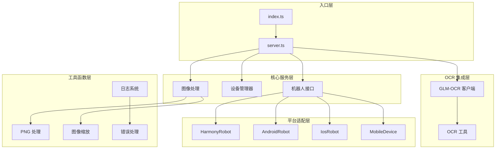
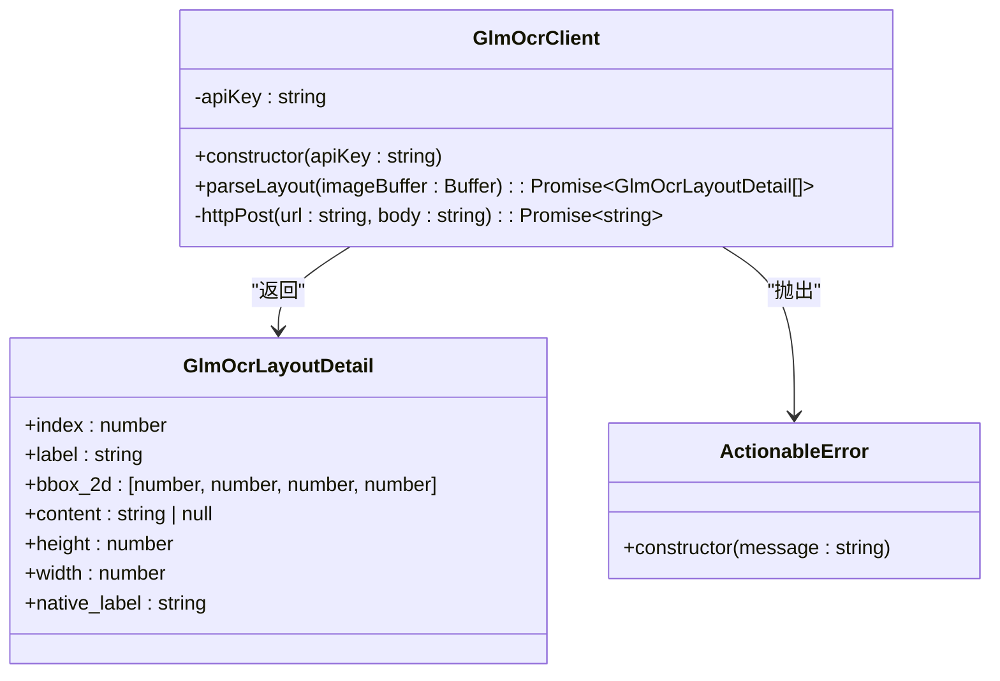
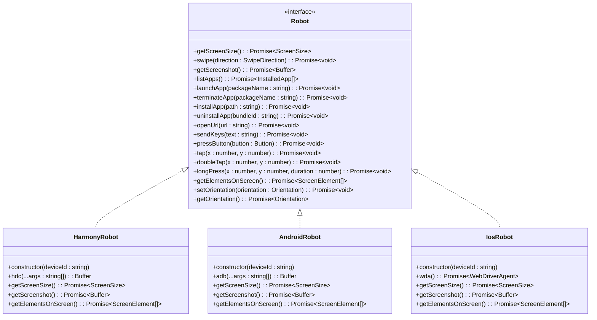
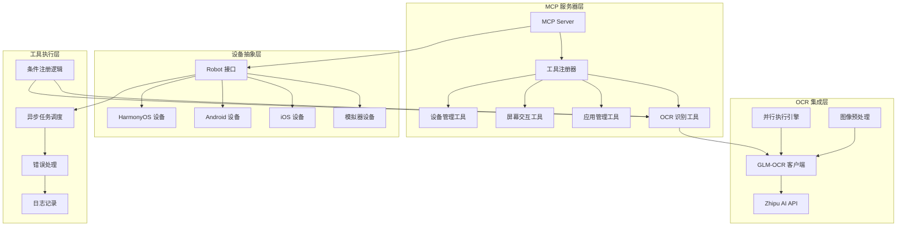
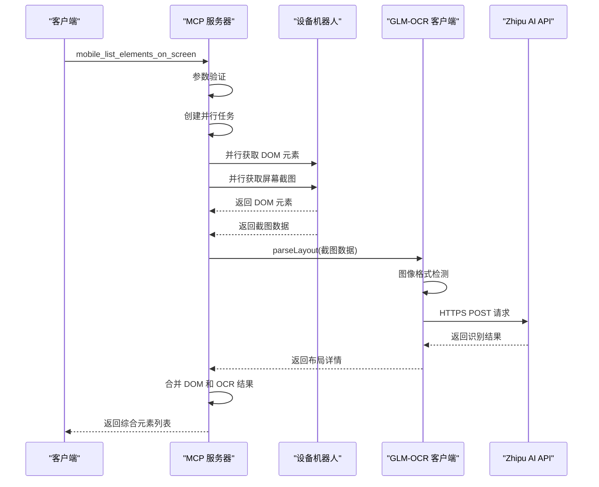
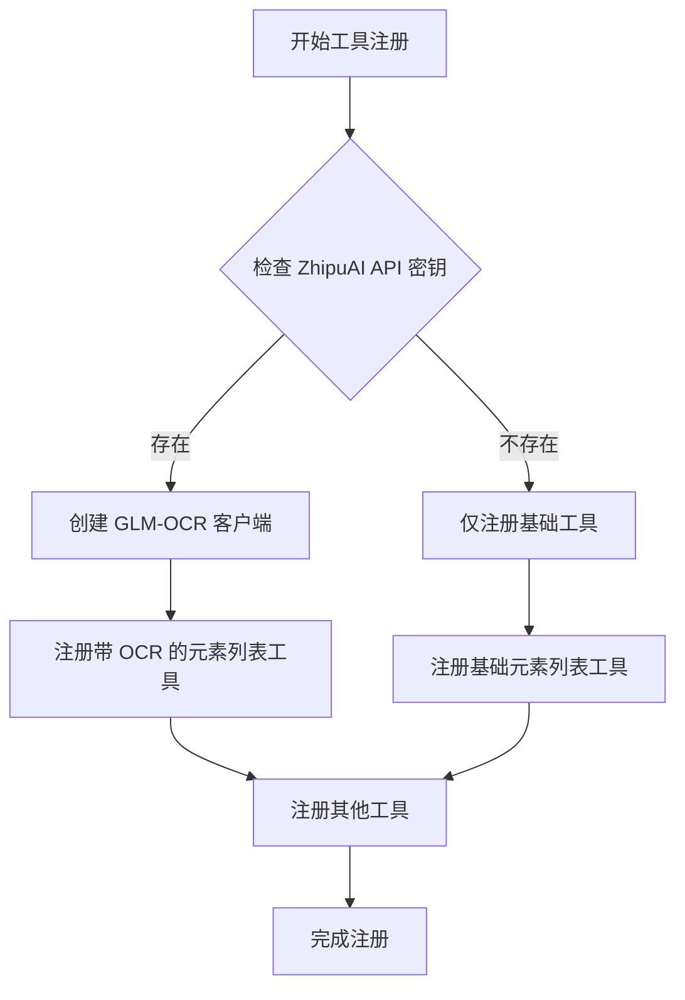
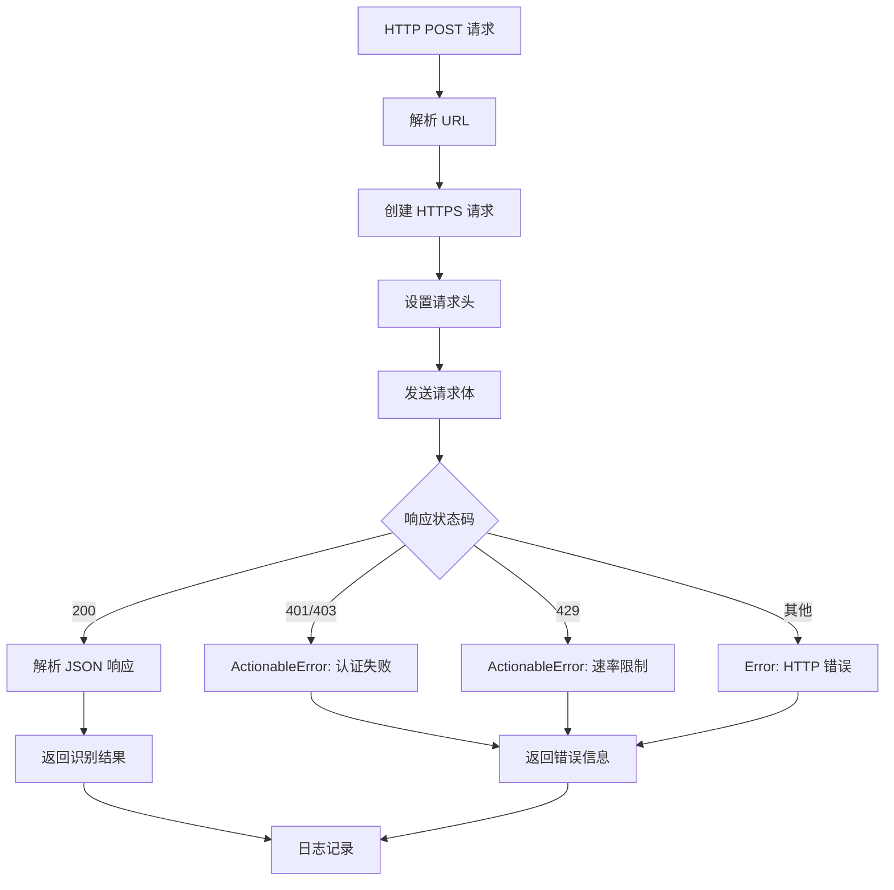
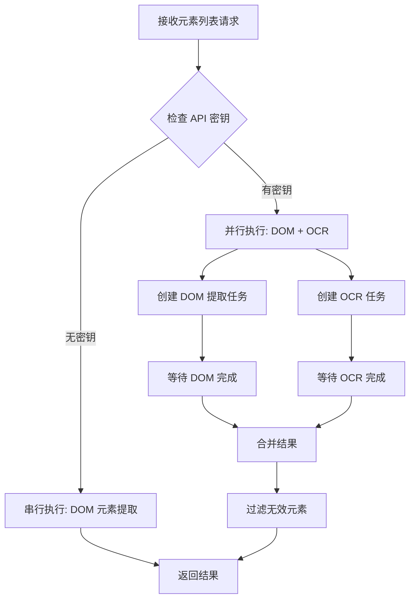
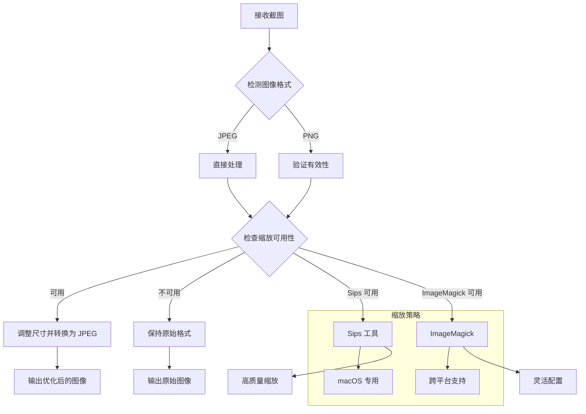
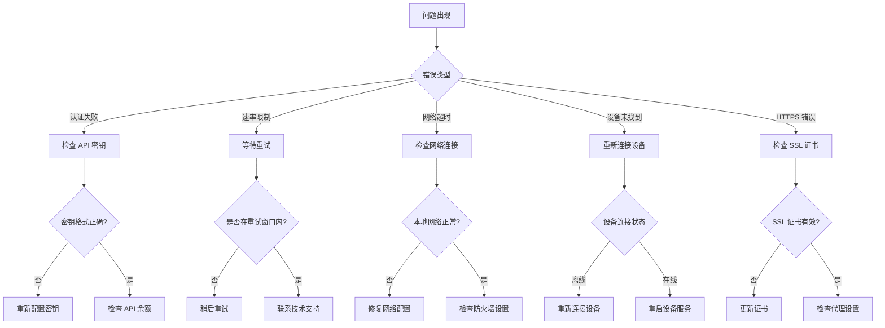

# GLM-OCR 集成

<cite>
**本文档引用的文件**
- [index.ts](file://src/index.ts)
- [server.ts](file://src/server.ts)
- [glm-ocr.ts](file://src/glm-ocr.ts)
- [robot.ts](file://src/robot.ts)
- [mobile-device.ts](file://src/mobile-device.ts)
- [mobilecli.ts](file://src/mobilecli.ts)
- [png.ts](file://src/png.ts)
- [image-utils.ts](file://src/image-utils.ts)
- [harmony.ts](file://src/harmony.ts)
- [android.ts](file://src/android.ts)
- [ios.ts](file://src/ios.ts)
- [logger.ts](file://src/logger.ts)
- [package.json](file://package.json)
- [README.md](file://README.md)
</cite>

## 更新摘要
**变更内容**
- 更新了 GLM-OCR 集成功能增强部分，反映 mobile_ocr_elements_on_screen 工具已整合到 mobile_list_elements_on_screen 中
- 新增了并行执行 DOM 元素提取和 OCR 识别的架构说明
- 更新了 HTTPS 客户端实现和条件注册逻辑的详细分析
- 增强了性能优化和错误处理机制的描述

## 目录
1. [简介](#简介)
2. [项目结构](#项目结构)
3. [核心组件](#核心组件)
4. [架构概览](#架构概览)
5. [详细组件分析](#详细组件分析)
6. [依赖关系分析](#依赖关系分析)
7. [性能考虑](#性能考虑)
8. [故障排除指南](#故障排除指南)
9. [结论](#结论)

## 简介

GLM-OCR 集成是基于 Mobile MCP HarmonyOS 项目的一个重要扩展功能，它为移动设备自动化提供了强大的屏幕文字识别能力。该项目是一个基于 Model Context Protocol (MCP) 的服务器，支持 iOS、Android 和 HarmonyOS 平台的设备自动化，特别集成了 GLM-OCR 服务来处理复杂的屏幕元素识别任务。

**更新** 该集成现已实现重大功能增强，将独立的 `mobile_ocr_elements_on_screen` 工具整合到 `mobile_list_elements_on_screen` 中，实现了并行执行 DOM 元素提取和 OCR 识别的双重识别机制。

该集成的核心价值在于：
- **多平台支持**：统一的 MCP 工具集支持 iOS、Android、HarmonyOS 三大平台
- **智能识别**：结合无障碍树和 OCR 技术，提供双重保障的屏幕元素识别
- **LLM 友好**：基于结构化数据的交互方式，无需依赖视觉模型
- **确定性操作**：优先使用结构化数据，减少纯截图方案的歧义
- **性能优化**：并行执行 DOM 元素提取和 OCR 识别，提升整体响应速度

## 项目结构

项目采用模块化的 TypeScript 架构设计，主要包含以下核心模块：



**图表来源**
- [index.ts:1-71](file://src/index.ts#L1-L71)
- [server.ts:1-752](file://src/server.ts#L1-L752)

**章节来源**
- [index.ts:1-71](file://src/index.ts#L1-L71)
- [server.ts:1-752](file://src/server.ts#L1-L752)

## 核心组件

### GLM-OCR 客户端

GLM-OCR 客户端是本次集成的核心组件，负责与智谱 AI 的 GLM-OCR 服务进行通信：



**图表来源**
- [glm-ocr.ts:35-128](file://src/glm-ocr.ts#L35-L128)

**更新** 新增了 HTTPS 客户端实现，使用原生 Node.js `https` 模块替代之前的 `fetch` 实现，提供更精确的错误处理和超时控制。

### 设备抽象层

项目实现了统一的机器人接口，支持多种设备平台：



**图表来源**
- [robot.ts:48-148](file://src/robot.ts#L48-L148)
- [harmony.ts:43-462](file://src/harmony.ts#L43-L462)
- [android.ts:74-593](file://src/android.ts#L74-L593)
- [ios.ts:42-294](file://src/ios.ts#L42-L294)

**章节来源**
- [glm-ocr.ts:1-128](file://src/glm-ocr.ts#L1-L128)
- [robot.ts:1-148](file://src/robot.ts#L1-L148)

## 架构概览

项目采用分层架构设计，实现了高度模块化的组件分离：



**更新** 新增了并行执行引擎和条件注册逻辑，实现了更高效的 OCR 识别流程。

**图表来源**
- [server.ts:40-752](file://src/server.ts#L40-L752)
- [index.ts:9-71](file://src/index.ts#L9-L71)

## 详细组件分析

### GLM-OCR 工具集成流程

**更新** OCR 工具的集成现已实现并行执行模式，将 DOM 元素提取和 OCR 识别合并到单一工具中：



**图表来源**
- [server.ts:450-527](file://src/server.ts#L450-L527)
- [glm-ocr.ts:42-71](file://src/glm-ocr.ts#L42-L71)

### 条件注册逻辑

系统实现了智能的条件注册机制，根据配置动态启用 OCR 功能：



**图表来源**
- [server.ts:457-460](file://src/server.ts#L457-L460)
- [index.ts:55-61](file://src/index.ts#L55-L61)

### HTTPS 客户端实现

**更新** 新增了专门的 HTTPS 客户端实现，提供更精确的错误处理：



**图表来源**
- [glm-ocr.ts:73-126](file://src/glm-ocr.ts#L73-L126)

**章节来源**
- [server.ts:450-527](file://src/server.ts#L450-L527)
- [glm-ocr.ts:1-128](file://src/glm-ocr.ts#L1-L128)

## 依赖关系分析

项目依赖关系展现了清晰的模块化设计：

```mermaid
graph TB
subgraph "外部依赖"
A[@modelcontextprotocol/sdk] --> B[MCP 服务器框架]
C[commander] --> D[命令行参数解析]
E[express] --> F[SSE 服务器]
G[zod] --> H[参数验证]
I[fast-xml-parser] --> J[XML 解析]
K[node:https] --> L[HTTPS 客户端]
end
subgraph "内部模块"
B --> M[设备管理]
B --> N[工具注册]
B --> O[图像处理]
M --> P[HarmonyRobot]
M --> Q[AndroidRobot]
M --> R[IosRobot]
O --> S[PNG 处理]
O --> T[图像缩放]
end
subgraph "可选依赖"
U[@mobilenext/mobilecli] --> V[mobilecli 工具]
end
subgraph "运行时依赖"
W[node:fs] --> X[文件系统操作]
Y[node:os] --> Z[操作系统信息]
AA[node:child_process] --> AB[子进程执行]
AC[node:crypto] --> AD[加密哈希]
AE[node:PNG] --> AF[图像解码]
end
```

**更新** 新增了 `node:https` 和 `node:crypto` 依赖，用于 HTTPS 客户端和遥测系统的匿名标识生成。

**图表来源**
- [package.json:29-39](file://package.json#L29-L39)
- [server.ts:1-16](file://src/server.ts#L1-L16)

**章节来源**
- [package.json:1-74](file://package.json#L1-L74)
- [server.ts:1-752](file://src/server.ts#L1-L752)

## 性能考虑

### 并行执行优化

**更新** 实现了并行执行机制，显著提升了响应速度：



**图表来源**
- [server.ts:462-496](file://src/server.ts#L462-L496)

### 图像处理优化

项目实现了智能的图像处理策略：



**图表来源**
- [server.ts:602-677](file://src/server.ts#L602-L677)
- [image-utils.ts:137-165](file://src/image-utils.ts#L137-L165)

### API 调用优化

**更新** GLM-OCR 客户端实现了高效的 HTTPS API 调用机制：

- **超时控制**：30秒请求超时，防止长时间阻塞
- **格式检测**：自动检测图像格式并设置正确的 MIME 类型
- **错误分类**：区分认证错误、速率限制和其他 HTTP 错误
- **资源清理**：确保超时后正确清理 HTTPS 请求资源
- **HTTPS 实现**：使用原生 `node:https` 模块替代 `fetch`，提供更精确的控制

**章节来源**
- [glm-ocr.ts:53-128](file://src/glm-ocr.ts#L53-L128)
- [server.ts:602-677](file://src/server.ts#L602-L677)

## 故障排除指南

### 常见问题诊断



### 日志记录和调试

系统提供了完善的日志记录机制：

- **TRACE 级别**：详细的操作流程记录，包括并行执行状态
- **ERROR 级别**：错误信息和堆栈跟踪
- **文件输出**：支持通过环境变量配置日志文件路径
- **遥测数据**：匿名收集使用统计信息，不包含个人数据

**更新** 新增了 HTTPS 请求和并行执行的详细日志记录。

**章节来源**
- [logger.ts:1-22](file://src/logger.ts#L1-L22)
- [glm-ocr.ts:70-81](file://src/glm-ocr.ts#L70-L81)

## 结论

GLM-OCR 集成项目成功地将先进的 OCR 技术与移动设备自动化相结合，为多平台设备控制提供了强大的视觉识别能力。**更新** 该集成现已实现重大功能增强，主要体现在以下几个方面：

### 主要改进

1. **功能整合**：将独立的 `mobile_ocr_elements_on_screen` 工具整合到 `mobile_list_elements_on_screen` 中，实现统一的元素识别接口
2. **性能优化**：通过并行执行 DOM 元素提取和 OCR 识别，显著提升响应速度
3. **架构升级**：采用条件注册逻辑，根据配置动态启用 OCR 功能
4. **技术增强**：使用原生 HTTPS 客户端实现，提供更精确的错误处理和超时控制

### 技术优势

- **统一接口**：用户只需调用一个工具即可获得 DOM 和 OCR 的双重识别结果
- **智能并发**：并行执行两个独立的任务，充分利用系统资源
- **弹性设计**：根据 API 密钥的存在与否动态调整功能
- **稳定可靠**：完善的错误处理和重试机制

### 应用场景

该集成特别适用于需要处理复杂界面元素识别的场景，如：
- WebView 内容识别
- Canvas 渲染页面分析
- 自定义控件检测
- 动态内容提取
- 多模态界面理解

### 未来发展方向

- 支持更多 OCR 服务提供商
- 实现本地 OCR 模型集成
- 优化图像处理算法
- 增强错误恢复能力
- 扩展并行执行的工具范围

该更新显著提升了系统的整体性能和用户体验，为移动设备自动化提供了更加完善和高效的解决方案。