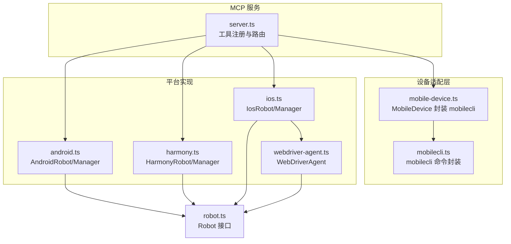
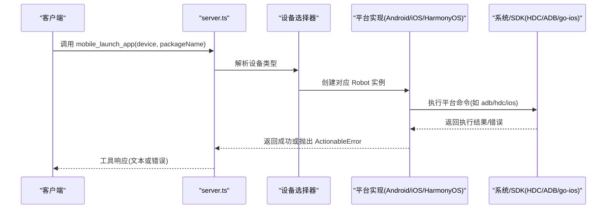
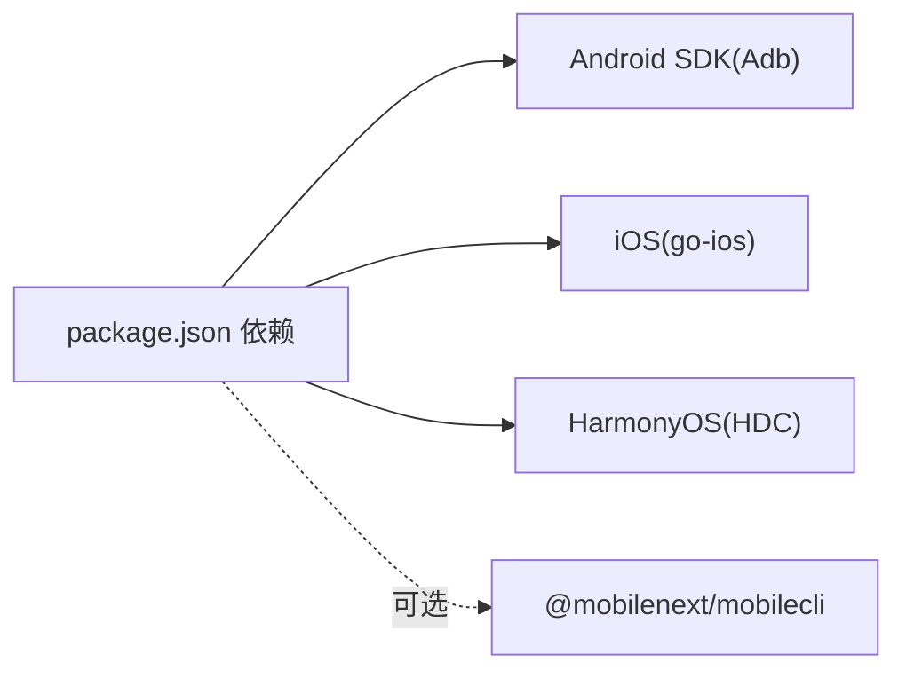

# 应用管理工具

<cite>
**本文引用的文件**
- [src/server.ts](file://src/server.ts)
- [src/mobile-device.ts](file://src/mobile-device.ts)
- [src/mobilecli.ts](file://src/mobilecli.ts)
- [src/android.ts](file://src/android.ts)
- [src/harmony.ts](file://src/harmony.ts)
- [src/ios.ts](file://src/ios.ts)
- [src/webdriver-agent.ts](file://src/webdriver-agent.ts)
- [src/robot.ts](file://src/robot.ts)
- [README.md](file://README.md)
- [package.json](file://package.json)
</cite>

## 目录
1. [简介](#简介)
2. [项目结构](#项目结构)
3. [核心组件](#核心组件)
4. [架构总览](#架构总览)
5. [详细组件分析](#详细组件分析)
6. [依赖关系分析](#依赖关系分析)
7. [性能考量](#性能考量)
8. [故障排查指南](#故障排查指南)
9. [结论](#结论)
10. [附录](#附录)

## 简介
本文件为“应用管理工具”的完整参考文档，覆盖 mobile_list_apps、mobile_launch_app、mobile_terminate_app、mobile_install_app、mobile_uninstall_app 等工具在 HarmonyOS、Android、iOS 平台上的实现与使用方法。文档重点说明：
- 参数要求与调用流程
- 权限与环境依赖
- 错误恢复与异常处理
- 不同平台的应用包名识别、安装包格式支持、应用生命周期管理差异
- 安全考虑与性能优化建议

## 项目结构
该项目基于 Model Context Protocol（MCP）服务端，统一暴露一组移动端自动化工具，内部根据设备类型路由到对应的平台实现：
- 通用入口与工具注册：server.ts
- 设备与应用管理适配层：mobile-device.ts（封装 mobilecli）
- 平台实现：
  - Android：android.ts（ADB + UIAutomator）
  - iOS：ios.ts（go-ios + WebDriverAgent）
  - HarmonyOS：harmony.ts（HDC + uitest + hidumper）
- 机器人接口定义：robot.ts
- 截图与图像处理：png.ts、image-utils.ts
- 日志与工具：logger.ts、server.ts 中的工具包装与错误处理

图表来源
- [src/server.ts:135-197](file://src/server.ts#L135-L197)
- [src/mobile-device.ts:62-216](file://src/mobile-device.ts#L62-L216)
- [src/mobilecli.ts:27-135](file://src/mobilecli.ts#L27-L135)
- [src/android.ts:74-504](file://src/android.ts#L74-L504)
- [src/harmony.ts:43-416](file://src/harmony.ts#L43-L416)
- [src/ios.ts:42-232](file://src/ios.ts#L42-L232)
- [src/webdriver-agent.ts:25-454](file://src/webdriver-agent.ts#L25-L454)
- [src/robot.ts:48-147](file://src/robot.ts#L48-L147)

章节来源
- [README.md:1-198](file://README.md#L1-L198)
- [package.json:1-74](file://package.json#L1-L74)

## 核心组件
- 通用工具注册与路由：server.ts 注册 mobile_list_apps、mobile_launch_app、mobile_terminate_app、mobile_install_app、mobile_uninstall_app 等工具，并根据设备 ID 动态选择具体实现（HarmonyOS、iOS、Android 或模拟器）。
- 设备与应用适配：mobile-device.ts 通过 mobilecli 提供统一的 apps list/launch/terminate/install/uninstall 能力；android.ts、harmony.ts、ios.ts 分别实现平台特定细节。
- 平台实现：
  - Android：ADB 命令、UIAutomator、包管理命令、无障碍树解析。
  - iOS：go-ios 命令、WebDriverAgent、URL 打开、文本输入、按键事件。
  - HarmonyOS：HDC 命令、uitest、hidumper、snapshot_display、bm/aa。
- 接口契约：robot.ts 定义统一的 Robot 接口，确保各平台实现一致。

章节来源
- [src/server.ts:298-375](file://src/server.ts#L298-L375)
- [src/mobile-device.ts:144-166](file://src/mobile-device.ts#L144-L166)
- [src/android.ts:118-131](file://src/android.ts#L118-L131)
- [src/harmony.ts:221-232](file://src/harmony.ts#L221-L232)
- [src/ios.ts:125-138](file://src/ios.ts#L125-L138)
- [src/robot.ts:48-147](file://src/robot.ts#L48-L147)

## 架构总览
应用管理工具的调用链路如下：
- 客户端调用工具（如 mobile_launch_app）
- 服务端解析参数，定位设备
- 依据设备类型选择对应实现（HarmonyOS、iOS、Android 或 MobileDevice）
- 平台实现执行相应系统命令或接口
- 返回结果或抛出可处理的 ActionableError

图表来源
- [src/server.ts:149-197](file://src/server.ts#L149-L197)
- [src/android.ts:142-148](file://src/android.ts#L142-L148)
- [src/harmony.ts:234-262](file://src/harmony.ts#L234-L262)
- [src/ios.ts:140-143](file://src/ios.ts#L140-L143)

## 详细组件分析

### mobile_list_apps
- 功能：列出设备上已安装的应用。
- 参数：
  - device：设备标识（通过 mobile_list_available_devices 获取）
- 执行流程：
  - 服务端根据 device 选择平台实现
  - Android：通过 ADB 查询包列表并过滤有 Launcher 的应用
  - iOS：通过 go-ios apps 列表
  - HarmonyOS：通过 bm dump -a
  - MobileDevice：通过 mobilecli apps list
- 返回值：应用名称与包名映射列表
- 平台差异：
  - Android：仅返回具有主入口活动（Launcher）的应用
  - iOS/Android/HarmonyOS：返回设备上所有已安装应用
- 错误处理：ActionableError 用于提示用户修复问题

章节来源
- [src/server.ts:298-311](file://src/server.ts#L298-L311)
- [src/android.ts:118-131](file://src/android.ts#L118-L131)
- [src/ios.ts:125-138](file://src/ios.ts#L125-L138)
- [src/harmony.ts:221-232](file://src/harmony.ts#L221-L232)
- [src/mobile-device.ts:144-150](file://src/mobile-device.ts#L144-L150)

### mobile_launch_app
- 功能：启动指定包名的应用。
- 参数：
  - device：设备标识
  - packageName：应用包名（Android/iOS 使用 bundle id）
- 执行流程：
  - Android：monkey 启动主入口或 am 启动
  - iOS：go-ios launch
  - HarmonyOS：aa start -a ability -b bundle
  - MobileDevice：mobilecli apps launch
- 平台差异：
  - Android：需要存在主入口活动
  - HarmonyOS：需解析主 Ability 名称
- 错误处理：ActionableError 提示包名不存在或启动失败

章节来源
- [src/server.ts:313-327](file://src/server.ts#L313-L327)
- [src/android.ts:142-148](file://src/android.ts#L142-L148)
- [src/ios.ts:140-143](file://src/ios.ts#L140-L143)
- [src/harmony.ts:234-262](file://src/harmony.ts#L234-L262)
- [src/mobile-device.ts:152-154](file://src/mobile-device.ts#L152-L154)

### mobile_terminate_app
- 功能：停止并终止应用。
- 参数：
  - device：设备标识
  - packageName：应用包名或 bundle id
- 执行流程：
  - Android：am force-stop
  - iOS：go-ios kill
  - HarmonyOS：aa force-stop
  - MobileDevice：mobilecli apps terminate
- 平台差异：
  - Android/iOS/HarmonyOS：均支持强制停止
- 错误处理：ActionableError 提示应用不存在或停止失败

章节来源
- [src/server.ts:329-343](file://src/server.ts#L329-L343)
- [src/android.ts:358-360](file://src/android.ts#L358-L360)
- [src/ios.ts:145-148](file://src/ios.ts#L145-L148)
- [src/harmony.ts:264-266](file://src/harmony.ts#L264-L266)
- [src/mobile-device.ts:156-158](file://src/mobile-device.ts#L156-L158)

### mobile_install_app
- 功能：安装应用。
- 参数：
  - device：设备标识
  - path：安装包路径
- 安装包格式支持：
  - Android：.apk
  - iOS 真机：.ipa
  - iOS 模拟器：.app 目录或 .zip
  - HarmonyOS：.hap（通过 HDC 安装）
- 执行流程：
  - Android：adb install -r
  - iOS：go-ios install --path
  - HarmonyOS：hdc install -r
  - MobileDevice：mobilecli apps install
- 错误处理：捕获 stdout/stderr 输出，抛出 ActionableError

章节来源
- [src/server.ts:345-359](file://src/server.ts#L345-L359)
- [src/android.ts:362-371](file://src/android.ts#L362-L371)
- [src/ios.ts:150-160](file://src/ios.ts#L150-L160)
- [src/harmony.ts:268-277](file://src/harmony.ts#L268-L277)
- [src/mobile-device.ts:160-162](file://src/mobile-device.ts#L160-L162)

### mobile_uninstall_app
- 功能：卸载应用。
- 参数：
  - device：设备标识
  - bundle_id：应用包名（Android）或 Bundle Identifier（iOS）
- 执行流程：
  - Android：adb uninstall
  - iOS：go-ios uninstall --bundleid
  - HarmonyOS：hdc uninstall
  - MobileDevice：mobilecli apps uninstall
- 错误处理：捕获 stdout/stderr 输出，抛出 ActionableError

章节来源
- [src/server.ts:361-375](file://src/server.ts#L361-L375)
- [src/android.ts:373-382](file://src/android.ts#L373-L382)
- [src/ios.ts:162-172](file://src/ios.ts#L162-L172)
- [src/harmony.ts:279-288](file://src/harmony.ts#L279-L288)
- [src/mobile-device.ts:164-166](file://src/mobile-device.ts#L164-L166)

### 平台差异与特殊处理
- Android
  - 包名识别：pm list packages / cmd package query-activities
  - 安装包格式：.apk
  - 生命周期：am force-stop；monkey 启动
  - 文本输入：ASCII 直接输入；非 ASCII 通过设备工具或转义
  - 屏幕尺寸：wm size；多显示器：dumpsys SurfaceFlinger
- iOS
  - 包名识别：go-ios apps --all --list
  - 安装包格式：.ipa（真机）、.app/.zip（模拟器）
  - 生命周期：go-ios launch/kill
  - 文本输入：WebDriverAgent；URL 打开：openUrl
  - 方向控制：WebDriverAgent；需隧道与端口转发
- HarmonyOS
  - 包名识别：bm dump -a；主 Ability 解析
  - 安装包格式：.hap
  - 生命周期：aa start/force-stop
  - 文本输入：uitest inputText；方向不支持程序化切换
  - 截图：snapshot_display + file recv

章节来源
- [src/android.ts:94-101](file://src/android.ts#L94-L101)
- [src/android.ts:118-131](file://src/android.ts#L118-L131)
- [src/android.ts:362-371](file://src/android.ts#L362-L371)
- [src/android.ts:402-427](file://src/android.ts#L402-L427)
- [src/ios.ts:125-138](file://src/ios.ts#L125-L138)
- [src/ios.ts:150-160](file://src/ios.ts#L150-L160)
- [src/ios.ts:209-221](file://src/ios.ts#L209-L221)
- [src/harmony.ts:221-232](file://src/harmony.ts#L221-L232)
- [src/harmony.ts:268-277](file://src/harmony.ts#L268-L277)
- [src/harmony.ts:401-415](file://src/harmony.ts#L401-L415)

### 错误处理与安全考虑
- 错误处理
  - 统一使用 ActionableError，便于客户端识别并引导用户修复
  - 安装/卸载场景捕获子进程 stdout/stderr，拼接输出作为错误信息
  - iOS 需要隧道与端口转发检查，缺失时明确提示
- 安全考虑
  - Android 非 ASCII 文本输入需设备工具或转义，避免注入风险
  - iOS 文本输入通过 WebDriverAgent，注意 URL Scheme 与键盘事件
  - HarmonyOS 文本输入基于焦点元素坐标，避免误触
- 性能优化
  - 截图后自动缩放与格式转换（PNG→JPEG），降低传输体积
  - 多显示器 Android 设备优先选择激活显示，提升稳定性

章节来源
- [src/android.ts:362-371](file://src/android.ts#L362-L371)
- [src/ios.ts:150-160](file://src/ios.ts#L150-L160)
- [src/harmony.ts:268-277](file://src/harmony.ts#L268-L277)
- [src/server.ts:585-673](file://src/server.ts#L585-L673)

## 依赖关系分析
- 运行时依赖
  - Android：ADB（通过 ANDROID_HOME 或系统 PATH）
  - iOS：go-ios（通过 GO_IOS_PATH 或系统 PATH）
  - HarmonyOS：HDC（通过 HDC_SDK_PATH 或系统 PATH）
  - 通用：mobilecli（可选，用于 iOS 模拟器与部分设备发现）
- 内部依赖
  - server.ts 依赖各平台实现与 mobilecli/MobileDevice
  - 平台实现依赖系统命令与 SDK 工具
  - robot.ts 定义统一接口，降低耦合

图表来源
- [package.json:29-39](file://package.json#L29-L39)
- [README.md:90-99](file://README.md#L90-L99)

章节来源
- [package.json:29-39](file://package.json#L29-L39)
- [README.md:90-99](file://README.md#L90-L99)

## 性能考量
- 截图优化
  - 自动检测图像格式并进行缩放与压缩，减少网络传输与存储开销
- 命令超时与缓冲区限制
  - 统一设置超时与最大缓冲区，避免长时间阻塞
- 平台差异优化
  - Android 多显示器场景优先选择激活显示，提高稳定性
  - iOS 仅在必要时创建 WebDriver 会话，减少资源占用

章节来源
- [src/server.ts:585-673](file://src/server.ts#L585-L673)
- [src/android.ts:295-310](file://src/android.ts#L295-L310)
- [src/webdriver-agent.ts:42-77](file://src/webdriver-agent.ts#L42-L77)

## 故障排查指南
- mobilecli 不可用
  - 现象：无法发现 iOS 真机/Android 设备或模拟器
  - 处理：安装并正确配置 mobilecli，或设置 MOBILECLI_PATH 环境变量
- iOS 隧道未运行
  - 现象：调用 iOS 工具时报隧道未运行
  - 处理：启动隧道与端口转发，确保本地端口可达
- ADB/SDK 未找到
  - 现象：Android 设备无法被识别
  - 处理：设置 ANDROID_HOME 或系统 PATH，确保 adb 可用
- HDC 未找到
  - 现象：HarmonyOS 设备无法被识别
  - 处理：设置 HDC_SDK_PATH 或将 hdc 加入 PATH
- 安装/卸载失败
  - 现象：安装包格式不支持或签名问题
  - 处理：确认包格式与目标平台匹配，查看 ActionableError 输出

章节来源
- [src/server.ts:138-147](file://src/server.ts#L138-L147)
- [src/ios.ts:69-92](file://src/ios.ts#L69-L92)
- [src/android.ts:32-54](file://src/android.ts#L32-L54)
- [src/harmony.ts:12-18](file://src/harmony.ts#L12-L18)
- [src/android.ts:362-371](file://src/android.ts#L362-L371)
- [src/ios.ts:150-160](file://src/ios.ts#L150-L160)
- [src/harmony.ts:268-277](file://src/harmony.ts#L268-L277)

## 结论
本应用管理工具通过统一的 MCP 工具接口，屏蔽了 Android、iOS、HarmonyOS 的平台差异，提供了稳定、可扩展的应用生命周期管理能力。结合完善的错误处理与性能优化策略，能够在多平台环境下高效、安全地完成应用安装、启动、终止与卸载任务。

## 附录
- 工具清单与用途概览见 README 的“MCP 工具列表”章节
- 平台支持与前置依赖见 README 的“安装与配置”章节

章节来源
- [README.md:47-86](file://README.md#L47-L86)
- [README.md:90-172](file://README.md#L90-L172)