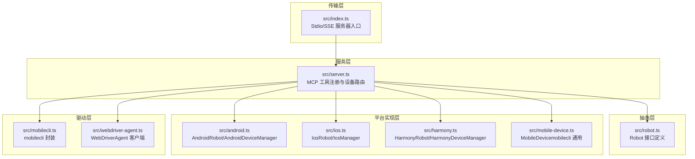
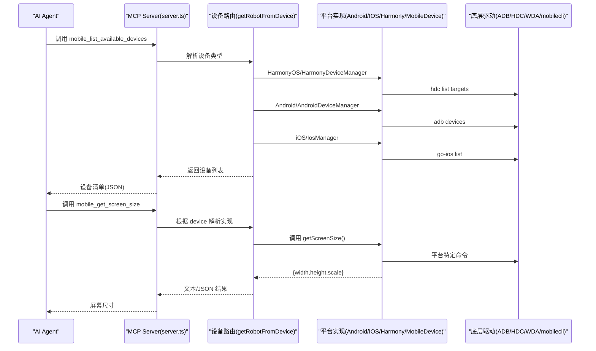
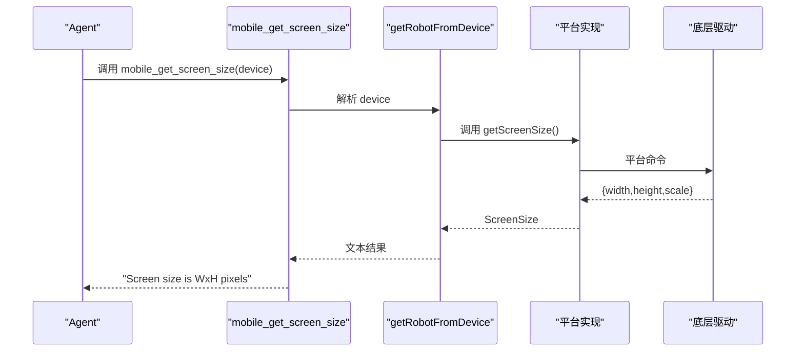
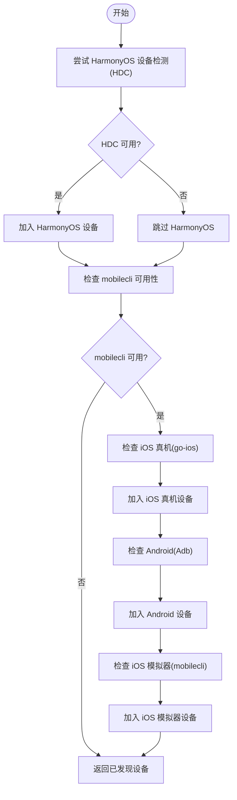
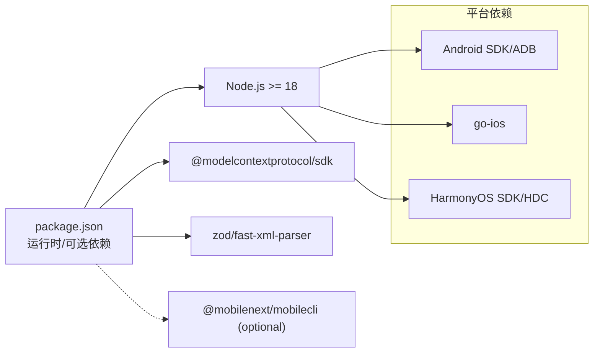

# 设备管理工具

<cite>
**本文引用的文件**
- [src/index.ts](file://src/index.ts)
- [src/server.ts](file://src/server.ts)
- [src/robot.ts](file://src/robot.ts)
- [src/mobilecli.ts](file://src/mobilecli.ts)
- [src/mobile-device.ts](file://src/mobile-device.ts)
- [src/android.ts](file://src/android.ts)
- [src/harmony.ts](file://src/harmony.ts)
- [src/ios.ts](file://src/ios.ts)
- [README.md](file://README.md)
- [DEEPWIKI.md](file://DEEPWIKI.md)
- [package.json](file://package.json)
- [test/mobilecli.test.ts](file://test/mobilecli.test.ts)
</cite>

## 目录
1. [简介](#简介)
2. [项目结构](#项目结构)
3. [核心组件](#核心组件)
4. [架构总览](#架构总览)
5. [详细组件分析](#详细组件分析)
6. [依赖关系分析](#依赖关系分析)
7. [性能考量](#性能考量)
8. [故障排查指南](#故障排查指南)
9. [结论](#结论)
10. [附录](#附录)

## 简介
本文件为设备管理工具的参考文档，重点覆盖以下核心设备管理工具：
- mobile_list_available_devices：列出所有可用设备（含 HarmonyOS、iOS、Android 真机/模拟器）
- mobile_get_screen_size：获取设备屏幕尺寸（像素）
- mobile_get_orientation：获取当前屏幕方向
- mobile_set_orientation：设置屏幕方向（横屏/竖屏）

文档将从架构、数据流、参数与返回值、错误处理、平台差异、最佳实践等方面进行系统化说明，并提供可视化图示帮助理解。

## 项目结构
项目采用分层架构，围绕统一的 Robot 接口抽象，分别针对 Android、iOS、HarmonyOS 提供平台实现，并通过 MCP 工具层对外暴露统一的 API。

图表来源
- [src/index.ts:1-67](file://src/index.ts#L1-L67)
- [src/server.ts:35-708](file://src/server.ts#L35-L708)
- [src/robot.ts:48-147](file://src/robot.ts#L48-L147)
- [src/android.ts:74-504](file://src/android.ts#L74-L504)
- [src/harmony.ts:43-416](file://src/harmony.ts#L43-L416)
- [src/ios.ts:42-232](file://src/ios.ts#L42-L232)
- [src/mobile-device.ts:62-216](file://src/mobile-device.ts#L62-L216)
- [src/mobilecli.ts:27-135](file://src/mobilecli.ts#L27-L135)

章节来源
- [src/index.ts:1-67](file://src/index.ts#L1-L67)
- [src/server.ts:35-708](file://src/server.ts#L35-L708)
- [README.md:1-198](file://README.md#L1-L198)
- [DEEPWIKI.md:32-114](file://DEEPWIKI.md#L32-L114)

## 核心组件
- Robot 接口：定义设备统一能力（屏幕尺寸、方向、点击、滑动、截图、输入、按键、应用管理、元素枚举等）
- 平台实现：
  - AndroidRobot：基于 ADB 的 Android 实现
  - IosRobot：基于 go-ios + WebDriverAgent 的 iOS 实现
  - HarmonyRobot：基于 HDC + uitest + hidumper 的 HarmonyOS 实现
  - MobileDevice：基于 mobilecli 的通用设备实现（用于 iOS 模拟器等）
- MCP 工具层：在 server.ts 中注册工具，包括设备管理、应用管理、屏幕交互、输入导航等

章节来源
- [src/robot.ts:48-147](file://src/robot.ts#L48-L147)
- [src/android.ts:74-504](file://src/android.ts#L74-L504)
- [src/harmony.ts:43-416](file://src/harmony.ts#L43-L416)
- [src/ios.ts:42-232](file://src/ios.ts#L42-L232)
- [src/mobile-device.ts:62-216](file://src/mobile-device.ts#L62-L216)
- [src/server.ts:199-704](file://src/server.ts#L199-L704)

## 架构总览
设备管理工具通过 MCP 工具层统一对外，内部根据设备 ID 动态路由到对应的平台实现。设备发现流程支持 HarmonyOS、iOS 真机、Android 设备以及 iOS 模拟器。

图表来源
- [src/server.ts:149-197](file://src/server.ts#L149-L197)
- [src/server.ts:207-294](file://src/server.ts#L207-L294)
- [src/harmony.ts:418-461](file://src/harmony.ts#L418-L461)
- [src/android.ts:506-592](file://src/android.ts#L506-L592)
- [src/ios.ts:234-293](file://src/ios.ts#L234-L293)

章节来源
- [src/server.ts:149-197](file://src/server.ts#L149-L197)
- [src/server.ts:207-294](file://src/server.ts#L207-L294)
- [src/harmony.ts:418-461](file://src/harmony.ts#L418-L461)
- [src/android.ts:506-592](file://src/android.ts#L506-L592)
- [src/ios.ts:234-293](file://src/ios.ts#L234-L293)

## 详细组件分析

### mobile_list_available_devices
- 功能：列出所有可用设备，包括 HarmonyOS、Android、iOS 真机、iOS 模拟器
- 参数：无
- 返回值：JSON 字符串，包含 devices 数组，每项包含 id、name、platform、type、version、state
- 错误处理：
  - 若 mobilecli 不可用，跳过 Android/iOS 设备发现，仅返回 HarmonyOS 设备
  - 若 hdc 不可用，跳过 HarmonyOS 设备发现
  - 若 go-ios 不可用，跳过 iOS 真机发现
- 使用示例：在 MCP 客户端中调用该工具，得到设备清单后选择目标 device

章节来源
- [src/server.ts:207-294](file://src/server.ts#L207-L294)
- [src/harmony.ts:418-461](file://src/harmony.ts#L418-L461)
- [src/android.ts:506-592](file://src/android.ts#L506-L592)
- [src/ios.ts:234-293](file://src/ios.ts#L234-L293)

### mobile_get_screen_size
- 功能：获取设备屏幕尺寸（像素）
- 参数：
  - device：设备标识符（通过 mobile_list_available_devices 获取）
- 返回值：字符串，例如“Screen size is 1080x2340 pixels”
- 错误处理：
  - ActionableError：设备未找到或平台不支持
  - 普通 Error：底层命令失败
- 平台差异：
  - Android：通过 ADB 查询屏幕尺寸
  - iOS：通过 WebDriverAgent 获取
  - HarmonyOS：通过 HDC hidumper 查询显示信息
  - mobilecli 通用：通过 mobilecli device info

图表来源
- [src/server.ts:377-390](file://src/server.ts#L377-L390)
- [src/android.ts:103-116](file://src/android.ts#L103-L116)
- [src/ios.ts:110-113](file://src/ios.ts#L110-L113)
- [src/harmony.ts:55-69](file://src/harmony.ts#L55-L69)
- [src/mobile-device.ts:75-81](file://src/mobile-device.ts#L75-L81)

章节来源
- [src/server.ts:377-390](file://src/server.ts#L377-L390)
- [src/android.ts:103-116](file://src/android.ts#L103-L116)
- [src/ios.ts:110-113](file://src/ios.ts#L110-L113)
- [src/harmony.ts:55-69](file://src/harmony.ts#L55-L69)
- [src/mobile-device.ts:75-81](file://src/mobile-device.ts#L75-L81)

### mobile_get_orientation
- 功能：获取当前屏幕方向（portrait/landscape）
- 参数：
  - device：设备标识符
- 返回值：字符串，例如“Current device orientation is portrait/landscape”
- 错误处理：ActionableError 或普通 Error
- 平台差异：
  - Android：通过 ADB settings 获取 user_rotation
  - iOS：通过 WebDriverAgent 获取 orientation
  - HarmonyOS：通过 HDC hidumper 解析 ScreenRotation
  - mobilecli 通用：通过 mobilecli device orientation get

章节来源
- [src/server.ts:691-704](file://src/server.ts#L691-L704)
- [src/android.ts:461-464](file://src/android.ts#L461-L464)
- [src/ios.ts:228-231](file://src/ios.ts#L228-L231)
- [src/harmony.ts:401-411](file://src/harmony.ts#L401-L411)
- [src/mobile-device.ts:212-215](file://src/mobile-device.ts#L212-L215)

### mobile_set_orientation
- 功能：设置屏幕方向（portrait/landscape）
- 参数：
  - device：设备标识符
  - orientation：枚举值 "portrait" 或 "landscape"
- 返回值：字符串，例如“Changed device orientation to landscape”
- 错误处理：ActionableError 或普通 Error
- 平台差异：
  - Android：通过 ADB settings put system accelerometer_rotation=0，再写入 user_rotation
  - iOS：通过 WebDriverAgent 设置 orientation
  - HarmonyOS：不支持程序化方向变更，抛出 ActionableError
  - mobilecli 通用：通过 mobilecli device orientation set

章节来源
- [src/server.ts:675-689](file://src/server.ts#L675-L689)
- [src/android.ts:453-459](file://src/android.ts#L453-L459)
- [src/ios.ts:223-226](file://src/ios.ts#L223-L226)
- [src/harmony.ts:413-415](file://src/harmony.ts#L413-L415)
- [src/mobile-device.ts:208-210](file://src/mobile-device.ts#L208-L210)

### 设备发现流程与路由机制
- 设备发现：
  - HarmonyOS：通过 HDC list targets 获取设备列表
  - Android：通过 ADB devices 获取设备列表
  - iOS 真机：通过 go-ios list 获取设备列表
  - iOS 模拟器：通过 mobilecli devices --platform ios --type simulator 获取
- 设备路由：
  - 优先判断是否为 HarmonyOS 设备
  - 否则检查 mobilecli 可用性，再判断 iOS/Android
  - 最后检查是否为 iOS 模拟器（mobilecli）
  - 未匹配则抛出 ActionableError

图表来源
- [src/server.ts:207-294](file://src/server.ts#L207-L294)
- [src/harmony.ts:418-461](file://src/harmony.ts#L418-L461)
- [src/android.ts:506-592](file://src/android.ts#L506-L592)
- [src/ios.ts:234-293](file://src/ios.ts#L234-L293)
- [src/mobilecli.ts:107-134](file://src/mobilecli.ts#L107-L134)

章节来源
- [src/server.ts:207-294](file://src/server.ts#L207-L294)
- [src/harmony.ts:418-461](file://src/harmony.ts#L418-L461)
- [src/android.ts:506-592](file://src/android.ts#L506-L592)
- [src/ios.ts:234-293](file://src/ios.ts#L234-L293)
- [src/mobilecli.ts:107-134](file://src/mobilecli.ts#L107-L134)

### 平台特定实现差异
- Android
  - 屏幕尺寸：adb shell wm size
  - 方向设置：settings put system accelerometer_rotation=0，content insert user_rotation
  - 截图：screencap -p（多屏设备通过 display ID）
  - UI 元素：uiautomator dump
- iOS
  - 屏幕尺寸：WDA /session/{id}/wda/screen
  - 方向设置：WDA /session/{id}/orientation
  - 截图：WDA /screenshot
  - UI 元素：WDA /source/?format=json
- HarmonyOS
  - 屏幕尺寸：hidumper DisplayManagerService
  - 方向设置：不支持程序化变更
  - 截图：snapshot_display
  - UI 元素：uitest dumpLayout
- mobilecli 通用
  - 通过 mobilecli 命令桥接各平台能力

章节来源
- [src/android.ts:103-116](file://src/android.ts#L103-L116)
- [src/android.ts:453-464](file://src/android.ts#L453-L464)
- [src/android.ts:295-310](file://src/android.ts#L295-L310)
- [src/android.ts:466-491](file://src/android.ts#L466-L491)
- [src/ios.ts:110-113](file://src/ios.ts#L110-L113)
- [src/ios.ts:223-231](file://src/ios.ts#L223-L231)
- [src/ios.ts:209-221](file://src/ios.ts#L209-L221)
- [src/ios.ts:204-207](file://src/ios.ts#L204-L207)
- [src/harmony.ts:55-69](file://src/harmony.ts#L55-L69)
- [src/harmony.ts:413-415](file://src/harmony.ts#L413-L415)
- [src/harmony.ts:159-182](file://src/harmony.ts#L159-L182)
- [src/harmony.ts:294-332](file://src/harmony.ts#L294-L332)
- [src/mobile-device.ts:75-81](file://src/mobile-device.ts#L75-L81)
- [src/mobile-device.ts:208-215](file://src/mobile-device.ts#L208-L215)

## 依赖关系分析
- 运行时依赖
  - Node.js >= 18
  - MCP SDK、Express、fast-xml-parser、zod 等
  - 可选依赖：@mobilenext/mobilecli（用于 Android/iOS 设备发现与通用设备）
- 平台依赖
  - Android：ADB（通过 ANDROID_HOME 或 PATH）
  - iOS：go-ios（通过 GO_IOS_PATH 或 PATH）、WebDriverAgent
  - HarmonyOS：HDC（通过 HDC_SDK_PATH 或 PATH）
- 传输协议
  - Stdio（默认）与 SSE（HTTP）

图表来源
- [package.json:29-39](file://package.json#L29-L39)
- [package.json:13-14](file://package.json#L13-L14)
- [README.md:90-99](file://README.md#L90-L99)

章节来源
- [package.json:29-39](file://package.json#L29-L39)
- [package.json:13-14](file://package.json#L13-L14)
- [README.md:90-99](file://README.md#L90-L99)

## 性能考量
- 截图优化：当图片处理工具可用时，将 PNG 截图缩放后转为 JPEG，降低传输体积
- 超时与缓冲：各平台命令执行设置超时与最大缓冲区，避免长时间阻塞
- 设备发现：优先使用平台原生工具，减少不必要的网络请求
- 图像处理链路：PNG 验证 → 缩放 → JPEG 压缩（质量 75），并记录前后字节数

章节来源
- [src/server.ts:600-650](file://src/server.ts#L600-L650)
- [src/android.ts:69-71](file://src/android.ts#L69-L71)
- [src/harmony.ts:9-11](file://src/harmony.ts#L9-L11)
- [src/ios.ts:7-8](file://src/ios.ts#L7-L8)

## 故障排查指南
- mobilecli 不可用
  - 现象：无法发现 Android/iOS 设备或通用设备
  - 处理：设置 MOBILECLI_PATH 或安装 @mobilenext/mobilecli
- ADB 路径问题
  - 现象：Android 设备无法发现
  - 处理：设置 ANDROID_HOME 或确保 adb 在 PATH
- go-ios 未安装
  - 现象：iOS 真机不可用
  - 处理：安装 go-ios（可通过 npm install -g go-ios）
- HDC 不可用
  - 现象：HarmonyOS 设备不可用
  - 处理：设置 HDC_SDK_PATH 或确保 hdc 在 PATH
- iOS 17+ 需要隧道
  - 现象：IosRobot 报错隧道未运行
  - 处理：启动 tunnel（端口 60105）并确保 WDA 端口转发（8100）
- ActionableError vs 普通 Error
  - ActionableError：提示用户修复后重试
  - 普通 Error：系统异常，需检查日志

章节来源
- [src/server.ts:138-147](file://src/server.ts#L138-L147)
- [src/android.ts:32-54](file://src/android.ts#L32-L54)
- [src/ios.ts:69-92](file://src/ios.ts#L69-L92)
- [src/harmony.ts:12-18](file://src/harmony.ts#L12-L18)
- [src/server.ts:81-94](file://src/server.ts#L81-L94)

## 结论
本项目通过统一的 Robot 接口与 MCP 工具层，实现了对 Android、iOS、HarmonyOS 的设备管理能力。设备发现与路由机制灵活，错误处理清晰，具备良好的扩展性。对于设备管理工具（设备列表、屏幕尺寸、方向获取与设置），建议在调用前先通过 mobile_list_available_devices 获取设备 ID，并根据平台特性选择合适的参数与行为。

## 附录

### 参数与返回值规范
- mobile_list_available_devices
  - 参数：无
  - 返回：JSON 字符串，包含 devices 数组
- mobile_get_screen_size
  - 参数：device
  - 返回：文本描述（宽度x高度像素）
- mobile_get_orientation
  - 参数：device
  - 返回：文本描述（当前方向）
- mobile_set_orientation
  - 参数：device, orientation
  - 返回：文本描述（已设置方向）

章节来源
- [src/server.ts:207-294](file://src/server.ts#L207-L294)
- [src/server.ts:377-390](file://src/server.ts#L377-L390)
- [src/server.ts:691-704](file://src/server.ts#L691-L704)
- [src/server.ts:675-689](file://src/server.ts#L675-L689)

### 平台差异速览
- Android：ADB 命令，支持方向设置
- iOS：WDA + go-ios，支持方向设置
- HarmonyOS：HDC + uitest + hidumper，不支持程序化方向变更
- mobilecli 通用：统一命令桥接

章节来源
- [src/android.ts:103-116](file://src/android.ts#L103-L116)
- [src/ios.ts:110-113](file://src/ios.ts#L110-L113)
- [src/harmony.ts:55-69](file://src/harmony.ts#L55-L69)
- [src/mobile-device.ts:75-81](file://src/mobile-device.ts#L75-L81)