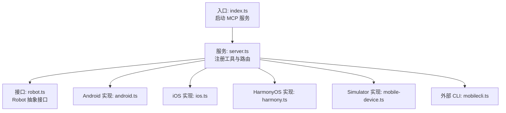
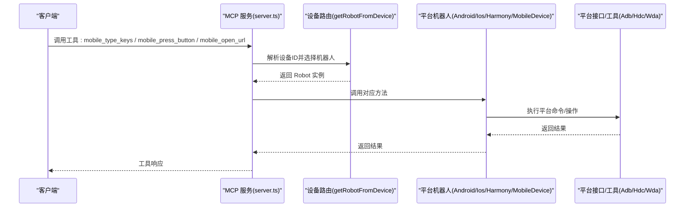
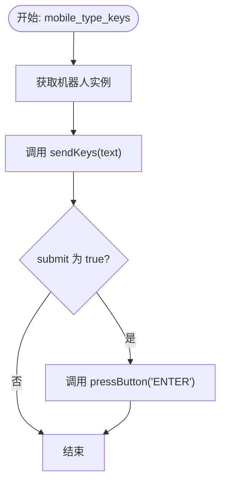
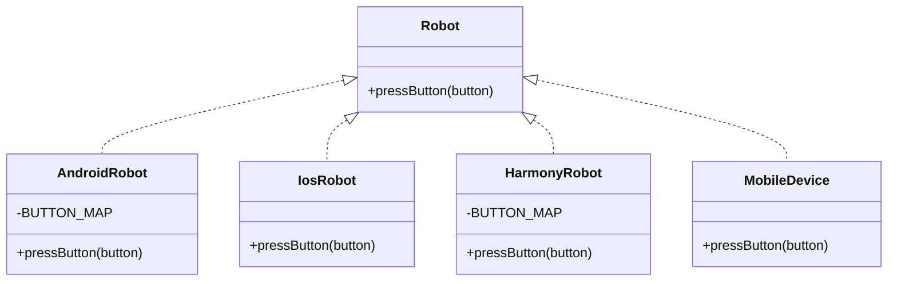
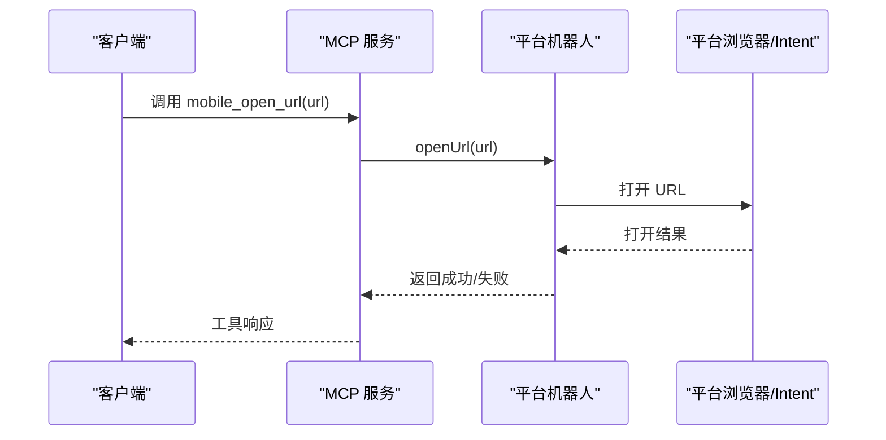
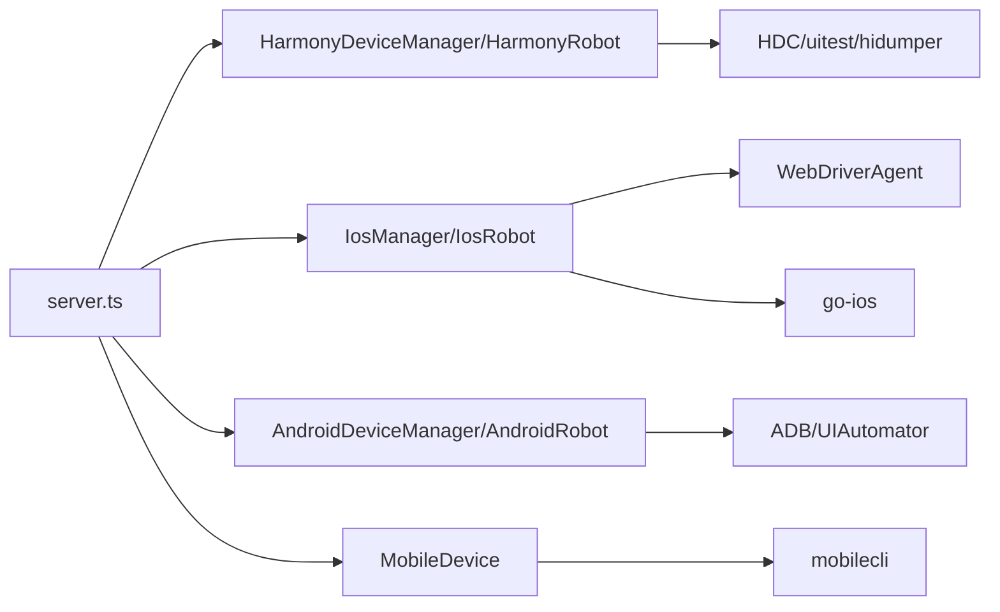

# 输入导航工具

<cite>
**本文档引用的文件**
- [index.ts](file://src/index.ts)
- [server.ts](file://src/server.ts)
- [robot.ts](file://src/robot.ts)
- [android.ts](file://src/android.ts)
- [ios.ts](file://src/ios.ts)
- [harmony.ts](file://src/harmony.ts)
- [mobile-device.ts](file://src/mobile-device.ts)
- [mobilecli.ts](file://src/mobilecli.ts)
- [README.md](file://README.md)
</cite>

## 目录
1. [简介](#简介)
2. [项目结构](#项目结构)
3. [核心组件](#核心组件)
4. [架构总览](#架构总览)
5. [详细组件分析](#详细组件分析)
6. [依赖关系分析](#依赖关系分析)
7. [性能考虑](#性能考虑)
8. [故障排查指南](#故障排查指南)
9. [结论](#结论)
10. [附录](#附录)

## 简介
本文件为“输入导航工具”的详细参考文档，重点覆盖以下工具：
- mobile_type_keys：向当前获得焦点的 UI 元素输入文本，并可选择提交
- mobile_press_button：按下设备物理按键（如 HOME、BACK、音量键、ENTER 等）
- mobile_open_url：在设备浏览器中打开指定 URL

文档将深入解析文本输入处理、按键映射机制、URL 导航流程以及各平台（iOS、Android、HarmonyOS、Simulator）的差异；同时涵盖输入验证、字符编码处理、快捷键支持等技术细节，并提供用户体验优化与兼容性处理建议。

## 项目结构
该项目基于 Model Context Protocol（MCP）服务端，提供统一的移动端自动化工具集，支持 iOS、Android、HarmonyOS 以及 iOS 模拟器。输入导航工具通过统一的工具注册与调用流程接入，底层由各平台机器人实现类完成具体操作。

图表来源
- [index.ts:1-67](file://src/index.ts#L1-L67)
- [server.ts:35-707](file://src/server.ts#L35-L707)
- [robot.ts:48-147](file://src/robot.ts#L48-L147)
- [android.ts:74-504](file://src/android.ts#L74-L504)
- [ios.ts:42-232](file://src/ios.ts#L42-L232)
- [harmony.ts:43-416](file://src/harmony.ts#L43-L416)
- [mobile-device.ts:62-216](file://src/mobile-device.ts#L62-L216)
- [mobilecli.ts:27-135](file://src/mobilecli.ts#L27-L135)

章节来源
- [README.md:1-198](file://README.md#L1-L198)
- [index.ts:1-67](file://src/index.ts#L1-L67)
- [server.ts:35-707](file://src/server.ts#L35-L707)

## 核心组件
- Robot 抽象接口：定义了所有设备操作的统一契约，包括屏幕尺寸、截图、应用管理、输入与导航、手势、元素枚举、方向控制等。
- 平台机器人实现：
  - AndroidRobot：基于 ADB 与 UIAutomator，支持 ASCII 文本输入、按键映射、无障碍元素解析。
  - IosRobot：通过 WebDriverAgent 与 go-ios，支持触摸、滑动、按键、文本输入、URL 打开。
  - HarmonyRobot：通过 HDC、uitest、hidumper 等工具，支持点击、滑动、按键、文本输入、URL 打开、布局 dump。
  - MobileDevice：面向 iOS 模拟器的轻量实现，通过 mobilecli 的命令通道完成输入与导航。
- 工具注册与调用：server.ts 中以工具形式注册 mobile_type_keys、mobile_press_button、mobile_open_url，并根据设备类型动态选择对应机器人实例。

章节来源
- [robot.ts:48-147](file://src/robot.ts#L48-L147)
- [android.ts:74-504](file://src/android.ts#L74-L504)
- [ios.ts:42-232](file://src/ios.ts#L42-L232)
- [harmony.ts:43-416](file://src/harmony.ts#L43-L416)
- [mobile-device.ts:62-216](file://src/mobile-device.ts#L62-L216)
- [server.ts:485-565](file://src/server.ts#L485-L565)

## 架构总览
输入导航工具的调用链路如下：客户端通过 MCP 工具调用 mobile_type_keys、mobile_press_button、mobile_open_url；服务端根据设备 ID 选择对应的机器人实现，再由该实现调用平台特定的系统接口或工具完成实际操作。

图表来源
- [server.ts:149-197](file://src/server.ts#L149-L197)
- [android.ts:74-504](file://src/android.ts#L74-L504)
- [ios.ts:42-232](file://src/ios.ts#L42-L232)
- [harmony.ts:43-416](file://src/harmony.ts#L43-L416)
- [mobile-device.ts:62-216](file://src/mobile-device.ts#L62-L216)

## 详细组件分析

### mobile_type_keys 文本输入处理
- 功能概述：向当前获得焦点的 UI 元素输入文本；若 submit 为 true，则额外触发 ENTER 键提交。
- 调用路径：server.ts 注册工具 -> 选择机器人 -> 调用 sendKeys -> 平台实现。
- 平台差异与实现要点：
  - Android：仅支持 ASCII 文本；非 ASCII 字符需通过 Clipboard 广播或安装 DeviceKit 扩展；支持按键 ENTER 提交。
  - iOS：通过 WebDriverAgent 发送文本；支持 UTF-8 文本输入。
  - HarmonyOS：通过 HDC uitest 输入文本；支持 UTF-8 文本输入。
  - Simulator：通过 mobilecli 的 io text 命令输入；支持 UTF-8 文本输入。
- 输入验证与错误处理：
  - 空字符串直接返回，避免无效调用。
  - 非 ASCII 文本在 Android 上抛出可处理的错误，提示安装 DeviceKit 或改用支持的字符集。
- 快捷键支持：
  - 通过 pressButton("ENTER") 实现提交；其他快捷键（如 Ctrl/Cmd+A）不在本工具范围内，需通过平台特定的按键映射或组合键实现。

图表来源
- [server.ts:545-565](file://src/server.ts#L545-L565)
- [android.ts:402-427](file://src/android.ts#L402-L427)
- [ios.ts:179-182](file://src/ios.ts#L179-L182)
- [harmony.ts:184-210](file://src/harmony.ts#L184-L210)
- [mobile-device.ts:172-174](file://src/mobile-device.ts#L172-L174)

章节来源
- [server.ts:545-565](file://src/server.ts#L545-L565)
- [android.ts:402-427](file://src/android.ts#L402-L427)
- [ios.ts:179-182](file://src/ios.ts#L179-L182)
- [harmony.ts:184-210](file://src/harmony.ts#L184-L210)
- [mobile-device.ts:172-174](file://src/mobile-device.ts#L172-L174)

### mobile_press_button 按键映射机制
- 功能概述：模拟按下设备物理按键，如 HOME、BACK、音量键、ENTER、DPAD_*（仅 Android TV）等。
- 调用路径：server.ts 注册工具 -> 选择机器人 -> 调用 pressButton -> 平台按键映射 -> 执行。
- 平台按键映射：
  - Android：BACK、HOME、VOLUME_UP、VOLUME_DOWN、ENTER、DPAD_CENTER/UP/DOWN/LEFT/RIGHT。
  - iOS：通过 WebDriverAgent 支持 HOME、BACK、ENTER 等常用按键。
  - HarmonyOS：HOME、BACK、ENTER、音量键。
  - Simulator：通过 mobilecli 的 io button 命令转发。
- 不支持的按键：HarmonyOS 不支持 DPAD_*；Android TV 外设备不支持 DPAD_*。
- 输入验证：未映射的按键将抛出可处理的错误，提示支持的按键集合。

图表来源
- [robot.ts:17-17](file://src/robot.ts#L17-L17)
- [android.ts:56-67](file://src/android.ts#L56-L67)
- [ios.ts:184-187](file://src/ios.ts#L184-L187)
- [harmony.ts:20-26](file://src/harmony.ts#L20-L26)
- [mobile-device.ts:176-178](file://src/mobile-device.ts#L176-L178)

章节来源
- [robot.ts:17-17](file://src/robot.ts#L17-L17)
- [android.ts:56-67](file://src/android.ts#L56-L67)
- [ios.ts:184-187](file://src/ios.ts#L184-L187)
- [harmony.ts:20-26](file://src/harmony.ts#L20-L26)
- [mobile-device.ts:176-178](file://src/mobile-device.ts#L176-L178)

### mobile_open_url URL 导航流程
- 功能概述：在设备浏览器中打开指定 URL，支持 http/https 与自定义 Scheme。
- 调用路径：server.ts 注册工具 -> 选择机器人 -> 调用 openUrl -> 平台打开逻辑。
- 平台实现：
  - Android：通过 Intent ACTION_VIEW 打开 URL。
  - iOS：通过 WebDriverAgent 打开 URL。
  - HarmonyOS：通过 aa start -U 打开 URL。
  - Simulator：通过 mobilecli 的 url 命令打开。
- 输入验证：URL 必须为有效字符串；非法 URL 将导致平台命令失败，服务端捕获并返回错误信息。

图表来源
- [server.ts:501-515](file://src/server.ts#L501-L515)
- [android.ts:384-386](file://src/android.ts#L384-L386)
- [ios.ts:174-177](file://src/ios.ts#L174-L177)
- [harmony.ts:290-292](file://src/harmony.ts#L290-L292)
- [mobile-device.ts:168-170](file://src/mobile-device.ts#L168-L170)

章节来源
- [server.ts:501-515](file://src/server.ts#L501-L515)
- [android.ts:384-386](file://src/android.ts#L384-L386)
- [ios.ts:174-177](file://src/ios.ts#L174-L177)
- [harmony.ts:290-292](file://src/harmony.ts#L290-L292)
- [mobile-device.ts:168-170](file://src/mobile-device.ts#L168-L170)

### 文本输入焦点管理
- Android：通过无障碍树中的 focused 字段判断当前焦点元素；若无焦点元素则默认在屏幕中心输入。
- iOS：通过 WebDriverAgent 获取当前焦点元素；若无法获取则回退到屏幕中心。
- HarmonyOS：通过布局 dump 的 focused 字段定位焦点元素；若失败则在屏幕中心输入。
- Simulator：通过 dump ui 的 focused 字段定位焦点元素；若失败则在屏幕中心输入。

章节来源
- [android.ts:325-346](file://src/android.ts#L325-L346)
- [ios.ts:204-207](file://src/ios.ts#L204-L207)
- [harmony.ts:294-332](file://src/harmony.ts#L294-L332)
- [mobile-device.ts:194-206](file://src/mobile-device.ts#L194-L206)

### 平台特定的输入处理差异
- Android
  - 文本输入：ASCII 直接输入；非 ASCII 通过 Clipboard 广播或 DeviceKit。
  - 按键映射：支持 BACK、HOME、音量键、ENTER、DPAD_*。
  - URL 打开：am start -a ACTION_VIEW -d url。
- iOS
  - 文本输入：WebDriverAgent 支持 UTF-8。
  - 按键映射：HOME、BACK、ENTER。
  - URL 打开：WebDriverAgent。
- HarmonyOS
  - 文本输入：uitest inputText 支持 UTF-8。
  - 按键映射：HOME、BACK、ENTER、音量键。
  - URL 打开：aa start -U url。
- Simulator
  - 文本输入：mobilecli io text。
  - 按键映射：mobilecli io button。
  - URL 打开：mobilecli url。

章节来源
- [android.ts:402-427](file://src/android.ts#L402-L427)
- [android.ts:56-67](file://src/android.ts#L56-L67)
- [android.ts:384-386](file://src/android.ts#L384-L386)
- [ios.ts:179-182](file://src/ios.ts#L179-L182)
- [ios.ts:184-187](file://src/ios.ts#L184-L187)
- [ios.ts:174-177](file://src/ios.ts#L174-L177)
- [harmony.ts:184-210](file://src/harmony.ts#L184-L210)
- [harmony.ts:20-26](file://src/harmony.ts#L20-L26)
- [harmony.ts:290-292](file://src/harmony.ts#L290-L292)
- [mobile-device.ts:172-174](file://src/mobile-device.ts#L172-L174)
- [mobile-device.ts:176-178](file://src/mobile-device.ts#L176-L178)
- [mobile-device.ts:168-170](file://src/mobile-device.ts#L168-L170)

## 依赖关系分析
- 设备路由：根据设备 ID 优先判定 HarmonyOS，其次检测 iOS，再检测 Android，最后回退到 Simulator。
- 外部工具依赖：
  - Android：ADB、UIAutomator（内置 Android SDK）。
  - iOS：WebDriverAgent、go-ios、端口转发隧道。
  - HarmonyOS：HDC、uitest、hidumper、snapshot_display、bm、aa。
  - Simulator：mobilecli（包含设备信息、IO、dump UI 等命令）。

图表来源
- [server.ts:149-197](file://src/server.ts#L149-L197)
- [ios.ts:42-232](file://src/ios.ts#L42-L232)
- [android.ts:74-504](file://src/android.ts#L74-L504)
- [harmony.ts:43-416](file://src/harmony.ts#L43-L416)
- [mobile-device.ts:62-216](file://src/mobile-device.ts#L62-L216)

章节来源
- [server.ts:149-197](file://src/server.ts#L149-L197)
- [ios.ts:42-232](file://src/ios.ts#L42-L232)
- [android.ts:74-504](file://src/android.ts#L74-L504)
- [harmony.ts:43-416](file://src/harmony.ts#L43-L416)
- [mobile-device.ts:62-216](file://src/mobile-device.ts#L62-L216)

## 性能考虑
- 文本输入性能：
  - Android 使用 ASCII 直接输入最快；非 ASCII 通过 Clipboard 广播会增加一次广播与粘贴操作。
  - iOS 与 HarmonyOS 的 UTF-8 输入通常较快，但需注意无障碍树解析与焦点定位的耗时。
- URL 打开性能：各平台打开 URL 的延迟主要受系统应用启动影响，工具层几乎无额外开销。
- 焦点定位：无障碍树解析与布局 dump 会带来一定延迟，建议在需要频繁输入时先通过 list_elements_on_screen 获取焦点元素坐标，再直接调用输入。

## 故障排查指南
- 设备不可用或未找到：
  - 确认设备已连接且在线；HarmonyOS 通过 hdc list targets；iOS/Android 通过 mobilecli/devices。
  - 若提示设备未找到，使用 mobile_list_available_devices 获取可用设备列表。
- Android 非 ASCII 文本输入失败：
  - 安装 DeviceKit 或使用 ASCII 字符；否则会抛出可处理的错误。
- iOS 端口转发或 WebDriverAgent 异常：
  - 确认隧道与端口转发正常；检查 WebDriverAgent 是否运行。
- HarmonyOS 方向设置异常：
  - HarmonyOS 不支持程序化方向变更，会抛出错误；请手动调整设备方向。
- Simulator 文本输入失败：
  - 确认 mobilecli 可用且版本正确；检查 dump ui 输出是否包含焦点元素。

章节来源
- [server.ts:138-147](file://src/server.ts#L138-L147)
- [android.ts:424-427](file://src/android.ts#L424-L427)
- [ios.ts:69-92](file://src/ios.ts#L69-L92)
- [harmony.ts:413-415](file://src/harmony.ts#L413-L415)
- [mobilecli.ts:138-135](file://src/mobilecli.ts#L138-L135)

## 结论
输入导航工具通过统一的工具接口与平台抽象，实现了跨 iOS、Android、HarmonyOS 与 Simulator 的一致体验。在文本输入、按键映射与 URL 打开方面，各平台有明确的差异与限制。遵循本文档的实现细节与最佳实践，可在不同设备类型间稳定地完成输入导航任务，并在出现异常时快速定位问题。

## 附录
- 工具清单与平台支持概览见 README。
- 平台依赖与安装指引见 README 的“安装与配置”部分。

章节来源
- [README.md:1-198](file://README.md#L1-L198)