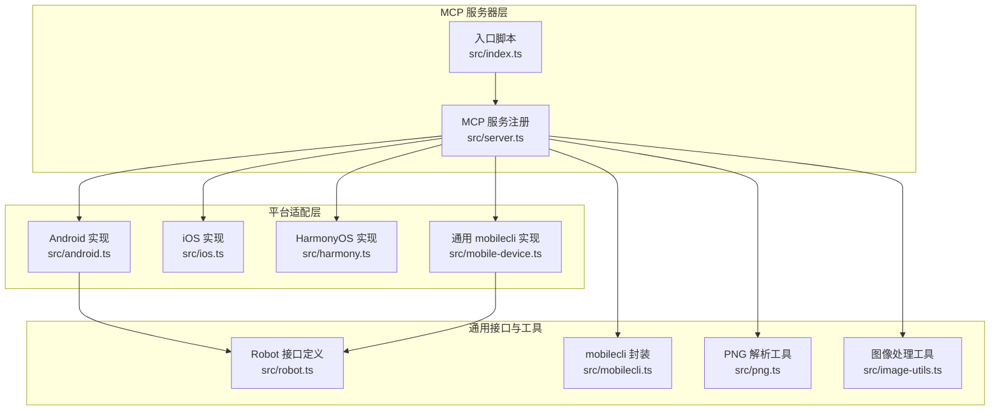
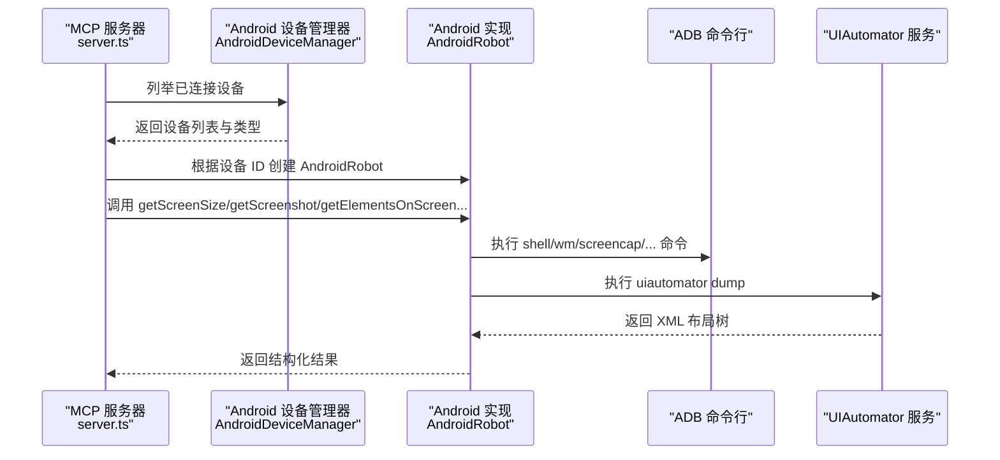
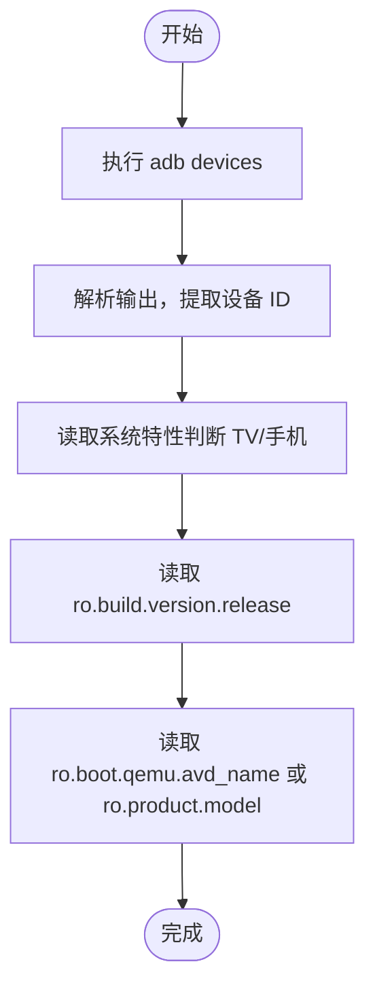
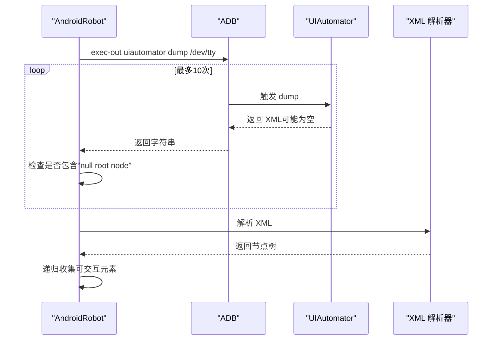
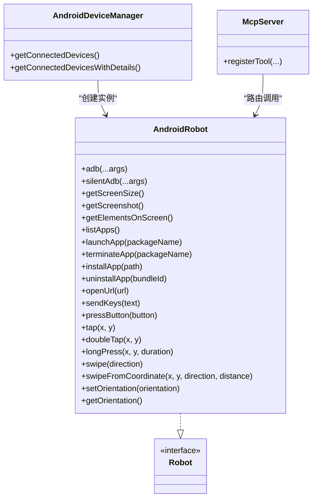

# Android 支持

<cite>
**本文引用的文件**
- [android.ts](file://src/android.ts)
- [robot.ts](file://src/robot.ts)
- [server.ts](file://src/server.ts)
- [mobilecli.ts](file://src/mobilecli.ts)
- [mobile-device.ts](file://src/mobile-device.ts)
- [index.ts](file://src/index.ts)
- [android 测试](file://test/android.ts)
- [README](file://README.md)
- [package.json](file://package.json)
</cite>

## 目录
1. [简介](#简介)
2. [项目结构](#项目结构)
3. [核心组件](#核心组件)
4. [架构总览](#架构总览)
5. [详细组件分析](#详细组件分析)
6. [依赖关系分析](#依赖关系分析)
7. [性能考量](#性能考量)
8. [故障排除指南](#故障排除指南)
9. [结论](#结论)
10. [附录](#附录)

## 简介
本文件面向 Android 平台支持，系统性阐述基于 ADB（Android Debug Bridge）与 UIAutomator 的实现方案，覆盖设备管理、应用控制与屏幕交互等核心能力。文档重点说明：
- Android 设备发现机制与设备类型识别（手机/电视）
- ADB 命令执行与路径解析策略
- UIAutomator 服务通信与无障碍树解析
- 屏幕尺寸获取、触摸与滑动、截图、文本输入、按键、应用管理（列表、启动、终止、安装、卸载）、URL 打开
- Android 权限与兼容性注意事项、性能优化策略
- ADB 环境配置、UIAutomator 设置与常见问题排查
- Android 版本差异对功能可用性的影响分析

## 项目结构
该仓库为一个 MCP（Model Context Protocol）服务器，提供统一的移动端自动化工具集，支持 iOS、Android、HarmonyOS。Android 相关实现集中在 src/android.ts，配合通用接口定义与服务编排位于 src/server.ts。

图表来源
- [index.ts:1-67](file://src/index.ts#L1-L67)
- [server.ts:1-708](file://src/server.ts#L1-L708)
- [android.ts:1-593](file://src/android.ts#L1-L593)
- [robot.ts:1-148](file://src/robot.ts#L1-L148)
- [mobilecli.ts:1-136](file://src/mobilecli.ts#L1-L136)
- [mobile-device.ts:1-217](file://src/mobile-device.ts#L1-L217)

章节来源
- [README.md:1-198](file://README.md#L1-L198)
- [package.json:1-74](file://package.json#L1-L74)

## 核心组件
- AndroidRobot：实现 Robot 接口，封装 ADB 与 UIAutomator 调用，提供屏幕尺寸、截图、元素解析、应用管理、按键与触摸等能力。
- AndroidDeviceManager：负责设备发现、设备类型识别（手机/电视）、版本与名称解析。
- Robot 接口：统一抽象，定义设备能力契约（屏幕尺寸、截图、应用管理、输入与交互、方向等）。
- MCP 服务编排：在 server.ts 中注册工具，根据设备 ID 动态路由到对应平台实现（Android/iOS/HarmonyOS）。

章节来源
- [android.ts:74-504](file://src/android.ts#L74-L504)
- [android.ts:506-592](file://src/android.ts#L506-L592)
- [robot.ts:48-147](file://src/robot.ts#L48-L147)
- [server.ts:149-197](file://src/server.ts#L149-L197)

## 架构总览
Android 平台通过 ADB 与 UIAutomator 与设备交互，MCP 服务在运行时根据设备 ID 选择具体实现。AndroidDeviceManager 用于发现设备并识别 TV/手机两类设备；AndroidRobot 提供完整的 UI 控制与信息采集能力。

图表来源
- [server.ts:149-197](file://src/server.ts#L149-L197)
- [android.ts:506-592](file://src/android.ts#L506-L592)
- [android.ts:79-84](file://src/android.ts#L79-L84)
- [android.ts:466-481](file://src/android.ts#L466-L481)

## 详细组件分析

### Android 设备发现与类型识别
- 设备发现：通过 ADB devices 命令列出设备 ID，并过滤头部标题行与空行。
- 设备类型识别：读取系统特性（如 leanback 或 television），判定 TV 或 mobile。
- 设备详情：获取 Android 版本与设备名称（优先 AVD 名称，否则产品型号）。

图表来源
- [android.ts:551-592](file://src/android.ts#L551-L592)
- [android.ts:518-549](file://src/android.ts#L518-L549)

章节来源
- [android.ts:551-592](file://src/android.ts#L551-L592)
- [android.ts:506-517](file://src/android.ts#L506-L517)

### ADB 命令执行与路径解析
- ADB 路径解析：优先从 ANDROID_HOME/platform-tools 查找；Windows 与 macOS 常规路径；若均不存在则回退到系统 PATH。
- 命令执行：统一通过子进程调用，设置超时与缓冲区上限；静默模式可隐藏标准输出/错误流。
- 常用命令：设备信息、屏幕尺寸、截图、应用管理、按键、输入、UIAutomator dump 等。

章节来源
- [android.ts:32-54](file://src/android.ts#L32-L54)
- [android.ts:79-92](file://src/android.ts#L79-L92)

### UIAutomator 服务通信与无障碍树解析
- UIAutomator dump：循环尝试获取 XML 布局树，避免“null root node returned”异常；截取首个有效 XML。
- XML 解析：使用 fast-xml-parser 解析 UIAutomator 输出，递归收集可交互元素（文本、内容描述、资源 ID、焦点状态等）。
- 元素矩形：从 bounds 属性解析元素位置与尺寸。

图表来源
- [android.ts:466-491](file://src/android.ts#L466-L491)
- [android.ts:312-356](file://src/android.ts#L312-L356)

章节来源
- [android.ts:466-491](file://src/android.ts#L466-L491)
- [android.ts:312-356](file://src/android.ts#L312-L356)

### 屏幕尺寸与方向
- 屏幕尺寸：通过 wm size 获取物理分辨率与缩放，返回 width、height、scale。
- 方向：通过 settings 与 content insert 设置 user_rotation；读取 user_rotation 判断 portrait/landscape。

章节来源
- [android.ts:103-116](file://src/android.ts#L103-L116)
- [android.ts:453-464](file://src/android.ts#L453-L464)

### 截图与多显示器支持
- 截图：优先使用 screencap -p；当存在多个显示器时，解析 SurfaceFlinger 与 dumpsys display 获取第一个活动显示器 ID，再以 -d 指定目标显示器。
- 多显示器兼容：在 Android 10 及以下或单显示器设备上回退到默认行为。

章节来源
- [android.ts:295-310](file://src/android.ts#L295-L310)
- [android.ts:232-293](file://src/android.ts#L232-L293)

### 触摸与滑动
- 点击：tap(x, y)。
- 长按：swipe(x, y, x, y, duration)。
- 双击：两次 tap，中间短延迟。
- 滑动：中心滑动或从指定坐标滑动，支持 up/down/left/right；Android 默认滑动距离为屏幕高度/宽度的 30%。

章节来源
- [android.ts:438-451](file://src/android.ts#L438-L451)
- [android.ts:159-191](file://src/android.ts#L159-L191)
- [android.ts:193-230](file://src/android.ts#L193-L230)

### 文本输入与按键
- ASCII 文本：直接通过 input text 发送。
- 非 ASCII 文本：若检测到设备 Kit（com.mobilenext.devicekit）已安装，则通过广播设置剪贴板并触发粘贴，结束后清理剪贴板。
- 按键映射：BACK、HOME、VOLUME_UP/DOWN、ENTER、DPAD_* 等映射到 KEYCODE_*。

章节来源
- [android.ts:402-427](file://src/android.ts#L402-L427)
- [android.ts:56-67](file://src/android.ts#L56-L67)

### 应用管理
- 列表：通过 cmd package query-activities 查询具有 LAUNCHER 的应用。
- 启动：monkey -p 包名 -c android.intent.category.LAUNCHER 1。
- 终止：am force-stop 包名。
- 安装/卸载：adb install/uninstall，捕获 stdout/stderr 并抛出可定位错误。
- 打开 URL：am start -a android.intent.action.VIEW -d url。

章节来源
- [android.ts:118-131](file://src/android.ts#L118-L131)
- [android.ts:142-148](file://src/android.ts#L142-L148)
- [android.ts:358-386](file://src/android.ts#L358-L386)
- [android.ts:362-382](file://src/android.ts#L362-L382)
- [android.ts:384-386](file://src/android.ts#L384-L386)

### 与 MCP 服务集成
- 设备路由：server.ts 根据设备 ID 优先匹配 HarmonyOS，再检查 iOS，最后 Android；若非 HarmonyOS 则要求 mobilecli 可用。
- 工具注册：统一注册 mobile_* 工具，参数校验与错误包装由 server.ts 统一处理。
- 图像处理：截图后根据格式进行缩放与编码，降低传输体积。

章节来源
- [server.ts:149-197](file://src/server.ts#L149-L197)
- [server.ts:297-543](file://src/server.ts#L297-L543)
- [server.ts:585-673](file://src/server.ts#L585-L673)

## 依赖关系分析
- AndroidRobot 依赖：
  - ADB 命令行（通过子进程执行）
  - UIAutomator（通过 uiautomator dump）
  - fast-xml-parser（解析 UIAutomator XML）
- 与通用接口：
  - 实现 Robot 接口，被 server.ts 注册为工具。
- 与 MCP 服务：
  - server.ts 作为统一入口，动态选择 AndroidRobot 实例。

图表来源
- [android.ts:74-504](file://src/android.ts#L74-L504)
- [android.ts:506-592](file://src/android.ts#L506-L592)
- [robot.ts:48-147](file://src/robot.ts#L48-L147)
- [server.ts:149-197](file://src/server.ts#L149-L197)

章节来源
- [android.ts:74-504](file://src/android.ts#L74-L504)
- [robot.ts:48-147](file://src/robot.ts#L48-L147)
- [server.ts:149-197](file://src/server.ts#L149-L197)

## 性能考量
- 截图优化：根据图像格式自动缩放与重编码，降低传输体积；仅在可用时进行缩放。
- UIAutomator dump 重试：避免一次性失败导致交互中断。
- ADB 超时与缓冲区限制：防止长时间阻塞与内存溢出。
- 多显示器截图：优先选择活动显示器，避免跨屏复杂度带来的额外开销。

章节来源
- [server.ts:615-650](file://src/server.ts#L615-L650)
- [android.ts:466-481](file://src/android.ts#L466-L481)
- [android.ts:69-70](file://src/android.ts#L69-L70)

## 故障排除指南
- ADB 路径未找到
  - 确认 ANDROID_HOME 或 Windows/macOS 常规路径存在 platform-tools/adb。
  - 若未设置，系统将回退到 PATH，需确保 adb 在 PATH 中。
- 设备未被发现
  - 检查 ADB devices 输出，确认设备处于在线状态且未被过滤。
  - Android TV 与手机区分识别依赖系统特性，若缺失特性，可能误判为手机。
- UIAutomator dump 失败
  - 可能因界面尚未就绪或无障碍服务未就绪；代码已内置重试逻辑。
  - 若持续失败，建议重启设备或等待界面稳定。
- 非 ASCII 文本输入失败
  - 需要在设备上安装 mobilenext devicekit，或仅发送 ASCII 文本。
- 安装/卸载失败
  - 捕获 adb install/uninstall 的 stdout/stderr 并抛出可定位错误，便于定位具体原因。
- 截图异常
  - 若截图无效或尺寸不匹配，检查 screencap 输出与显示器数量；必要时手动指定显示器 ID。

章节来源
- [android.ts:32-54](file://src/android.ts#L32-L54)
- [android.ts:551-592](file://src/android.ts#L551-L592)
- [android.ts:466-481](file://src/android.ts#L466-L481)
- [android.ts:402-427](file://src/android.ts#L402-L427)
- [android.ts:362-382](file://src/android.ts#L362-L382)
- [android.ts:295-310](file://src/android.ts#L295-L310)

## 结论
本项目在 Android 平台上提供了完善的自动化能力，基于 ADB 与 UIAutomator 实现了设备发现、应用管理、屏幕交互与结构化元素解析。通过统一的 Robot 接口与 MCP 工具注册，实现了与上层 Agent/LLM 的无缝对接。针对不同 Android 版本与设备形态（TV/手机），已在代码层面做了兼容处理；同时在性能与稳定性方面采取了多项优化措施。建议在生产环境中结合测试用例与日志追踪，确保在不同设备与场景下的可靠性。

## 附录

### ADB 环境配置与 UIAutomator 设置
- ADB 路径解析：优先 ANDROID_HOME/platform-tools；Windows 与 macOS 常规路径；最终回退到 PATH。
- UIAutomator：通过 uiautomator dump 获取无障碍树；若出现“null root node”，将自动重试。
- 截图：screencap -p；多显示器场景下解析 SurfaceFlinger 与 dumpsys display 获取活动显示器 ID。

章节来源
- [android.ts:32-54](file://src/android.ts#L32-L54)
- [android.ts:466-491](file://src/android.ts#L466-L491)
- [android.ts:295-310](file://src/android.ts#L295-L310)

### Android 版本差异与功能可用性
- 显示器枚举：Android 11+ 使用 cmd display get-displays；旧版本回退到 dumpsys display。
- 应用列表：Android 11+ 使用 cmd package query-activities；旧版本使用 pm list packages。
- 方向设置：通过 settings 与 content insert 设置 user_rotation；读取 user_rotation 判断方向。

章节来源
- [android.ts:240-293](file://src/android.ts#L240-L293)
- [android.ts:118-140](file://src/android.ts#L118-L140)
- [android.ts:453-464](file://src/android.ts#L453-L464)

### 测试用例要点（Android）
- 屏幕尺寸与截图：验证尺寸与 PNG 尺寸一致。
- 应用列表：确保系统应用（如设置）存在。
- URL 打开：通过 HOME 键回到桌面后打开示例 URL。
- 元素解析：验证 UIAutomator XML 解析正确，包含标题与输入框等元素。
- 文本输入与点击：在时钟应用中切换到计时器标签页并输入数字，验证时间变化。
- 应用启动/终止：验证进程列表包含/不包含目标应用。
- 方向切换：验证 portrait/landscape 切换与屏幕尺寸一致性。

章节来源
- [android 测试:14-138](file://test/android.ts#L14-L138)