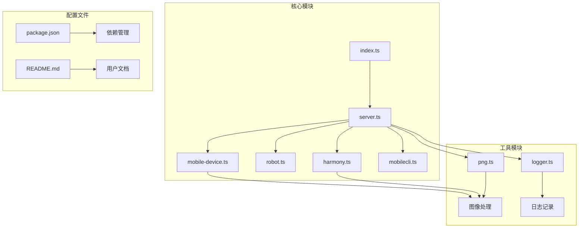
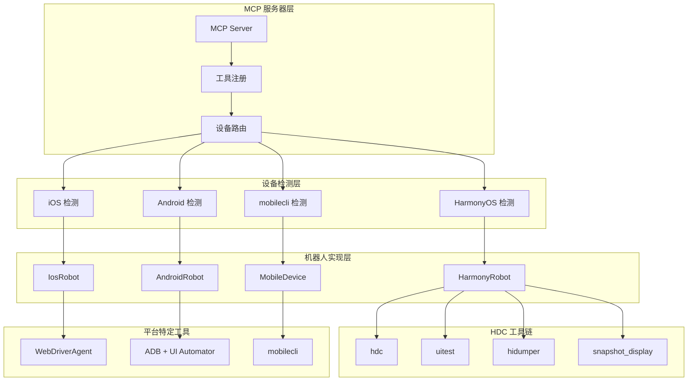
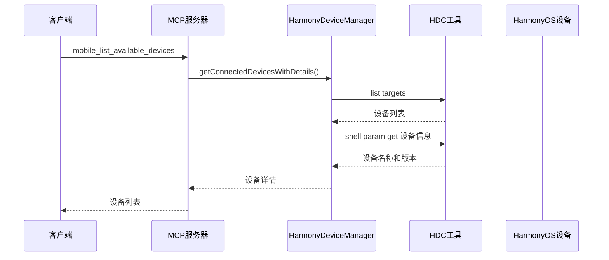
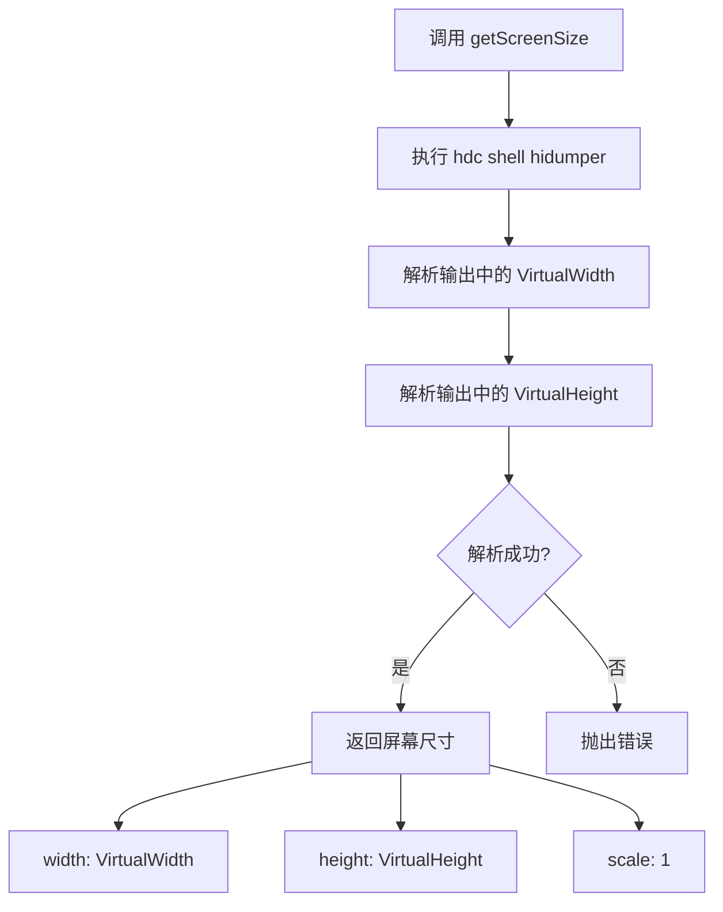
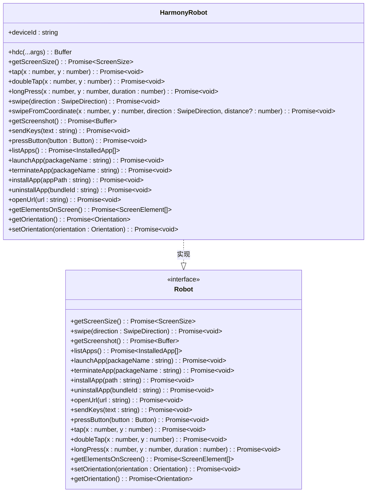
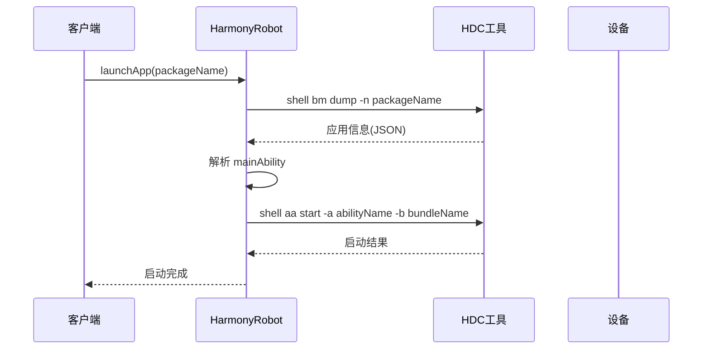
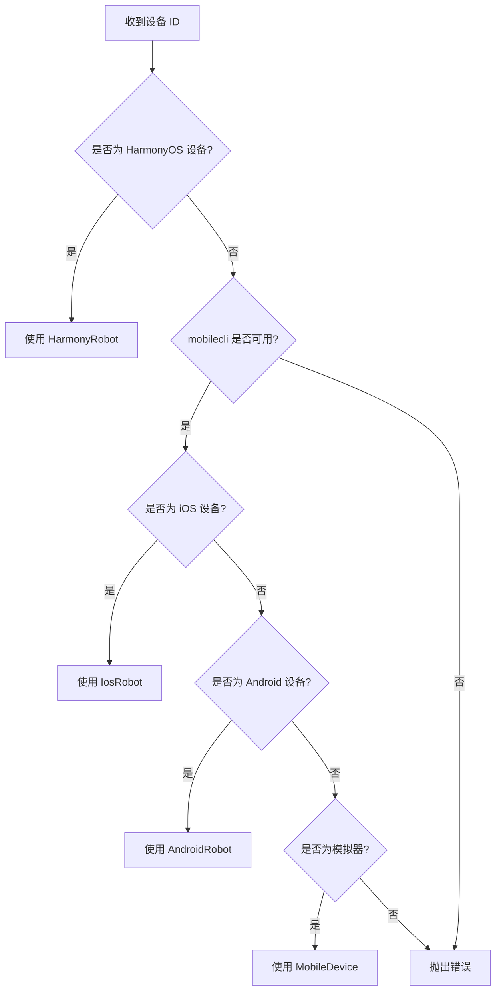
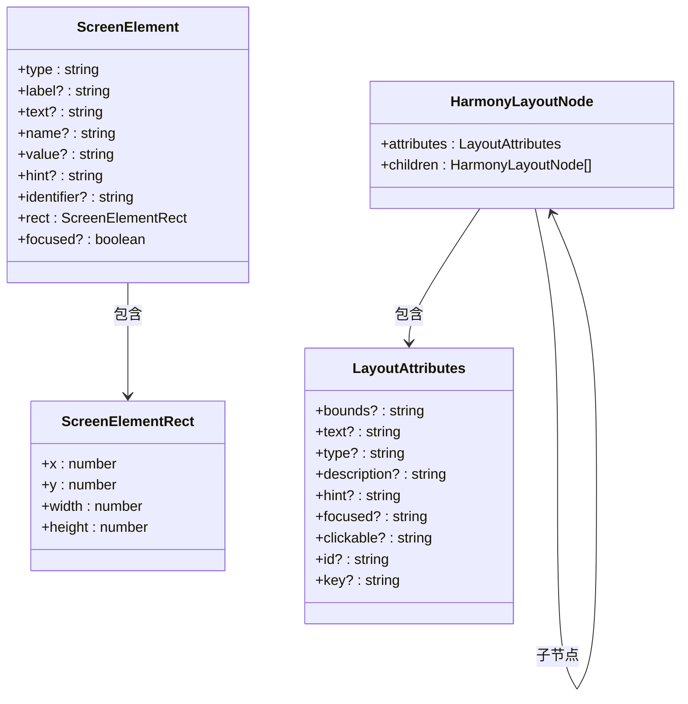
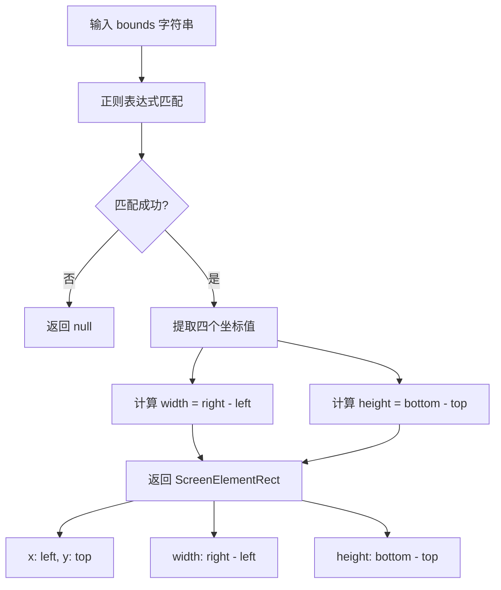
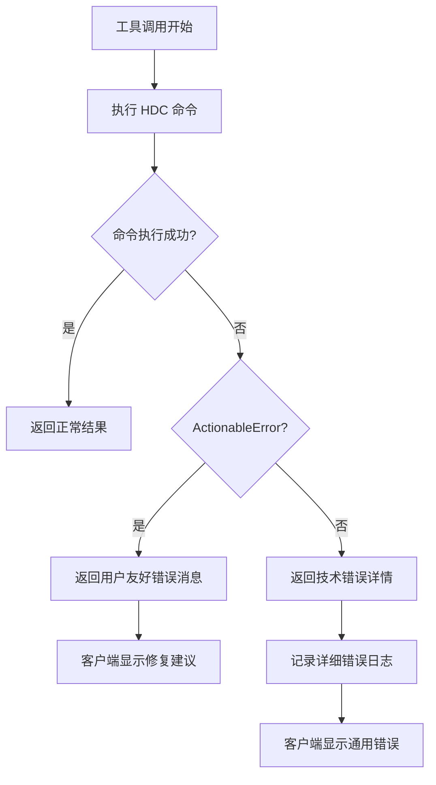

# HarmonyOS 支持

<cite>
**本文档引用的文件**
- [harmony.ts](file://src/harmony.ts)
- [robot.ts](file://src/robot.ts)
- [server.ts](file://src/server.ts)
- [index.ts](file://src/index.ts)
- [mobilecli.ts](file://src/mobilecli.ts)
- [mobile-device.ts](file://src/mobile-device.ts)
- [logger.ts](file://src/logger.ts)
- [png.ts](file://src/png.ts)
- [README.md](file://README.md)
- [package.json](file://package.json)
</cite>

## 目录
1. [简介](#简介)
2. [项目结构](#项目结构)
3. [核心组件](#核心组件)
4. [架构概览](#架构概览)
5. [详细组件分析](#详细组件分析)
6. [HDC 工具链配置](#hdc-工具链配置)
7. [无障碍布局树解析](#无障碍布局树解析)
8. [性能考虑](#性能考虑)
9. [故障排除指南](#故障排除指南)
10. [结论](#结论)

## 简介

本项目是基于 [@mobilenext/mobile-mcp](https://github.com/mobile-next/mobile-mcp) 二次开发的 Model Context Protocol (MCP) 服务器，专门新增了 HarmonyOS (鸿蒙) 设备自动化支持。该项目提供跨平台的移动端自动化能力，让 Agent/Large Language Model 能够通过统一接口与 iOS、Android 和 HarmonyOS 设备进行交互。

HarmonyOS 自动化通过 HDC (HarmonyOS Device Connector) 直接驱动设备，无需 mobilecli 依赖，开箱即用。项目支持三端原生应用自动化，基于无障碍树 (Accessibility Tree) 的结构化数据交互，无需视觉模型。

## 项目结构

项目采用模块化设计，主要包含以下核心模块：



**图表来源**
- [index.ts:1-67](file://src/index.ts#L1-L67)
- [server.ts:1-708](file://src/server.ts#L1-L708)
- [harmony.ts:1-462](file://src/harmony.ts#L1-L462)

**章节来源**
- [index.ts:1-67](file://src/index.ts#L1-L67)
- [package.json:1-74](file://package.json#L1-L74)

## 核心组件

### HarmonyRobot 类

HarmonyRobot 是 HarmonyOS 平台的核心自动化类，实现了 Robot 接口的所有方法。该类通过 HDC 工具链直接与设备通信，提供完整的设备控制能力。

### 设备管理器

项目包含多个设备管理器类，用于检测和管理不同平台的设备：

- **HarmonyDeviceManager**: 管理 HarmonyOS 设备发现和连接
- **MobileDevice**: 管理通过 mobilecli 连接的设备
- **AndroidDeviceManager**: 管理 Android 设备
- **IosManager**: 管理 iOS 设备

### MCP 服务器

MCP 服务器提供了统一的工具接口，支持设备管理、应用控制、屏幕交互等功能。服务器能够自动检测设备类型并选择相应的机器人实现。

**章节来源**
- [harmony.ts:43-416](file://src/harmony.ts#L43-L416)
- [robot.ts:48-147](file://src/robot.ts#L48-L147)
- [server.ts:35-707](file://src/server.ts#L35-L707)

## 架构概览

系统采用分层架构设计，通过统一的 MCP 接口抽象不同平台的设备控制逻辑：



**图表来源**
- [server.ts:149-197](file://src/server.ts#L149-L197)
- [harmony.ts:418-461](file://src/harmony.ts#L418-L461)

## 详细组件分析

### HarmonyRobot 实现详解

HarmonyRobot 类实现了完整的设备控制功能，以下是各核心方法的详细分析：

#### 设备发现与连接管理



**图表来源**
- [server.ts:207-294](file://src/server.ts#L207-L294)
- [harmony.ts:418-461](file://src/harmony.ts#L418-L461)

#### 屏幕尺寸获取机制

HarmonyRobot 通过 `hidumper` 工具获取屏幕信息：



**图表来源**
- [harmony.ts:55-69](file://src/harmony.ts#L55-L69)

#### 触摸操作实现

HarmonyRobot 支持多种触摸操作，包括点击、双击、长按：



**图表来源**
- [harmony.ts:43-416](file://src/harmony.ts#L43-L416)
- [robot.ts:48-147](file://src/robot.ts#L48-L147)

#### 应用管理功能

HarmonyRobot 提供完整的应用生命周期管理：



**图表来源**
- [harmony.ts:234-262](file://src/harmony.ts#L234-L262)

**章节来源**
- [harmony.ts:43-416](file://src/harmony.ts#L43-L416)
- [robot.ts:48-147](file://src/robot.ts#L48-L147)

### 设备发现与路由机制

MCP 服务器实现了智能设备路由，根据设备 ID 自动选择合适的机器人实现：



**图表来源**
- [server.ts:149-197](file://src/server.ts#L149-L197)

**章节来源**
- [server.ts:149-197](file://src/server.ts#L149-L197)

## HDC 工具链配置

### 环境变量设置

HarmonyOS 自动化依赖 HDC 工具链，需要正确配置环境变量：

| 环境变量 | 描述 | 默认值 |
|---------|------|--------|
| `HDC_SDK_PATH` | HDC SDK 安装路径 | `hdc` (系统 PATH 中查找) |

### HDC 工具链组件

HarmonyRobot 使用以下 HDC 工具进行设备控制：

| 工具 | 用途 | 命令示例 |
|------|------|----------|
| `hdc` | 设备连接、文件传输、Shell 命令执行 | `hdc -t <device> shell <command>` |
| `uitest` | UI 操作（点击、滑动、输入、布局 dump） | `hdc shell uitest uiInput click x y` |
| `hidumper` | 获取屏幕尺寸、旋转方向等显示信息 | `hdc shell hidumper -s DisplayManagerService -a -a` |
| `snapshot_display` | 截取屏幕截图 | `hdc shell snapshot_display -f /path/to/image` |
| `bm` | 应用包管理（安装、卸载、查询） | `hdc shell bm dump -a` |
| `aa` | Ability 启动与终止 | `hdc shell aa start -a <ability> -b <bundle>` |

### 安装与配置步骤

1. **安装 HarmonyOS SDK**
   - 从华为开发者官网下载并安装 HarmonyOS SDK
   - 确保 `hdc` 命令在系统 PATH 中可访问

2. **设置环境变量（可选）**
   ```bash
   export HDC_SDK_PATH=/path/to/harmonyos/sdk
   ```

3. **验证安装**
   ```bash
   hdc list targets
   ```

**章节来源**
- [README.md:90-100](file://README.md#L90-L100)
- [harmony.ts:12-18](file://src/harmony.ts#L12-L18)

## 无障碍布局树解析

### 布局树结构

HarmonyRobot 通过 `uitest dumpLayout` 命令获取无障碍布局树，解析后的节点结构如下：



**图表来源**
- [harmony.ts:28-41](file://src/harmony.ts#L28-L41)
- [robot.ts:19-38](file://src/robot.ts#L19-L38)

### 坐标转换机制

布局树中的坐标格式为 `[left,top][right,bottom]`，HarmonyRobot 提供解析函数将其转换为标准的矩形坐标：



**图表来源**
- [harmony.ts:378-399](file://src/harmony.ts#L378-L399)

### UI 元素识别规则

HarmonyRobot 在解析布局树时遵循以下识别规则：

1. **文本识别**：优先识别 `text` 属性
2. **描述识别**：使用 `description` 作为备用文本
3. **占位符识别**：使用 `hint` 作为占位符文本
4. **坐标过滤**：仅包含有效宽度和高度的元素
5. **焦点状态**：识别 `focused` 属性标记当前焦点元素

**章节来源**
- [harmony.ts:294-376](file://src/harmony.ts#L294-L376)
- [harmony.ts:378-399](file://src/harmony.ts#L378-L399)

## 性能考虑

### 内存管理

HarmonyRobot 实现了严格的内存管理策略：

- **缓冲区大小限制**：最大缓冲区大小为 4MB (`MAX_BUFFER_SIZE = 1024 * 1024 * 4`)
- **超时控制**：所有 HDC 命令执行超时时间为 30 秒
- **临时文件清理**：自动清理截图和布局文件的临时目录

### 图像处理优化

系统支持智能图像格式检测和压缩：

- **JPEG 检测**：通过文件头判断图像格式
- **动态缩放**：根据屏幕比例调整图像大小
- **质量优化**：将 PNG 转换为 JPEG 以减小文件大小

### 并发处理

MCP 服务器支持并发工具调用，每个工具调用都是独立的异步操作，不会相互阻塞。

## 故障排除指南

### 常见问题及解决方案

#### HDC 工具不可用

**症状**：`Error: spawn hdc ENOENT`

**解决方案**：
1. 确认 HDC SDK 已正确安装
2. 将 HDC 路径添加到系统 PATH
3. 或设置 `HDC_SDK_PATH` 环境变量

#### 设备未连接

**症状**：无法检测到 HarmonyOS 设备

**解决方案**：
1. 确认设备已启用开发者选项和 USB 调试
2. 检查 USB 连接线和端口
3. 在设备上确认已授权 PC 访问

#### 权限不足

**症状**：HDC 命令执行失败

**解决方案**：
1. 以管理员权限运行命令行
2. 确认设备已授权当前用户
3. 检查防火墙设置

#### 超时错误

**症状**：`Error: Command timed out`

**解决方案**：
1. 检查网络连接稳定性
2. 减少同时执行的工具数量
3. 增加设备性能或关闭后台应用

### 错误处理机制

系统实现了完善的错误处理机制：



**图表来源**
- [server.ts:79-94](file://src/server.ts#L79-L94)

**章节来源**
- [server.ts:79-94](file://src/server.ts#L79-L94)
- [harmony.ts:413-415](file://src/harmony.ts#L413-L415)

## 结论

本项目成功实现了 HarmonyOS 平台的完整自动化支持，通过 HDC 工具链提供了与 iOS、Android 平台一致的用户体验。主要特点包括：

1. **统一接口**：通过 MCP 服务器提供统一的工具接口
2. **平台无关**：自动检测设备类型并选择合适的实现
3. **功能完整**：支持屏幕交互、应用管理、无障碍解析等核心功能
4. **易于部署**：无需复杂的依赖配置，开箱即用

HarmonyOS 自动化为 AI/LLM 应用提供了强大的移动端控制能力，特别适合需要跨平台设备控制的自动化场景。随着 HarmonyOS 生态系统的不断发展，该项目将继续扩展更多高级功能，为开发者提供更完善的自动化解决方案。