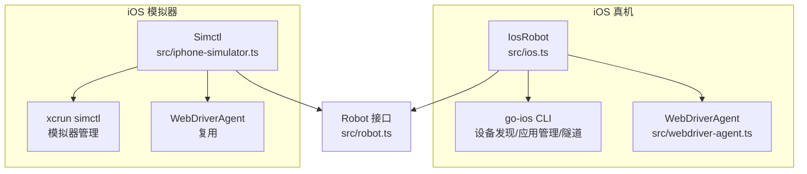
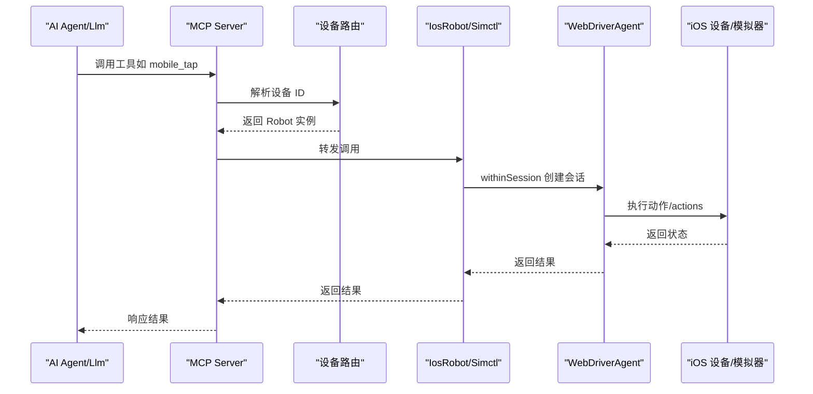
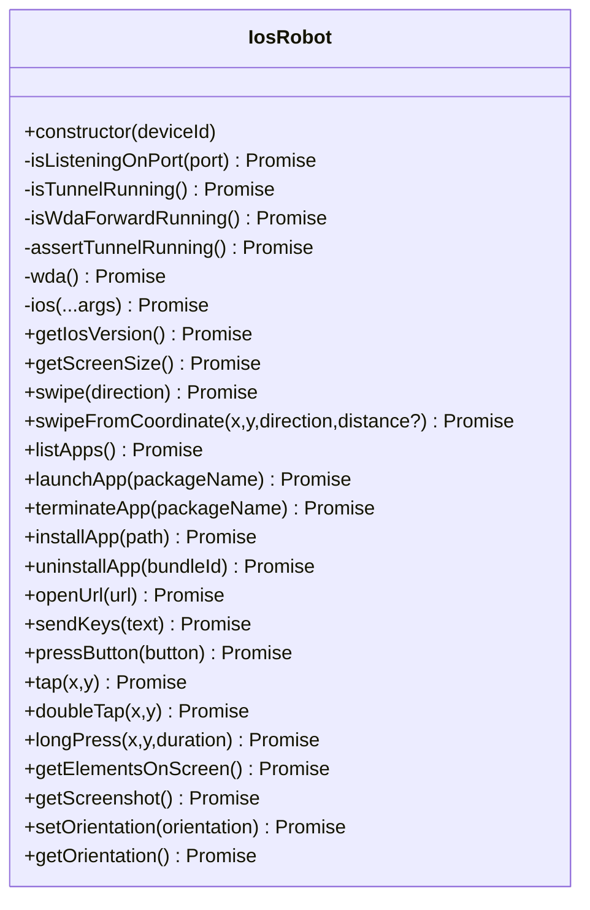
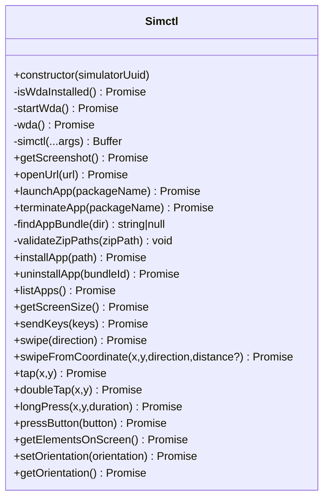
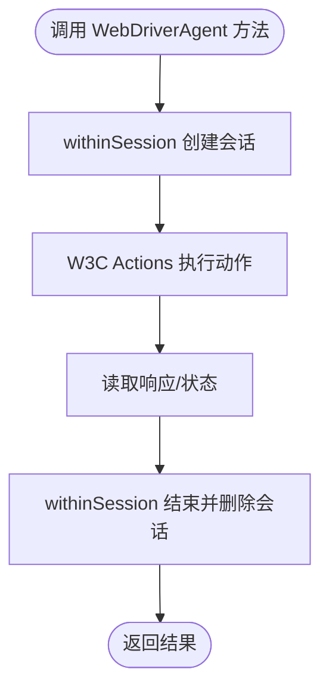
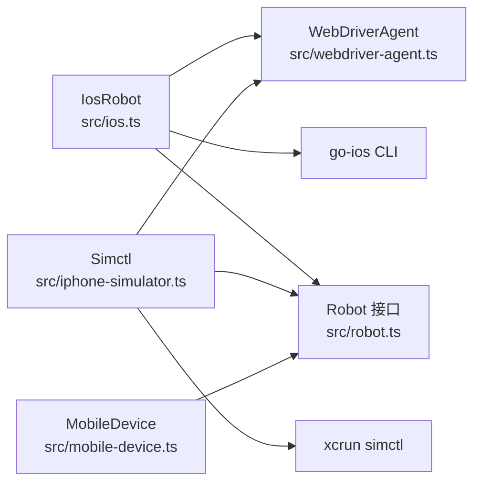

# iOS 支持

<cite>
**本文引用的文件**
- [ios.ts](file://src/ios.ts)
- [webdriver-agent.ts](file://src/webdriver-agent.ts)
- [iphone-simulator.ts](file://src/iphone-simulator.ts)
- [robot.ts](file://src/robot.ts)
- [mobile-device.ts](file://src/mobile-device.ts)
- [README.md](file://README.md)
- [DEEPWIKI.md](file://DEEPWIKI.md)
- [package.json](file://package.json)
- [ios.test.ts](file://test/ios.ts)
</cite>

## 目录
1. [简介](#简介)
2. [项目结构](#项目结构)
3. [核心组件](#核心组件)
4. [架构总览](#架构总览)
5. [详细组件分析](#详细组件分析)
6. [依赖关系分析](#依赖关系分析)
7. [性能考量](#性能考量)
8. [故障排查指南](#故障排查指南)
9. [结论](#结论)
10. [附录](#附录)

## 简介
本文件面向 iOS 平台支持的实现与使用，重点覆盖基于 WebDriverAgent（WDA）与 iOS 无障碍接口的架构设计，以及真机与 iPhone 模拟器的双重支持。文档将系统阐述设备发现、连接建立、会话管理、屏幕尺寸获取、触摸与滑动、截图、文本输入、按键、应用管理（列表、启动、终止、安装、卸载）、URL 打开、无障碍树结构与 UI 元素识别、坐标系统、配置与证书、模拟器启动、版本兼容性与权限限制，并对比真机与模拟器的功能与性能差异。

## 项目结构
iOS 支持由以下关键文件构成：
- iOS 真机实现：src/ios.ts
- iOS 模拟器实现：src/iphone-simulator.ts
- WebDriverAgent 客户端：src/webdriver-agent.ts
- 统一接口定义：src/robot.ts
- 通用设备实现（mobilecli）：src/mobile-device.ts
- 项目说明与平台能力：README.md、DEEPWIKI.md
- 测试用例：test/ios.ts
- 依赖与脚本：package.json

图表来源
- [ios.ts:1-294](file://src/ios.ts#L1-L294)
- [iphone-simulator.ts:1-273](file://src/iphone-simulator.ts#L1-L273)
- [webdriver-agent.ts:1-455](file://src/webdriver-agent.ts#L1-L455)
- [robot.ts:1-148](file://src/robot.ts#L1-L148)

章节来源
- [README.md:25-86](file://README.md#L25-L86)
- [DEEPWIKI.md:32-114](file://DEEPWIKI.md#L32-L114)

## 核心组件
- IosRobot：iOS 真机自动化入口，封装 go-ios 与 WDA 的交互，提供统一的 Robot 接口能力。
- Simctl：iOS 模拟器自动化入口，封装 xcrun simctl 与 WDA 的交互，提供统一的 Robot 接口能力。
- WebDriverAgent：WDA HTTP 客户端，负责会话管理、动作执行、截图、页面源码与元素识别、方向与尺寸等。
- Robot 接口：统一抽象，定义设备屏幕尺寸、触摸、滑动、截图、输入、按键、应用管理、元素识别、方向等能力。
- MobileDevice：通用设备实现（mobilecli），用于其他平台或场景，不直接参与 iOS。

章节来源
- [robot.ts:48-147](file://src/robot.ts#L48-L147)
- [ios.ts:42-232](file://src/ios.ts#L42-L232)
- [iphone-simulator.ts:32-272](file://src/iphone-simulator.ts#L32-L272)
- [webdriver-agent.ts:25-454](file://src/webdriver-agent.ts#L25-L454)

## 架构总览
iOS 自动化采用“接口抽象 + 平台实现 + WDA HTTP 客户端”的分层设计：
- 接口层：Robot 定义统一能力。
- 实现层：IosRobot（真机）与 Simctl（模拟器）分别对接 go-ios/simctl 与 WDA。
- 会话层：WDA 提供 /session 管理与 W3C Actions 执行。
- 数据层：WDA /source 与 /screenshot 提供无障碍树与截图。

图表来源
- [ios.ts:77-92](file://src/ios.ts#L77-L92)
- [iphone-simulator.ts:70-83](file://src/iphone-simulator.ts#L70-L83)
- [webdriver-agent.ts:42-77](file://src/webdriver-agent.ts#L42-L77)

## 详细组件分析

### IosRobot（iOS 真机）
- 设备发现与信息：通过 go-ios CLI 获取设备列表与设备信息（名称、系统版本等）。
- 连接与隧道：根据 iOS 版本判断是否需要隧道（iOS 17+），并校验隧道与端口转发状态。
- 会话管理：通过 WDA 的 /session 管理，每个操作在 withinSession 中自动创建与销毁。
- 功能覆盖：屏幕尺寸、截图、元素识别、触摸/双击/长按、滑动、文本输入、按键、应用管理、方向。
- 错误处理：统一抛出 ActionableError，便于用户修复（如隧道未运行、端口转发未就绪、WDA 未运行）。

图表来源
- [ios.ts:42-232](file://src/ios.ts#L42-L232)

章节来源
- [ios.ts:42-232](file://src/ios.ts#L42-L232)

### Simctl（iOS 模拟器）
- 设备管理：通过 xcrun simctl 列表、安装、启动、终止、卸载应用。
- WDA 管理：检测 WebDriverAgentRunner 是否已安装，若未运行则尝试启动；等待 WDA 就绪。
- 功能覆盖：与 IosRobot 相同的能力集合，但不涉及隧道与 go-ios。
- 安全与容错：支持 .zip 安装前的安全校验（防止 zip slip），并清理临时目录。

图表来源
- [iphone-simulator.ts:32-272](file://src/iphone-simulator.ts#L32-L272)

章节来源
- [iphone-simulator.ts:32-272](file://src/iphone-simulator.ts#L32-L272)

### WebDriverAgent 客户端
- 会话管理：/session 创建与 /session/{id} 删除；withinSession 自动化生命周期。
- 动作执行：W3C Actions API，支持 pointerMove/pointerDown/pause/pointerUp 组合实现 tap/doubleTap/longPress/swipe。
- 页面与元素：/source 获取无障碍树，过滤可见且可交互的元素（如 Button、TextField、Image 等）。
- 截图与尺寸：/screenshot 返回 base64 PNG；/wda/screen 返回屏幕尺寸与 scale。
- 方向：/orientation GET/POST 获取与设置方向。
- URL 打开：/url POST 打开浏览器 URL。

图表来源
- [webdriver-agent.ts:42-77](file://src/webdriver-agent.ts#L42-L77)
- [webdriver-agent.ts:302-370](file://src/webdriver-agent.ts#L302-L370)
- [webdriver-agent.ts:274-284](file://src/webdriver-agent.ts#L274-L284)
- [webdriver-agent.ts:295-300](file://src/webdriver-agent.ts#L295-L300)
- [webdriver-agent.ts:433-453](file://src/webdriver-agent.ts#L433-L453)

章节来源
- [webdriver-agent.ts:25-454](file://src/webdriver-agent.ts#L25-L454)

### 设备发现与连接建立
- iOS 真机：IosManager 通过 go-ios 列表与信息查询，IosRobot 在执行前校验隧道与端口转发，再连接 WDA。
- iOS 模拟器：Simctl 通过 xcrun simctl 管理，自动检测并启动 WDA。
- 会话管理：IosRobot 与 Simctl 均通过 WDA 的 withinSession 模式，确保每个操作独立会话，避免状态污染。

章节来源
- [ios.ts:234-292](file://src/ios.ts#L234-L292)
- [iphone-simulator.ts:32-83](file://src/iphone-simulator.ts#L32-L83)
- [webdriver-agent.ts:71-77](file://src/webdriver-agent.ts#L71-L77)

### 屏幕尺寸、坐标系统与元素识别
- 屏幕尺寸：WDA /wda/screen 返回 width/height/scale；IosRobot/Simctl 透传该信息。
- 坐标系统：W3C Actions 使用屏幕坐标系；元素 rect 来自 /source 的 SourceTree，包含 x/y/width/height。
- 元素识别：WDA 过滤可见且可交互的元素类型（如 Button、TextField、Image 等），并返回 label/name/value/rawIdentifier/rect 等字段。

章节来源
- [webdriver-agent.ts:79-101](file://src/webdriver-agent.ts#L79-L101)
- [webdriver-agent.ts:240-272](file://src/webdriver-agent.ts#L240-L272)

### 触摸、滑动与长按
- 点击：W3C Actions 的 pointerMove + pointerDown + pause + pointerUp。
- 双击：两次点击，中间短暂 pause。
- 长按：指针按下持续指定时长。
- 滑动：根据屏幕尺寸计算起点与终点，使用 pointerMove 持续时间与距离。

章节来源
- [webdriver-agent.ts:149-234](file://src/webdriver-agent.ts#L149-L234)
- [webdriver-agent.ts:302-431](file://src/webdriver-agent.ts#L302-L431)

### 截图与文本输入、按键
- 截图：WDA /screenshot 返回 base64 PNG，IosRobot/Simctl 直接透传。
- 文本输入：WDA /wda/keys POST 数组字符串。
- 按键：WDA /wda/pressButton 支持 HOME/VOLUME_UP/VOLUME_DOWN/ENTER 等。

章节来源
- [webdriver-agent.ts:295-300](file://src/webdriver-agent.ts#L295-L300)
- [webdriver-agent.ts:103-114](file://src/webdriver-agent.ts#L103-L114)
- [webdriver-agent.ts:116-147](file://src/webdriver-agent.ts#L116-L147)

### 应用管理（列表、启动、终止、安装、卸载）
- iOS 真机：IosRobot 通过 go-ios 的 apps/list/launch/kill/install/uninstall 子命令。
- iOS 模拟器：Simctl 通过 simctl listapps/launch/terminate/install/uninstall。
- 安全安装：模拟器支持 .zip 自动解压并校验 zip slip。

章节来源
- [ios.ts:125-172](file://src/ios.ts#L125-L172)
- [iphone-simulator.ts:105-203](file://src/iphone-simulator.ts#L105-L203)

### URL 打开
- IosRobot/Simctl 通过 WDA /url POST 打开设备浏览器中的 URL。

章节来源
- [webdriver-agent.ts:286-293](file://src/webdriver-agent.ts#L286-L293)
- [ios.ts:174-177](file://src/ios.ts#L174-L177)
- [iphone-simulator.ts:98-102](file://src/iphone-simulator.ts#L98-L102)

### 会话管理机制
- withinSession：自动创建 /session 并在完成后删除，确保动作隔离。
- createSession：WDA capabilities 指定 platformName 为 iOS。
- deleteSession：清理会话资源。

章节来源
- [webdriver-agent.ts:42-77](file://src/webdriver-agent.ts#L42-L77)

## 依赖关系分析

图表来源
- [robot.ts:48-147](file://src/robot.ts#L48-L147)
- [ios.ts:42-232](file://src/ios.ts#L42-L232)
- [iphone-simulator.ts:32-272](file://src/iphone-simulator.ts#L32-L272)
- [webdriver-agent.ts:25-454](file://src/webdriver-agent.ts#L25-L454)
- [mobile-device.ts:62-216](file://src/mobile-device.ts#L62-L216)

章节来源
- [DEEPWIKI.md:32-114](file://DEEPWIKI.md#L32-L114)

## 性能考量
- 会话开销：每次操作均创建/销毁会话，保证稳定性但带来一定网络往返开销；可在批量操作时考虑复用会话（需谨慎）。
- W3C Actions：动作通过 /actions 执行，延迟受设备性能与网络影响；建议在滑动/长按时合理设置持续时间。
- 截图处理：WDA 返回 base64 PNG，IosRobot/Simctl 直接透传；如需优化可结合项目内图片处理链路（缩放/压缩）。
- 模拟器优势：无隧道与证书限制，WDA 自动启动，适合快速迭代；真机更贴近真实环境，但需要隧道与证书配置。

[本节为通用性能讨论，不直接分析特定文件]

## 故障排查指南
- 隧道未运行（iOS 17+）：IosRobot 在执行前会校验隧道端口，未运行时抛出 ActionableError，指引查看 Wiki。
- 端口转发未就绪：检查 WDA 端口转发（8100），未就绪时抛出 ActionableError。
- WDA 未运行：即使隧道与端口转发正常，仍需确保 WDA 在设备上运行。
- 模拟器 WDA 未启动：Simctl 会在检测到已安装但未运行时尝试启动，超时则报错。
- 安装失败：go-ios/simctl 安装时捕获 stdout/stderr 并抛出 ActionableError，便于定位问题。
- 截图尺寸不匹配：测试用例验证截图尺寸与屏幕 scale 的一致性，若不一致需检查设备方向与 scale。

章节来源
- [ios.ts:69-92](file://src/ios.ts#L69-L92)
- [iphone-simulator.ts:41-83](file://src/iphone-simulator.ts#L41-L83)
- [ios.ts:150-172](file://src/ios.ts#L150-L172)
- [iphone-simulator.ts:141-203](file://src/iphone-simulator.ts#L141-L203)
- [test/ios.ts:13-27](file://test/ios.ts#L13-L27)

## 结论
本项目通过统一的 Robot 接口与 WDA HTTP 客户端，实现了 iOS 真机与模拟器的自动化能力。IosRobot 与 Simctl 分别针对真机与模拟器的差异（隧道、go-ios vs simctl、WDA 自动启动）进行了适配，确保在不同环境下的一致体验。配合 withinSession 的会话管理与 W3C Actions 的动作执行，提供了稳定可靠的触摸、滑动、截图、元素识别与应用管理能力。对于真机与模拟器的差异，项目已在代码层面明确区分并给出相应的错误提示与处理策略。

[本节为总结性内容，不直接分析特定文件]

## 附录

### iOS 无障碍树结构与 UI 元素识别
- 无障碍树来源：WDA /source/?format=json。
- 元素过滤：仅返回可见且可交互的元素类型（如 Button、TextField、Image 等），并包含 label/name/value/rawIdentifier/rect 等字段。
- 坐标系统：元素 rect 为屏幕坐标，可用于点击与滑动。

章节来源
- [webdriver-agent.ts:274-284](file://src/webdriver-agent.ts#L274-L284)
- [webdriver-agent.ts:236-272](file://src/webdriver-agent.ts#L236-L272)

### WebDriverAgent 配置与证书
- 真机要求：iOS 17+ 需要隧道（端口 60105）与端口转发（8100），WDA 需在设备上运行。
- 模拟器要求：无需隧道，WDA 可自动启动（检测到已安装但未运行时）。
- 证书与信任：WDA 需要在设备上完成签名与信任流程，否则无法启动或执行动作。

章节来源
- [ios.ts:69-92](file://src/ios.ts#L69-L92)
- [iphone-simulator.ts:41-83](file://src/iphone-simulator.ts#L41-L83)

### 模拟器启动与应用安装
- 模拟器管理：xcrun simctl 用于启动/关闭/安装/卸载应用。
- 安全安装：支持 .zip 自动解压并校验 zip slip，防止恶意路径注入。

章节来源
- [iphone-simulator.ts:85-203](file://src/iphone-simulator.ts#L85-L203)

### iOS 版本兼容性与权限配置
- iOS 17+：需要隧道与端口转发；旧版本可直接使用 WDA。
- 权限与证书：WDA 需要设备侧的签名与信任，且部分操作需要系统权限（如输入法切换）。

章节来源
- [ios.ts:104-108](file://src/ios.ts#L104-L108)

### 真机与模拟器功能与性能对比
- 功能支持：两者均支持触摸、滑动、截图、元素识别、应用管理、方向与 URL 打开。
- 性能表现：模拟器无隧道与证书限制，WDA 自动启动，适合快速迭代；真机更贴近真实环境，但配置复杂度更高。
- 稳定性：withinSession 模式确保动作隔离，降低状态污染风险。

章节来源
- [DEEPWIKI.md:243-287](file://DEEPWIKI.md#L243-L287)