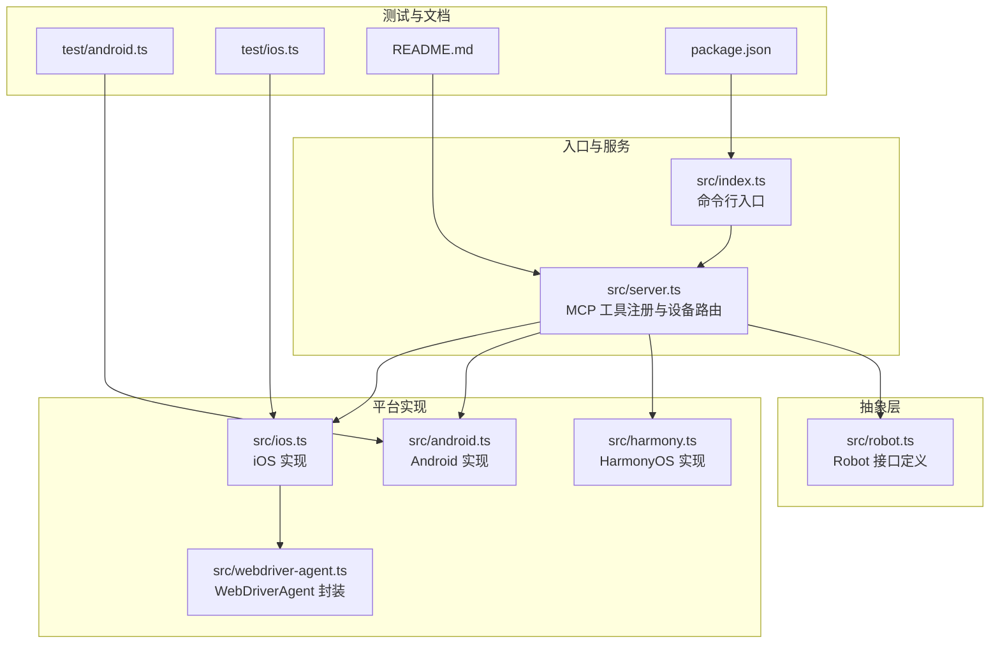
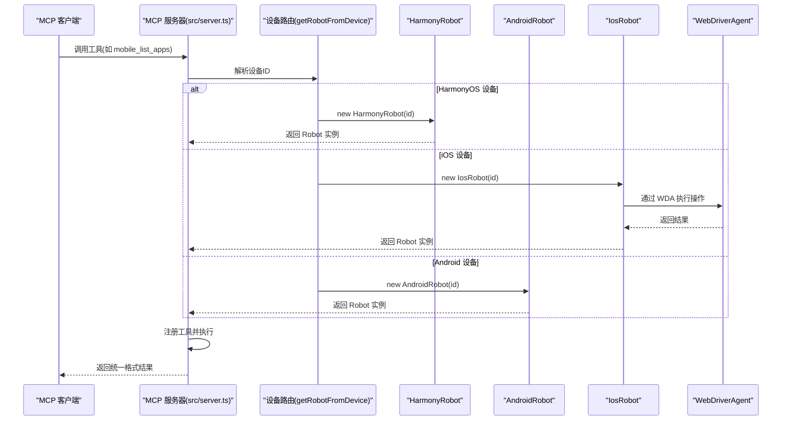
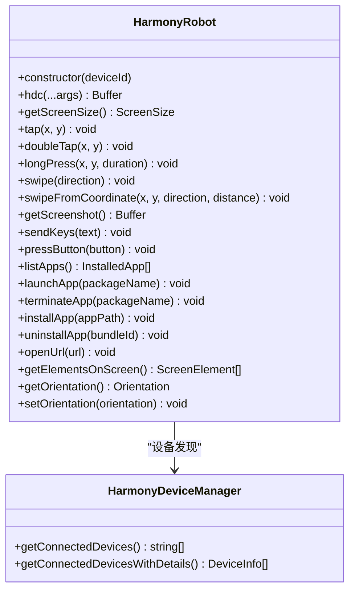
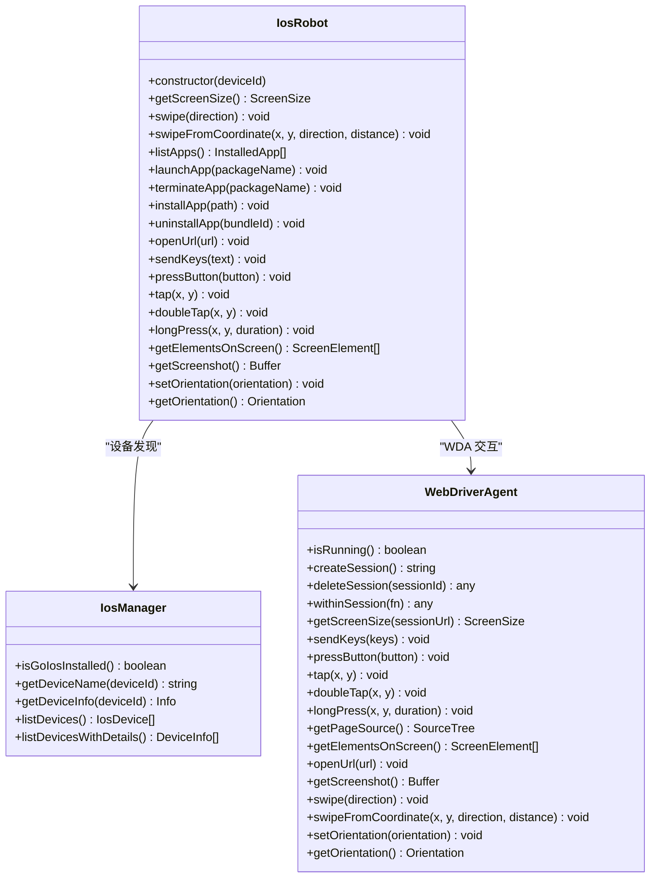
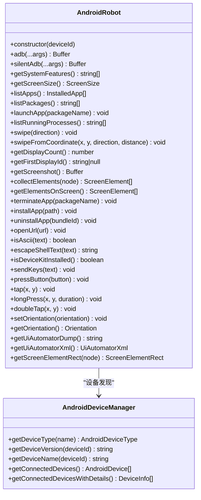
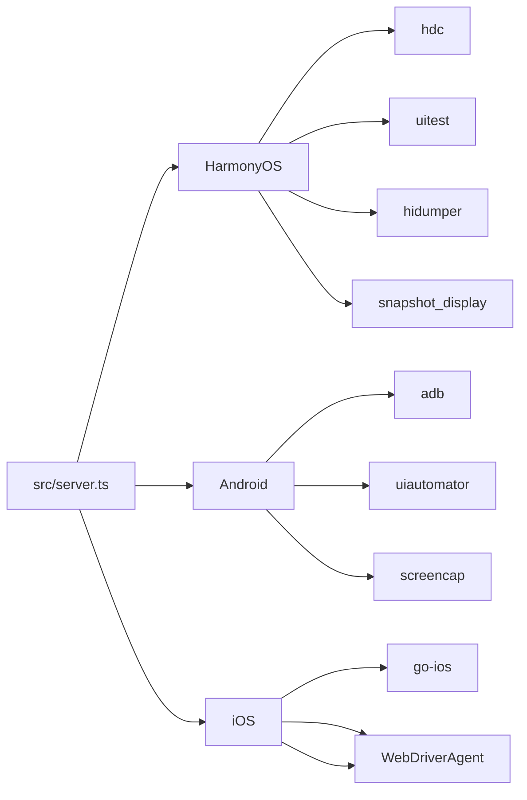

# 平台支持

<cite>
**本文引用的文件**
- [src/index.ts](file://src/index.ts)
- [src/server.ts](file://src/server.ts)
- [src/robot.ts](file://src/robot.ts)
- [src/harmony.ts](file://src/harmony.ts)
- [src/android.ts](file://src/android.ts)
- [src/ios.ts](file://src/ios.ts)
- [src/webdriver-agent.ts](file://src/webdriver-agent.ts)
- [README.md](file://README.md)
- [package.json](file://package.json)
- [test/android.ts](file://test/android.ts)
- [test/ios.ts](file://test/ios.ts)
</cite>

## 目录
1. [简介](#简介)
2. [项目结构](#项目结构)
3. [核心组件](#核心组件)
4. [架构总览](#架构总览)
5. [详细组件分析](#详细组件分析)
6. [依赖关系分析](#依赖关系分析)
7. [性能考量](#性能考量)
8. [故障排除指南](#故障排除指南)
9. [结论](#结论)
10. [附录](#附录)

## 简介
本项目是一个基于 Model Context Protocol (MCP) 的移动端自动化服务器，支持 iOS、Android 与 HarmonyOS（鸿蒙）三大平台。其核心目标是通过统一的 Robot 接口，屏蔽不同平台的差异，使 LLM/Agent 能以一致的方式与设备交互，完成设备管理、应用控制、屏幕交互与输入导航等任务。

平台特性概览：
- iOS：通过 WebDriverAgent + 原生无障碍接口实现，支持真机与模拟器。
- Android：通过 ADB + UIAutomator 实现，支持真机与模拟器。
- HarmonyOS：通过 HDC + uitest + hidumper 实现，无需 mobilecli 依赖，仅需在 PATH 中存在 hdc 或设置 HDC_SDK_PATH。

## 项目结构
项目采用模块化设计，核心文件包括：
- 入口与服务：src/index.ts、src/server.ts
- 抽象接口：src/robot.ts
- 平台实现：src/harmony.ts、src/android.ts、src/ios.ts
- iOS 通信桥：src/webdriver-agent.ts
- 测试与文档：test/*、README.md、package.json

图表来源
- [src/index.ts:1-67](file://src/index.ts#L1-L67)
- [src/server.ts:1-708](file://src/server.ts#L1-L708)
- [src/robot.ts:1-148](file://src/robot.ts#L1-L148)
- [src/harmony.ts:1-462](file://src/harmony.ts#L1-L462)
- [src/android.ts:1-593](file://src/android.ts#L1-L593)
- [src/ios.ts:1-294](file://src/ios.ts#L1-L294)
- [src/webdriver-agent.ts:1-455](file://src/webdriver-agent.ts#L1-L455)
- [README.md:1-198](file://README.md#L1-L198)
- [package.json:1-74](file://package.json#L1-L74)

章节来源
- [src/index.ts:1-67](file://src/index.ts#L1-L67)
- [src/server.ts:1-708](file://src/server.ts#L1-L708)
- [README.md:1-198](file://README.md#L1-L198)

## 核心组件
- Robot 接口：定义了跨平台统一的设备操作能力，包括屏幕尺寸、截图、应用管理、元素枚举、触摸与按键、滑动、输入、方向等。
- 平台实现类：
  - HarmonyRobot：基于 HDC/uitest/hidumper 的 HarmonyOS 实现。
  - AndroidRobot：基于 ADB/UIAutomator 的 Android 实现。
  - IosRobot：基于 WebDriverAgent 的 iOS 实现。
- 设备管理器：
  - HarmonyDeviceManager：通过 hdc 发现与列举 HarmonyOS 设备。
  - AndroidDeviceManager：通过 adb 发现与列举 Android 设备。
  - IosManager：通过 go-ios 发现与列举 iOS 设备。
- 服务端工具：在 src/server.ts 中注册 MCP 工具，并根据设备 ID 动态选择对应 Robot 实现。

章节来源
- [src/robot.ts:48-147](file://src/robot.ts#L48-L147)
- [src/harmony.ts:43-416](file://src/harmony.ts#L43-L416)
- [src/android.ts:74-504](file://src/android.ts#L74-L504)
- [src/ios.ts:42-232](file://src/ios.ts#L42-L232)
- [src/server.ts:149-197](file://src/server.ts#L149-L197)

## 架构总览
统一的 Robot 接口屏蔽平台差异，MCP 服务通过设备 ID 选择具体实现：
- 设备发现：HarmonyOS 通过 hdc；iOS/Android 通过 mobilecli/go-ios/adb。
- 机器人选择：getRobotFromDevice 根据设备 ID 优先匹配 HarmonyOS，再匹配 iOS/Android，最后匹配模拟器。
- 工具注册：所有工具均通过统一参数与返回格式调用对应 Robot 方法。

图表来源
- [src/server.ts:149-197](file://src/server.ts#L149-L197)
- [src/harmony.ts:43-416](file://src/harmony.ts#L43-L416)
- [src/android.ts:74-504](file://src/android.ts#L74-L504)
- [src/ios.ts:42-232](file://src/ios.ts#L42-L232)
- [src/webdriver-agent.ts:25-454](file://src/webdriver-agent.ts#L25-L454)

## 详细组件分析

### HarmonyOS（HDC 直连驱动）
- 设备发现：通过 hdc list targets 获取设备列表，支持名称与版本查询。
- 屏幕与方向：通过 hidumper 获取屏幕尺寸与旋转状态；不支持程序化方向变更。
- 截图：通过 snapshot_display 截图并拉取至本地。
- 元素识别：通过 uitest dumpLayout 导出布局 JSON，解析 bounds、text/description/type/id 等属性。
- 输入与交互：uitest uiInput 提供点击、双击、长按、滑动、输入文本、按键事件。
- 应用管理：通过 bm/aa 管理安装、卸载、启动、终止。
- 环境变量：HDC_SDK_PATH 指向 hdc 所在目录；若未设置则期望 hdc 在 PATH 中。

图表来源
- [src/harmony.ts:43-416](file://src/harmony.ts#L43-L416)
- [src/harmony.ts:418-461](file://src/harmony.ts#L418-L461)

章节来源
- [src/harmony.ts:12-18](file://src/harmony.ts#L12-L18)
- [src/harmony.ts:20-26](file://src/harmony.ts#L20-L26)
- [src/harmony.ts:55-69](file://src/harmony.ts#L55-L69)
- [src/harmony.ts:83-117](file://src/harmony.ts#L83-L117)
- [src/harmony.ts:119-157](file://src/harmony.ts#L119-L157)
- [src/harmony.ts:159-182](file://src/harmony.ts#L159-L182)
- [src/harmony.ts:184-210](file://src/harmony.ts#L184-L210)
- [src/harmony.ts:212-220](file://src/harmony.ts#L212-L220)
- [src/harmony.ts:221-232](file://src/harmony.ts#L221-L232)
- [src/harmony.ts:234-262](file://src/harmony.ts#L234-L262)
- [src/harmony.ts:264-288](file://src/harmony.ts#L264-L288)
- [src/harmony.ts:294-332](file://src/harmony.ts#L294-L332)
- [src/harmony.ts:334-376](file://src/harmony.ts#L334-L376)
- [src/harmony.ts:378-399](file://src/harmony.ts#L378-L399)
- [src/harmony.ts:401-411](file://src/harmony.ts#L401-L411)
- [src/harmony.ts:413-415](file://src/harmony.ts#L413-L415)

### iOS（WebDriverAgent + 无障碍接口）
- 设备发现：通过 go-ios 列表与信息查询，支持物理设备与模拟器。
- 无障碍与交互：通过 WebDriverAgent 的 actions/source/screenshot 等接口实现点击、双击、长按、滑动、按键、输入、截图、方向等。
- 网络隧道：iOS 17+ 需要隧道与端口转发，否则无法访问 WDA。
- 应用管理：通过 go-ios 安装/卸载/启动/终止应用。
- 注意：部分能力依赖 WDA，需确保端口转发与 WDA 正常运行。

图表来源
- [src/ios.ts:42-232](file://src/ios.ts#L42-L232)
- [src/ios.ts:234-293](file://src/ios.ts#L234-L293)
- [src/webdriver-agent.ts:25-454](file://src/webdriver-agent.ts#L25-L454)

章节来源
- [src/ios.ts:33-40](file://src/ios.ts#L33-L40)
- [src/ios.ts:69-92](file://src/ios.ts#L69-L92)
- [src/ios.ts:98-108](file://src/ios.ts#L98-L108)
- [src/ios.ts:110-118](file://src/ios.ts#L110-L118)
- [src/ios.ts:125-138](file://src/ios.ts#L125-L138)
- [src/ios.ts:140-148](file://src/ios.ts#L140-L148)
- [src/ios.ts:150-172](file://src/ios.ts#L150-L172)
- [src/ios.ts:174-202](file://src/ios.ts#L174-L202)
- [src/ios.ts:204-211](file://src/ios.ts#L204-L211)
- [src/ios.ts:213-231](file://src/ios.ts#L213-L231)
- [src/ios.ts:223-231](file://src/ios.ts#L223-L231)
- [src/webdriver-agent.ts:30-40](file://src/webdriver-agent.ts#L30-L40)
- [src/webdriver-agent.ts:79-101](file://src/webdriver-agent.ts#L79-L101)
- [src/webdriver-agent.ts:103-114](file://src/webdriver-agent.ts#L103-L114)
- [src/webdriver-agent.ts:116-147](file://src/webdriver-agent.ts#L116-L147)
- [src/webdriver-agent.ts:149-174](file://src/webdriver-agent.ts#L149-L174)
- [src/webdriver-agent.ts:176-207](file://src/webdriver-agent.ts#L176-L207)
- [src/webdriver-agent.ts:209-234](file://src/webdriver-agent.ts#L209-L234)
- [src/webdriver-agent.ts:274-284](file://src/webdriver-agent.ts#L274-L284)
- [src/webdriver-agent.ts:286-293](file://src/webdriver-agent.ts#L286-L293)
- [src/webdriver-agent.ts:295-300](file://src/webdriver-agent.ts#L295-L300)
- [src/webdriver-agent.ts:302-370](file://src/webdriver-agent.ts#L302-L370)
- [src/webdriver-agent.ts:372-431](file://src/webdriver-agent.ts#L372-L431)
- [src/webdriver-agent.ts:433-453](file://src/webdriver-agent.ts#L433-L453)

### Android（ADB + UIAutomator）
- 设备发现：通过 adb devices 获取设备列表，支持型号与系统版本查询。
- 屏幕与方向：wm size 获取分辨率；通过 settings/content 插入系统设置改变方向。
- 截图：exec-out screencap 支持多显示器场景，兼容旧版 Android。
- 元素识别：uiautomator dump 输出 XML，解析 bounds/text/content-desc/resource-id 等。
- 输入与交互：adb shell input 提供 tap/swipe/keyevent/text；非 ASCII 文本通过设备工具链广播剪贴板。
- 应用管理：pm/cmd/am 管理安装、卸载、启动、终止。
- 注意：ASCII 限制与设备工具链依赖。

图表来源
- [src/android.ts:74-504](file://src/android.ts#L74-L504)
- [src/android.ts:506-592](file://src/android.ts#L506-L592)

章节来源
- [src/android.ts:32-54](file://src/android.ts#L32-L54)
- [src/android.ts:56-67](file://src/android.ts#L56-L67)
- [src/android.ts:103-116](file://src/android.ts#L103-L116)
- [src/android.ts:118-131](file://src/android.ts#L118-L131)
- [src/android.ts:142-148](file://src/android.ts#L142-L148)
- [src/android.ts:159-191](file://src/android.ts#L159-L191)
- [src/android.ts:193-230](file://src/android.ts#L193-L230)
- [src/android.ts:295-310](file://src/android.ts#L295-L310)
- [src/android.ts:312-356](file://src/android.ts#L312-L356)
- [src/android.ts:358-382](file://src/android.ts#L358-L382)
- [src/android.ts:384-386](file://src/android.ts#L384-L386)
- [src/android.ts:402-427](file://src/android.ts#L402-L427)
- [src/android.ts:429-436](file://src/android.ts#L429-L436)
- [src/android.ts:438-451](file://src/android.ts#L438-L451)
- [src/android.ts:453-464](file://src/android.ts#L453-L464)
- [src/android.ts:466-491](file://src/android.ts#L466-L491)
- [src/android.ts:493-503](file://src/android.ts#L493-L503)
- [src/android.ts:508-516](file://src/android.ts#L508-L516)
- [src/android.ts:518-527](file://src/android.ts#L518-L527)
- [src/android.ts:529-549](file://src/android.ts#L529-L549)
- [src/android.ts:551-569](file://src/android.ts#L551-L569)
- [src/android.ts:571-591](file://src/android.ts#L571-L591)

### 统一接口与抽象
- Robot 接口定义了跨平台一致的方法签名，包括屏幕尺寸、截图、应用管理、元素枚举、触摸与按键、滑动、输入、方向等。
- 平台差异通过各自实现类屏蔽：HarmonyOS 使用 HDC/uitest/hidumper；Android 使用 ADB/UIAutomator；iOS 使用 WebDriverAgent。
- 服务端通过设备 ID 动态选择实现，保证工具调用的一致性。

章节来源
- [src/robot.ts:48-147](file://src/robot.ts#L48-L147)
- [src/server.ts:149-197](file://src/server.ts#L149-L197)

## 依赖关系分析
- 外部工具依赖：
  - HarmonyOS：hdc（HDC SDK），uitest，hidumper，snapshot_display，bm，aa。
  - Android：adb（Android SDK），uiautomator，screencap。
  - iOS：go-ios（mobilecli），WebDriverAgent（WDA）。
- 内部依赖：
  - src/server.ts 依赖各平台实现与工具封装。
  - src/webdriver-agent.ts 为 iOS 提供 WDA 访问封装。
  - src/robot.ts 为所有平台提供统一接口。

图表来源
- [src/harmony.ts:48-53](file://src/harmony.ts#L48-L53)
- [src/android.ts:79-84](file://src/android.ts#L79-L84)
- [src/ios.ts:94-96](file://src/ios.ts#L94-L96)
- [src/server.ts:8-15](file://src/server.ts#L8-L15)

章节来源
- [src/harmony.ts:48-53](file://src/harmony.ts#L48-L53)
- [src/android.ts:79-84](file://src/android.ts#L79-L84)
- [src/ios.ts:94-96](file://src/ios.ts#L94-L96)
- [src/server.ts:8-15](file://src/server.ts#L8-L15)

## 性能考量
- 截图与图像处理：
  - iOS 截图返回 PNG，服务端可按需缩放并转为 JPEG 以减小体积。
  - Android 截图支持多显示器场景，旧版设备使用 exec-out screencap。
  - HarmonyOS 截图通过 snapshot_display，注意清理远程临时文件。
- 元素识别：
  - Android/UIAutomator XML 解析与过滤，避免无效节点。
  - iOS 通过 WDA 的 source 树过滤可见元素。
  - HarmonyOS 通过 dumpLayout JSON 递归解析，过滤无文本且尺寸无效的节点。
- 输入与交互：
  - Android 非 ASCII 文本需借助设备工具链广播剪贴板，增加一次额外交互。
  - iOS 17+ 需要隧道与端口转发，网络延迟影响交互响应。
- 方向控制：
  - Android 通过系统设置改变方向，需禁用自动旋转并写入系统设置。
  - HarmonyOS 不支持程序化方向变更，需抛出错误提示。

章节来源
- [src/server.ts:605-650](file://src/server.ts#L605-L650)
- [src/android.ts:295-310](file://src/android.ts#L295-L310)
- [src/android.ts:402-427](file://src/android.ts#L402-L427)
- [src/ios.ts:104-108](file://src/ios.ts#L104-L108)
- [src/ios.ts:223-231](file://src/ios.ts#L223-L231)
- [src/harmony.ts:413-415](file://src/harmony.ts#L413-L415)

## 故障排除指南
- 环境变量与路径
  - HarmonyOS：确保 hdc 在 PATH 中，或设置 HDC_SDK_PATH 指向包含 hdc 的目录。
  - Android：确保 ANDROID_HOME 或默认路径存在 adb。
  - iOS：确保 go-ios 可用，iOS 17+ 需要隧道与端口转发。
- 常见问题
  - 设备未发现：检查 hdc/adb/go-ios 是否可用；确认设备已连接并启用开发者选项。
  - 截图失败：确认设备权限与工具可用性；HarmonyOS 需清理远程临时文件。
  - iOS 17+ 无法访问 WDA：检查隧道是否运行、端口转发是否成功、WDA 是否启动。
  - Android 非 ASCII 文本：安装设备工具链或改用 ASCII 文本。
  - 方向变更失败：HarmonyOS 不支持程序化方向变更；Android 需确保系统设置写入成功。
- 日志与调试
  - 使用服务端日志与 ActionableError 错误消息定位问题。
  - 参考测试用例验证基本功能（截图、元素枚举、应用管理、方向切换）。

章节来源
- [README.md:90-198](file://README.md#L90-L198)
- [src/harmony.ts:12-18](file://src/harmony.ts#L12-L18)
- [src/android.ts:32-54](file://src/android.ts#L32-L54)
- [src/ios.ts:69-92](file://src/ios.ts#L69-L92)
- [src/ios.ts:104-108](file://src/ios.ts#L104-L108)
- [src/android.ts:402-427](file://src/android.ts#L402-L427)
- [src/harmony.ts:413-415](file://src/harmony.ts#L413-L415)
- [test/android.ts:14-138](file://test/android.ts#L14-L138)
- [test/ios.ts:13-27](file://test/ios.ts#L13-L27)

## 结论
本项目通过统一的 Robot 接口与服务端路由机制，成功屏蔽了 iOS、Android 与 HarmonyOS 的平台差异，实现了跨平台一致的移动端自动化能力。HarmonyOS 通过 HDC 直连驱动，无需 mobilecli 依赖；Android 与 iOS 分别通过 ADB/UIAutomator 与 WebDriverAgent 实现稳定的功能覆盖。结合服务端工具注册与错误处理机制，用户可在 MCP 生态中以一致方式调用设备能力，满足 LLM/Agent 的自动化需求。

## 附录

### 平台兼容性矩阵与功能对照
- 设备发现：HarmonyOS（hdc）、Android（adb）、iOS（go-ios）。
- 屏幕尺寸：三平台均支持。
- 截图：三平台均支持。
- 应用管理：三平台均支持。
- 元素枚举：三平台均支持（HarmonyOS 通过 dumpLayout JSON，Android 通过 UIAutomator XML，iOS 通过 WDA Source）。
- 触摸与按键：三平台均支持。
- 滑动：三平台均支持。
- 输入：HarmonyOS/Android 支持文本输入；iOS 通过 WDA；Android 非 ASCII 文本需设备工具链。
- 方向：Android 支持；HarmonyOS 不支持；iOS 支持（需 WDA）。

章节来源
- [README.md:25-84](file://README.md#L25-L84)
- [src/harmony.ts:294-332](file://src/harmony.ts#L294-L332)
- [src/android.ts:312-356](file://src/android.ts#L312-L356)
- [src/webdriver-agent.ts:274-284](file://src/webdriver-agent.ts#L274-L284)