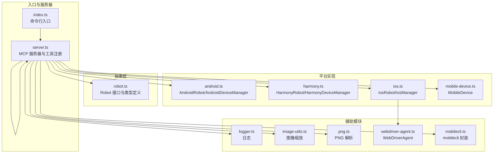
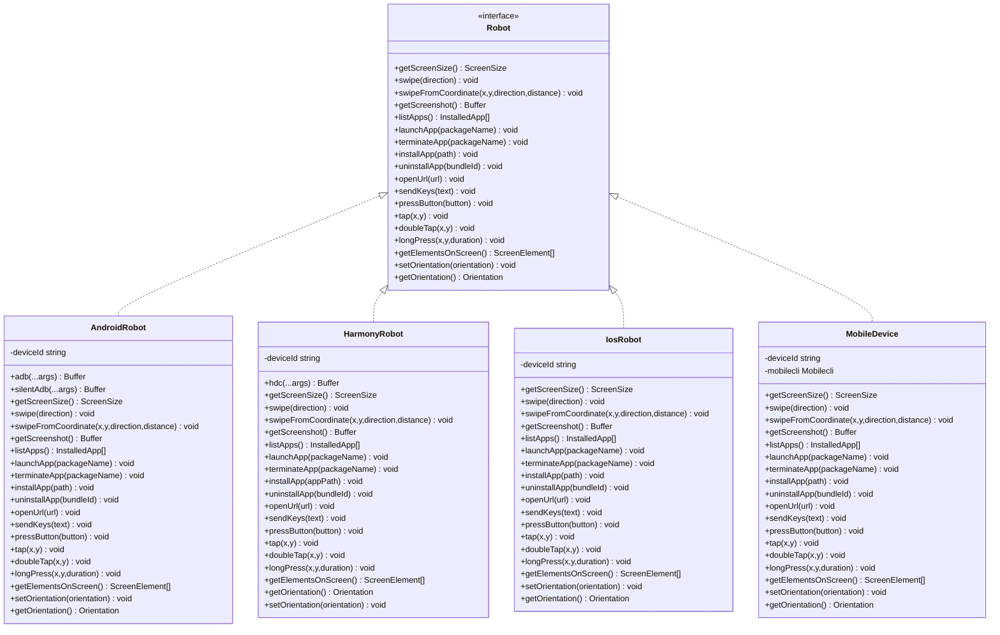
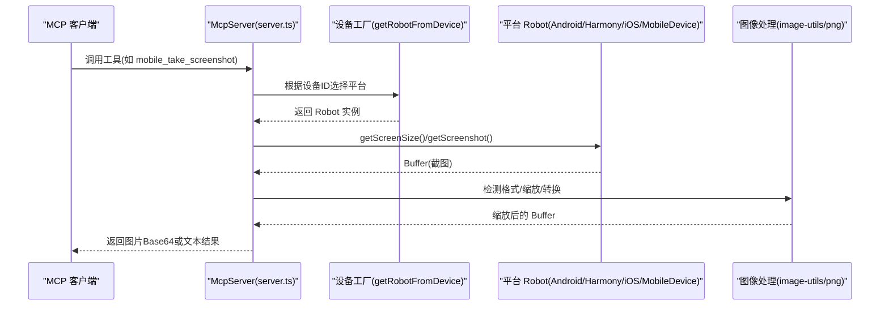
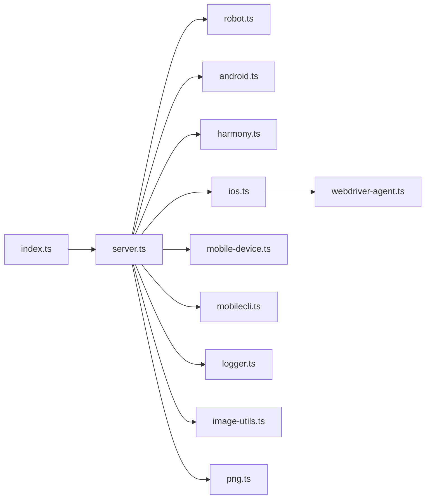

# 代码结构与模块组织

<cite>
**本文档引用的文件**
- [src/index.ts](file://src/index.ts)
- [src/server.ts](file://src/server.ts)
- [src/robot.ts](file://src/robot.ts)
- [src/android.ts](file://src/android.ts)
- [src/harmony.ts](file://src/harmony.ts)
- [src/ios.ts](file://src/ios.ts)
- [src/mobile-device.ts](file://src/mobile-device.ts)
- [src/mobilecli.ts](file://src/mobilecli.ts)
- [src/webdriver-agent.ts](file://src/webdriver-agent.ts)
- [src/logger.ts](file://src/logger.ts)
- [src/image-utils.ts](file://src/image-utils.ts)
- [src/png.ts](file://src/png.ts)
- [package.json](file://package.json)
- [README.md](file://README.md)
</cite>

## 目录
1. [简介](#简介)
2. [项目结构](#项目结构)
3. [核心组件](#核心组件)
4. [架构总览](#架构总览)
5. [详细组件分析](#详细组件分析)
6. [依赖关系分析](#依赖关系分析)
7. [性能考量](#性能考量)
8. [故障排查指南](#故障排查指南)
9. [结论](#结论)
10. [附录](#附录)

## 简介
本项目是一个基于 Model Context Protocol (MCP) 的跨平台移动设备自动化服务器，支持 iOS、Android 与 HarmonyOS（鸿蒙）。它通过统一的工具接口为 LLM/Agent 提供设备能力，包括设备发现、应用管理、屏幕交互、按键操作、截图与方向控制等。项目采用策略模式对不同平台的设备抽象进行解耦，使上层工具调用无需关心具体平台差异。

## 项目结构
项目采用“按功能模块划分”的组织方式，核心模块如下：
- 入口模块：负责命令行参数解析、SSE/STDIO 两种传输模式启动
- 服务器核心：注册 MCP 工具、设备发现与路由、错误处理与遥测上报
- 机器人抽象层：定义统一的设备操作接口（Robot）
- 平台实现模块：Android、HarmonyOS、iOS、模拟器（MobileDevice）
- 辅助模块：日志、图像处理、PNG 解析、WebDriverAgent、mobilecli 封装

图表来源
- [src/index.ts:1-67](file://src/index.ts#L1-L67)
- [src/server.ts:1-708](file://src/server.ts#L1-L708)
- [src/robot.ts:1-148](file://src/robot.ts#L1-L148)
- [src/android.ts:1-593](file://src/android.ts#L1-L593)
- [src/harmony.ts:1-462](file://src/harmony.ts#L1-L462)
- [src/ios.ts:1-294](file://src/ios.ts#L1-L294)
- [src/mobile-device.ts:1-217](file://src/mobile-device.ts#L1-L217)
- [src/mobilecli.ts:1-136](file://src/mobilecli.ts#L1-L136)
- [src/webdriver-agent.ts:1-455](file://src/webdriver-agent.ts#L1-L455)
- [src/logger.ts:1-22](file://src/logger.ts#L1-L22)
- [src/image-utils.ts:1-165](file://src/image-utils.ts#L1-L165)
- [src/png.ts:1-21](file://src/png.ts#L1-L21)

章节来源
- [src/index.ts:1-67](file://src/index.ts#L1-L67)
- [src/server.ts:1-708](file://src/server.ts#L1-L708)
- [package.json:1-74](file://package.json#L1-L74)

## 核心组件
- 入口模块（index.ts）
  - 提供命令行参数解析，支持 --port（SSE 模式）与 --stdio（默认 STDIO 模式）
  - SSE 模式：创建 Express 应用，挂载 /mcp 路由，使用 SSEServerTransport
  - STDIO 模式：创建 StdioServerTransport，直接与 MCP 客户端通信
- 服务器核心（server.ts）
  - 创建 McpServer 实例，注册大量 MCP 工具（设备管理、应用管理、屏幕交互、输入与导航、截图、方向）
  - 使用工具包装器 tool() 统一处理参数校验、异常捕获、耗时统计与遥测上报
  - 设备选择逻辑：优先识别 HarmonyOS，其次 iOS，再 Android，最后通过 mobilecli 识别模拟器
  - 截图处理：根据格式自动缩放与转换，降低传输体积
- 机器人抽象层（robot.ts）
  - 定义 Robot 接口与常用类型（Dimensions、ScreenSize、InstalledApp、ScreenElement、Button、SwipeDirection、Orientation）
  - 统一设备操作契约：屏幕尺寸、滑动、截图、应用管理、按键、点击、长按、双击、元素列表、方向设置与获取
- 平台实现模块
  - AndroidRobot/AndroidDeviceManager：通过 ADB 与 UIAutomator 实现设备控制
  - HarmonyRobot/HarmonyDeviceManager：通过 HDC、uitest、hidumper、snapshot_display、bm、aa 实现设备控制
  - IosRobot/IosManager：通过 WebDriverAgent（WDA）与 go-ios/tunnel 交互
  - MobileDevice：通过 mobilecli 对 iOS 模拟器进行统一控制
- 辅助模块
  - logger.ts：统一日志输出，可选写入文件
  - image-utils.ts：图像缩放（Sips/ImageMagick），提供链式 API
  - png.ts：PNG 文件头校验与尺寸读取
  - webdriver-agent.ts：封装 WDA HTTP API，提供会话管理与动作执行
  - mobilecli.ts：封装 mobilecli 二进制，自动定位路径并执行命令

章节来源
- [src/index.ts:1-67](file://src/index.ts#L1-L67)
- [src/server.ts:1-708](file://src/server.ts#L1-L708)
- [src/robot.ts:1-148](file://src/robot.ts#L1-L148)
- [src/android.ts:1-593](file://src/android.ts#L1-L593)
- [src/harmony.ts:1-462](file://src/harmony.ts#L1-L462)
- [src/ios.ts:1-294](file://src/ios.ts#L1-L294)
- [src/mobile-device.ts:1-217](file://src/mobile-device.ts#L1-L217)
- [src/mobilecli.ts:1-136](file://src/mobilecli.ts#L1-L136)
- [src/webdriver-agent.ts:1-455](file://src/webdriver-agent.ts#L1-L455)
- [src/logger.ts:1-22](file://src/logger.ts#L1-L22)
- [src/image-utils.ts:1-165](file://src/image-utils.ts#L1-L165)
- [src/png.ts:1-21](file://src/png.ts#L1-L21)

## 架构总览
系统采用“策略模式 + 抽象接口”的架构设计：
- 上层通过统一的 Robot 接口调用设备能力
- 下层针对不同平台实现具体策略类（AndroidRobot、HarmonyRobot、IosRobot、MobileDevice）
- 服务器核心根据设备 ID 动态选择对应策略实例，实现平台无关的操作

图表来源
- [src/robot.ts:48-147](file://src/robot.ts#L48-L147)
- [src/android.ts:74-504](file://src/android.ts#L74-L504)
- [src/harmony.ts:43-416](file://src/harmony.ts#L43-L416)
- [src/ios.ts:42-232](file://src/ios.ts#L42-L232)
- [src/mobile-device.ts:62-216](file://src/mobile-device.ts#L62-L216)

## 详细组件分析

### 入口模块（index.ts）
- 功能要点
  - 命令行参数解析：--port（SSE 模式）、--stdio（默认 STDIO 模式）
  - SSE 模式：Express 应用监听端口，使用 SSEServerTransport 处理 /mcp GET/POST
  - STDIO 模式：StdioServerTransport 直连 MCP 客户端，便于集成到各种 MCP 客户端
  - 错误处理：捕获致命错误并记录日志后退出
- 交互模式
  - 通过 createMcpServer() 获取 McpServer 实例并连接传输层
  - 输出版本信息与运行状态

章节来源
- [src/index.ts:1-67](file://src/index.ts#L1-L67)

### 服务器核心（server.ts）
- 功能要点
  - 创建 McpServer，注册工具清单（设备管理、应用管理、屏幕交互、输入与导航、截图、方向）
  - 工具包装器 tool()：统一参数校验（Zod）、异常捕获（ActionableError 与真实异常区分）、耗时统计、遥测上报
  - 设备选择策略：先检测 HarmonyOS（无需 mobilecli），再检测 iOS（go-ios），再检测 Android（ADB），最后通过 mobilecli 检测 iOS 模拟器
  - 截图处理：自动识别 PNG/JPEG，必要时缩放并转换格式，降低体积
- 关键流程
  - 设备选择：getRobotFromDevice(deviceId) → 返回对应平台的 Robot 实例
  - 截图流程：getScreenshot() → 缩放/转换 → Base64 返回

图表来源
- [src/server.ts:149-197](file://src/server.ts#L149-L197)
- [src/server.ts:597-673](file://src/server.ts#L597-L673)
- [src/image-utils.ts:1-165](file://src/image-utils.ts#L1-L165)
- [src/png.ts:1-21](file://src/png.ts#L1-L21)

章节来源
- [src/server.ts:1-708](file://src/server.ts#L1-L708)

### 机器人抽象层（robot.ts）
- 角色与职责
  - 定义统一的设备操作接口（Robot），屏蔽平台差异
  - 定义常用数据结构（Dimensions、ScreenSize、InstalledApp、ScreenElement、Button、SwipeDirection、Orientation）
  - 提供 ActionableError 异常类型，用于可修复的用户错误提示
- 设计意义
  - 通过接口约束，确保各平台实现遵循一致的行为契约
  - 便于扩展新平台（新增实现类并接入工厂）

章节来源
- [src/robot.ts:1-148](file://src/robot.ts#L1-L148)

### 平台实现模块

#### Android（android.ts）
- 抽象与实现
  - AndroidRobot 实现 Robot 接口，通过 ADB 执行 shell 命令与 UIAutomator
  - AndroidDeviceManager 提供设备发现与详情查询
- 关键特性
  - 屏幕尺寸：wm size
  - 截图：screencap -p 或指定 displayId
  - UI 元素：uiautomator dump XML 解析，过滤有效节点
  - 文本输入：ASCII 直接输入；非 ASCII 通过设备上的 Clipboard 插件
  - 方向：通过 settings/content insert 设置 user_rotation
- 错误处理
  - 对安装/卸载失败捕获 stdout/stderr 并抛出可修复错误

章节来源
- [src/android.ts:1-593](file://src/android.ts#L1-L593)

#### HarmonyOS（harmony.ts）
- 抽象与实现
  - HarmonyRobot 实现 Robot 接口，通过 HDC、uitest、hidumper、snapshot_display、bm、aa
  - HarmonyDeviceManager 提供设备发现与详情查询
- 关键特性
  - 屏幕尺寸：hidumper DisplayManagerService
  - 截图：snapshot_display → file recv
  - UI 元素：uitest dumpLayout → 本地 JSON 解析
  - 方向：hidumper 读取 ScreenRotation，不支持程序化修改
- 错误处理
  - 对安装/卸载失败捕获 stdout/stderr 并抛出可修复错误

章节来源
- [src/harmony.ts:1-462](file://src/harmony.ts#L1-L462)

#### iOS（ios.ts）
- 抽象与实现
  - IosRobot 实现 Robot 接口，通过 WebDriverAgent（WDA）与 go-ios/tunnel
  - IosManager 提供物理设备发现与详情查询
- 关键特性
  - 屏幕尺寸：WDA /wda/screen
  - 截图：WDA /screenshot
  - UI 元素：WDA source（JSON），过滤可见且有标识的节点
  - 文本输入：WDA /wda/keys
  - 方向：WDA /orientation
- 运行前置
  - iOS 17+ 需要隧道（tunnel）与端口转发（WDA）
  - 通过 isTunnelRequired()/isWdaForwardRunning() 检查并报错

章节来源
- [src/ios.ts:1-294](file://src/ios.ts#L1-L294)
- [src/webdriver-agent.ts:1-455](file://src/webdriver-agent.ts#L1-L455)

#### iOS 模拟器（mobile-device.ts）
- 抽象与实现
  - MobileDevice 实现 Robot 接口，通过 mobilecli 统一控制 iOS 模拟器
- 关键特性
  - 屏幕尺寸：mobilecli device info
  - 截图：mobilecli screenshot
  - UI 元素：mobilecli dump ui
  - 方向：mobilecli device orientation
- 适用场景
  - 作为 iOS 设备的补充，当 go-ios 不可用或仅需模拟器时

章节来源
- [src/mobile-device.ts:1-217](file://src/mobile-device.ts#L1-L217)
- [src/mobilecli.ts:1-136](file://src/mobilecli.ts#L1-L136)

### 辅助模块

#### 日志（logger.ts）
- 功能：统一输出日志，支持写入文件（LOG_FILE 环境变量）
- 作用：便于调试与问题追踪

章节来源
- [src/logger.ts:1-22](file://src/logger.ts#L1-L22)

#### 图像处理（image-utils.ts、png.ts）
- image-utils.ts
  - 提供 Image/ImageTransformer 链式 API，支持 resize、jpeg/passthrough
  - 优先使用 macOS sips，回退到 ImageMagick（magick），否则抛出“缩放不可用”
- png.ts
  - 校验 PNG 文件头并读取尺寸，用于截图有效性验证

章节来源
- [src/image-utils.ts:1-165](file://src/image-utils.ts#L1-L165)
- [src/png.ts:1-21](file://src/png.ts#L1-L21)

#### WebDriverAgent（webdriver-agent.ts）
- 功能：封装 WDA HTTP API，提供会话管理、动作执行、页面源解析、截图、方向控制
- 设计：通过 withinSession 自动创建/销毁会话，保证资源回收

章节来源
- [src/webdriver-agent.ts:1-455](file://src/webdriver-agent.ts#L1-L455)

#### mobilecli（mobilecli.ts）
- 功能：自动定位 mobilecli 二进制（按平台/架构命名），执行命令并返回 JSON
- 设计：支持自定义路径（MOBILECLI_PATH），兼容 node_modules 内外查找

章节来源
- [src/mobilecli.ts:1-136](file://src/mobilecli.ts#L1-L136)

## 依赖关系分析
- 模块耦合
  - server.ts 依赖 robot.ts（接口）、android.ts、harmony.ts、ios.ts、mobile-device.ts（实现）、mobilecli.ts（辅助）、logger.ts、image-utils.ts、png.ts
  - ios.ts 依赖 webdriver-agent.ts
  - index.ts 依赖 server.ts 与传输层（@modelcontextprotocol/sdk）
- 外部依赖
  - @modelcontextprotocol/sdk：MCP 传输与协议
  - commander：命令行参数解析
  - express：SSE 模式 Web 服务
  - fast-xml-parser：Android UIAutomator XML 解析
  - zod/zod-to-json-schema：工具参数校验与 JSON Schema 导出
  - optionalDependencies：@mobilenext/mobilecli（可选）
- 循环依赖
  - 未发现循环依赖，模块间单向依赖清晰

图表来源
- [src/index.ts:1-67](file://src/index.ts#L1-L67)
- [src/server.ts:1-708](file://src/server.ts#L1-L708)
- [src/robot.ts:1-148](file://src/robot.ts#L1-L148)
- [src/android.ts:1-593](file://src/android.ts#L1-L593)
- [src/harmony.ts:1-462](file://src/harmony.ts#L1-L462)
- [src/ios.ts:1-294](file://src/ios.ts#L1-L294)
- [src/mobile-device.ts:1-217](file://src/mobile-device.ts#L1-L217)
- [src/mobilecli.ts:1-136](file://src/mobilecli.ts#L1-L136)
- [src/webdriver-agent.ts:1-455](file://src/webdriver-agent.ts#L1-L455)
- [src/logger.ts:1-22](file://src/logger.ts#L1-L22)
- [src/image-utils.ts:1-165](file://src/image-utils.ts#L1-L165)
- [src/png.ts:1-21](file://src/png.ts#L1-L21)

章节来源
- [package.json:1-74](file://package.json#L1-L74)

## 性能考量
- 截图优化
  - 自动检测 PNG/JPEG，JPEG 时进行缩放与质量压缩，显著降低传输体积
  - 仅在可用时启用缩放（Sips 或 ImageMagick），避免额外开销
- 平台差异
  - Android：多显示器场景下选择活动 display，提升兼容性
  - iOS：WDA 会话复用，减少握手成本
  - HarmonyOS：HDC/uitest 直连，延迟较低
- 错误与重试
  - UIAutomator dump 失败时内置重试机制，提高稳定性
  - ActionableError 与真实异常区分，避免无谓重试

## 故障排查指南
- 设备未找到
  - 使用 mobile_list_available_devices 确认设备列表
  - HarmonyOS：检查 hdc 是否在 PATH 或设置 HDC_SDK_PATH
  - iOS：确认 go-ios 安装、隧道与端口转发正常
  - Android：确认 ANDROID_HOME/adb 可用
- 截图异常
  - 检查截图格式与尺寸有效性（PNG 校验）
  - 确认缩放工具（sips/magick）是否可用
- 安装/卸载失败
  - 查看 stdout/stderr 输出，按平台错误提示修复
- 日志定位
  - 设置 LOG_FILE 环境变量，查看详细日志

章节来源
- [src/server.ts:138-147](file://src/server.ts#L138-L147)
- [src/android.ts:362-382](file://src/android.ts#L362-L382)
- [src/harmony.ts:268-288](file://src/harmony.ts#L268-L288)
- [src/ios.ts:69-92](file://src/ios.ts#L69-L92)
- [src/logger.ts:1-22](file://src/logger.ts#L1-L22)

## 结论
本项目通过“抽象接口 + 策略实现”的架构，实现了对 iOS、Android、HarmonyOS 与 iOS 模拟器的统一自动化能力。入口模块与服务器核心分别承担启动与工具编排职责，平台实现模块专注于各自生态的底层交互。该设计具备良好的可扩展性与可维护性，便于后续增加新平台或增强现有平台能力。

## 附录

### 代码导航指南
- 入口与启动
  - [src/index.ts](file://src/index.ts)：命令行入口与传输层选择
- 服务器与工具
  - [src/server.ts](file://src/server.ts)：MCP 工具注册与设备选择逻辑
- 抽象接口
  - [src/robot.ts](file://src/robot.ts)：Robot 接口与类型定义
- 平台实现
  - [src/android.ts](file://src/android.ts)：Android 实现
  - [src/harmony.ts](file://src/harmony.ts)：HarmonyOS 实现
  - [src/ios.ts](file://src/ios.ts)：iOS 实现
  - [src/mobile-device.ts](file://src/mobile-device.ts)：iOS 模拟器实现
- 辅助工具
  - [src/webdriver-agent.ts](file://src/webdriver-agent.ts)：WDA 封装
  - [src/mobilecli.ts](file://src/mobilecli.ts)：mobilecli 封装
  - [src/image-utils.ts](file://src/image-utils.ts)、[src/png.ts](file://src/png.ts)：图像处理
  - [src/logger.ts](file://src/logger.ts)：日志