# 工具和辅助模块

<cite>
**本文档引用的文件**
- [image-utils.ts](file://src/image-utils.ts)
- [png.ts](file://src/png.ts)
- [mobile-device.ts](file://src/mobile-device.ts)
- [mobilecli.ts](file://src/mobilecli.ts)
- [webdriver-agent.ts](file://src/webdriver-agent.ts)
- [logger.ts](file://src/logger.ts)
- [robot.ts](file://src/robot.ts)
- [server.ts](file://src/server.ts)
- [index.ts](file://src/index.ts)
- [package.json](file://package.json)
- [README.md](file://README.md)
- [mobilecli.test.ts](file://test/mobilecli.test.ts)
- [png.ts](file://test/png.ts)
</cite>

## 目录
1. [简介](#简介)
2. [项目结构](#项目结构)
3. [核心组件](#核心组件)
4. [架构概览](#架构概览)
5. [详细组件分析](#详细组件分析)
6. [依赖关系分析](#依赖关系分析)
7. [性能考虑](#性能考虑)
8. [故障排除指南](#故障排除指南)
9. [结论](#结论)
10. [附录](#附录)

## 简介

本文档深入介绍了移动自动化测试项目中的工具和辅助功能模块。这些模块包括图像处理（image-utils.ts、png.ts）、设备管理（mobile-device.ts）、CLI工具（mobilecli.ts）、WebDriverAgent集成（webdriver-agent.ts）和日志系统（logger.ts）。这些工具模块在整体架构中发挥着关键作用，为跨平台移动设备自动化提供了强大的基础设施支持。

项目基于Model Context Protocol (MCP) 架构，支持iOS、Android和HarmonyOS设备的统一自动化操作。通过这些工具模块，系统能够实现设备发现、应用管理、屏幕交互、图像处理和日志记录等功能。

## 项目结构

该项目采用模块化的文件组织结构，每个工具模块都有明确的职责分工：

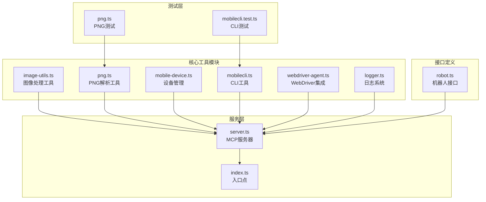

**图表来源**
- [image-utils.ts:1-165](file://src/image-utils.ts#L1-L165)
- [mobile-device.ts:1-217](file://src/mobile-device.ts#L1-L217)
- [mobilecli.ts:1-136](file://src/mobilecli.ts#L1-L136)
- [webdriver-agent.ts:1-455](file://src/webdriver-agent.ts#L1-L455)
- [logger.ts:1-22](file://src/logger.ts#L1-L22)
- [robot.ts:1-148](file://src/robot.ts#L1-L148)
- [server.ts:1-708](file://src/server.ts#L1-L708)

**章节来源**
- [package.json:1-74](file://package.json#L1-L74)
- [README.md:1-198](file://README.md#L1-L198)

## 核心组件

### 图像处理模块

图像处理模块提供了强大的图片转换和缩放功能，支持多种格式和优化策略：

- **ImageTransformer类**：提供链式调用的图像变换接口
- **Image类**：图像处理的便捷入口点
- **PNG解析器**：专门用于解析PNG文件头信息
- **格式检测**：自动识别JPEG和PNG格式

### 设备管理模块

设备管理模块实现了统一的设备抽象接口，支持多种设备类型：

- **MobileDevice类**：实现Robot接口的设备控制器
- **设备发现**：自动检测和分类不同类型的设备
- **命令封装**：将复杂的设备操作封装为简单接口

### CLI工具模块

CLI工具模块提供了对mobilecli二进制文件的封装：

- **路径解析**：自动定位和加载合适的mobilecli二进制
- **参数验证**：严格的参数类型检查和错误处理
- **设备管理**：提供设备列表和状态查询功能

### WebDriverAgent集成

WebDriverAgent模块实现了与Apple WebDriverAgent的集成：

- **会话管理**：自动创建和销毁WebDriver会话
- **动作执行**：支持点击、滑动、长按等手势操作
- **屏幕抓取**：获取设备屏幕截图和元素信息

### 日志系统

日志系统提供了统一的日志记录机制：

- **文件输出**：可选的文件日志记录
- **控制台输出**：标准错误输出
- **时间戳**：自动添加时间戳标记

**章节来源**
- [image-utils.ts:9-165](file://src/image-utils.ts#L9-L165)
- [mobile-device.ts:62-217](file://src/mobile-device.ts#L62-L217)
- [mobilecli.ts:27-136](file://src/mobilecli.ts#L27-L136)
- [webdriver-agent.ts:25-455](file://src/webdriver-agent.ts#L25-L455)
- [logger.ts:1-22](file://src/logger.ts#L1-L22)

## 架构概览

系统采用分层架构设计，各模块之间通过清晰的接口进行交互：

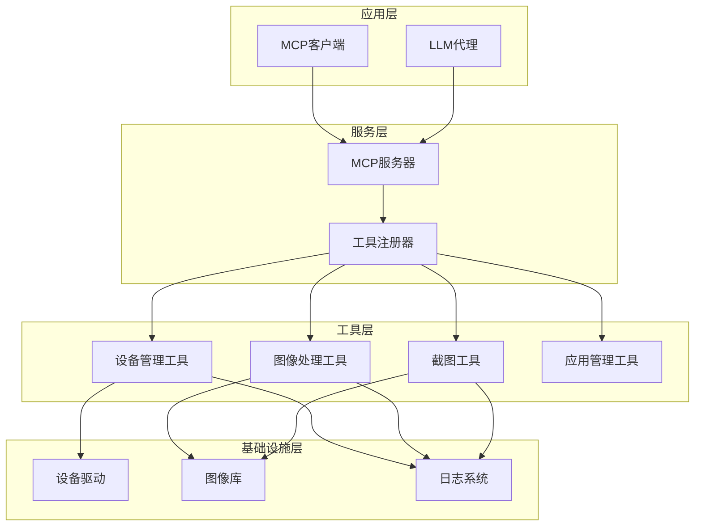

**图表来源**
- [server.ts:35-708](file://src/server.ts#L35-L708)
- [index.ts:1-67](file://src/index.ts#L1-L67)

该架构的核心优势在于：

1. **模块化设计**：每个工具模块独立开发和维护
2. **统一接口**：通过Robot接口实现设备操作的一致性
3. **可扩展性**：新的设备类型和工具可以轻松添加
4. **错误隔离**：单个模块的故障不会影响整个系统

## 详细组件分析

### 图像处理模块深度分析

图像处理模块是整个系统的重要组成部分，特别是在截图处理和优化方面发挥关键作用。

#### 核心类结构

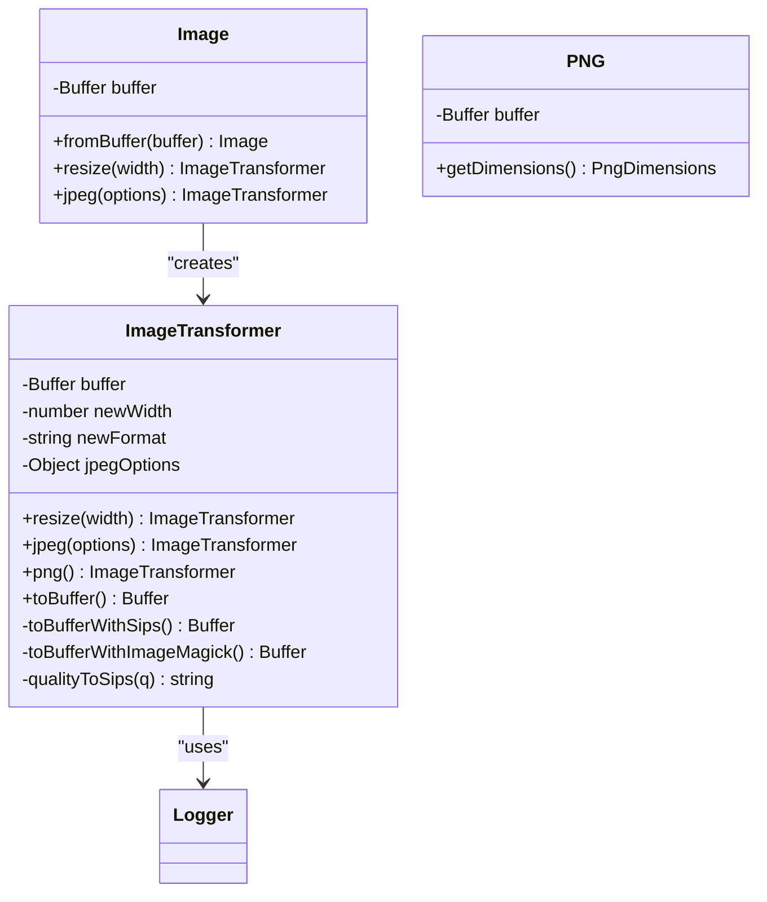

**图表来源**
- [image-utils.ts:9-165](file://src/image-utils.ts#L9-L165)
- [png.ts:6-21](file://src/png.ts#L6-L21)

#### 图像处理流程

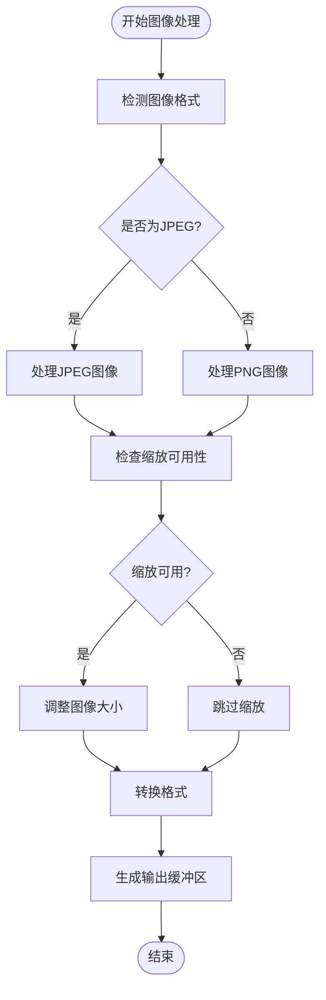

**图表来源**
- [server.ts:615-650](file://src/server.ts#L615-L650)
- [image-utils.ts:33-48](file://src/image-utils.ts#L33-L48)

#### 使用示例和最佳实践

图像处理模块在截图工具中发挥关键作用：

1. **自动格式检测**：根据文件头自动识别图像格式
2. **智能缩放**：根据设备屏幕比例调整图像大小
3. **质量优化**：在保证质量的前提下减小文件大小
4. **格式转换**：将PNG转换为JPEG以减小传输体积

**章节来源**
- [image-utils.ts:1-165](file://src/image-utils.ts#L1-L165)
- [server.ts:615-650](file://src/server.ts#L615-L650)

### 设备管理模块深度分析

设备管理模块实现了统一的设备抽象，支持多种设备类型的操作。

#### 设备管理架构

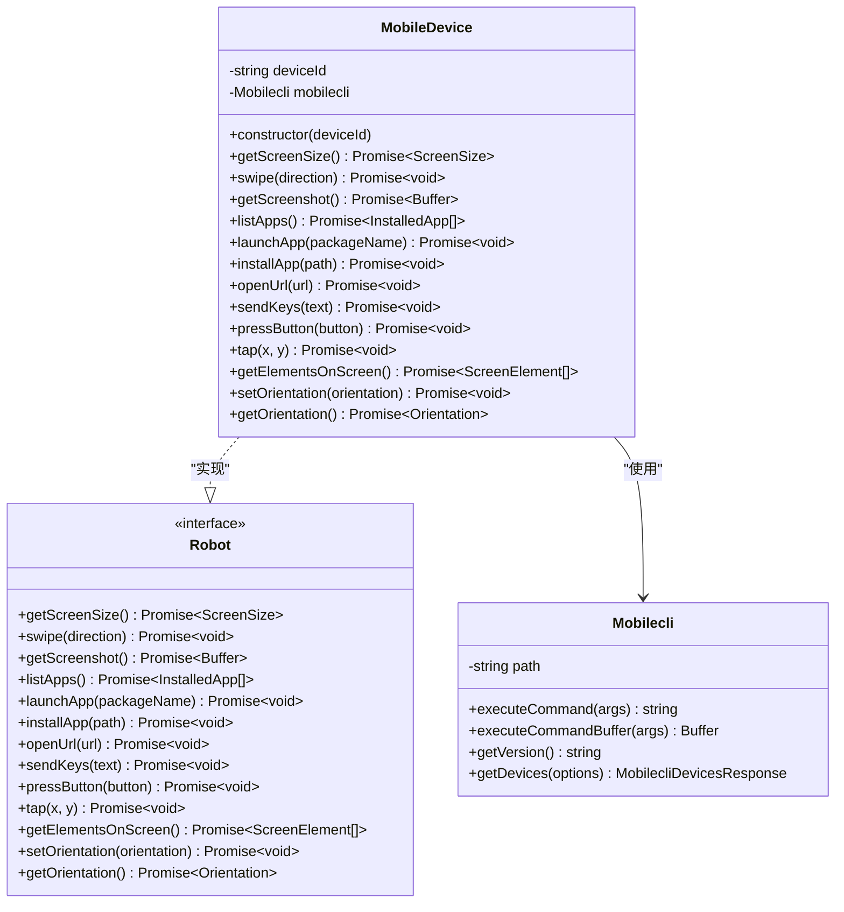

**图表来源**
- [mobile-device.ts:62-217](file://src/mobile-device.ts#L62-L217)
- [mobilecli.ts:27-136](file://src/mobilecli.ts#L27-L136)
- [robot.ts:48-148](file://src/robot.ts#L48-L148)

#### 设备操作序列

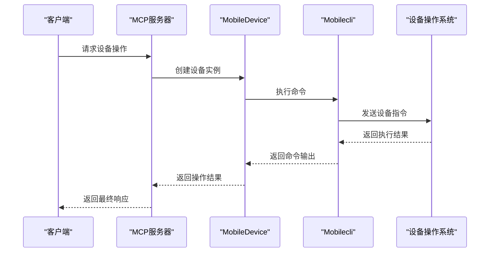

**图表来源**
- [mobile-device.ts:70-74](file://src/mobile-device.ts#L70-L74)
- [mobilecli.ts:39-51](file://src/mobilecli.ts#L39-L51)

**章节来源**
- [mobile-device.ts:1-217](file://src/mobile-device.ts#L1-L217)
- [mobilecli.ts:1-136](file://src/mobilecli.ts#L1-L136)

### CLI工具模块深度分析

CLI工具模块提供了对mobilecli二进制文件的智能封装，支持多平台部署。

#### CLI工具架构

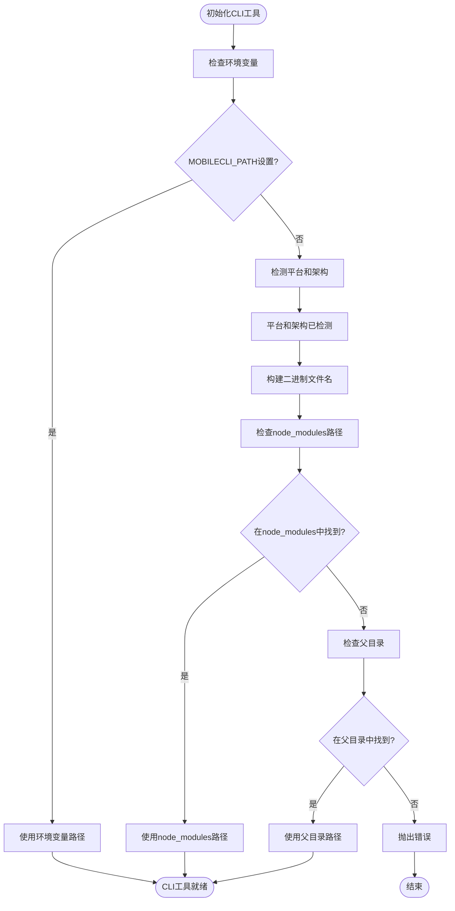

**图表来源**
- [mobilecli.ts:53-92](file://src/mobilecli.ts#L53-L92)

#### 参数验证流程

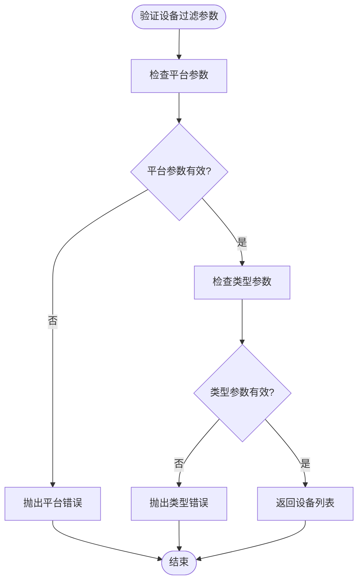

**图表来源**
- [mobilecli.ts:115-127](file://src/mobilecli.ts#L115-L127)

**章节来源**
- [mobilecli.ts:1-136](file://src/mobilecli.ts#L1-L136)
- [mobilecli.test.ts:1-120](file://test/mobilecli.test.ts#L1-L120)

### WebDriverAgent集成深度分析

WebDriverAgent模块实现了与Apple WebDriverAgent的完整集成，提供了丰富的设备操作能力。

#### WebDriverAgent核心功能

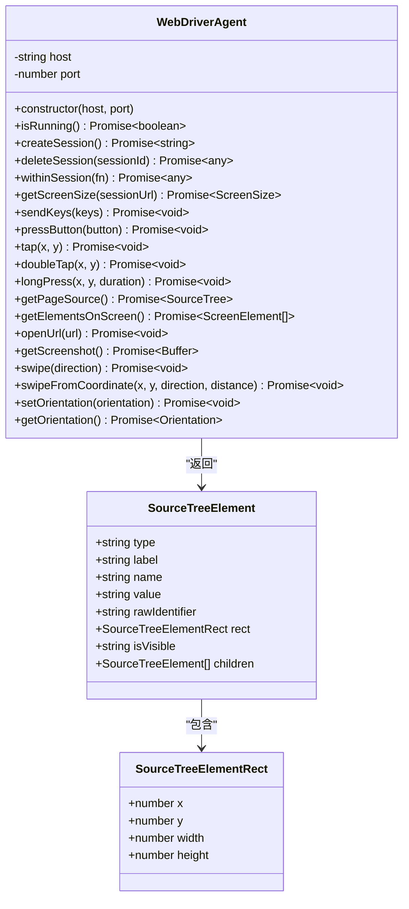

**图表来源**
- [webdriver-agent.ts:25-455](file://src/webdriver-agent.ts#L25-L455)
- [webdriver-agent.ts:3-23](file://src/webdriver-agent.ts#L3-L23)

#### 会话管理流程

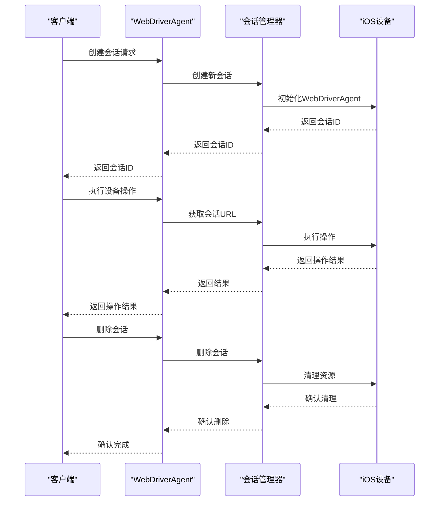

**图表来源**
- [webdriver-agent.ts:71-77](file://src/webdriver-agent.ts#L71-L77)
- [webdriver-agent.ts:42-69](file://src/webdriver-agent.ts#L42-L69)

**章节来源**
- [webdriver-agent.ts:1-455](file://src/webdriver-agent.ts#L1-L455)

### 日志系统深度分析

日志系统提供了统一的日志记录机制，支持文件输出和控制台输出。

#### 日志系统设计

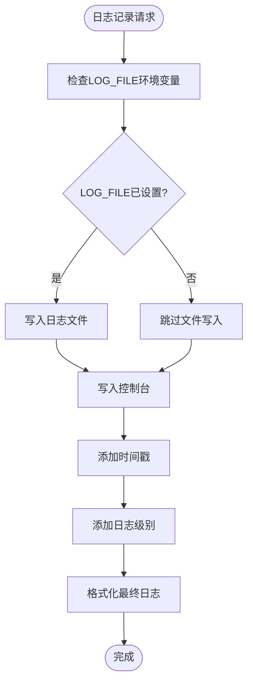

**图表来源**
- [logger.ts:3-13](file://src/logger.ts#L3-L13)

#### 日志记录模式

日志系统支持两种输出模式：

1. **文件输出模式**：当设置LOG_FILE环境变量时，日志同时写入文件和控制台
2. **控制台输出模式**：仅输出到标准错误流

这种设计使得系统既可以在开发环境中提供详细的控制台日志，又可以在生产环境中将日志持久化存储。

**章节来源**
- [logger.ts:1-22](file://src/logger.ts#L1-L22)

## 依赖关系分析

系统中的模块依赖关系体现了清晰的分层架构：

```mermaid
graph TB
subgraph "外部依赖"
A[@mobilenext/mobilecli<br/>可选依赖]
B[@modelcontextprotocol/sdk<br/>必需依赖]
C[express<br/>可选依赖]
end
subgraph "内部模块"
D[server.ts<br/>MCP服务器]
E[image-utils.ts<br/>图像处理]
F[png.ts<br/>PNG解析]
G[mobile-device.ts<br/>设备管理]
H[mobilecli.ts<br/>CLI工具]
I[webdriver-agent.ts<br/>WebDriver集成]
J[logger.ts<br/>日志系统]
K[robot.ts<br/>接口定义]
end
A --> H
B --> D
C --> D
D --> K
D --> E
D --> F
D --> G
D --> H
D --> I
D --> J
E --> J
F --> D
G --> H
G --> J
I --> J
K --> D
```

**图表来源**
- [package.json:29-39](file://package.json#L29-L39)
- [server.ts:7-16](file://src/server.ts#L7-L16)

**章节来源**
- [package.json:1-74](file://package.json#L1-L74)
- [server.ts:1-708](file://src/server.ts#L1-L708)

## 性能考虑

### 图像处理性能优化

图像处理模块采用了多种性能优化策略：

1. **格式检测优化**：通过文件头快速判断图像格式，避免不必要的解码过程
2. **条件缩放**：只有在需要时才进行图像缩放，减少计算开销
3. **格式转换**：将PNG转换为JPEG以减小文件大小，提高传输效率
4. **内存管理**：使用临时文件和缓冲区管理，避免内存泄漏

### 设备操作性能

设备管理模块的性能考虑包括：

1. **命令缓存**：缓存mobilecli路径，避免重复查找
2. **异步操作**：所有设备操作都是异步的，不阻塞主线程
3. **错误重试**：在网络不稳定时提供适当的错误处理和重试机制
4. **资源清理**：确保设备连接和会话正确关闭

### 日志性能影响

日志系统的设计考虑了性能影响：

1. **条件输出**：只有在设置LOG_FILE时才写入文件，避免不必要的磁盘I/O
2. **异步写入**：文件写入使用异步方式，不影响主要业务逻辑
3. **格式化优化**：最小化字符串格式化操作的开销

## 故障排除指南

### 图像处理问题

**常见问题及解决方案**：

1. **图像缩放失败**
   - 检查系统是否安装了ImageMagick或sips工具
   - 验证输入图像的完整性
   - 确认有足够的磁盘空间

2. **格式检测错误**
   - 验证图像文件头是否正确
   - 检查文件是否被截断或损坏
   - 确认文件权限正确

**章节来源**
- [image-utils.ts:33-48](file://src/image-utils.ts#L33-L48)
- [server.ts:615-650](file://src/server.ts#L615-L650)

### 设备管理问题

**常见问题及解决方案**：

1. **设备未发现**
   - 检查设备连接状态
   - 验证mobilecli是否正确安装
   - 确认设备驱动程序正常

2. **命令执行失败**
   - 查看详细错误日志
   - 验证设备ID是否正确
   - 检查权限设置

**章节来源**
- [mobile-device.ts:70-74](file://src/mobile-device.ts#L70-L74)
- [mobilecli.ts:132-134](file://src/mobilecli.ts#L132-L134)

### WebDriverAgent问题

**常见问题及解决方案**：

1. **会话创建失败**
   - 检查WebDriverAgent服务状态
   - 验证主机和端口配置
   - 确认防火墙设置允许连接

2. **操作超时**
   - 增加超时时间设置
   - 检查网络连接稳定性
   - 验证设备响应速度

**章节来源**
- [webdriver-agent.ts:30-40](file://src/webdriver-agent.ts#L30-L40)
- [webdriver-agent.ts:52-62](file://src/webdriver-agent.ts#L52-L62)

### 日志问题

**常见问题及解决方案**：

1. **日志文件未创建**
   - 检查LOG_FILE环境变量设置
   - 验证目标目录权限
   - 确认磁盘空间充足

2. **日志输出异常**
   - 检查控制台输出权限
   - 验证日志格式设置
   - 确认编码设置正确

**章节来源**
- [logger.ts:3-13](file://src/logger.ts#L3-L13)

## 结论

工具和辅助模块为移动自动化测试项目提供了坚实的基础支撑。通过精心设计的模块化架构，这些工具模块实现了：

1. **功能完整性**：覆盖了图像处理、设备管理、CLI工具、WebDriver集成和日志记录等关键功能
2. **平台兼容性**：支持iOS、Android和HarmonyOS等多种平台
3. **可扩展性**：清晰的接口设计使得新功能可以轻松添加
4. **可靠性**：完善的错误处理和日志记录机制
5. **性能优化**：针对图像处理和设备操作进行了专门的性能优化

这些工具模块不仅为当前的MCP服务器提供了强大的基础设施支持，也为未来的功能扩展奠定了良好的基础。通过合理使用这些工具，开发者可以构建更加稳定和高效的移动自动化测试解决方案。

## 附录

### API接口参考

#### 图像处理API

- `Image.fromBuffer(buffer): Image` - 从缓冲区创建图像对象
- `Image.resize(width): ImageTransformer` - 设置目标宽度
- `Image.jpeg(options): ImageTransformer` - 设置JPEG格式和质量
- `ImageTransformer.toBuffer(): Buffer` - 转换为缓冲区

#### 设备管理API

- `MobileDevice.getScreenSize(): Promise<ScreenSize>` - 获取屏幕尺寸
- `MobileDevice.swipe(direction): Promise<void>` - 执行滑动手势
- `MobileDevice.getScreenshot(): Promise<Buffer>` - 获取屏幕截图
- `MobileDevice.getElementsOnScreen(): Promise<ScreenElement[]>` - 获取屏幕元素

#### CLI工具API

- `Mobilecli.getDevices(options): MobilecliDevicesResponse` - 获取设备列表
- `Mobilecli.getVersion(): string` - 获取版本信息
- `Mobilecli.executeCommand(args): string` - 执行命令

#### 日志系统API

- `trace(message: string): void` - 记录跟踪信息
- `error(message: string): void` - 记录错误信息

### 配置选项

#### 环境变量

- `LOG_FILE`: 指定日志文件路径
- `MOBILECLI_PATH`: 指定mobilecli二进制文件路径
- `HDC_SDK_PATH`: 指定HarmonyOS SDK路径

#### 最佳实践

1. **图像处理**：在处理大量截图时，优先使用JPEG格式以减小文件大小
2. **设备管理**：定期检查设备连接状态，及时处理连接中断
3. **日志记录**：在生产环境中启用文件日志，便于问题追踪
4. **错误处理**：为所有异步操作提供适当的错误处理机制