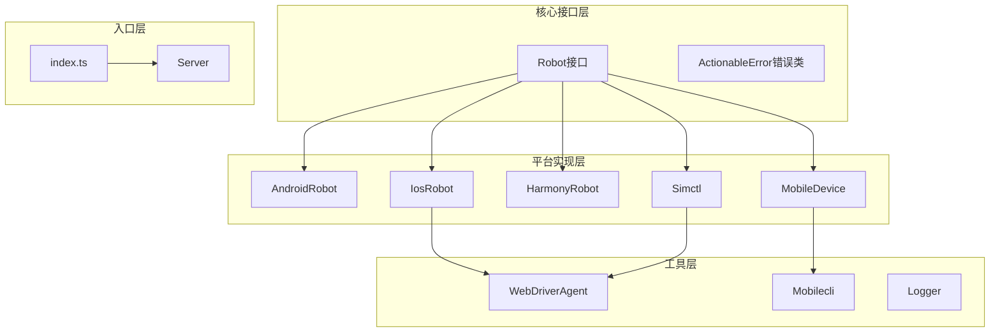
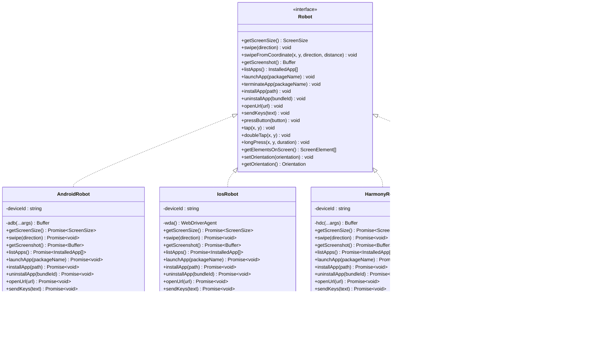
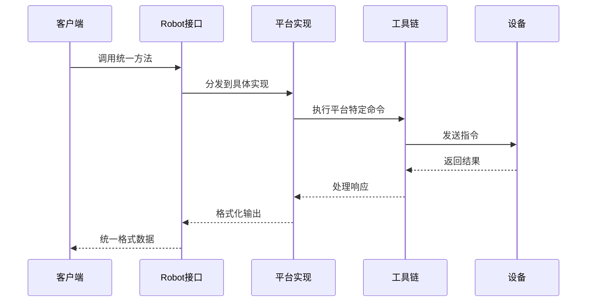

# 平台实现模块

<cite>
**本文档引用的文件**
- [harmony.ts](file://src/harmony.ts)
- [android.ts](file://src/android.ts)
- [ios.ts](file://src/ios.ts)
- [iphone-simulator.ts](file://src/iphone-simulator.ts)
- [robot.ts](file://src/robot.ts)
- [webdriver-agent.ts](file://src/webdriver-agent.ts)
- [mobile-device.ts](file://src/mobile-device.ts)
- [mobilecli.ts](file://src/mobilecli.ts)
- [index.ts](file://src/index.ts)
- [package.json](file://package.json)
- [android.ts](file://test/android.ts)
- [ios.ts](file://test/ios.ts)
- [iphone-simulator.ts](file://test/iphone-simulator.ts)
</cite>

## 目录
1. [简介](#简介)
2. [项目结构](#项目结构)
3. [核心组件](#核心组件)
4. [架构概览](#架构概览)
5. [详细组件分析](#详细组件分析)
6. [依赖关系分析](#依赖关系分析)
7. [性能考虑](#性能考虑)
8. [故障排除指南](#故障排除指南)
9. [结论](#结论)

## 简介

本项目是一个跨平台的移动设备控制框架，支持Android、iOS、HarmonyOS以及iPhone模拟器。通过统一的Robot接口抽象，实现了对不同平台设备的标准化操作。该框架提供了完整的设备管理、应用安装与控制、屏幕截图、元素识别和用户交互等功能。

## 项目结构

项目采用模块化设计，每个平台都有独立的实现模块，同时共享统一的接口定义：



**图表来源**
- [robot.ts:48-147](file://src/robot.ts#L48-L147)
- [android.ts:74-504](file://src/android.ts#L74-L504)
- [ios.ts:42-232](file://src/ios.ts#L42-L232)
- [harmony.ts:43-416](file://src/harmony.ts#L43-L416)
- [iphone-simulator.ts:32-272](file://src/iphone-simulator.ts#L32-L272)

**章节来源**
- [index.ts:1-67](file://src/index.ts#L1-L67)
- [package.json:1-74](file://package.json#L1-L74)

## 核心组件

### Robot接口抽象

所有平台实现都遵循统一的Robot接口，确保跨平台一致性：



**图表来源**
- [robot.ts:48-147](file://src/robot.ts#L48-L147)
- [android.ts:74-504](file://src/android.ts#L74-L504)
- [ios.ts:42-232](file://src/ios.ts#L42-L232)
- [harmony.ts:43-416](file://src/harmony.ts#L43-L416)
- [iphone-simulator.ts:32-272](file://src/iphone-simulator.ts#L32-L272)

**章节来源**
- [robot.ts:1-148](file://src/robot.ts#L1-L148)

## 架构概览

系统采用分层架构设计，通过统一接口实现跨平台兼容性：



**图表来源**
- [robot.ts:48-147](file://src/robot.ts#L48-L147)
- [android.ts:74-84](file://src/android.ts#L74-L84)
- [ios.ts:94-96](file://src/ios.ts#L94-L96)
- [harmony.ts:48-53](file://src/harmony.ts#L48-L53)

## 详细组件分析

### Android平台实现

Android模块基于ADB工具链实现，提供了完整的设备控制能力：

#### 核心特性

1. **ADB工具链集成**
   - 自动检测ANDROID_HOME环境变量
   - 支持Windows和macOS路径
   - 动态路径解析机制

2. **屏幕尺寸获取**
   ```mermaid
flowchart TD
Start([获取屏幕尺寸]) --> GetWM["执行 adb shell wm size"]
GetWM --> Parse["解析输出格式"]
Parse --> Validate{"验证格式"}
Validate --> |成功| Return["返回屏幕尺寸"]
Validate --> |失败| Error["抛出错误"]
```

**图表来源**
- [android.ts:103-116](file://src/android.ts#L103-L116)

3. **多显示器支持**
   - 检测显示数量
   - 解析显示ID
   - 兼容旧版本Android

4. **文本输入处理**
   - ASCII字符直接输入
   - 非ASCII字符通过DeviceKit处理
   - Shell转义安全机制

**章节来源**
- [android.ts:1-593](file://src/android.ts#L1-L593)

### iOS平台实现

iOS模块通过WebDriverAgent实现，需要物理设备配合：

#### 核心特性

1. **WebDriverAgent集成**
   ```mermaid
classDiagram
class WebDriverAgent {
-host : string
-port : number
+isRunning() Promise~boolean~
+createSession() Promise~string~
+deleteSession(sessionId) Promise~any~
+getScreenSize() Promise~ScreenSize~
+swipe(direction) Promise~void~
+getElementsOnScreen() Promise~ScreenElement[]~
+getScreenshot() Promise~Buffer~
+setOrientation(orientation) Promise~void~
+getOrientation() Promise~Orientation~
}
class IosRobot {
-deviceId : string
-wda() WebDriverAgent
+assertTunnelRunning() Promise~void~
+isTunnelRequired() Promise~boolean~
}
WebDriverAgent <-- IosRobot : 使用
```

**图表来源**
- [webdriver-agent.ts:25-454](file://src/webdriver-agent.ts#L25-L454)
- [ios.ts:42-232](file://src/ios.ts#L42-L232)

2. **隧道管理**
   - iOS 17+需要网络隧道
   - 自动检测版本需求
   - 端口转发检查

3. **应用管理**
   - 应用列表获取
   - 安装和卸载
   - 启动和终止

**章节来源**
- [ios.ts:1-294](file://src/ios.ts#L1-L294)

### HarmonyOS平台实现

HarmonyOS模块基于HDC工具链，专为华为设备优化：

#### 核心特性

1. **HDC工具链集成**
   - 自动检测HDC_SDK_PATH环境变量
   - 默认hdc命令路径
   - 错误处理和重试机制

2. **布局树解析**
   ```mermaid
flowchart TD
Start([获取布局树]) --> Dump["执行 hdc shell uitest dumpLayout"]
Dump --> Receive["接收远程文件"]
Receive --> Parse["解析JSON内容"]
Parse --> Collect["递归收集元素"]
Collect --> Filter["过滤有效元素"]
Filter --> Return["返回ScreenElement[]"]
```

**图表来源**
- [harmony.ts:294-332](file://src/harmony.ts#L294-L332)

3. **屏幕元素识别**
   - 支持text、description、hint属性
   - 坐标边界解析
   - 焦点状态检测

4. **应用生命周期管理**
   - 包名列表获取
   - 主能力识别
   - 启动参数解析

**章节来源**
- [harmony.ts:1-462](file://src/harmony.ts#L1-L462)

### iPhone模拟器实现

iPhone模拟器模块通过mobilecli工具实现，支持模拟器操作：

#### 核心特性

1. **Simctl集成**
   - WebDriverAgent自动启动
   - 模拟器状态管理
   - 应用包处理

2. **ZIP文件安全处理**
   ```mermaid
flowchart TD
Start([安装ZIP应用]) --> Validate["验证ZIP内容"]
Validate --> Security{"检查路径安全"}
Security --> |通过| Extract["解压到临时目录"]
Security --> |不通过| Error["抛出安全错误"]
Extract --> FindBundle["查找.app包"]
FindBundle --> Install["安装应用"]
Install --> Cleanup["清理临时文件"]
Cleanup --> Return["返回结果"]
```

**图表来源**
- [iphone-simulator.ts:124-192](file://src/iphone-simulator.ts#L124-L192)

3. **WebDriverAgent集成**
   - 自动检测安装状态
   - 启动超时处理
   - 状态轮询机制

**章节来源**
- [iphone-simulator.ts:1-273](file://src/iphone-simulator.ts#L1-L273)

### 移动设备抽象层

移动设备抽象层提供统一的设备管理接口：

#### 核心特性

1. **mobilecli集成**
   - 自动二进制文件定位
   - 跨平台支持
   - 版本检测

2. **设备发现**
   ```mermaid
flowchart TD
Start([获取设备列表]) --> CallMobilecli["调用mobilecli devices"]
CallMobilecli --> Parse["解析JSON响应"]
Parse --> Filter["过滤设备类型"]
Filter --> Return["返回设备信息"]
```

**图表来源**
- [mobilecli.ts:107-134](file://src/mobilecli.ts#L107-L134)

**章节来源**
- [mobile-device.ts:1-217](file://src/mobile-device.ts#L1-L217)
- [mobilecli.ts:1-136](file://src/mobilecli.ts#L1-L136)

## 依赖关系分析

```mermaid
graph TB
subgraph "外部依赖"
Commander[commander]
Express[express]
FastXMLParser[fast-xml-parser]
Zod[zod]
Mocha[mocha]
NYC[nyc]
end
subgraph "内部模块"
Harmony[harmony.ts]
Android[android.ts]
iOS[ios.ts]
Simulator[iPhone-simulator.ts]
Robot[robot.ts]
WDAG[webdriver-agent.ts]
MobileDevice[mobile-device.ts]
Mobilecli[mobilecli.ts]
Index[index.ts]
end
subgraph "可选依赖"
MobilecliBin[@mobilenext/mobilecli]
end
Harmony --> Robot
Android --> Robot
iOS --> Robot
Simulator --> Robot
MobileDevice --> Robot
iOS --> WDAG
Simulator --> WDAG
MobileDevice --> Mobilecli
MobilecliBin -.-> Mobilecli
Index --> Harmony
Index --> Android
Index --> iOS
Index --> Simulator
Index --> MobileDevice
```

**图表来源**
- [package.json:29-39](file://package.json#L29-L39)
- [robot.ts:1-148](file://src/robot.ts#L1-L148)
- [webdriver-agent.ts:1-455](file://src/webdriver-agent.ts#L1-L455)

**章节来源**
- [package.json:1-74](file://package.json#L1-L74)

## 性能考虑

### 并发控制
- 所有平台实现都设置了30秒超时
- 缓冲区大小限制为4MB
- 异步操作避免阻塞主线程

### 内存管理
- 临时文件自动清理
- 进程资源及时释放
- 大图片内存优化

### 网络通信
- WebDriverAgent使用HTTP协议
- 连接池复用
- 错误重试机制

## 故障排除指南

### 常见问题

1. **Android设备连接问题**
   - 检查ANDROID_HOME环境变量
   - 确认USB调试已开启
   - 验证驱动程序安装

2. **iOS设备连接问题**
   - 安装go-ios工具
   - 配置开发者证书
   - 检查USB连接

3. **HarmonyOS设备连接问题**
   - 设置HDC_SDK_PATH环境变量
   - 确认HiSuite已安装
   - 验证USB调试模式

4. **WebDriverAgent问题**
   - 确认端口8100可用
   - 检查防火墙设置
   - 验证代理配置

**章节来源**
- [android.ts:566-568](file://src/android.ts#L566-L568)
- [ios.ts:70-75](file://src/ios.ts#L70-L75)
- [harmony.ts:420-433](file://src/harmony.ts#L420-L433)

## 结论

该跨平台移动设备控制框架通过统一的Robot接口抽象，成功实现了对Android、iOS、HarmonyOS和iPhone模拟器的标准化操作。每个平台模块都针对其特定的工具链和API进行了优化，同时保持了接口的一致性。

### 主要优势

1. **统一接口**：所有平台遵循相同的Robot接口
2. **平台特定优化**：充分利用各平台的最佳实践
3. **错误处理**：完善的ActionableError错误机制
4. **扩展性**：易于添加新的平台支持

### 技术特色

1. **工具链集成**：深度集成各平台官方工具链
2. **异步架构**：基于Promise的异步操作模型
3. **安全机制**：输入验证和路径安全检查
4. **测试覆盖**：完整的单元测试和集成测试

该框架为移动应用自动化测试提供了强大的基础设施，支持从简单的设备控制到复杂的UI测试场景。