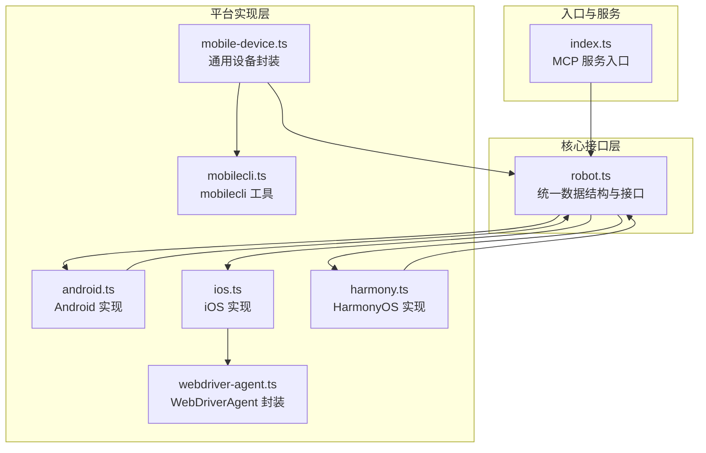
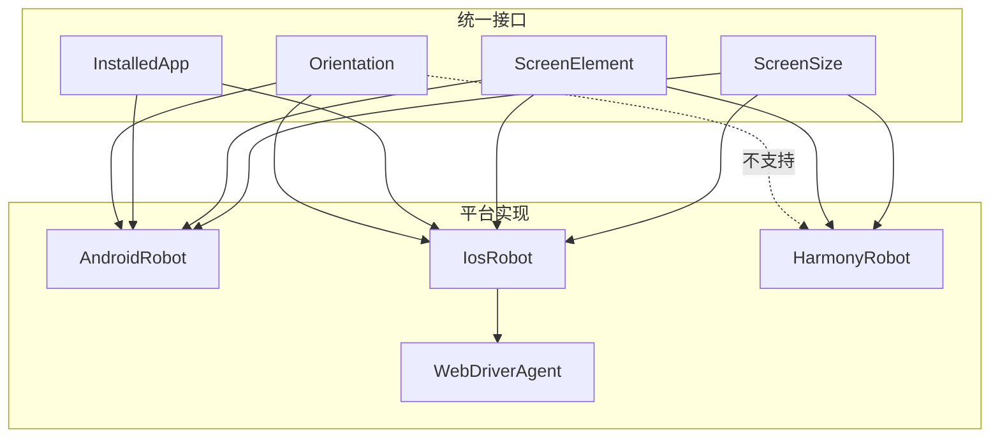
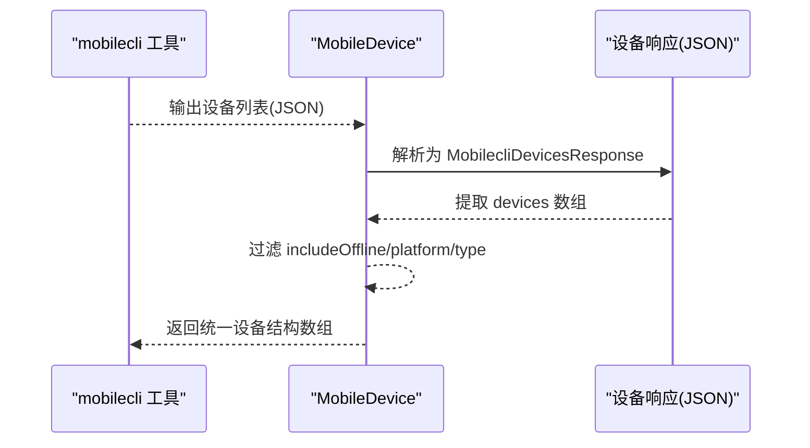
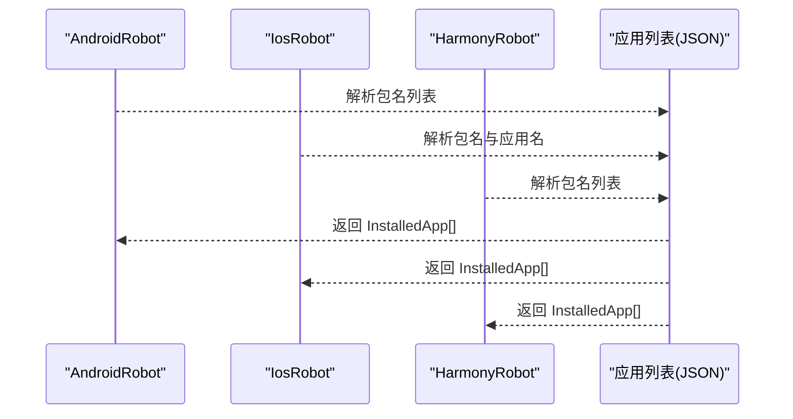
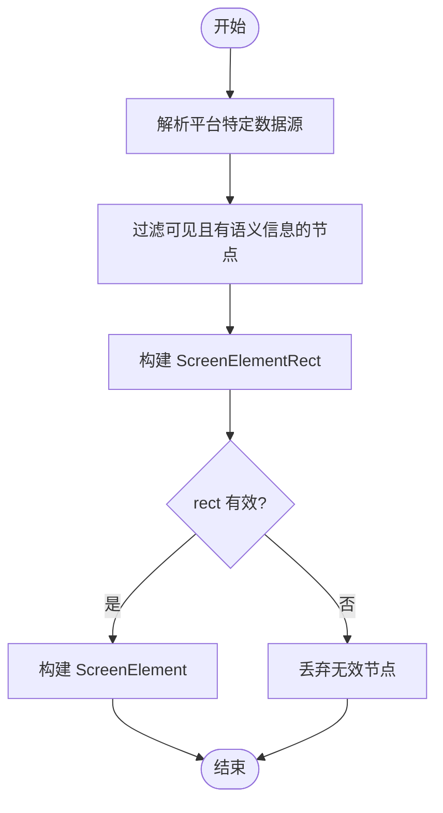
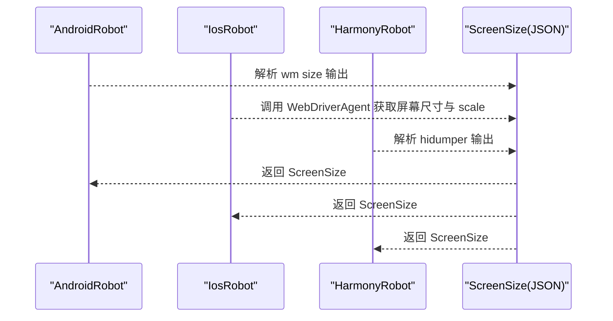
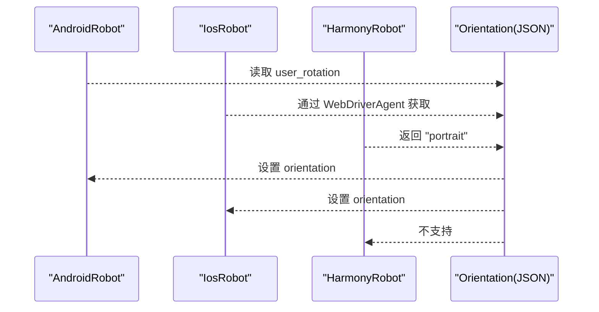
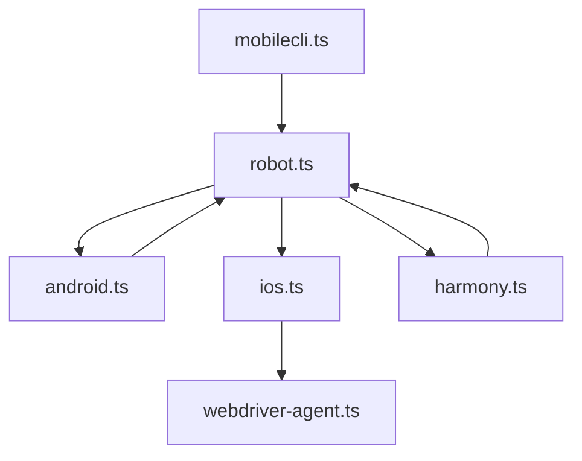

# 数据结构和类型定义

<cite>
**本文档引用的文件**
- [robot.ts](file://src/robot.ts)
- [mobile-device.ts](file://src/mobile-device.ts)
- [android.ts](file://src/android.ts)
- [ios.ts](file://src/ios.ts)
- [harmony.ts](file://src/harmony.ts)
- [webdriver-agent.ts](file://src/webdriver-agent.ts)
- [mobilecli.ts](file://src/mobilecli.ts)
- [index.ts](file://src/index.ts)
- [README.md](file://README.md)
</cite>

## 目录
1. [简介](#简介)
2. [项目结构](#项目结构)
3. [核心组件](#核心组件)
4. [架构总览](#架构总览)
5. [详细组件分析](#详细组件分析)
6. [依赖关系分析](#依赖关系分析)
7. [性能考虑](#性能考虑)
8. [故障排查指南](#故障排查指南)
9. [结论](#结论)

## 简介
本节概述项目中涉及的核心数据结构与类型定义，重点覆盖设备信息结构（MobilecliDevice）、应用信息结构（InstalledApp）、屏幕元素结构（ScreenElement）、屏幕尺寸结构（ScreenSize）以及方向信息结构（Orientation）。我们将解释这些结构的设计目的、字段定义、验证规则、序列化方式，以及在不同平台（iOS、Android、HarmonyOS）间的兼容性与转换机制，并说明它们在 MCP 协议中的传输格式与处理方式。

## 项目结构
该项目采用按平台分层的模块化组织方式，核心数据结构集中在统一的接口定义文件中，各平台的具体实现分别封装在独立文件内，通过统一的 Robot 接口对外暴露一致的能力。

图表来源
- [robot.ts:1-148](file://src/robot.ts#L1-L148)
- [android.ts:1-593](file://src/android.ts#L1-L593)
- [ios.ts:1-294](file://src/ios.ts#L1-L294)
- [harmony.ts:1-462](file://src/harmony.ts#L1-L462)
- [mobile-device.ts:1-217](file://src/mobile-device.ts#L1-L217)
- [webdriver-agent.ts:1-455](file://src/webdriver-agent.ts#L1-L455)
- [mobilecli.ts:1-136](file://src/mobilecli.ts#L1-L136)
- [index.ts:1-67](file://src/index.ts#L1-L67)

章节来源
- [README.md:1-198](file://README.md#L1-L198)
- [robot.ts:1-148](file://src/robot.ts#L1-L148)

## 核心组件
本节聚焦于项目中的核心数据结构与类型定义，逐一说明其设计目的、字段定义、验证规则与序列化方式，并给出在不同平台间的兼容性与转换机制。

- 设备信息结构（MobilecliDevice）
  - 设计目的：用于描述通过 mobilecli 工具枚举的设备信息，便于统一展示与筛选。
  - 字段定义：
    - id：设备唯一标识符（字符串）
    - name：设备名称（字符串）
    - platform：平台类型（"ios" | "android"）
    - type：设备类型（"real" | "emulator" | "simulator"）
    - version：系统版本（字符串）
  - 验证规则：
    - platform 必须为 "ios" 或 "android"
    - type 必须为 "real"、"emulator" 或 "simulator"
  - 序列化方式：JSON 对象，键值与字段一一对应。
  - 兼容性与转换：该结构由 mobilecli 工具输出，供上层设备管理器统一消费；在 HarmonyOS 场景中，设备信息通过 HDC 工具直接获取，不依赖 mobilecli。

- 应用信息结构（InstalledApp）
  - 设计目的：统一表示设备上已安装的应用信息，便于应用列表展示与操作。
  - 字段定义：
    - packageName：应用包名或 Bundle ID（字符串）
    - appName：应用显示名称（字符串）
  - 验证规则：字段均为非空字符串。
  - 序列化方式：JSON 数组对象，包含 packageName 与 appName。
  - 兼容性与转换：Android 使用包名作为 packageName；iOS 使用 Bundle ID；HarmonyOS 使用包名。

- 屏幕元素结构（ScreenElement）
  - 设计目的：抽象屏幕上的可交互 UI 元素，提供结构化数据以便 LLM/Agent 进行语义理解与操作。
  - 字段定义：
    - type：元素类型（字符串）
    - label：可访问性标签（可选）
    - text：元素文本（可选）
    - name：元素名称（可选）
    - value：元素值（可选）
    - hint：提示信息（可选）
    - identifier：唯一标识符（可选）
    - rect：元素矩形区域（ScreenElementRect）
    - focused：是否处于焦点状态（可选，仅在特定平台如 Android TV）
  - 验证规则：
    - rect 必须包含有效的 x、y、width、height
    - width、height 必须大于 0
  - 序列化方式：JSON 对象，rect 为嵌套对象。
  - 兼容性与转换：Android 通过 UIAutomator XML 解析；iOS 通过 WebDriverAgent 的页面源过滤；HarmonyOS 通过布局 dump 解析。

- 屏幕尺寸结构（ScreenSize）
  - 设计目的：统一表示设备屏幕尺寸与缩放比例，确保截图与坐标计算的一致性。
  - 字段定义：
    - width：屏幕宽度（像素）
    - height：屏幕高度（像素）
    - scale：缩放比例（浮点数）
  - 验证规则：width、height、scale 必须为正数。
  - 序列化方式：JSON 对象，包含 width、height、scale。
  - 兼容性与转换：iOS 返回的屏幕尺寸通常以点为单位，scale 用于换算像素；Android/HarmonyOS 返回像素尺寸。

- 方向信息结构（Orientation）
  - 设计目的：统一表示设备屏幕方向，支持横屏与竖屏切换。
  - 字段定义：枚举值 "portrait" | "landscape"
  - 验证规则：仅允许上述两个枚举值。
  - 序列化方式：JSON 字符串，值为 "portrait" 或 "landscape"。
  - 兼容性与转换：iOS 通过 WebDriverAgent 设置/获取；Android 通过系统设置；HarmonyOS 不支持程序化方向变更。

章节来源
- [robot.ts:1-148](file://src/robot.ts#L1-L148)
- [mobile-device.ts:1-217](file://src/mobile-device.ts#L1-L217)
- [android.ts:1-593](file://src/android.ts#L1-L593)
- [ios.ts:1-294](file://src/ios.ts#L1-L294)
- [harmony.ts:1-462](file://src/harmony.ts#L1-L462)
- [webdriver-agent.ts:1-455](file://src/webdriver-agent.ts#L1-L455)
- [mobilecli.ts:1-136](file://src/mobilecli.ts#L1-L136)

## 架构总览
下图展示了数据结构在不同平台实现中的流转与转换关系，强调统一接口与平台适配层之间的边界。

图表来源
- [robot.ts:1-148](file://src/robot.ts#L1-L148)
- [android.ts:1-593](file://src/android.ts#L1-L593)
- [ios.ts:1-294](file://src/ios.ts#L1-L294)
- [harmony.ts:1-462](file://src/harmony.ts#L1-L462)
- [webdriver-agent.ts:1-455](file://src/webdriver-agent.ts#L1-L455)

## 详细组件分析

### 设备信息结构（MobilecliDevice）
- 设计目的：为设备枚举与筛选提供统一的数据载体，便于在 MCP 服务中以一致格式返回设备列表。
- 字段定义与验证：
  - id、name、version：字符串，无额外验证
  - platform：枚举 "ios" | "android"
  - type：枚举 "real" | "emulator" | "simulator"
- 序列化方式：JSON 对象，键值与字段一一对应。
- 平台兼容性：
  - Android/iOS：通过 mobilecli 工具输出，再由上层解析为统一结构
  - HarmonyOS：通过 HDC 工具直接获取设备列表，不依赖 mobilecli
- 处理流程（序列图）：

图表来源
- [mobilecli.ts:107-134](file://src/mobilecli.ts#L107-L134)
- [mobile-device.ts:62-70](file://src/mobile-device.ts#L62-L70)

章节来源
- [mobilecli.ts:5-22](file://src/mobilecli.ts#L5-L22)
- [mobilecli.ts:107-134](file://src/mobilecli.ts#L107-L134)
- [mobile-device.ts:62-70](file://src/mobile-device.ts#L62-L70)

### 应用信息结构（InstalledApp）
- 设计目的：统一应用列表的表示，屏蔽平台差异，便于 MCP 工具调用。
- 字段定义与验证：
  - packageName：包名或 Bundle ID（字符串）
  - appName：应用显示名称（字符串）
- 序列化方式：JSON 对象数组，每项包含 packageName 与 appName。
- 平台兼容性与转换：
  - Android：从包管理命令输出解析，映射 packageName 与 appName
  - iOS：从 go-ios 命令输出解析，映射包名与应用名
  - HarmonyOS：从 bm dump 输出解析，映射包名
- 处理流程（序列图）：

图表来源
- [android.ts:118-131](file://src/android.ts#L118-L131)
- [ios.ts:125-138](file://src/ios.ts#L125-L138)
- [harmony.ts:221-232](file://src/harmony.ts#L221-L232)

章节来源
- [robot.ts:10-13](file://src/robot.ts#L10-L13)
- [android.ts:118-131](file://src/android.ts#L118-L131)
- [ios.ts:125-138](file://src/ios.ts#L125-L138)
- [harmony.ts:221-232](file://src/harmony.ts#L221-L232)

### 屏幕元素结构（ScreenElement）
- 设计目的：提供结构化的 UI 元素信息，支持无障碍树解析与坐标定位。
- 字段定义与验证：
  - type：元素类型（字符串）
  - label/text/name/value/hint/identifier：可选字段
  - rect：ScreenElementRect（x、y、width、height 均需大于 0）
  - focused：可选布尔值（特定平台）
- 序列化方式：JSON 对象，rect 为嵌套对象。
- 平台兼容性与转换：
  - Android：UIAutomator XML 解析，过滤可见且有语义信息的节点
  - iOS：WebDriverAgent 页面源过滤，保留特定类型元素
  - HarmonyOS：uitest dump 布局文件解析，提取 bounds、text、description、hint 等
- 处理流程（流程图）：

图表来源
- [android.ts:312-356](file://src/android.ts#L312-L356)
- [ios.ts:204-207](file://src/ios.ts#L204-L207)
- [harmony.ts:294-332](file://src/harmony.ts#L294-L332)
- [webdriver-agent.ts:281-284](file://src/webdriver-agent.ts#L281-L284)

章节来源
- [robot.ts:19-38](file://src/robot.ts#L19-L38)
- [android.ts:312-356](file://src/android.ts#L312-L356)
- [ios.ts:204-207](file://src/ios.ts#L204-L207)
- [harmony.ts:294-332](file://src/harmony.ts#L294-L332)
- [webdriver-agent.ts:281-284](file://src/webdriver-agent.ts#L281-L284)

### 屏幕尺寸结构（ScreenSize）
- 设计目的：统一屏幕尺寸与缩放比例，确保坐标计算与截图尺寸一致。
- 字段定义与验证：
  - width、height：正整数（像素）
  - scale：正浮点数（iOS 以点为单位时用于换算像素）
- 序列化方式：JSON 对象。
- 平台兼容性与转换：
  - Android：通过 wm size 获取像素尺寸
  - iOS：通过 WebDriverAgent 返回屏幕尺寸与 scale
  - HarmonyOS：通过 hidumper 获取虚拟宽高，scale 默认为 1
- 处理流程（序列图）：

图表来源
- [android.ts:103-116](file://src/android.ts#L103-L116)
- [ios.ts:110-113](file://src/ios.ts#L110-L113)
- [harmony.ts:55-69](file://src/harmony.ts#L55-L69)
- [webdriver-agent.ts:79-101](file://src/webdriver-agent.ts#L79-L101)

章节来源
- [robot.ts:6-8](file://src/robot.ts#L6-L8)
- [android.ts:103-116](file://src/android.ts#L103-L116)
- [ios.ts:110-113](file://src/ios.ts#L110-L113)
- [harmony.ts:55-69](file://src/harmony.ts#L55-L69)
- [webdriver-agent.ts:79-101](file://src/webdriver-agent.ts#L79-L101)

### 方向信息结构（Orientation）
- 设计目的：统一屏幕方向表示，支持横屏与竖屏切换。
- 字段定义与验证：枚举 "portrait" | "landscape"
- 序列化方式：JSON 字符串。
- 平台兼容性与转换：
  - Android：通过系统设置读取/写入用户旋转值
  - iOS：通过 WebDriverAgent 设置/获取方向
  - HarmonyOS：不支持程序化方向变更，始终返回 "portrait"
- 处理流程（序列图）：

图表来源
- [android.ts:453-464](file://src/android.ts#L453-L464)
- [ios.ts:223-231](file://src/ios.ts#L223-L231)
- [harmony.ts:401-415](file://src/harmony.ts#L401-L415)
- [webdriver-agent.ts:433-453](file://src/webdriver-agent.ts#L433-L453)

章节来源
- [robot.ts:46-46](file://src/robot.ts#L46-L46)
- [android.ts:453-464](file://src/android.ts#L453-L464)
- [ios.ts:223-231](file://src/ios.ts#L223-L231)
- [harmony.ts:401-415](file://src/harmony.ts#L401-L415)
- [webdriver-agent.ts:433-453](file://src/webdriver-agent.ts#L433-L453)

## 依赖关系分析
- 组件耦合与内聚
  - robot.ts 提供统一接口与数据结构，各平台实现围绕该接口扩展，内聚性良好
  - 平台实现之间低耦合，通过统一接口解耦
- 外部依赖与集成点
  - Android：ADB、UIAutomator、fast-xml-parser
  - iOS：WebDriverAgent、go-ios
  - HarmonyOS：HDC、uitest、hidumper、snapshot_display、bm、aa
  - 通用：mobilecli（部分场景）

图表来源
- [robot.ts:1-148](file://src/robot.ts#L1-L148)
- [android.ts:1-593](file://src/android.ts#L1-L593)
- [ios.ts:1-294](file://src/ios.ts#L1-L294)
- [harmony.ts:1-462](file://src/harmony.ts#L1-L462)
- [webdriver-agent.ts:1-455](file://src/webdriver-agent.ts#L1-L455)
- [mobilecli.ts:1-136](file://src/mobilecli.ts#L1-L136)

章节来源
- [android.ts:1-593](file://src/android.ts#L1-L593)
- [ios.ts:1-294](file://src/ios.ts#L1-L294)
- [harmony.ts:1-462](file://src/harmony.ts#L1-L462)
- [webdriver-agent.ts:1-455](file://src/webdriver-agent.ts#L1-L455)
- [mobilecli.ts:1-136](file://src/mobilecli.ts#L1-L136)

## 性能考虑
- 数据解析与序列化
  - Android UIAutomator XML 解析：注意大体积 XML 的内存占用，建议流式解析或分块处理
  - iOS WebDriverAgent 页面源：过滤逻辑应尽量减少不必要的递归遍历
  - HarmonyOS 布局 dump：本地临时文件的创建与清理需及时回收，避免磁盘空间浪费
- 网络与进程调用
  - ADB/HDC/WebDriverAgent 调用存在超时与缓冲区限制，需合理设置超时时间与最大缓冲区
  - 多次调用合并：如截图与布局 dump 可结合缓存策略减少重复请求
- 坐标与尺寸一致性
  - iOS 以点为单位，scale 用于像素换算；Android/HarmonyOS 以像素为单位，保持统一即可

## 故障排查指南
- 设备枚举示例
  - mobilecli 工具返回的设备列表需满足 platform 与 type 的枚举约束，否则抛出错误
  - HarmonyOS 设备通过 HDC 直接探测，若未检测到设备，检查 HDC 是否在 PATH 或设置 HDC_SDK_PATH
- 应用列表示例
  - Android 通过包管理命令解析，若解析失败，检查包管理命令输出格式
  - iOS 通过 go-ios 命令解析，若未安装 go-ios，无法列出设备
- 屏幕元素示例
  - Android UIAutomator XML 解析失败时，尝试重试或检查无障碍权限
  - iOS WebDriverAgent 未运行或端口转发异常，检查隧道与端口转发状态
- 屏幕尺寸与方向示例
  - iOS 读取屏幕尺寸失败时，确认 WebDriverAgent 正常运行
  - HarmonyOS 不支持程序化方向变更，需在设备侧手动调整

章节来源
- [mobilecli.ts:116-126](file://src/mobilecli.ts#L116-L126)
- [ios.ts:69-92](file://src/ios.ts#L69-L92)
- [android.ts:466-481](file://src/android.ts#L466-L481)
- [harmony.ts:413-415](file://src/harmony.ts#L413-L415)

## 结论
本项目通过统一的数据结构与接口，实现了对 iOS、Android 与 HarmonyOS 的跨平台自动化支持。设备信息、应用信息、屏幕元素、屏幕尺寸与方向等核心数据结构在不同平台间保持一致的序列化格式与验证规则，同时针对各平台特性提供了差异化的实现与兼容策略。在 MCP 协议中，这些结构以 JSON 形式进行传输，确保了与 Agent/LLM 的无缝对接与可解释性。