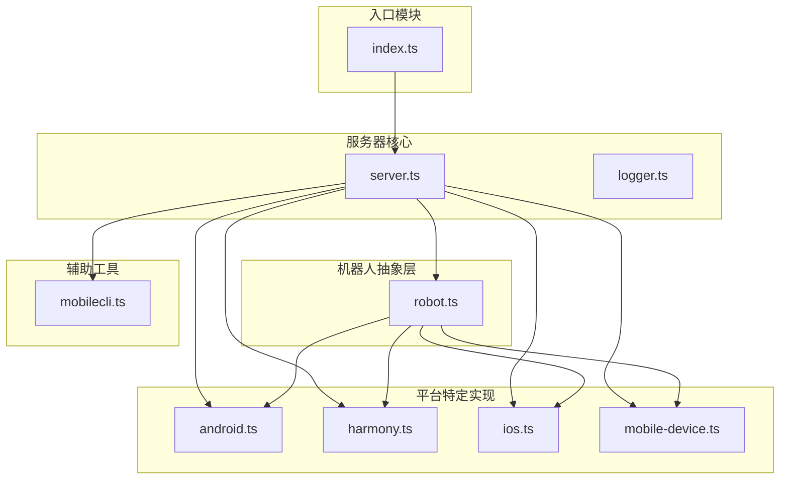
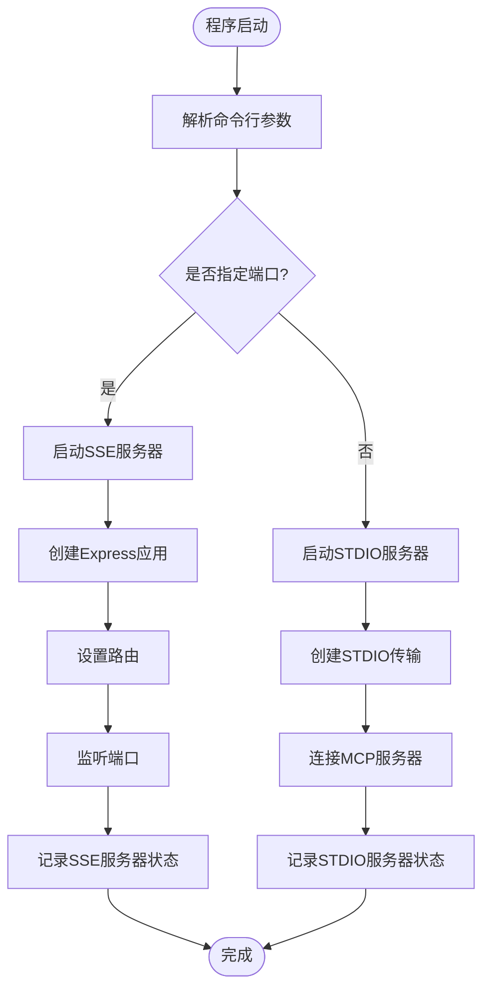
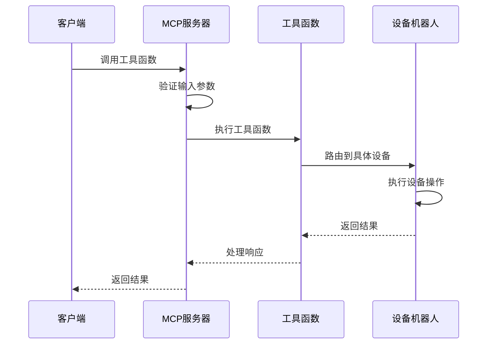
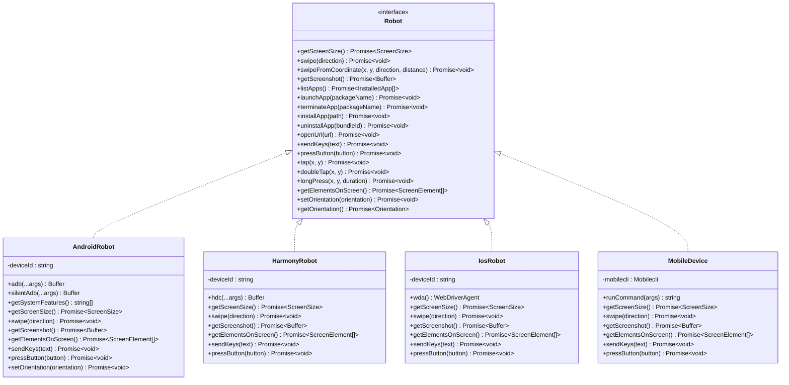
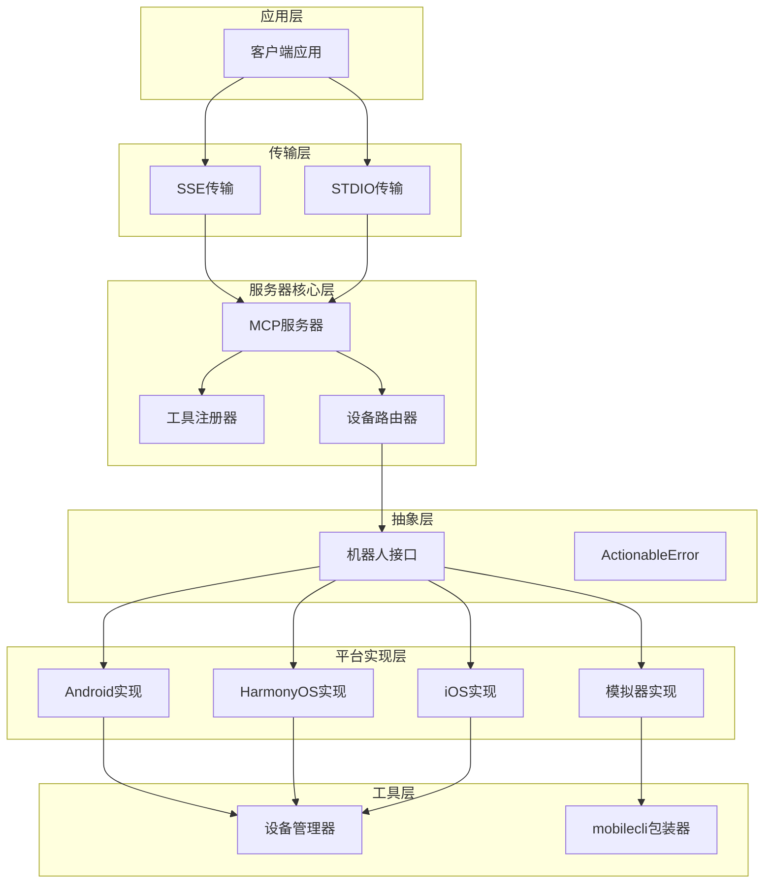
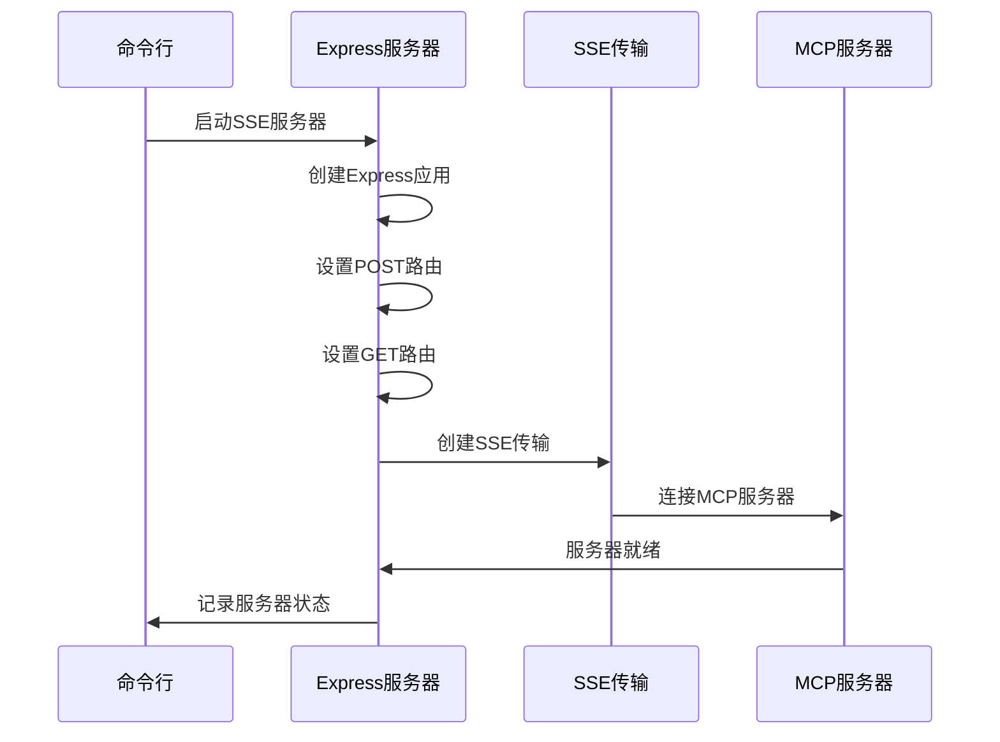
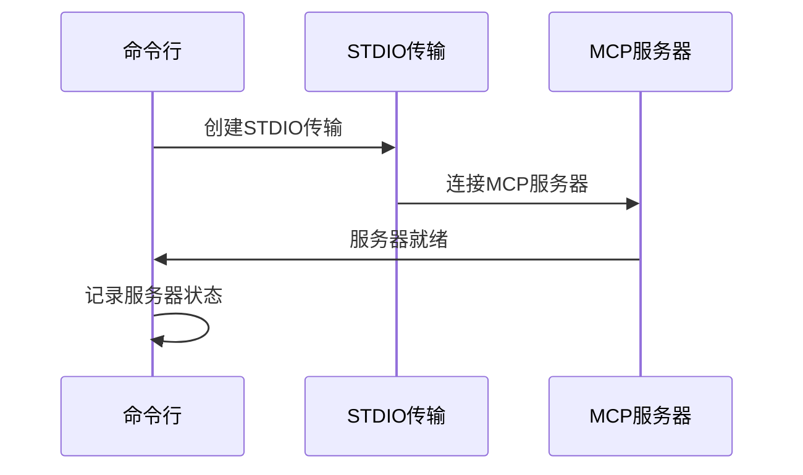
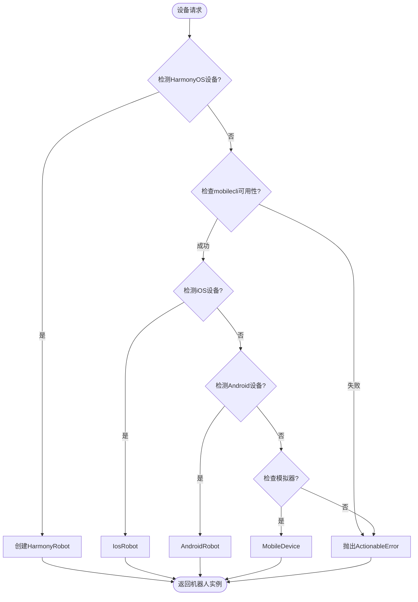
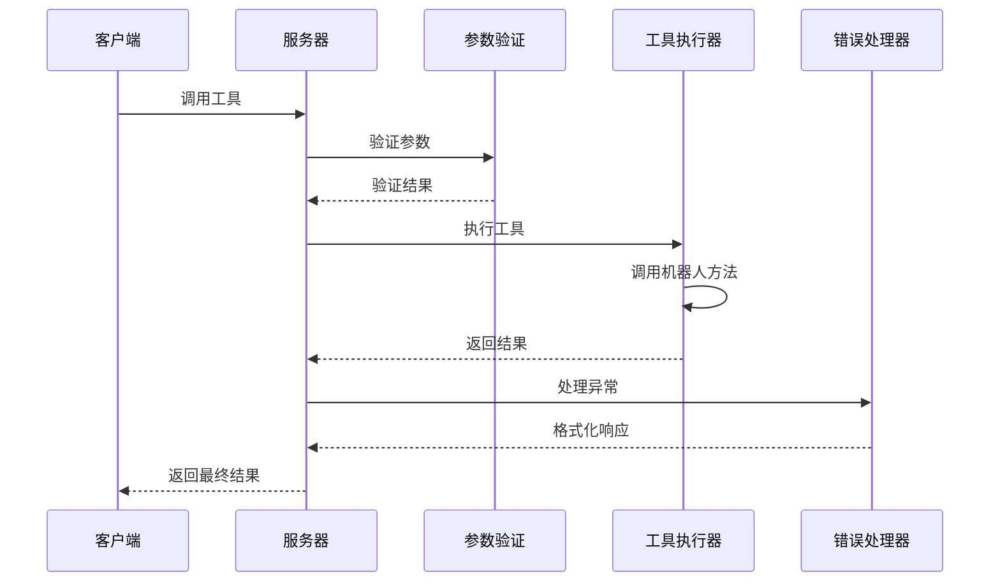
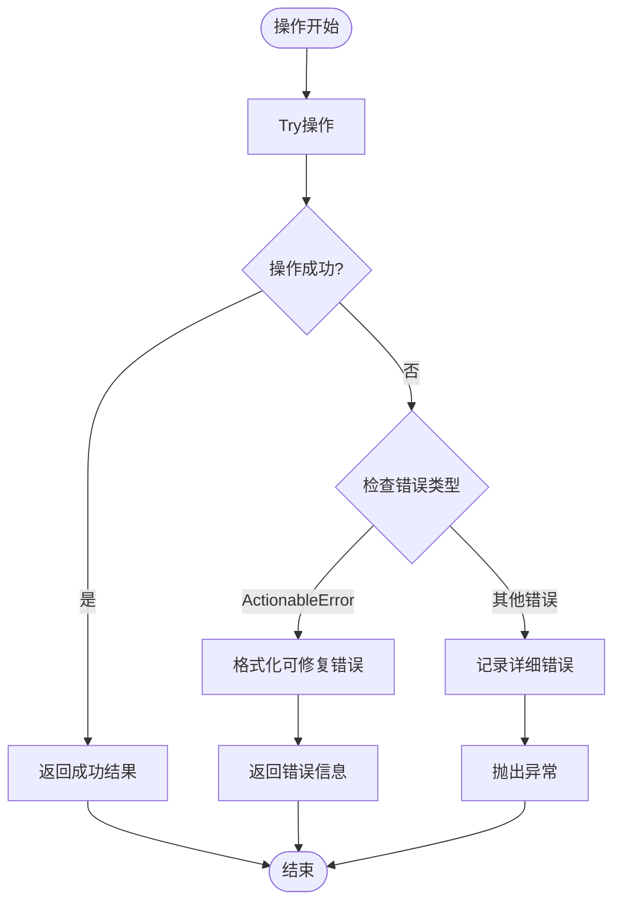

# 核心模块架构

<cite>
**本文档引用的文件**
- [index.ts](file://src/index.ts)
- [server.ts](file://src/server.ts)
- [robot.ts](file://src/robot.ts)
- [android.ts](file://src/android.ts)
- [harmony.ts](file://src/harmony.ts)
- [ios.ts](file://src/ios.ts)
- [mobile-device.ts](file://src/mobile-device.ts)
- [mobilecli.ts](file://src/mobilecli.ts)
- [logger.ts](file://src/logger.ts)
- [package.json](file://package.json)
</cite>

## 目录
1. [简介](#简介)
2. [项目结构](#项目结构)
3. [核心组件](#核心组件)
4. [架构概览](#架构概览)
5. [详细组件分析](#详细组件分析)
6. [依赖关系分析](#依赖关系分析)
7. [性能考虑](#性能考虑)
8. [故障排除指南](#故障排除指南)
9. [结论](#结论)

## 简介

这是一个支持 Android、iOS 和 HarmonyOS 的移动 MCP（Model Context Protocol）服务器实现。该项目通过统一的机器人抽象层为不同平台提供一致的设备操作接口，同时支持多种传输协议（STDIO 和 SSE）。

该系统采用模块化设计原则，将设备特定功能与通用逻辑分离，实现了高度的可扩展性和维护性。

## 项目结构

项目采用清晰的模块化组织结构，主要包含以下核心模块：



**图表来源**
- [index.ts:1-67](file://src/index.ts#L1-L67)
- [server.ts:1-708](file://src/server.ts#L1-L708)
- [robot.ts:1-148](file://src/robot.ts#L1-L148)

**章节来源**
- [package.json:1-74](file://package.json#L1-L74)

## 核心组件

### 入口模块（index.ts）

入口模块负责处理命令行参数和传输协议选择，是整个系统的启动点。

**主要功能：**
- 命令行参数解析（版本、端口、STDIO模式）
- 传输协议选择（SSE或STDIO）
- Express服务器配置（用于SSE模式）
- 主进程错误处理

**传输协议选择流程：**



**图表来源**
- [index.ts:50-66](file://src/index.ts#L50-L66)

### 服务器核心（server.ts）

服务器核心模块是整个系统的核心，负责工具注册、设备路由管理和错误处理。

**主要职责：**
- 创建和配置MCP服务器实例
- 注册所有可用的工具函数
- 设备类型检测和路由分发
- 统一的错误处理和日志记录
- 性能监控和遥测数据收集

**工具注册机制：**



**图表来源**
- [server.ts:62-95](file://src/server.ts#L62-L95)

### 机器人抽象层（robot.ts）

机器人抽象层定义了统一的设备操作接口，为所有平台提供一致的操作规范。

**核心接口设计：**



**图表来源**
- [robot.ts:48-147](file://src/robot.ts#L48-L147)
- [android.ts:74-504](file://src/android.ts#L74-L504)
- [harmony.ts:43-416](file://src/harmony.ts#L43-L416)
- [ios.ts:42-232](file://src/ios.ts#L42-L232)
- [mobile-device.ts:62-216](file://src/mobile-device.ts#L62-L216)

**章节来源**
- [robot.ts:1-148](file://src/robot.ts#L1-L148)

## 架构概览

系统采用分层架构设计，实现了平台无关的抽象层和具体的平台实现：



**图表来源**
- [server.ts:35-707](file://src/server.ts#L35-L707)
- [index.ts:9-48](file://src/index.ts#L9-L48)

## 详细组件分析

### 入口模块详细分析

入口模块通过命令行参数控制服务器启动方式，支持两种传输协议：

**SSE服务器启动流程：**



**图表来源**
- [index.ts:9-33](file://src/index.ts#L9-L33)

**STDIO服务器启动流程：**



**图表来源**
- [index.ts:35-48](file://src/index.ts#L35-L48)

**章节来源**
- [index.ts:1-67](file://src/index.ts#L1-L67)

### 服务器核心详细分析

服务器核心模块实现了完整的MCP服务器功能，包括工具注册、设备管理和错误处理：

**设备路由机制：**



**图表来源**
- [server.ts:149-197](file://src/server.ts#L149-L197)

**工具注册和执行流程：**



**图表来源**
- [server.ts:62-95](file://src/server.ts#L62-L95)

**章节来源**
- [server.ts:1-708](file://src/server.ts#L1-L708)

### 机器人抽象层详细分析

机器人抽象层提供了统一的设备操作接口，确保不同平台的一致性：

**数据模型设计：**

```mermaid
erDiagram
ScreenSize {
number width
number height
number scale
}
ScreenElementRect {
number x
number y
number width
number height
}
ScreenElement {
string type
string text
string label
string name
string value
string hint
string identifier
ScreenElementRect rect
boolean focused
}
InstalledApp {
string packageName
string appName
}
Robot {
<<interface>>
}
AndroidRobot {
string deviceId
}
HarmonyRobot {
string deviceId
}
IosRobot {
string deviceId
}
MobileDevice {
string deviceId
}
Robot <|-- AndroidRobot
Robot <|-- HarmonyRobot
Robot <|-- IosRobot
Robot <|-- MobileDevice
```

**图表来源**
- [robot.ts:1-47](file://src/robot.ts#L1-L47)
- [robot.ts:48-147](file://src/robot.ts#L48-L147)

**错误处理机制：**



**图表来源**
- [server.ts:79-94](file://src/server.ts#L79-L94)

**章节来源**
- [robot.ts:1-148](file://src/robot.ts#L1-L148)

## 依赖关系分析

系统采用清晰的依赖层次结构，实现了良好的模块解耦：

```mermaid
graph TB
subgraph "外部依赖"
A[@modelcontextprotocol/sdk]
B[commander]
C[express]
D[zod]
E[fast-xml-parser]
end
subgraph "内部模块"
F[index.ts]
G[server.ts]
H[robot.ts]
I[android.ts]
J[harmony.ts]
K[ios.ts]
L[mobile-device.ts]
M[mobilecli.ts]
N[logger.ts]
end
subgraph "可选依赖"
O[@mobilenext/mobilecli]
end
F --> G
G --> H
G --> I
G --> J
G --> K
G --> L
G --> M
G --> N
H --> I
H --> J
H --> K
H --> L
I --> A
J --> A
K --> A
L --> M
M --> O
F --> B
F --> C
G --> D
I --> E
```

**图表来源**
- [package.json:29-39](file://package.json#L29-L39)
- [index.ts:2-7](file://src/index.ts#L2-L7)
- [server.ts:1-16](file://src/server.ts#L1-L16)

**依赖管理特点：**
- **强制依赖**：MCP SDK、命令行解析、Express服务器等核心功能
- **可选依赖**：mobilecli工具，用于增强设备检测能力
- **平台特定依赖**：各平台特有的工具和库

**章节来源**
- [package.json:1-74](file://package.json#L1-L74)

## 性能考虑

系统在多个层面进行了性能优化：

### 1. 异步操作优化
- 所有设备操作都使用Promise异步处理
- 并发操作通过Promise.all进行优化
- 超时机制防止长时间阻塞

### 2. 缓存策略
- 设备列表缓存在内存中
- 屏幕截图进行尺寸调整以减少传输量
- 日志输出支持文件写入避免控制台阻塞

### 3. 资源管理
- 子进程执行使用超时限制
- 文件句柄自动清理
- 内存使用监控

### 4. 网络优化
- SSE传输支持长连接
- 图像压缩减少带宽占用
- 错误重试机制

## 故障排除指南

### 常见问题及解决方案

**1. 设备检测失败**
- 检查平台工具是否正确安装
- 验证设备连接状态
- 确认权限设置

**2. 传输协议问题**
- SSE模式需要正确的端口配置
- STDIO模式适用于大多数IDE集成
- 检查防火墙设置

**3. 平台特定问题**
- Android：确保ADB环境变量正确
- iOS：验证WebDriverAgent服务运行
- HarmonyOS：确认hdc工具可用

**4. 错误处理机制**
- ActionableError：用户可修复的错误
- 系统异常：需要开发者介入的问题
- 日志记录：详细的调试信息

**章节来源**
- [server.ts:138-147](file://src/server.ts#L138-L147)
- [logger.ts:1-22](file://src/logger.ts#L1-L22)

## 结论

该移动MCP项目展现了优秀的软件架构设计：

### 设计优势
1. **模块化设计**：清晰的职责分离和接口抽象
2. **平台无关性**：统一的机器人接口支持多平台
3. **可扩展性**：易于添加新的设备类型和工具功能
4. **健壮性**：完善的错误处理和资源管理

### 技术亮点
- **接口分离**：抽象层与实现层完全解耦
- **传输协议灵活**：支持多种连接方式
- **错误处理完善**：区分可修复和不可修复错误
- **性能优化**：异步操作和资源管理

### 最佳实践
- 遵循单一职责原则
- 使用接口抽象替代具体实现
- 实现完整的错误处理机制
- 提供清晰的配置和日志系统

该架构为移动设备自动化测试和开发提供了坚实的基础，具有良好的可维护性和扩展性。