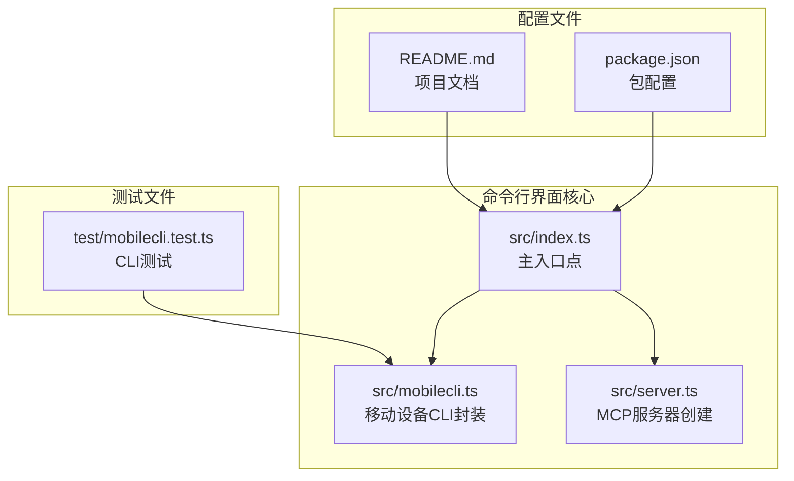
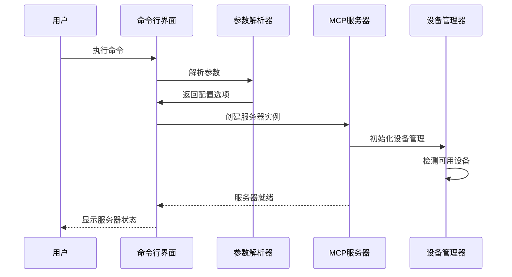
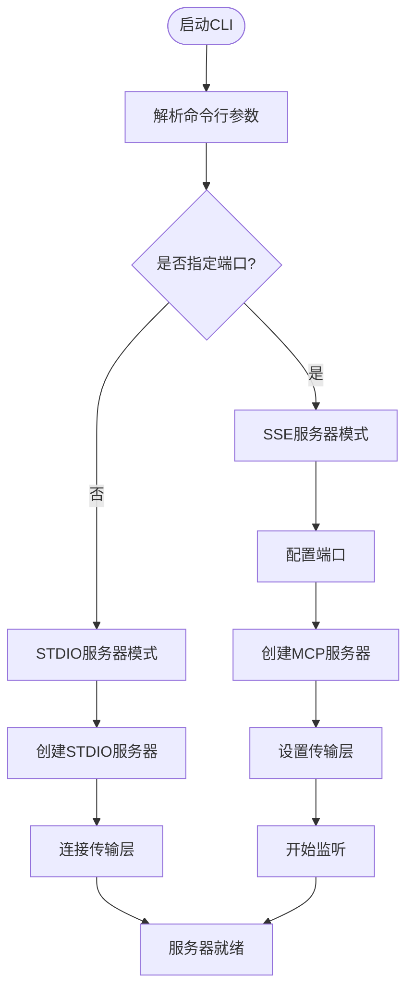
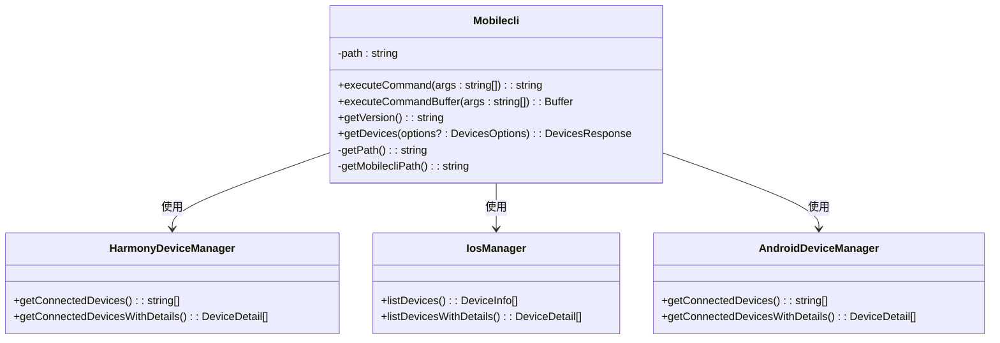
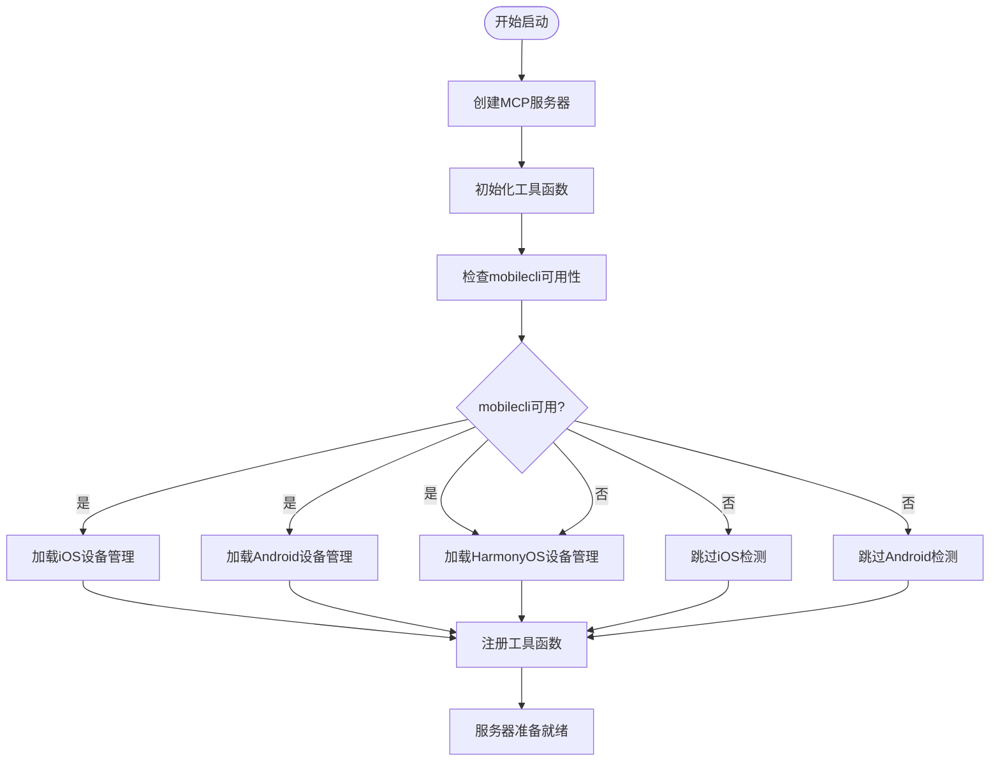

# 命令行界面

<cite>
**本文档引用的文件**
- [src/index.ts](file://src/index.ts)
- [src/mobilecli.ts](file://src/mobilecli.ts)
- [src/server.ts](file://src/server.ts)
- [package.json](file://package.json)
- [README.md](file://README.md)
- [test/mobilecli.test.ts](file://test/mobilecli.test.ts)
- [src/iphone-simulator.ts](file://src/iphone-simulator.ts)
</cite>

## 目录
1. [简介](#简介)
2. [项目结构](#项目结构)
3. [核心组件](#核心组件)
4. [架构概览](#架构概览)
5. [详细组件分析](#详细组件分析)
6. [依赖关系分析](#依赖关系分析)
7. [性能考虑](#性能考虑)
8. [故障排除指南](#故障排除指南)
9. [结论](#结论)

## 简介

命令行界面是 Mobile MCP HarmonyOS 项目的核心入口点，提供了灵活的启动模式和丰富的配置选项。该项目是一个基于 Model Context Protocol (MCP) 的服务器，为 iOS、Android 和 HarmonyOS 设备提供统一的移动自动化能力。

该命令行界面支持两种主要运行模式：
- **STDIO 模式**：默认模式，通过标准输入输出流与 MCP 客户端通信
- **SSE 模式**：通过 HTTP SSE (Server-Sent Events) 协议提供网络接口

## 项目结构

项目的命令行界面主要由以下几个核心文件组成：



**图表来源**
- [src/index.ts:1-71](file://src/index.ts#L1-L71)
- [src/mobilecli.ts:1-136](file://src/mobilecli.ts#L1-L136)
- [src/server.ts:1-758](file://src/server.ts#L1-L758)

**章节来源**
- [src/index.ts:1-71](file://src/index.ts#L1-L71)
- [package.json:1-74](file://package.json#L1-L74)

## 核心组件

### 主入口点 (src/index.ts)

主入口点负责处理命令行参数解析和服务器启动逻辑。它使用 Commander.js 库来处理 CLI 参数，并根据用户选择启动相应的服务器模式。

**主要功能特性：**
- 版本信息显示
- 端口配置参数
- STDIO 模式启动
- SSE 模式启动
- ZhipuAI API 密钥配置

**章节来源**
- [src/index.ts:50-71](file://src/index.ts#L50-L71)

### 移动设备CLI封装 (src/mobilecli.ts)

Mobilecli 类提供了对外部 mobilecli 工具的封装，用于检测和管理移动设备。它支持多种平台和架构的二进制文件自动定位。

**核心功能：**
- 自动检测平台和架构
- 动态定位 mobilecli 二进制文件
- 设备列表查询
- 版本检查
- 命令执行

**章节来源**
- [src/mobilecli.ts:27-136](file://src/mobilecli.ts#L27-L136)

### MCP服务器创建 (src/server.ts)

服务器创建模块负责初始化和配置 MCP 服务器实例，注册所有可用的工具函数。

**主要职责：**
- 创建 MCP 服务器实例
- 注册设备管理工具
- 注册应用管理工具
- 注册屏幕交互工具
- 注册输入与导航工具

**章节来源**
- [src/server.ts:40-758](file://src/server.ts#L40-L758)

## 架构概览

命令行界面采用分层架构设计，清晰分离了 CLI 解析、服务器启动和设备管理功能：



**图表来源**
- [src/index.ts:50-68](file://src/index.ts#L50-L68)
- [src/server.ts:140-202](file://src/server.ts#L140-L202)

## 详细组件分析

### 参数解析系统

命令行界面使用 Commander.js 库实现参数解析，支持以下选项：



**图表来源**
- [src/index.ts:50-68](file://src/index.ts#L50-L68)

**章节来源**
- [src/index.ts:50-68](file://src/index.ts#L50-L68)

### 设备检测机制

设备检测系统采用多层架构，支持不同类型的设备：



**图表来源**
- [src/mobilecli.ts:27-136](file://src/mobilecli.ts#L27-L136)
- [src/server.ts:154-202](file://src/server.ts#L154-L202)

**章节来源**
- [src/mobilecli.ts:27-136](file://src/mobilecli.ts#L27-L136)
- [src/server.ts:154-202](file://src/server.ts#L154-L202)

### 服务器启动流程

服务器启动流程包含多个阶段的初始化和验证：



**图表来源**
- [src/server.ts:140-300](file://src/server.ts#L140-L300)

**章节来源**
- [src/server.ts:140-300](file://src/server.ts#L140-L300)

## 依赖关系分析

命令行界面的依赖关系相对简洁，主要依赖于几个核心库：

```mermaid
graph TB
subgraph "核心依赖"
A[@modelcontextprotocol/sdk<br/>MCP协议实现]
B[commander<br/>命令行参数解析]
C[express<br/>HTTP服务器]
end
subgraph "可选依赖"
D[@mobilenext/mobilecli<br/>移动设备CLI]
end
subgraph "内部模块"
E[src/index.ts<br/>主入口]
F[src/server.ts<br/>服务器创建]
G[src/mobilecli.ts<br/>设备管理]
end
A --> E
B --> E
C --> E
D --> G
E --> F
E --> G
```

**图表来源**
- [package.json:29-39](file://package.json#L29-L39)
- [src/index.ts:2-7](file://src/index.ts#L2-L7)

**章节来源**
- [package.json:29-39](file://package.json#L29-L39)

## 性能考虑

命令行界面在设计时考虑了多个性能方面：

### 内存管理
- 使用缓冲区限制避免内存溢出
- 实现超时机制防止长时间阻塞
- 合理的错误处理避免资源泄漏

### 并发处理
- 异步操作避免阻塞主线程
- Promise 链式调用优化异步流程
- 并行设备检测提升响应速度

### 资源优化
- 条件加载可选功能
- 智能路径查找减少磁盘访问
- 缓存机制避免重复计算

## 故障排除指南

### 常见问题及解决方案

**问题1：mobilecli 未找到**
- 检查 mobilecli 是否正确安装
- 验证环境变量配置
- 确认二进制文件权限

**问题2：端口占用**
- 更换其他端口号
- 检查端口占用情况
- 使用管理员权限运行

**问题3：设备检测失败**
- 确认设备连接状态
- 检查平台特定工具
- 验证权限设置

**章节来源**
- [src/server.ts:143-152](file://src/server.ts#L143-L152)
- [src/mobilecli.ts:94-105](file://src/mobilecli.ts#L94-L105)

### 调试技巧

1. **启用详细日志**：使用调试模式查看详细信息
2. **版本检查**：确认各组件版本兼容性
3. **网络诊断**：检查网络连接和防火墙设置
4. **权限验证**：确保有足够的系统权限

## 结论

命令行界面作为 Mobile MCP HarmonyOS 项目的核心入口，提供了灵活、可靠的启动方式和丰富的配置选项。其设计充分考虑了不同平台的需求，支持多种运行模式和设备类型。

通过清晰的架构分离和完善的错误处理机制，该命令行界面能够稳定地为 MCP 客户端提供移动设备自动化服务。无论是开发测试还是生产部署，都能提供一致的用户体验和可靠的服务质量。