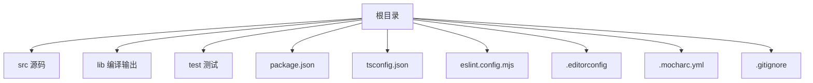
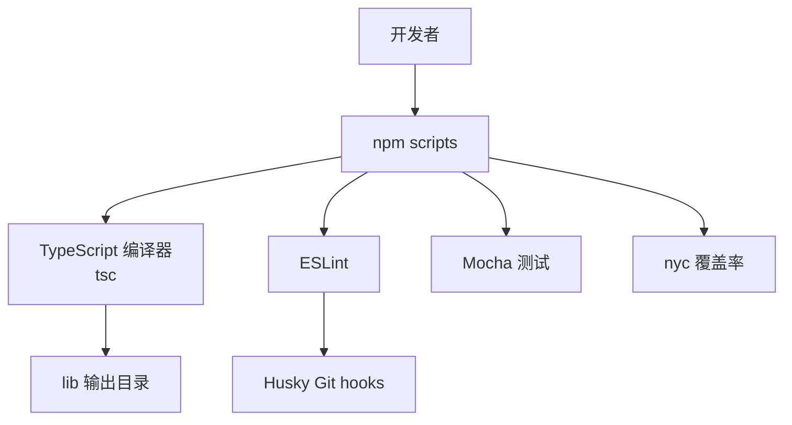
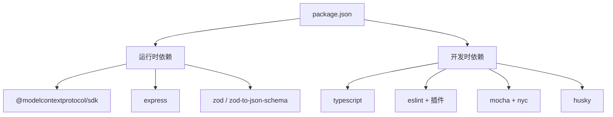

# 开发环境搭建

<cite>
**本文引用的文件**
- [package.json](file://package.json)
- [tsconfig.json](file://tsconfig.json)
- [eslint.config.mjs](file://eslint.config.mjs)
- [.editorconfig](file://.editorconfig)
- [.mocharc.yml](file://.mocharc.yml)
- [.gitignore](file://.gitignore)
- [README.md](file://README.md)
- [DEEPWIKI.md](file://DEEPWIKI.md)
</cite>

## 目录
1. [简介](#简介)
2. [项目结构](#项目结构)
3. [核心组件](#核心组件)
4. [架构总览](#架构总览)
5. [详细组件分析](#详细组件分析)
6. [依赖关系分析](#依赖关系分析)
7. [性能考虑](#性能考虑)
8. [故障排查指南](#故障排查指南)
9. [结论](#结论)
10. [附录](#附录)

## 简介
本指南面向希望在本地搭建并开发本项目的工程师，涵盖 Node.js 版本要求、TypeScript 配置、依赖安装、开发工具链（ESLint、Husky、Git hooks、TypeScript 编译）以及完整的本地开发流程。同时提供常见问题排查方法与最佳实践建议。

## 项目结构
该项目采用“源码在 src、编译输出在 lib”的标准 Node.js + TypeScript 结构，并通过 npm scripts 提供构建、监听、测试、代码检查等开发命令。根目录包含核心配置文件与测试目录，便于快速定位与理解项目技术栈与工具链。

图表来源
- [package.json](file://package.json)
- [tsconfig.json](file://tsconfig.json)
- [eslint.config.mjs](file://eslint.config.mjs)
- [.editorconfig](file://.editorconfig)
- [.mocharc.yml](file://.mocharc.yml)
- [.gitignore](file://.gitignore)

章节来源
- [package.json](file://package.json)
- [tsconfig.json](file://tsconfig.json)
- [eslint.config.mjs](file://eslint.config.mjs)
- [.editorconfig](file://.editorconfig)
- [.mocharc.yml](file://.mocharc.yml)
- [.gitignore](file://.gitignore)

## 核心组件
- Node.js 运行时：要求版本 >= 18，由 engines 字段约束。
- TypeScript 编译：使用 tsc，目标 ESNext，输出 CommonJS，输出目录 lib。
- 代码规范：ESLint + TypeScript Parser + Stylistic 插件，配合 Husky 在提交前执行检查。
- 测试框架：Mocha + nyc（覆盖率），测试超时配置为 60 秒。
- 构建脚本：提供 build、watch、lint、fixlint、test、clean、prepare 等常用命令。

章节来源
- [package.json](file://package.json)
- [tsconfig.json](file://tsconfig.json)
- [eslint.config.mjs](file://eslint.config.mjs)
- [.mocharc.yml](file://.mocharc.yml)

## 架构总览
开发工具链围绕 npm scripts 组织，TypeScript 编译器负责将 src 下的 TS 源码编译为 CommonJS，ESLint 负责静态检查，Husky/Git hooks 在提交前拦截潜在问题，Mocha/nyc 提供单元测试与覆盖率统计。

图表来源
- [package.json](file://package.json)
- [tsconfig.json](file://tsconfig.json)
- [eslint.config.mjs](file://eslint.config.mjs)
- [.mocharc.yml](file://.mocharc.yml)

## 详细组件分析

### Node.js 版本与运行时要求
- 引擎要求：Node.js >= 18，由 engines 字段声明。
- 建议使用版本管理器（如 nvm）安装并切换到满足要求的 Node 版本，确保后续依赖安装与运行稳定。

章节来源
- [package.json](file://package.json)

### TypeScript 配置
- 目标与模块：ESNext 目标，CommonJS 模块，严格模式开启。
- 输出目录：lib，便于发布与执行。
- 依赖：TypeScript 5.8.2，与 tsc 命令配合使用。
- 建议：保持与项目脚本一致的编译选项，避免手动覆盖 outDir 等关键字段。

章节来源
- [tsconfig.json](file://tsconfig.json)
- [package.json](file://package.json)

### ESLint 代码规范
- 使用插件：@typescript-eslint/eslint-plugin、@stylistic/eslint-plugin、eslint-plugin-import 等。
- 规则范围：覆盖语法偏好、反模式、ES2015 特性、空行与缩进、文件末尾换行等。
- 执行方式：通过 npm run lint 或 npm run fixlint 自动修复部分规则。
- Editor 集成：结合 .editorconfig 统一缩进风格（Tab/8 宽度）。

章节来源
- [eslint.config.mjs](file://eslint.config.mjs)
- [.editorconfig](file://.editorconfig)

### Git Hooks 与 Husky
- 初始化：npm run prepare 会安装 Husky 钩子（通常在 .husky/_/ 下生成可执行文件）。
- 建议：在本地开发前先执行 prepare，确保 pre-commit 钩子生效，避免提交不合规代码。

章节来源
- [package.json](file://package.json)

### 测试与覆盖率
- 测试框架：Mocha，测试超时 60 秒。
- 覆盖率：nyc 采集覆盖率数据。
- 命令：npm test 执行测试并生成覆盖率报告。

章节来源
- [.mocharc.yml](file://.mocharc.yml)
- [package.json](file://package.json)

### 构建与开发命令
- 构建：npm run build，编译 TS 并赋予入口文件执行权限。
- 监听：npm run watch，持续编译。
- 代码检查：npm run lint（仅检查）、npm run fixlint（尝试自动修复）。
- 测试：npm test。
- 清理：npm run clean 删除 lib 目录。
- 准备：npm run prepare 安装 Husky。

章节来源
- [package.json](file://package.json)

## 依赖关系分析
项目依赖分为两类：
- 运行时依赖：MCP SDK、Express、Zod 等，用于功能实现。
- 开发时依赖：TypeScript、ESLint、Mocha、nyc、Husky 等，用于开发与质量保障。

图表来源
- [package.json](file://package.json)

章节来源
- [package.json](file://package.json)

## 性能考虑
- 编译性能：合理使用 watch 模式进行增量编译，避免频繁全量构建。
- 测试性能：调整 .mocharc.yml 中的 timeout 以适应长耗时场景，但避免过度放宽导致问题掩盖。
- 规范检查：在 CI 中启用 fixlint，减少本地反复修复带来的等待时间。

## 故障排查指南

### Node.js 版本不满足要求
- 现象：安装或运行时报错，提示 Node 版本过低。
- 处理：升级 Node.js 至 >= 18，使用版本管理器切换后重新安装依赖。

章节来源
- [package.json](file://package.json)

### 依赖安装失败（网络/权限问题）
- 现象：npm install 报错，常见于网络受限或权限不足。
- 处理：更换镜像源、使用代理、以管理员身份运行或使用缓存重试。

### TypeScript 编译错误
- 现象：npm run build 报错，提示类型或语法问题。
- 处理：根据错误定位到具体文件与行号，修正类型或语法；必要时临时放宽严格模式规则以定位问题。

章节来源
- [tsconfig.json](file://tsconfig.json)

### ESLint 规则冲突或报错
- 现象：npm run lint 报错，或 IDE 中出现大量警告。
- 处理：优先使用 npm run fixlint 自动修复；对无法自动修复的规则，按项目约定调整代码风格。

章节来源
- [eslint.config.mjs](file://eslint.config.mjs)

### Git 提交被 Husky 拦截
- 现象：git commit 失败，提示 ESLint 或其他检查未通过。
- 处理：根据 Husky 输出修复问题后再提交，或在本地临时禁用钩子（不推荐长期使用）。

章节来源
- [package.json](file://package.json)

### 测试失败或覆盖率异常
- 现象：npm test 失败或覆盖率过低。
- 处理：检查测试文件与断言逻辑，确保测试用例覆盖关键路径；必要时调整 .mocharc.yml 的超时与过滤策略。

章节来源
- [.mocharc.yml](file://.mocharc.yml)
- [package.json](file://package.json)

### 构建产物缺失或权限问题
- 现象：构建成功但入口文件无执行权限，或 lib 目录为空。
- 处理：确认 npm run build 成功完成；若缺少执行权限，手动赋予或检查脚本是否正确执行。

章节来源
- [package.json](file://package.json)

## 结论
本项目提供了完善的开发工具链与清晰的构建脚本，遵循 Node.js >= 18、TypeScript 5.x、ESLint + Husky 的现代前端工程实践。按照本文档完成环境准备与依赖安装后，即可通过 npm run watch 进行高效开发，借助 npm run lint/test 保证代码质量与稳定性。

## 附录

### 本地开发完整设置流程
- 步骤 1：安装 Node.js（>= 18）
- 步骤 2：克隆仓库并进入目录
- 步骤 3：安装项目依赖（npm install）
- 步骤 4：首次构建（npm run build）
- 步骤 5：准备 Git hooks（npm run prepare）
- 步骤 6：开始开发（npm run watch）

章节来源
- [README.md](file://README.md)
- [package.json](file://package.json)

### 常用命令速查
- 构建：npm run build
- 监听：npm run watch
- 代码检查：npm run lint / npm run fixlint
- 测试：npm test
- 清理：npm run clean
- 准备：npm run prepare

章节来源
- [package.json](file://package.json)