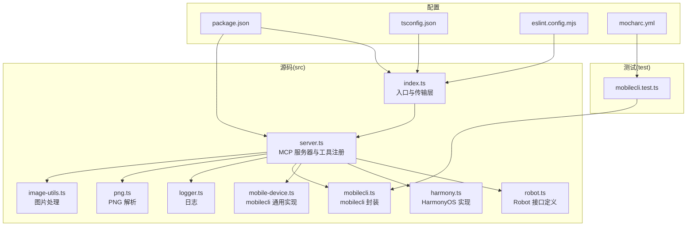
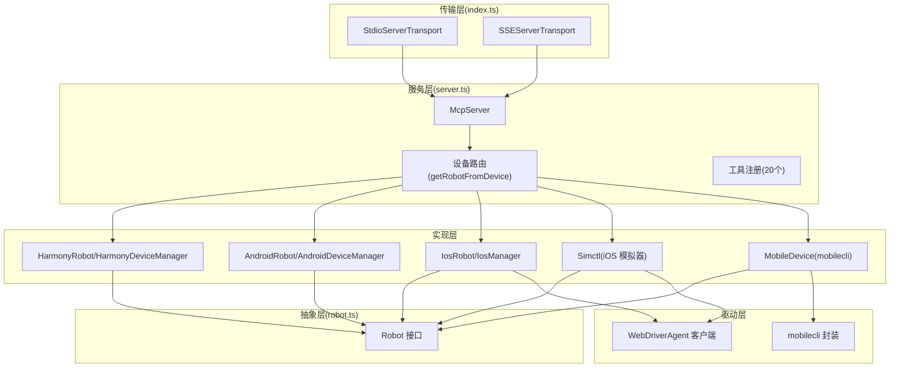
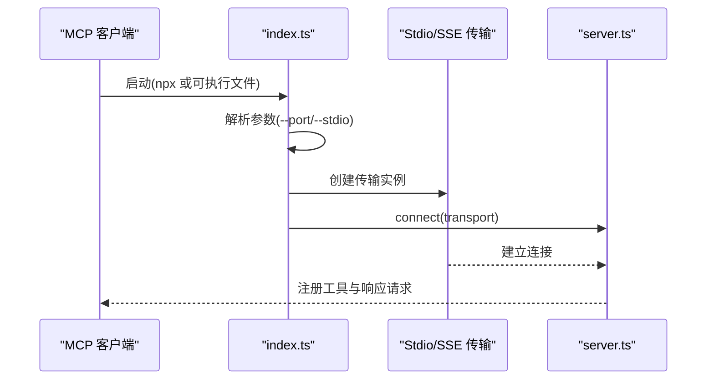
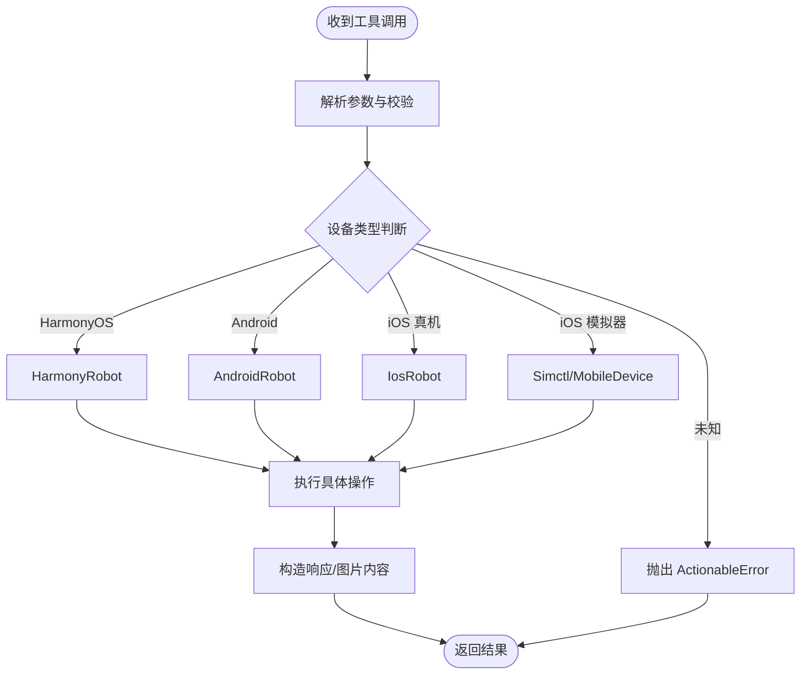
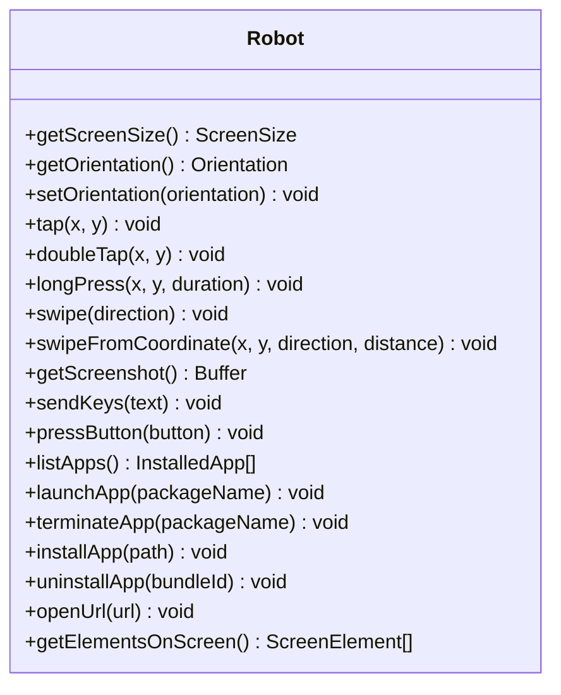
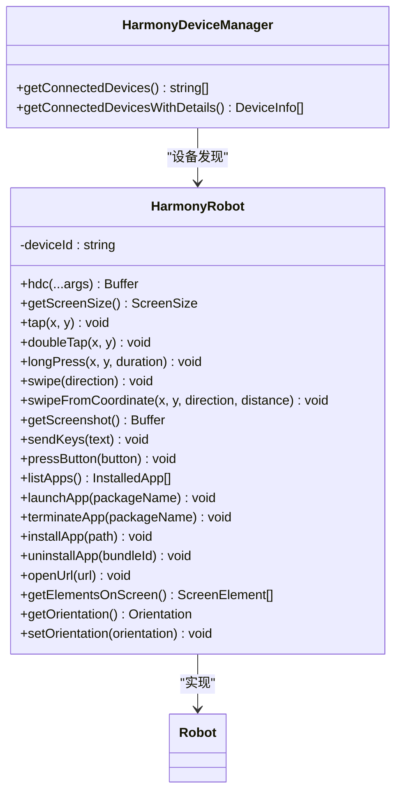
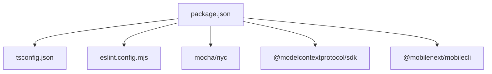

# 开发者指南

<cite>
**本文档引用的文件**
- [README.md](file://README.md)
- [DEEPWIKI.md](file://DEEPWIKI.md)
- [package.json](file://package.json)
- [tsconfig.json](file://tsconfig.json)
- [eslint.config.mjs](file://eslint.config.mjs)
- [.mocharc.yml](file://.mocharc.yml)
- [src/index.ts](file://src/index.ts)
- [src/server.ts](file://src/server.ts)
- [src/robot.ts](file://src/robot.ts)
- [src/harmony.ts](file://src/harmony.ts)
- [src/mobile-device.ts](file://src/mobile-device.ts)
- [src/mobilecli.ts](file://src/mobilecli.ts)
- [src/logger.ts](file://src/logger.ts)
- [src/png.ts](file://src/png.ts)
- [src/image-utils.ts](file://src/image-utils.ts)
- [test/mobilecli.test.ts](file://test/mobilecli.test.ts)
</cite>

## 目录
1. [简介](#简介)
2. [项目结构](#项目结构)
3. [核心组件](#核心组件)
4. [架构总览](#架构总览)
5. [详细组件分析](#详细组件分析)
6. [依赖关系分析](#依赖关系分析)
7. [性能考虑](#性能考虑)
8. [故障排查指南](#故障排查指南)
9. [结论](#结论)
10. [附录](#附录)

## 简介
本项目是在 [@mobilenext/mobile-mcp](https://github.com/mobile-next/mobile-mcp) 基础上二次开发的 Model Context Protocol (MCP) 移动端自动化服务器，新增对 HarmonyOS（鸿蒙）设备的原生自动化支持。项目提供统一的 MCP 工具集，覆盖 iOS、Android 与 HarmonyOS 三大平台，支持设备管理、应用管理、屏幕交互、输入导航等能力，并通过结构化数据与截图兜底相结合的方式，提升自动化稳定性与确定性。

## 项目结构
项目采用分层清晰的 TypeScript 结构，主要目录与职责如下：
- src/：源码目录，包含入口、MCP 服务器、Robot 接口与各平台实现、工具与配置
- test/：单元测试与集成测试
- lib/：编译输出目录
- 根目录配置：package.json、tsconfig.json、eslint.config.mjs、.mocharc.yml 等

图表来源
- [src/index.ts:1-67](file://src/index.ts#L1-L67)
- [src/server.ts:1-708](file://src/server.ts#L1-L708)
- [src/robot.ts:1-148](file://src/robot.ts#L1-L148)
- [src/harmony.ts:1-462](file://src/harmony.ts#L1-L462)
- [src/mobile-device.ts:1-217](file://src/mobile-device.ts#L1-L217)
- [src/mobilecli.ts:1-136](file://src/mobilecli.ts#L1-L136)
- [src/logger.ts:1-22](file://src/logger.ts#L1-L22)
- [src/png.ts:1-21](file://src/png.ts#L1-L21)
- [src/image-utils.ts:1-165](file://src/image-utils.ts#L1-L165)
- [test/mobilecli.test.ts:1-120](file://test/mobilecli.test.ts#L1-L120)
- [package.json:1-74](file://package.json#L1-L74)
- [tsconfig.json:1-14](file://tsconfig.json#L1-L14)
- [eslint.config.mjs:1-162](file://eslint.config.mjs#L1-L162)
- [.mocharc.yml:1-2](file://.mocharc.yml#L1-L2)

章节来源
- [DEEPWIKI.md:32-54](file://DEEPWIKI.md#L32-L54)
- [package.json:1-74](file://package.json#L1-L74)

## 核心组件
- 传输层：支持 Stdio（默认）与 SSE 两种 MCP 传输模式，负责与 MCP 客户端建立连接与消息传递
- 服务层：MCP 服务器核心，注册 20 个工具、设备路由与遥测上报
- 抽象层：Robot 接口定义统一的设备操作抽象
- 实现层：各平台具体实现（HarmonyOS、Android、iOS 真机/模拟器、mobilecli 通用）
- 工具层：图片处理、PNG 解析、日志等通用工具

章节来源
- [src/index.ts:1-67](file://src/index.ts#L1-L67)
- [src/server.ts:1-708](file://src/server.ts#L1-L708)
- [src/robot.ts:1-148](file://src/robot.ts#L1-L148)
- [src/harmony.ts:1-462](file://src/harmony.ts#L1-L462)
- [src/mobile-device.ts:1-217](file://src/mobile-device.ts#L1-L217)
- [src/mobilecli.ts:1-136](file://src/mobilecli.ts#L1-L136)
- [src/logger.ts:1-22](file://src/logger.ts#L1-L22)
- [src/png.ts:1-21](file://src/png.ts#L1-L21)
- [src/image-utils.ts:1-165](file://src/image-utils.ts#L1-L165)

## 架构总览
整体架构采用三层设计：传输层、服务层、抽象层，配合实现层与驱动层，形成统一的 MCP 工具体系。

图表来源
- [src/index.ts:1-67](file://src/index.ts#L1-L67)
- [src/server.ts:1-708](file://src/server.ts#L1-L708)
- [src/robot.ts:1-148](file://src/robot.ts#L1-L148)
- [src/harmony.ts:1-462](file://src/harmony.ts#L1-L462)
- [src/mobile-device.ts:1-217](file://src/mobile-device.ts#L1-L217)
- [src/mobilecli.ts:1-136](file://src/mobilecli.ts#L1-L136)

## 详细组件分析

### 传输层：入口与传输模式
- Stdio 模式：默认启动方式，适合本地集成（如 Claude Desktop、VS Code）
- SSE 模式：启动 Express 服务器，提供 HTTP + SSE 通道，适合远程场景
- 版本与参数：支持 --port 与 --stdio 参数，版本号来自 package.json

图表来源
- [src/index.ts:1-67](file://src/index.ts#L1-L67)
- [src/server.ts:1-708](file://src/server.ts#L1-L708)

章节来源
- [src/index.ts:1-67](file://src/index.ts#L1-L67)

### 服务层：MCP 服务器与工具注册
- 创建 McpServer 实例，注册 20 个工具，涵盖设备管理、应用管理、屏幕交互、输入导航等
- 设备路由：根据设备 ID 选择对应 Robot 实现（HarmonyOS、Android、iOS 真机/模拟器）
- 错误处理：区分用户可修复的 ActionableError 与系统异常
- 遥测：通过 PostHog 上报工具调用次数、耗时与截图大小等指标

图表来源
- [src/server.ts:149-197](file://src/server.ts#L149-L197)
- [src/server.ts:200-704](file://src/server.ts#L200-L704)

章节来源
- [src/server.ts:1-708](file://src/server.ts#L1-L708)

### 抽象层：Robot 接口
- 统一抽象：设备信息、屏幕交互、截图、输入、应用管理、导航、UI 元素等
- 关键类型：ScreenSize、ScreenElement、SwipeDirection、Button、Orientation、InstalledApp 等
- 错误模型：ActionableError 用于提示用户修复

图表来源
- [src/robot.ts:48-147](file://src/robot.ts#L48-L147)

章节来源
- [src/robot.ts:1-148](file://src/robot.ts#L1-L148)

### 实现层：HarmonyOS 支持
- HarmonyRobot：实现 Robot 接口，通过 HDC、uitest、hidumper、snapshot_display 等工具完成设备控制
- HarmonyDeviceManager：设备发现与详情获取
- 关键能力：屏幕尺寸、截图、点击/双击/长按、滑动、输入、按键、应用管理、UI 元素解析、方向获取
- 注意事项：HDC 路径查找、按键映射、UI 树解析格式差异、截图格式与尺寸

图表来源
- [src/harmony.ts:43-416](file://src/harmony.ts#L43-L416)
- [src/harmony.ts:418-461](file://src/harmony.ts#L418-L461)

章节来源
- [src/harmony.ts:1-462](file://src/harmony.ts#L1-L462)

### 实现层：mobilecli 通用实现
- MobileDevice：通过 mobilecli 二进制工具封装各平台通用能力
- 命令映射：与 Robot 方法一一对应，便于扩展与维护
- 适用范围：iOS 模拟器与需要 mobilecli 的场景

章节来源
- [src/mobile-device.ts:1-217](file://src/mobile-device.ts#L1-L217)
- [src/mobilecli.ts:1-136](file://src/mobilecli.ts#L1-L136)

### 工具层：图片处理与日志
- PNG：验证 PNG 文件头与解析尺寸
- ImageUtils：基于 Sips/ImageMagick 的图片缩放与格式转换，支持 JPEG 压缩
- Logger：输出到 stderr，可选写入文件

章节来源
- [src/png.ts:1-21](file://src/png.ts#L1-L21)
- [src/image-utils.ts:1-165](file://src/image-utils.ts#L1-L165)
- [src/logger.ts:1-22](file://src/logger.ts#L1-L22)

## 依赖关系分析
- 运行时与构建：Node.js >= 18，TypeScript 编译，ESLint 规范，Mocha 测试
- MCP SDK：@modelcontextprotocol/sdk 提供传输与协议支持
- 可选依赖：@mobilenext/mobilecli（部分平台依赖）
- 开发依赖：TypeScript、ESLint 插件、Mocha、nyc 等

图表来源
- [package.json:1-74](file://package.json#L1-L74)
- [tsconfig.json:1-14](file://tsconfig.json#L1-L14)
- [eslint.config.mjs:1-162](file://eslint.config.mjs#L1-L162)

章节来源
- [package.json:1-74](file://package.json#L1-L74)

## 性能考虑
- 截图优化：优先使用 Sips（macOS）或 ImageMagick 进行缩放与 JPEG 压缩，降低传输体积
- 异常短路：设备路由与工具执行中尽早失败，减少无效调用
- 遥测采样：仅记录必要字段，避免额外开销
- I/O 优化：临时文件清理与缓冲区大小限制，防止内存泄漏

章节来源
- [src/image-utils.ts:1-165](file://src/image-utils.ts#L1-L165)
- [src/server.ts:585-673](file://src/server.ts#L585-L673)

## 故障排查指南
- 环境依赖
  - Node.js 版本需满足 >= 18
  - HarmonyOS：确保 HDC 在 PATH 或设置 HDC_SDK_PATH
  - iOS/Android：mobilecli 二进制工具（可选依赖）需正确安装与定位
- 常见问题
  - 设备未发现：检查 HDC、ADB、go-ios、mobilecli 的可用性与权限
  - 截图失败：确认截图工具链可用，检查临时目录权限
  - 工具调用报错：区分 ActionableError（提示修复）与系统异常（打印堆栈）
- 调试技巧
  - 使用 LOG_FILE 环境变量输出日志文件
  - 在本地启动 Stdio 模式进行快速验证
  - 通过测试用例验证 mobilecli 行为

章节来源
- [README.md:90-171](file://README.md#L90-L171)
- [src/logger.ts:1-22](file://src/logger.ts#L1-L22)
- [test/mobilecli.test.ts:1-120](file://test/mobilecli.test.ts#L1-L120)

## 结论
本项目通过统一的 Robot 抽象与多平台实现，为 Agent/LLM 提供一致的移动端自动化体验。HarmonyOS 的引入进一步扩大了平台覆盖面，结合结构化数据与截图兜底策略，提升了自动化稳定性。遵循本文档的开发与测试流程，可快速扩展新平台支持并保证质量。

## 附录

### 开发环境搭建
- Node.js：>= 18
- 安装依赖：npm install
- 编译：npm run build
- 监听开发：npm run watch
- 运行测试：npm test
- 代码检查：npm run lint / npm run fixlint

章节来源
- [README.md:90-171](file://README.md#L90-L171)
- [package.json:17-25](file://package.json#L17-L25)

### 代码结构与模块组织
- 源码分层：传输层、服务层、抽象层、实现层、驱动层、工具层
- 关键文件：index.ts、server.ts、robot.ts、harmony.ts、mobile-device.ts、mobilecli.ts、logger.ts、png.ts、image-utils.ts
- 测试：test/mobilecli.test.ts

章节来源
- [DEEPWIKI.md:32-54](file://DEEPWIKI.md#L32-L54)
- [src/index.ts:1-67](file://src/index.ts#L1-L67)
- [src/server.ts:1-708](file://src/server.ts#L1-L708)
- [src/robot.ts:1-148](file://src/robot.ts#L1-L148)
- [src/harmony.ts:1-462](file://src/harmony.ts#L1-L462)
- [src/mobile-device.ts:1-217](file://src/mobile-device.ts#L1-L217)
- [src/mobilecli.ts:1-136](file://src/mobilecli.ts#L1-L136)
- [src/logger.ts:1-22](file://src/logger.ts#L1-L22)
- [src/png.ts:1-21](file://src/png.ts#L1-L21)
- [src/image-utils.ts:1-165](file://src/image-utils.ts#L1-L165)
- [test/mobilecli.test.ts:1-120](file://test/mobilecli.test.ts#L1-L120)

### 扩展新平台支持流程
- 实现 Robot 接口：创建新平台的 Robot 实现类
- 设备管理器：提供设备发现与详情获取
- 设备路由：在 server.ts 的 getRobotFromDevice 中添加新平台分支
- 工具注册：在 server.ts 的 mobile_list_available_devices 中增加设备发现逻辑
- 类型扩展：扩展 MobilecliDevice.platform 类型
- 测试与验证：补充单元测试与集成测试

章节来源
- [DEEPWIKI.md:529-648](file://DEEPWIKI.md#L529-L648)
- [src/server.ts:149-197](file://src/server.ts#L149-L197)
- [src/server.ts:200-295](file://src/server.ts#L200-L295)
- [src/robot.ts:48-147](file://src/robot.ts#L48-L147)

### 开发工作流程
- 代码编写：遵循 Robot 接口与现有实现风格
- 本地测试：npm run build + npx 启动 Stdio 模式验证
- 单元测试：npm test + nyc 覆盖率
- 集成测试：结合真实设备进行端到端验证
- 代码规范：ESLint 规则与 husky 预提交钩子

章节来源
- [eslint.config.mjs:1-162](file://eslint.config.mjs#L1-L162)
- [.mocharc.yml:1-2](file://.mocharc.yml#L1-L2)
- [package.json:17-25](file://package.json#L17-L25)

### 调试技巧与性能优化
- 调试：设置 LOG_FILE 输出日志；在关键路径添加 trace 输出
- 性能：优先使用 Sips/ImageMagick 进行截图压缩；避免重复解析与 I/O
- 错误处理：区分 ActionableError 与系统异常，提供明确提示

章节来源
- [src/logger.ts:1-22](file://src/logger.ts#L1-L22)
- [src/image-utils.ts:1-165](file://src/image-utils.ts#L1-L165)
- [src/server.ts:75-94](file://src/server.ts#L75-L94)

### 贡献指南
- 提交 Issue：描述环境、复现步骤与期望行为
- 提交 PR：遵循代码规范与测试要求，更新相关文档
- 维护：关注依赖升级与平台工具链变更

章节来源
- [README.md:1-198](file://README.md#L1-L198)
- [package.json:69-73](file://package.json#L69-L73)