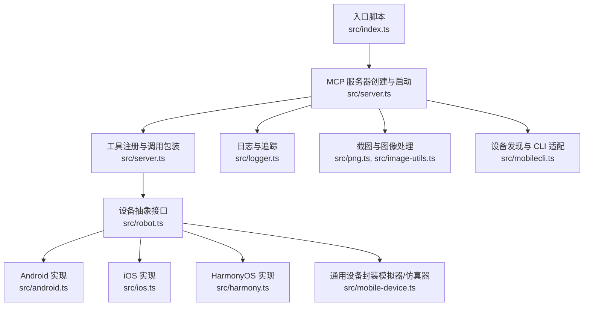
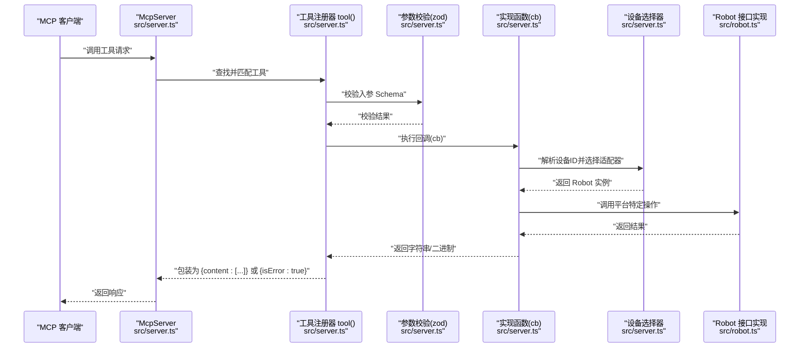
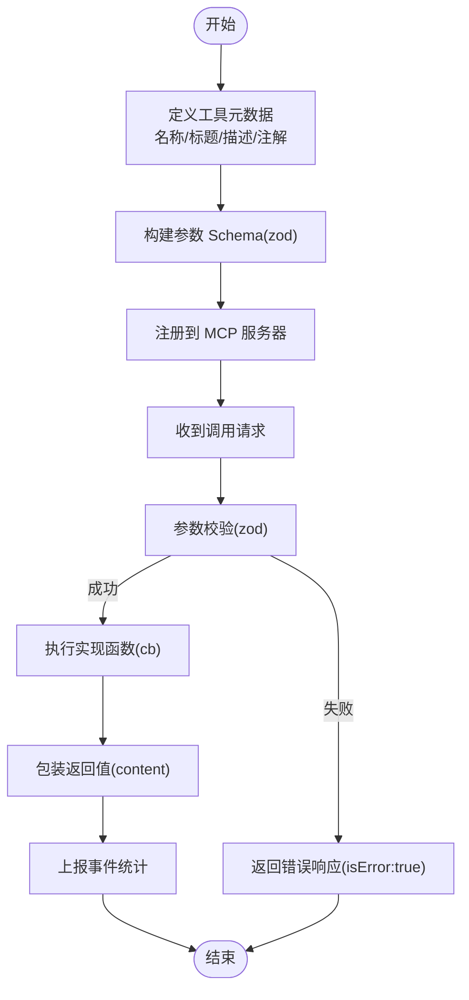
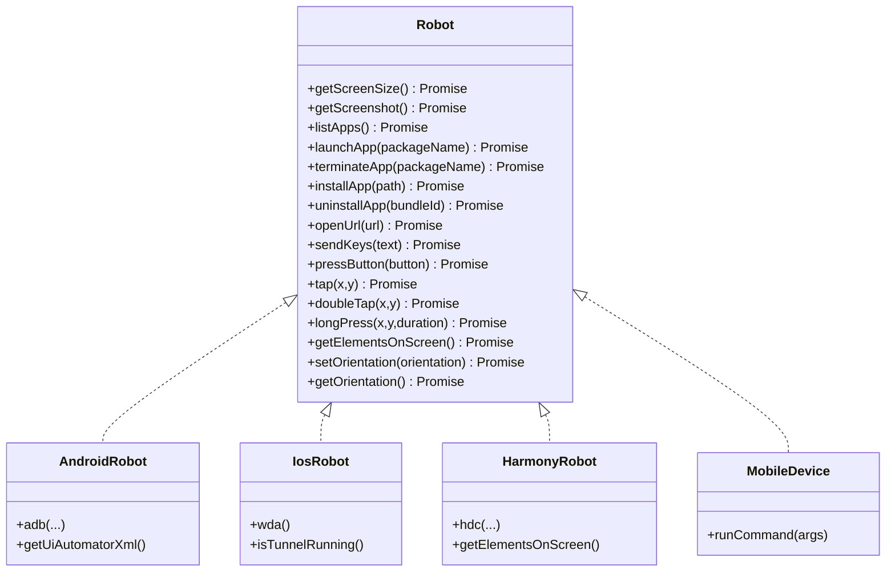
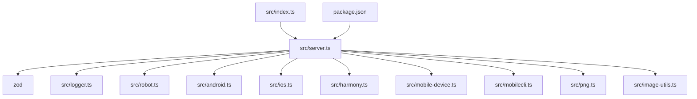

# MCP 工具注册

<cite>
**本文引用的文件**
- [src/index.ts](file://src/index.ts)
- [src/server.ts](file://src/server.ts)
- [src/robot.ts](file://src/robot.ts)
- [src/android.ts](file://src/android.ts)
- [src/ios.ts](file://src/ios.ts)
- [src/harmony.ts](file://src/harmony.ts)
- [src/mobilecli.ts](file://src/mobilecli.ts)
- [src/mobile-device.ts](file://src/mobile-device.ts)
- [src/png.ts](file://src/png.ts)
- [src/image-utils.ts](file://src/image-utils.ts)
- [src/logger.ts](file://src/logger.ts)
- [test/mobilecli.test.ts](file://test/mobilecli.test.ts)
- [package.json](file://package.json)
- [README.md](file://README.md)
</cite>

## 目录
1. [简介](#简介)
2. [项目结构](#项目结构)
3. [核心组件](#核心组件)
4. [架构总览](#架构总览)
5. [详细组件分析](#详细组件分析)
6. [依赖关系分析](#依赖关系分析)
7. [性能考量](#性能考量)
8. [故障排查指南](#故障排查指南)
9. [结论](#结论)
10. [附录](#附录)

## 简介
本文件系统性阐述 MCP 工具注册机制的设计与实现，重点覆盖：
- 工具注册系统架构与工作原理
- 工具元数据定义、参数校验与返回值处理
- 如何使用 tool() 函数注册新工具（名称、描述、参数定义、实现函数）
- 工具与设备管理器的集成方式
- 工具注册的最佳实践与命名规范
- 工具注册的测试与验证方法

该系统基于 Model Context Protocol (MCP) 服务器，提供 iOS、Android、HarmonyOS 三端设备自动化能力，统一以工具形式暴露给 LLM/Agent 使用。

## 项目结构
项目采用按功能分层的组织方式，核心入口负责启动 MCP 服务，工具注册集中在服务器模块，设备抽象通过 Robot 接口统一，各平台适配器分别实现具体操作。

图表来源
- [src/index.ts:1-67](file://src/index.ts#L1-L67)
- [src/server.ts:1-708](file://src/server.ts#L1-L708)
- [src/robot.ts:1-148](file://src/robot.ts#L1-L148)
- [src/android.ts:1-593](file://src/android.ts#L1-L593)
- [src/ios.ts:1-294](file://src/ios.ts#L1-L294)
- [src/harmony.ts:1-462](file://src/harmony.ts#L1-L462)
- [src/mobile-device.ts:1-217](file://src/mobile-device.ts#L1-L217)
- [src/png.ts:1-21](file://src/png.ts#L1-L21)
- [src/image-utils.ts:1-165](file://src/image-utils.ts#L1-L165)
- [src/mobilecli.ts:1-136](file://src/mobilecli.ts#L1-L136)
- [src/logger.ts:1-22](file://src/logger.ts#L1-L22)

章节来源
- [src/index.ts:1-67](file://src/index.ts#L1-L67)
- [src/server.ts:1-708](file://src/server.ts#L1-L708)
- [README.md:1-198](file://README.md#L1-L198)

## 核心组件
- 工具注册器（tool）：封装工具元数据、参数 Schema 校验、异常处理与返回值包装，统一注册到 MCP 服务器。
- 设备抽象（Robot 接口）：定义跨平台一致的操作集合，包括屏幕尺寸、截图、应用管理、输入与导航、手势滑动、元素枚举、方向控制等。
- 平台适配器：
  - AndroidRobot：基于 ADB/UIAutomator
  - IosRobot：基于 WebDriverAgent/go-ios
  - HarmonyRobot：基于 HDC/uitest/hidumper
  - MobileDevice：通用设备封装（用于模拟器/仿真器场景）
- 设备发现与 CLI 适配：Mobilecli 封装外部 mobilecli 工具，提供设备列表、版本检测等能力。
- 图像处理：PNG 解析与图像缩放（Sips/ImageMagick），用于截图优化与格式转换。
- 日志与追踪：统一输出日志与性能追踪。

章节来源
- [src/server.ts:62-95](file://src/server.ts#L62-L95)
- [src/robot.ts:48-147](file://src/robot.ts#L48-L147)
- [src/android.ts:74-504](file://src/android.ts#L74-L504)
- [src/ios.ts:42-232](file://src/ios.ts#L42-L232)
- [src/harmony.ts:43-416](file://src/harmony.ts#L43-L416)
- [src/mobile-device.ts:62-216](file://src/mobile-device.ts#L62-L216)
- [src/mobilecli.ts:27-135](file://src/mobilecli.ts#L27-L135)
- [src/png.ts:6-20](file://src/png.ts#L6-L20)
- [src/image-utils.ts:9-165](file://src/image-utils.ts#L9-L165)
- [src/logger.ts:15-21](file://src/logger.ts#L15-L21)

## 架构总览
MCP 工具注册的核心流程如下：
- 服务器初始化：创建 McpServer，注册工具与设备发现逻辑。
- 工具注册：通过内部工具注册器 tool(name, title, description, paramsSchema, annotations, cb) 完成。
- 参数校验：使用 zod Schema 对入参进行强类型校验。
- 异常处理：ActionableError 用于可指导修复的错误；其他异常转为标准错误响应。
- 返回值包装：统一返回 { content: [...] } 结构，支持文本与图片。
- 设备路由：根据设备 ID 选择对应平台适配器（HarmonyOS、iOS、Android 或通用设备）。

图表来源
- [src/server.ts:62-95](file://src/server.ts#L62-L95)
- [src/server.ts:149-197](file://src/server.ts#L149-L197)
- [src/robot.ts:48-147](file://src/robot.ts#L48-L147)

章节来源
- [src/server.ts:35-707](file://src/server.ts#L35-L707)

## 详细组件分析

### 工具注册器（tool）与工具元数据
- 名称与标题：用于工具识别与展示。
- 描述：简明说明工具用途，便于客户端理解。
- 参数 Schema：使用 zod 定义，支持必填、可选、枚举、范围约束等。
- 注解：readOnlyHint、destructiveHint 提示工具行为特性。
- 实现函数：接收校验后的参数对象，返回字符串或二进制数据。
- 返回值包装：统一包装为 { content: [...] }，支持文本与图片类型；异常时返回 { isError: true }。

图表来源
- [src/server.ts:62-95](file://src/server.ts#L62-L95)

章节来源
- [src/server.ts:62-95](file://src/server.ts#L62-L95)

### 参数验证与返回值处理
- 参数验证：使用 zod.Schema 定义字段类型、描述与约束，如枚举、数值范围、可选参数等。
- 错误处理：
  - ActionableError：用于可指导修复的错误，返回标准化提示文本。
  - 其他异常：记录堆栈并返回标准错误响应。
- 返回值：
  - 文本：直接返回字符串，由工具包装为文本内容。
  - 图片：返回二进制截图，自动检测格式并进行缩放优化，返回 base64 数据与 MIME 类型。

章节来源
- [src/server.ts:68-94](file://src/server.ts#L68-L94)
- [src/server.ts:585-673](file://src/server.ts#L585-L673)
- [src/png.ts:6-20](file://src/png.ts#L6-L20)
- [src/image-utils.ts:9-165](file://src/image-utils.ts#L9-L165)

### 设备管理器与工具集成
- 设备选择器：根据设备 ID 优先判定 HarmonyOS，再检测 iOS，然后 Android，最后通用设备（模拟器/仿真器）。
- 设备发现：HarmonyOS 通过 hdc；iOS 通过 go-ios；Android 通过 ADB；通用设备通过 mobilecli。
- 工具与设备绑定：每个工具均以 device 作为首个参数，通过 getRobotFromDevice(deviceId) 获取对应 Robot 实例，再调用平台特定方法。

图表来源
- [src/robot.ts:48-147](file://src/robot.ts#L48-L147)
- [src/android.ts:74-504](file://src/android.ts#L74-L504)
- [src/ios.ts:42-232](file://src/ios.ts#L42-L232)
- [src/harmony.ts:43-416](file://src/harmony.ts#L43-L416)
- [src/mobile-device.ts:62-216](file://src/mobile-device.ts#L62-L216)

章节来源
- [src/server.ts:149-197](file://src/server.ts#L149-L197)
- [src/mobilecli.ts:27-135](file://src/mobilecli.ts#L27-L135)

### 工具注册最佳实践与命名规范
- 命名规范：
  - 前缀统一：mobile_ 前缀，清晰区分工具域。
  - 动宾结构：如 mobile_list_apps、mobile_launch_app、mobile_swipe_on_screen。
  - 平台一致性：同一功能在不同平台保持相同语义与参数名。
- 元数据设计：
  - 描述应简洁明确，说明工具作用与副作用（如 destructiveHint）。
  - 参数描述需包含单位、取值范围与可选性。
- 参数 Schema：
  - 必须使用 zod 定义，保证强类型与可预测性。
  - 对枚举、数值范围、可选参数给出明确约束。
- 返回值：
  - 文本工具返回自然语言总结；图片工具返回二进制并自动优化。
  - 失败时返回 { isError: true }，避免抛出未捕获异常。

章节来源
- [src/server.ts:199-704](file://src/server.ts#L199-L704)

### 工具注册示例与实现要点
- 设备管理类工具：如 mobile_list_available_devices，返回统一设备列表结构。
- 应用管理类工具：如 mobile_list_apps、mobile_launch_app、mobile_install_app、mobile_uninstall_app，均以 device 为参数。
- 屏幕交互类工具：如 mobile_take_screenshot、mobile_save_screenshot、mobile_list_elements_on_screen、mobile_swipe_on_screen、mobile_click_on_screen_at_coordinates、mobile_long_press_on_screen_at_coordinates。
- 输入与导航类工具：如 mobile_type_keys、mobile_press_button、mobile_open_url。
- 方向控制类工具：如 mobile_set_orientation、mobile_get_orientation。

章节来源
- [src/server.ts:199-704](file://src/server.ts#L199-L704)

### 测试与验证方法
- 单元测试：针对 Mobilecli 的 getVersion 与 getDevices 行为进行断言，验证命令参数与返回格式。
- 集成测试：通过工具注册器与设备选择器组合，验证参数校验、异常处理与返回值包装。
- 场景验证：使用真实设备或模拟器运行工具，检查截图、元素枚举、手势与应用管理等关键路径。

章节来源
- [test/mobilecli.test.ts:1-120](file://test/mobilecli.test.ts#L1-L120)

## 依赖关系分析
- 内部依赖：
  - src/server.ts 依赖 src/robot.ts、src/android.ts、src/ios.ts、src/harmony.ts、src/mobile-device.ts、src/mobilecli.ts、src/png.ts、src/image-utils.ts、src/logger.ts。
  - 工具注册器 tool 依赖 zod 进行参数校验。
- 外部依赖：
  - @modelcontextprotocol/sdk：MCP 服务器框架。
  - commander、express：命令行与 HTTP SSE 传输。
  - fast-xml-parser：解析 Android UIAutomator 输出。
  - optionalDependencies：@mobilenext/mobilecli（非必需，用于 Android/iOS 设备发现）。

图表来源
- [src/server.ts:1-16](file://src/server.ts#L1-L16)
- [src/index.ts:1-8](file://src/index.ts#L1-L8)
- [package.json:29-39](file://package.json#L29-L39)

章节来源
- [package.json:29-39](file://package.json#L29-L39)
- [src/server.ts:1-16](file://src/server.ts#L1-L16)

## 性能考量
- 截图优化：当可用时使用 Sips 或 ImageMagick 对 PNG/JPEG 进行缩放与质量压缩，降低传输体积。
- 参数校验前置：通过 zod Schema 在进入实现前完成参数校验，减少无效调用。
- 设备选择缓存：设备 ID 到适配器的映射在运行期建立，避免重复探测。
- 异常快速失败：ActionableError 提供明确提示，减少重试成本。

章节来源
- [src/image-utils.ts:133-165](file://src/image-utils.ts#L133-L165)
- [src/server.ts:62-95](file://src/server.ts#L62-L95)

## 故障排查指南
- mobilecli 不可用：当 mobilecli 未安装或不可执行时，工具注册器会抛出可指导修复的错误，建议参考安装与配置文档。
- 设备未找到：若传入的设备 ID 无法匹配任何平台适配器，将返回可修复的错误提示。
- 截图异常：当截图无效或格式不被识别时，工具会返回错误响应并记录堆栈。
- 日志定位：通过日志输出与追踪函数定位问题发生点。

章节来源
- [src/server.ts:138-147](file://src/server.ts#L138-L147)
- [src/server.ts:196](file://src/server.ts#L196)
- [src/server.ts:665-671](file://src/server.ts#L665-L671)
- [src/logger.ts:15-21](file://src/logger.ts#L15-L21)

## 结论
该 MCP 工具注册机制通过统一的工具注册器、强类型的参数校验与完善的异常处理，实现了跨平台设备自动化工具的一致性与可靠性。结合平台适配器与设备发现能力，开发者可以便捷地扩展新的工具，满足多样化的移动端自动化需求。

## 附录
- 安装与配置：详见项目 README 的“安装与配置”章节，涵盖前置依赖与 MCP 配置示例。
- 工具列表：详见 README 的“MCP 工具列表”，包含设备管理、应用管理、屏幕交互、输入与导航、各平台底层实现等内容。

章节来源
- [README.md:90-171](file://README.md#L90-L171)
- [README.md:47-86](file://README.md#L47-L86)