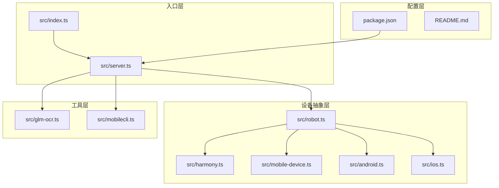
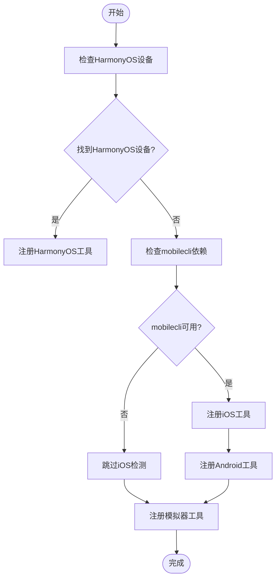
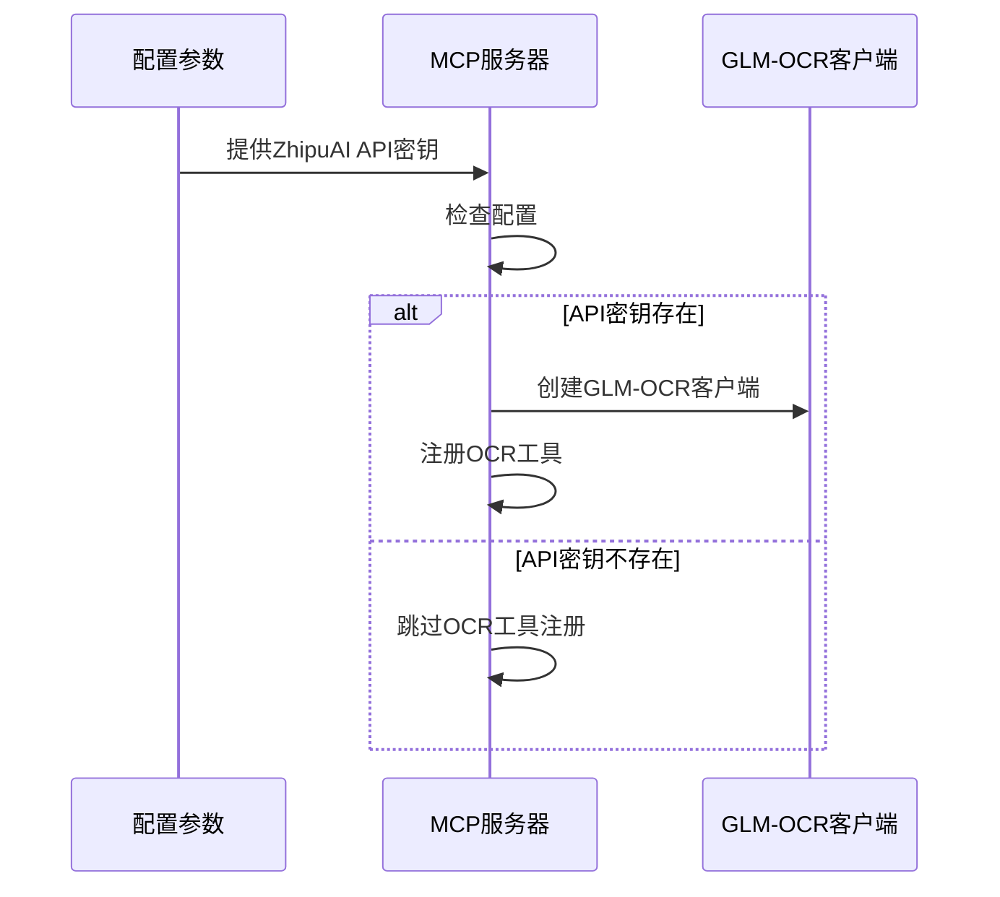
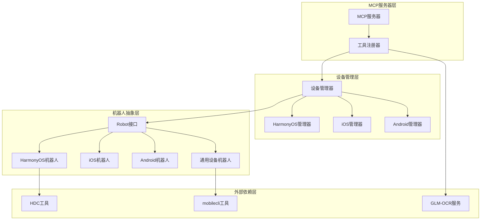
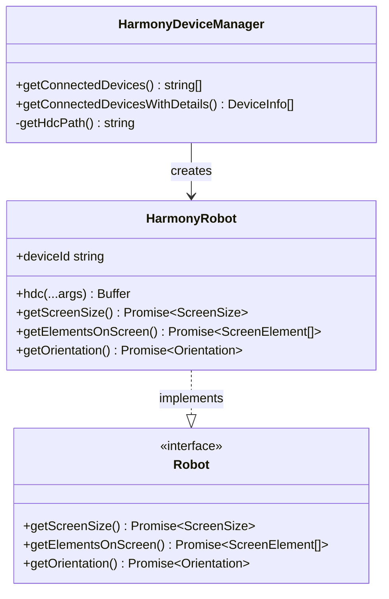
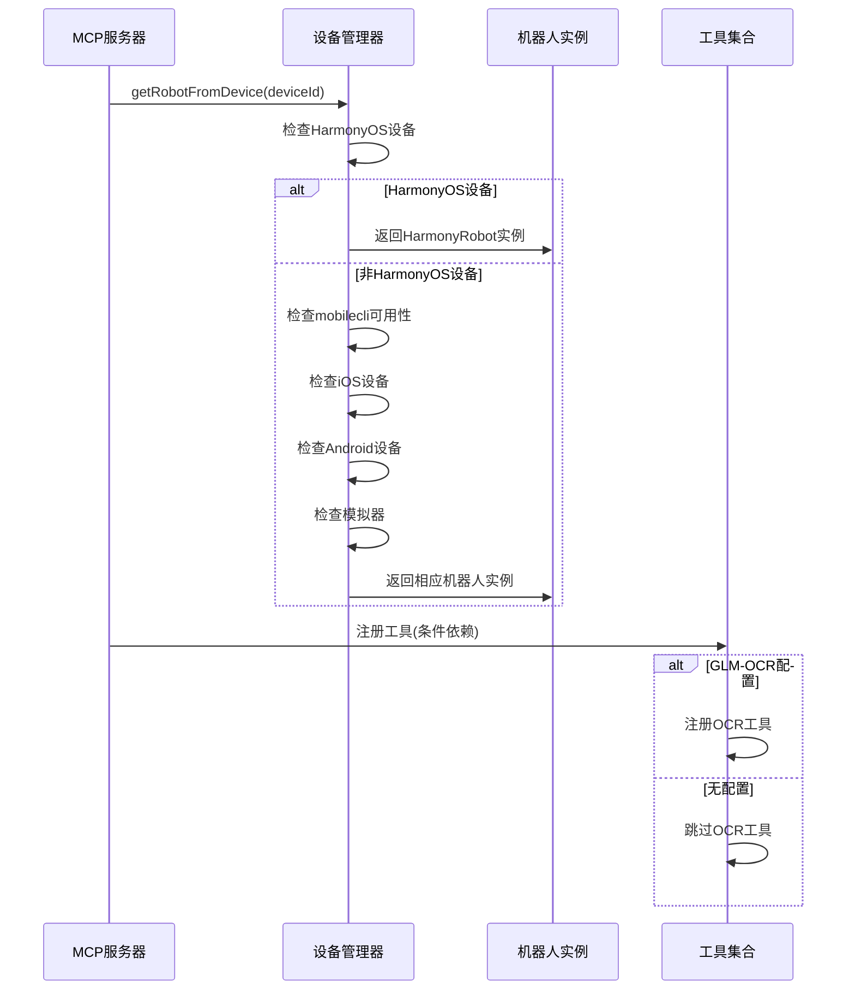
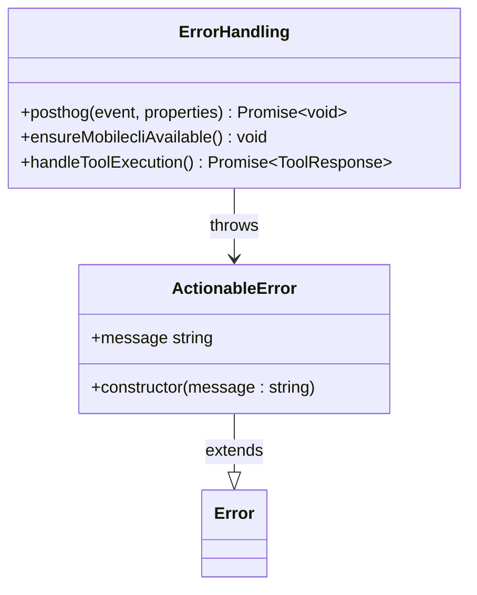
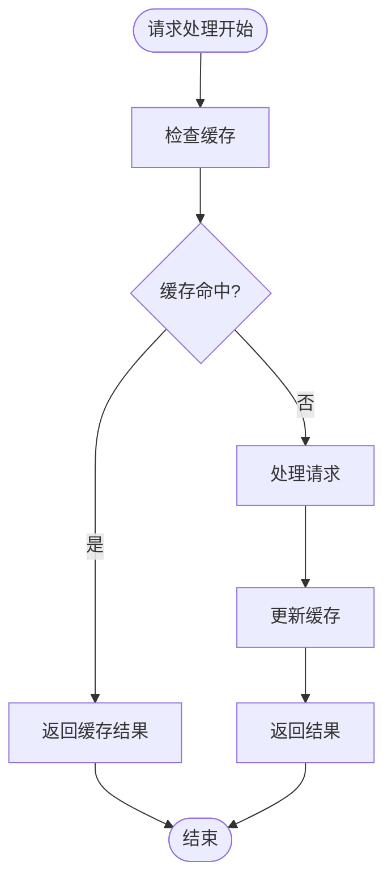

# 条件工具注册

<cite>
**本文档引用的文件**
- [src/index.ts](file://src/index.ts)
- [src/server.ts](file://src/server.ts)
- [src/harmony.ts](file://src/harmony.ts)
- [src/mobile-device.ts](file://src/mobile-device.ts)
- [src/robot.ts](file://src/robot.ts)
- [src/mobilecli.ts](file://src/mobilecli.ts)
- [src/android.ts](file://src/android.ts)
- [src/ios.ts](file://src/ios.ts)
- [src/glm-ocr.ts](file://src/glm-ocr.ts)
- [package.json](file://package.json)
- [README.md](file://README.md)
</cite>

## 目录
1. [简介](#简介)
2. [项目结构](#项目结构)
3. [核心组件](#核心组件)
4. [架构概览](#架构概览)
5. [详细组件分析](#详细组件分析)
6. [依赖关系分析](#依赖关系分析)
7. [性能考虑](#性能考虑)
8. [故障排除指南](#故障排除指南)
9. [结论](#结论)

## 简介

本文档深入分析了移动MCP HarmonyOS项目的条件工具注册机制。该项目是一个基于Model Context Protocol (MCP)的服务器，提供跨平台的移动端自动化能力，支持iOS、Android和HarmonyOS设备的统一工具集。

项目的核心创新在于其智能的条件工具注册系统，该系统能够根据运行环境和可用依赖动态地注册和启用相应的工具函数。这种设计使得项目能够在不同平台和环境下灵活地提供最合适的自动化能力。

## 项目结构

项目采用模块化的架构设计，主要包含以下核心模块：



**图表来源**
- [src/index.ts:1-71](file://src/index.ts#L1-L71)
- [src/server.ts:1-758](file://src/server.ts#L1-L758)

**章节来源**
- [src/index.ts:1-71](file://src/index.ts#L1-L71)
- [src/server.ts:1-758](file://src/server.ts#L1-L758)

## 核心组件

### 条件工具注册系统

项目实现了高度智能化的条件工具注册机制，主要体现在以下几个方面：

#### 1. 动态设备检测
系统能够自动检测可用的设备类型，并为每种设备类型注册相应的工具：



**图表来源**
- [src/server.ts:154-202](file://src/server.ts#L154-L202)

#### 2. 条件依赖加载
系统根据配置参数动态加载可选功能：



**图表来源**
- [src/server.ts:711-754](file://src/server.ts#L711-L754)

#### 3. 错误处理和降级策略
系统实现了完善的错误处理机制，确保在部分功能不可用时仍能正常运行：

**章节来源**
- [src/server.ts:143-202](file://src/server.ts#L143-L202)
- [src/server.ts:711-754](file://src/server.ts#L711-L754)

## 架构概览

项目采用了分层架构设计，实现了设备抽象、工具注册和条件加载的有机结合：



**图表来源**
- [src/server.ts:40-758](file://src/server.ts#L40-L758)
- [src/harmony.ts:418-461](file://src/harmony.ts#L418-L461)

## 详细组件分析

### 设备检测和选择机制

#### HarmonyOS设备检测
HarmonyOS设备检测是条件工具注册的核心组成部分，具有以下特点：



**图表来源**
- [src/harmony.ts:418-461](file://src/harmony.ts#L418-L461)
- [src/harmony.ts:43-416](file://src/harmony.ts#L43-L416)
- [src/robot.ts:48-147](file://src/robot.ts#L48-L147)

#### 多平台设备支持
系统支持多种设备类型的统一管理：

**章节来源**
- [src/harmony.ts:418-461](file://src/harmony.ts#L418-L461)
- [src/mobile-device.ts:62-216](file://src/mobile-device.ts#L62-L216)
- [src/android.ts:74-200](file://src/android.ts#L74-L200)
- [src/ios.ts:42-200](file://src/ios.ts#L42-L200)

### 工具注册流程

#### 条件注册实现
工具注册过程体现了高度的条件判断逻辑：



**图表来源**
- [src/server.ts:154-202](file://src/server.ts#L154-L202)
- [src/server.ts:711-754](file://src/server.ts#L711-L754)

#### 工具分类和特性
系统提供了完整的工具分类体系：

**章节来源**
- [src/server.ts:204-754](file://src/server.ts#L204-L754)

### 错误处理和容错机制

#### ActionableError设计
项目实现了专门的错误处理机制：



**图表来源**
- [src/robot.ts:40-44](file://src/robot.ts#L40-L44)
- [src/server.ts:102-138](file://src/server.ts#L102-L138)

**章节来源**
- [src/robot.ts:40-44](file://src/robot.ts#L40-L44)
- [src/server.ts:102-138](file://src/server.ts#L102-L138)

## 依赖关系分析

### 外部依赖管理

项目采用了灵活的依赖管理策略，支持可选依赖的条件加载：

```mermaid
graph LR
subgraph "必需依赖"
MCP[@modelcontextprotocol/sdk]
Commander[commander]
Express[express]
Zod[zod]
end
subgraph "可选依赖"
MobileCLI[@mobilenext/mobilecli]
end
subgraph "内部模块"
Server[server.ts]
Harmony[harmony.ts]
MobileDevice[mobile-device.ts]
GLM_OCR[glm-ocr.ts]
end
MCP --> Server
Commander --> Server
Express --> Server
Zod --> Server
MobileCLI -.-> MobileDevice
MobileCLI -.-> Server
Server --> Harmony
Server --> MobileDevice
Server --> GLM_OCR
```

**图表来源**
- [package.json:29-39](file://package.json#L29-L39)
- [src/server.ts:1-17](file://src/server.ts#L1-L17)

### 版本兼容性
项目通过严格的版本控制确保各组件间的兼容性：

**章节来源**
- [package.json:13-15](file://package.json#L13-L15)
- [package.json:29-39](file://package.json#L29-L39)

## 性能考虑

### 条件加载优化
系统通过条件加载机制避免不必要的资源消耗：

1. **延迟初始化**: 设备检测和工具注册仅在需要时执行
2. **可选功能**: GLM-OCR等高级功能仅在配置时启用
3. **错误隔离**: 单个组件的失败不影响其他组件的正常运行

### 内存管理
项目实现了高效的内存管理策略：



## 故障排除指南

### 常见问题诊断

#### 设备检测失败
当设备检测出现问题时，系统会提供明确的错误信息：

1. **HDC工具不可用**: 检查HDC SDK路径配置
2. **mobilecli依赖缺失**: 安装并配置mobilecli工具
3. **权限问题**: 确保有足够的系统权限访问设备

#### 工具注册异常
如果某些工具无法注册，检查以下配置：

1. **API密钥配置**: 确保GLM-OCR API密钥正确设置
2. **网络连接**: 验证对外部服务的网络访问
3. **依赖版本**: 检查各依赖组件的版本兼容性

**章节来源**
- [src/server.ts:143-152](file://src/server.ts#L143-L152)
- [src/server.ts:711-754](file://src/server.ts#L711-L754)

## 结论

移动MCP HarmonyOS项目的条件工具注册机制展现了现代软件架构的最佳实践。通过智能的设备检测、灵活的依赖管理和完善的错误处理，系统能够在复杂的多平台环境中提供稳定可靠的服务。

该机制的核心优势包括：

1. **灵活性**: 能够根据运行环境自动调整功能集
2. **可靠性**: 即使部分组件失效也能保持整体功能
3. **可扩展性**: 易于添加新的设备类型和工具功能
4. **用户体验**: 为用户提供一致且可靠的自动化体验

这种条件工具注册的设计模式为类似的多平台项目提供了宝贵的参考价值，展示了如何在复杂的技术栈中实现优雅的架构解耦和功能组合。