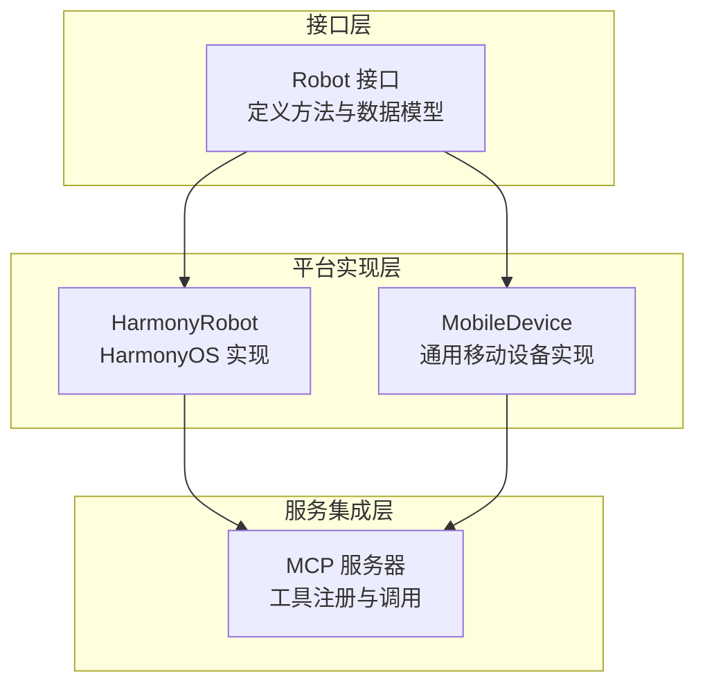
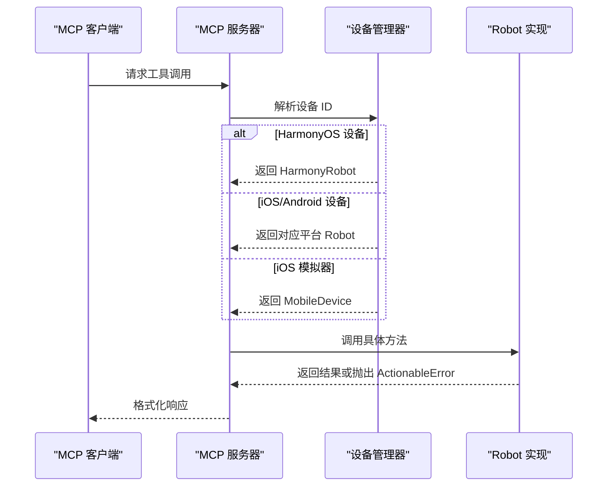
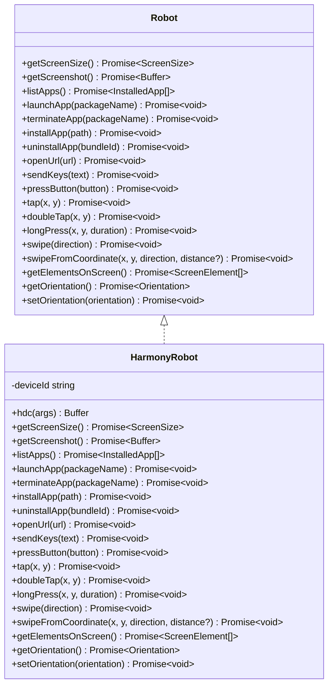
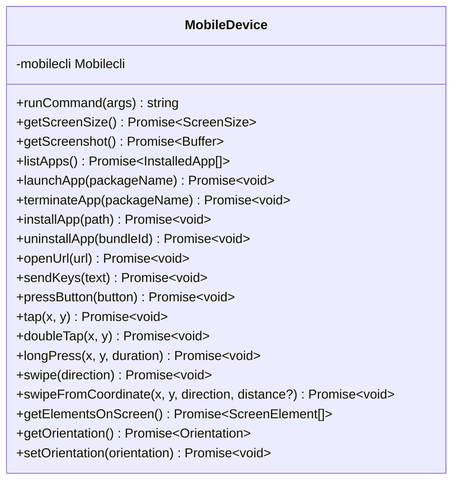
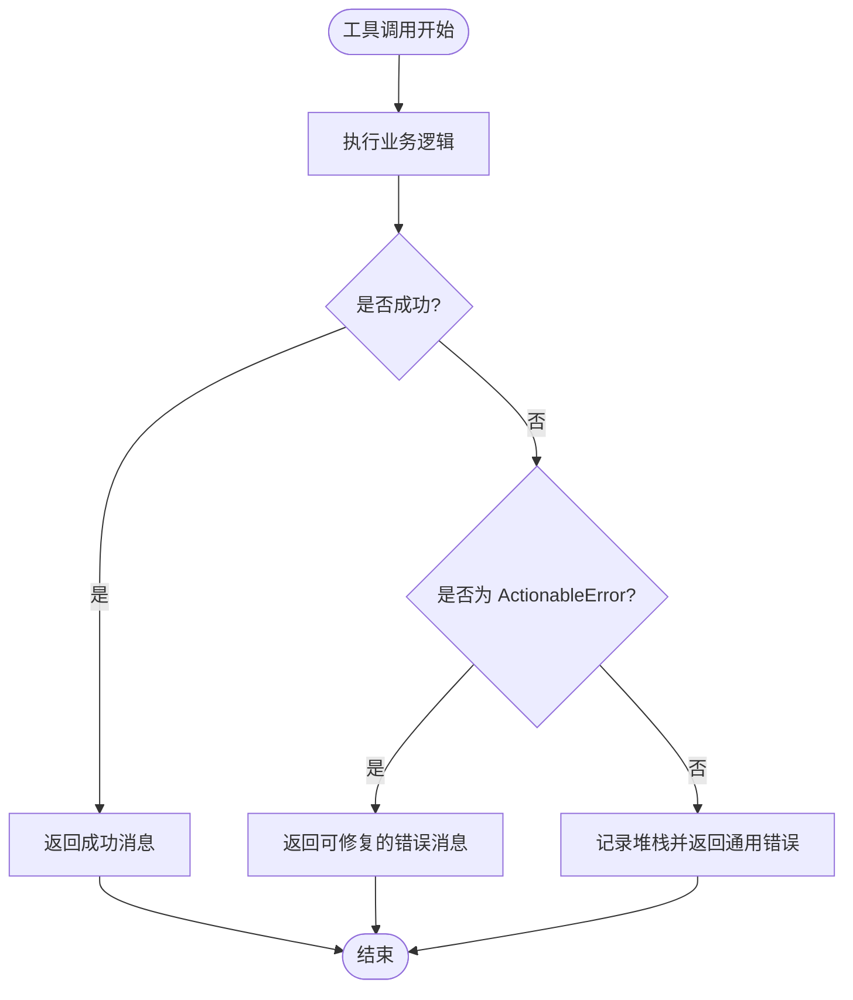
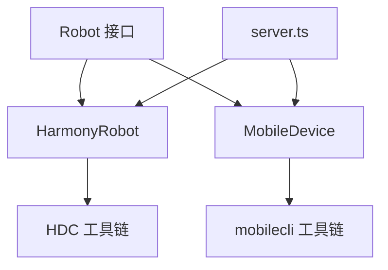

# Robot 接口实现

<cite>
**本文档引用的文件**
- [robot.ts](file://src/robot.ts)
- [harmony.ts](file://src/harmony.ts)
- [mobile-device.ts](file://src/mobile-device.ts)
- [server.ts](file://src/server.ts)
- [README.md](file://README.md)
- [package.json](file://package.json)
</cite>

## 目录
1. [简介](#简介)
2. [项目结构](#项目结构)
3. [核心组件](#核心组件)
4. [架构概览](#架构概览)
5. [详细组件分析](#详细组件分析)
6. [依赖关系分析](#依赖关系分析)
7. [性能考量](#性能考量)
8. [故障排除指南](#故障排除指南)
9. [结论](#结论)

## 简介
本指南面向希望实现 Robot 接口的开发者，系统阐述了 Robot 接口的设计理念、方法职责、参数定义、返回值类型、异常处理策略，并结合现有 HarmonyOS 和通用移动设备实现，提供最佳实践与性能优化建议。同时，详细解释 ActionableError 异常类的使用场景与错误处理策略，帮助开发者在不同平台上正确实现接口方法。

## 项目结构
该项目为 Model Context Protocol (MCP) 服务器，提供跨平台移动端自动化能力，支持 iOS、Android 和 HarmonyOS 设备。核心结构如下：
- 接口定义：Robot 接口及数据模型定义位于 robot.ts
- 平台实现：HarmonyOS 实现 HarmonyRobot（harmony.ts）、通用移动设备实现 MobileDevice（mobile-device.ts）
- 服务集成：MCP 工具注册与调用逻辑位于 server.ts
- 文档与配置：README.md 提供平台支持、安装配置与自动化原理说明；package.json 描述依赖与脚本

图表来源
- [robot.ts:48-147](file://src/robot.ts#L48-L147)
- [harmony.ts:43-416](file://src/harmony.ts#L43-L416)
- [mobile-device.ts:62-216](file://src/mobile-device.ts#L62-L216)
- [server.ts:35-707](file://src/server.ts#L35-L707)

章节来源
- [README.md:175-190](file://README.md#L175-L190)
- [package.json:1-74](file://package.json#L1-L74)

## 核心组件
Robot 接口定义了移动端自动化的核心能力，包括屏幕尺寸获取、截图、应用管理、输入导航、触摸操作、元素识别与屏幕方向控制等。接口方法均以 Promise 形式返回，便于异步调用与错误处理。

- 数据模型
  - Dimensions：宽高
  - ScreenSize：屏幕尺寸（含缩放比例）
  - InstalledApp：已安装应用（包名与应用名）
  - SwipeDirection：滑动方向枚举
  - Button：物理按键枚举
  - ScreenElementRect：元素矩形坐标
  - ScreenElement：屏幕元素（类型、标签、文本、名称、值、提示、标识符、矩形、聚焦状态）
  - Orientation：屏幕方向枚举

- 异常类
  - ActionableError：可由用户修复的错误，用于向 MCP 客户端返回可读的错误消息

- 方法职责
  - 屏幕尺寸与方向：getScreenSize、getOrientation、setOrientation
  - 截图：getScreenshot
  - 应用管理：listApps、launchApp、terminateApp、installApp、uninstallApp
  - 打开 URL：openUrl
  - 输入与按键：sendKeys、pressButton
  - 触摸操作：tap、doubleTap、longPress、swipe、swipeFromCoordinate
  - 元素识别：getElementsOnScreen

章节来源
- [robot.ts:1-147](file://src/robot.ts#L1-L147)

## 架构概览
MCP 服务器根据设备 ID 动态选择对应的 Robot 实现：
- HarmonyOS 设备：通过 HarmonyDeviceManager 检测，返回 HarmonyRobot
- iOS/Android 设备：需要 mobilecli 依赖，通过 IosManager/AndroidDeviceManager 检测，返回对应实现
- iOS 模拟器：通过 MobileDevice 实现

图表来源
- [server.ts:149-197](file://src/server.ts#L149-L197)
- [harmony.ts:418-461](file://src/harmony.ts#L418-L461)
- [mobile-device.ts:62-216](file://src/mobile-device.ts#L62-L216)

## 详细组件分析

### Robot 接口设计与方法详解
- 屏幕尺寸获取
  - 方法：getScreenSize()
  - 参数：无
  - 返回：Promise<ScreenSize>
  - 异常：无特定异常类型，失败时应抛出可诊断的错误
  - 最佳实践：缓存屏幕尺寸，避免频繁查询；在实现中处理分辨率与缩放

- 截图
  - 方法：getScreenshot()
  - 参数：无
  - 返回：Promise<Buffer>（PNG 或 JPEG）
  - 异常：无效截图时抛出 ActionableError
  - 性能：在服务端可选进行图像缩放与格式转换，降低传输体积

- 应用列表
  - 方法：listApps()
  - 参数：无
  - 返回：Promise<InstalledApp[]>
  - 异常：无特定异常类型，失败时抛出可诊断错误

- 启动应用
  - 方法：launchApp(packageName: string)
  - 参数：packageName（包名）
  - 返回：Promise<void>
  - 异常：ActionableError（如无法解析主 Ability）

- 终止应用
  - 方法：terminateApp(packageName: string)
  - 参数：packageName
  - 返回：Promise<void>
  - 异常：无特定异常类型

- 安装应用
  - 方法：installApp(path: string)
  - 参数：本地路径
  - 返回：Promise<void>
  - 异常：ActionableError（捕获底层安装命令输出）

- 卸载应用
  - 方法：uninstallApp(bundleId: string)
  - 参数：包名/Bundle ID
  - 返回：Promise<void>
  - 异常：ActionableError（捕获底层卸载命令输出）

- 打开 URL
  - 方法：openUrl(url: string)
  - 参数：URL 字符串
  - 返回：Promise<void>
  - 异常：无特定异常类型

- 输入文本
  - 方法：sendKeys(text: string)
  - 参数：text
  - 返回：Promise<void>
  - 异常：无特定异常类型
  - 行为：优先向焦点元素输入，否则在屏幕中心附近输入

- 按键
  - 方法：pressButton(button: Button)
  - 参数：button（枚举）
  - 返回：Promise<void>
  - 异常：ActionableError（不支持的按键）

- 点击
  - 方法：tap(x: number, y: number)
  - 参数：坐标
  - 返回：Promise<void>
  - 异常：无特定异常类型

- 双击
  - 方法：doubleTap(x: number, y: number)
  - 参数：坐标
  - 返回：Promise<void>
  - 异常：无特定异常类型

- 长按
  - 方法：longPress(x: number, y: number, duration: number)
  - 参数：坐标与持续时间（毫秒）
  - 返回：Promise<void>
  - 异常：无特定异常类型

- 滑动（中心）
  - 方法：swipe(direction: SwipeDirection)
  - 参数：方向
  - 返回：Promise<void>
  - 异常：ActionableError（不支持的方向）

- 滑动（坐标起点）
  - 方法：swipeFromCoordinate(x: number, y: number, direction: SwipeDirection, distance?: number)
  - 参数：起点坐标、方向、距离（可选）
  - 返回：Promise<void>
  - 异常：ActionableError（不支持的方向）

- 屏幕元素识别
  - 方法：getElementsOnScreen()
  - 参数：无
  - 返回：Promise<ScreenElement[]>
  - 异常：无特定异常类型
  - 行为：返回可交互元素列表（文本、描述、提示、矩形等）

- 屏幕方向
  - 方法：getOrientation()、setOrientation(orientation: Orientation)
  - 参数：方向枚举
  - 返回：Promise<Orientation> 或 Promise<void>
  - 异常：setOrientation 对不支持的平台抛出 ActionableError

章节来源
- [robot.ts:48-147](file://src/robot.ts#L48-L147)

### HarmonyOS 实现（HarmonyRobot）
HarmonyRobot 基于 HDC 工具链实现，直接驱动设备，无需 mobilecli 依赖。其方法实现要点如下：

- 设备检测与命令执行
  - 使用 hdc 命令连接设备并执行 shell 命令
  - 通过环境变量 HDC_SDK_PATH 指定 hdc 路径

- 屏幕尺寸与方向
  - 通过 hidumper 获取虚拟宽高与旋转角度
  - setOrientation 抛出 ActionableError（HarmonyOS 不支持程序化方向变更）

- 截图
  - 使用 snapshot_display 截图，通过 file recv 拉取到本地临时目录
  - 清理远程与本地临时文件

- 应用管理
  - bm dump/list 查询应用
  - aa start/force-stop 启动与终止应用
  - install/uninstall 调用 hdc install/uninstall

- 输入与按键
  - sendKeys：优先定位焦点元素，否则在屏幕中心附近输入
  - pressButton：映射按键名称，不支持的按键抛出 ActionableError

- 触摸与滑动
  - tap/doubleTap/longPress：调用 uiInput 子命令
  - swipe/swipeFromCoordinate：计算起终点坐标并调用 uiInput swipe

- 元素识别
  - dumpLayout 输出布局树，解析 JSON 并收集可交互元素
  - parseBounds 解析矩形边界字符串

- 错误处理
  - 大多数方法捕获底层命令异常，包装为 ActionableError
  - 对于 setOrientation 明确抛出 ActionableError

图表来源
- [robot.ts:48-147](file://src/robot.ts#L48-L147)
- [harmony.ts:43-416](file://src/harmony.ts#L43-L416)

章节来源
- [harmony.ts:43-416](file://src/harmony.ts#L43-L416)

### 通用移动设备实现（MobileDevice）
MobileDevice 通过 mobilecli 工具链实现，适用于 iOS/Android 设备与 iOS 模拟器。其方法实现要点如下：

- 命令封装
  - runCommand 将设备 ID 注入到 mobilecli 命令参数中
  - 多数方法直接调用 mobilecli 的子命令

- 屏幕尺寸与方向
  - device info 获取屏幕尺寸
  - device orientation set/get 控制方向

- 截图
  - screenshot --format png --output - 直接返回二进制缓冲区

- 应用管理
  - apps list/launch/terminate/install/uninstall 对应 mobilecli 子命令

- 输入与按键
  - io text、io button、io tap、io longpress

- 触摸与滑动
  - swipe 支持固定距离或基于坐标
  - doubleTap 通过两次 tap 实现

- 元素识别
  - dump ui 返回结构化元素列表

- 错误处理
  - 通过 mobilecli 的 JSON 响应解析，统一返回可读结果

图表来源
- [mobile-device.ts:62-216](file://src/mobile-device.ts#L62-L216)

章节来源
- [mobile-device.ts:62-216](file://src/mobile-device.ts#L62-L216)

### ActionableError 异常类与错误处理策略
ActionableError 是可由用户修复的错误类型，用于 MCP 服务器在工具调用失败时向客户端返回可读的错误消息。其使用策略如下：

- 何时抛出
  - 平台不支持的操作（如 HarmonyOS 的 setOrientation）
  - 用户输入错误（如不支持的按键、方向）
  - 应用启动失败（无法解析主 Ability）
  - 安装/卸载失败（捕获底层命令输出）

- 服务器端处理
  - 工具包装函数 tool 内部捕获异常
  - 若为 ActionableError，返回包含修复建议的消息
  - 若为其他异常，记录堆栈并返回通用错误消息

- 客户端体验
  - 可读性强的错误消息，指导用户修正问题
  - 避免泄露内部实现细节

图表来源
- [server.ts:62-95](file://src/server.ts#L62-L95)
- [robot.ts:40-44](file://src/robot.ts#L40-L44)

章节来源
- [server.ts:62-95](file://src/server.ts#L62-L95)
- [robot.ts:40-44](file://src/robot.ts#L40-L44)

### 滑动实现对比与最佳实践
不同平台的滑动实现存在差异，但都遵循“计算起终点坐标并调用底层输入命令”的模式。以下为 HarmonyOS 与通用实现的关键差异与最佳实践：

- 坐标计算
  - 中心滑动：根据屏幕中心与百分比计算起终点
  - 坐标滑动：以给定起点为基础，按方向与距离计算终点
  - 边界处理：确保终点在屏幕范围内

- 时间与速度
  - HarmonyOS 使用 uiInput swipe 的持续时间参数
  - Android/WebDriverAgent 使用不同的持续时间与动作序列
  - 建议：根据设备性能与目标应用响应调整持续时间

- 方向映射
  - 统一使用枚举，避免字符串拼写错误
  - 对不支持的方向抛出 ActionableError

- 性能优化
  - 缓存屏幕尺寸，避免重复查询
  - 合理设置距离，避免过长滑动导致超时

章节来源
- [harmony.ts:83-157](file://src/harmony.ts#L83-L157)
- [mobile-device.ts:83-137](file://src/mobile-device.ts#L83-L137)

## 依赖关系分析
- 接口与实现
  - Robot 接口被 HarmonyRobot 与 MobileDevice 实现
  - 两者均通过各自平台的命令行工具链执行底层操作

- 服务器集成
  - server.ts 根据设备 ID 动态选择 Robot 实现
  - 工具注册与调用统一通过 tool 包装，集中处理 ActionableError

- 外部依赖
  - HarmonyOS：hdc、uitest、hidumper、snapshot_display、bm、aa
  - 通用：mobilecli（可选，仅用于 iOS/Android）

图表来源
- [robot.ts:48-147](file://src/robot.ts#L48-L147)
- [harmony.ts:43-416](file://src/harmony.ts#L43-L416)
- [mobile-device.ts:62-216](file://src/mobile-device.ts#L62-L216)
- [server.ts:35-707](file://src/server.ts#L35-L707)

章节来源
- [README.md:175-190](file://README.md#L175-L190)
- [package.json:29-39](file://package.json#L29-L39)

## 性能考量
- 屏幕尺寸缓存
  - 在实现中缓存屏幕尺寸，避免频繁查询底层工具链
  - 在切换方向或设备旋转后更新缓存

- 截图优化
  - 服务端可选进行图像缩放与格式转换，降低传输体积
  - 合理设置质量参数，平衡清晰度与大小

- 命令执行
  - 合理设置超时与最大缓冲区，避免长时间阻塞
  - 对批量操作（如安装多个应用）采用串行或有限并发

- 元素识别
  - 仅收集可交互元素，减少后续处理开销
  - 对布局树解析进行健壮性检查，避免异常传播

- 错误处理
  - 对可预期的错误使用 ActionableError，减少重试成本
  - 记录关键指标（耗时、错误率）以便监控与优化

## 故障排除指南
- 设备未找到
  - 使用 mobile_list_available_devices 确认设备 ID 是否正确
  - HarmonyOS：确认 hdc 在 PATH 或设置 HDC_SDK_PATH
  - iOS/Android：确认 mobilecli 可用且版本正确

- 滑动无效
  - 检查坐标是否在屏幕范围内
  - 确认方向枚举是否正确
  - 调整持续时间与距离参数

- 应用启动失败
  - HarmonyOS：确认主 Ability 名称可解析
  - iOS/Android：确认包名/Bundle ID 正确

- 截图为空或损坏
  - 检查底层截图命令是否成功
  - 确认临时文件清理逻辑未提前删除

- 按键不生效
  - 确认按键映射表是否包含该按键
  - HarmonyOS：部分按键不支持，抛出 ActionableError

章节来源
- [server.ts:149-197](file://src/server.ts#L149-L197)
- [harmony.ts:212-219](file://src/harmony.ts#L212-L219)
- [server.ts:675-673](file://src/server.ts#L675-L673)

## 结论
Robot 接口提供了统一的移动端自动化抽象，HarmonyRobot 与 MobileDevice 分别针对 HarmonyOS 与通用移动设备实现了完整的功能集合。通过 ActionableError 的统一错误处理策略，MCP 服务器能够向客户端返回可读且可修复的错误消息。开发者在实现新平台时，应遵循接口契约、统一错误处理、关注性能与稳定性，并参考现有实现的最佳实践。