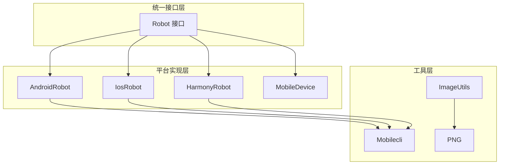
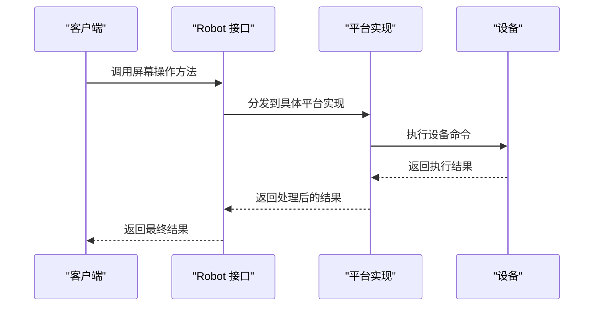
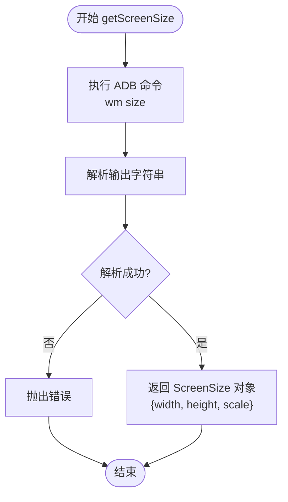
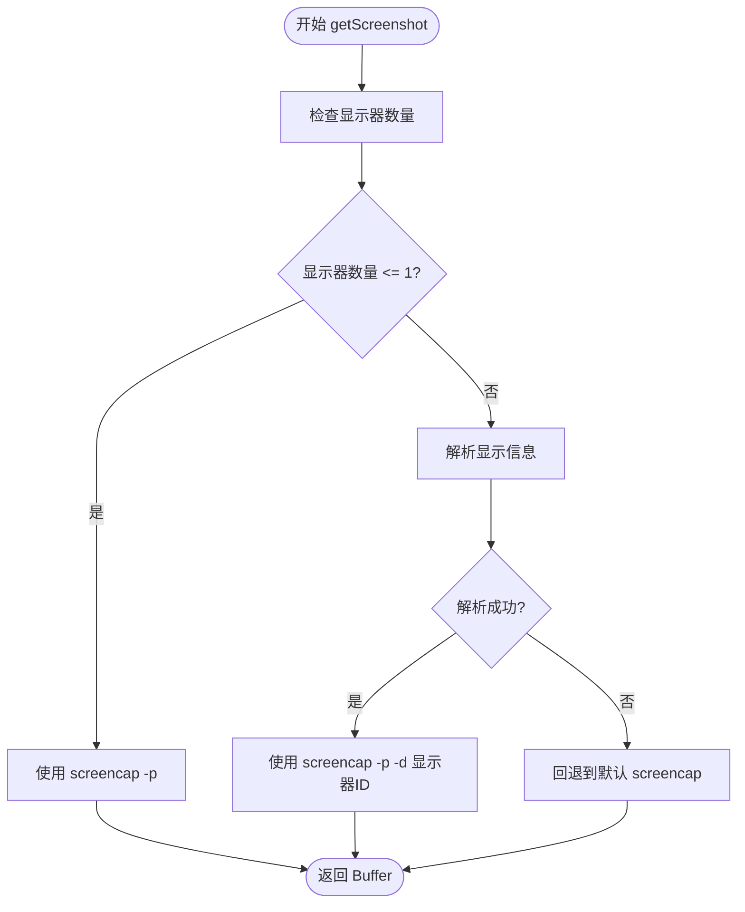
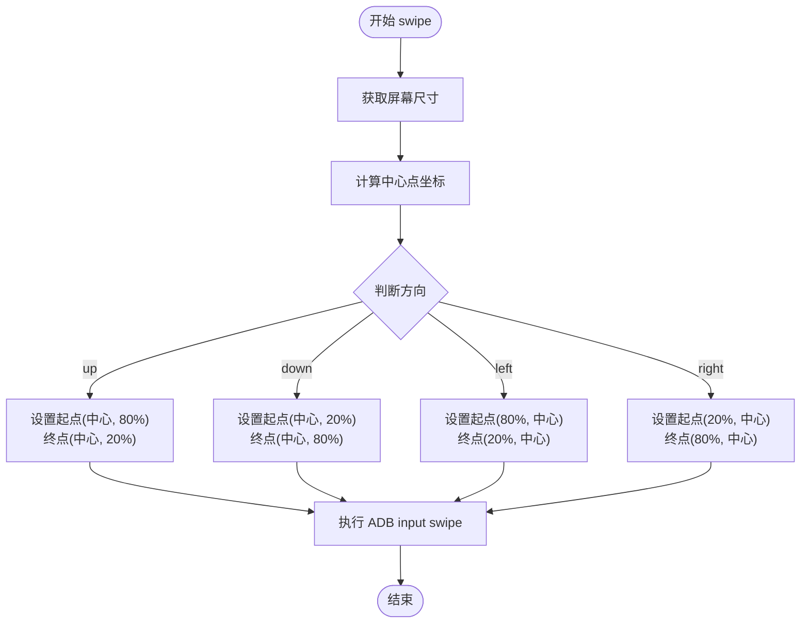
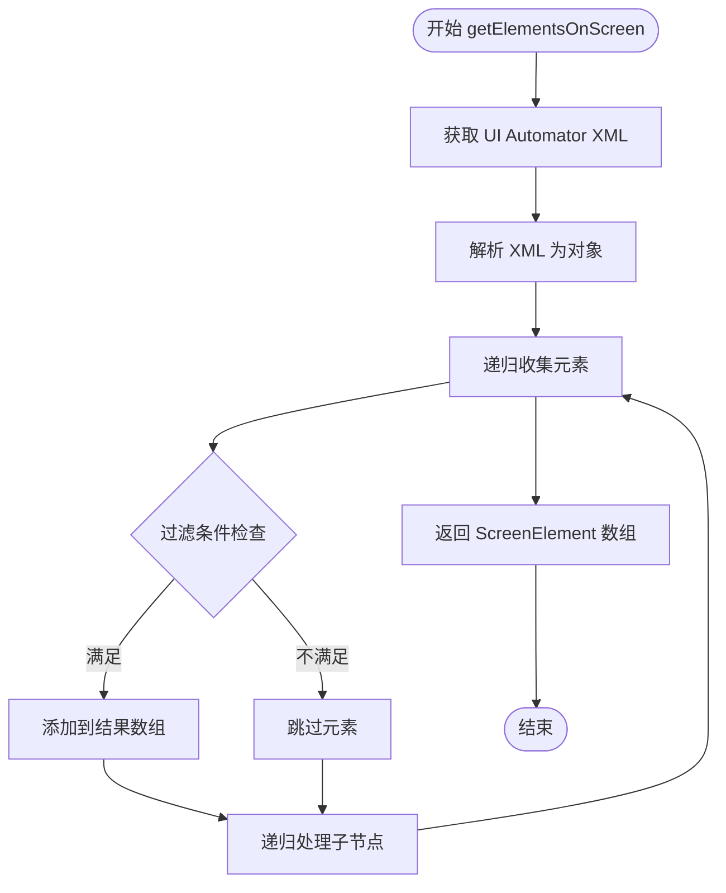
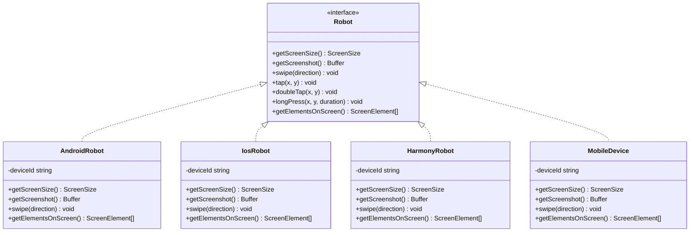

# 屏幕操作方法

<cite>
**本文档引用的文件**
- [src/robot.ts](file://src/robot.ts)
- [src/mobile-device.ts](file://src/mobile-device.ts)
- [src/android.ts](file://src/android.ts)
- [src/harmony.ts](file://src/harmony.ts)
- [src/ios.ts](file://src/ios.ts)
- [src/mobilecli.ts](file://src/mobilecli.ts)
- [src/image-utils.ts](file://src/image-utils.ts)
- [src/png.ts](file://src/png.ts)
- [test/android.ts](file://test/android.ts)
- [test/ios.ts](file://test/ios.ts)
- [README.md](file://README.md)
</cite>

## 目录
1. [简介](#简介)
2. [项目结构](#项目结构)
3. [核心组件](#核心组件)
4. [架构概览](#架构概览)
5. [详细组件分析](#详细组件分析)
6. [依赖关系分析](#依赖关系分析)
7. [性能考虑](#性能考虑)
8. [故障排除指南](#故障排除指南)
9. [结论](#结论)

## 简介
本指南详细说明了屏幕操作方法的实现细节，包括 getScreenSize()、getScreenshot()、swipe()、tap()、doubleTap()、longPress()、getElementsOnScreen() 等核心方法。文档涵盖了屏幕尺寸获取的数据结构、截图缓冲区处理、滑动操作的方向控制、坐标系统转换以及元素识别算法，并提供了各平台实现的具体代码示例路径，包括参数验证、异常处理和性能优化策略。

## 项目结构
该项目采用多平台抽象设计，通过统一的 Robot 接口为 iOS、Android 和 HarmonyOS 提供一致的屏幕操作能力。

**图表来源**
- [src/robot.ts:48-147](file://src/robot.ts#L48-L147)
- [src/android.ts:74-504](file://src/android.ts#L74-L504)
- [src/ios.ts:42-232](file://src/ios.ts#L42-L232)
- [src/harmony.ts:43-416](file://src/harmony.ts#L43-L416)
- [src/mobile-device.ts:62-216](file://src/mobile-device.ts#L62-L216)

**章节来源**
- [README.md:175-190](file://README.md#L175-L190)

## 核心组件
本项目的核心是 Robot 接口定义，它为所有屏幕操作方法提供了统一的抽象层。每个平台都实现了这个接口，以适配特定的设备控制机制。

### 数据结构定义
项目定义了多个关键数据结构来描述屏幕尺寸、元素坐标和应用信息：

- **ScreenSize**: 包含 width、height 和 scale 字段，用于描述设备屏幕的物理尺寸和缩放比例
- **ScreenElementRect**: 描述 UI 元素的矩形边界，包含 x、y、width、height
- **ScreenElement**: 综合描述 UI 元素的完整信息，包括类型、文本、标签、标识符和坐标
- **InstalledApp**: 描述已安装应用的信息，包含包名和应用名

**章节来源**
- [src/robot.ts:1-47](file://src/robot.ts#L1-L47)

## 架构概览
系统采用分层架构设计，通过统一接口抽象不同平台的差异性：

**图表来源**
- [src/robot.ts:48-147](file://src/robot.ts#L48-L147)
- [src/android.ts:74-504](file://src/android.ts#L74-L504)
- [src/ios.ts:42-232](file://src/ios.ts#L42-L232)
- [src/harmony.ts:43-416](file://src/harmony.ts#L43-L416)

## 详细组件分析

### getScreenSize() 方法实现

#### Android 平台实现
Android 平台通过 ADB shell 命令获取屏幕尺寸，使用 `wm size` 命令获取分辨率，然后解析输出字符串提取宽度和高度。

**图表来源**
- [src/android.ts:103-116](file://src/android.ts#L103-L116)

#### HarmonyOS 平台实现
HarmonyOS 平台使用 HDC 工具的 `hidumper` 命令获取显示管理服务信息，从中提取 VirtualWidth 和 VirtualHeight 参数。

**章节来源**
- [src/android.ts:103-116](file://src/android.ts#L103-L116)
- [src/harmony.ts:55-69](file://src/harmony.ts#L55-L69)

### getScreenshot() 方法实现

#### Android 平台实现
Android 平台根据设备显示数量选择不同的截图策略：
- 单显示器设备：直接使用 `screencap -p` 命令
- 多显示器设备：通过 `cmd display get-displays` 或 `dumpsys display` 解析显示信息后使用 `-d` 参数指定显示器

**图表来源**
- [src/android.ts:295-310](file://src/android.ts#L295-L310)

#### HarmonyOS 平台实现
HarmonyOS 平台使用 `snapshot_display` 命令截取屏幕，将图片保存到设备临时目录后通过文件传输协议下载到本地，最后清理临时文件。

**章节来源**
- [src/android.ts:295-310](file://src/android.ts#L295-L310)
- [src/harmony.ts:159-182](file://src/harmony.ts#L159-L182)

### swipe() 方法实现

#### Android 平台实现
Android 平台使用 ADB 的 `input swipe` 命令实现滑动操作，支持四种方向：
- 上滑：从底部 80% 滑到顶部 20%
- 下滑：从顶部 20% 滑到底部 80%
- 左滑：从右侧 80% 滑到左侧 20%
- 右滑：从左侧 20% 滑到右侧 80%

**图表来源**
- [src/android.ts:159-191](file://src/android.ts#L159-L191)

#### HarmonyOS 平台实现
HarmonyOS 平台使用 HDC 的 `uitest uiInput swipe` 命令，滑动范围使用 70%/30% 的百分比策略。

**章节来源**
- [src/android.ts:159-191](file://src/android.ts#L159-L191)
- [src/harmony.ts:83-117](file://src/harmony.ts#L83-L117)

### tap()、doubleTap()、longPress() 方法实现

#### Android 平台实现
- **tap()**: 使用 `input tap x y` 命令执行点击
- **doubleTap()**: 通过两次连续的 tap 实现，中间有短延迟
- **longPress()**: 使用 `input swipe x y x y 持续时间` 实现长按

#### HarmonyOS 平台实现
- **tap()**: 使用 `uitest uiInput click x y` 命令
- **doubleTap()**: 使用 `uitest uiInput doubleClick x y` 命令
- **longPress()**: 使用 `uitest uiInput longClick x y` 命令

**章节来源**
- [src/android.ts:438-451](file://src/android.ts#L438-L451)
- [src/harmony.ts:71-81](file://src/harmony.ts#L71-L81)

### getElementsOnScreen() 方法实现

#### Android 平台实现
Android 平台通过 UI Automator 获取界面层次结构，解析 XML 输出并递归收集可交互元素：

**图表来源**
- [src/android.ts:351-356](file://src/android.ts#L351-L356)
- [src/android.ts:312-349](file://src/android.ts#L312-L349)

#### HarmonyOS 平台实现
HarmonyOS 平台使用 `uitest dumpLayout` 命令获取布局树，解析 JSON 格式的布局信息并递归收集元素。

**章节来源**
- [src/android.ts:351-356](file://src/android.ts#L351-L356)
- [src/harmony.ts:294-332](file://src/harmony.ts#L294-L332)

## 依赖关系分析

**图表来源**
- [src/robot.ts:48-147](file://src/robot.ts#L48-L147)
- [src/android.ts:74-504](file://src/android.ts#L74-L504)
- [src/ios.ts:42-232](file://src/ios.ts#L42-L232)
- [src/harmony.ts:43-416](file://src/harmony.ts#L43-L416)
- [src/mobile-device.ts:62-216](file://src/mobile-device.ts#L62-L216)

**章节来源**
- [src/robot.ts:48-147](file://src/robot.ts#L48-L147)

## 性能考虑

### 截图性能优化
1. **缓冲区大小限制**: 所有平台都设置了最大缓冲区大小（4MB），防止内存溢出
2. **超时控制**: 设置 30 秒超时，避免长时间阻塞
3. **格式选择**: Android 平台使用 PNG 格式保证质量，HarmonyOS 平台使用 JPEG 格式减少文件大小

### 命令执行优化
1. **批量操作**: 将相关的设备命令合并执行，减少进程启动开销
2. **缓存机制**: 屏幕尺寸信息可以缓存，避免频繁查询
3. **异步处理**: 所有设备操作都是异步的，不会阻塞主线程

### 内存管理
1. **临时文件清理**: HarmonyOS 平台在截图后及时清理临时文件
2. **资源释放**: 所有平台都实现了适当的资源清理机制

## 故障排除指南

### 常见问题及解决方案

#### 设备连接问题
- **问题**: 设备无法被检测到
- **解决方案**: 检查 ADB/HDC 连接状态，确保设备已正确连接

#### 命令执行失败
- **问题**: ADB/HDC 命令执行失败
- **解决方案**: 验证环境变量设置（ANDROID_HOME、HDC_SDK_PATH），检查权限

#### 截图失败
- **问题**: 截图返回空数据或损坏
- **解决方案**: 检查设备权限，确认应用具有截图权限

#### 元素识别失败
- **问题**: getElementsOnScreen() 返回空结果
- **解决方案**: 确认应用处于前台，检查无障碍服务是否启用

**章节来源**
- [src/android.ts:466-481](file://src/android.ts#L466-L481)
- [src/harmony.ts:299-306](file://src/harmony.ts#L299-L306)

## 结论
本项目通过统一的 Robot 接口为 iOS、Android 和 HarmonyOS 平台提供了完整的屏幕操作能力。每个平台都有针对性的实现策略，既保持了接口的一致性，又充分利用了各平台的特性。通过合理的错误处理、性能优化和资源管理，确保了在各种环境下都能稳定运行。

主要优势包括：
1. **平台无关性**: 统一的接口设计使得上层应用无需关心底层平台差异
2. **可靠性**: 完善的错误处理和重试机制
3. **性能**: 针对不同平台的优化策略
4. **可扩展性**: 清晰的架构设计便于添加新的平台支持