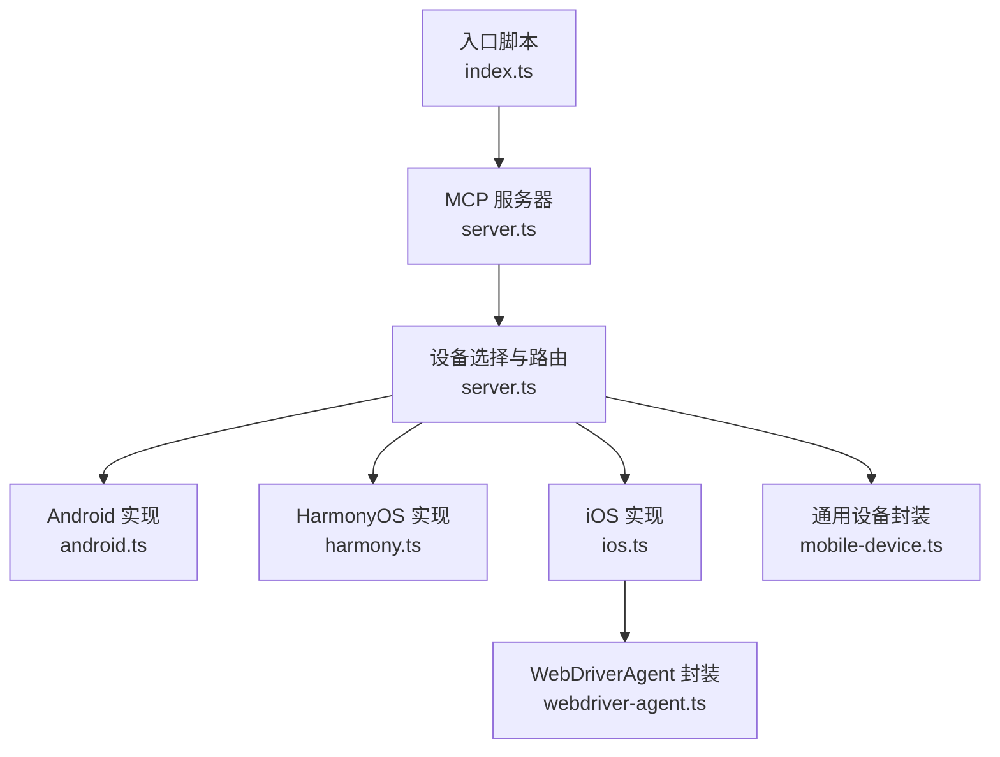
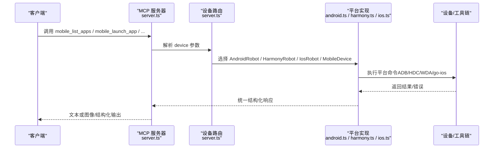
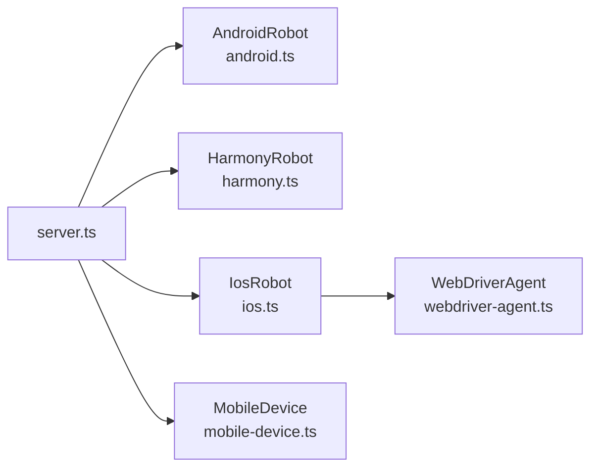

# 应用管理方法

<cite>
**本文引用的文件**
- [index.ts](file://src/index.ts)
- [server.ts](file://src/server.ts)
- [robot.ts](file://src/robot.ts)
- [android.ts](file://src/android.ts)
- [harmony.ts](file://src/harmony.ts)
- [ios.ts](file://src/ios.ts)
- [webdriver-agent.ts](file://src/webdriver-agent.ts)
- [mobile-device.ts](file://src/mobile-device.ts)
- [README.md](file://README.md)
</cite>

## 目录
1. [简介](#简介)
2. [项目结构](#项目结构)
3. [核心组件](#核心组件)
4. [架构总览](#架构总览)
5. [详细组件分析](#详细组件分析)
6. [依赖关系分析](#依赖关系分析)
7. [性能考量](#性能考量)
8. [故障排查指南](#故障排查指南)
9. [结论](#结论)
10. [附录](#附录)

## 简介
本指南聚焦于应用管理方法的实现原理与最佳实践，覆盖以下核心能力：
- 列举应用：listApps()
- 启动应用：launchApp()
- 终止应用：terminateApp()
- 安装应用：installApp()
- 卸载应用：uninstallApp()

同时解释包名与Bundle ID的差异、应用状态检测机制、安装包格式支持与权限管理，并提供各平台（Android、HarmonyOS、iOS）的特有实现示例（ADB/HDC/WebDriverAgent），以及应用生命周期管理与错误处理策略。

## 项目结构
该项目为一个基于 Model Context Protocol（MCP）的跨平台移动自动化服务，统一抽象了设备与应用管理能力。核心模块如下：
- 服务入口与工具注册：server.ts
- 设备与应用管理适配层：android.ts、harmony.ts、ios.ts、mobile-device.ts
- 抽象接口与错误类型：robot.ts
- iOS WebDriverAgent 集成：webdriver-agent.ts
- 入口脚本：index.ts
- 项目说明：README.md

图表来源
- [index.ts:1-67](file://src/index.ts#L1-L67)
- [server.ts:135-197](file://src/server.ts#L135-L197)
- [android.ts:74-504](file://src/android.ts#L74-L504)
- [harmony.ts:43-416](file://src/harmony.ts#L43-L416)
- [ios.ts:42-232](file://src/ios.ts#L42-L232)
- [webdriver-agent.ts:25-454](file://src/webdriver-agent.ts#L25-L454)
- [mobile-device.ts:62-216](file://src/mobile-device.ts#L62-L216)

章节来源
- [README.md:1-198](file://README.md#L1-L198)
- [index.ts:1-67](file://src/index.ts#L1-L67)
- [server.ts:135-197](file://src/server.ts#L135-L197)

## 核心组件
- Robot 接口：定义统一的设备操作能力，包括 listApps()/launchApp()/terminateApp()/installApp()/uninstallApp() 等。
- 平台实现类：
  - AndroidRobot：基于 ADB 命令与 UIAutomator，实现应用管理与屏幕交互。
  - HarmonyRobot：基于 HDC 命令与 uitest/hidumper，实现应用管理与屏幕交互。
  - IosRobot：通过 go-ios 与 WebDriverAgent（WDA）协作，实现应用管理与屏幕交互。
  - MobileDevice：通用设备封装，通过 mobilecli 提供统一命令。
- 错误类型：ActionableError，用于区分可指导修复的错误与真实异常。

章节来源
- [robot.ts:48-147](file://src/robot.ts#L48-L147)
- [android.ts:74-504](file://src/android.ts#L74-L504)
- [harmony.ts:43-416](file://src/harmony.ts#L43-L416)
- [ios.ts:42-232](file://src/ios.ts#L42-L232)
- [mobile-device.ts:62-216](file://src/mobile-device.ts#L62-L216)

## 架构总览
应用管理方法通过 MCP 工具注册后，由 server.ts 的设备选择逻辑根据设备标识动态路由到具体平台实现。统一的 Robot 接口保证了不同平台的一致行为契约。

图表来源
- [server.ts:298-375](file://src/server.ts#L298-L375)
- [server.ts:149-197](file://src/server.ts#L149-L197)
- [android.ts:118-131](file://src/android.ts#L118-L131)
- [harmony.ts:221-232](file://src/harmony.ts#L221-L232)
- [ios.ts:125-148](file://src/ios.ts#L125-L148)

## 详细组件分析

### Android 应用管理实现
- listApps()
  - 使用 ADB 查询具有主入口活动的包，过滤重复项，返回包名与应用名。
  - 关键命令路径参考：[android.ts:118-131](file://src/android.ts#L118-L131)
- launchApp()
  - 通过 monkey 启动指定包的 LAUNCHER Activity；失败抛出可指导错误。
  - 关键命令路径参考：[android.ts:142-148](file://src/android.ts#L142-L148)
- terminateApp()
  - 使用 am force-stop 强制停止目标包。
  - 关键命令路径参考：[android.ts:358-360](file://src/android.ts#L358-L360)
- installApp()
  - 使用 adb install -r 安装；捕获 stdout/stderr 并包装为可指导错误。
  - 关键命令路径参考：[android.ts:362-371](file://src/android.ts#L362-L371)
- uninstallApp()
  - 使用 adb uninstall 卸载；捕获 stdout/stderr 并包装为可指导错误。
  - 关键命令路径参考：[android.ts:373-382](file://src/android.ts#L373-L382)

应用状态检测机制
- 通过 pm list packages 与 cmd package query-activities 获取已安装包与可启动活动。
- 参考路径：[android.ts:133-140](file://src/android.ts#L133-L140)、[android.ts:118-131](file://src/android.ts#L118-L131)

包名与 Bundle ID 处理差异
- Android 使用“包名”作为应用唯一标识；HarmonyOS 使用“Bundle 名称”，iOS 使用“Bundle ID”。平台实现中均以统一的 InstalledApp.packageName 字段返回。
- 参考路径：[robot.ts:10-13](file://src/robot.ts#L10-L13)、[android.ts:127-130](file://src/android.ts#L127-L130)、[harmony.ts:228-231](file://src/harmony.ts#L228-L231)、[ios.ts:128-137](file://src/ios.ts#L128-L137)

安装包格式支持
- Android 支持 .apk；HarmonyOS 支持 .hap；iOS 支持 .ipa（真机）与 .app/.zip（模拟器）。MCP 工具参数中明确区分。
- 参考路径：[server.ts:345-359](file://src/server.ts#L345-L359)

权限管理
- 安装/卸载/启动/终止等操作通常需要设备具备相应调试/开发者选项权限，且需确保 ADB/HDC/工具链可用。
- 参考路径：[README.md:90-100](file://README.md#L90-L100)

章节来源
- [android.ts:118-131](file://src/android.ts#L118-L131)
- [android.ts:142-148](file://src/android.ts#L142-L148)
- [android.ts:358-382](file://src/android.ts#L358-L382)
- [android.ts:133-140](file://src/android.ts#L133-L140)
- [robot.ts:10-13](file://src/robot.ts#L10-L13)
- [server.ts:345-359](file://src/server.ts#L345-L359)
- [README.md:90-100](file://README.md#L90-L100)

### HarmonyOS 应用管理实现
- listApps()
  - 通过 bm dump -a 列出所有包名，映射为 InstalledApp。
  - 关键命令路径参考：[harmony.ts:221-232](file://src/harmony.ts#L221-L232)
- launchApp()
  - 通过 bm dump -n 获取主 Ability，再用 aa start 启动。
  - 关键命令路径参考：[harmony.ts:234-262](file://src/harmony.ts#L234-L262)
- terminateApp()
  - 使用 aa force-stop 终止目标包。
  - 关键命令路径参考：[harmony.ts:264-266](file://src/harmony.ts#L264-L266)
- installApp()
  - 使用 hdc install -r 安装；捕获 stdout/stderr 并包装为可指导错误。
  - 关键命令路径参考：[harmony.ts:268-277](file://src/harmony.ts#L268-L277)
- uninstallApp()
  - 使用 hdc uninstall 卸载；捕获 stdout/stderr 并包装为可指导错误。
  - 关键命令路径参考：[harmony.ts:279-288](file://src/harmony.ts#L279-L288)

应用状态检测机制
- 通过 bm dump -a 与 bm dump -n 获取包与主 Ability 信息。
- 参考路径：[harmony.ts:221-232](file://src/harmony.ts#L221-L232)、[harmony.ts:234-262](file://src/harmony.ts#L234-L262)

安装包格式支持
- HarmonyOS 支持 .hap 包安装。
- 参考路径：[server.ts:345-359](file://src/server.ts#L345-L359)

权限管理
- 需要 hdc 工具可用并正确配置环境变量（如 HDC_SDK_PATH）。
- 参考路径：[README.md:90-100](file://README.md#L90-L100)

章节来源
- [harmony.ts:221-232](file://src/harmony.ts#L221-L232)
- [harmony.ts:234-262](file://src/harmony.ts#L234-L262)
- [harmony.ts:264-288](file://src/harmony.ts#L264-L288)
- [server.ts:345-359](file://src/server.ts#L345-L359)
- [README.md:90-100](file://README.md#L90-L100)

### iOS 应用管理实现
- listApps()
  - 通过 go-ios apps --all --list 获取包名与应用名。
  - 关键命令路径参考：[ios.ts:125-138](file://src/ios.ts#L125-L138)
- launchApp()/terminateApp()
  - 通过 go-ios launch/kill 启动/终止应用。
  - 关键命令路径参考：[ios.ts:140-148](file://src/ios.ts#L140-L148)
- installApp()/uninstallApp()
  - 通过 go-ios install/uninstall 安装/卸载；捕获 stdout/stderr 并包装为可指导错误。
  - 关键命令路径参考：[ios.ts:150-172](file://src/ios.ts#L150-L172)
- openUrl()
  - 通过 WebDriverAgent 打开 URL。
  - 关键命令路径参考：[ios.ts:174-177](file://src/ios.ts#L174-L177)

应用状态检测机制
- 通过 go-ios apps --all --list 与设备系统信息判断。
- 参考路径：[ios.ts:125-138](file://src/ios.ts#L125-L138)

安装包格式支持
- iOS 真机支持 .ipa；模拟器支持 .app/.zip。
- 参考路径：[server.ts:345-359](file://src/server.ts#L345-L359)

权限管理
- 需要 go-ios 工具可用，并建立隧道与端口转发（WDA）。
- 参考路径：[ios.ts:69-92](file://src/ios.ts#L69-L92)、[README.md:90-100](file://README.md#L90-L100)

章节来源
- [ios.ts:125-172](file://src/ios.ts#L125-L172)
- [ios.ts:69-92](file://src/ios.ts#L69-L92)
- [server.ts:345-359](file://src/server.ts#L345-L359)
- [README.md:90-100](file://README.md#L90-L100)

### 通用设备封装（mobile-device）
- 通过 mobilecli 统一命令封装，提供 listApps()/launchApp()/terminateApp()/installApp()/uninstallApp() 等。
- 关键命令路径参考：[mobile-device.ts:144-166](file://src/mobile-device.ts#L144-L166)

章节来源
- [mobile-device.ts:144-166](file://src/mobile-device.ts#L144-L166)

### 应用生命周期管理与错误处理策略
- 生命周期
  - 启动：launchApp() 后建议结合 listApps() 或 getElementsOnScreen() 验证应用是否进入前台。
  - 终止：terminateApp() 后可再次列出应用确认状态。
- 错误处理
  - 统一使用 ActionableError 包装平台命令错误输出，便于用户修复。
  - 参考路径：[android.ts:142-148](file://src/android.ts#L142-L148)、[android.ts:362-382](file://src/android.ts#L362-L382)、[harmony.ts:268-288](file://src/harmony.ts#L268-L288)、[ios.ts:150-172](file://src/ios.ts#L150-L172)
- 权限与前置条件
  - Android：确保 ADB 可用且设备在线。
  - HarmonyOS：确保 HDC 可用并配置环境变量。
  - iOS：确保 go-ios 可用、隧道与端口转发正常。
  - 参考路径：[README.md:90-100](file://README.md#L90-L100)

章节来源
- [android.ts:142-148](file://src/android.ts#L142-L148)
- [android.ts:362-382](file://src/android.ts#L362-L382)
- [harmony.ts:268-288](file://src/harmony.ts#L268-L288)
- [ios.ts:150-172](file://src/ios.ts#L150-L172)
- [README.md:90-100](file://README.md#L90-L100)

## 依赖关系分析
- 设备路由
  - server.ts 根据设备类型优先匹配 HarmonyOS/HarmonyRobot，否则依赖 mobilecli 的可用性判断 iOS/Android/MobileDevice。
  - 参考路径：[server.ts:149-197](file://src/server.ts#L149-L197)
- 平台工具链
  - Android：ADB（adb）、UIAutomator、Monkey。
  - HarmonyOS：HDC（hdc）、uitest、hidumper、snapshot_display、bm、aa。
  - iOS：go-ios（ios）、WebDriverAgent（WDA）。
  - 参考路径：[README.md:175-188](file://README.md#L175-L188)

图表来源
- [server.ts:149-197](file://src/server.ts#L149-L197)
- [ios.ts:42-232](file://src/ios.ts#L42-L232)
- [webdriver-agent.ts:25-454](file://src/webdriver-agent.ts#L25-L454)

章节来源
- [server.ts:149-197](file://src/server.ts#L149-L197)
- [README.md:175-188](file://README.md#L175-L188)

## 性能考量
- 命令超时与缓冲区限制：各平台实现均设置了合理的超时与最大缓冲区，避免长时间阻塞。
  - 参考路径：[android.ts:69-71](file://src/android.ts#L69-L71)、[harmony.ts:9-11](file://src/harmony.ts#L9-L11)、[ios.ts:7-8](file://src/ios.ts#L7-L8)
- 截图优化：iOS 截图通过 WebDriverAgent 获取，支持格式检测与缩放，降低传输体积。
  - 参考路径：[server.ts:597-673](file://src/server.ts#L597-L673)

## 故障排查指南
- Android
  - ADB 未找到或未配置：检查 ANDROID_HOME 或本地 SDK 路径。
    - 参考路径：[android.ts:32-54](file://src/android.ts#L32-L54)
  - 启动失败：确认包名存在且具有 LAUNCHER Activity。
    - 参考路径：[android.ts:142-148](file://src/android.ts#L142-L148)
  - 安装/卸载失败：查看 stdout/stderr 输出并修正。
    - 参考路径：[android.ts:362-382](file://src/android.ts#L362-L382)
- HarmonyOS
  - HDC 未找到或未配置：设置 HDC_SDK_PATH 或将 hdc 加入 PATH。
    - 参考路径：[harmony.ts:12-18](file://src/harmony.ts#L12-L18)
  - 启动失败：确认包存在且主 Ability 可用。
    - 参考路径：[harmony.ts:234-262](file://src/harmony.ts#L234-L262)
  - 安装/卸载失败：查看 stdout/stderr 输出并修正。
    - 参考路径：[harmony.ts:268-288](file://src/harmony.ts#L268-L288)
- iOS
  - go-ios 未安装：安装并确保版本可用。
    - 参考路径：[ios.ts:236-244](file://src/ios.ts#L236-L244)
  - 隧道/端口转发异常：检查隧道与端口转发状态。
    - 参考路径：[ios.ts:69-92](file://src/ios.ts#L69-L92)
  - 安装/卸载失败：查看 stdout/stderr 输出并修正。
    - 参考路径：[ios.ts:150-172](file://src/ios.ts#L150-L172)

章节来源
- [android.ts:32-54](file://src/android.ts#L32-L54)
- [android.ts:142-148](file://src/android.ts#L142-L148)
- [android.ts:362-382](file://src/android.ts#L362-L382)
- [harmony.ts:12-18](file://src/harmony.ts#L12-L18)
- [harmony.ts:234-262](file://src/harmony.ts#L234-L262)
- [harmony.ts:268-288](file://src/harmony.ts#L268-L288)
- [ios.ts:236-244](file://src/ios.ts#L236-L244)
- [ios.ts:69-92](file://src/ios.ts#L69-L92)
- [ios.ts:150-172](file://src/ios.ts#L150-L172)

## 结论
本项目通过统一的 Robot 接口与平台特定实现，提供了稳定一致的应用管理能力。Android、HarmonyOS、iOS 各自的工具链（ADB/HDC/WDA/go-ios）被清晰封装，配合 ActionableError 的错误策略，使得应用生命周期管理更加可控与易维护。实际部署时请确保对应工具链可用并满足权限要求。

## 附录
- 平台支持与工具链
  - Android：ADB、UIAutomator、Monkey
  - HarmonyOS：HDC、uitest、hidumper、snapshot_display、bm、aa
  - iOS：go-ios、WebDriverAgent
  - 参考路径：[README.md:175-188](file://README.md#L175-L188)