# 设备方向方法

<cite>
**本文档引用的文件**
- [src/robot.ts](file://src/robot.ts)
- [src/android.ts](file://src/android.ts)
- [src/harmony.ts](file://src/harmony.ts)
- [src/ios.ts](file://src/ios.ts)
- [src/webdriver-agent.ts](file://src/webdriver-agent.ts)
- [test/android.ts](file://test/android.ts)
- [README.md](file://README.md)
</cite>

## 目录
1. [简介](#简介)
2. [项目结构](#项目结构)
3. [核心组件](#核心组件)
4. [架构概览](#架构概览)
5. [详细组件分析](#详细组件分析)
6. [依赖关系分析](#依赖关系分析)
7. [性能考虑](#性能考虑)
8. [故障排除指南](#故障排除指南)
9. [结论](#结论)

## 简介

本文档详细说明了设备方向方法的实现指南，重点解释 `setOrientation()` 和 `getOrientation()` 方法的实现原理。文档涵盖了屏幕方向检测机制、旋转动画处理、坐标系变换和显示适配等方面，并提供了各平台的方向控制实现示例，包括系统API调用、传感器数据读取和屏幕参数更新。同时，文档还包含方向变化的回调处理和状态同步机制的说明。

## 项目结构

该项目是一个基于 Model Context Protocol (MCP) 的跨平台移动设备自动化服务器，支持 iOS、Android 和 HarmonyOS 三大平台。项目采用模块化设计，每个平台都有独立的实现类：

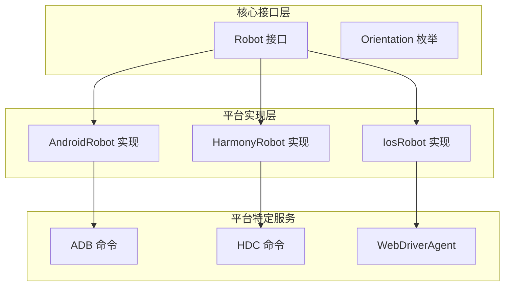

**图表来源**
- [src/robot.ts:48-147](file://src/robot.ts#L48-L147)
- [src/android.ts:74-504](file://src/android.ts#L74-L504)
- [src/ios.ts:42-232](file://src/ios.ts#L42-L232)
- [src/harmony.ts:43-416](file://src/harmony.ts#L43-L416)

**章节来源**
- [src/robot.ts:1-148](file://src/robot.ts#L1-L148)
- [README.md:175-190](file://README.md#L175-L190)

## 核心组件

### 方向接口定义

方向控制功能通过统一的 `Robot` 接口定义，该接口为所有平台提供一致的编程体验：

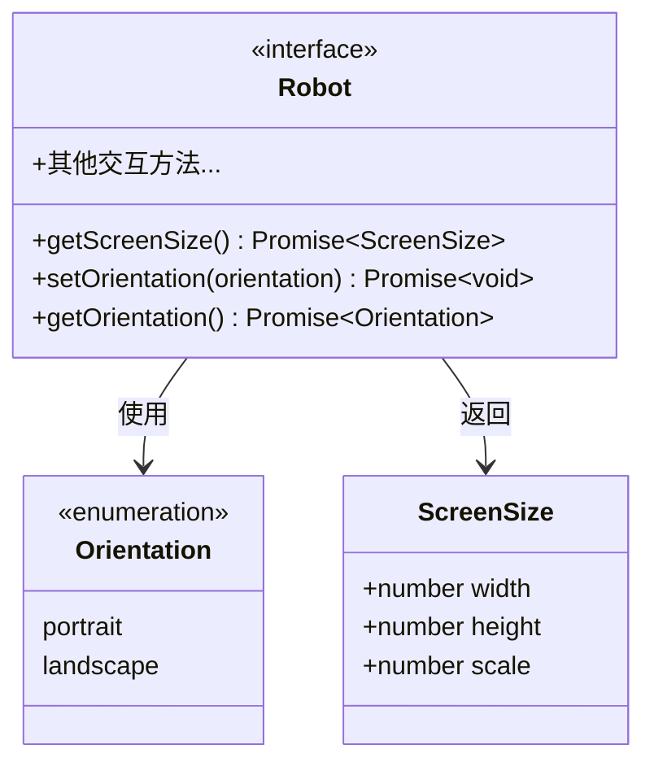

**图表来源**
- [src/robot.ts:46-47](file://src/robot.ts#L46-L47)
- [src/robot.ts:6-8](file://src/robot.ts#L6-L8)
- [src/robot.ts:141-146](file://src/robot.ts#L141-L146)

### 平台支持矩阵

| 平台 | setOrientation 支持 | getOrientation 支持 | 实现方式 |
|------|-------------------|-------------------|----------|
| Android | ✅ 完全支持 | ✅ 完全支持 | ADB + Settings API |
| iOS | ✅ 完全支持 | ✅ 完全支持 | WebDriverAgent |
| HarmonyOS | ❌ 不支持 | ✅ 支持 | HDC + DisplayManager |

**章节来源**
- [src/android.ts:453-464](file://src/android.ts#L453-L464)
- [src/ios.ts:223-231](file://src/ios.ts#L223-L231)
- [src/harmony.ts:413-415](file://src/harmony.ts#L413-L415)

## 架构概览

### 方向控制架构

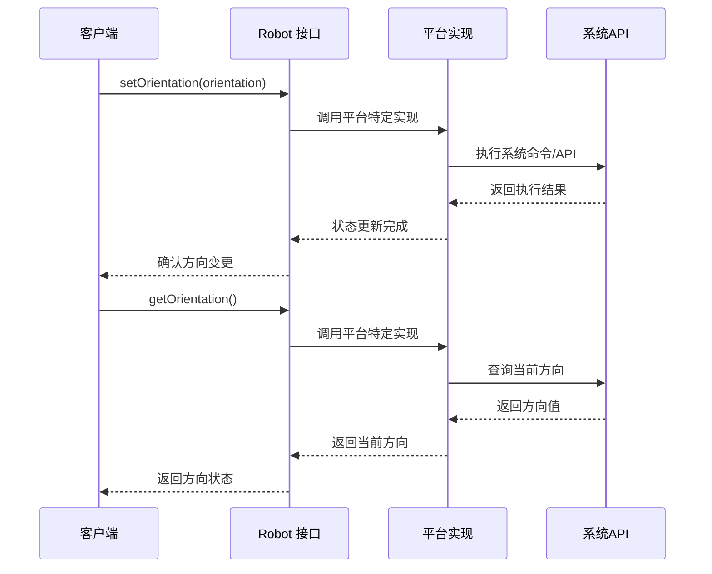

**图表来源**
- [src/robot.ts:141-146](file://src/robot.ts#L141-L146)
- [src/android.ts:453-464](file://src/android.ts#L453-L464)
- [src/ios.ts:223-231](file://src/ios.ts#L223-L231)
- [src/harmony.ts:401-411](file://src/harmony.ts#L401-L411)

### 数据流图

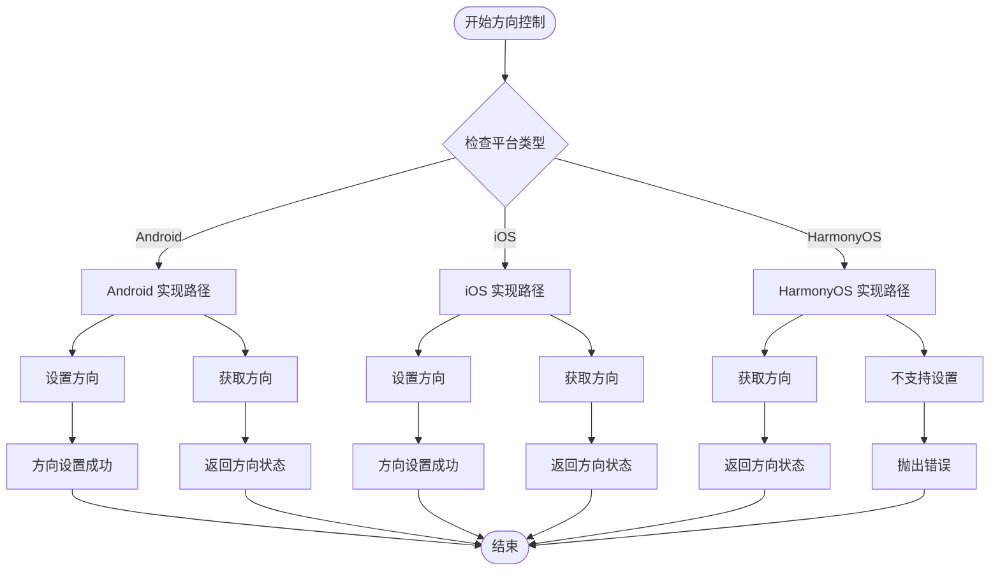

**图表来源**
- [src/android.ts:453-464](file://src/android.ts#L453-L464)
- [src/ios.ts:223-231](file://src/ios.ts#L223-L231)
- [src/harmony.ts:401-415](file://src/harmony.ts#L401-L415)

## 详细组件分析

### Android 平台实现

#### setOrientation() 方法实现

Android 平台的 `setOrientation()` 方法通过 ADB 命令直接操作系统的用户旋转设置：

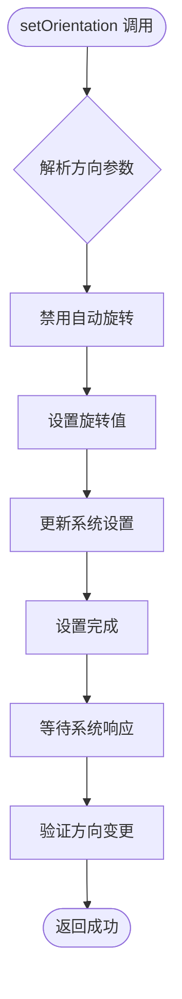

**图表来源**
- [src/android.ts:453-459](file://src/android.ts#L453-L459)

实现细节：
- 将方向参数转换为数值：`portrait` → 0，`landscape` → 1
- 禁用自动旋转以避免系统重置
- 通过 Content Provider 更新 `user_rotation` 设置

#### getOrientation() 方法实现

Android 平台的 `getOrientation()` 方法通过查询系统设置来获取当前方向：

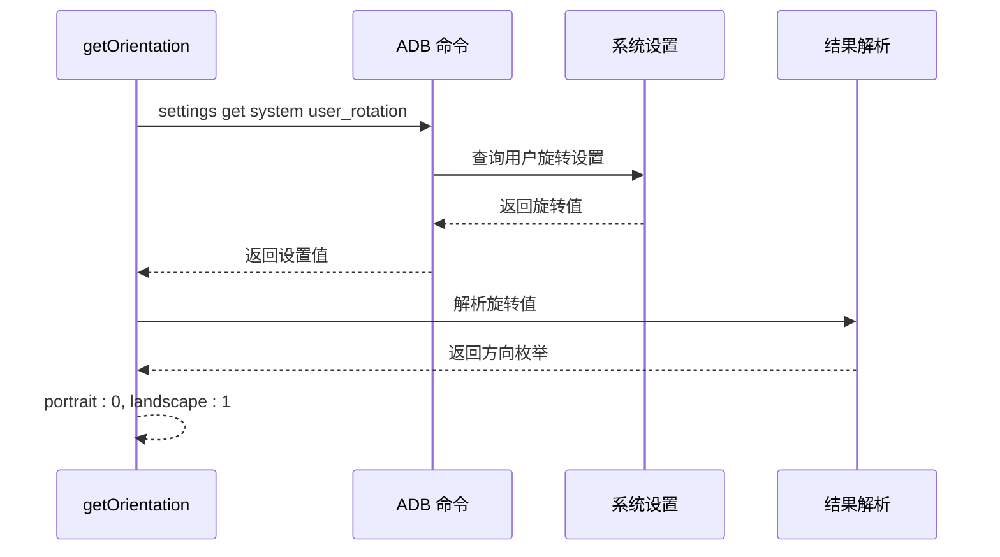

**图表来源**
- [src/android.ts:461-464](file://src/android.ts#L461-L464)

#### 旋转动画处理

Android 平台的方向切换涉及系统级的动画处理：

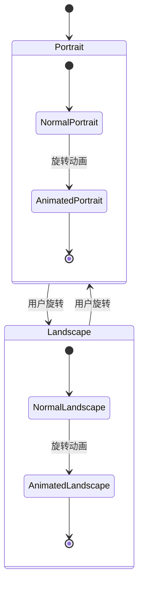

**图表来源**
- [src/android.ts:453-459](file://src/android.ts#L453-L459)

### iOS 平台实现

#### setOrientation() 方法实现

iOS 平台通过 WebDriverAgent 实现方向控制：

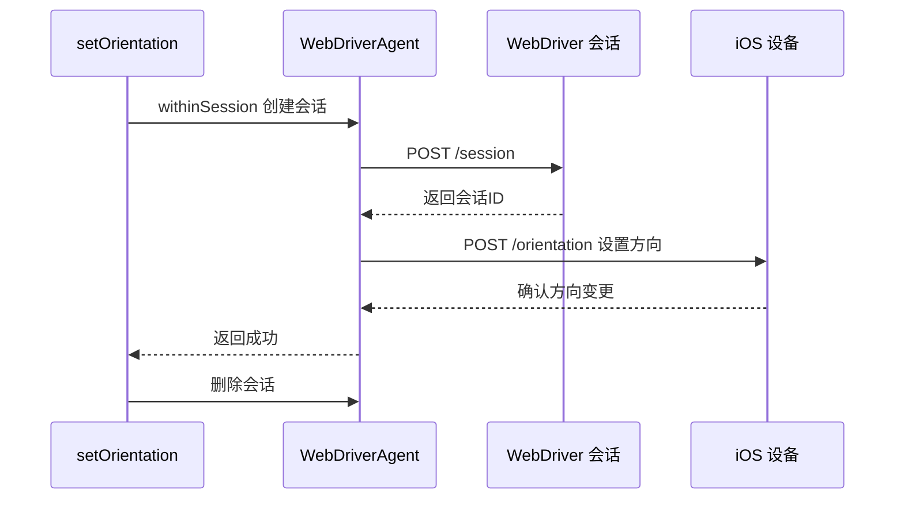

**图表来源**
- [src/webdriver-agent.ts:433-444](file://src/webdriver-agent.ts#L433-L444)

实现特点：
- 使用 WebDriver 协议的标准 `/orientation` 端点
- 自动管理会话生命周期
- 支持完整的方向枚举值（PORTRAIT、LANDSCAPE）

#### getOrientation() 方法实现

iOS 平台的 `getOrientation()` 方法同样通过 WebDriverAgent 实现：

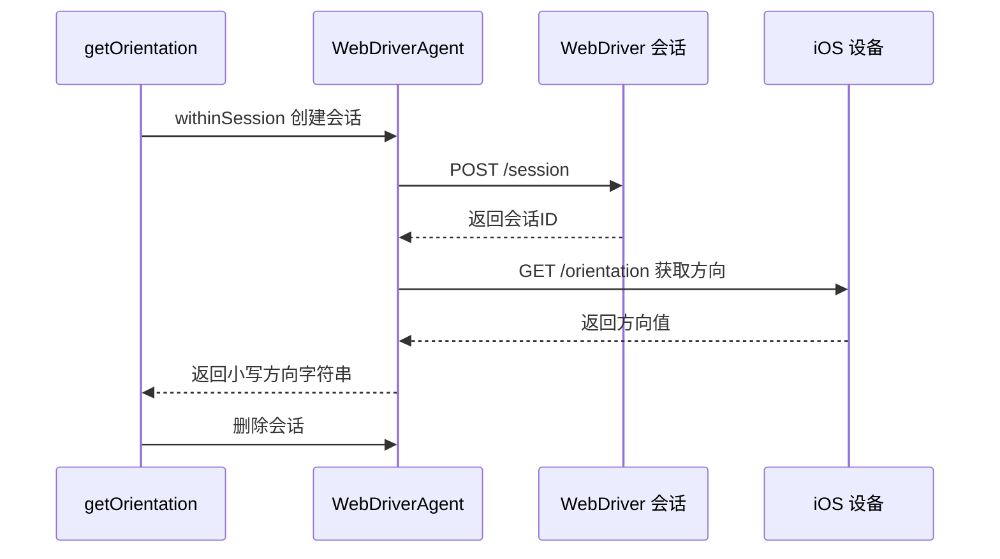

**图表来源**
- [src/webdriver-agent.ts:446-453](file://src/webdriver-agent.ts#L446-L453)

### HarmonyOS 平台实现

#### getOrientation() 方法实现

HarmonyOS 平台仅支持方向获取，不支持程序化设置：

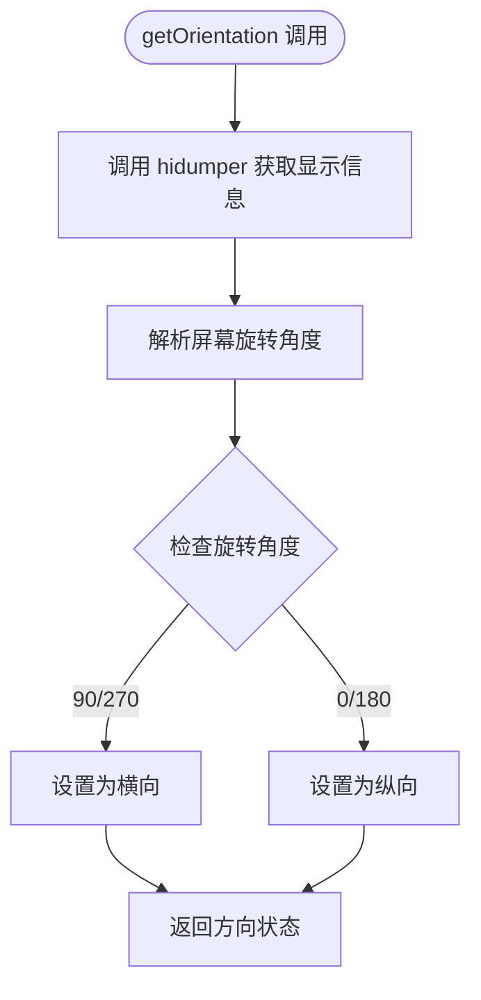

**图表来源**
- [src/harmony.ts:401-411](file://src/harmony.ts#L401-L411)

实现机制：
- 通过 `hidumper -s DisplayManagerService -a -a` 获取显示管理器信息
- 解析 `ScreenRotation` 字段获取当前旋转角度
- 根据角度判断方向：90°/270° → landscape，0°/180° → portrait

#### setOrientation() 方法限制

HarmonyOS 平台的 `setOrientation()` 方法明确不支持程序化设置：

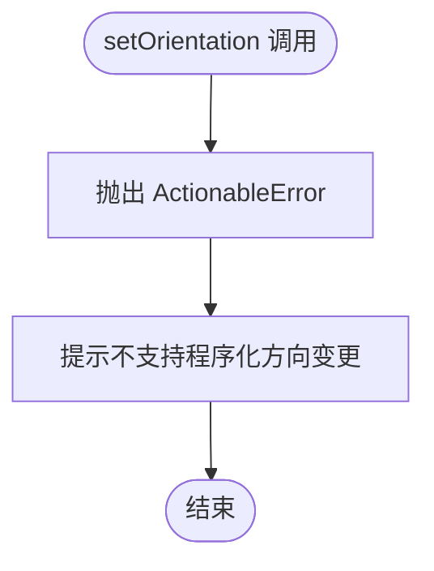

**图表来源**
- [src/harmony.ts:413-415](file://src/harmony.ts#L413-L415)

### 坐标系变换

不同平台的方向变化会影响坐标系变换：

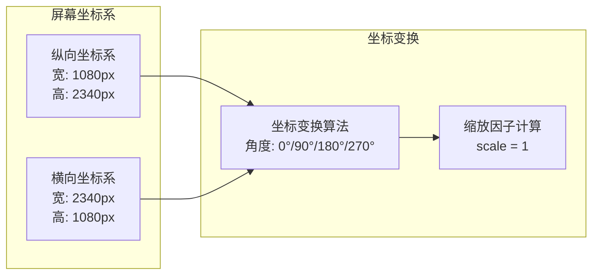

**图表来源**
- [src/android.ts:103-116](file://src/android.ts#L103-L116)
- [src/harmony.ts:55-69](file://src/harmony.ts#L55-L69)

## 依赖关系分析

### 平台特定依赖

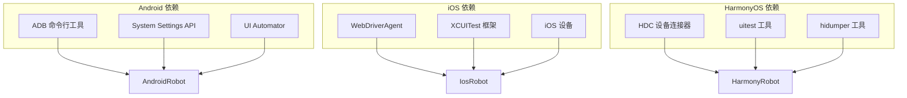

**图表来源**
- [src/android.ts:32-54](file://src/android.ts#L32-L54)
- [src/ios.ts:33-40](file://src/ios.ts#L33-L40)
- [src/harmony.ts:12-18](file://src/harmony.ts#L12-L18)

### 错误处理机制

各平台都实现了统一的错误处理机制：

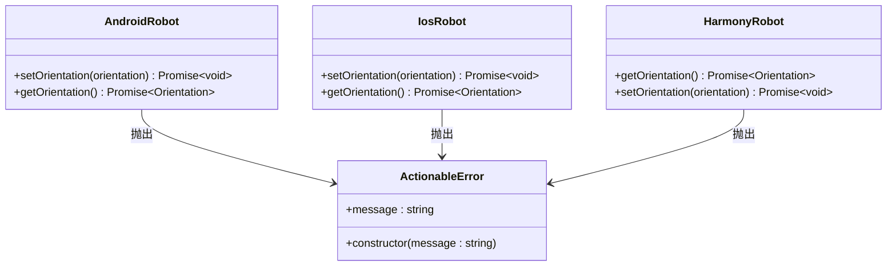

**图表来源**
- [src/robot.ts:40-44](file://src/robot.ts#L40-L44)
- [src/android.ts:453-459](file://src/android.ts#L453-L459)
- [src/ios.ts:223-231](file://src/ios.ts#L223-L231)
- [src/harmony.ts:413-415](file://src/harmony.ts#L413-L415)

**章节来源**
- [src/android.ts:453-464](file://src/android.ts#L453-L464)
- [src/ios.ts:223-231](file://src/ios.ts#L223-L231)
- [src/harmony.ts:401-415](file://src/harmony.ts#L401-L415)

## 性能考虑

### 命令执行优化

各平台的命令执行都经过了性能优化：

- **超时控制**：所有系统调用都有 30 秒超时限制
- **缓冲区大小**：设置最大 4MB 缓冲区防止内存溢出
- **静默模式**：提供静默 ADB 调用选项减少输出干扰

### 状态同步策略

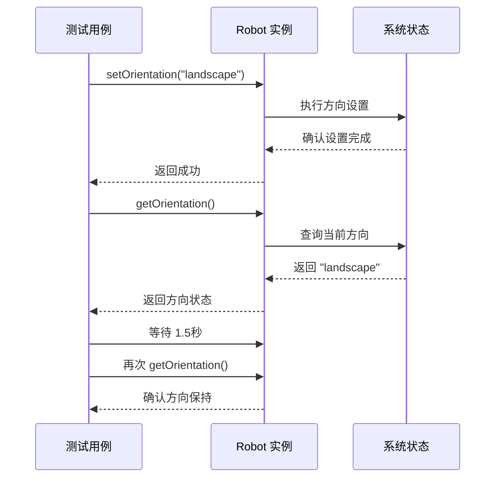

**图表来源**
- [test/android.ts:123-138](file://test/android.ts#L123-L138)

**章节来源**
- [src/android.ts:69-116](file://src/android.ts#L69-L116)
- [test/android.ts:115-138](file://test/android.ts#L115-L138)

## 故障排除指南

### 常见问题诊断

#### Android 平台问题

1. **ADB 命令失败**
   - 检查 `ANDROID_HOME` 环境变量
   - 确认设备已启用开发者选项和 USB 调试
   - 验证 ADB 版本兼容性

2. **方向设置不生效**
   - 检查应用是否强制锁定方向
   - 验证系统权限设置
   - 确认设备支持用户旋转

#### iOS 平台问题

1. **WebDriverAgent 连接失败**
   - 检查隧道服务状态
   - 验证端口转发配置
   - 确认 WebDriverAgent 已正确安装

2. **方向控制权限问题**
   - 检查设备的辅助功能权限
   - 验证应用的自动化权限
   - 确认测试账号权限

#### HarmonyOS 平台问题

1. **HDC 命令不可用**
   - 检查 `HDC_SDK_PATH` 环境变量
   - 验证 HDC 是否在 PATH 中
   - 确认设备已启用开发者选项

2. **方向检测失败**
   - 检查 `hidumper` 工具可用性
   - 验证 DisplayManagerService 状态
   - 确认设备支持显示信息查询

### 调试建议

1. **启用详细日志**
   ```bash
   export DEBUG=mobile-mcp*
   ```

2. **检查系统版本兼容性**
   - Android: API Level 16+
   - iOS: iOS 12+
   - HarmonyOS: HarmonyOS 3.0+

3. **验证设备连接状态**
   ```bash
   # Android
   adb devices
   
   # iOS
   ios list
   
   # HarmonyOS
   hdc list targets
   ```

**章节来源**
- [src/android.ts:32-54](file://src/android.ts#L32-L54)
- [src/ios.ts:69-92](file://src/ios.ts#L69-L92)
- [src/harmony.ts:12-18](file://src/harmony.ts#L12-L18)

## 结论

设备方向控制是移动设备自动化中的重要功能，该项目提供了跨平台的一致实现。通过统一的 `Robot` 接口，开发者可以轻松地在不同平台上实现方向控制功能。

### 关键特性总结

1. **跨平台一致性**：所有平台都实现了相同的接口契约
2. **平台特定优化**：针对各平台的系统特性进行了专门优化
3. **错误处理机制**：统一的错误处理和用户友好的错误消息
4. **性能优化**：合理的超时控制和资源管理

### 最佳实践建议

1. **方向变更后等待**：在调用 `setOrientation()` 后适当等待系统响应
2. **状态验证**：始终验证方向变更是否成功
3. **平台差异处理**：注意不同平台的限制和差异
4. **错误恢复**：实现适当的错误恢复机制

该实现为移动设备自动化提供了可靠的方向控制能力，支持多种应用场景，包括测试自动化、界面适配和用户体验优化等。