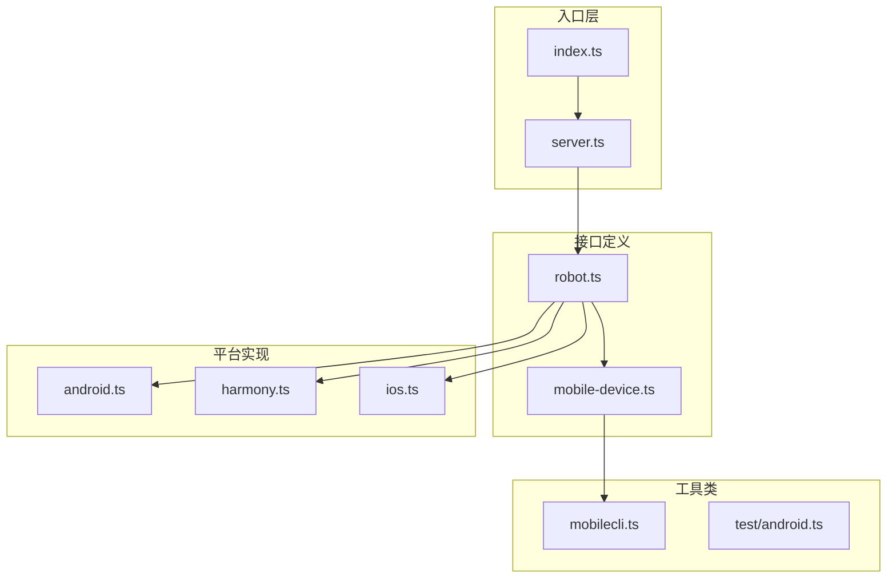
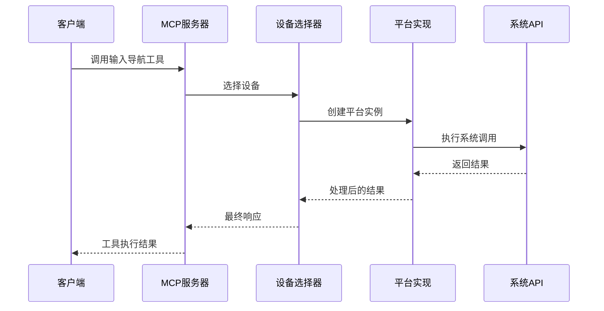
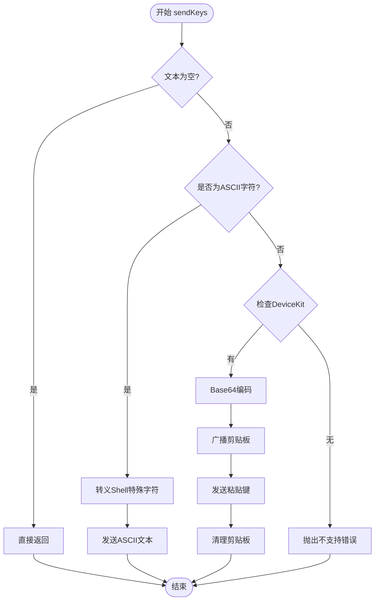
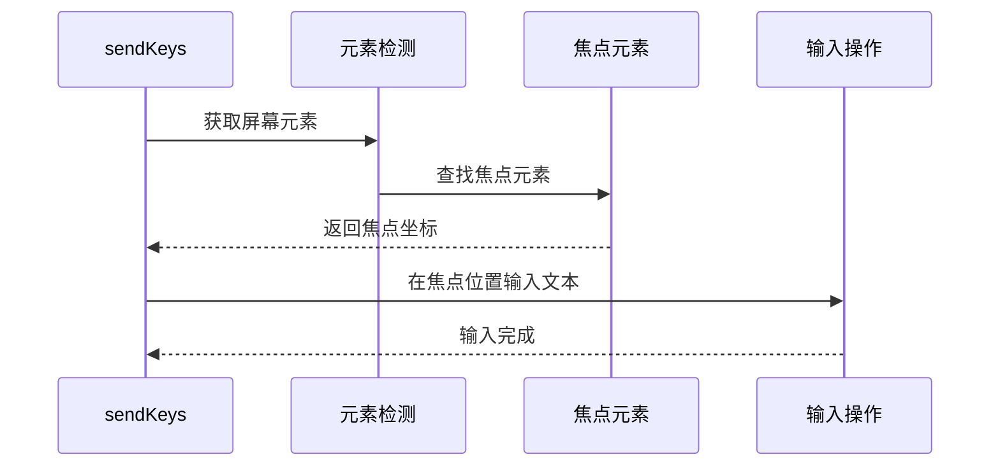
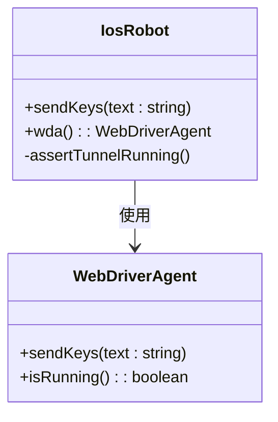
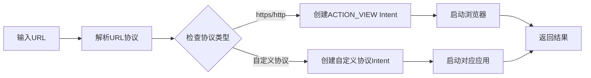
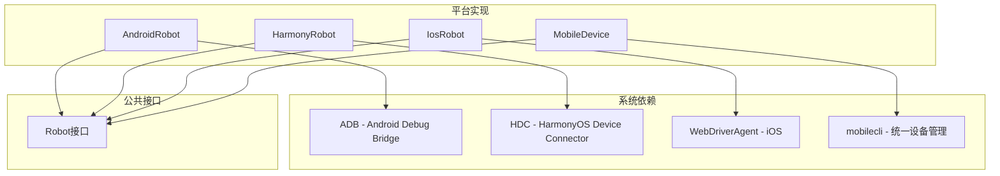
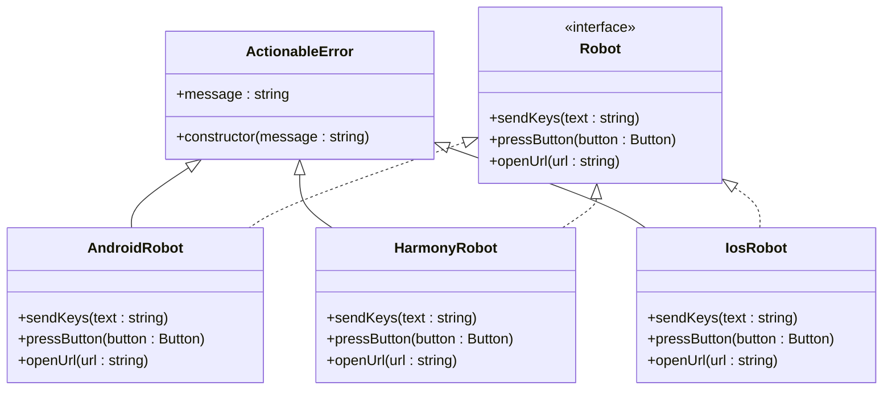

# 输入导航方法

<cite>
**本文档引用的文件**
- [src/index.ts](file://src/index.ts)
- [src/server.ts](file://src/server.ts)
- [src/robot.ts](file://src/robot.ts)
- [src/mobile-device.ts](file://src/mobile-device.ts)
- [src/mobilecli.ts](file://src/mobilecli.ts)
- [src/android.ts](file://src/android.ts)
- [src/harmony.ts](file://src/harmony.ts)
- [src/ios.ts](file://src/ios.ts)
- [test/android.ts](file://test/android.ts)
- [README.md](file://README.md)
</cite>

## 目录
1. [简介](#简介)
2. [项目结构](#项目结构)
3. [核心组件](#核心组件)
4. [架构概览](#架构概览)
5. [详细组件分析](#详细组件分析)
6. [依赖关系分析](#依赖关系分析)
7. [性能考虑](#性能考虑)
8. [故障排除指南](#故障排除指南)
9. [结论](#结论)
10. [附录](#附录)

## 简介
本指南专注于输入导航方法的实现，涵盖 sendKeys()、pressButton()、openUrl() 等核心功能。文档详细解释了文本输入的编码处理、按键映射表的构建、URL协议的解析和浏览器启动机制，并提供了各平台的输入模拟实现示例，包括键盘事件处理、物理按键映射和系统级导航操作。同时包含输入验证、字符集支持和国际化处理方案。

## 项目结构
该项目采用模块化设计，按平台分离核心功能：

**图表来源**
- [src/index.ts:1-67](file://src/index.ts#L1-L67)
- [src/server.ts:35-707](file://src/server.ts#L35-L707)
- [src/robot.ts:48-147](file://src/robot.ts#L48-L147)

**章节来源**
- [src/index.ts:1-67](file://src/index.ts#L1-L67)
- [src/server.ts:35-707](file://src/server.ts#L35-L707)
- [README.md:1-198](file://README.md#L1-L198)

## 核心组件
输入导航方法的核心接口定义在 Robot 接口中，提供了统一的抽象层：

### 核心接口定义
- **sendKeys(text: string)**: 发送文本到设备，模拟键盘输入
- **pressButton(button: Button)**: 模拟物理按键按下
- **openUrl(url: string)**: 在设备浏览器中打开URL

### 平台特定实现
每个平台都有专门的实现类：
- **AndroidRobot**: 基于ADB和UIAutomator
- **HarmonyRobot**: 基于HDC和uitest
- **IosRobot**: 基于WebDriverAgent
- **MobileDevice**: 基于mobilecli

**章节来源**
- [src/robot.ts:48-147](file://src/robot.ts#L48-L147)
- [src/android.ts:74-504](file://src/android.ts#L74-L504)
- [src/harmony.ts:43-416](file://src/harmony.ts#L43-L416)
- [src/ios.ts:42-232](file://src/ios.ts#L42-L232)

## 架构概览
系统采用分层架构，实现了平台无关的输入导航抽象：

**图表来源**
- [src/server.ts:149-197](file://src/server.ts#L149-L197)
- [src/android.ts:79-84](file://src/android.ts#L79-L84)
- [src/harmony.ts:48-53](file://src/harmony.ts#L48-L53)

## 详细组件分析

### sendKeys() 文本输入实现

#### Android 平台实现
Android平台的文本输入处理最为复杂，需要处理ASCII字符和非ASCII字符：

**图表来源**
- [src/android.ts:402-427](file://src/android.ts#L402-L427)

#### HarmonyOS 平台实现
HarmonyOS平台通过查找焦点元素来确定输入目标：

**图表来源**
- [src/harmony.ts:184-210](file://src/harmony.ts#L184-L210)

#### iOS 平台实现
iOS平台通过WebDriverAgent进行文本输入：

**图表来源**
- [src/ios.ts:179-182](file://src/ios.ts#L179-L182)
- [src/ios.ts:85-92](file://src/ios.ts#L85-L92)

**章节来源**
- [src/android.ts:402-427](file://src/android.ts#L402-L427)
- [src/harmony.ts:184-210](file://src/harmony.ts#L184-L210)
- [src/ios.ts:179-182](file://src/ios.ts#L179-L182)

### pressButton() 按键映射实现

#### Android 按键映射表
Android平台定义了完整的按键映射表：

| 按键类型 | Android KEYCODE |
|---------|----------------|
| HOME | KEYCODE_HOME |
| BACK | KEYCODE_BACK |
| VOLUME_UP | KEYCODE_VOLUME_UP |
| VOLUME_DOWN | KEYCODE_VOLUME_DOWN |
| ENTER | KEYCODE_ENTER |
| DPAD_CENTER | KEYCODE_DPAD_CENTER |
| DPAD_UP | KEYCODE_DPAD_UP |
| DPAD_DOWN | KEYCODE_DPAD_DOWN |
| DPAD_LEFT | KEYCODE_DPAD_LEFT |
| DPAD_RIGHT | KEYCODE_DPAD_RIGHT |

#### HarmonyOS 按键映射表
HarmonyOS平台的按键映射相对简化：

| 按键类型 | HarmonyOS Key |
|---------|--------------|
| HOME | Home |
| BACK | Back |
| ENTER | Enter |
| VOLUME_UP | VolumeUp |
| VOLUME_DOWN | VolumeDown |

**章节来源**
- [src/android.ts:56-67](file://src/android.ts#L56-L67)
- [src/harmony.ts:20-26](file://src/harmony.ts#L20-L26)

### openUrl() URL协议处理

#### Android URL处理
Android平台使用Intent机制打开URL：

**图表来源**
- [src/android.ts:384-386](file://src/android.ts#L384-L386)

#### HarmonyOS URL处理
HarmonyOS平台使用AA命令启动应用：

**章节来源**
- [src/android.ts:384-386](file://src/android.ts#L384-L386)
- [src/harmony.ts:290-292](file://src/harmony.ts#L290-L292)

## 依赖关系分析

### 平台依赖关系

**图表来源**
- [src/android.ts:32-54](file://src/android.ts#L32-L54)
- [src/harmony.ts:12-18](file://src/harmony.ts#L12-L18)
- [src/mobilecli.ts:53-92](file://src/mobilecli.ts#L53-L92)

### 错误处理机制
系统实现了统一的ActionableError异常处理：

**图表来源**
- [src/robot.ts:40-44](file://src/robot.ts#L40-L44)
- [src/android.ts:429-436](file://src/android.ts#L429-L436)
- [src/harmony.ts:212-219](file://src/harmony.ts#L212-L219)

**章节来源**
- [src/robot.ts:40-44](file://src/robot.ts#L40-L44)
- [src/server.ts:79-94](file://src/server.ts#L79-L94)

## 性能考虑
1. **缓冲区大小控制**: 所有平台都设置了最大缓冲区限制(4MB)，防止内存溢出
2. **超时机制**: 默认超时时间为30秒，避免长时间阻塞
3. **图像处理优化**: 支持JPEG格式缩放，减少内存占用
4. **平台特定优化**: 
   - Android使用ADB批量命令
   - HarmonyOS使用HDC直接连接
   - iOS通过WebDriverAgent缓存

## 故障排除指南

### 常见问题及解决方案

#### Android平台
1. **非ASCII字符不支持**
   - 解决方案: 安装DeviceKit或使用ASCII字符
   - 错误信息: "Non-ASCII text is not supported on Android"

2. **ADB命令失败**
   - 检查ANDROID_HOME环境变量
   - 确认设备已启用开发者选项和USB调试

#### HarmonyOS平台
1. **HDC命令不可用**
   - 解决方案: 设置HDC_SDK_PATH环境变量
   - 或将hdc添加到PATH中

2. **uitest服务未启动**
   - 需要确保设备支持uitest功能

#### iOS平台
1. **WebDriverAgent未运行**
   - 需要启动WebDriverAgent服务
   - 检查端口转发配置

**章节来源**
- [src/android.ts:424-426](file://src/android.ts#L424-L426)
- [src/harmony.ts:12-18](file://src/harmony.ts#L12-L18)
- [src/ios.ts:69-92](file://src/ios.ts#L69-L92)

## 结论
该输入导航方法实现提供了跨平台的一致性体验，通过统一的Robot接口抽象，屏蔽了不同平台的差异。Android平台在文本输入方面最为复杂，提供了完善的ASCII和非ASCII字符处理；HarmonyOS平台实现了简洁高效的输入机制；iOS平台通过WebDriverAgent提供了稳定的自动化能力。整体架构设计合理，错误处理完善，为多平台移动设备自动化提供了坚实的基础。

## 附录

### 支持的平台和功能对比

| 功能 | Android | HarmonyOS | iOS |
|------|---------|-----------|-----|
| sendKeys | ✅ ASCII/非ASCII | ✅ 焦点元素定位 | ✅ WebDriverAgent |
| pressButton | ✅ 完整映射 | ✅ 基础映射 | ✅ 映射支持 |
| openUrl | ✅ Intent机制 | ✅ AA命令 | ✅ WebDriverAgent |
| 屏幕截图 | ✅ PNG/JPEG | ✅ JPEG | ✅ PNG |
| 元素检测 | ✅ UIAutomator | ✅ Layout Dump | ✅ Accessibility |

### 开发建议
1. **字符编码**: 始终使用UTF-8编码处理文本
2. **按键映射**: 优先使用平台提供的标准映射表
3. **错误处理**: 实现统一的异常捕获和重试机制
4. **性能优化**: 合理设置超时时间和缓冲区大小
5. **平台适配**: 针对不同平台特性进行优化