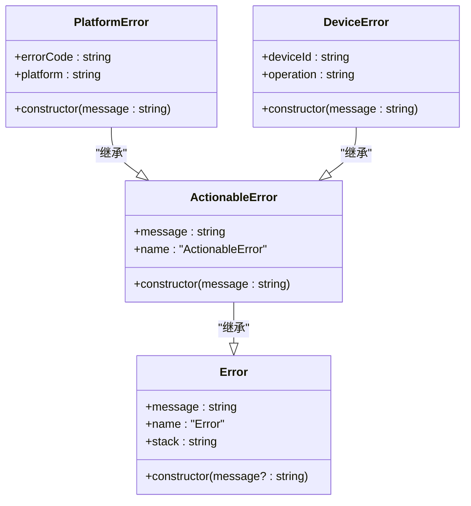
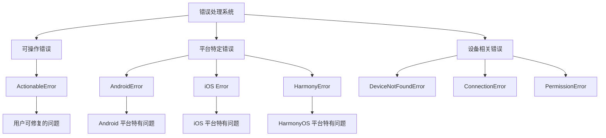
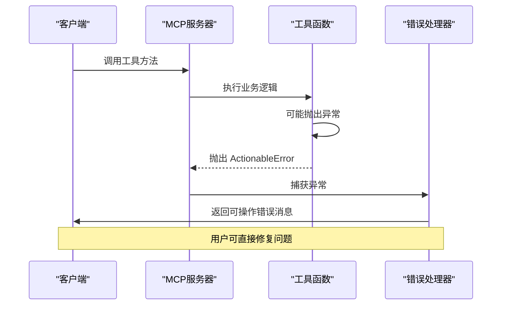
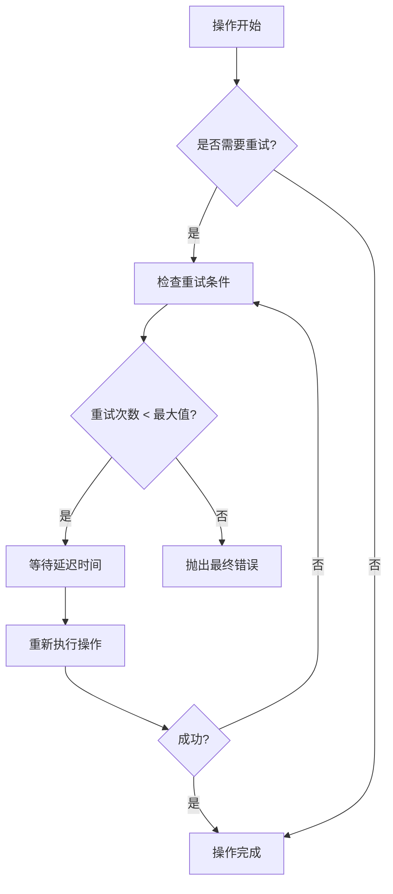
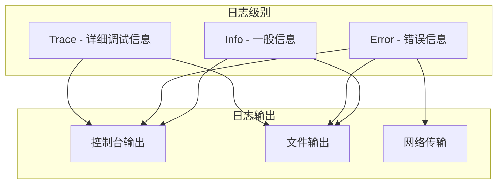
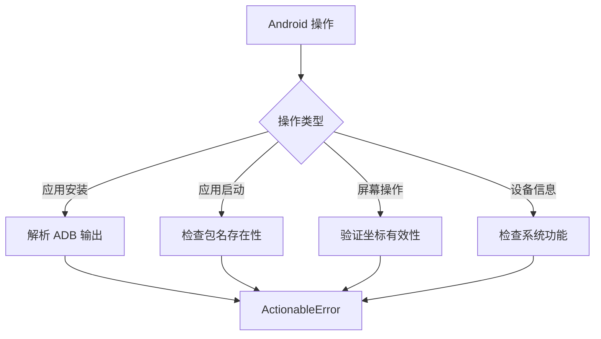
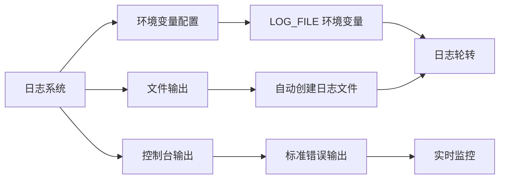
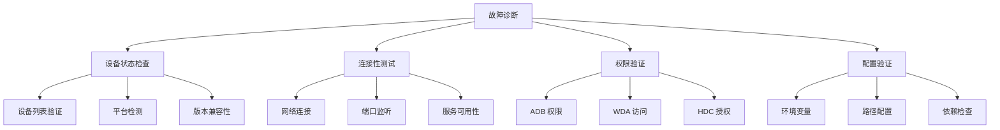

# 错误处理模式

<cite>
**本文档引用的文件**
- [robot.ts](file://src/robot.ts)
- [server.ts](file://src/server.ts)
- [logger.ts](file://src/logger.ts)
- [android.ts](file://src/android.ts)
- [ios.ts](file://src/ios.ts)
- [harmony.ts](file://src/harmony.ts)
- [mobilecli.ts](file://src/mobilecli.ts)
- [index.ts](file://src/index.ts)
- [package.json](file://package.json)
- [README.md](file://README.md)
</cite>

## 目录
1. [简介](#简介)
2. [ActionableError 异常类设计](#actionableerror-异常类设计)
3. [错误分类策略](#错误分类策略)
4. [异常传播机制](#异常传播机制)
5. [错误恢复方案](#错误恢复方案)
6. [调试信息收集](#调试信息收集)
7. [平台特定错误处理](#平台特定错误处理)
8. [错误日志记录](#错误日志记录)
9. [用户友好错误消息](#用户友好错误消息)
10. [故障诊断工具](#故障诊断工具)
11. [最佳实践建议](#最佳实践建议)
12. [总结](#总结)

## 简介

本项目实现了完整的错误处理模式，通过 ActionableError 异常类为核心，建立了统一的错误分类、传播和恢复机制。该系统支持 iOS、Android 和 HarmonyOS 三大移动平台，为 MCP（Model Context Protocol）服务器提供了可靠的错误处理框架。

错误处理模式的核心目标是：
- 提供可操作的错误信息，帮助用户快速定位和解决问题
- 实现优雅的异常传播，避免系统崩溃
- 收集详细的调试信息用于问题诊断
- 为不同平台提供一致的错误处理体验

## ActionableError 异常类设计

### 设计理念

ActionableError 是本项目错误处理系统的核心组件，其设计理念基于以下原则：



**图表来源**
- [robot.ts:40-44](file://src/robot.ts#L40-L44)

### 核心特性

1. **轻量级设计**：继承自原生 Error 对象，保持最小实现复杂度
2. **可操作性**：错误消息包含明确的解决方案指导
3. **平台无关**：适用于所有支持的移动平台
4. **可扩展性**：支持派生出更具体的错误类型

**章节来源**
- [robot.ts:40-44](file://src/robot.ts#L40-L44)

## 错误分类策略

### 错误类型层次结构

项目采用分层错误分类策略，将错误分为三个主要类别：



### 错误分类标准

| 错误类别 | 分类标准 | 示例场景 | 处理策略 |
|---------|---------|---------|---------|
| 可操作错误 | 用户可以修复的问题 | 参数错误、配置问题 | 提供具体修复指导 |
| 平台特定错误 | 平台相关限制或问题 | 权限不足、版本不兼容 | 平台特定的解决方案 |
| 设备相关错误 | 设备连接或状态问题 | 设备离线、连接失败 | 设备状态检查和重试 |

**章节来源**
- [server.ts:79-94](file://src/server.ts#L79-L94)
- [android.ts:142-148](file://src/android.ts#L142-L148)
- [ios.ts:72-89](file://src/ios.ts#L72-L89)
- [harmony.ts:112-117](file://src/harmony.ts#L112-L117)

## 异常传播机制

### 服务器级异常处理

MCP 服务器实现了统一的异常处理机制，确保所有工具调用都能得到一致的错误响应：



**图表来源**
- [server.ts:62-95](file://src/server.ts#L62-L95)

### 异常处理流程

异常处理遵循以下流程：

1. **捕获阶段**：所有工具调用都在 try-catch 块中执行
2. **识别阶段**：区分 ActionableError 和其他异常类型
3. **转换阶段**：将异常转换为用户友好的消息格式
4. **返回阶段**：通过 MCP 协议返回标准化的错误响应

**章节来源**
- [server.ts:69-94](file://src/server.ts#L69-L94)

## 错误恢复方案

### 自动重试机制

某些操作实现了智能重试策略：



### 平台特定恢复策略

| 平台 | 恢复策略 | 实现方式 |
|------|---------|---------|
| Android | ADB 服务重启、权限检查 | 自动检测 ADB 状态并尝试重启 |
| iOS | WebDriverAgent 重启、隧道检查 | 检测 WDA 状态并自动重启 |
| HarmonyOS | HDC 服务检查、设备重连 | 验证 HDC 可用性并重新连接 |

**章节来源**
- [android.ts:467-481](file://src/android.ts#L467-L481)
- [ios.ts:69-92](file://src/ios.ts#L69-L92)
- [harmony.ts:115-117](file://src/harmony.ts#L115-L117)

## 调试信息收集

### 日志记录系统

系统实现了多层次的日志记录机制：



**图表来源**
- [logger.ts:3-21](file://src/logger.ts#L3-L21)

### 调试信息包含内容

1. **时间戳**：精确到毫秒的时间标记
2. **错误上下文**：操作参数和环境信息
3. **堆栈跟踪**：完整的调用链信息
4. **设备信息**：平台、版本、设备标识
5. **性能指标**：执行时间和资源使用情况

**章节来源**
- [logger.ts:15-21](file://src/logger.ts#L15-L21)
- [server.ts:87-88](file://src/server.ts#L87-L88)

## 平台特定错误处理

### Android 平台错误处理

Android 平台实现了全面的错误处理机制：

#### 权限和配置错误
- **ADB 路径配置错误**：自动检测 ANDROID_HOME 环境变量
- **设备连接问题**：检查 ADB 服务状态和设备授权
- **应用安装失败**：解析 ADB 输出获取具体错误原因

#### 特定操作错误处理



**图表来源**
- [android.ts:362-371](file://src/android.ts#L362-L371)
- [android.ts:142-148](file://src/android.ts#L142-L148)

**章节来源**
- [android.ts:142-148](file://src/android.ts#L142-L148)
- [android.ts:362-371](file://src/android.ts#L362-L371)
- [android.ts:424-427](file://src/android.ts#L424-L427)

### iOS 平台错误处理

iOS 平台的错误处理重点关注连接和认证问题：

#### 连接层错误
- **iOS 隧道未运行**：检测 iOS 17+ 的隧道要求
- **WebDriverAgent 未启动**：自动检测和重启 WDA
- **端口转发失败**：检查本地端口占用情况

#### 设备管理错误
- **go-ios 工具缺失**：提供安装指导和替代方案
- **设备列表获取失败**：降级到基本设备信息获取

**章节来源**
- [ios.ts:69-92](file://src/ios.ts#L69-L92)
- [ios.ts:150-172](file://src/ios.ts#L150-L172)
- [ios.ts:234-293](file://src/ios.ts#L234-L293)

### HarmonyOS 平台错误处理

HarmonyOS 作为新平台，实现了独特的错误处理策略：

#### 设备发现错误
- **HDC 工具不可用**：自动检测 HDC 可执行文件路径
- **设备列表获取失败**：提供环境变量配置指导
- **SDK 路径配置错误**：支持 HDC_SDK_PATH 环境变量

#### 操作执行错误
- **UI 操作失败**：检查 uitest 工具状态
- **布局信息获取失败**：提供备用获取方法
- **屏幕截图失败**：检查 snapshot_display 工具

**章节来源**
- [harmony.ts:12-18](file://src/harmony.ts#L12-L18)
- [harmony.ts:268-288](file://src/harmony.ts#L268-L288)
- [harmony.ts:294-332](file://src/harmony.ts#L294-L332)

## 错误日志记录

### 日志配置和管理

系统提供了灵活的日志配置选项：



**图表来源**
- [logger.ts:3-13](file://src/logger.ts#L3-L13)

### 日志格式规范

所有日志输出遵循统一格式：

```
[YYYY-MM-DDTHH:mm:ss.sssZ] LEVEL message
```

其中包含：
- **时间戳**：ISO 8601 格式，包含时区信息
- **级别**：INFO、ERROR、DEBUG 等日志级别
- **消息**：具体的日志内容

**章节来源**
- [logger.ts:3-21](file://src/logger.ts#L3-L21)

## 用户友好错误消息

### 错误消息设计原则

用户友好的错误消息遵循以下设计原则：

1. **明确性**：清楚说明发生了什么问题
2. **可操作性**：提供具体的解决步骤
3. **简洁性**：避免技术术语，使用通俗语言
4. **上下文相关**：包含相关的环境信息

### 错误消息模板

| 错误类型 | 消息模板 | 示例 |
|---------|---------|------|
| 设备未找到 | `设备 "${deviceId}" 未找到。请使用 mobile_list_available_devices 工具查看可用设备。` | 设备 12345 未找到。请使用 mobile_list_available_devices 工具查看可用设备。 |
| 权限不足 | `权限不足，请检查 ${platform} 设备的开发者选项和授权设置。` | 权限不足，请检查 Android 设备的开发者选项和授权设置。 |
| 操作超时 | `操作超时，请检查网络连接和设备状态，然后重试。` | 操作超时，请检查网络连接和设备状态，然后重试。 |
| 配置错误 | `配置错误：${errorMessage}。请检查环境变量和路径设置。` | 配置错误：HDC 工具未找到。请检查环境变量和路径设置。 |

**章节来源**
- [server.ts:82-84](file://src/server.ts#L82-L84)
- [server.ts:196](file://src/server.ts#L196)
- [ios.ts:72-89](file://src/ios.ts#L72-L89)

## 故障诊断工具

### 内置诊断功能

系统提供了多种内置的故障诊断工具：



### 诊断报告生成

系统能够自动生成详细的诊断报告，包含：

1. **系统信息**：操作系统、Node.js 版本、依赖版本
2. **设备信息**：已连接设备列表、设备状态
3. **配置信息**：环境变量、路径设置、权限配置
4. **错误历史**：最近的错误记录和处理结果

**章节来源**
- [server.ts:207-294](file://src/server.ts#L207-L294)
- [android.ts:551-591](file://src/android.ts#L551-L591)
- [ios.ts:258-293](file://src/ios.ts#L258-L293)
- [harmony.ts:418-461](file://src/harmony.ts#L418-L461)

## 最佳实践建议

### 错误处理最佳实践

基于项目实现的经验，提出以下最佳实践建议：

#### 1. 错误分类和处理

- **区分可恢复和不可恢复错误**：根据错误类型决定是否重试
- **提供具体的错误上下文**：包含操作参数、设备信息等
- **实现渐进式降级**：在部分功能失败时提供替代方案

#### 2. 用户体验优化

- **及时反馈**：在操作开始前告知用户可能的等待时间
- **清晰的错误消息**：避免技术术语，提供可操作的解决方案
- **进度指示**：对于耗时操作显示进度信息

#### 3. 调试和监控

- **完整的日志记录**：记录所有重要操作和错误信息
- **性能监控**：跟踪操作执行时间和资源使用
- **错误统计**：收集错误类型分布，识别常见问题

#### 4. 平台适配

- **平台特定的错误处理**：针对不同平台实现专门的错误处理逻辑
- **环境检测**：自动检测和配置平台相关的依赖工具
- **兼容性处理**：处理不同平台版本间的差异

## 总结

本项目的错误处理模式通过 ActionableError 异常类实现了统一的错误管理机制，为多平台移动设备自动化提供了可靠的技术基础。系统的关键优势包括：

1. **统一的错误模型**：ActionableError 提供了简洁而强大的错误处理基础
2. **平台无关的设计**：错误处理逻辑可以在不同平台上复用
3. **用户友好的体验**：错误消息设计注重用户体验和可操作性
4. **完善的调试支持**：提供了丰富的日志记录和诊断工具
5. **可扩展的架构**：支持未来添加新的错误类型和处理策略

通过实施这些错误处理模式，项目能够为用户提供稳定、可靠且易于使用的移动设备自动化服务，同时为开发者提供了清晰的错误处理参考和最佳实践指导。