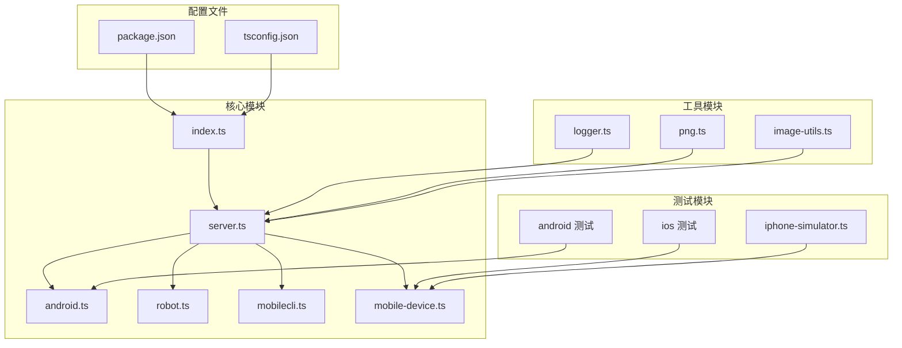
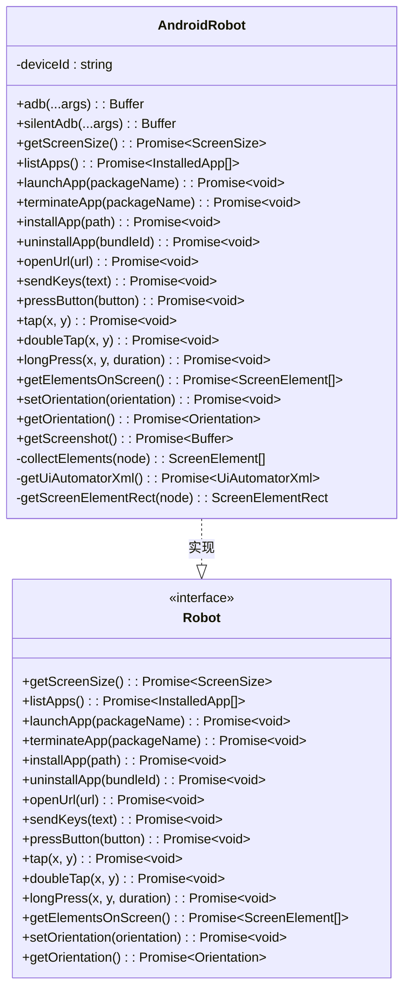
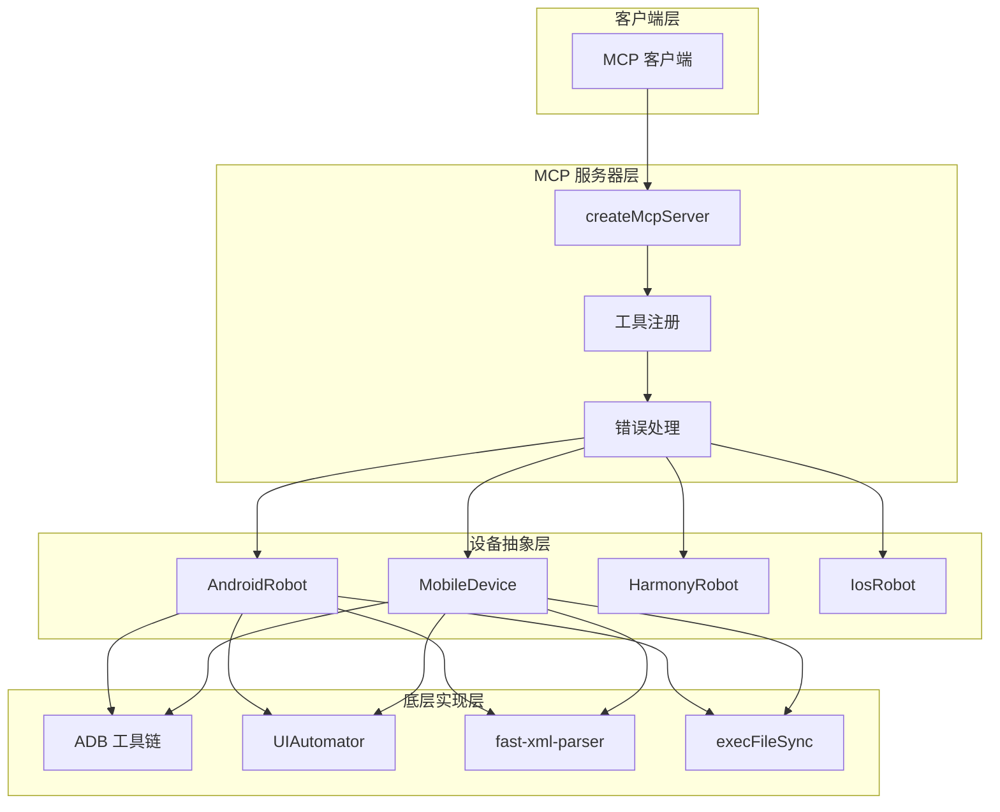
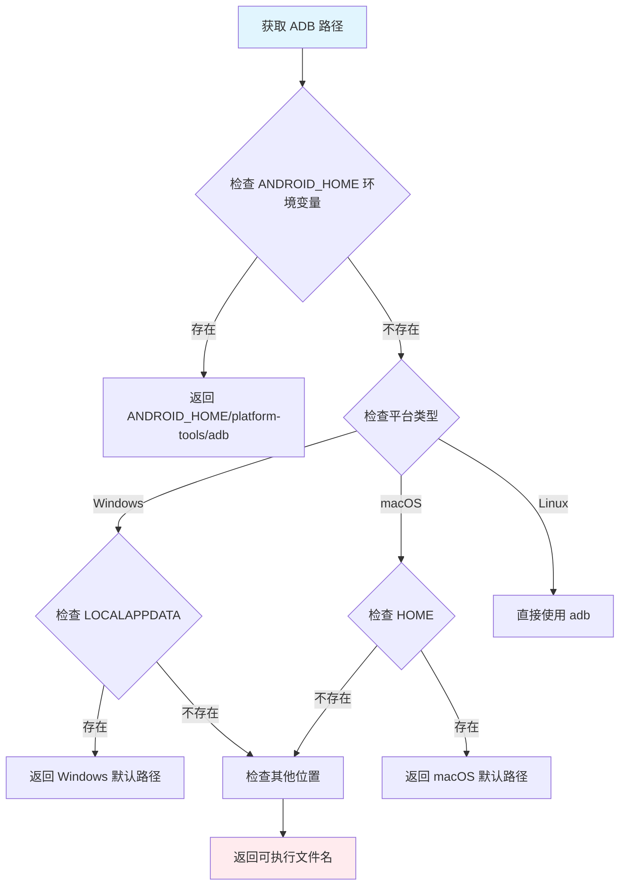
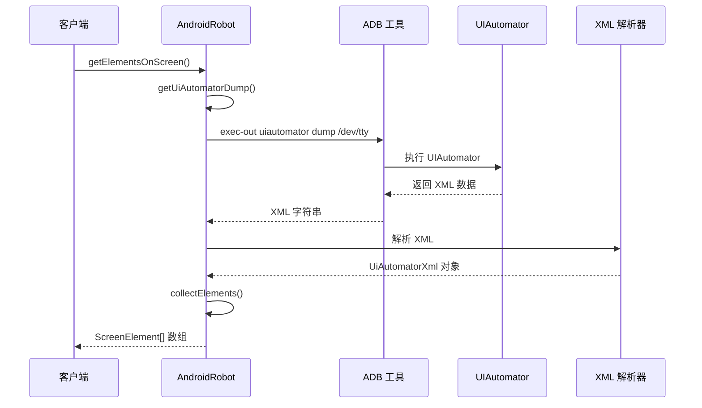
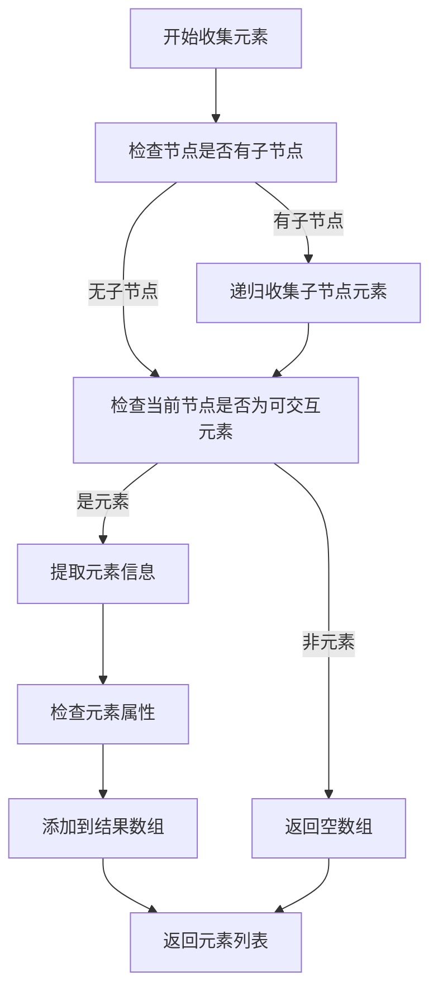
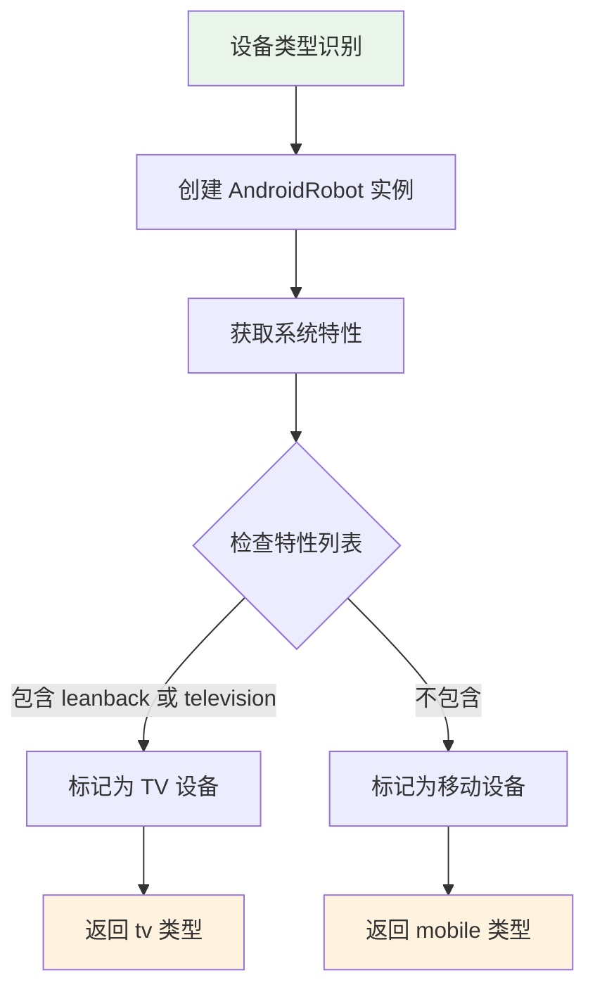
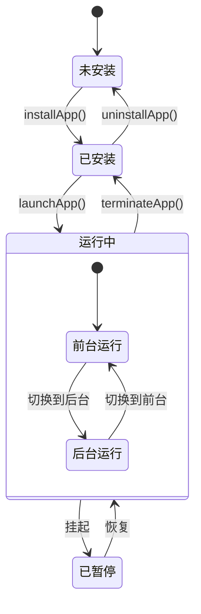
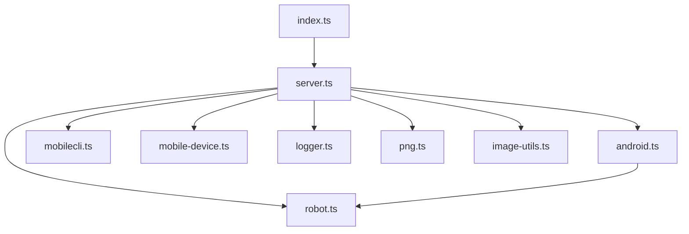

# Android 平台集成

<cite>
**本文档引用的文件**
- [android.ts](file://src/android.ts)
- [robot.ts](file://src/robot.ts)
- [server.ts](file://src/server.ts)
- [mobilecli.ts](file://src/mobilecli.ts)
- [mobile-device.ts](file://src/mobile-device.ts)
- [logger.ts](file://src/logger.ts)
- [index.ts](file://src/index.ts)
- [package.json](file://package.json)
- [README.md](file://README.md)
- [android 测试](file://test/android.ts)
</cite>

## 目录
1. [简介](#简介)
2. [项目结构](#项目结构)
3. [核心组件](#核心组件)
4. [架构概览](#架构概览)
5. [详细组件分析](#详细组件分析)
6. [依赖关系分析](#依赖关系分析)
7. [性能考虑](#性能考虑)
8. [故障排除指南](#故障排除指南)
9. [结论](#结论)
10. [附录](#附录)

## 简介

本指南详细说明了 Android 平台在移动 MCP 项目中的完整集成实施方案。该项目是一个基于 Model Context Protocol (MCP) 的服务器，提供跨平台的移动端自动化能力，支持 iOS、Android 和 HarmonyOS 设备的统一自动化接口。

Android 平台的实现主要通过 ADB (Android Debug Bridge) 工具链和 UIAutomator 框架，为 Agent/LMM 提供统一的设备交互接口。本文档涵盖了从环境搭建到具体实现的完整流程。

## 项目结构

项目采用模块化设计，核心文件组织如下：



**图表来源**
- [index.ts:1-67](file://src/index.ts#L1-L67)
- [server.ts:1-708](file://src/server.ts#L1-L708)
- [android.ts:1-593](file://src/android.ts#L1-L593)

**章节来源**
- [package.json:1-74](file://package.json#L1-L74)
- [README.md:1-198](file://README.md#L1-L198)

## 核心组件

### AndroidRobot 类架构

AndroidRobot 是 Android 平台的核心实现类，实现了 Robot 接口的所有功能：



**图表来源**
- [android.ts:74-504](file://src/android.ts#L74-L504)
- [robot.ts:48-147](file://src/robot.ts#L48-L147)

### AndroidDeviceManager 设备管理器

负责 Android 设备的发现和类型识别：

```mermaid
classDiagram
class AndroidDeviceManager {
+getConnectedDevices() : AndroidDevice[]
+getConnectedDevicesWithDetails() : AndroidDevice & {version, name}[]
-getDeviceType(name) : AndroidDeviceType
-getDeviceVersion(deviceId) : string
-getDeviceName(deviceId) : string
}
class AndroidDevice {
+deviceId : string
+deviceType : "tv" | "mobile"
}
AndroidDeviceManager --> AndroidDevice : 创建
```

**图表来源**
- [android.ts:506-592](file://src/android.ts#L506-L592)

**章节来源**
- [android.ts:74-592](file://src/android.ts#L74-L592)
- [robot.ts:48-147](file://src/robot.ts#L48-L147)

## 架构概览

系统采用分层架构设计，通过统一的 MCP 服务器接口对外提供服务：



**图表来源**
- [server.ts:35-707](file://src/server.ts#L35-L707)
- [android.ts:74-504](file://src/android.ts#L74-L504)
- [mobile-device.ts:62-216](file://src/mobile-device.ts#L62-L216)

## 详细组件分析

### ADB 工具链集成

#### ADB 路径解析机制

系统提供了多平台的 ADB 路径解析策略：



**图表来源**
- [android.ts:32-54](file://src/android.ts#L32-L54)

#### ADB 命令执行封装

AndroidRobot 提供了两种 ADB 命令执行模式：

1. **普通模式** (`adb`): 显示标准输出和错误输出
2. **静默模式** (`silentAdb`): 将标准输出和错误输出重定向到管道

**章节来源**
- [android.ts:79-92](file://src/android.ts#L79-L92)

### UIAutomator 集成

#### UI 层级树解析

系统通过 UIAutomator 获取屏幕元素的层级结构：



**图表来源**
- [android.ts:466-491](file://src/android.ts#L466-L491)

#### 元素收集算法



**图表来源**
- [android.ts:312-349](file://src/android.ts#L312-L349)

**章节来源**
- [android.ts:312-491](file://src/android.ts#L312-L491)

### 设备管理功能

#### 设备类型识别

系统能够自动识别设备类型（手机/电视）：



**图表来源**
- [android.ts:508-516](file://src/android.ts#L508-L516)

#### 设备信息获取

系统提供详细的设备信息获取功能：

- **设备版本**: 通过 `getprop ro.build.version.release` 获取
- **设备名称**: 优先获取 AVD 名称，失败则获取产品型号
- **设备 ID**: 通过 ADB devices 命令获取

**章节来源**
- [android.ts:518-549](file://src/android.ts#L518-L549)

### 应用控制功能

#### 应用生命周期管理



**图表来源**
- [android.ts:142-382](file://src/android.ts#L142-L382)

#### 应用列表获取

系统通过多种方式获取已安装应用：

1. **启动器活动方式**: 获取具有 MAIN 启动器活动的应用
2. **包管理器方式**: 获取所有已安装的包
3. **去重处理**: 确保每个包名只出现一次

**章节来源**
- [android.ts:118-140](file://src/android.ts#L118-L140)

### 输入和交互功能

#### 触摸操作实现

系统支持多种触摸操作：

| 操作类型 | 方法 | 参数 | 描述 |
|---------|------|------|------|
| 点击 | `tap(x, y)` | 坐标 | 在指定坐标点击 |
| 双击 | `doubleTap(x, y)` | 坐标 | 在指定坐标双击 |
| 长按 | `longPress(x, y, duration)` | 坐标+持续时间 | 在指定坐标长按 |
| 滑动 | `swipe(direction)` | 方向 | 在屏幕中心滑动 |
| 坐标滑动 | `swipeFromCoordinate(x, y, direction, distance)` | 起始坐标+方向+距离 | 从指定坐标滑动 |

**章节来源**
- [android.ts:159-451](file://src/android.ts#L159-L451)

#### 文本输入处理

系统提供了智能的文本输入处理机制：

```mermaid
flowchart TD
A[sendKeys(text)] --> B{文本是否为空}
B --> |是| C[直接返回]
B --> |否| D{是否为 ASCII 字符}
D --> |是| E[转义特殊字符并发送]
D --> |否| F{设备是否安装 DeviceKit}
F --> |是| G[Base64 编码并通过剪贴板发送]
F --> |否| H[抛出 ActionableError]
style A fill:#e3f2fd
style C fill:#e8f5e8
style E fill:#fff3e0
style G fill:#fff3e0
style H fill:#ffebee
```

**图表来源**
- [android.ts:402-427](file://src/android.ts#L402-L427)

**章节来源**
- [android.ts:402-427](file://src/android.ts#L402-L427)

### 屏幕截图功能

#### 多显示器支持

系统支持多显示器设备的截图：

```mermaid
flowchart TD
A[getScreenshot()] --> B{显示器数量 <= 1?}
B --> |是| C[使用默认 screencap 命令]
B --> |否| D[获取第一个活动显示器 ID]
D --> E{成功获取 ID?}
E --> |是| F[使用 -d 参数指定显示器]
E --> |否| C
F --> G[返回截图数据]
C --> G
style A fill:#f3e5f5
style G fill:#e8f5e8
```

**图表来源**
- [android.ts:295-310](file://src/android.ts#L295-L310)

**章节来源**
- [android.ts:295-310](file://src/android.ts#L295-L310)

## 依赖关系分析

### 外部依赖

项目的主要外部依赖包括：

```mermaid
graph LR
subgraph "核心依赖"
A[fast-xml-parser] --> B[XML 解析]
C[@mobilenext/mobilecli] --> D[移动设备 CLI]
E[@modelcontextprotocol/sdk] --> F[MCP 协议]
end
subgraph "开发依赖"
G[typescript] --> H[类型检查]
I[mocha] --> J[测试框架]
K[nyc] --> L[覆盖率]
end
subgraph "可选依赖"
M[express] --> N[HTTP 服务器]
O[commander] --> P[命令行解析]
end
```

**图表来源**
- [package.json:29-59](file://package.json#L29-L59)

### 内部模块依赖



**图表来源**
- [server.ts:1-16](file://src/server.ts#L1-L16)
- [android.ts:7-8](file://src/android.ts#L7-L8)

**章节来源**
- [package.json:29-59](file://package.json#L29-L59)
- [server.ts:1-16](file://src/server.ts#L1-L16)

## 性能考虑

### ADB 命令优化

1. **超时控制**: 所有 ADB 命令都设置了 30 秒超时限制
2. **缓冲区大小**: 最大缓冲区大小设置为 4MB，避免内存溢出
3. **静默模式**: 对不需要输出的命令使用静默模式减少 I/O 开销

### UIAutomator 解析优化

1. **重试机制**: UIAutomator XML 获取最多重试 10 次
2. **错误检测**: 自动检测 "null root node returned" 错误并重试
3. **增量解析**: 只解析必要的 XML 属性，减少解析开销

### 图像处理优化

1. **格式检测**: 自动检测图像格式并选择最优压缩方式
2. **条件缩放**: 仅在可用时进行图像缩放以减少传输量
3. **缓存策略**: 合理使用缓存避免重复计算

## 故障排除指南

### ADB 环境问题

#### 常见问题及解决方案

| 问题 | 症状 | 解决方案 |
|------|------|----------|
| ADB 路径错误 | "Could not execute adb command" | 设置 ANDROID_HOME 环境变量 |
| 设备未连接 | devices 命令无输出 | 检查 USB 调试和设备连接 |
| 权限不足 | ADB 命令失败 | 以管理员权限运行或修复权限 |

#### 环境变量配置

```bash
# Windows
set ANDROID_HOME=C:\Users\%USERNAME%\AppData\Local\Android\Sdk
set PATH=%PATH%;%ANDROID_HOME%\platform-tools

# macOS/Linux
export ANDROID_HOME=$HOME/Library/Android/sdk
export PATH=$PATH:$ANDROID_HOME/platform-tools
```

**章节来源**
- [android.ts:32-54](file://src/android.ts#L32-L54)
- [android.ts:566](file://src/android.ts#L566)

### 设备连接问题

#### 连接验证步骤

1. **检查设备状态**:
   ```bash
   adb devices
   ```

2. **启用 USB 调试**:
   - 设置 → 开发者选项 → USB 调试
   - 选择 "允许" 或 "始终允许"

3. **重新授权**:
   - 断开 USB 连接
   - 重新连接并授权

#### 设备类型识别

如果设备被识别为 TV 设备，某些功能可能受限。可以通过以下方式检查：

```bash
adb shell pm list features
```

**章节来源**
- [android.ts:551-591](file://src/android.ts#L551-L591)

### UIAutomator 相关问题

#### 常见错误及解决

1. **UIAutomator XML 解析失败**:
   - 重启设备
   - 清理应用缓存
   - 检查无障碍服务状态

2. **元素定位不准确**:
   - 确保应用处于前台
   - 等待页面完全加载
   - 检查元素是否可交互

#### 调试技巧

```javascript
// 在 UIAutomator dump 中查找特定元素
const elements = await android.getElementsOnScreen();
const targetElement = elements.find(el => 
    el.text?.includes('目标文本') || 
    el.label?.includes('目标标签')
);
```

**章节来源**
- [android.ts:466-481](file://src/android.ts#L466-L481)

### 应用安装问题

#### APK 安装失败

常见原因及解决方案：

1. **签名冲突**:
   ```bash
   adb install -r app.apk  // 允许覆盖安装
   ```

2. **存储空间不足**:
   - 清理设备存储空间
   - 卸载不需要的应用

3. **权限问题**:
   - 检查应用权限
   - 重新授予必要权限

**章节来源**
- [android.ts:362-382](file://src/android.ts#L362-L382)

### 文本输入问题

#### 非 ASCII 字符处理

如果需要输入非 ASCII 字符，需要安装 DeviceKit 应用：

1. **安装 DeviceKit**:
   - 下载 DeviceKit Android 应用
   - 安装到设备

2. **启用剪贴板访问**:
   - 授予应用剪贴板权限
   - 允许系统输入法访问

**章节来源**
- [android.ts:414-427](file://src/android.ts#L414-L427)

## 结论

本 Android 平台集成方案提供了完整的移动设备自动化解决方案。通过精心设计的架构和完善的错误处理机制，系统能够在各种 Android 设备上稳定运行。

关键优势包括：
- **跨平台兼容**: 支持多种 Android 版本和设备类型
- **功能完整**: 覆盖应用管理、UI 自动化、设备控制等核心功能
- **错误处理**: 提供详细的错误信息和恢复机制
- **性能优化**: 通过多种优化技术提升执行效率

建议在生产环境中：
1. 定期更新 ADB 工具链
2. 监控设备连接状态
3. 实施适当的日志记录策略
4. 建立设备健康检查机制

## 附录

### 开发环境搭建

#### 必需工具

1. **Node.js**: 版本 18 或更高
2. **Android SDK**: 包含 ADB 工具
3. **Android Studio**: 可选，用于模拟器管理
4. **MCP 客户端**: 如 Claude、Copilot 等

#### 安装步骤

1. **安装 Node.js**:
   ```bash
   # 使用 nvm
   nvm install 18
   nvm use 18
   ```

2. **安装项目依赖**:
   ```bash
   npm install
   ```

3. **构建项目**:
   ```bash
   npm run build
   ```

4. **启动 MCP 服务器**:
   ```bash
   node lib/index.js
   ```

#### 验证安装

```bash
# 检查 MCP 服务器
curl -X POST http://localhost:3000/mcp -H "Content-Type: application/json" -d '{"jsonrpc":"2.0","method":"mcp/listTools","id":1}'

# 检查设备连接
npm run test
```

**章节来源**
- [README.md:90-171](file://README.md#L90-L171)
- [package.json:17-24](file://package.json#L17-L24)

### 常用 ADB 命令

| 功能 | 命令 | 说明 |
|------|------|------|
| 设备列表 | `adb devices` | 查看连接的设备 |
| 屏幕尺寸 | `adb shell wm size` | 获取屏幕分辨率 |
| 应用列表 | `adb shell pm list packages` | 获取所有包名 |
| 应用启动 | `adb shell monkey -p com.example.app -c android.intent.category.LAUNCHER 1` | 启动应用 |
| 截图 | `adb exec-out screencap -p` | 截取屏幕 |
| UI 层级 | `adb exec-out uiautomator dump /dev/tty` | 获取 UI 树 |

### 安全注意事项

1. **USB 调试权限**: 仅在可信网络环境下启用
2. **设备授权**: 定期检查设备授权状态
3. **应用权限**: 限制应用的敏感权限
4. **网络通信**: 使用 HTTPS 加密 MCP 通信