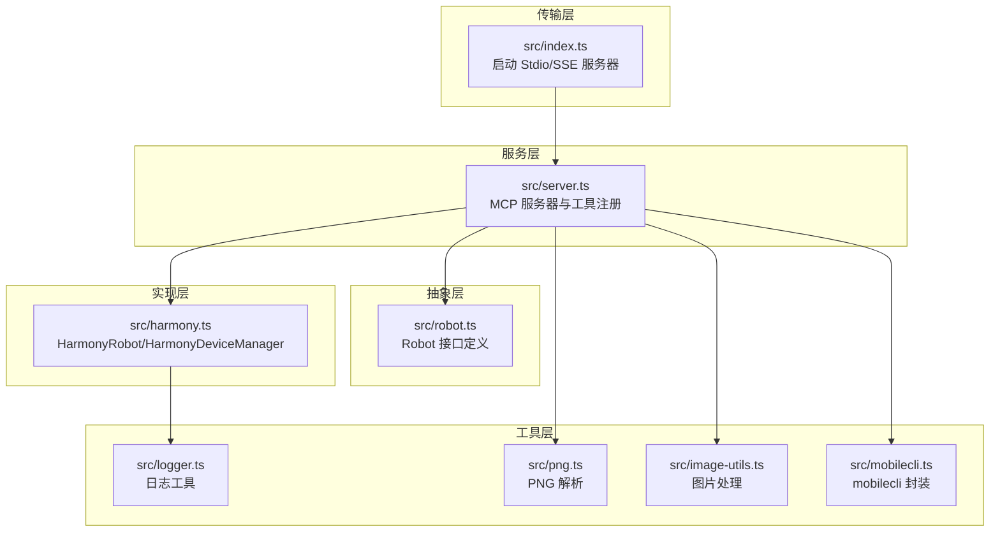
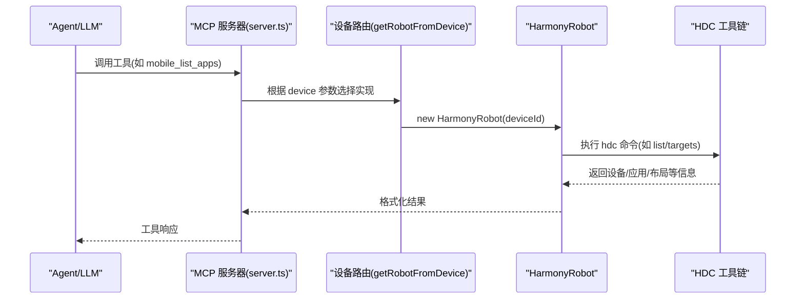
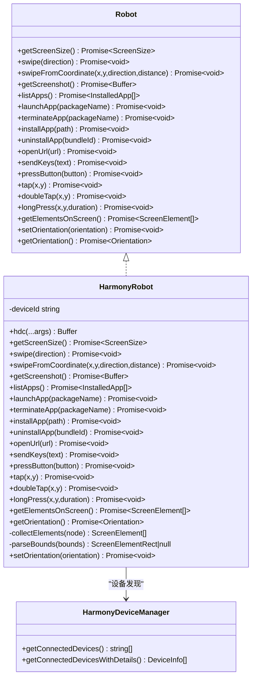
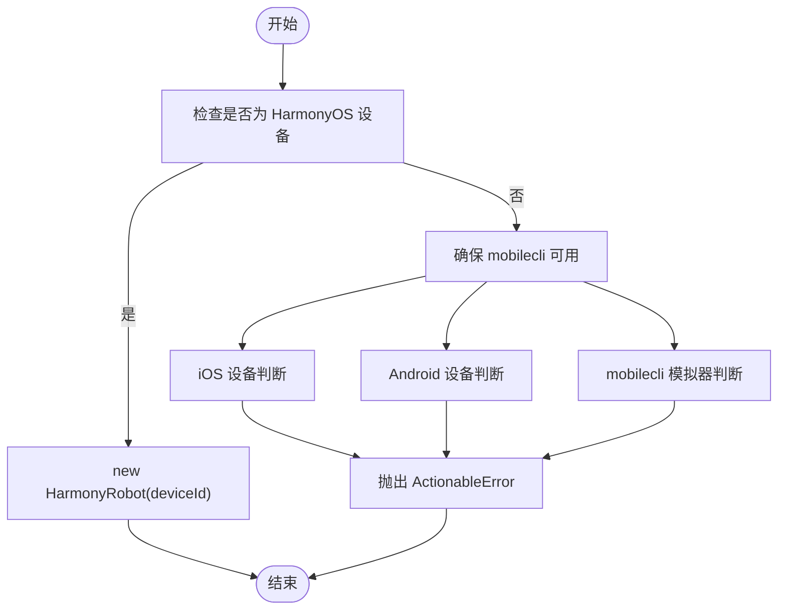
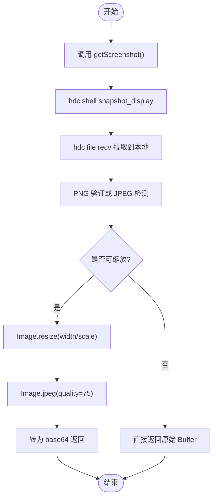
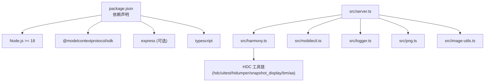

# HarmonyOS 平台集成

<cite>
**本文档引用的文件**
- [src/harmony.ts](file://src/harmony.ts)
- [src/robot.ts](file://src/robot.ts)
- [src/server.ts](file://src/server.ts)
- [src/index.ts](file://src/index.ts)
- [src/mobilecli.ts](file://src/mobilecli.ts)
- [src/logger.ts](file://src/logger.ts)
- [src/png.ts](file://src/png.ts)
- [src/image-utils.ts](file://src/image-utils.ts)
- [package.json](file://package.json)
- [README.md](file://README.md)
- [DEEPWIKI.md](file://DEEPWIKI.md)
</cite>

## 目录
1. [简介](#简介)
2. [项目结构](#项目结构)
3. [核心组件](#核心组件)
4. [架构总览](#架构总览)
5. [详细组件分析](#详细组件分析)
6. [依赖关系分析](#依赖关系分析)
7. [性能考虑](#性能考虑)
8. [故障排除指南](#故障排除指南)
9. [结论](#结论)
10. [附录](#附录)

## 简介
本指南面向在 HarmonyOS 平台上集成自动化能力的开发者，详细说明如何安装和配置 HDC SDK 工具链，解释 HarmonyRobot 类的实现原理（设备连接、屏幕操作、应用管理、布局解析等），提供完整的开发环境搭建步骤（DevEco Studio 配置与设备调试设置），并涵盖 HarmonyOS 特有的 API 使用方法（如 hidumper、uitest、bm、aa 等）。同时包含故障排除指南与性能优化建议。

## 项目结构
该项目采用模块化设计，核心围绕统一的 Robot 接口抽象，分别针对不同平台提供具体实现。HarmonyOS 的实现位于 HarmonyRobot 与 HarmonyDeviceManager，通过 HDC 工具链直接驱动设备，无需依赖 mobilecli。

**图表来源**
- [src/index.ts:1-67](file://src/index.ts#L1-L67)
- [src/server.ts:35-707](file://src/server.ts#L35-L707)
- [src/robot.ts:48-147](file://src/robot.ts#L48-L147)
- [src/harmony.ts:43-461](file://src/harmony.ts#L43-L461)
- [src/mobilecli.ts:27-135](file://src/mobilecli.ts#L27-L135)
- [src/logger.ts:1-22](file://src/logger.ts#L1-L22)
- [src/png.ts:1-21](file://src/png.ts#L1-L21)
- [src/image-utils.ts:1-165](file://src/image-utils.ts#L1-L165)

**章节来源**
- [README.md:175-190](file://README.md#L175-L190)
- [DEEPWIKI.md:32-54](file://DEEPWIKI.md#L32-L54)

## 核心组件
- **HarmonyRobot**：实现 Robot 接口，封装 HDC 工具链调用，提供屏幕尺寸获取、点击/双击/长按、滑动、截图、文本输入、按键、应用管理、URL 打开、UI 元素解析与方向获取等功能。
- **HarmonyDeviceManager**：设备发现与详情获取，基于 hdc list targets 与设备参数查询。
- **Robot 接口**：统一的跨平台抽象，定义设备信息、屏幕交互、截图、输入、应用管理、导航、UI 元素等能力。
- **MCP 服务器**：在 server.ts 中注册工具，根据设备 ID 动态路由到对应平台的 Robot 实现。
- **HDC 工具链**：hdc、uitest、hidumper、snapshot_display、bm、aa 等命令的集成。

**章节来源**
- [src/harmony.ts:43-416](file://src/harmony.ts#L43-L416)
- [src/harmony.ts:418-461](file://src/harmony.ts#L418-L461)
- [src/robot.ts:48-147](file://src/robot.ts#L48-L147)
- [src/server.ts:149-197](file://src/server.ts#L149-L197)

## 架构总览
HarmonyOS 自动化通过 HarmonyRobot 直连 HDC，无需 mobilecli 依赖。MCP 服务器在运行时根据设备 ID 选择合适的 Robot 实现，统一暴露工具接口给上层 Agent/LLM 使用。

**图表来源**
- [src/server.ts:149-197](file://src/server.ts#L149-L197)
- [src/harmony.ts:418-461](file://src/harmony.ts#L418-L461)

## 详细组件分析

### HarmonyRobot 类实现原理
HarmonyRobot 实现了 Robot 接口的所有方法，核心通过 execFileSync 调用 hdc 子命令完成设备控制与信息获取。

- **设备连接与命令执行**
  - 通过 getHdcPath() 解析 hdc 路径，支持环境变量 HDC_SDK_PATH 或默认 PATH 查找。
  - 所有命令均以 "hdc -t 设备ID ..." 的形式执行，确保目标设备正确。

- **屏幕尺寸与方向**
  - 使用 hidumper 查询 DisplayManagerService 获取 VirtualWidth/VirtualHeight。
  - 通过 ScreenRotation 判断横竖屏状态。

- **屏幕交互**
  - 点击/双击/长按：uitest uiInput 子命令。
  - 滑动：uitest uiInput swipe，支持中心点滑动与坐标起点滑动。
  - 文本输入：uitest uiInput inputText，优先聚焦元素坐标，否则使用屏幕中心。

- **截图**
  - 使用 snapshot_display 截图到设备临时路径，再通过 file recv 拉取到本地，最后清理临时文件。

- **应用管理**
  - 列表：bm dump -a。
  - 启动：aa start -a/-b，需解析 mainAbility。
  - 终止：aa force-stop。
  - 安装/卸载：hdc install/uninstall，捕获 stdout/stderr 提供更友好的错误信息。

- **布局解析**
  - 使用 uitest dumpLayout 生成 JSON 布局树，解析 bounds、text/description/hint 等属性，过滤无效元素。

- **按键**
  - 通过 BUTTON_MAP 将 HOME/BACK/ENTER/VOLUME_* 映射到 uitest keyEvent。

**图表来源**
- [src/robot.ts:48-147](file://src/robot.ts#L48-L147)
- [src/harmony.ts:43-416](file://src/harmony.ts#L43-L416)
- [src/harmony.ts:418-461](file://src/harmony.ts#L418-L461)

**章节来源**
- [src/harmony.ts:12-18](file://src/harmony.ts#L12-L18)
- [src/harmony.ts:20-26](file://src/harmony.ts#L20-L26)
- [src/harmony.ts:55-69](file://src/harmony.ts#L55-L69)
- [src/harmony.ts:401-411](file://src/harmony.ts#L401-L411)
- [src/harmony.ts:71-81](file://src/harmony.ts#L71-L81)
- [src/harmony.ts:83-117](file://src/harmony.ts#L83-L117)
- [src/harmony.ts:119-157](file://src/harmony.ts#L119-L157)
- [src/harmony.ts:159-182](file://src/harmony.ts#L159-L182)
- [src/harmony.ts:212-219](file://src/harmony.ts#L212-L219)
- [src/harmony.ts:221-232](file://src/harmony.ts#L221-L232)
- [src/harmony.ts:234-262](file://src/harmony.ts#L234-L262)
- [src/harmony.ts:264-288](file://src/harmony.ts#L264-L288)
- [src/harmony.ts:289-292](file://src/harmony.ts#L289-L292)
- [src/harmony.ts:294-332](file://src/harmony.ts#L294-L332)
- [src/harmony.ts:334-376](file://src/harmony.ts#L334-L376)
- [src/harmony.ts:378-399](file://src/harmony.ts#L378-L399)
- [src/harmony.ts:413-415](file://src/harmony.ts#L413-L415)

### 设备发现与路由
- **设备发现**：HarmonyDeviceManager 通过 hdc list targets 获取设备 ID 列表，并通过 param get 查询产品名称与软件版本。
- **设备路由**：MCP 服务器在 getRobotFromDevice 中优先判断 HarmonyOS 设备，若命中则返回 HarmonyRobot；否则回退到 mobilecli 体系。

**图表来源**
- [src/server.ts:149-197](file://src/server.ts#L149-L197)
- [src/harmony.ts:418-461](file://src/harmony.ts#L418-L461)

**章节来源**
- [src/server.ts:209-294](file://src/server.ts#L209-L294)
- [src/server.ts:149-197](file://src/server.ts#L149-L197)

### 截图与图片处理
- 截图流程：snapshot_display -> file recv -> 本地缓存 -> 清理临时文件。
- 图片验证：PNG 类验证 PNG 签名与尺寸；若为 JPEG 则进行缩放与压缩。
- 缩放工具：优先使用 macOS 内置 sips，其次使用 ImageMagick。

**图表来源**
- [src/harmony.ts:159-182](file://src/harmony.ts#L159-L182)
- [src/server.ts:585-672](file://src/server.ts#L585-L672)
- [src/png.ts:10-19](file://src/png.ts#L10-L19)
- [src/image-utils.ts:33-48](file://src/image-utils.ts#L33-L48)
- [src/image-utils.ts:104-114](file://src/image-utils.ts#L104-L114)

**章节来源**
- [src/server.ts:585-672](file://src/server.ts#L585-L672)
- [src/png.ts:1-21](file://src/png.ts#L1-L21)
- [src/image-utils.ts:133-165](file://src/image-utils.ts#L133-L165)

## 依赖关系分析
- 运行时依赖：Node.js >= 18，MCP SDK，可选 Express（SSE 模式）。
- HarmonyOS 依赖：HDC SDK（hdc、uitest、hidumper、snapshot_display、bm、aa）。
- 工具链集成：通过 execFileSync 调用，严格限制超时与缓冲区大小，避免阻塞。
- 错误处理：统一抛出 ActionableError，便于 MCP 客户端提示修复。

**图表来源**
- [package.json:13-15](file://package.json#L13-L15)
- [package.json:29-39](file://package.json#L29-L39)
- [src/server.ts:1-16](file://src/server.ts#L1-L16)
- [src/harmony.ts:1-10](file://src/harmony.ts#L1-L10)

**章节来源**
- [package.json:1-74](file://package.json#L1-L74)
- [src/server.ts:1-16](file://src/server.ts#L1-L16)

## 性能考虑
- 截图优化：优先使用 JPEG 压缩与按比例缩放，降低传输体积与内存占用。
- 命令超时与缓冲区：统一设置超时与最大缓冲区，避免长时间阻塞。
- 临时文件清理：确保设备与本地临时文件及时清理，防止磁盘占用。
- 设备路由：优先 HarmonyOS 设备，减少不必要的 mobilecli 调用。

[本节为通用指导，无需特定文件引用]

## 故障排除指南
- **HDC 未找到或不在 PATH**
  - 确认 HDC_SDK_PATH 环境变量指向包含 hdc 的目录，或确保 hdc 在系统 PATH 中。
  - 参考路径解析逻辑与环境变量设置。

- **设备未被识别**
  - 使用 hdc list targets 检查设备是否在线。
  - 若无设备，检查 USB 调试、驱动安装与设备授权。

- **截图失败或为空**
  - 确认 snapshot_display 输出格式与 PNG 验证逻辑。
  - 检查设备权限与存储空间。

- **应用启动失败**
  - 确认包名与 mainAbility 正确，必要时手动解析 bm dump 输出。
  - 检查 aa 命令参数与设备兼容性。

- **按键映射错误**
  - HarmonyOS 按键与 Android 不同，需使用 BUTTON_MAP 映射。
  - 如遇未支持按键，抛出 ActionableError 并提示修复。

- **日志与诊断**
  - 设置 LOG_FILE 环境变量记录详细日志。
  - 使用 trace/error 输出关键信息，便于定位问题。

**章节来源**
- [src/harmony.ts:12-18](file://src/harmony.ts#L12-L18)
- [src/harmony.ts:420-433](file://src/harmony.ts#L420-L433)
- [src/harmony.ts:159-182](file://src/harmony.ts#L159-L182)
- [src/harmony.ts:234-262](file://src/harmony.ts#L234-L262)
- [src/harmony.ts:212-219](file://src/harmony.ts#L212-L219)
- [src/logger.ts:1-22](file://src/logger.ts#L1-L22)

## 结论
通过 HarmonyRobot 与 HarmonyDeviceManager，项目实现了对 HarmonyOS 设备的完整自动化支持，无需 mobilecli 依赖，直接利用 HDC 工具链完成设备连接、屏幕交互、应用管理与布局解析。配合 MCP 服务器的统一工具注册与设备路由机制，可无缝集成到各类 Agent/LLM 工作流中。建议在生产环境中关注 HDC 工具链稳定性、截图优化与错误处理策略，以获得更好的可靠性与性能表现。

[本节为总结性内容，无需特定文件引用]

## 附录

### 开发环境搭建步骤
- 安装 Node.js（版本要求见 package.json）。
- 安装 HDC SDK（包含 hdc、uitest、hidumper、snapshot_display、bm、aa）。
- 配置环境变量：
  - HDC_SDK_PATH：指向包含 hdc 的目录。
  - LOG_FILE（可选）：日志输出文件路径。
- 安装项目依赖并构建：
  - npm install
  - npm run build
- 启动 MCP 服务器：
  - 默认 Stdio 模式：node lib/index.js
  - SSE 模式：node lib/index.js --port 3000

**章节来源**
- [package.json:13-15](file://package.json#L13-L15)
- [README.md:90-171](file://README.md#L90-L171)

### DevEco Studio 配置与设备调试
- 在 DevEco Studio 中启用“允许USB调试”和“允许安装测试应用”。
- 通过 USB 连接真机，确保 hdc 能识别设备。
- 在设备上安装待测应用，确认包名与 mainAbility 可用。
- 使用 MCP 工具进行自动化操作与验证。

**章节来源**
- [README.md:25-34](file://README.md#L25-L34)
- [README.md:90-99](file://README.md#L90-L99)

### HarmonyOS 特有 API 使用方法
- **hdc**：设备连接、文件传输、Shell 命令执行。
- **uitest**：UI 输入（click/doubleClick/longClick/swipe/inputText/keyEvent）、布局 dump。
- **hidumper**：显示信息查询（屏幕尺寸、旋转方向）。
- **snapshot_display**：截取屏幕图片。
- **bm**：应用包管理（列出、查询）。
- **aa**：Ability 启动与终止。

**章节来源**
- [README.md:175-188](file://README.md#L175-L188)
- [DEEPWIKI.md:615-629](file://DEEPWIKI.md#L615-L629)