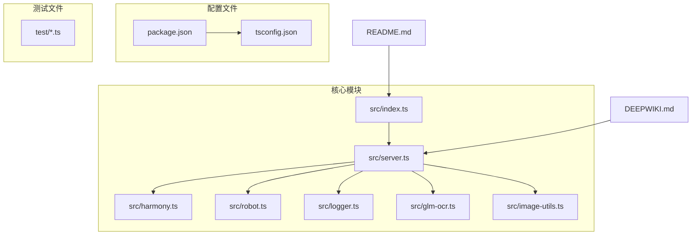
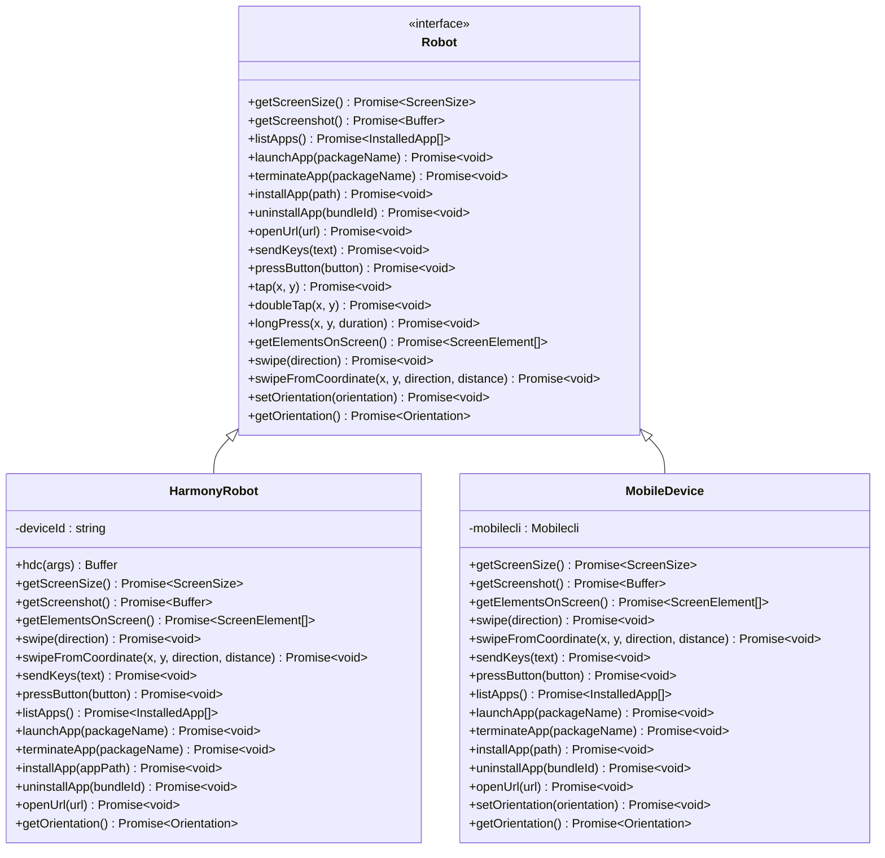
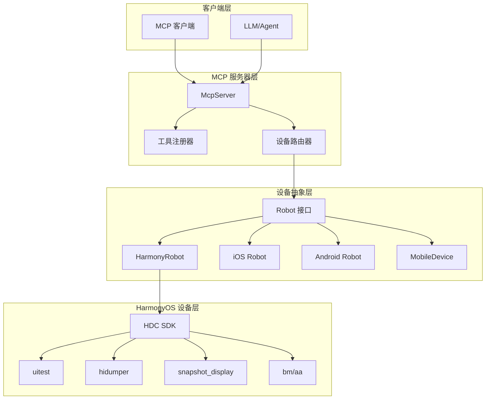
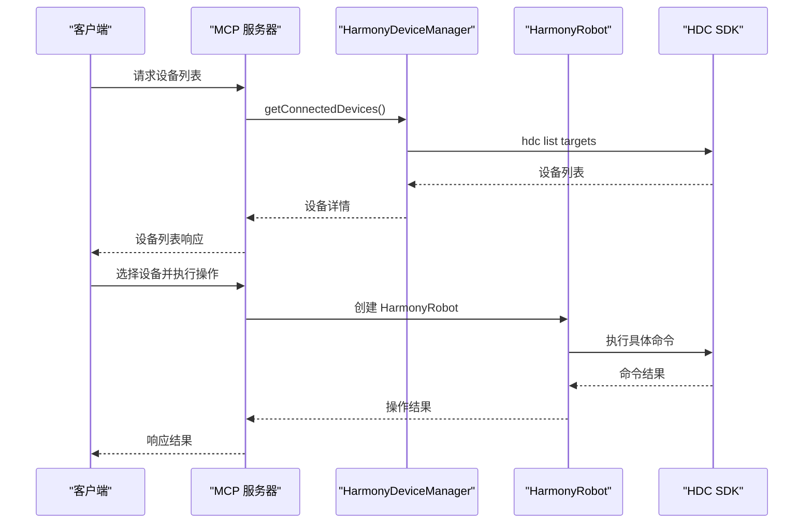
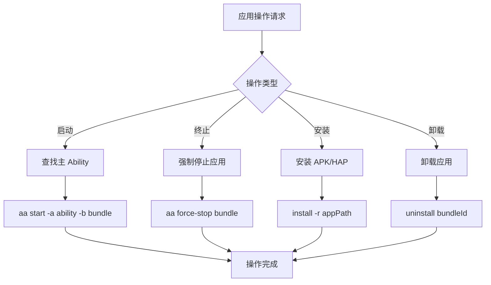
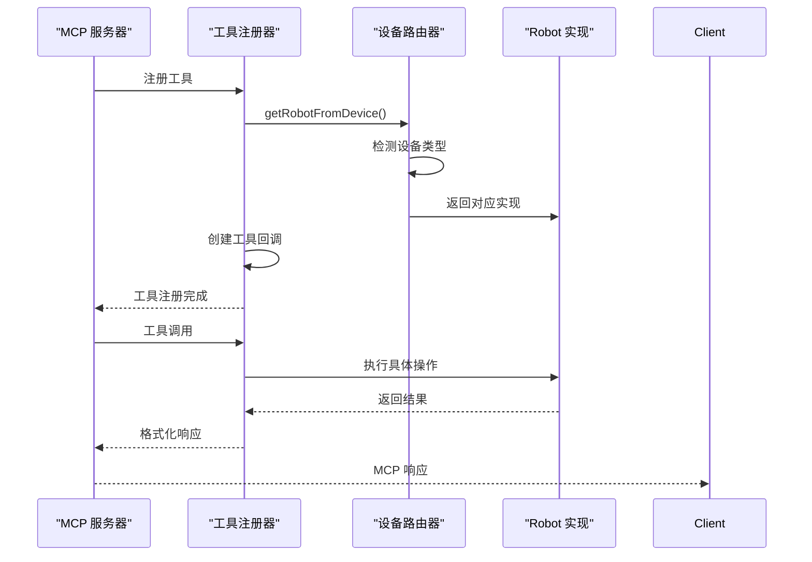
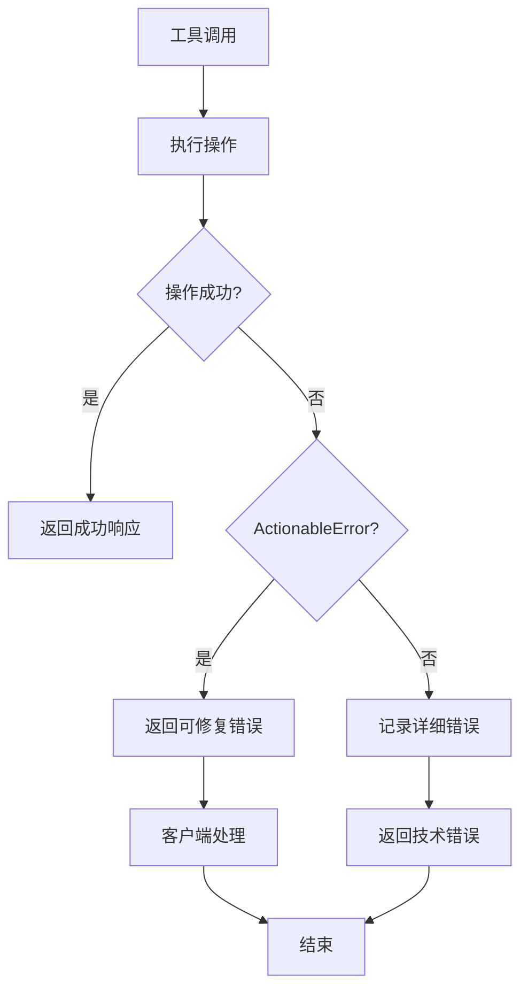
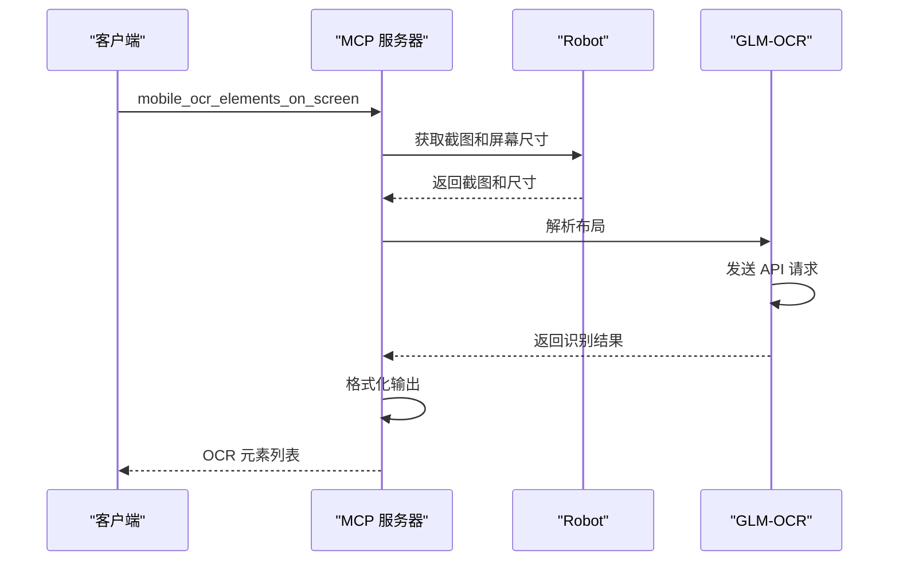
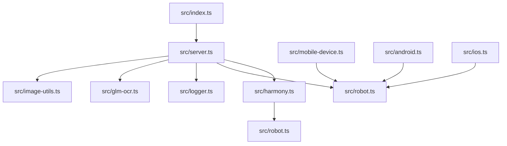
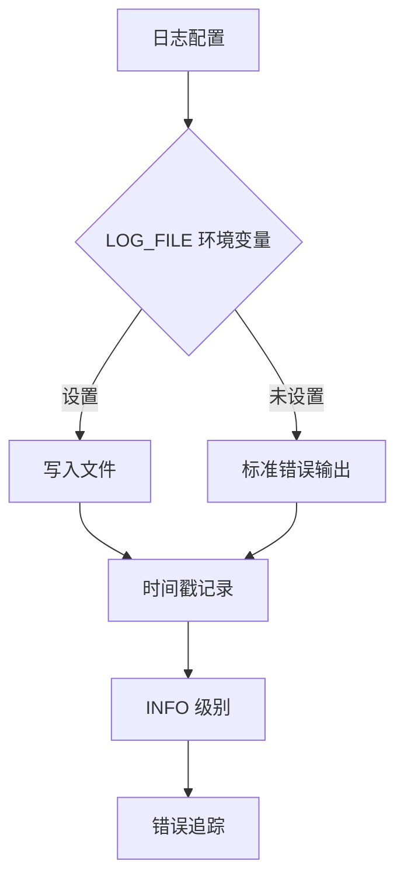

# HarmonyOS 平台集成

<cite>
**本文档引用的文件**
- [src/index.ts](file://src/index.ts)
- [src/harmony.ts](file://src/harmony.ts)
- [src/server.ts](file://src/server.ts)
- [src/robot.ts](file://src/robot.ts)
- [src/logger.ts](file://src/logger.ts)
- [src/glm-ocr.ts](file://src/glm-ocr.ts)
- [src/image-utils.ts](file://src/image-utils.ts)
- [package.json](file://package.json)
- [README.md](file://README.md)
- [tsconfig.json](file://tsconfig.json)
</cite>

## 目录
1. [简介](#简介)
2. [项目结构](#项目结构)
3. [核心组件](#核心组件)
4. [架构概览](#架构概览)
5. [详细组件分析](#详细组件分析)
6. [依赖关系分析](#依赖关系分析)
7. [性能考虑](#性能考虑)
8. [故障排除指南](#故障排除指南)
9. [结论](#结论)

## 简介

Mobile MCP HarmonyOS 是一个基于 Model Context Protocol (MCP) 的跨平台移动设备自动化服务器，专门为 HarmonyOS (鸿蒙) 设备提供原生自动化支持。该项目基于 [@mobilenext/mobile-mcp](https://github.com/mobile-next/mobile-mcp) 二次开发，新增了 HarmonyOS 设备自动化能力，无需依赖 mobilecli，直接通过 HDC (HarmonyOS Device Connector) 驱动设备。

该系统支持 iOS、Android 和 HarmonyOS 三大平台的统一 MCP 工具集，提供结构化的无障碍树数据交互，同时具备视觉识别兜底能力，为 LLM 和 Agent 提供强大的移动端自动化能力。

## 项目结构

项目采用模块化设计，主要包含以下核心目录和文件：



**图表来源**
- [src/index.ts:1-71](file://src/index.ts#L1-L71)
- [src/server.ts:1-758](file://src/server.ts#L1-L758)
- [src/harmony.ts:1-462](file://src/harmony.ts#L1-L462)

**章节来源**
- [package.json:1-74](file://package.json#L1-L74)
- [tsconfig.json:1-14](file://tsconfig.json#L1-L14)

## 核心组件

### HarmonyOS 自动化引擎

HarmonyOS 平台的核心是 `HarmonyRobot` 类，它实现了完整的设备控制功能：

- **设备发现**: 通过 `HarmonyDeviceManager` 自动检测连接的 HarmonyOS 设备
- **屏幕控制**: 支持截图、屏幕尺寸获取、方向检测
- **交互操作**: 点击、双击、长按、滑动等手势操作
- **应用管理**: 应用列表、启动、终止、安装、卸载
- **系统操作**: 键盘输入、物理按键模拟、URL 打开

### 多平台设备抽象

系统通过统一的 `Robot` 接口支持多平台设备：



**图表来源**
- [src/robot.ts:48-147](file://src/robot.ts#L48-L147)
- [src/harmony.ts:43-416](file://src/harmony.ts#L43-L416)
- [src/mobile-device.ts:62-216](file://src/mobile-device.ts#L62-L216)

**章节来源**
- [src/robot.ts:1-148](file://src/robot.ts#L1-L148)
- [src/harmony.ts:1-462](file://src/harmony.ts#L1-L462)

## 架构概览

系统采用分层架构设计，通过统一的 MCP 服务器提供服务：



**图表来源**
- [src/server.ts:40-202](file://src/server.ts#L40-L202)
- [src/harmony.ts:43-461](file://src/harmony.ts#L43-L461)

系统的核心流程包括：

1. **设备发现**: 通过 `HarmonyDeviceManager` 和 `MobileDeviceManager` 发现可用设备
2. **设备路由**: 根据设备类型选择相应的 `Robot` 实现
3. **命令执行**: 将 MCP 工具调用转换为具体的设备操作
4. **结果返回**: 将操作结果格式化为 MCP 响应

**章节来源**
- [src/server.ts:154-202](file://src/server.ts#L154-L202)
- [src/index.ts:9-48](file://src/index.ts#L9-L48)

## 详细组件分析

### HarmonyRobot 实现

`HarmonyRobot` 类是 HarmonyOS 平台的核心实现，提供了完整的设备控制功能：

#### 设备连接管理



**图表来源**
- [src/harmony.ts:418-461](file://src/harmony.ts#L418-L461)
- [src/server.ts:154-202](file://src/server.ts#L154-L202)

#### 屏幕交互功能

HarmonyOS 的屏幕交互通过 `uitest` 工具实现，支持多种手势操作：

| 功能 | 命令 | 参数 | 描述 |
|------|------|------|------|
| 点击 | `uitest uiInput click` | x, y | 单击指定坐标 |
| 双击 | `uitest uiInput doubleClick` | x, y | 双击指定坐标 |
| 长按 | `uitest uiInput longClick` | x, y | 长按指定坐标 |
| 滑动 | `uitest uiInput swipe` | x1, y1, x2, y2, duration | 从起点滑动到终点 |

#### 应用管理功能

应用管理通过 `bm` 和 `aa` 工具实现：



**图表来源**
- [src/harmony.ts:234-288](file://src/harmony.ts#L234-L288)

**章节来源**
- [src/harmony.ts:43-416](file://src/harmony.ts#L43-L416)

### MCP 服务器集成

MCP 服务器通过统一的工具注册机制支持所有平台：

#### 工具注册流程



**图表来源**
- [src/server.ts:67-100](file://src/server.ts#L67-L100)
- [src/server.ts:154-202](file://src/server.ts#L154-L202)

#### 错误处理机制

系统实现了完善的错误处理机制：



**图表来源**
- [src/server.ts:84-99](file://src/server.ts#L84-L99)

**章节来源**
- [src/server.ts:40-758](file://src/server.ts#L40-L758)

### OCR 识别功能

系统集成了 GLM-OCR 能力，用于处理无障碍数据不可用的情况：

#### OCR 流程



**图表来源**
- [src/server.ts:711-754](file://src/server.ts#L711-L754)
- [src/glm-ocr.ts:41-101](file://src/glm-ocr.ts#L41-L101)

**章节来源**
- [src/glm-ocr.ts:1-103](file://src/glm-ocr.ts#L1-L103)

## 依赖关系分析

### 外部依赖

项目的主要外部依赖包括：

| 依赖项 | 版本 | 用途 |
|--------|------|------|
| @modelcontextprotocol/sdk | 1.25.2 | MCP 协议实现 |
| commander | 14.0.0 | 命令行参数解析 |
| express | 5.1.0 | HTTP 服务器 |
| fast-xml-parser | 5.3.4 | XML 解析 |
| zod | ^4.1.13 | 数据验证 |
| zod-to-json-schema | 3.25.0 | Schema 转换 |

### 内部模块依赖



**图表来源**
- [src/index.ts:1-71](file://src/index.ts#L1-L71)
- [src/server.ts:1-16](file://src/server.ts#L1-L16)

**章节来源**
- [package.json:29-39](file://package.json#L29-L39)

## 性能考虑

### 图像处理优化

系统实现了智能的图像缩放机制：

1. **平台检测**: 自动检测 macOS (Sips) 或 Linux (ImageMagick) 环境
2. **质量控制**: 默认 JPEG 质量 75%，平衡文件大小和质量
3. **尺寸适配**: 根据设备屏幕比例调整图像尺寸
4. **内存管理**: 使用临时文件系统避免内存溢出

### 命令执行优化

- **超时控制**: 所有 HDC 命令设置 30 秒超时
- **缓冲区限制**: 最大缓冲区 4MB，防止内存泄漏
- **并发控制**: 合理的命令执行顺序，避免设备过载

### 网络通信优化

- **API 缓存**: 本地缓存设备信息减少重复查询
- **批量操作**: 支持多个工具调用的批处理
- **连接复用**: 复用 HDC 连接减少握手开销

## 故障排除指南

### 常见问题及解决方案

#### HDC 连接问题

**症状**: 设备无法被发现或命令执行失败

**诊断步骤**:
1. 检查 HDC 是否在 PATH 中
2. 验证设备是否正确连接
3. 确认设备开发者选项已启用

**解决方案**:
```bash
# 检查 HDC 版本
hdc --version

# 列出连接的设备
hdc list targets

# 查看设备详细信息
hdc -t DEVICE_ID shell param get const.product.name
```

#### 权限问题

**症状**: 应用安装或启动失败

**解决方案**:
1. 确保设备允许未知来源应用
2. 检查应用签名和权限配置
3. 重新授权设备调试权限

#### OCR 功能问题

**症状**: GLM-OCR 识别失败或返回空结果

**诊断方法**:
1. 验证 API 密钥有效性
2. 检查网络连接状态
3. 确认图片格式支持

**章节来源**
- [src/harmony.ts:12-18](file://src/harmony.ts#L12-L18)
- [src/glm-ocr.ts:70-81](file://src/glm-ocr.ts#L70-L81)

### 日志分析

系统支持详细的日志记录：



**图表来源**
- [src/logger.ts:3-21](file://src/logger.ts#L3-L21)

**章节来源**
- [src/logger.ts:1-22](file://src/logger.ts#L1-L22)

## 结论

Mobile MCP HarmonyOS 项目成功实现了 HarmonyOS 平台的原生自动化支持，具有以下特点：

### 技术优势

1. **统一抽象**: 通过 Robot 接口实现多平台一致性
2. **原生集成**: 直接使用 HDC SDK，无需额外依赖
3. **智能降级**: 结合无障碍树和 OCR 识别提供可靠体验
4. **性能优化**: 智能图像处理和命令执行优化

### 应用价值

- **开发效率**: 为 LLM 和 Agent 提供强大的移动端自动化能力
- **成本效益**: 减少对第三方工具的依赖，降低维护成本
- **扩展性**: 易于添加新的平台支持和功能特性

### 未来发展方向

1. **功能增强**: 支持更多 HarmonyOS 特有功能
2. **性能优化**: 进一步提升图像处理和命令执行效率
3. **稳定性改进**: 增强错误处理和异常恢复机制
4. **生态集成**: 与更多 MCP 客户端和工具链集成

该项目为 HarmonyOS 平台的自动化测试、应用开发和 AI 集成提供了坚实的技术基础，是移动设备自动化领域的重要创新。