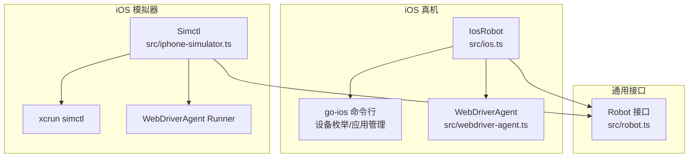
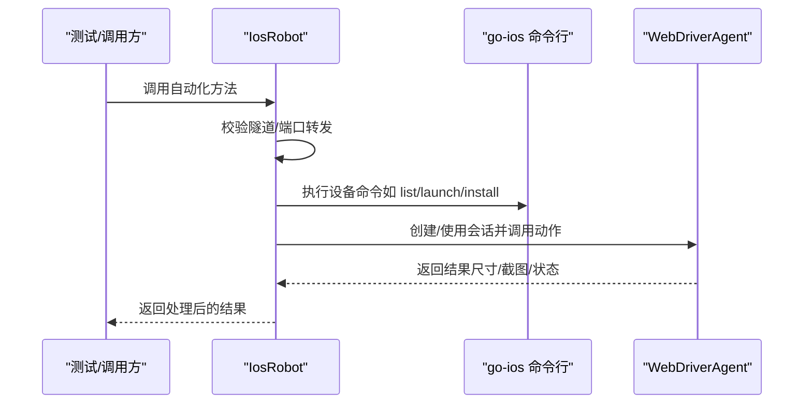
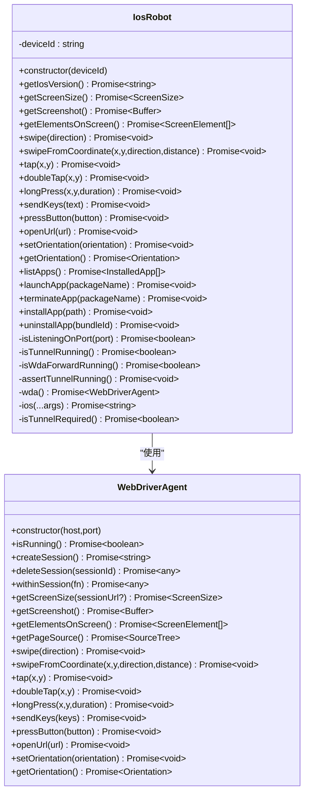
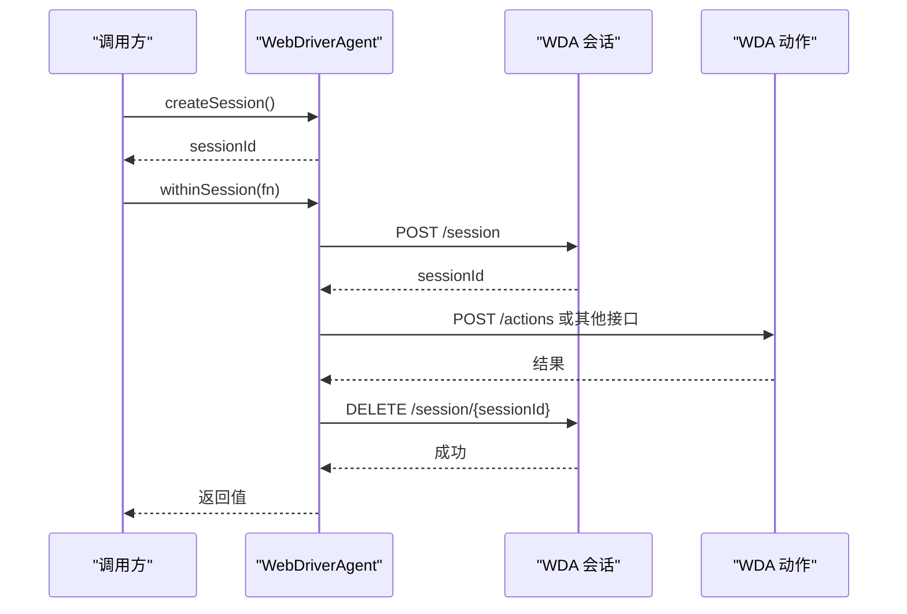
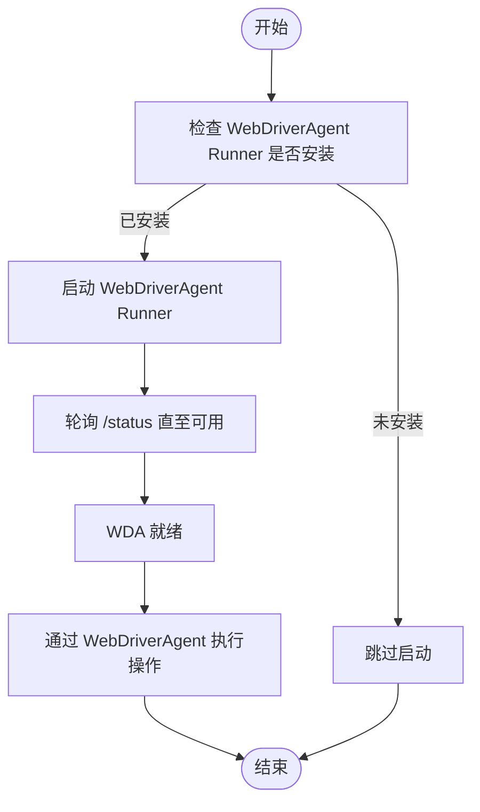
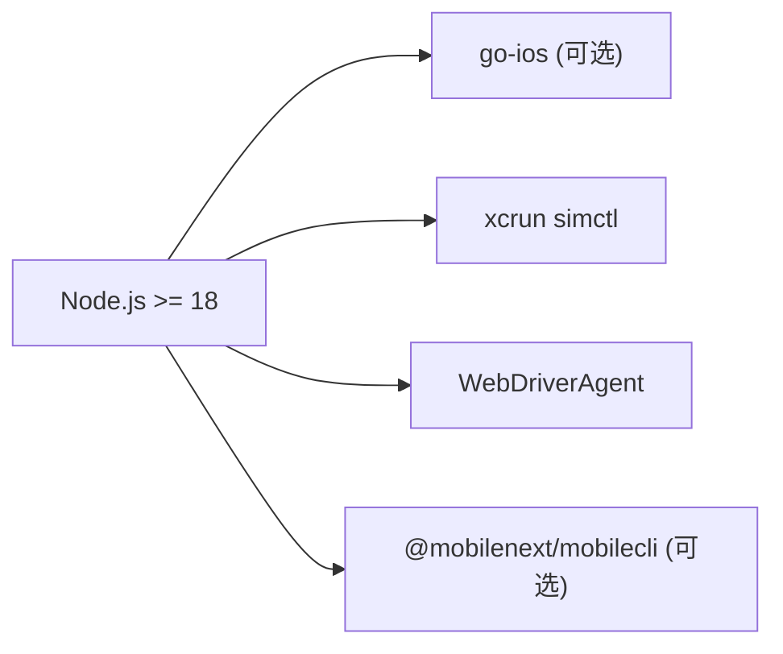

# iOS 平台集成

<cite>
**本文引用的文件**
- [src/ios.ts](file://src/ios.ts)
- [src/webdriver-agent.ts](file://src/webdriver-agent.ts)
- [src/robot.ts](file://src/robot.ts)
- [src/iphone-simulator.ts](file://src/iphone-simulator.ts)
- [src/mobile-device.ts](file://src/mobile-device.ts)
- [test/ios.ts](file://test/ios.ts)
- [README.md](file://README.md)
- [package.json](file://package.json)
- [src/index.ts](file://src/index.ts)
</cite>

## 目录
1. [简介](#简介)
2. [项目结构](#项目结构)
3. [核心组件](#核心组件)
4. [架构总览](#架构总览)
5. [详细组件分析](#详细组件分析)
6. [依赖关系分析](#依赖关系分析)
7. [性能考量](#性能考量)
8. [故障排查指南](#故障排查指南)
9. [结论](#结论)
10. [附录](#附录)

## 简介
本指南面向在 iOS 平台上集成自动化测试与控制能力的开发者，围绕本仓库中的 iOS 实现进行系统化说明。重点包括：
- Xcode 开发环境与 iOS SDK 的安装配置要求
- iOSRobot 类的实现原理：WebDriverAgent 集成、设备管理、自动化操作
- 开发环境搭建步骤：证书配置、设备授权、WebDriverAgent 启动流程
- iOS 设备连接方法与调试配置
- iOS 特有的权限设置、安全限制与兼容性要求
- 真机与模拟器的使用差异
- 常见集成问题的解决方案

## 项目结构
该仓库为一个 MCP（Model Context Protocol）服务端，提供跨平台移动设备自动化能力，其中 iOS 部分通过 WebDriverAgent 与原生工具链协作完成自动化操作。核心文件与职责如下：
- src/ios.ts：iOSRobot 与 IosManager，负责与真机交互、端口转发校验、应用管理与基础操作
- src/webdriver-agent.ts：WebDriverAgent 封装，提供会话管理、屏幕尺寸、截图、手势、按键、方向等操作
- src/robot.ts：跨平台统一的 Robot 接口定义
- src/iphone-simulator.ts：iPhone 模拟器封装，使用 xcrun simctl 与 WebDriverAgent Runner
- src/mobile-device.ts：通用 MobileDevice 实现（非 iOS），用于对比与参考
- test/ios.ts：iOS 真机截图功能的最小化测试样例
- README.md：平台支持、前置依赖与 MCP 配置说明
- package.json：Node.js 版本要求、可选依赖与构建脚本
- src/index.ts：MCP 服务入口，支持 stdio 与 SSE 两种运行模式

图表来源
- [src/ios.ts:42-232](file://src/ios.ts#L42-L232)
- [src/webdriver-agent.ts:25-454](file://src/webdriver-agent.ts#L25-L454)
- [src/iphone-simulator.ts:32-272](file://src/iphone-simulator.ts#L32-L272)
- [src/robot.ts:48-147](file://src/robot.ts#L48-L147)

章节来源
- [src/ios.ts:1-294](file://src/ios.ts#L1-L294)
- [src/webdriver-agent.ts:1-455](file://src/webdriver-agent.ts#L1-L455)
- [src/robot.ts:1-148](file://src/robot.ts#L1-L148)
- [src/iphone-simulator.ts:1-273](file://src/iphone-simulator.ts#L1-L273)
- [README.md:1-198](file://README.md#L1-L198)
- [package.json:1-74](file://package.json#L1-L74)

## 核心组件
- IosRobot：面向 iOS 真机的自动化控制器，负责端口监听检查、WebDriverAgent 会话管理、应用生命周期与屏幕交互
- IosManager：设备管理器，检测 go-ios 是否安装、列出设备、读取设备信息
- WebDriverAgent：封装 WebDriverAgent Runner 的 HTTP API，提供会话创建/销毁、屏幕尺寸、截图、手势、按键、方向等
- Simctl：面向 iOS 模拟器的控制器，封装 xcrun simctl 与 WebDriverAgent Runner
- Robot 接口：统一的跨平台自动化能力抽象

章节来源
- [src/ios.ts:42-232](file://src/ios.ts#L42-L232)
- [src/ios.ts:234-293](file://src/ios.ts#L234-L293)
- [src/webdriver-agent.ts:25-454](file://src/webdriver-agent.ts#L25-L454)
- [src/robot.ts:48-147](file://src/robot.ts#L48-L147)
- [src/iphone-simulator.ts:32-272](file://src/iphone-simulator.ts#L32-L272)

## 架构总览
iOS 真机与模拟器的自动化路径分别如下：
- 真机路径：IosRobot -> go-ios 命令行 -> WebDriverAgent（本地 8100 端口，可能经由隧道 60105）
- 模拟器路径：Simctl -> xcrun simctl -> WebDriverAgent Runner（本地 8100 端口）

图表来源
- [src/ios.ts:77-92](file://src/ios.ts#L77-L92)
- [src/ios.ts:94-96](file://src/ios.ts#L94-L96)
- [src/webdriver-agent.ts:42-77](file://src/webdriver-agent.ts#L42-L77)

## 详细组件分析

### IosRobot 组件分析
IosRobot 是 iOS 真机自动化的核心类，负责：
- 端口监听检查：验证隧道与端口转发是否就绪
- 设备版本判断：根据 iOS 版本决定是否需要隧道
- 应用管理：列举、启动、终止、安装、卸载
- 屏幕交互：截图、尺寸、元素、手势、按键、方向

图表来源
- [src/ios.ts:42-232](file://src/ios.ts#L42-L232)
- [src/webdriver-agent.ts:25-454](file://src/webdriver-agent.ts#L25-L454)

章节来源
- [src/ios.ts:42-232](file://src/ios.ts#L42-L232)
- [src/robot.ts:48-147](file://src/robot.ts#L48-L147)

### WebDriverAgent 组件分析
WebDriverAgent 封装了 WebDriverAgent Runner 的 HTTP API，提供：
- 会话管理：创建/删除会话
- 屏幕与截图：获取屏幕尺寸、截图
- 元素与无障碍树：获取页面源与过滤可见元素
- 手势与输入：滑动、点击、长按、双击、按键、输入文本
- 方向控制：设置/获取屏幕方向

图表来源
- [src/webdriver-agent.ts:42-77](file://src/webdriver-agent.ts#L42-L77)
- [src/webdriver-agent.ts:302-370](file://src/webdriver-agent.ts#L302-L370)

章节来源
- [src/webdriver-agent.ts:25-454](file://src/webdriver-agent.ts#L25-L454)

### iPhone 模拟器组件分析
Simctl 提供对 iOS 模拟器的自动化控制，主要特性：
- WebDriverAgent Runner 管理：检测安装、启动、等待状态
- 应用管理：安装（支持 .zip 解压）、卸载、列举、启动/终止
- 屏幕交互：截图、尺寸、手势、按键、方向、元素列表

图表来源
- [src/iphone-simulator.ts:36-83](file://src/iphone-simulator.ts#L36-L83)
- [src/iphone-simulator.ts:141-192](file://src/iphone-simulator.ts#L141-L192)

章节来源
- [src/iphone-simulator.ts:32-272](file://src/iphone-simulator.ts#L32-L272)

### IosManager 组件分析
IosManager 提供 iOS 真机设备管理能力：
- 检查 go-ios 是否安装
- 列出设备、读取设备名称与详细信息（含版本）

章节来源
- [src/ios.ts:234-293](file://src/ios.ts#L234-L293)

## 依赖关系分析
- Node.js 版本要求：>= 18
- 可选依赖：@mobilenext/mobilecli（通用设备自动化）
- iOS 真机依赖：go-ios（通过 npm 全局安装或通过环境变量 GO_IOS_PATH 指定）
- iOS 模拟器依赖：Xcode Command Line Tools（xcrun simctl）
- WebDriverAgent：iOS 真机与模拟器均通过本地 8100 端口访问

图表来源
- [package.json:13-15](file://package.json#L13-L15)
- [package.json:37-39](file://package.json#L37-L39)
- [README.md:92-99](file://README.md#L92-L99)

章节来源
- [package.json:1-74](file://package.json#L1-L74)
- [README.md:90-172](file://README.md#L90-L172)

## 性能考量
- 端口转发与隧道：iOS 17 及以上版本需要隧道与端口转发，建议提前建立稳定连接以避免频繁重试
- 会话复用：WebDriverAgent 使用 withinSession 封装会话创建/销毁，尽量减少重复创建带来的延迟
- 截图与尺寸：截图为 base64 编码后转 Buffer，注意内存占用；尺寸以点为单位，需考虑缩放
- 模拟器安装：.zip 安装前进行路径校验与解压，避免异常路径导致失败

[本节为通用指导，不直接分析具体文件]

## 故障排查指南

### 真机连接与权限
- go-ios 未安装：IosManager 会检测并提示无法检测真机
- iOS 版本与隧道：iOS 17+ 需要隧道与端口转发，否则抛出可行动错误
- 设备授权：确保设备已信任开发者账号与证书（若使用自签名 WebDriverAgent）

章节来源
- [src/ios.ts:236-244](file://src/ios.ts#L236-L244)
- [src/ios.ts:104-108](file://src/ios.ts#L104-L108)
- [src/ios.ts:69-75](file://src/ios.ts#L69-L75)

### WebDriverAgent 启动与状态
- 端口转发：8100 端口必须可连通；否则抛出错误
- /status 接口：isRunning 通过 /status 检查 ready 状态
- 会话创建：失败时返回可读错误信息，便于定位

章节来源
- [src/ios.ts:77-92](file://src/ios.ts#L77-L92)
- [src/webdriver-agent.ts:30-40](file://src/webdriver-agent.ts#L30-L40)
- [src/webdriver-agent.ts:42-63](file://src/webdriver-agent.ts#L42-L63)

### 模拟器安装与安全
- .zip 安装：先校验 zip 内部路径合法性，防止 zip-slip
- .app 查找：遍历目录寻找 .app 包，找不到时报错
- 安装/卸载异常：捕获子进程输出，拼接 stdout/stderr 抛出可读错误

章节来源
- [src/iphone-simulator.ts:124-139](file://src/iphone-simulator.ts#L124-L139)
- [src/iphone-simulator.ts:112-122](file://src/iphone-simulator.ts#L112-L122)
- [src/iphone-simulator.ts:141-192](file://src/iphone-simulator.ts#L141-L192)

### 测试与截图验证
- 截图尺寸一致性：测试用例验证截图尺寸与屏幕尺寸（考虑缩放）一致

章节来源
- [test/ios.ts:13-27](file://test/ios.ts#L13-L27)

## 结论
本项目通过 WebDriverAgent 与原生工具链（go-ios、xcrun simctl）实现了 iOS 真机与模拟器的统一自动化能力。IosRobot 与 Simctl 分别覆盖真机与模拟器场景，配合 WebDriverAgent 的会话与动作接口，形成稳定的自动化闭环。集成时应重点关注：
- 环境依赖与版本要求（Node.js、Xcode、go-ios）
- iOS 17+ 的隧道与端口转发策略
- WebDriverAgent 的安装、启动与状态监控
- 真机与模拟器在证书、授权与安装流程上的差异

[本节为总结性内容，不直接分析具体文件]

## 附录

### 开发环境搭建步骤（概览）
- 安装 Node.js（>= 18）
- 安装 Xcode Command Line Tools（提供 xcrun、simctl）
- 安装 go-ios（通过 npm 全局安装或设置 GO_IOS_PATH）
- 准备 iOS 设备：解锁、开启开发者模式、信任证书
- 启动 WebDriverAgent Runner（真机/模拟器）
- 运行 MCP 服务（默认 stdio，或指定 --port 启动 SSE）

章节来源
- [README.md:90-172](file://README.md#L90-L172)
- [package.json:13-15](file://package.json#L13-L15)

### iOS 设备连接与调试配置
- 真机：通过 go-ios 列举设备，执行应用管理与自动化操作
- 模拟器：通过 xcrun simctl 控制，WebDriverAgent Runner 作为动作执行器
- 端口与隧道：8100 端口用于 WebDriverAgent，iOS 17+ 需要隧道与端口转发

章节来源
- [src/ios.ts:7-8](file://src/ios.ts#L7-L8)
- [src/ios.ts:104-108](file://src/ios.ts#L104-L108)
- [src/iphone-simulator.ts:29](file://src/iphone-simulator.ts#L29)

### iOS 特有权限、安全限制与兼容性
- 权限与授权：真机需信任开发者证书；模拟器无此限制
- 兼容性：iOS 17+ 引入隧道与端口转发要求
- 安全：模拟器安装 .zip 时进行路径校验，防止 zip-slip

章节来源
- [src/ios.ts:104-108](file://src/ios.ts#L104-L108)
- [src/iphone-simulator.ts:124-139](file://src/iphone-simulator.ts#L124-L139)

### 真机与模拟器使用差异
- 真机：依赖 go-ios 与隧道；应用安装与管理通过 go-ios 命令行
- 模拟器：依赖 xcrun simctl；应用安装支持 .zip 自动解压与 .app 定位

章节来源
- [src/ios.ts:94-96](file://src/ios.ts#L94-L96)
- [src/iphone-simulator.ts:141-192](file://src/iphone-simulator.ts#L141-L192)