# 平台集成指南

<cite>
**本文档引用的文件**
- [README.md](file://README.md)
- [package.json](file://package.json)
- [tsconfig.json](file://tsconfig.json)
- [src/index.ts](file://src/index.ts)
- [src/server.ts](file://src/server.ts)
- [src/robot.ts](file://src/robot.ts)
- [src/harmony.ts](file://src/harmony.ts)
- [src/android.ts](file://src/android.ts)
- [src/ios.ts](file://src/ios.ts)
- [src/mobile-device.ts](file://src/mobile-device.ts)
- [src/mobilecli.ts](file://src/mobilecli.ts)
- [src/logger.ts](file://src/logger.ts)
- [test/mobilecli.test.ts](file://test/mobilecli.test.ts)
- [test/png.ts](file://test/png.ts)
</cite>

## 目录
1. [简介](#简介)
2. [项目结构](#项目结构)
3. [核心组件](#核心组件)
4. [架构概览](#架构概览)
5. [详细组件分析](#详细组件分析)
6. [依赖关系分析](#依赖关系分析)
7. [性能考虑](#性能考虑)
8. [故障排除指南](#故障排除指南)
9. [结论](#结论)
10. [附录](#附录)

## 简介

Mobile MCP HarmonyOS 是一个基于 Model Context Protocol (MCP) 的跨平台移动设备自动化服务器，专门为 iOS、Android 和 HarmonyOS 设备提供统一的自动化能力。该项目是 [@mobilenext/mobile-mcp](https://github.com/mobile-next/mobile-mcp) 的二次开发版本，新增了 HarmonyOS 设备自动化支持。

本项目的核心特性包括：
- 三端原生应用自动化：iOS、Android、HarmonyOS 统一 MCP 工具集
- LLM 友好：基于无障碍树 (Accessibility Tree) 的结构化数据交互
- 视觉兜底：当无障碍数据不可用时，自动回退到截图坐标分析
- 确定性操作：优先使用结构化数据，减少纯截图方案的歧义
- 结构化数据提取：从屏幕可见内容中提取结构化信息

## 项目结构

项目采用模块化的 TypeScript 架构，主要目录结构如下：

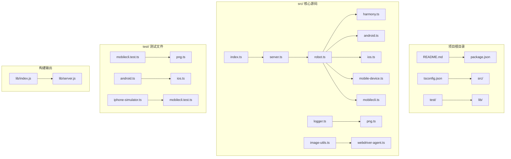

**图表来源**
- [package.json:17-25](file://package.json#L17-L25)
- [tsconfig.json:1-14](file://tsconfig.json#L1-L14)

**章节来源**
- [package.json:1-74](file://package.json#L1-L74)
- [tsconfig.json:1-14](file://tsconfig.json#L1-L14)

## 核心组件

### 平台支持矩阵

| 平台 | 支持状态 | 技术栈 | 依赖要求 |
|------|----------|--------|----------|
| iOS 真机 | ✅ 完全支持 | WebDriverAgent + 原生无障碍接口 | mobilecli (可选) |
| iOS 模拟器 | ✅ 完全支持 | mobilecli + WebDriverAgent | mobilecli 必需 |
| Android 真机 | ✅ 完全支持 | ADB + UI Automator | mobilecli (可选) |
| Android 模拟器 | ✅ 完全支持 | ADB + UI Automator | mobilecli 必需 |
| HarmonyOS 真机 | ✅ 新增支持 | HDC + uitest + hidumper | HDC SDK 必需 |

### 技术架构概览

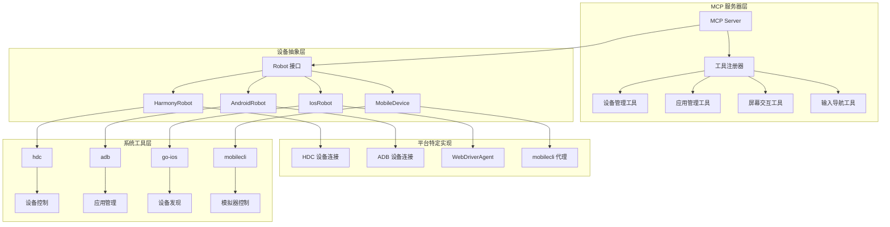

**图表来源**
- [src/server.ts:35-707](file://src/server.ts#L35-L707)
- [src/robot.ts:48-147](file://src/robot.ts#L48-L147)

**章节来源**
- [README.md:25-34](file://README.md#L25-L34)
- [src/server.ts:149-197](file://src/server.ts#L149-L197)

## 架构概览

### 整体架构设计

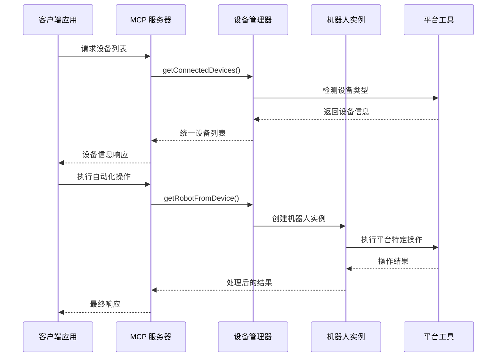

**图表来源**
- [src/server.ts:207-294](file://src/server.ts#L207-L294)
- [src/server.ts:149-197](file://src/server.ts#L149-L197)

### 平台特定实现架构

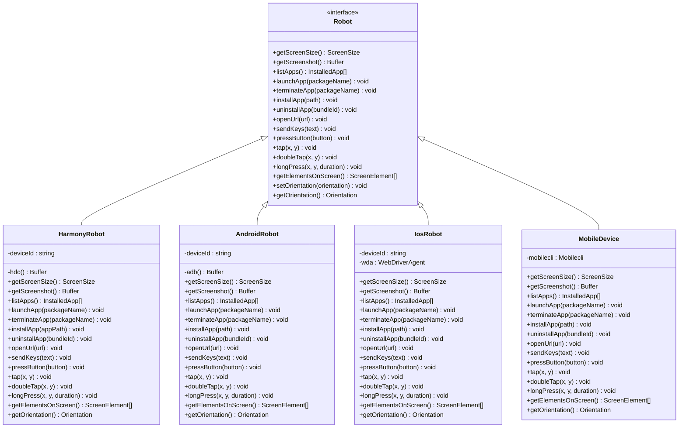

**图表来源**
- [src/robot.ts:48-147](file://src/robot.ts#L48-L147)
- [src/harmony.ts:43-416](file://src/harmony.ts#L43-L416)
- [src/android.ts:74-504](file://src/android.ts#L74-L504)
- [src/ios.ts:42-232](file://src/ios.ts#L42-L232)
- [src/mobile-device.ts:62-216](file://src/mobile-device.ts#L62-L216)

## 详细组件分析

### HarmonyOS 平台集成

#### 核心实现类

HarmonyOS 平台通过 `HarmonyRobot` 类实现完整的设备自动化功能：

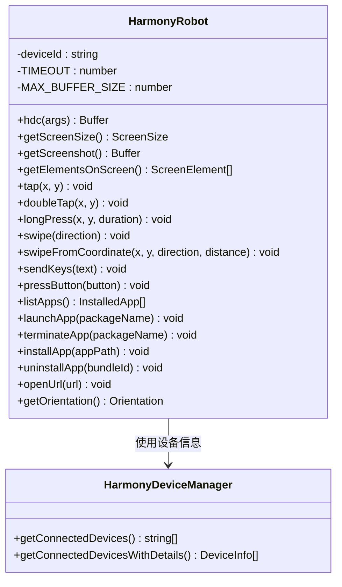

**图表来源**
- [src/harmony.ts:43-461](file://src/harmony.ts#L43-L461)

#### 设备发现机制

HarmonyOS 设备发现通过 `HarmonyDeviceManager` 实现：

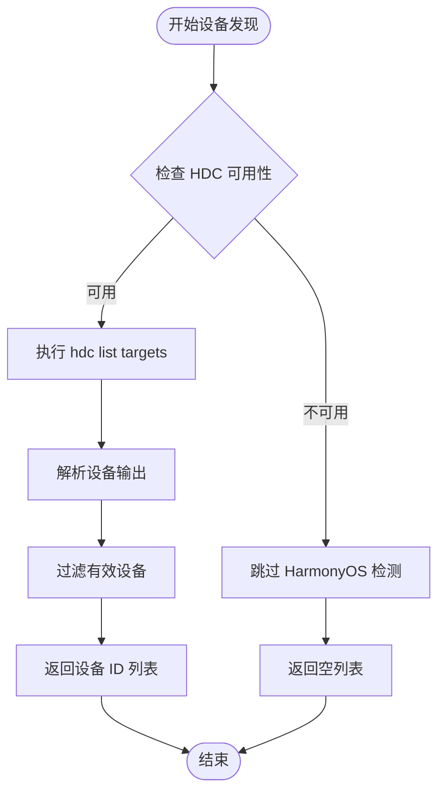

**图表来源**
- [src/harmony.ts:418-461](file://src/harmony.ts#L418-L461)

**章节来源**
- [src/harmony.ts:12-461](file://src/harmony.ts#L12-L461)

### Android 平台集成

#### 核心实现类

Android 平台通过 `AndroidRobot` 类实现完整的设备自动化功能：

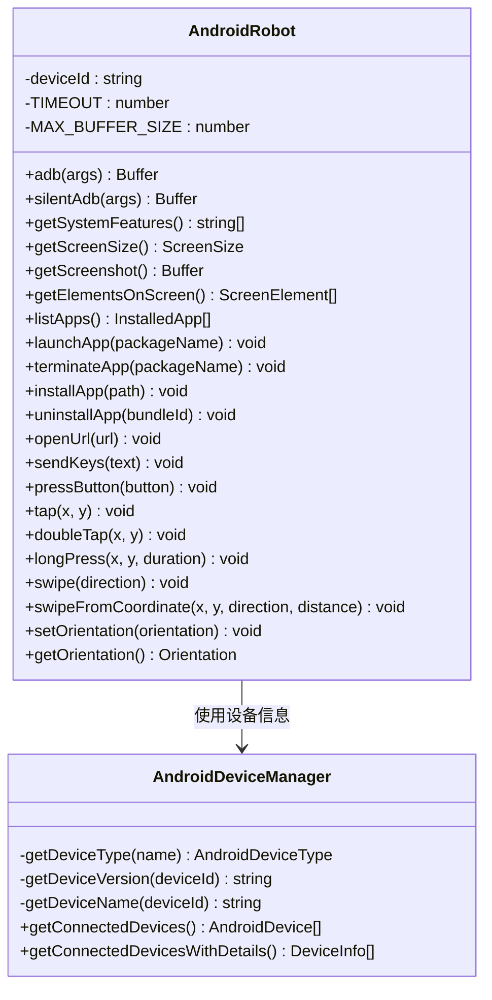

**图表来源**
- [src/android.ts:74-592](file://src/android.ts#L74-L592)

#### 屏幕截图处理

Android 平台的屏幕截图处理具有智能兼容性：

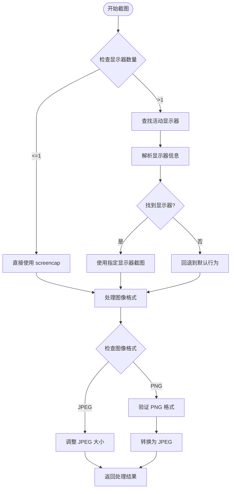

**图表来源**
- [src/android.ts:295-310](file://src/android.ts#L295-L310)
- [src/server.ts:605-650](file://src/server.ts#L605-L650)

**章节来源**
- [src/android.ts:1-593](file://src/android.ts#L1-L593)

### iOS 平台集成

#### 核心实现类

iOS 平台通过 `IosRobot` 类实现完整的设备自动化功能：

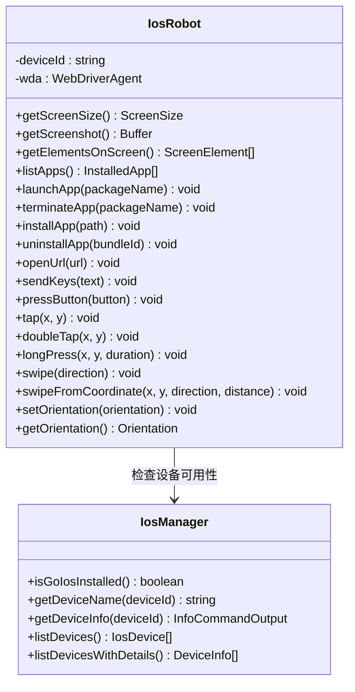

**图表来源**
- [src/ios.ts:42-293](file://src/ios.ts#L42-L293)

#### 设备隧道管理

iOS 平台的隧道管理机制：

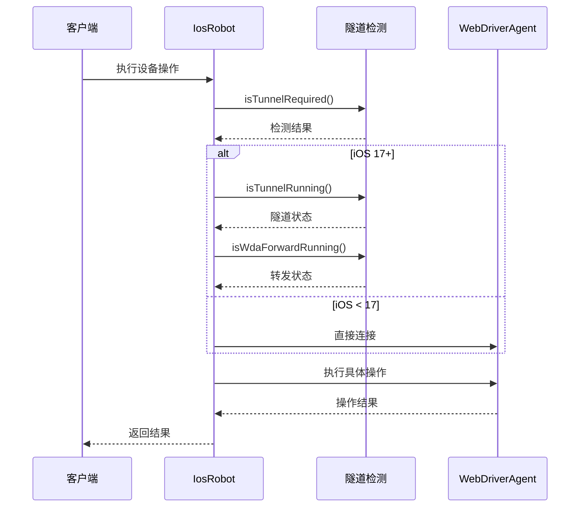

**图表来源**
- [src/ios.ts:69-92](file://src/ios.ts#L69-L92)
- [src/ios.ts:104-108](file://src/ios.ts#L104-L108)

**章节来源**
- [src/ios.ts:1-294](file://src/ios.ts#L1-L294)

### 设备管理器

#### 统一设备管理

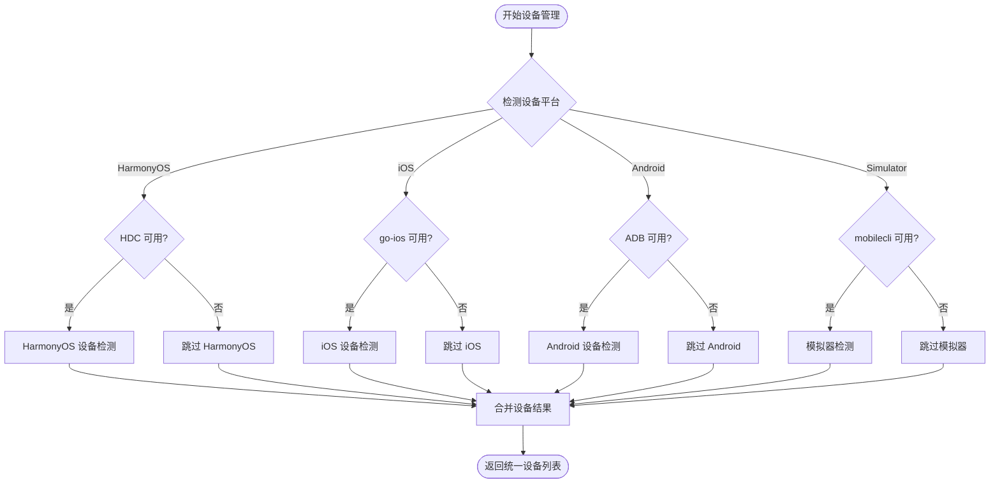

**图表来源**
- [src/server.ts:207-294](file://src/server.ts#L207-L294)
- [src/server.ts:149-197](file://src/server.ts#L149-L197)

**章节来源**
- [src/server.ts:135-197](file://src/server.ts#L135-L197)

## 依赖关系分析

### 核心依赖关系

```mermaid
graph TB
subgraph "运行时依赖"
A[@modelcontextprotocol/sdk] --> B[MCP 协议实现]
C[commander] --> D[命令行参数解析]
E[express] --> F[HTTP 服务器]
G[fast-xml-parser] --> H[XML 解析]
I[zod] --> J[数据验证]
K[zod-to-json-schema] --> L[模式生成]
end
subgraph "可选依赖"
M[@mobilenext/mobilecli] --> N[设备管理]
end
subgraph "开发依赖"
O[typescript] --> P[编译器]
Q[eslint] --> R[代码检查]
S[mocha] --> T[测试框架]
U[nyc] --> V[覆盖率]
end
subgraph "平台特定依赖"
W[hdc] --> X[HarmonyOS 设备连接]
Y[adb] --> Z[Android 设备连接]
AA[go-ios] --> BB[iOS 设备连接]
CC[mobilecli] --> DD[模拟器控制]
end
```

**图表来源**
- [package.json:29-60](file://package.json#L29-L60)

### 开发环境配置

#### Node.js 环境要求

- **Node.js 版本**: >= 18 (在 package.json 中明确声明)
- **TypeScript 编译器**: 5.8.2
- **构建工具**: tsc (TypeScript Compiler)
- **测试框架**: mocha + nyc
- **代码质量**: eslint + husky

#### 环境变量配置

| 环境变量 | 用途 | 默认值 | 示例 |
|----------|------|--------|------|
| HDC_SDK_PATH | HarmonyOS SDK 路径 | 系统 PATH | `/home/user/HarmonyOS/sdk` |
| ANDROID_HOME | Android SDK 路径 | 系统 PATH | `/home/user/Android/Sdk` |
| MOBILECLI_PATH | mobilecli 可执行文件路径 | 自动检测 | `/usr/local/bin/mobilecli` |
| GO_IOS_PATH | go-ios 可执行文件路径 | `ios` | `/usr/local/bin/ios` |
| LOG_FILE | 日志文件路径 | 控制台输出 | `/var/log/mobile-mcp.log` |

**章节来源**
- [package.json:13-15](file://package.json#L13-L15)
- [src/harmony.ts:12-18](file://src/harmony.ts#L12-L18)
- [src/android.ts:32-54](file://src/android.ts#L32-L54)
- [src/ios.ts:33-40](file://src/ios.ts#L33-L40)
- [src/mobilecli.ts:53-92](file://src/mobilecli.ts#L53-L92)

## 性能考虑

### 图像处理优化

#### 截图处理流程

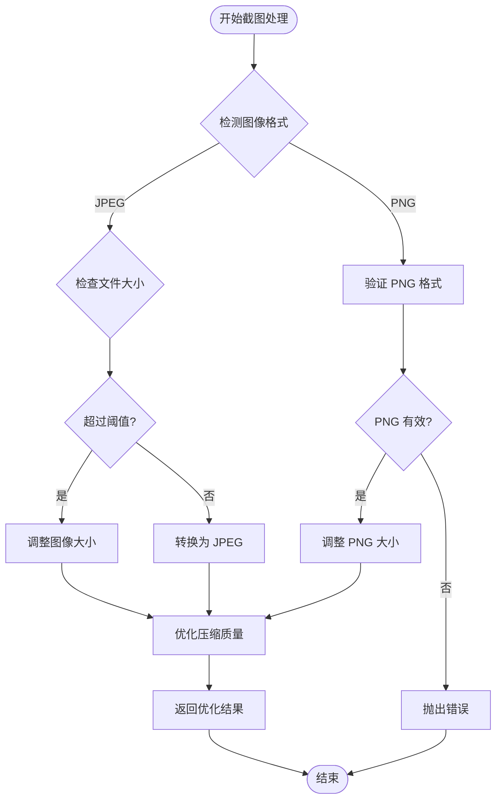

**图表来源**
- [src/server.ts:605-650](file://src/server.ts#L605-L650)

### 并发处理策略

#### 设备操作并发控制

- **超时设置**: 所有平台操作默认超时时间为 30 秒
- **缓冲区限制**: 最大缓冲区大小为 4MB，防止内存溢出
- **重试机制**: 对于临时性错误，系统会自动重试
- **资源清理**: 确保临时文件和进程资源得到正确清理

**章节来源**
- [src/harmony.ts:9-10](file://src/harmony.ts#L9-L10)
- [src/android.ts:69-70](file://src/android.ts#L69-L70)
- [src/ios.ts:7-8](file://src/ios.ts#L7-L8)

## 故障排除指南

### 常见问题诊断

#### 设备连接问题

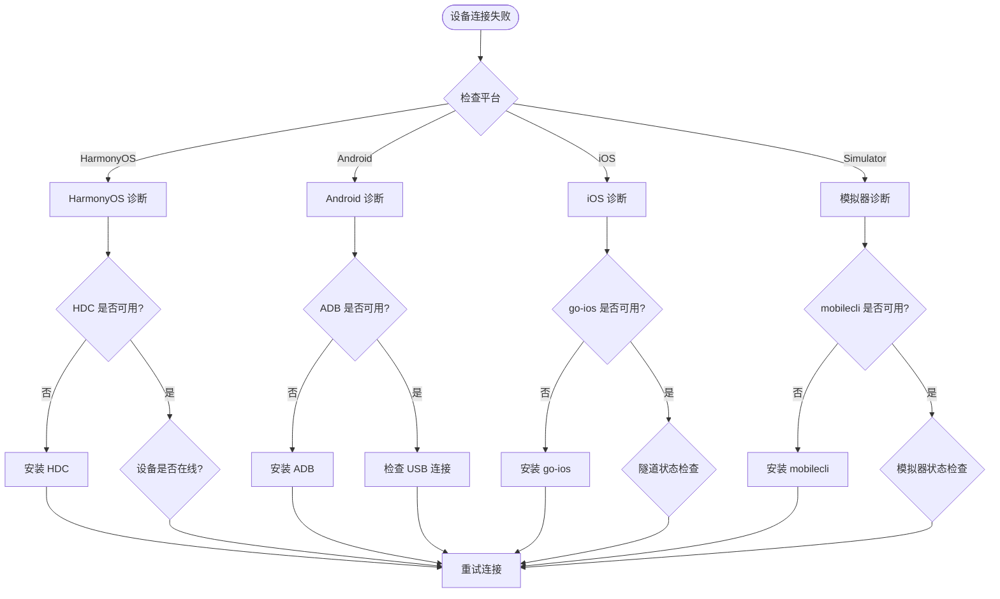

**图表来源**
- [src/server.ts:138-147](file://src/server.ts#L138-L147)
- [src/harmony.ts:418-461](file://src/harmony.ts#L418-L461)
- [src/android.ts:551-591](file://src/android.ts#L551-L591)
- [src/ios.ts:234-293](file://src/ios.ts#L234-L293)

#### 错误处理机制

系统实现了完善的错误处理机制：

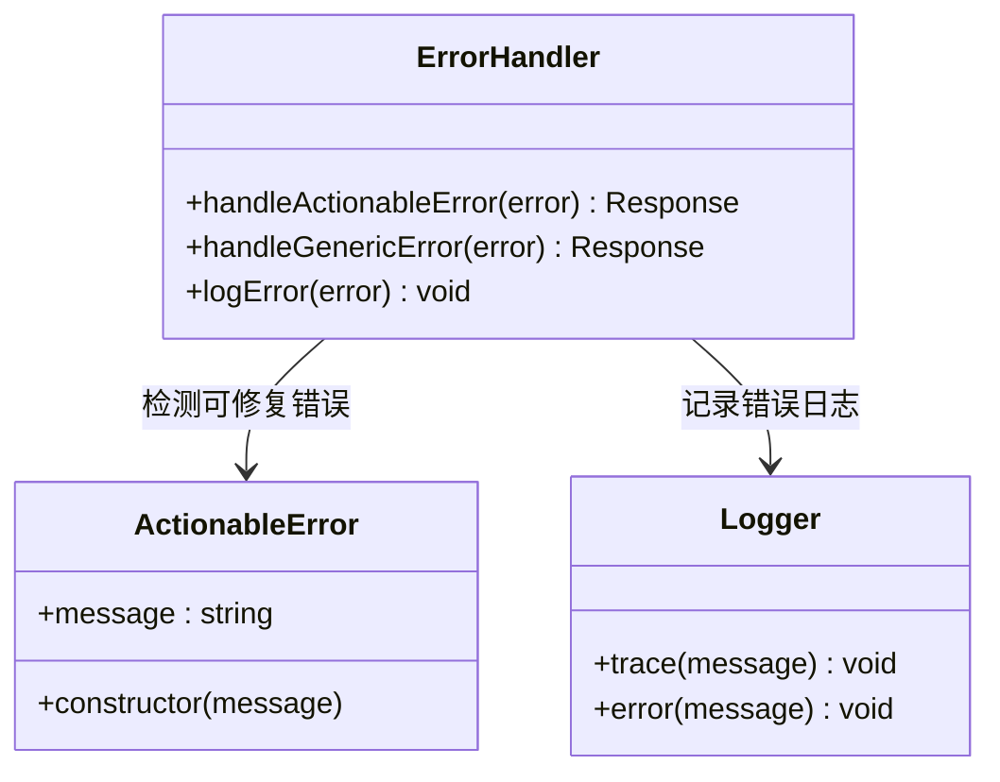

**图表来源**
- [src/robot.ts:40-44](file://src/robot.ts#L40-L44)
- [src/logger.ts:15-21](file://src/logger.ts#L15-L21)

**章节来源**
- [src/server.ts:79-94](file://src/server.ts#L79-L94)
- [src/logger.ts:1-22](file://src/logger.ts#L1-L22)

### 性能监控

#### 工具调用监控

系统内置了 PostHog 集成用于性能监控：

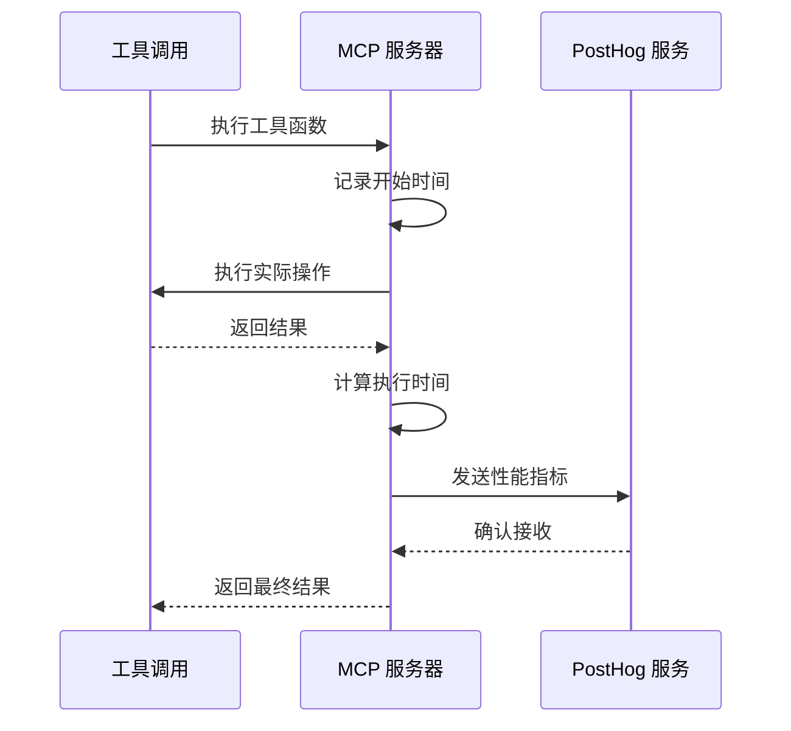

**图表来源**
- [src/server.ts:70-95](file://src/server.ts#L70-L95)
- [src/server.ts:97-133](file://src/server.ts#L97-L133)

**章节来源**
- [src/server.ts:97-133](file://src/server.ts#L97-L133)

## 结论

Mobile MCP HarmonyOS 提供了一个完整的跨平台移动设备自动化解决方案。通过统一的 MCP 接口，开发者可以无缝地在 iOS、Android 和 HarmonyOS 设备上执行自动化操作。

### 主要优势

1. **统一接口**: 所有平台使用相同的 MCP 工具集
2. **平台特定优化**: 每个平台都有针对性的实现和优化
3. **错误处理**: 完善的错误检测和恢复机制
4. **性能监控**: 内置性能指标收集和分析
5. **可扩展性**: 模块化设计便于添加新平台支持

### 未来发展方向

1. **HarmonyOS 功能完善**: 增加更多 HarmonyOS 特有的自动化功能
2. **性能优化**: 进一步优化图像处理和设备通信效率
3. **安全增强**: 加强设备连接和数据传输的安全性
4. **文档完善**: 提供更详细的 API 文档和使用示例

## 附录

### API 参考

#### 设备管理工具

| 工具名称 | 描述 | 参数 | 返回值 |
|----------|------|------|--------|
| `mobile_list_available_devices` | 列出所有可用设备 | 无 | 设备列表 JSON |
| `mobile_get_screen_size` | 获取设备屏幕尺寸 | device: 设备标识符 | 尺寸信息字符串 |
| `mobile_get_orientation` | 获取当前屏幕方向 | device: 设备标识符 | 方向信息字符串 |
| `mobile_set_orientation` | 设置屏幕方向 | device: 设备标识符, orientation: 方向 | 操作结果字符串 |

#### 应用管理工具

| 工具名称 | 描述 | 参数 | 返回值 |
|----------|------|------|--------|
| `mobile_list_apps` | 列出设备上已安装的应用 | device: 设备标识符 | 应用列表字符串 |
| `mobile_launch_app` | 通过包名启动应用 | device: 设备标识符, packageName: 包名 | 操作结果字符串 |
| `mobile_terminate_app` | 停止并终止应用 | device: 设备标识符, packageName: 包名 | 操作结果字符串 |
| `mobile_install_app` | 安装应用 | device: 设备标识符, path: 应用路径 | 操作结果字符串 |
| `mobile_uninstall_app` | 卸载应用 | device: 设备标识符, bundle_id: 包名 | 操作结果字符串 |

#### 屏幕交互工具

| 工具名称 | 描述 | 参数 | 返回值 |
|----------|------|------|--------|
| `mobile_take_screenshot` | 截取屏幕截图 | device: 设备标识符 | Base64 编码图像 |
| `mobile_save_screenshot` | 保存截图到文件 | device: 设备标识符, saveTo: 文件路径 | 操作结果字符串 |
| `mobile_list_elements_on_screen` | 列出屏幕上的 UI 元素及其坐标 | device: 设备标识符 | 元素列表 JSON |
| `mobile_click_on_screen_at_coordinates` | 点击指定坐标 | device: 设备标识符, x: X坐标, y: Y坐标 | 操作结果字符串 |
| `mobile_double_tap_on_screen` | 双击指定坐标 | device: 设备标识符, x: X坐标, y: Y坐标 | 操作结果字符串 |
| `mobile_long_press_on_screen_at_coordinates` | 长按指定坐标 | device: 设备标识符, x: X坐标, y: Y坐标, duration: 持续时间 | 操作结果字符串 |
| `mobile_swipe_on_screen` | 滑动（上/下/左/右） | device: 设备标识符, direction: 方向, x: X坐标, y: Y坐标, distance: 距离 | 操作结果字符串 |

#### 输入与导航工具

| 工具名称 | 描述 | 参数 | 返回值 |
|----------|------|------|--------|
| `mobile_type_keys` | 向焦点元素输入文本 | device: 设备标识符, text: 文本, submit: 是否提交 | 操作结果字符串 |
| `mobile_press_button` | 按下设备按钮 | device: 设备标识符, button: 按钮类型 | 操作结果字符串 |
| `mobile_open_url` | 在设备浏览器中打开 URL | device: 设备标识符, url: URL | 操作结果字符串 |

### 配置选项

#### 环境变量配置

```bash
# HarmonyOS 相关
export HDC_SDK_PATH="/path/to/harmonyos/sdk"

# Android 相关
export ANDROID_HOME="/path/to/android/sdk"

# iOS 相关
export GO_IOS_PATH="/path/to/go-ios"

# mobilecli 相关
export MOBILECLI_PATH="/path/to/mobilecli"

# 日志相关
export LOG_FILE="/var/log/mobile-mcp.log"
```

#### MCP 配置示例

```json
{
  "mcpServers": {
    "mobile-mcp": {
      "command": "npx",
      "args": ["-y", "@ali/mobile-mcp-harmony@latest"]
    }
  }
}
```

**章节来源**
- [README.md:100-171](file://README.md#L100-L171)
- [src/server.ts:199-704](file://src/server.ts#L199-L704)