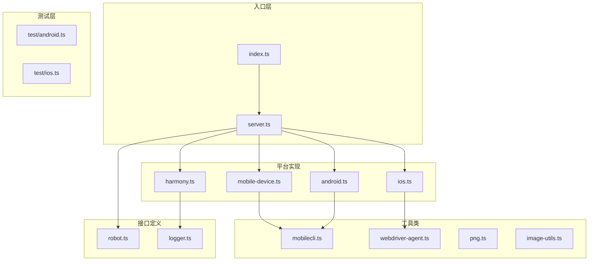
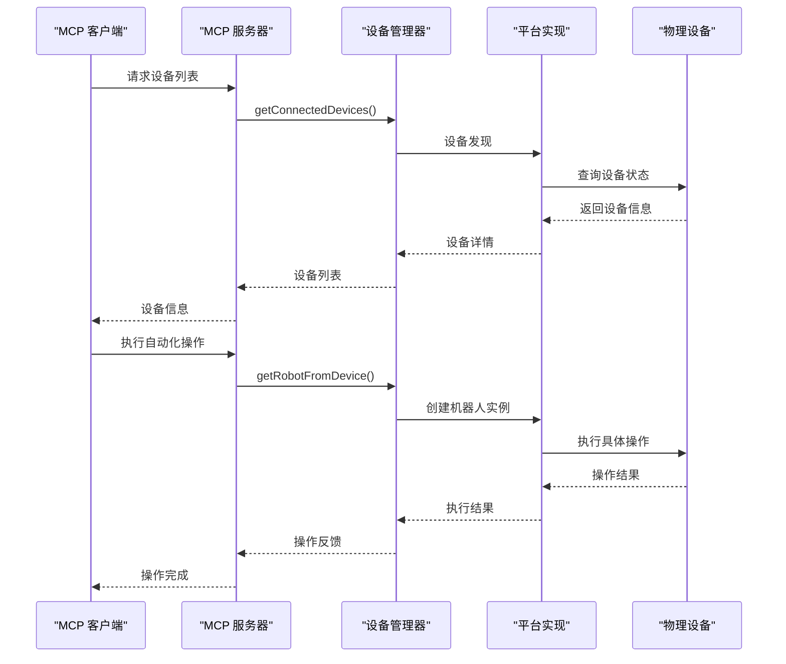
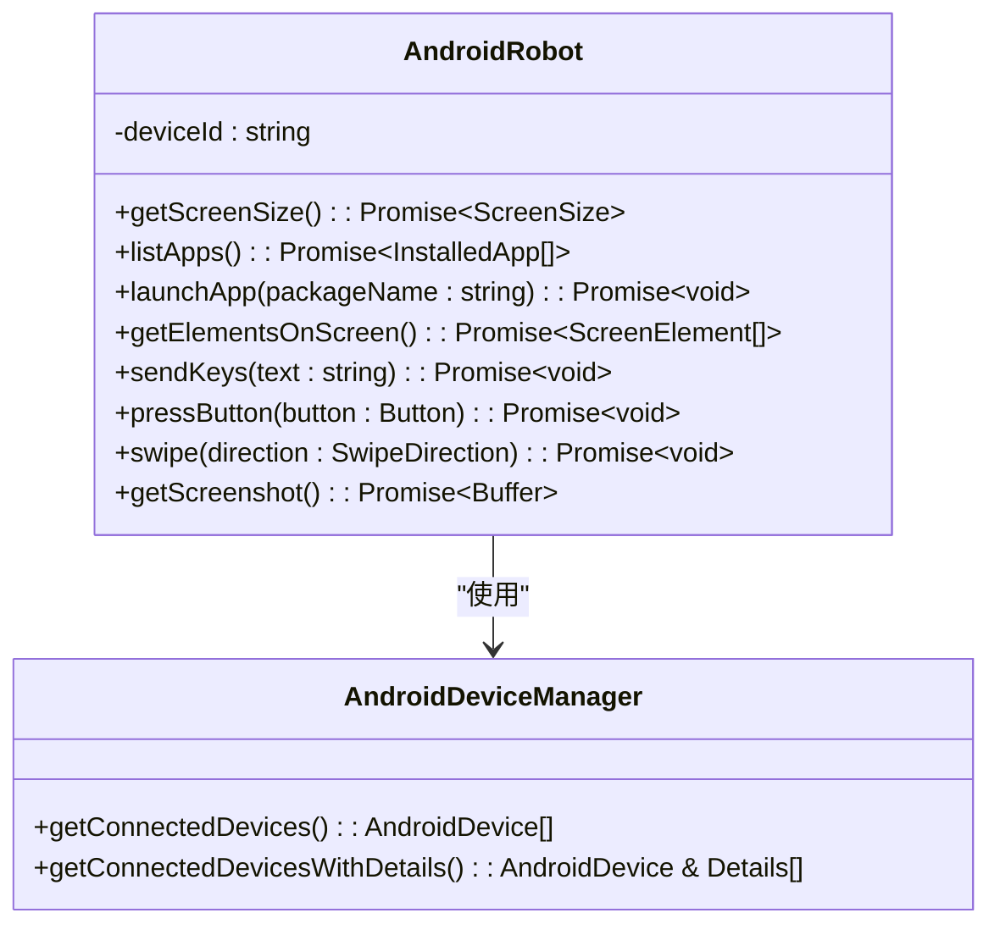
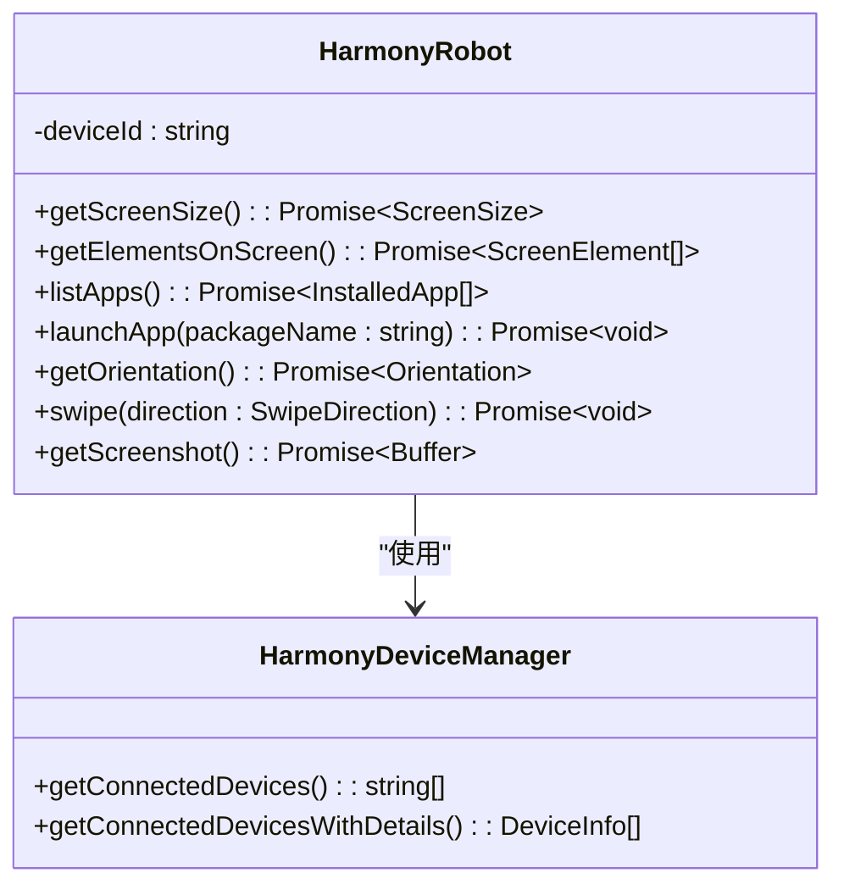
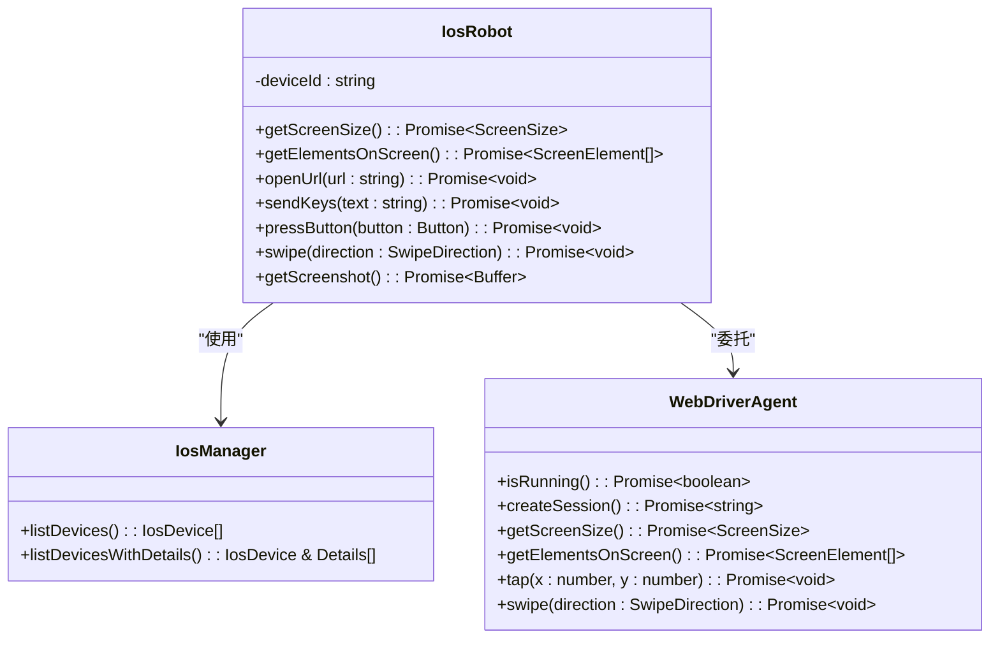
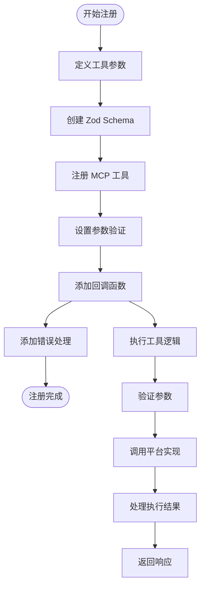
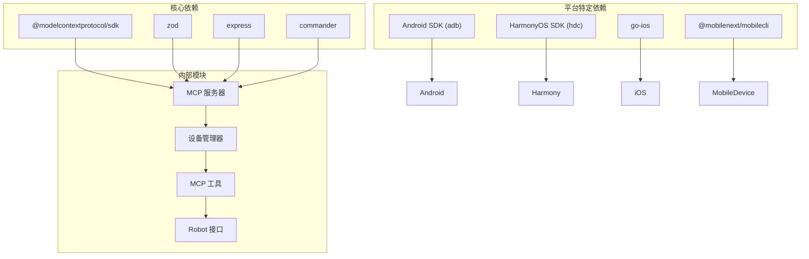
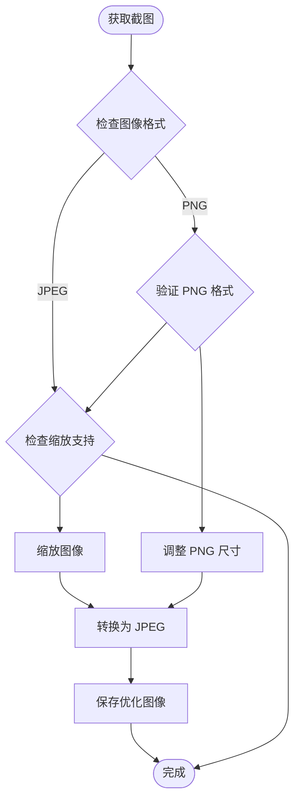

# 新平台扩展开发

<cite>
**本文档引用的文件**
- [src/index.ts](file://src/index.ts)
- [src/robot.ts](file://src/robot.ts)
- [src/server.ts](file://src/server.ts)
- [src/android.ts](file://src/android.ts)
- [src/harmony.ts](file://src/harmony.ts)
- [src/ios.ts](file://src/ios.ts)
- [src/mobile-device.ts](file://src/mobile-device.ts)
- [src/mobilecli.ts](file://src/mobilecli.ts)
- [src/webdriver-agent.ts](file://src/webdriver-agent.ts)
- [src/logger.ts](file://src/logger.ts)
- [src/png.ts](file://src/png.ts)
- [src/image-utils.ts](file://src/image-utils.ts)
- [test/android.ts](file://test/android.ts)
- [test/ios.ts](file://test/ios.ts)
- [README.md](file://README.md)
- [package.json](file://package.json)
</cite>

## 目录
1. [简介](#简介)
2. [项目结构](#项目结构)
3. [核心组件](#核心组件)
4. [架构概览](#架构概览)
5. [详细组件分析](#详细组件分析)
6. [依赖关系分析](#依赖关系分析)
7. [性能考虑](#性能考虑)
8. [故障排除指南](#故障排除指南)
9. [结论](#结论)
10. [附录](#附录)

## 简介

本文档提供了完整的平台扩展开发指南，详细说明如何实现 Robot 接口来支持新平台，包括设备管理器的扩展方法、MCP 工具的注册机制和扩展流程。该系统基于 Model Context Protocol (MCP) 提供跨平台的移动端自动化能力，支持 iOS、Android 和 HarmonyOS 设备的统一接口。

## 项目结构

该项目采用模块化的架构设计，主要包含以下核心模块：

**图表来源**
- [src/index.ts:1-67](file://src/index.ts#L1-L67)
- [src/server.ts:35-707](file://src/server.ts#L35-L707)

**章节来源**
- [src/index.ts:1-67](file://src/index.ts#L1-L67)
- [src/server.ts:35-707](file://src/server.ts#L35-L707)

## 核心组件

### Robot 接口规范

Robot 接口定义了移动设备自动化的核心能力，包括屏幕操作、应用管理、设备控制等功能。接口方法涵盖了从基础的屏幕尺寸获取到复杂的 UI 元素交互。

**章节来源**
- [src/robot.ts:48-147](file://src/robot.ts#L48-L147)

### 设备管理器架构

系统支持多种设备管理器，每种平台都有专门的管理器实现：

- **AndroidDeviceManager**: 管理 Android 设备的发现和连接
- **HarmonyDeviceManager**: 管理 HarmonyOS 设备的发现和连接  
- **IosManager**: 管理 iOS 设备的发现和连接
- **MobileDevice**: 通用设备管理器，用于 mobilecli 支持的设备

**章节来源**
- [src/android.ts:506-592](file://src/android.ts#L506-L592)
- [src/harmony.ts:418-461](file://src/harmony.ts#L418-L461)
- [src/ios.ts:234-293](file://src/ios.ts#L234-L293)
- [src/mobile-device.ts:62-216](file://src/mobile-device.ts#L62-L216)

## 架构概览

系统采用分层架构设计，通过统一的 MCP 服务器接口为客户端提供一致的自动化能力：

**图表来源**
- [src/server.ts:149-197](file://src/server.ts#L149-L197)
- [src/server.ts:298-543](file://src/server.ts#L298-L543)

**章节来源**
- [src/server.ts:35-707](file://src/server.ts#L35-L707)

## 详细组件分析

### Android 平台实现

Android 平台通过 ADB (Android Debug Bridge) 和 UI Automator 实现设备控制：

#### 核心特性
- **ADB 命令执行**: 使用 `execFileSync` 直接调用 ADB 命令
- **UI 自动化**: 通过 UI Automator 获取界面层次结构
- **屏幕截图**: 支持多显示器设备的截图捕获
- **应用管理**: 支持 APK 文件的安装和卸载

#### 关键实现模式

**图表来源**
- [src/android.ts:74-504](file://src/android.ts#L74-L504)
- [src/android.ts:506-592](file://src/android.ts#L506-L592)

**章节来源**
- [src/android.ts:74-504](file://src/android.ts#L74-L504)
- [src/android.ts:506-592](file://src/android.ts#L506-L592)

### HarmonyOS 平台实现

HarmonyOS 平台通过 HDC (HarmonyOS Device Connector) 实现设备控制，无需 mobilecli 依赖：

#### 核心特性
- **HDC 命令执行**: 使用 `execFileSync` 调用 HDC 命令
- **UI 测试框架**: 通过 uitest 进行 UI 操作和布局 dump
- **显示信息获取**: 使用 hidumper 获取屏幕尺寸和旋转信息
- **应用包管理**: 通过 bm 和 aa 命令进行应用管理

#### 关键实现模式

**图表来源**
- [src/harmony.ts:43-416](file://src/harmony.ts#L43-L416)
- [src/harmony.ts:418-461](file://src/harmony.ts#L418-L461)

**章节来源**
- [src/harmony.ts:43-416](file://src/harmony.ts#L43-L416)
- [src/harmony.ts:418-461](file://src/harmony.ts#L418-L461)

### iOS 平台实现

iOS 平台通过 WebDriverAgent 和 go-ios 工具实现设备控制：

#### 核心特性
- **WebDriverAgent 集成**: 通过 HTTP API 控制设备
- **隧道连接**: 支持 iOS 17+ 的隧道连接要求
- **端口转发**: 管理 WebDriverAgent 的端口转发
- **无障碍树**: 通过 WebDriverAgent 获取无障碍树

#### 关键实现模式

**图表来源**
- [src/ios.ts:42-232](file://src/ios.ts#L42-L232)
- [src/ios.ts:234-293](file://src/ios.ts#L234-L293)
- [src/webdriver-agent.ts:25-454](file://src/webdriver-agent.ts#L25-L454)

**章节来源**
- [src/ios.ts:42-232](file://src/ios.ts#L42-L232)
- [src/ios.ts:234-293](file://src/ios.ts#L234-L293)
- [src/webdriver-agent.ts:25-454](file://src/webdriver-agent.ts#L25-L454)

### MCP 工具注册机制

系统通过统一的工具注册机制提供标准化的自动化能力：

#### 工具注册流程

**图表来源**
- [src/server.ts:62-95](file://src/server.ts#L62-L95)
- [src/server.ts:199-543](file://src/server.ts#L199-L543)

**章节来源**
- [src/server.ts:62-95](file://src/server.ts#L62-L95)
- [src/server.ts:199-543](file://src/server.ts#L199-L543)

## 依赖关系分析

系统采用模块化设计，各组件之间的依赖关系清晰明确：

**图表来源**
- [package.json:29-39](file://package.json#L29-L39)
- [src/server.ts:8-15](file://src/server.ts#L8-L15)

**章节来源**
- [package.json:29-39](file://package.json#L29-L39)
- [src/server.ts:8-15](file://src/server.ts#L8-L15)

## 性能考虑

### 截图优化策略

系统实现了智能的截图处理机制，根据设备类型和图像格式进行优化：

**图表来源**
- [src/server.ts:605-650](file://src/server.ts#L605-L650)

**章节来源**
- [src/server.ts:605-650](file://src/server.ts#L605-L650)

### 错误处理和重试机制

系统实现了多层次的错误处理机制，确保平台扩展的稳定性：

- **ActionableError**: 用于可修复的错误情况
- **超时处理**: 所有外部命令执行都有超时保护
- **资源清理**: 确保临时文件和进程得到正确清理
- **降级策略**: 当高级功能不可用时提供替代方案

**章节来源**
- [src/robot.ts:40-44](file://src/robot.ts#L40-L44)
- [src/android.ts:69](file://src/android.ts#L69)

## 故障排除指南

### 常见问题诊断

#### 设备发现失败
1. **检查环境变量**: 确保 ANDROID_HOME、HDC_SDK_PATH 等环境变量正确设置
2. **验证依赖安装**: 确认 ADB、HDC、go-ios 等工具在 PATH 中
3. **权限检查**: 确保有足够的权限访问设备

#### 截图异常
1. **格式验证**: 检查截图是否为有效的 PNG/JPEG 格式
2. **尺寸匹配**: 确认截图尺寸与屏幕尺寸一致
3. **内存限制**: 检查是否有内存不足的问题

#### 平台特定问题
- **Android**: 检查 ADB 连接状态和权限
- **HarmonyOS**: 验证 HDC 服务运行状态
- **iOS**: 确认 WebDriverAgent 和隧道连接正常

**章节来源**
- [src/server.ts:138-147](file://src/server.ts#L138-L147)
- [src/logger.ts:1-22](file://src/logger.ts#L1-L22)

## 结论

该平台扩展开发框架提供了完整的移动端自动化解决方案，支持多种平台的统一接口。通过模块化的架构设计和标准化的接口规范，开发者可以轻松地为新平台添加支持。关键的设计原则包括：

1. **接口一致性**: 所有平台都实现相同的 Robot 接口
2. **模块化设计**: 平台特定的实现相互独立
3. **错误处理**: 完善的错误处理和降级策略
4. **性能优化**: 智能的资源管理和优化策略

## 附录

### 开发最佳实践

#### 接口实现要求
- 确保所有 Robot 接口方法都有完整的错误处理
- 实现适当的超时和重试机制
- 提供详细的日志记录和调试信息
- 遵循平台特定的权限和安全要求

#### 测试建议
- 编写单元测试覆盖核心功能
- 实现集成测试验证端到端流程
- 创建性能测试评估不同平台的效率
- 建立回归测试确保向后兼容性

#### 部署考虑
- 确保依赖项的版本兼容性
- 配置适当的日志级别和输出
- 实现监控和告警机制
- 准备故障恢复和回滚策略