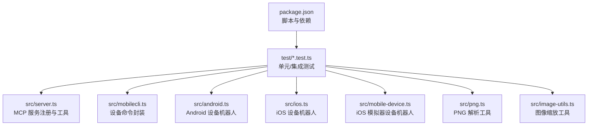
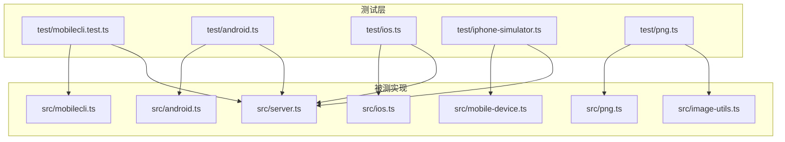
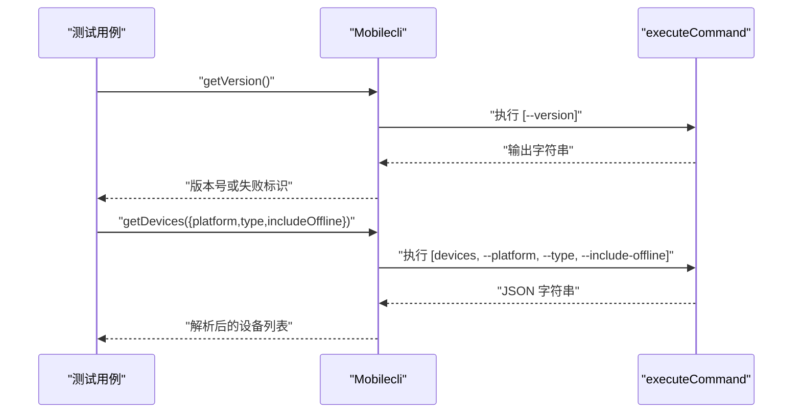
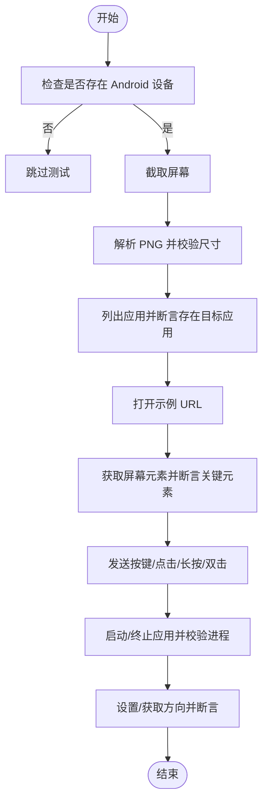
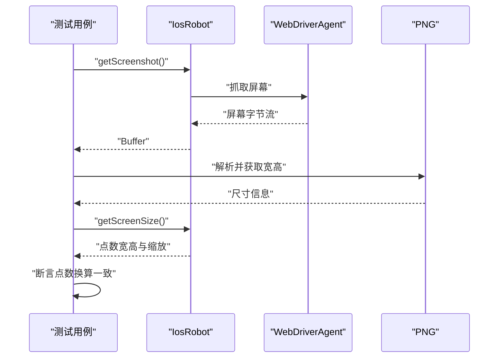
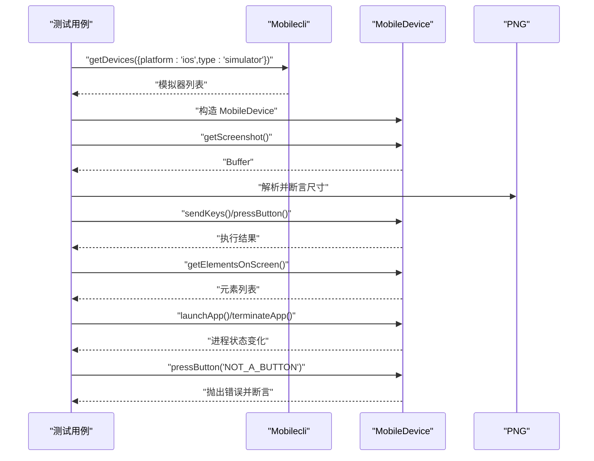
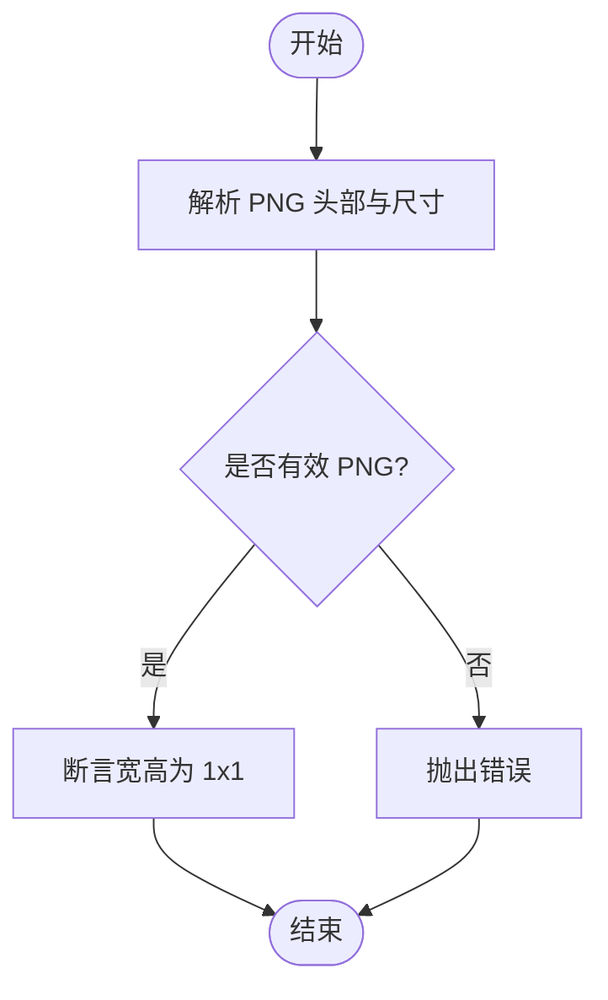
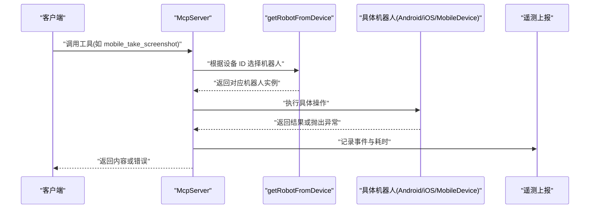
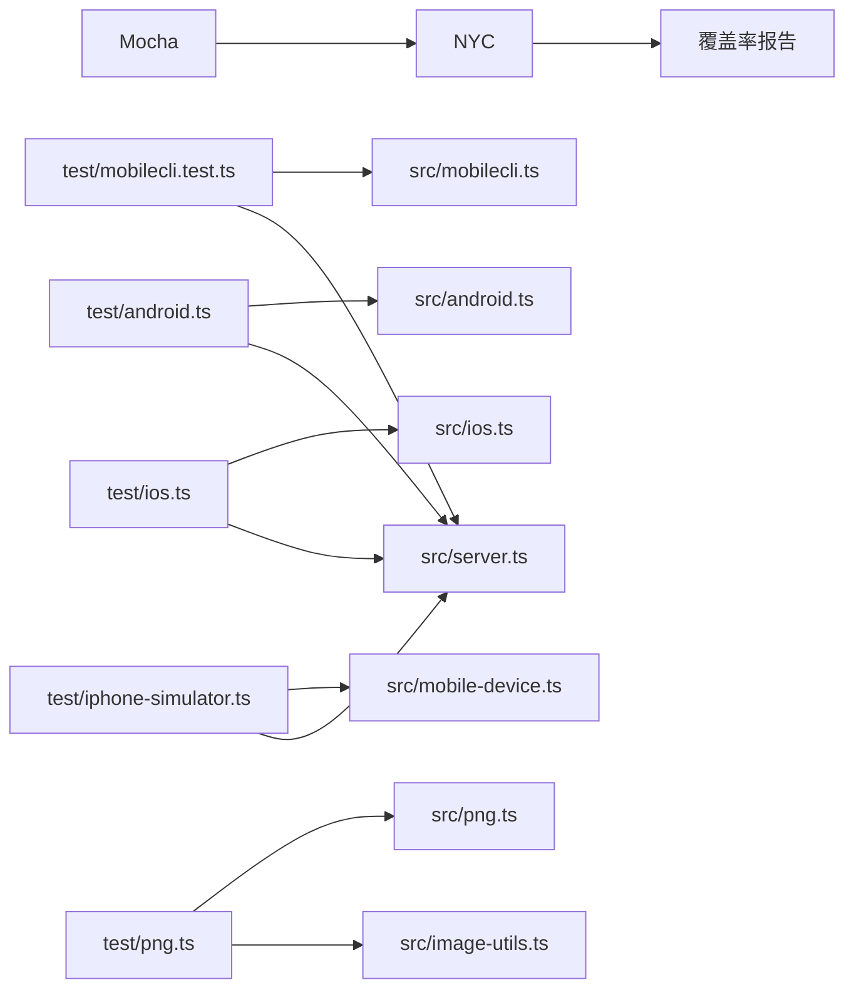

# 测试与验证

<cite>
**本文引用的文件**
- [package.json](file://package.json)
- [.mocharc.yml](file://.mocharc.yml)
- [src/index.ts](file://src/index.ts)
- [src/server.ts](file://src/server.ts)
- [src/mobilecli.ts](file://src/mobilecli.ts)
- [src/android.ts](file://src/android.ts)
- [src/ios.ts](file://src/ios.ts)
- [src/mobile-device.ts](file://src/mobile-device.ts)
- [src/png.ts](file://src/png.ts)
- [src/image-utils.ts](file://src/image-utils.ts)
- [test/mobilecli.test.ts](file://test/mobilecli.test.ts)
- [test/android.ts](file://test/android.ts)
- [test/ios.ts](file://test/ios.ts)
- [test/iphone-simulator.ts](file://test/iphone-simulator.ts)
- [test/png.ts](file://test/png.ts)
</cite>

## 目录
1. [引言](#引言)
2. [项目结构](#项目结构)
3. [核心组件](#核心组件)
4. [架构总览](#架构总览)
5. [详细组件分析](#详细组件分析)
6. [依赖关系分析](#依赖关系分析)
7. [性能考量](#性能考量)
8. [故障排查指南](#故障排查指南)
9. [结论](#结论)
10. [附录](#附录)

## 引言
本指南面向新平台测试与验证，围绕该仓库现有的测试体系，系统化阐述单元测试与集成测试（含端到端与性能维度）的编写方法、工具与环境配置、常见场景与边界条件处理、以及覆盖率与质量标准建议。文档以实际源码为依据，结合现有测试文件，帮助读者快速落地可维护、可扩展的测试方案。

## 项目结构
该项目采用“源码在 src，测试在 test”的分层组织方式；测试框架为 Mocha，配合 NYC 进行覆盖率统计；通过 npm scripts 统一执行测试流程。整体结构清晰，便于按模块拆分测试任务。

图表来源
- [package.json:17-24](file://package.json#L17-L24)
- [test/mobilecli.test.ts:1-120](file://test/mobilecli.test.ts#L1-L120)
- [src/server.ts:35-707](file://src/server.ts#L35-L707)
- [src/mobilecli.ts:27-136](file://src/mobilecli.ts#L27-L136)
- [src/android.ts:74-593](file://src/android.ts#L74-L593)
- [src/ios.ts:42-294](file://src/ios.ts#L42-L294)
- [src/mobile-device.ts:62-217](file://src/mobile-device.ts#L62-L217)
- [src/png.ts:6-21](file://src/png.ts#L6-L21)
- [src/image-utils.ts:9-165](file://src/image-utils.ts#L9-L165)

章节来源
- [package.json:17-24](file://package.json#L17-L24)
- [test/mobilecli.test.ts:1-120](file://test/mobilecli.test.ts#L1-L120)

## 核心组件
- 测试运行与覆盖率
  - 使用 Mocha 执行测试，NYC 聚合覆盖率数据，通过 npm 脚本统一入口调用。
- 工具与服务
  - server.ts 注册 MCP 工具集，覆盖设备发现、应用管理、屏幕交互、截图等能力。
  - mobilecli.ts 封装底层二进制工具路径解析与命令执行。
  - android.ts/ios.ts/mobile-device.ts 提供各平台机器人实现。
  - png.ts/image-utils.ts 提供图像解析与缩放能力。

章节来源
- [package.json:17-24](file://package.json#L17-L24)
- [src/server.ts:35-707](file://src/server.ts#L35-L707)
- [src/mobilecli.ts:27-136](file://src/mobilecli.ts#L27-L136)
- [src/android.ts:74-593](file://src/android.ts#L74-L593)
- [src/ios.ts:42-294](file://src/ios.ts#L42-L294)
- [src/mobile-device.ts:62-217](file://src/mobile-device.ts#L62-L217)
- [src/png.ts:6-21](file://src/png.ts#L6-L21)
- [src/image-utils.ts:9-165](file://src/image-utils.ts#L9-L165)

## 架构总览
下图展示测试与被测组件之间的关系：测试文件依赖具体实现模块，Mocha 作为运行时驱动，NYC 负责覆盖率统计；部分测试对真实设备或模拟器进行端到端验证。

图表来源
- [test/mobilecli.test.ts:1-120](file://test/mobilecli.test.ts#L1-L120)
- [test/android.ts:1-140](file://test/android.ts#L1-L140)
- [test/ios.ts:1-29](file://test/ios.ts#L1-L29)
- [test/iphone-simulator.ts:1-196](file://test/iphone-simulator.ts#L1-L196)
- [test/png.ts:1-24](file://test/png.ts#L1-L24)
- [src/server.ts:35-707](file://src/server.ts#L35-L707)
- [src/mobilecli.ts:27-136](file://src/mobilecli.ts#L27-L136)
- [src/android.ts:74-593](file://src/android.ts#L74-L593)
- [src/ios.ts:42-294](file://src/ios.ts#L42-L294)
- [src/mobile-device.ts:62-217](file://src/mobile-device.ts#L62-L217)
- [src/png.ts:6-21](file://src/png.ts#L6-L21)
- [src/image-utils.ts:9-165](file://src/image-utils.ts#L9-L165)

## 详细组件分析

### 单元测试：mobilecli 命令封装
- 测试目标
  - 版本查询、设备列表参数组合、错误路径与环境变量影响。
- 关键点
  - 使用函数替换模拟底层命令执行，确保断言可验证参数序列与返回值。
  - 验证环境变量对二进制路径解析的影响。
- 断言要点
  - 返回字符串长度与格式校验。
  - 参数数组顺序与内容匹配。
  - 错误场景返回值包含失败标识。

图表来源
- [test/mobilecli.test.ts:24-57](file://test/mobilecli.test.ts#L24-L57)
- [test/mobilecli.test.ts:75-118](file://test/mobilecli.test.ts#L75-L118)
- [src/mobilecli.ts:94-134](file://src/mobilecli.ts#L94-L134)

章节来源
- [test/mobilecli.test.ts:1-120](file://test/mobilecli.test.ts#L1-L120)
- [src/mobilecli.ts:27-136](file://src/mobilecli.ts#L27-L136)

### 集成测试：Android 端到端
- 测试目标
  - 屏幕尺寸、截图、应用列表、URL 打开、元素识别、按键与点击、应用启停、方向切换。
- 关键点
  - 通过设备管理器获取连接设备，存在性检查后跳过测试。
  - 截图尺寸与 PNG 尺寸一致性校验。
  - 元素识别基于视图层级，断言关键控件存在。
- 边界条件
  - 设备不存在时跳过测试。
  - 应用启停前后进程列表变化。

图表来源
- [test/android.ts:14-138](file://test/android.ts#L14-L138)
- [src/android.ts:103-504](file://src/android.ts#L103-L504)
- [src/png.ts:6-21](file://src/png.ts#L6-L21)

章节来源
- [test/android.ts:1-140](file://test/android.ts#L1-L140)
- [src/android.ts:74-593](file://src/android.ts#L74-L593)
- [src/png.ts:6-21](file://src/png.ts#L6-L21)

### 集成测试：iOS 端到端
- 测试目标
  - 截图尺寸与 PNG 尺寸一致性，屏幕点数与缩放换算。
- 关键点
  - 通过 WebDriverAgent 获取屏幕尺寸，PNG 尺寸需与点数换算一致。
- 边界条件
  - 设备不存在时跳过测试。

图表来源
- [test/ios.ts:13-27](file://test/ios.ts#L13-L27)
- [src/ios.ts:104-231](file://src/ios.ts#L104-L231)
- [src/png.ts:6-21](file://src/png.ts#L6-L21)

章节来源
- [test/ios.ts:1-29](file://test/ios.ts#L1-L29)
- [src/ios.ts:42-294](file://src/ios.ts#L42-L294)
- [src/png.ts:6-21](file://src/png.ts#L6-L21)

### 集成测试：iPhone 模拟器端到端
- 测试目标
  - 滑动、输入文本与回车、屏幕尺寸、截图、URL 打开、应用列表、元素识别、应用启停、按钮不支持的错误处理。
- 关键点
  - 通过 mobilecli 发现已开机模拟器，构造 MobileDevice 实例。
  - 截图尺寸与 PNG 尺寸一致性校验。
- 边界条件
  - 无模拟器时跳过测试。
  - 不支持按钮触发错误。

图表来源
- [test/iphone-simulator.ts:10-194](file://test/iphone-simulator.ts#L10-L194)
- [src/mobile-device.ts:62-217](file://src/mobile-device.ts#L62-L217)
- [src/png.ts:6-21](file://src/png.ts#L6-L21)

章节来源
- [test/iphone-simulator.ts:1-196](file://test/iphone-simulator.ts#L1-L196)
- [src/mobile-device.ts:62-217](file://src/mobile-device.ts#L62-L217)
- [src/png.ts:6-21](file://src/png.ts#L6-L21)

### 单元测试：PNG 解析
- 测试目标
  - 正常 PNG 的宽高解析、无效 PNG 抛错。
- 关键点
  - 基于文件头签名判断有效性。
  - 宽高字段读取与断言。

图表来源
- [test/png.ts:6-22](file://test/png.ts#L6-L22)
- [src/png.ts:10-19](file://src/png.ts#L10-L19)

章节来源
- [test/png.ts:1-24](file://test/png.ts#L1-L24)
- [src/png.ts:6-21](file://src/png.ts#L6-L21)

### 服务工具注册与错误处理（端到端）
- 测试目标
  - server.ts 中工具注册、设备选择逻辑、错误包装与上报。
- 关键点
  - getRobotFromDevice 根据设备类型路由到不同机器人。
  - ActionableError 用于可操作提示，普通异常转为错误响应。
  - 截图工具对图片格式检测与缩放链路。

图表来源
- [src/server.ts:149-197](file://src/server.ts#L149-L197)
- [src/server.ts:585-673](file://src/server.ts#L585-L673)
- [src/android.ts:74-593](file://src/android.ts#L74-L593)
- [src/ios.ts:42-294](file://src/ios.ts#L42-L294)
- [src/mobile-device.ts:62-217](file://src/mobile-device.ts#L62-L217)

章节来源
- [src/server.ts:35-707](file://src/server.ts#L35-L707)

## 依赖关系分析
- 测试对实现的耦合
  - 单元测试通过函数替换与环境变量注入隔离外部依赖。
  - 集成测试依赖真实设备或模拟器，存在平台差异与网络隧道要求。
- 外部依赖
  - Android: ADB、UIAutomator。
  - iOS: go-ios、WebDriverAgent、端口转发与隧道。
  - 图像处理：Sips 或 ImageMagick（可选）。

图表来源
- [package.json:17-24](file://package.json#L17-L24)
- [test/mobilecli.test.ts:1-120](file://test/mobilecli.test.ts#L1-L120)
- [test/android.ts:1-140](file://test/android.ts#L1-L140)
- [test/ios.ts:1-29](file://test/ios.ts#L1-L29)
- [test/iphone-simulator.ts:1-196](file://test/iphone-simulator.ts#L1-L196)
- [test/png.ts:1-24](file://test/png.ts#L1-L24)
- [src/mobilecli.ts:27-136](file://src/mobilecli.ts#L27-L136)
- [src/android.ts:74-593](file://src/android.ts#L74-L593)
- [src/ios.ts:42-294](file://src/ios.ts#L42-L294)
- [src/mobile-device.ts:62-217](file://src/mobile-device.ts#L62-L217)
- [src/png.ts:6-21](file://src/png.ts#L6-L21)
- [src/image-utils.ts:9-165](file://src/image-utils.ts#L9-L165)
- [src/server.ts:35-707](file://src/server.ts#L35-L707)

章节来源
- [package.json:17-24](file://package.json#L17-L24)

## 性能考量
- 截图与图像处理
  - 截图体积与格式检测，必要时进行缩放以降低传输与存储成本。
  - 缩放依赖系统工具（Sips/ImageMagick），不可用时降级处理。
- 命令超时与缓冲区限制
  - 子进程执行设置超时与最大缓冲区，避免阻塞与内存占用过高。
- 端到端等待
  - 针对应用启动、页面加载等异步过程，使用合理延时或轮询策略，避免脆弱等待。

章节来源
- [src/server.ts:585-673](file://src/server.ts#L585-L673)
- [src/image-utils.ts:9-165](file://src/image-utils.ts#L9-L165)
- [src/android.ts:69-71](file://src/android.ts#L69-L71)
- [src/mobilecli.ts:24-25](file://src/mobilecli.ts#L24-L25)

## 故障排查指南
- 移动端依赖缺失
  - Android：未找到 ADB 或 ANDROID_HOME 未配置，导致设备枚举失败。
  - iOS：go-ios 未安装或版本不满足，物理设备无法枚举；WebDriverAgent 未就绪或端口转发异常。
- 设备不可用
  - 模拟器未开机或离线；物理设备未解锁或未信任。
- 命令执行失败
  - 子进程超时或输出非预期，检查参数拼接与平台差异。
- 截图异常
  - 非法 PNG 或 JPEG 尺寸为 0，需重试或切换格式。

章节来源
- [src/android.ts:32-54](file://src/android.ts#L32-L54)
- [src/ios.ts:33-40](file://src/ios.ts#L33-L40)
- [src/ios.ts:69-92](file://src/ios.ts#L69-L92)
- [src/server.ts:585-673](file://src/server.ts#L585-L673)

## 结论
本仓库已具备完善的单元与集成测试基础：单元测试覆盖命令封装与工具注册路径，集成测试覆盖多平台端到端流程。建议在现有基础上补充：
- 更多边界与异常场景（如网络中断、权限不足、设备断连重连）。
- 性能回归测试（截图大小、工具调用耗时）。
- 可重复的测试环境（CI/CD 中的设备准备与清理）。
- 覆盖率阈值与质量门禁（结合 NYC 报告）。

## 附录

### 测试工具与环境配置
- 运行与覆盖率
  - 使用 npm 脚本统一执行测试与覆盖率统计。
- 测试超时
  - Mocha 超时时间在配置文件中设定。
- 平台要求
  - Android：ADB、UIAutomator。
  - iOS：go-ios、WebDriverAgent、端口转发与隧道。
  - 图像处理：Sips 或 ImageMagick（可选）。

章节来源
- [package.json:17-24](file://package.json#L17-L24)
- [.mocharc.yml:1-2](file://.mocharc.yml#L1-L2)
- [src/android.ts:32-54](file://src/android.ts#L32-L54)
- [src/ios.ts:33-40](file://src/ios.ts#L33-L40)
- [src/image-utils.ts:137-165](file://src/image-utils.ts#L137-L165)