# 设备发现机制

<cite>
**本文档引用的文件**
- [index.ts](file://src/index.ts)
- [server.ts](file://src/server.ts)
- [robot.ts](file://src/robot.ts)
- [mobilecli.ts](file://src/mobilecli.ts)
- [android.ts](file://src/android.ts)
- [harmony.ts](file://src/harmony.ts)
- [ios.ts](file://src/ios.ts)
- [mobile-device.ts](file://src/mobile-device.ts)
- [iphone-simulator.ts](file://src/iphone-simulator.ts)
- [README.md](file://README.md)
- [mobilecli.test.ts](file://test/mobilecli.test.ts)
</cite>

## 目录
1. [简介](#简介)
2. [项目结构](#项目结构)
3. [核心组件](#核心组件)
4. [架构概览](#架构概览)
5. [详细组件分析](#详细组件分析)
6. [依赖关系分析](#依赖关系分析)
7. [性能考虑](#性能考虑)
8. [故障排除指南](#故障排除指南)
9. [结论](#结论)

## 简介

本文档详细说明了移动测试项目中的设备发现机制实现原理和方法。该系统支持 iOS、Android 和 HarmonyOS 三大平台的设备自动化，通过统一的 Model Context Protocol (MCP) 接口为 AI Agent 提供跨平台的移动设备控制能力。

系统的核心特性包括：
- 统一的设备发现和路由机制
- 多平台设备类型识别
- 结构化的设备信息管理
- 容错的错误处理机制

## 项目结构

该项目采用模块化设计，主要包含以下核心模块：

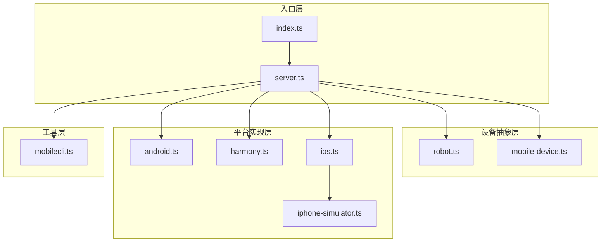

**图表来源**
- [index.ts:1-67](file://src/index.ts#L1-L67)
- [server.ts:35-708](file://src/server.ts#L35-L708)

**章节来源**
- [index.ts:1-67](file://src/index.ts#L1-L67)
- [README.md:1-198](file://README.md#L1-L198)

## 核心组件

### 设备发现架构

系统采用分层的设备发现架构，通过统一的 `getRobotFromDevice` 函数实现设备路由逻辑：

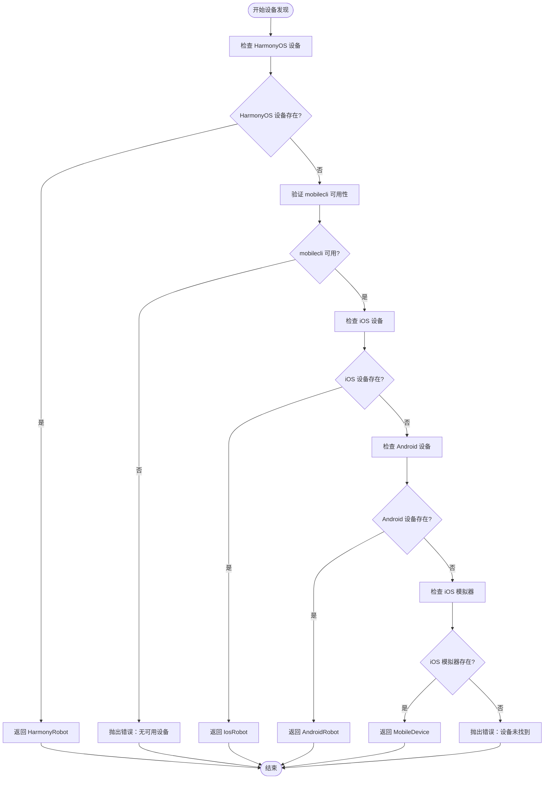

**图表来源**
- [server.ts:149-197](file://src/server.ts#L149-L197)

### 设备类型识别机制

系统通过以下方式识别不同类型的设备：

1. **HarmonyOS 设备**：直接通过 `hdc list targets` 命令检测
2. **iOS 设备**：通过 `go-ios list` 命令检测物理设备
3. **Android 设备**：通过 `adb devices` 命令检测
4. **iOS 模拟器**：通过 `mobilecli` 工具检测

**章节来源**
- [server.ts:149-197](file://src/server.ts#L149-L197)
- [harmony.ts:418-461](file://src/harmony.ts#L418-L461)
- [ios.ts:234-293](file://src/ios.ts#L234-L293)
- [android.ts:506-592](file://src/android.ts#L506-L592)

## 架构概览

### 设备发现服务

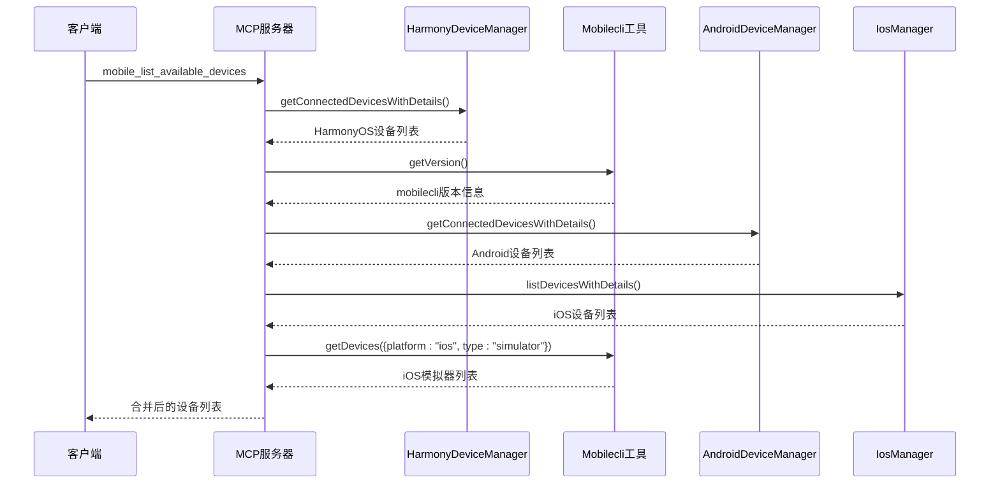

**图表来源**
- [server.ts:207-294](file://src/server.ts#L207-L294)
- [harmony.ts:418-461](file://src/harmony.ts#L418-L461)
- [android.ts:506-592](file://src/android.ts#L506-L592)
- [ios.ts:234-293](file://src/ios.ts#L234-L293)

### 设备路由逻辑

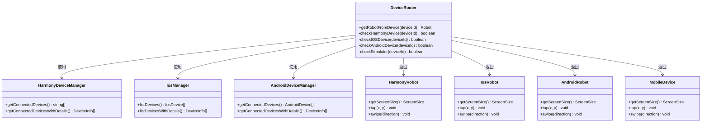

**图表来源**
- [server.ts:149-197](file://src/server.ts#L149-L197)
- [harmony.ts:418-461](file://src/harmony.ts#L418-L461)
- [ios.ts:234-293](file://src/ios.ts#L234-L293)
- [android.ts:506-592](file://src/android.ts#L506-L592)

**章节来源**
- [server.ts:149-197](file://src/server.ts#L149-L197)
- [server.ts:207-294](file://src/server.ts#L207-L294)

## 详细组件分析

### getRobotFromDevice 函数实现

该函数实现了设备路由的核心逻辑，具有明确的检测顺序和优先级：

#### HarmonyOS 设备检测

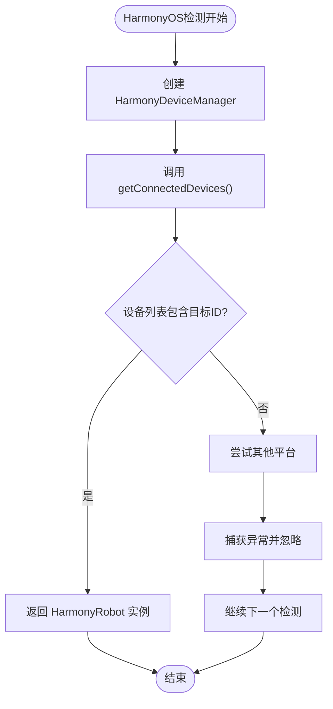

**图表来源**
- [server.ts:151-160](file://src/server.ts#L151-L160)

#### iOS 设备检测

iOS 设备检测依赖于 `go-ios` 工具的可用性：

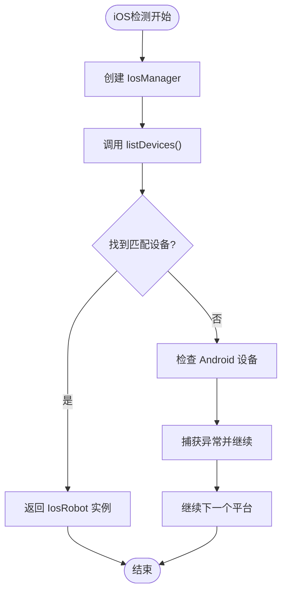

**图表来源**
- [server.ts:165-171](file://src/server.ts#L165-L171)

#### Android 设备检测

Android 设备检测使用 `adb` 工具：

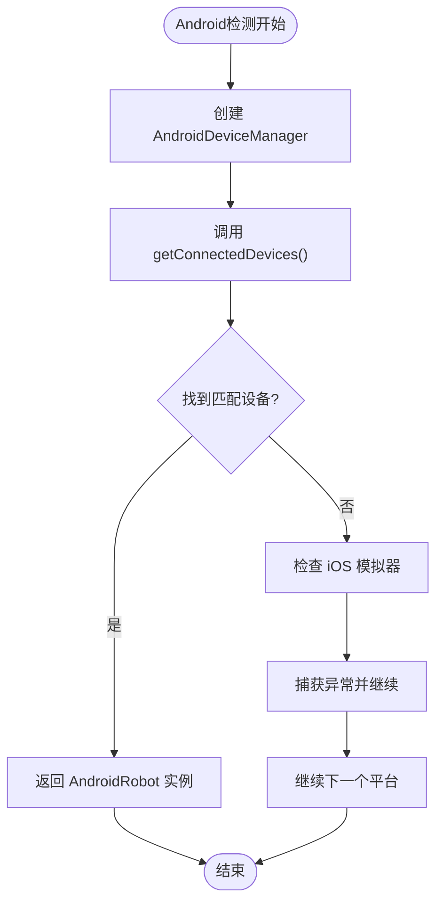

**图表来源**
- [server.ts:173-179](file://src/server.ts#L173-L179)

#### iOS 模拟器检测

iOS 模拟器通过 `mobilecli` 工具检测：

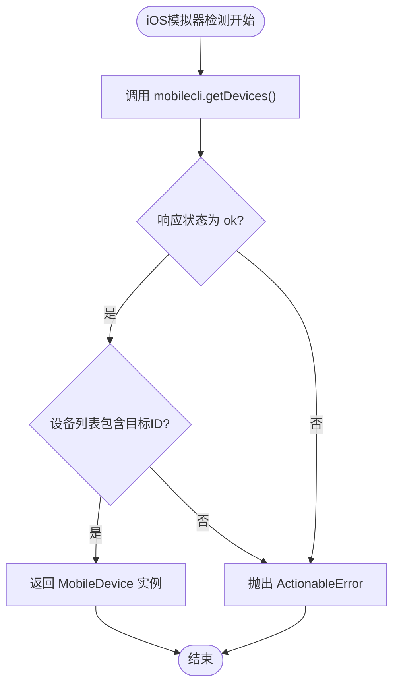

**图表来源**
- [server.ts:182-196](file://src/server.ts#L182-L196)

### 设备标识符获取方式

系统通过多种方式获取设备标识符：

#### HarmonyOS 设备标识符

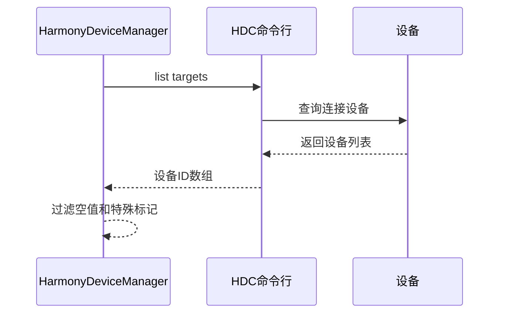

**图表来源**
- [harmony.ts:420-433](file://src/harmony.ts#L420-L433)

#### Android 设备标识符

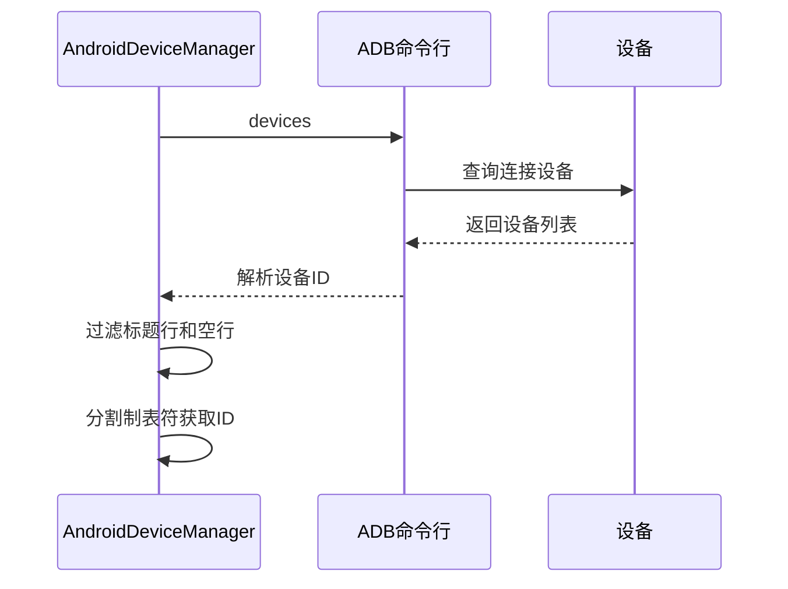

**图表来源**
- [android.ts:551-569](file://src/android.ts#L551-L569)

#### iOS 设备标识符

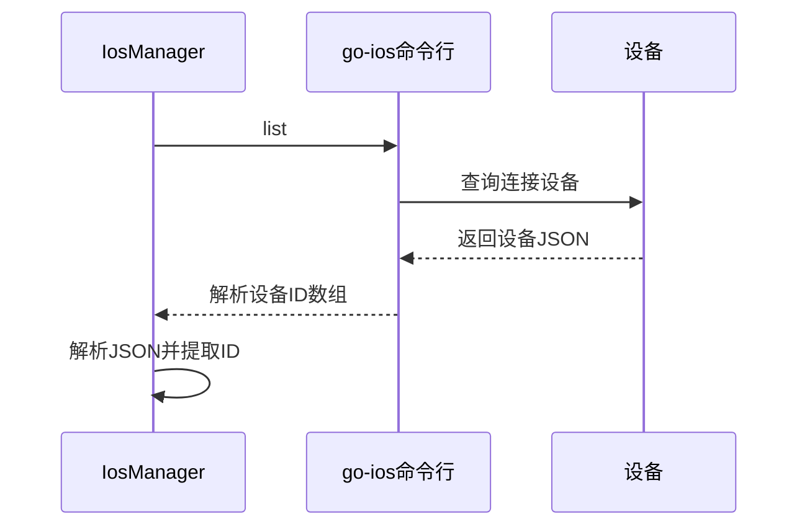

**图表来源**
- [ios.ts:258-272](file://src/ios.ts#L258-L272)

### 设备类型判断机制

系统通过不同的策略判断设备类型：

#### Android 设备类型判断

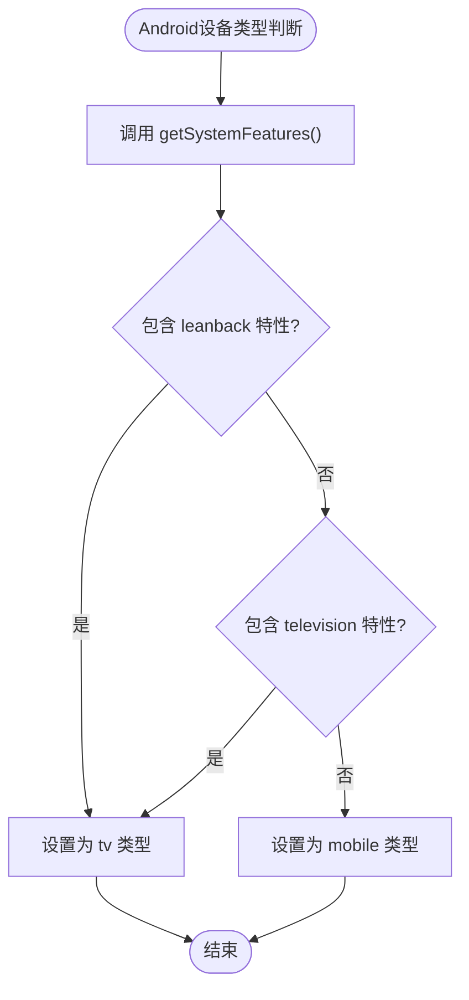

**图表来源**
- [android.ts:508-516](file://src/android.ts#L508-L516)

#### 设备详细信息获取

系统还提供了详细的设备信息获取功能：

| 设备类型 | 名称获取 | 版本获取 | 设备类型 |
|---------|---------|---------|---------|
| HarmonyOS | `hdc shell param get const.product.name` | `hdc shell param get const.product.software.version` | 固定为 "real" |
| Android | `getprop ro.boot.qemu.avd_name` 或 `getprop ro.product.model` | `getprop ro.build.version.release` | "emulator" 或 "real" |
| iOS | `ios info` 命令 | `ios info` 命令 | "real" 或通过 mobilecli 获取 |

**章节来源**
- [harmony.ts:435-460](file://src/harmony.ts#L435-L460)
- [android.ts:518-549](file://src/android.ts#L518-L549)
- [ios.ts:246-256](file://src/ios.ts#L246-L256)

### mobile_list_available_devices 工具实现

该工具负责整合所有平台的设备信息，提供统一的设备列表：

#### HarmonyOS 设备整合

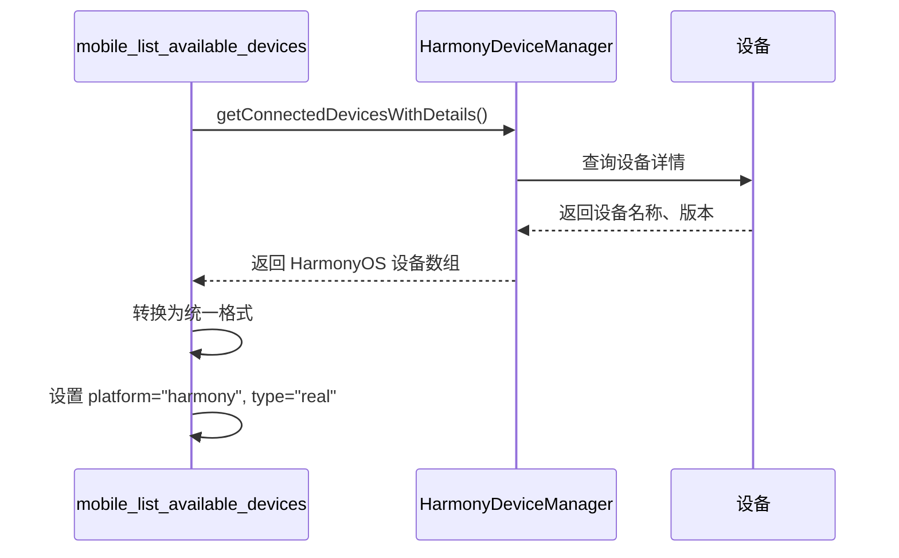

**图表来源**
- [server.ts:212-227](file://src/server.ts#L212-L227)

#### Android 和 iOS 设备整合

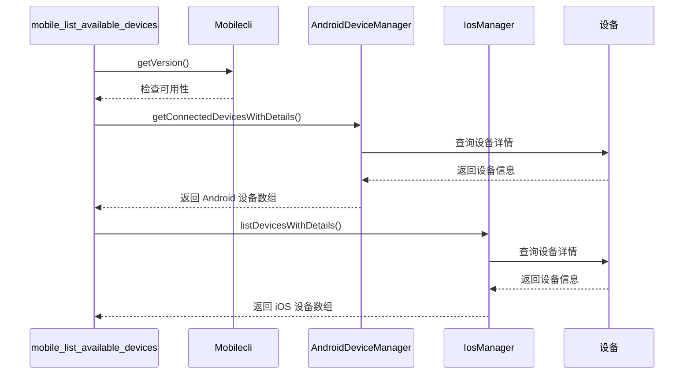

**图表来源**
- [server.ts:238-270](file://src/server.ts#L238-L270)

#### iOS 模拟器整合

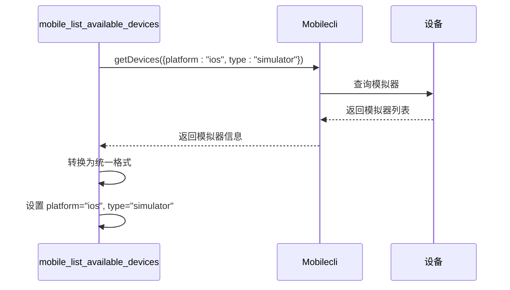

**图表来源**
- [server.ts:272-290](file://src/server.ts#L272-L290)

**章节来源**
- [server.ts:207-294](file://src/server.ts#L207-L294)

## 依赖关系分析

### 外部依赖

系统依赖以下外部工具：

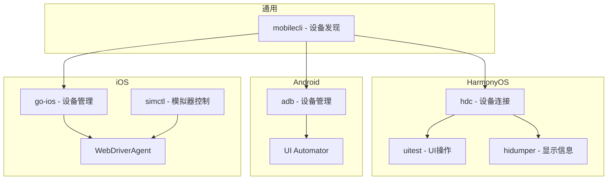

**图表来源**
- [README.md:90-99](file://README.md#L90-L99)

### 内部依赖关系

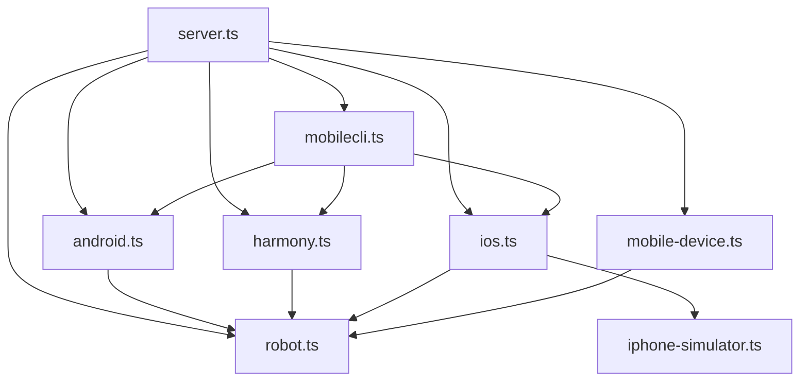

**图表来源**
- [server.ts:8-15](file://src/server.ts#L8-L15)

**章节来源**
- [server.ts:8-15](file://src/server.ts#L8-L15)
- [README.md:90-99](file://README.md#L90-L99)

## 性能考虑

### 设备发现性能优化

系统在设备发现过程中采用了多项性能优化策略：

1. **并行检测**：HarmonyOS 设备检测与其他平台检测可以并行进行
2. **缓存机制**：设备信息在一定时间内缓存，避免重复查询
3. **超时控制**：所有外部命令调用都有合理的超时时间
4. **资源清理**：临时文件和进程在使用后及时清理

### 内存管理

- 所有设备信息都以轻量级对象形式存储
- 大文件操作（如截图）使用流式处理
- 异常情况下确保资源正确释放

## 故障排除指南

### 常见错误类型

系统定义了专门的错误类型来处理不同场景：

#### ActionableError

用于可修复的错误，包含用户友好的错误消息：

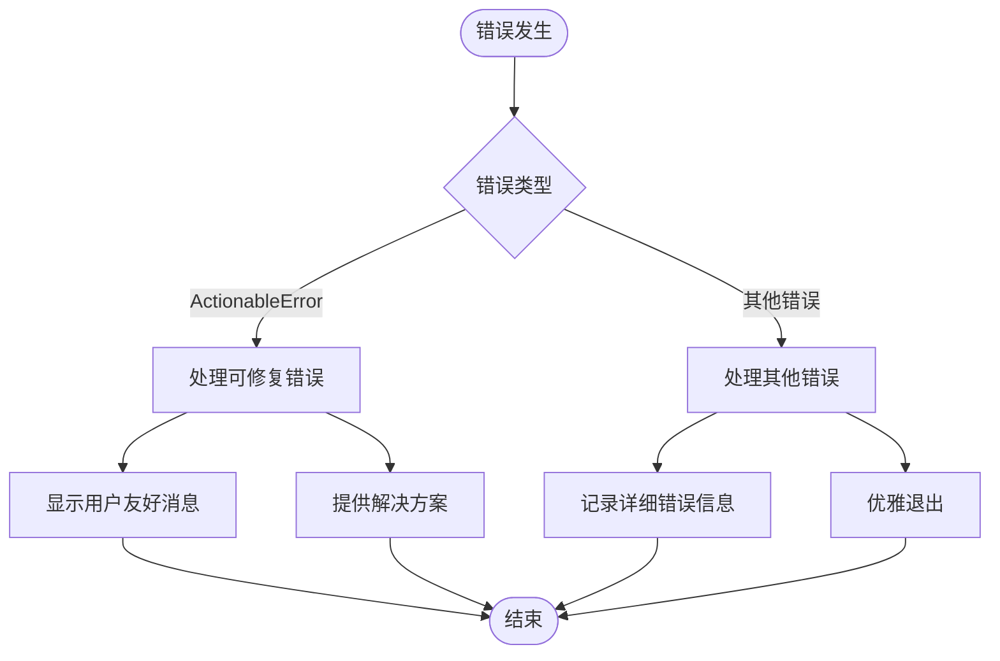

**图表来源**
- [robot.ts:40-44](file://src/robot.ts#L40-L44)

#### 设备发现错误处理

| 错误场景 | 处理方式 | 用户提示 |
|---------|---------|---------|
| mobilecli 不可用 | 忽略 Android/iOS 检测 | 跳过相关设备 |
| hdc 不可用 | 忽略 HarmonyOS 检测 | 跳过 HarmonyOS 设备 |
| go-ios 不可用 | 忽略 iOS 物理设备检测 | 跳过 iOS 物理设备 |
| 设备未找到 | 抛出 ActionableError | 提示使用设备列表工具 |

### 调试建议

1. **检查环境变量**：
   - `MOBILECLI_PATH` - mobilecli 可执行文件路径
   - `ANDROID_HOME` - Android SDK 路径
   - `HDC_SDK_PATH` - HarmonyOS SDK 路径
   - `GO_IOS_PATH` - go-ios 可执行文件路径

2. **验证工具可用性**：
   ```bash
   # 检查 mobilecli
   npx @mobilenext/mobilecli --version
   
   # 检查 ADB
   adb version
   
   # 检查 HDC
   hdc version
   
   # 检查 go-ios
   ios version
   ```

3. **查看详细日志**：
   - 启用调试模式查看详细的设备发现过程
   - 检查每个平台的检测结果

**章节来源**
- [server.ts:138-147](file://src/server.ts#L138-L147)
- [server.ts:79-94](file://src/server.ts#L79-L94)

## 结论

该设备发现机制通过精心设计的分层架构和容错处理，成功实现了对 iOS、Android 和 HarmonyOS 三大平台设备的统一管理和路由。其核心优势包括：

1. **统一的设备发现接口**：通过 `getRobotFromDevice` 函数实现设备路由
2. **多平台支持**：支持真机、模拟器和仿真器的检测
3. **容错处理**：各平台检测失败不会影响其他平台的正常工作
4. **性能优化**：合理的超时控制和资源管理
5. **用户友好**：清晰的错误提示和解决方案

该系统为 AI Agent 提供了稳定可靠的移动设备自动化基础，支持复杂的跨平台测试场景。