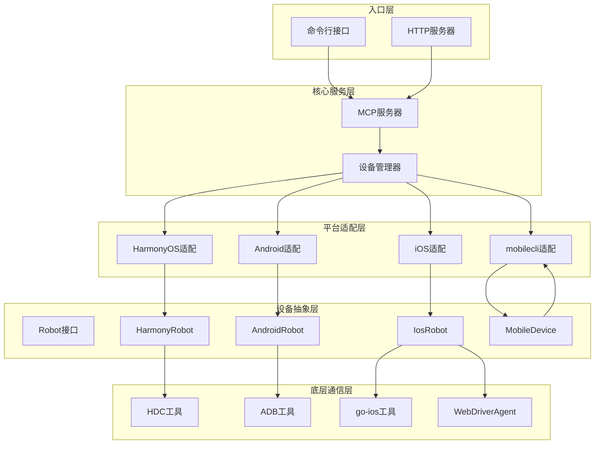
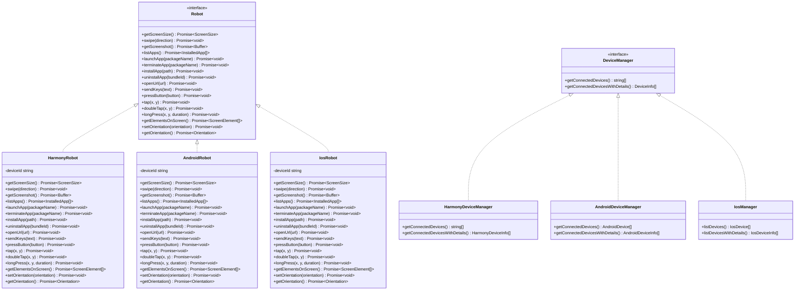
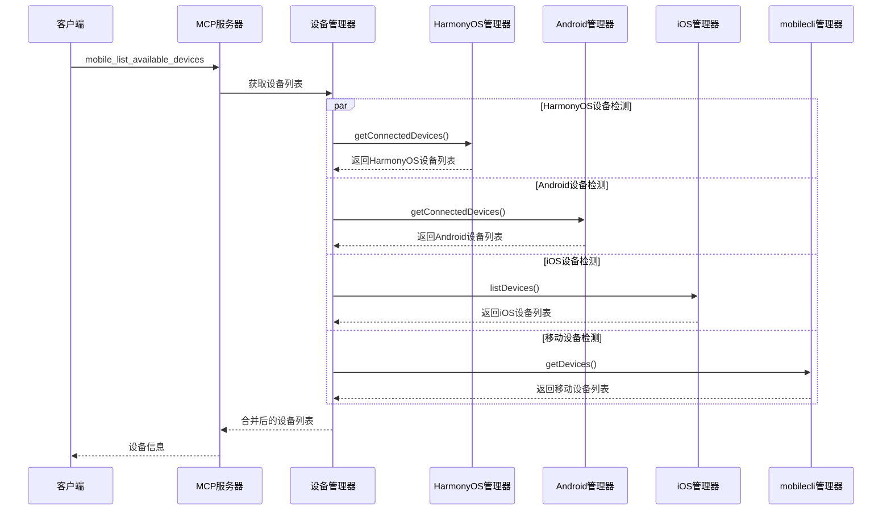
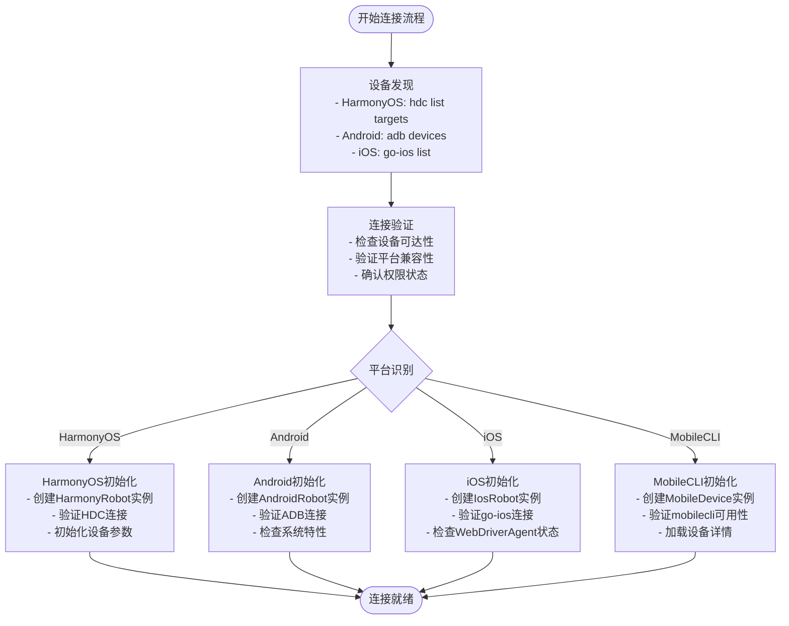
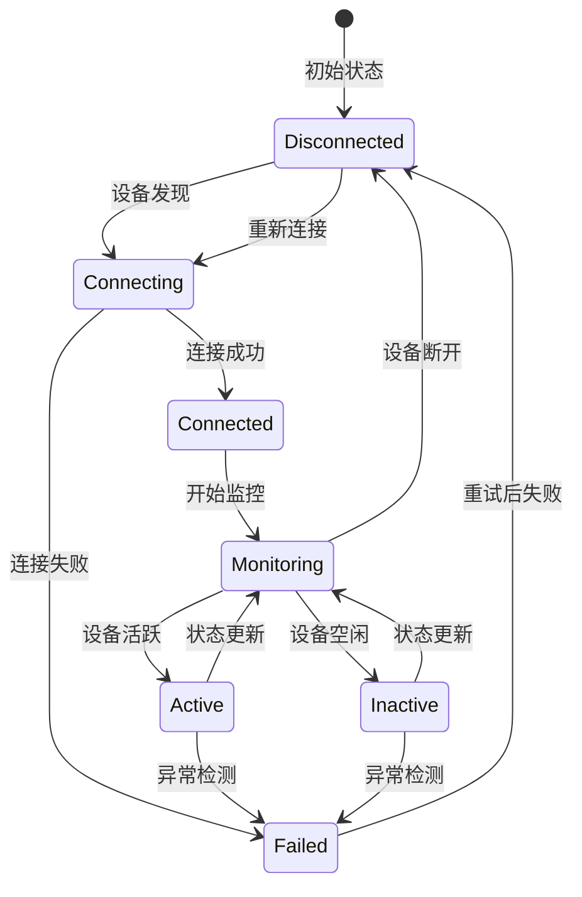
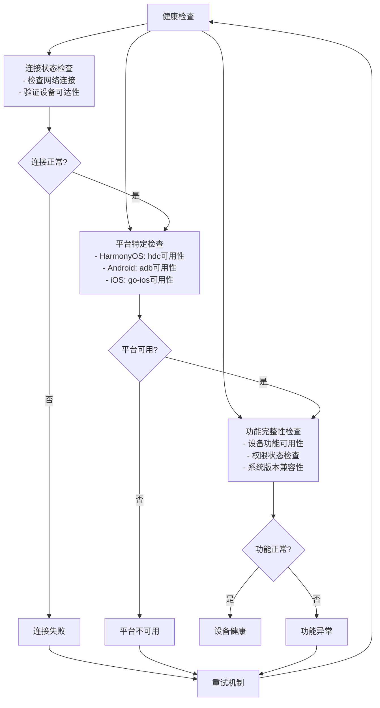
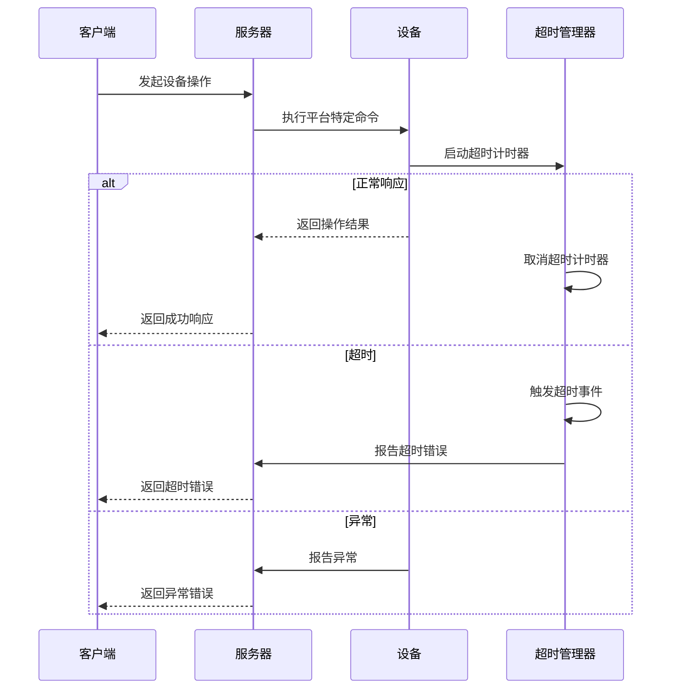
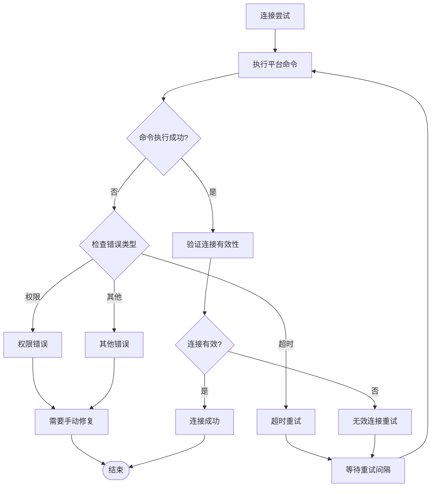
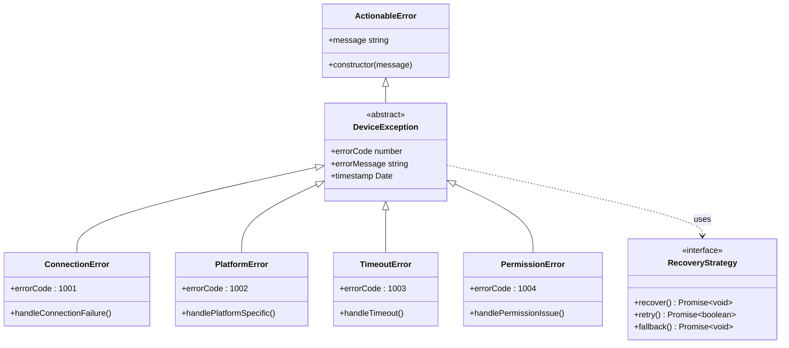
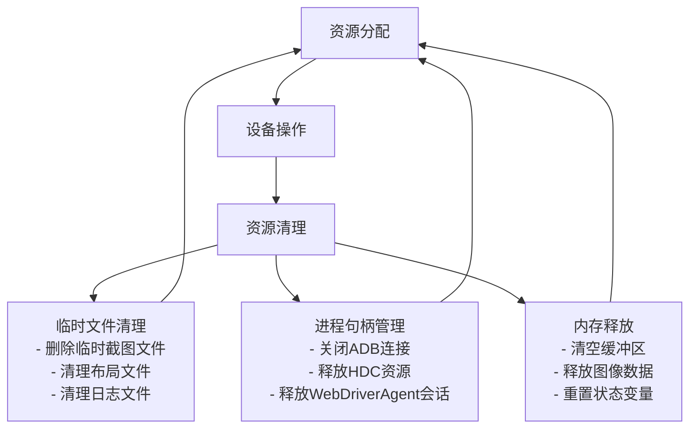

# 设备生命周期管理

<cite>
**本文档引用的文件**
- [src/index.ts](file://src/index.ts)
- [src/server.ts](file://src/server.ts)
- [src/mobile-device.ts](file://src/mobile-device.ts)
- [src/mobilecli.ts](file://src/mobilecli.ts)
- [src/robot.ts](file://src/robot.ts)
- [src/android.ts](file://src/android.ts)
- [src/ios.ts](file://src/ios.ts)
- [src/harmony.ts](file://src/harmony.ts)
- [src/webdriver-agent.ts](file://src/webdriver-agent.ts)
- [src/logger.ts](file://src/logger.ts)
- [package.json](file://package.json)
- [README.md](file://README.md)
</cite>

## 目录
1. [简介](#简介)
2. [项目架构概览](#项目架构概览)
3. [核心组件分析](#核心组件分析)
4. [设备生命周期管理流程](#设备生命周期管理流程)
5. [平台差异化实现](#平台差异化实现)
6. [状态监控与健康检查](#状态监控与健康检查)
7. [连接超时与重连机制](#连接超时与重连机制)
8. [异常处理与故障恢复](#异常处理与故障恢复)
9. [资源清理与内存管理](#资源清理与内存管理)
10. [最佳实践建议](#最佳实践建议)
11. [总结](#总结)

## 简介

设备生命周期管理是移动自动化系统的核心组成部分，负责设备的发现、连接、状态监控、断开处理和故障恢复。本项目实现了跨平台的设备生命周期管理，支持iOS、Android和HarmonyOS三大主流移动操作系统。

该系统通过统一的MCP（Model Context Protocol）接口提供设备管理能力，包括设备发现、应用管理、屏幕交互等功能。每个平台都有其独特的连接特点和管理差异，需要采用相应的生命周期管理策略。

## 项目架构概览

**图表来源**
- [src/index.ts:1-67](file://src/index.ts#L1-L67)
- [src/server.ts:35-707](file://src/server.ts#L35-L707)

**章节来源**
- [src/index.ts:1-67](file://src/index.ts#L1-L67)
- [src/server.ts:35-707](file://src/server.ts#L35-L707)

## 核心组件分析

### 设备管理器架构

系统采用工厂模式和策略模式相结合的设计，通过`getRobotFromDevice`方法根据设备ID动态选择合适的设备管理器：

**图表来源**
- [src/robot.ts:48-147](file://src/robot.ts#L48-L147)
- [src/harmony.ts:43-416](file://src/harmony.ts#L43-L416)
- [src/android.ts:74-504](file://src/android.ts#L74-L504)
- [src/ios.ts:42-232](file://src/ios.ts#L42-L232)

### 设备发现与连接流程

**图表来源**
- [src/server.ts:199-295](file://src/server.ts#L199-L295)
- [src/harmony.ts:418-461](file://src/harmony.ts#L418-L461)
- [src/android.ts:506-592](file://src/android.ts#L506-L592)
- [src/ios.ts:234-293](file://src/ios.ts#L234-L293)

**章节来源**
- [src/server.ts:149-197](file://src/server.ts#L149-L197)
- [src/harmony.ts:418-461](file://src/harmony.ts#L418-L461)
- [src/android.ts:506-592](file://src/android.ts#L506-L592)
- [src/ios.ts:234-293](file://src/ios.ts#L234-L293)

## 设备生命周期管理流程

### 设备连接建立流程

设备连接建立是生命周期管理的第一步，涉及设备发现、连接验证和初始化：

**图表来源**
- [src/server.ts:149-197](file://src/server.ts#L149-L197)
- [src/harmony.ts:418-461](file://src/harmony.ts#L418-L461)
- [src/android.ts:506-592](file://src/android.ts#L506-L592)
- [src/ios.ts:234-293](file://src/ios.ts#L234-L293)

### 设备状态监控机制

系统实现了多层级的状态监控机制，确保设备状态的实时性和准确性：

**图表来源**
- [src/server.ts:135-147](file://src/server.ts#L135-L147)
- [src/ios.ts:47-92](file://src/ios.ts#L47-L92)

**章节来源**
- [src/server.ts:135-147](file://src/server.ts#L135-L147)
- [src/ios.ts:47-92](file://src/ios.ts#L47-L92)

## 平台差异化实现

### HarmonyOS设备管理

HarmonyOS作为新平台，具有独特的连接特点和管理方式：

| 特性 | 实现方式 | 连接特点 |
|------|----------|----------|
| 设备发现 | `hdc list targets` | 直接通过HDC工具发现，无需mobilecli依赖 |
| 屏幕尺寸获取 | `hidumper DisplayManagerService` | 通过系统服务获取显示信息 |
| UI元素检测 | `uitest dumpLayout` | 使用uitest工具获取布局树 |
| 应用管理 | `bm` 和 `aa` 工具 | 通过包管理和Ability启动控制应用 |
| 屏幕截图 | `snapshot_display` | 直接截取显示内容 |

### Android设备管理

Android平台提供了最完善的自动化支持：

| 特性 | 实现方式 | 连接特点 |
|------|----------|----------|
| 设备发现 | `adb devices` | 通过ADB工具发现设备 |
| 屏幕尺寸获取 | `wm size` | 通过窗口管理器获取屏幕信息 |
| UI元素检测 | `uiautomator dump` | 使用UI Automator框架 |
| 应用管理 | `pm` 和 `am` 工具 | 通过包管理和Activity管理器 |
| 屏幕截图 | `screencap` | 使用系统截图工具 |

### iOS设备管理

iOS平台由于系统限制，需要特殊的连接配置：

| 特性 | 实现方式 | 连接特点 |
|------|----------|----------|
| 设备发现 | `go-ios list` | 通过go-ios工具发现设备 |
| 屏幕尺寸获取 | WebDriverAgent | 通过WebDriverAgent获取 |
| UI元素检测 | WebDriverAgent源树 | 使用WebDriverAgent源树 |
| 应用管理 | `go-ios install/launch` | 通过go-ios工具管理应用 |
| 屏幕截图 | WebDriverAgent | 通过WebDriverAgent获取 |

**章节来源**
- [src/harmony.ts:12-18](file://src/harmony.ts#L12-L18)
- [src/android.ts:32-54](file://src/android.ts#L32-L54)
- [src/ios.ts:33-40](file://src/ios.ts#L33-L40)

## 状态监控与健康检查

### 健康检查机制

系统实现了多层次的健康检查机制，确保设备状态的准确监控：

**图表来源**
- [src/server.ts:135-147](file://src/server.ts#L135-L147)
- [src/ios.ts:69-92](file://src/ios.ts#L69-L92)

### 设备状态检测

系统提供了多种设备状态检测方法：

1. **连接状态检测**：通过平台特定的工具检查设备连接状态
2. **功能可用性检测**：验证设备各项功能是否正常工作
3. **权限状态检测**：检查应用所需的权限是否已授予
4. **系统版本兼容性检测**：确认设备系统版本满足要求

**章节来源**
- [src/server.ts:135-147](file://src/server.ts#L135-L147)
- [src/ios.ts:69-92](file://src/ios.ts#L69-L92)

## 连接超时与重连机制

### 超时处理策略

系统为所有平台设置了合理的超时时间，避免长时间阻塞：

**图表来源**
- [src/android.ts:69](file://src/android.ts#L69)
- [src/ios.ts:7-8](file://src/ios.ts#L7-L8)
- [src/harmony.ts:9](file://src/harmony.ts#L9)

### 重连机制实现

系统实现了智能的重连机制，能够自动处理临时连接问题：

**图表来源**
- [src/mobilecli.ts:24](file://src/mobilecli.ts#L24)
- [src/android.ts:69](file://src/android.ts#L69)
- [src/ios.ts:7-8](file://src/ios.ts#L7-L8)

**章节来源**
- [src/mobilecli.ts:24-51](file://src/mobilecli.ts#L24-L51)
- [src/android.ts:69](file://src/android.ts#L69)
- [src/ios.ts:7-8](file://src/ios.ts#L7-L8)

## 异常处理与故障恢复

### 异常分类与处理

系统对不同类型的异常进行了分类处理：

**图表来源**
- [src/robot.ts:40-44](file://src/robot.ts#L40-L44)
- [src/android.ts:142-148](file://src/android.ts#L142-L148)
- [src/ios.ts:150-172](file://src/ios.ts#L150-L172)

### 故障恢复策略

系统实现了多层次的故障恢复策略：

1. **自动重试**：对于临时性错误，系统会自动重试操作
2. **降级处理**：当高级功能不可用时，系统会使用降级方案
3. **手动干预**：对于需要用户干预的问题，系统会提供明确的指导
4. **状态回滚**：在操作失败时，系统会尝试回滚到之前的状态

**章节来源**
- [src/robot.ts:40-44](file://src/robot.ts#L40-L44)
- [src/android.ts:142-148](file://src/android.ts#L142-L148)
- [src/ios.ts:150-172](file://src/ios.ts#L150-L172)

## 资源清理与内存管理

### 内存管理策略

系统采用了严格的内存管理策略，确保资源的有效利用：

**图表来源**
- [src/harmony.ts:160-182](file://src/harmony.ts#L160-L182)
- [src/harmony.ts:294-332](file://src/harmony.ts#L294-L332)

### 资源清理最佳实践

1. **及时清理临时文件**：所有通过HDC传输的临时文件都必须在使用后清理
2. **正确关闭连接**：确保所有平台特定的连接都被正确关闭
3. **内存泄漏防护**：使用弱引用和及时释放大对象
4. **资源池管理**：对于频繁使用的资源，考虑使用连接池

**章节来源**
- [src/harmony.ts:160-182](file://src/harmony.ts#L160-L182)
- [src/harmony.ts:294-332](file://src/harmony.ts#L294-L332)

## 最佳实践建议

### 设备连接最佳实践

1. **连接前检查**：在建立连接前，先检查平台工具是否可用
2. **超时设置**：为所有连接操作设置合理的超时时间
3. **重试策略**：实现指数退避的重试机制
4. **状态监控**：持续监控设备状态变化

### 错误处理最佳实践

1. **明确的错误分类**：区分可恢复错误和不可恢复错误
2. **详细的错误信息**：提供具体的错误原因和解决方案
3. **优雅降级**：在功能受限时提供替代方案
4. **用户友好提示**：向用户提供清晰的操作指导

### 性能优化建议

1. **连接复用**：尽量复用现有的设备连接
2. **批量操作**：将多个相关操作合并执行
3. **异步处理**：使用异步操作避免阻塞
4. **缓存策略**：合理使用缓存减少重复操作

## 总结

设备生命周期管理是移动自动化系统的核心，需要综合考虑不同平台的特点和限制。本项目通过统一的接口设计和分层架构，实现了跨平台的设备管理能力。

关键成功因素包括：

1. **平台适配性**：针对HarmonyOS、Android、iOS的不同特点实现专门的适配层
2. **健壮的错误处理**：实现多层次的异常处理和故障恢复机制
3. **资源管理**：严格的资源清理和内存管理策略
4. **监控机制**：实时的状态监控和健康检查
5. **性能优化**：高效的连接管理和操作优化

通过遵循这些最佳实践，可以确保设备生命周期管理的稳定性和可靠性，为上层应用提供高质量的设备管理服务。