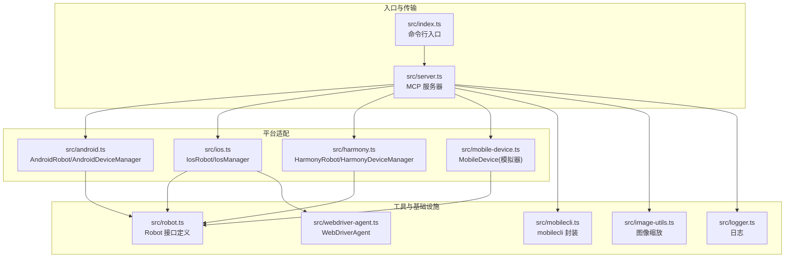
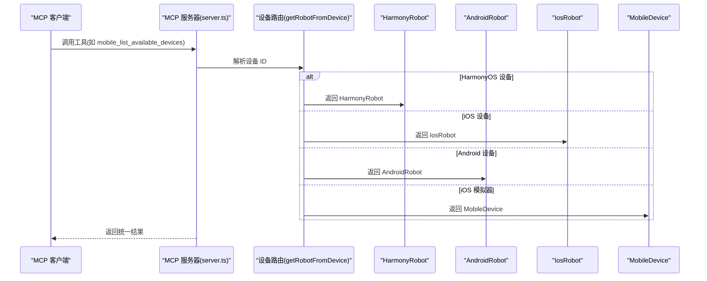
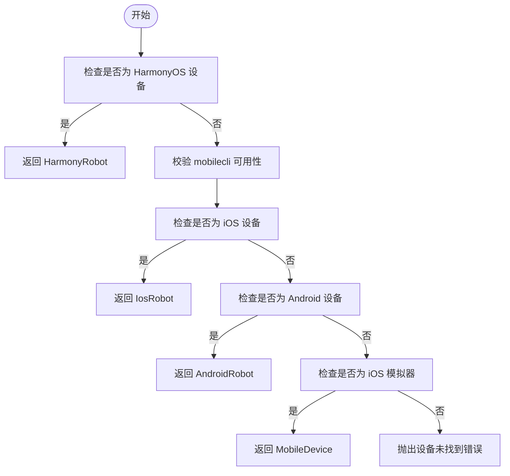
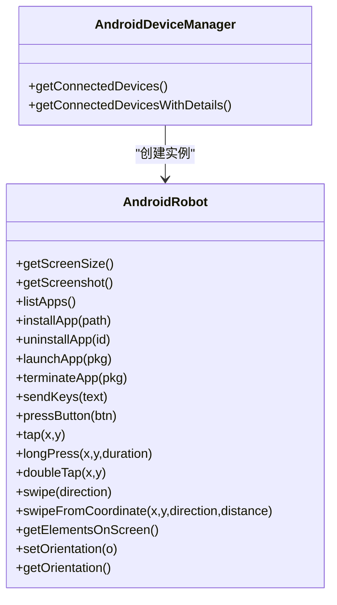
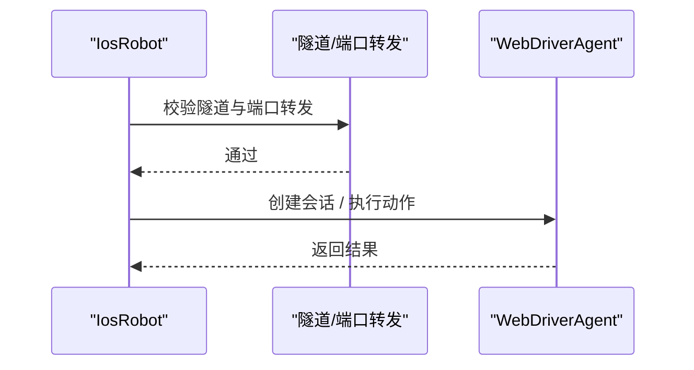
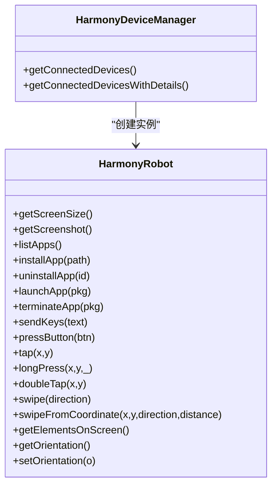
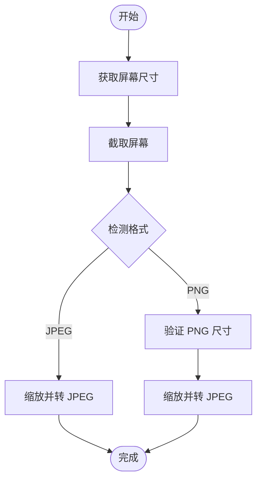
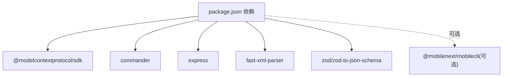

# 设备管理器扩展

<cite>
**本文档引用的文件**
- [src/index.ts](file://src/index.ts)
- [src/server.ts](file://src/server.ts)
- [src/robot.ts](file://src/robot.ts)
- [src/mobile-device.ts](file://src/mobile-device.ts)
- [src/android.ts](file://src/android.ts)
- [src/harmony.ts](file://src/harmony.ts)
- [src/ios.ts](file://src/ios.ts)
- [src/mobilecli.ts](file://src/mobilecli.ts)
- [src/webdriver-agent.ts](file://src/webdriver-agent.ts)
- [src/logger.ts](file://src/logger.ts)
- [src/image-utils.ts](file://src/image-utils.ts)
- [src/png.ts](file://src/png.ts)
- [package.json](file://package.json)
- [README.md](file://README.md)
- [test/mobilecli.test.ts](file://test/mobilecli.test.ts)
</cite>

## 目录
1. [简介](#简介)
2. [项目结构](#项目结构)
3. [核心组件](#核心组件)
4. [架构总览](#架构总览)
5. [详细组件分析](#详细组件分析)
6. [依赖关系分析](#依赖关系分析)
7. [性能考虑](#性能考虑)
8. [故障排查指南](#故障排查指南)
9. [结论](#结论)
10. [附录](#附录)

## 简介
本文件面向需要在 MCP 生态中扩展设备管理能力的开发者，系统性阐述设备管理器扩展的实现方法，覆盖设备发现、连接建立、状态监控、设备路由与标识符管理、多设备并发处理、生命周期管理以及与 Robot 实现的集成模式，并提供配置选项与性能优化策略。

## 项目结构
该仓库采用按平台分层的模块化组织方式：
- 入口与传输层：命令行入口与 MCP 传输（STDIO/SSE）
- 服务层：MCP 服务器注册工具与设备路由逻辑
- 平台适配层：Android、iOS、HarmonyOS 的具体实现
- 工具与基础设施：日志、图像处理、移动 CLI 封装等

**图表来源**
- [src/index.ts:1-67](file://src/index.ts#L1-L67)
- [src/server.ts:35-707](file://src/server.ts#L35-L707)
- [src/android.ts:74-593](file://src/android.ts#L74-L593)
- [src/ios.ts:42-294](file://src/ios.ts#L42-L294)
- [src/harmony.ts:43-462](file://src/harmony.ts#L43-L462)
- [src/mobile-device.ts:62-217](file://src/mobile-device.ts#L62-L217)
- [src/robot.ts:48-148](file://src/robot.ts#L48-L148)
- [src/mobilecli.ts:27-136](file://src/mobilecli.ts#L27-L136)
- [src/webdriver-agent.ts:25-455](file://src/webdriver-agent.ts#L25-L455)
- [src/image-utils.ts:9-165](file://src/image-utils.ts#L9-L165)
- [src/logger.ts:1-22](file://src/logger.ts#L1-L22)

**章节来源**
- [src/index.ts:1-67](file://src/index.ts#L1-L67)
- [src/server.ts:35-707](file://src/server.ts#L35-L707)
- [README.md:1-198](file://README.md#L1-L198)

## 核心组件
- 设备路由与发现：根据设备 ID 选择对应平台的 Robot 实现，优先检测 HarmonyOS，再检测 iOS，再检测 Android，最后回退到 mobilecli 的 iOS 模拟器。
- Robot 接口：统一的设备操作抽象，涵盖屏幕尺寸、截图、应用管理、输入、手势、元素识别、方向控制等。
- 平台实现：
  - Android：ADB + UIAutomator
  - iOS：WebDriverAgent + 原生通道
  - HarmonyOS：HDC + uitest + hidumper
  - 模拟器回退：MobileDevice（基于 mobilecli）
- 图像处理：截图尺寸自适应与格式转换，支持 macOS 的 sips 或 ImageMagick。
- 日志与可观测性：统一日志输出与工具调用耗时上报。

**章节来源**
- [src/server.ts:149-197](file://src/server.ts#L149-L197)
- [src/robot.ts:48-148](file://src/robot.ts#L48-L148)
- [src/android.ts:74-504](file://src/android.ts#L74-L504)
- [src/ios.ts:42-232](file://src/ios.ts#L42-L232)
- [src/harmony.ts:43-416](file://src/harmony.ts#L43-L416)
- [src/mobile-device.ts:62-217](file://src/mobile-device.ts#L62-L217)
- [src/image-utils.ts:9-165](file://src/image-utils.ts#L9-L165)
- [src/logger.ts:15-21](file://src/logger.ts#L15-L21)

## 架构总览
MCP 服务器通过工具注册暴露统一的设备操作接口，客户端通过设备 ID 路由到具体平台实现。设备发现工具聚合 HarmonyOS、Android/iOS 物理设备与 mobilecli 的 iOS 模拟器，形成统一设备视图。

**图表来源**
- [src/server.ts:149-197](file://src/server.ts#L149-L197)
- [src/harmony.ts:43-416](file://src/harmony.ts#L43-L416)
- [src/android.ts:74-504](file://src/android.ts#L74-L504)
- [src/ios.ts:42-232](file://src/ios.ts#L42-L232)
- [src/mobile-device.ts:62-217](file://src/mobile-device.ts#L62-L217)

## 详细组件分析

### 设备发现与路由机制
- 设备发现工具聚合多源设备：
  - HarmonyOS：直接通过 hdc 探测目标设备
  - Android/iOS 物理设备：借助各自管理器与 mobilecli
  - iOS 模拟器：通过 mobilecli devices 查询
- 设备路由规则：
  - 优先匹配 HarmonyOS 设备
  - 再检测 iOS 物理设备
  - 再检测 Android 设备
  - 最后匹配 iOS 模拟器
- 设备标识符管理：
  - 使用统一的设备 ID 字段，平台间保持一致
  - 对于 Android/iOS 物理设备，通过管理器查询名称与版本
  - 对于 HarmonyOS，通过设备参数查询名称与版本
  - 对于 iOS 模拟器，通过 mobilecli 查询名称与版本

**图表来源**
- [src/server.ts:149-197](file://src/server.ts#L149-L197)
- [src/server.ts:207-294](file://src/server.ts#L207-L294)

**章节来源**
- [src/server.ts:149-197](file://src/server.ts#L149-L197)
- [src/server.ts:207-294](file://src/server.ts#L207-L294)

### Android 设备管理
- 设备发现：通过 adb devices 列表，进一步探测设备类型与版本、名称
- 设备操作：
  - 屏幕尺寸：wm size
  - 截图：screencap 或多显示器场景下的指定 display
  - 应用管理：adb install/uninstall/force-stop
  - 输入与手势：input text/keyevent/tap/swipe
  - UI 元素：uiautomator dump + XML 解析
  - 方向：settings + content insert
- 错误处理：对非 ASCII 文本提供设备侧剪贴板方案或报错提示

**图表来源**
- [src/android.ts:74-504](file://src/android.ts#L74-L504)
- [src/android.ts:506-593](file://src/android.ts#L506-L593)

**章节来源**
- [src/android.ts:74-504](file://src/android.ts#L74-L504)
- [src/android.ts:506-593](file://src/android.ts#L506-L593)

### iOS 设备管理
- 设备发现：通过 go-ios list/info 获取物理设备列表与详情
- 设备操作：
  - 通过 WebDriverAgent 提供的 REST API 执行动作
  - 支持会话创建/销毁、按键、点击、长按、双击、滑动、截图、元素树、方向等
- 网络隧道与端口转发：对 iOS 17+ 需要本地隧道与端口转发，否则抛出可定位的错误

**图表来源**
- [src/ios.ts:42-232](file://src/ios.ts#L42-L232)
- [src/webdriver-agent.ts:25-455](file://src/webdriver-agent.ts#L25-L455)

**章节来源**
- [src/ios.ts:42-232](file://src/ios.ts#L42-L232)
- [src/webdriver-agent.ts:25-455](file://src/webdriver-agent.ts#L25-L455)

### HarmonyOS 设备管理
- 设备发现：hdc list targets
- 设备操作：
  - 屏幕尺寸：hidumper DisplayManagerService
  - 截图：snapshot_display + file recv
  - 应用管理：bm、aa
  - 输入与手势：uitest uiInput
  - 元素树：uitest dumpLayout
  - 方向：hidumper 显示信息解析
- 不依赖 mobilecli，开箱即用

**图表来源**
- [src/harmony.ts:43-416](file://src/harmony.ts#L43-L416)
- [src/harmony.ts:418-462](file://src/harmony.ts#L418-L462)

**章节来源**
- [src/harmony.ts:43-416](file://src/harmony.ts#L43-L416)
- [src/harmony.ts:418-462](file://src/harmony.ts#L418-L462)

### 模拟器回退路径（MobileDevice）
- 通过 mobilecli 的命令封装，兼容 iOS 模拟器的设备操作
- 作为 iOS 物理设备不可用时的回退方案

**章节来源**
- [src/mobile-device.ts:62-217](file://src/mobile-device.ts#L62-L217)
- [src/mobilecli.ts:27-136](file://src/mobilecli.ts#L27-L136)

### 截图与图像处理
- 截图尺寸自适应：根据屏幕 scale 缩放，避免超大图片
- 格式转换：PNG 验证与 JPEG 转换，结合 ImageMagick 或 macOS sips
- 失败兜底：无效截图时抛出可定位错误

**图表来源**
- [src/server.ts:597-673](file://src/server.ts#L597-L673)
- [src/image-utils.ts:9-165](file://src/image-utils.ts#L9-L165)
- [src/png.ts:6-21](file://src/png.ts#L6-L21)

**章节来源**
- [src/server.ts:597-673](file://src/server.ts#L597-L673)
- [src/image-utils.ts:9-165](file://src/image-utils.ts#L9-L165)
- [src/png.ts:6-21](file://src/png.ts#L6-L21)

## 依赖关系分析
- 运行时依赖：@modelcontextprotocol/sdk、commander、express、fast-xml-parser、zod、zod-to-json-schema
- 可选依赖：@mobilenext/mobilecli（用于 Android/iOS 物理设备与 iOS 模拟器）
- 平台工具：
  - Android：adb（ANDROID_HOME 或 PATH）
  - iOS：go-ios、WebDriverAgent（端口转发）
  - HarmonyOS：hdc（HDC_SDK_PATH 或 PATH）

**图表来源**
- [package.json:29-39](file://package.json#L29-L39)

**章节来源**
- [package.json:29-39](file://package.json#L29-L39)
- [README.md:90-100](file://README.md#L90-L100)

## 性能考虑
- 截图优化
  - 根据屏幕 scale 缩放，降低传输与存储成本
  - 优先使用 JPEG，必要时保留 PNG 验证
- 并发与稳定性
  - 平台命令设置合理超时与缓冲区上限，避免阻塞
  - iOS 17+ 需要隧道与端口转发，提前校验以避免反复失败
- 可观测性
  - 工具调用耗时与事件上报，便于定位性能瓶颈
- 环境准备
  - Android：正确配置 ANDROID_HOME 或 PATH
  - HarmonyOS：正确配置 HDC_SDK_PATH 或确保 hdc 在 PATH
  - iOS：安装 go-ios，确保 WebDriverAgent 可用且端口转发正常

**章节来源**
- [src/server.ts:597-673](file://src/server.ts#L597-L673)
- [src/android.ts:69-71](file://src/android.ts#L69-L71)
- [src/ios.ts:69-92](file://src/ios.ts#L69-L92)
- [src/harmony.ts:9-18](file://src/harmony.ts#L9-L18)
- [src/logger.ts:15-21](file://src/logger.ts#L15-L21)

## 故障排查指南
- mobilecli 不可用
  - 现象：设备发现失败或工具调用报错
  - 处理：安装 @mobilenext/mobilecli 或设置 MOBILECLI_PATH；确认二进制存在
- Android 环境问题
  - 现象：adb devices 无法列出设备
  - 处理：设置 ANDROID_HOME 或确保 adb 在 PATH；检查权限与驱动
- iOS 隧道与端口转发
  - 现象：IosRobot 报错提示隧道或 WDA 未就绪
  - 处理：启动隧道与端口转发，确保 localhost:8100 可访问
- HarmonyOS 环境问题
  - 现象：hdc list targets 无输出
  - 处理：设置 HDC_SDK_PATH 或确保 hdc 在 PATH；检查设备连接状态
- 截图异常
  - 现象：截图为空或尺寸异常
  - 处理：确认设备屏幕状态与权限；启用图像缩放工具链（macOS sips 或 ImageMagick）

**章节来源**
- [src/server.ts:138-147](file://src/server.ts#L138-L147)
- [src/ios.ts:69-92](file://src/ios.ts#L69-L92)
- [src/harmony.ts:12-18](file://src/harmony.ts#L12-L18)
- [src/image-utils.ts:137-165](file://src/image-utils.ts#L137-L165)

## 结论
本扩展通过统一的 Robot 接口与设备路由机制，实现了对 iOS、Android、HarmonyOS 以及 iOS 模拟器的一致化自动化能力。借助平台特定的实现与可选的 mobilecli，系统在多平台、多设备形态下提供了稳定、可观测且可扩展的设备管理能力。建议在生产环境中完善环境校验、隧道与端口转发配置，并结合图像处理与日志上报持续优化性能与稳定性。

## 附录

### 设备生命周期管理（概念性说明）
- 连接建立：设备路由根据设备 ID 选择对应平台实现
- 状态监控：通过平台命令或服务状态查询（如 WebDriverAgent 状态、adb devices）
- 断开与清理：会话销毁、临时文件清理、端口释放
- 故障恢复：重试策略、降级路径（如 iOS 物理设备不可用时回退到模拟器）

[本节为概念性说明，不直接分析具体文件]

### 与 Robot 实现的集成模式
- 通过 getRobotFromDevice 动态选择实现
- 统一的工具签名与参数校验（Zod Schema）
- 可观测性与错误包装（ActionableError）

**章节来源**
- [src/server.ts:62-95](file://src/server.ts#L62-L95)
- [src/robot.ts:40-44](file://src/robot.ts#L40-L44)

### 配置选项与环境变量
- 启动模式
  - STDIO（默认）：适合大多数 MCP 客户端
  - SSE：通过 --port 指定端口
- 平台工具路径
  - ANDROID_HOME：Android SDK 路径
  - HDC_SDK_PATH：HarmonyOS SDK 路径
  - GO_IOS_PATH：go-ios 可执行文件路径
  - MOBILECLI_PATH：mobilecli 二进制路径
- 日志输出
  - LOG_FILE：写入文件的日志路径

**章节来源**
- [src/index.ts:50-67](file://src/index.ts#L50-L67)
- [src/android.ts:32-54](file://src/android.ts#L32-L54)
- [src/harmony.ts:12-18](file://src/harmony.ts#L12-L18)
- [src/ios.ts:33-40](file://src/ios.ts#L33-L40)
- [src/mobilecli.ts:53-92](file://src/mobilecli.ts#L53-L92)
- [src/logger.ts:3-13](file://src/logger.ts#L3-L13)