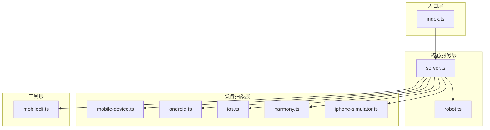
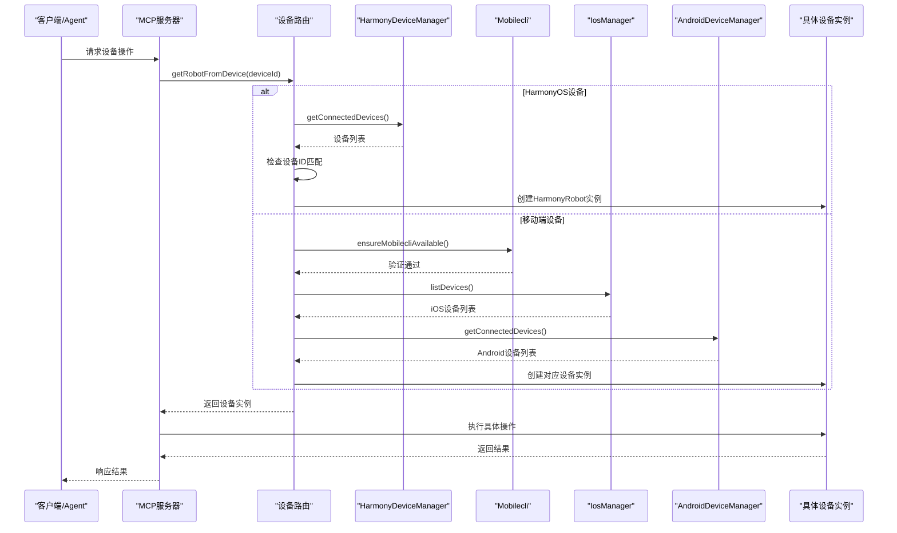
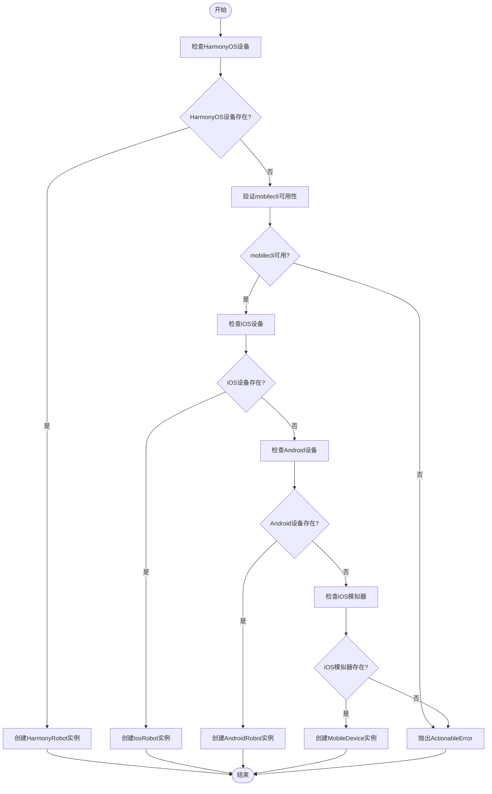
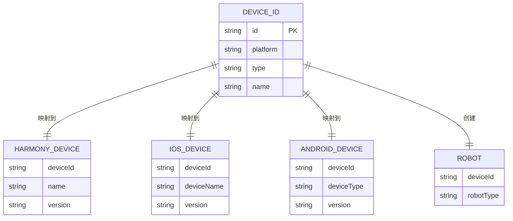
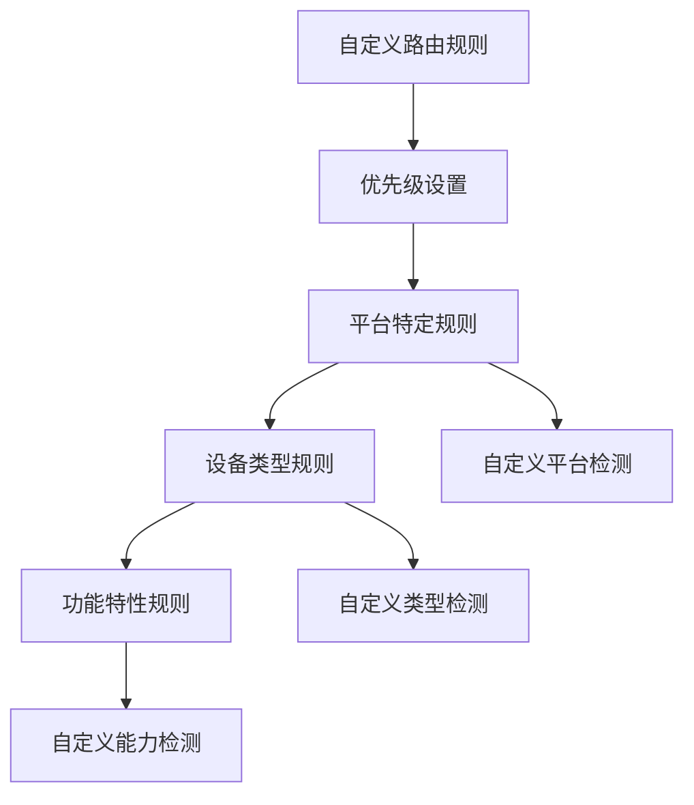

# 设备路由系统

<cite>
**本文档引用的文件**
- [index.ts](file://src/index.ts)
- [server.ts](file://src/server.ts)
- [robot.ts](file://src/robot.ts)
- [mobile-device.ts](file://src/mobile-device.ts)
- [mobilecli.ts](file://src/mobilecli.ts)
- [android.ts](file://src/android.ts)
- [ios.ts](file://src/ios.ts)
- [harmony.ts](file://src/harmony.ts)
- [iphone-simulator.ts](file://src/iphone-simulator.ts)
- [README.md](file://README.md)
- [DEEPWIKI.md](file://DEEPWIKI.md)
</cite>

## 目录
1. [简介](#简介)
2. [项目结构](#项目结构)
3. [核心组件](#核心组件)
4. [架构总览](#架构总览)
5. [详细组件分析](#详细组件分析)
6. [依赖关系分析](#依赖关系分析)
7. [性能考虑](#性能考虑)
8. [故障排除指南](#故障排除指南)
9. [结论](#结论)
10. [附录](#附录)

## 简介
本项目是一个基于 Model Context Protocol (MCP) 的跨平台移动设备自动化服务器，支持 iOS、Android 和 HarmonyOS（鸿蒙）设备的统一自动化控制。系统通过设备路由机制将设备标识符映射到具体的机器人实现，提供一致的 API 接口给 LLM/Agent 使用。

## 项目结构
项目采用模块化设计，主要包含以下核心模块：



**图表来源**
- [index.ts:1-67](file://src/index.ts#L1-L67)
- [server.ts:1-708](file://src/server.ts#L1-L708)

**章节来源**
- [index.ts:1-67](file://src/index.ts#L1-L67)
- [README.md:1-198](file://README.md#L1-L198)

## 核心组件
设备路由系统由以下核心组件构成：

### 设备接口定义
- **Robot 接口**：定义了所有设备的统一操作接口，包括屏幕尺寸获取、应用管理、屏幕交互、输入控制等
- **ScreenElement**：屏幕元素的数据结构，包含类型、文本、坐标等信息
- **Button**：设备按键枚举，支持 HOME、BACK、音量键等

### 设备实现类
- **AndroidRobot**：基于 ADB 和 UI Automator 的 Android 设备实现
- **IosRobot**：基于 WebDriverAgent 的 iOS 设备实现  
- **HarmonyRobot**：基于 HDC 的 HarmonyOS 设备实现
- **MobileDevice**：基于 mobilecli 的通用设备实现
- **Simctl**：基于 simctl 的 iOS 模拟器实现

### 设备管理器
- **AndroidDeviceManager**：Android 设备发现和管理
- **IosManager**：iOS 设备发现和管理
- **HarmonyDeviceManager**：HarmonyOS 设备发现和管理
- **Mobilecli**：设备发现和命令执行的通用工具

**章节来源**
- [robot.ts:1-148](file://src/robot.ts#L1-L148)
- [android.ts:1-593](file://src/android.ts#L1-L593)
- [ios.ts:1-294](file://src/ios.ts#L1-L294)
- [harmony.ts:1-462](file://src/harmony.ts#L1-L462)
- [mobile-device.ts:1-217](file://src/mobile-device.ts#L1-L217)
- [iphone-simulator.ts:1-273](file://src/iphone-simulator.ts#L1-L273)

## 架构总览
系统采用分层架构设计，通过设备路由机制实现设备类型识别和实例创建：



**图表来源**
- [server.ts:149-197](file://src/server.ts#L149-L197)

## 详细组件分析

### getRobotFromDevice 函数详解

#### 工作原理
`getRobotFromDevice` 是设备路由系统的核心函数，负责根据设备 ID 识别设备类型并创建相应的机器人实例：



**图表来源**
- [server.ts:149-197](file://src/server.ts#L149-L197)

#### 设备类型识别流程
1. **HarmonyOS 设备检测**：优先检查是否为 HarmonyOS 设备，无需 mobilecli 依赖
2. **mobilecli 可用性验证**：确保 mobilecli 正常工作
3. **iOS 设备检测**：通过 IosManager 检查物理 iOS 设备
4. **Android 设备检测**：通过 AndroidDeviceManager 检查 Android 设备
5. **iOS 模拟器检测**：通过 mobilecli 检查 iOS 模拟器
6. **错误处理**：如果所有检测都失败，抛出可操作的错误

#### 平台检测机制
- **HarmonyOS**：使用 `hdc list targets` 命令检测设备
- **iOS**：使用 `go-ios list` 命令检测物理设备
- **Android**：使用 `adb devices` 命令检测设备
- **iOS 模拟器**：通过 mobilecli 的设备发现功能检测

#### 机器人实例创建过程
每个设备类型都有对应的工厂方法：
- **HarmonyRobot**：直接基于设备 ID 创建实例
- **IosRobot**：基于设备 ID 创建 iOS 设备实例
- **AndroidRobot**：基于设备 ID 创建 Android 设备实例
- **MobileDevice**：基于设备 ID 创建通用设备实例

**章节来源**
- [server.ts:149-197](file://src/server.ts#L149-L197)

### 设备标识符与实现映射关系

#### 设备标识符格式
- **HarmonyOS**：设备 ID 通常为序列号或目标标识符
- **iOS**：UDID（唯一设备标识符）
- **Android**：设备序列号或模拟器名称
- **iOS 模拟器**：UUID 格式

#### 映射关系表


**图表来源**
- [server.ts:17-28](file://src/server.ts#L17-L28)
- [harmony.ts:418-461](file://src/harmony.ts#L418-L461)
- [ios.ts:28-31](file://src/ios.ts#L28-L31)
- [android.ts:9-12](file://src/android.ts#L9-L12)

### 多设备并发处理策略

#### 资源管理机制
1. **进程隔离**：每个设备操作都在独立的子进程中执行
2. **超时控制**：所有设备命令都有 30 秒超时限制
2. **缓冲区限制**：设备输出缓冲区最大 4MB
3. **错误隔离**：单个设备的错误不会影响其他设备

#### 并发控制
- **串行化操作**：同一设备的连续操作按顺序执行
- **并行设备操作**：不同设备的操作可以并行执行
- **资源竞争避免**：通过进程间通信避免资源竞争

#### 内存管理
- **临时文件清理**：自动清理截图和布局文件
- **连接池管理**：合理管理设备连接状态
- **内存泄漏防护**：及时释放大对象和缓冲区

**章节来源**
- [android.ts:69-71](file://src/android.ts#L69-L71)
- [ios.ts:7-8](file://src/ios.ts#L7-L8)
- [harmony.ts:9-11](file://src/harmony.ts#L9-L11)
- [mobilecli.ts:24-26](file://src/mobilecli.ts#L24-L26)

### 扩展方法和自定义路由规则

#### 扩展新设备类型
1. **实现 Robot 接口**：创建新的设备类实现 Robot 接口
2. **添加设备管理器**：实现设备发现和管理逻辑
3. **更新路由逻辑**：在 `getRobotFromDevice` 中添加新分支
4. **添加工具支持**：在 server.ts 中注册相关的 MCP 工具

#### 自定义路由规则


#### 路由扩展点
- **设备类型扩展**：支持新的移动操作系统
- **设备能力扩展**：支持新的设备功能
- **路由策略扩展**：支持复杂的路由算法

**章节来源**
- [DEEPWIKI.md:564-602](file://DEEPWIKI.md#L564-L602)
- [server.ts:149-197](file://src/server.ts#L149-L197)

## 依赖关系分析

### 核心依赖图
```mermaid
graph TB
subgraph "外部依赖"
MCP[@modelcontextprotocol/sdk]
ZOD[zod]
FS[node:fs]
OS[node:os]
CHILD[child_process]
end
subgraph "内部模块"
SERVER[server.ts]
ROUTER[getRobotFromDevice]
FACTORIES[设备工厂]
INTERFACES[Robot接口]
end
subgraph "平台实现"
ANDROID[AndroidRobot]
IOS[IosRobot]
HARMONY[HarmonyRobot]
SIMULATOR[Simctl]
MOBILEDEV[MobileDevice]
end
MCP --> SERVER
ZOD --> SERVER
FS --> SERVER
OS --> SERVER
CHILD --> SERVER
SERVER --> ROUTER
ROUTER --> FACTORIES
FACTORIES --> INTERFACES
INTERFACES --> ANDROID
INTERFACES --> IOS
INTERFACES --> HARMONY
INTERFACES --> SIMULATOR
INTERFACES --> MOBILEDEV
```

**图表来源**
- [server.ts:1-16](file://src/server.ts#L1-L16)

### 模块耦合度分析
- **低耦合设计**：各平台实现通过 Robot 接口解耦
- **高内聚性**：每个模块专注于特定平台的功能
- **清晰边界**：设备发现、路由、执行职责分离

### 循环依赖检查
系统设计避免了循环依赖：
- server.ts 不依赖具体设备实现
- 设备实现只依赖基础接口
- 工具层提供统一的设备发现接口

**章节来源**
- [server.ts:1-16](file://src/server.ts#L1-L16)
- [robot.ts:48-148](file://src/robot.ts#L48-L148)

## 性能考虑
系统在设计时充分考虑了性能优化：

### 命令执行优化
- **缓存设备列表**：避免频繁调用系统命令
- **批量操作**：支持多个设备的并行操作
- **智能重试**：对临时性错误进行自动重试

### 内存使用优化
- **流式处理**：大文件（截图）使用流式处理
- **及时清理**：临时文件和缓冲区及时清理
- **对象复用**：重复使用的对象进行缓存

### 网络通信优化
- **连接复用**：设备连接尽量复用
- **超时控制**：防止网络阻塞影响整体性能
- **错误快速失败**：无效请求快速返回错误

## 故障排除指南

### 常见问题诊断
1. **设备未被识别**
   - 检查设备连接状态
   - 验证平台工具是否正确安装
   - 查看设备管理器的错误日志

2. **路由失败**
   - 确认 mobilecli 可用性
   - 检查设备 ID 格式
   - 验证路由逻辑中的条件判断

3. **操作超时**
   - 检查设备响应时间
   - 调整超时参数
   - 优化设备命令

### 错误处理机制
系统提供了完善的错误处理：
- **ActionableError**：可操作的错误，提供明确的解决方案
- **详细日志**：记录完整的错误堆栈和上下文信息
- **降级策略**：在部分功能失效时提供替代方案

**章节来源**
- [server.ts:80-94](file://src/server.ts#L80-L94)
- [android.ts:402-427](file://src/android.ts#L402-L427)
- [ios.ts:179-182](file://src/ios.ts#L179-L182)
- [harmony.ts:209-210](file://src/harmony.ts#L209-L210)

## 结论
设备路由系统通过清晰的架构设计和严格的接口规范，成功实现了多平台设备的统一管理和自动化控制。系统的核心优势包括：

1. **统一接口**：通过 Robot 接口提供一致的设备操作体验
2. **灵活路由**：支持多种设备类型的动态识别和实例化
3. **扩展性强**：模块化设计便于添加新的设备类型和功能
4. **稳定性高**：完善的错误处理和资源管理机制

该系统为 LLM/Agent 提供了可靠的移动设备自动化基础设施，支持 iOS、Android 和 HarmonyOS 三大主流移动平台。

## 附录

### 支持的设备类型
- **HarmonyOS 真机**：通过 HDC 直接驱动，无需额外依赖
- **iOS 真机**：通过 WebDriverAgent 和 go-ios
- **iOS 模拟器**：通过 simctl 和 WebDriverAgent
- **Android 真机/模拟器**：通过 ADB 和 UI Automator

### MCP 工具列表
系统提供 20 个标准化的 MCP 工具，涵盖设备管理、应用控制、屏幕交互等各个方面。

### 部署和配置
- 支持 stdio 和 SSE 两种运行模式
- 通过环境变量配置平台工具路径
- 提供详细的安装和配置指南

**章节来源**
- [README.md:47-86](file://README.md#L47-L86)
- [index.ts:50-67](file://src/index.ts#L50-L67)