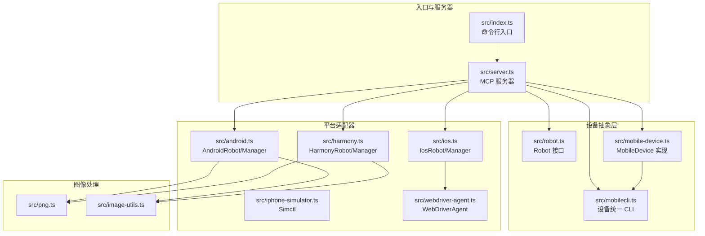
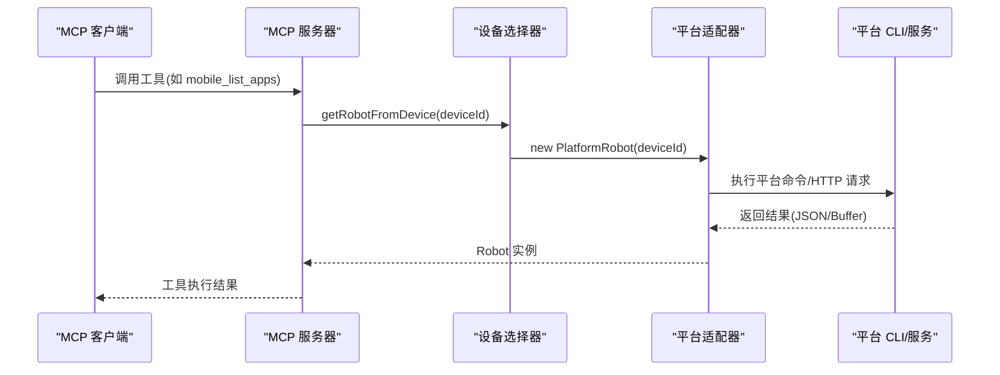
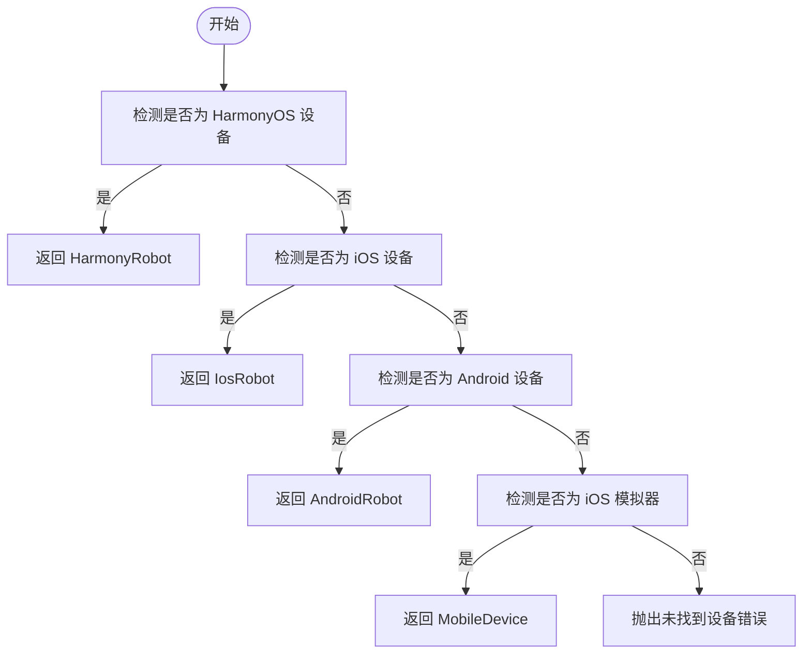
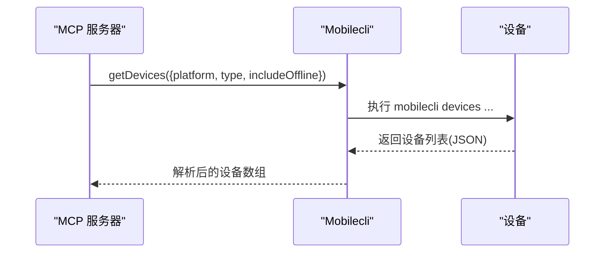
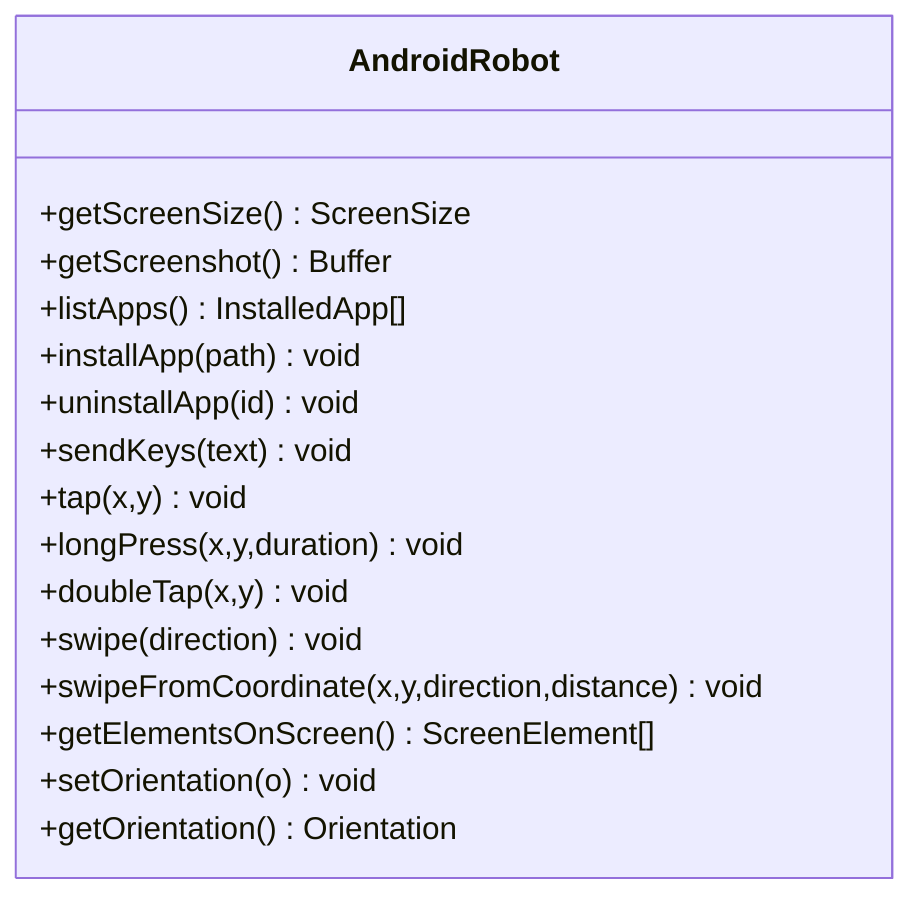
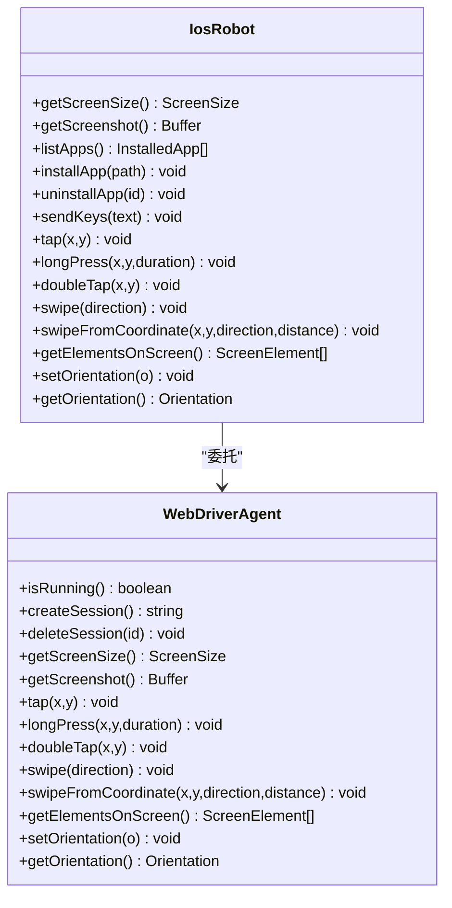
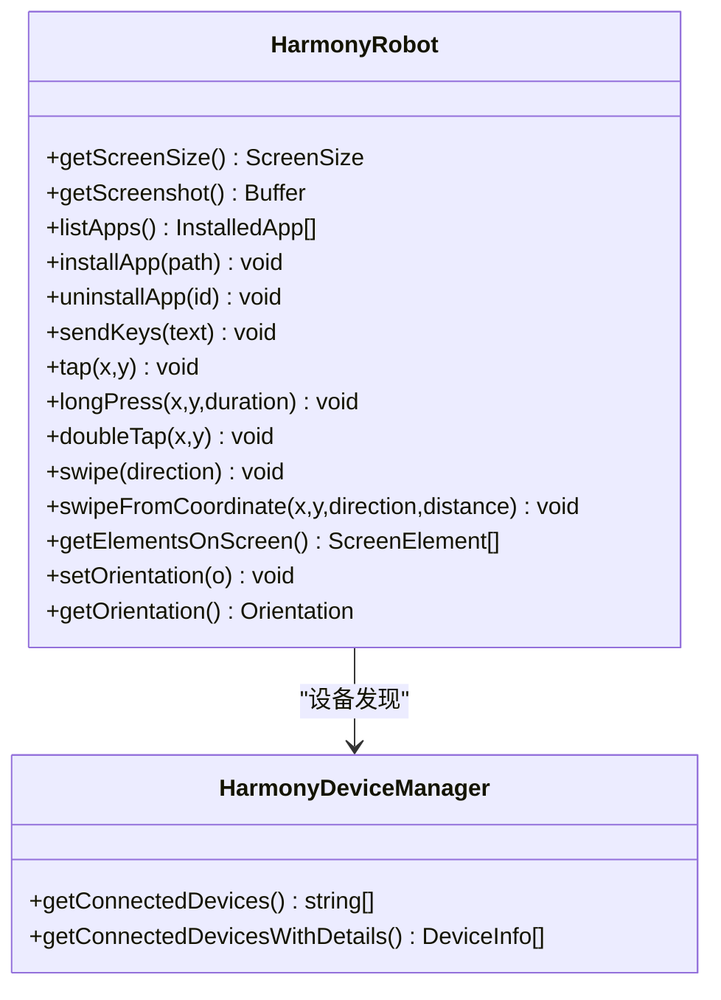
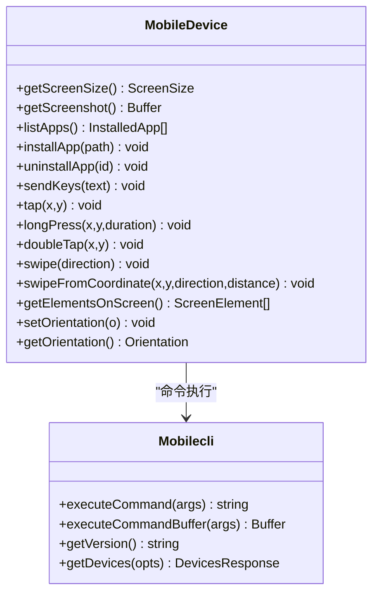
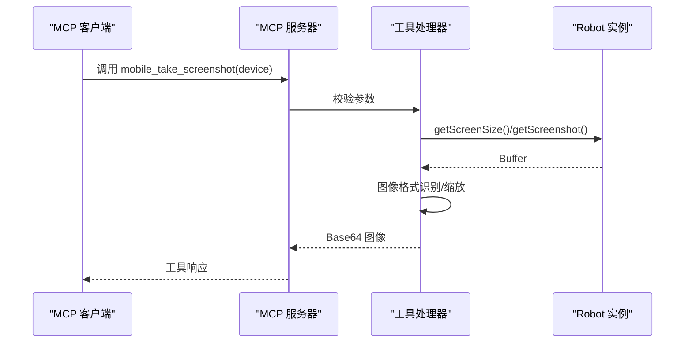
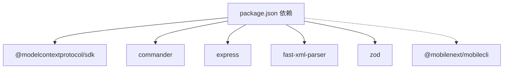

# 设备集成模式

<cite>
**本文档引用的文件**
- [src/index.ts](file://src/index.ts)
- [src/server.ts](file://src/server.ts)
- [src/robot.ts](file://src/robot.ts)
- [src/mobile-device.ts](file://src/mobile-device.ts)
- [src/mobilecli.ts](file://src/mobilecli.ts)
- [src/android.ts](file://src/android.ts)
- [src/ios.ts](file://src/ios.ts)
- [src/iphone-simulator.ts](file://src/iphone-simulator.ts)
- [src/harmony.ts](file://src/harmony.ts)
- [src/webdriver-agent.ts](file://src/webdriver-agent.ts)
- [src/png.ts](file://src/png.ts)
- [src/image-utils.ts](file://src/image-utils.ts)
- [package.json](file://package.json)
- [README.md](file://README.md)
- [test/mobilecli.test.ts](file://test/mobilecli.test.ts)
</cite>

## 目录
1. [简介](#简介)
2. [项目结构](#项目结构)
3. [核心组件](#核心组件)
4. [架构总览](#架构总览)
5. [详细组件分析](#详细组件分析)
6. [依赖关系分析](#依赖关系分析)
7. [性能考虑](#性能考虑)
8. [故障排查指南](#故障排查指南)
9. [结论](#结论)
10. [附录](#附录)

## 简介
本项目是一个基于 Model Context Protocol (MCP) 的移动设备自动化服务器，支持 iOS、Android 与 HarmonyOS（鸿蒙）三大平台。其核心目标是为 LLM/Agent 提供统一的设备控制接口，屏蔽不同平台的底层差异，实现“一次编写，多端运行”的设备集成模式。

- 设备管理器负责设备发现、类型识别与抽象分发；
- Robot 抽象层定义跨平台一致的操作契约；
- 平台适配器（AndroidRobot、IosRobot、HarmonyRobot、MobileDevice）封装具体平台命令；
- Mobilecli 作为 iOS/Android 设备的统一入口，提供设备列表、截图、UI dump 等能力；
- 服务器将上述能力包装为 MCP 工具，供客户端调用。

## 项目结构
项目采用按功能模块划分的组织方式，核心目录与文件如下：
- src：核心实现（机器人接口、平台适配、服务器、工具函数）
- test：单元测试（如 mobilecli 测试）
- package.json：依赖与脚本配置
- README.md：使用说明与平台支持

图表来源
- [src/index.ts:1-67](file://src/index.ts#L1-L67)
- [src/server.ts:1-708](file://src/server.ts#L1-L708)
- [src/robot.ts:1-148](file://src/robot.ts#L1-L148)
- [src/mobilecli.ts:1-136](file://src/mobilecli.ts#L1-L136)
- [src/mobile-device.ts:1-217](file://src/mobile-device.ts#L1-L217)
- [src/android.ts:1-593](file://src/android.ts#L1-L593)
- [src/ios.ts:1-294](file://src/ios.ts#L1-L294)
- [src/iphone-simulator.ts:1-273](file://src/iphone-simulator.ts#L1-L273)
- [src/harmony.ts:1-462](file://src/harmony.ts#L1-L462)
- [src/webdriver-agent.ts:1-455](file://src/webdriver-agent.ts#L1-L455)
- [src/png.ts](file://src/png.ts)
- [src/image-utils.ts](file://src/image-utils.ts)

章节来源
- [src/index.ts:1-67](file://src/index.ts#L1-L67)
- [src/server.ts:1-708](file://src/server.ts#L1-L708)
- [README.md:1-198](file://README.md#L1-L198)

## 核心组件
- Robot 接口：定义设备操作的统一契约（屏幕尺寸、截图、应用管理、输入、手势、方向等）。
- 平台适配器：
  - AndroidRobot：基于 ADB/UIAutomator 的 Android 实现；
  - IosRobot：基于 WebDriverAgent 的 iOS 实现；
  - HarmonyRobot：基于 HDC/uitest/hidumper 的 HarmonyOS 实现；
  - MobileDevice：基于 mobilecli 的通用设备封装（用于 iOS 模拟器等）。
- 设备管理器：
  - AndroidDeviceManager：列举 Android 设备并识别 TV/手机；
  - IosManager：列举 iOS 物理设备；
  - HarmonyDeviceManager：列举 HarmonyOS 设备；
  - Mobilecli：列举 iOS 模拟器等设备。
- 服务器：将设备能力包装为 MCP 工具，统一调度与错误处理。

章节来源
- [src/robot.ts:48-147](file://src/robot.ts#L48-L147)
- [src/android.ts:74-593](file://src/android.ts#L74-L593)
- [src/ios.ts:42-294](file://src/ios.ts#L42-L294)
- [src/harmony.ts:43-462](file://src/harmony.ts#L43-L462)
- [src/mobile-device.ts:62-217](file://src/mobile-device.ts#L62-L217)
- [src/server.ts:135-197](file://src/server.ts#L135-L197)

## 架构总览
系统采用“抽象接口 + 多平台适配器 + 统一服务器”的分层架构，核心设计原则：
- 解耦：通过 Robot 接口与设备管理器，屏蔽平台差异；
- 扩展：新增平台只需实现 Robot 接口并注册到设备选择逻辑；
- 可观测：统一的日志与错误包装，便于问题定位；
- 可靠：对平台特定依赖进行可用性检查与降级策略。

图表来源
- [src/server.ts:149-197](file://src/server.ts#L149-L197)
- [src/ios.ts:77-92](file://src/ios.ts#L77-L92)
- [src/android.ts:79-84](file://src/android.ts#L79-L84)
- [src/harmony.ts:48-53](file://src/harmony.ts#L48-L53)
- [src/mobile-device.ts:70-73](file://src/mobile-device.ts#L70-L73)

## 详细组件分析

### 设备管理器与 Robot 集成模式
- 设备发现与类型识别：
  - HarmonyOS：通过 hdc list targets 直接发现，无需 mobilecli；
  - iOS：物理设备通过 go-ios 列举；模拟器通过 mobilecli 列举；
  - Android：通过 ADB devices 列举。
- 设备选择与实例化：
  - 服务器根据设备 ID 优先判断 HarmonyOS，再判断 iOS，最后判断 Android；
  - 对于 iOS 模拟器，使用 MobileDevice（基于 mobilecli）实现；
  - 对于 iOS 物理设备，使用 IosRobot（基于 WebDriverAgent）；
  - 对于 Android 设备，使用 AndroidRobot（基于 ADB/UIAutomator）；
  - 对于 HarmonyOS 设备，使用 HarmonyRobot（基于 HDC/uitest）。

图表来源
- [src/server.ts:149-197](file://src/server.ts#L149-L197)

章节来源
- [src/server.ts:149-197](file://src/server.ts#L149-L197)
- [src/harmony.ts:418-462](file://src/harmony.ts#L418-L462)
- [src/ios.ts:234-294](file://src/ios.ts#L234-L294)
- [src/android.ts:506-593](file://src/android.ts#L506-L593)
- [src/mobile-device.ts:62-68](file://src/mobile-device.ts#L62-L68)

### Mobilecli 的作用与集成方式
- 作用：
  - 作为 iOS/Android 设备的统一 CLI，提供设备列表、截图、UI dump、应用安装/卸载等能力；
  - 用于 iOS 模拟器的设备发现与操作；
  - 用于 Android 设备的截图与 UI dump（部分场景）。
- 集成方式：
  - MobileDevice 将设备 ID 注入到 mobilecli 命令参数；
  - 服务器在需要时调用 mobilecli 的设备查询与操作；
  - 测试覆盖了 getDevices 与 getVersion 的行为。

图表来源
- [src/mobilecli.ts:107-134](file://src/mobilecli.ts#L107-L134)
- [src/server.ts:272-289](file://src/server.ts#L272-L289)

章节来源
- [src/mobilecli.ts:1-136](file://src/mobilecli.ts#L1-L136)
- [src/mobile-device.ts:70-73](file://src/mobile-device.ts#L70-L73)
- [test/mobilecli.test.ts:1-120](file://test/mobilecli.test.ts#L1-L120)

### 平台适配器实现要点

#### AndroidRobot（ADB/UIAutomator）
- 关键能力：屏幕尺寸、截图、应用管理、输入、手势、方向；
- UI 元素提取：解析 UIAutomator XML，过滤可见元素；
- 文本输入：ASCII 直接输入，非 ASCII 通过 Clipboard 广播（需 DeviceKit）；
- 方向设置：通过系统设置与内容提供者；
- 错误处理：ActionableError 包装可修复的错误信息。

图表来源
- [src/android.ts:74-504](file://src/android.ts#L74-L504)

章节来源
- [src/android.ts:74-504](file://src/android.ts#L74-L504)

#### IosRobot（WebDriverAgent）
- 关键能力：通过 WebDriverAgent 的 Actions API 实现点击、长按、双击、滑动、输入、方向；
- 设备发现：通过 go-ios 列举物理设备；
- 端口转发：本地监听 8100（WDA），隧道端口 60105（iOS 17+）；
- 错误处理：ActionableError 包装网络/状态异常。

图表来源
- [src/ios.ts:42-232](file://src/ios.ts#L42-L232)
- [src/webdriver-agent.ts:25-454](file://src/webdriver-agent.ts#L25-L454)

章节来源
- [src/ios.ts:42-232](file://src/ios.ts#L42-L232)
- [src/webdriver-agent.ts:25-454](file://src/webdriver-agent.ts#L25-L454)

#### HarmonyRobot（HDC/uitest）
- 关键能力：基于 HDC/uitest 的点击、滑动、长按、输入、截图、UI dump；
- 设备发现：hdc list targets；
- 屏幕尺寸与方向：hidumper；
- 应用管理：bm/aa；
- 不支持程序化方向切换。

图表来源
- [src/harmony.ts:43-416](file://src/harmony.ts#L43-L416)
- [src/harmony.ts:418-462](file://src/harmony.ts#L418-L462)

章节来源
- [src/harmony.ts:43-416](file://src/harmony.ts#L43-L416)
- [src/harmony.ts:418-462](file://src/harmony.ts#L418-L462)

#### MobileDevice（mobilecli）
- 作用：封装 mobilecli 命令，提供与设备交互的能力；
- 适用：iOS 模拟器等需要 mobilecli 的场景。

图表来源
- [src/mobile-device.ts:62-217](file://src/mobile-device.ts#L62-L217)
- [src/mobilecli.ts:27-136](file://src/mobilecli.ts#L27-L136)

章节来源
- [src/mobile-device.ts:62-217](file://src/mobile-device.ts#L62-L217)
- [src/mobilecli.ts:27-136](file://src/mobilecli.ts#L27-L136)

### 服务器工具与通信协议
- 工具注册：服务器通过 registerTool 注册所有设备相关工具；
- 参数校验：使用 zod 对工具输入进行严格校验；
- 错误处理：ActionableError 用于可修复错误，普通异常记录日志并返回错误内容；
- 图像处理：截图支持 PNG/JPEG 自动识别与缩放优化；
- 事件上报：posthog 用于工具调用统计。

图表来源
- [src/server.ts:585-673](file://src/server.ts#L585-L673)
- [src/png.ts](file://src/png.ts)
- [src/image-utils.ts](file://src/image-utils.ts)

章节来源
- [src/server.ts:585-673](file://src/server.ts#L585-L673)

## 依赖关系分析
- 运行时依赖：
  - @modelcontextprotocol/sdk：MCP 协议实现；
  - commander/express：命令行与 HTTP 服务器；
  - fast-xml-parser：Android UIAutomator XML 解析；
  - zod：工具参数校验；
  - optionalDependencies：@mobilenext/mobilecli（可选，iOS/Android 依赖）。
- 平台依赖：
  - iOS：go-ios、WebDriverAgent；
  - Android：ADB；
  - HarmonyOS：HDC。

图表来源
- [package.json:29-39](file://package.json#L29-L39)

章节来源
- [package.json:1-74](file://package.json#L1-L74)

## 性能考虑
- 截图优化：自动识别 PNG/JPEG，必要时进行缩放以降低传输体积；
- 命令超时与缓冲区限制：各平台适配器均设置了合理的超时与缓冲上限；
- 图像处理：仅在缩放可用时进行重采样，避免不必要的 CPU 开销；
- 并发控制：工具调用在单线程上下文中顺序执行，避免并发冲突。

[本节为通用性能建议，不直接分析具体文件]

## 故障排查指南
- mobilecli 不可用：
  - 现象：工具提示 mobilecli 不可用；
  - 处理：确认安装路径或环境变量 MOBILECLI_PATH 正确。
- iOS 设备无法连接：
  - 现象：端口转发或 WebDriverAgent 未就绪；
  - 处理：检查隧道端口 60105 与 WDA 端口 8100，确保 go-ios 安装正确。
- Android 设备无响应：
  - 现象：ADB 命令失败；
  - 处理：检查 ANDROID_HOME 或本地 SDK 路径，确认 ADB 可用。
- HarmonyOS 设备无响应：
  - 现象：hdc 命令失败；
  - 处理：设置 HDC_SDK_PATH 或将 hdc 加入 PATH。

章节来源
- [src/server.ts:138-147](file://src/server.ts#L138-L147)
- [src/ios.ts:69-92](file://src/ios.ts#L69-L92)
- [src/android.ts:32-54](file://src/android.ts#L32-L54)
- [src/harmony.ts:12-18](file://src/harmony.ts#L12-L18)

## 结论
本项目通过 Robot 抽象与多平台适配器实现了设备控制的解耦与扩展，借助 Mobilecli 与平台原生命令完成统一的设备管理与操作。服务器将这些能力包装为 MCP 工具，为 LLM/Agent 提供稳定可靠的跨平台自动化能力。HarmonyOS 的加入进一步完善了生态覆盖，使同一套工具集支持三大主流移动平台。

[本节为总结性内容，不直接分析具体文件]

## 附录

### 配置选项与扩展点
- 环境变量：
  - MOBILECLI_PATH：mobilecli 可执行文件路径；
  - GO_IOS_PATH：go-ios 可执行文件路径；
  - ANDROID_HOME：Android SDK 路径；
  - HDC_SDK_PATH：HarmonyOS SDK 路径。
- 服务器启动：
  - stdio 模式（默认）：适合大多数 MCP 客户端；
  - SSE 模式：通过 --port 启动 HTTP SSE 服务器。

章节来源
- [src/mobilecli.ts:53-92](file://src/mobilecli.ts#L53-L92)
- [src/ios.ts:33-40](file://src/ios.ts#L33-L40)
- [src/android.ts:32-54](file://src/android.ts#L32-L54)
- [src/harmony.ts:12-18](file://src/harmony.ts#L12-L18)
- [src/index.ts:50-67](file://src/index.ts#L50-L67)

### 自定义设备管理器实现指导
- 实现步骤：
  1) 新建类实现 Robot 接口；
  2) 在设备管理器中添加设备发现方法；
  3) 在 getRobotFromDevice 中增加类型判断与实例化；
  4) 编写工具注册与参数校验；
  5) 添加错误处理与日志输出。
- 最佳实践：
  - 明确平台依赖与前置条件；
  - 使用 ActionableError 提示可修复问题；
  - 对外部命令设置超时与缓冲限制；
  - 在服务器中统一进行参数校验与错误包装。

章节来源
- [src/robot.ts:48-147](file://src/robot.ts#L48-L147)
- [src/server.ts:149-197](file://src/server.ts#L149-L197)