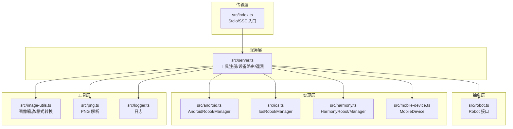
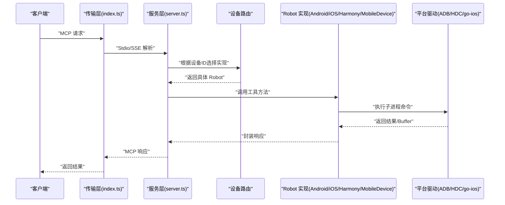
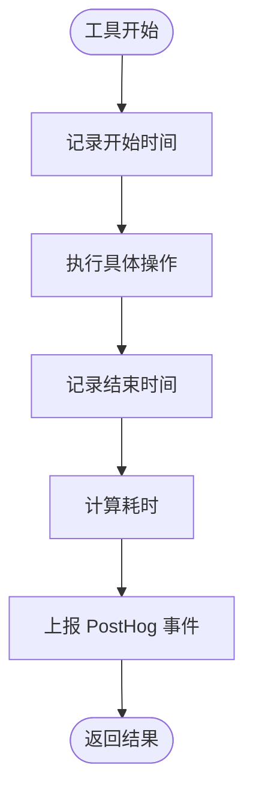
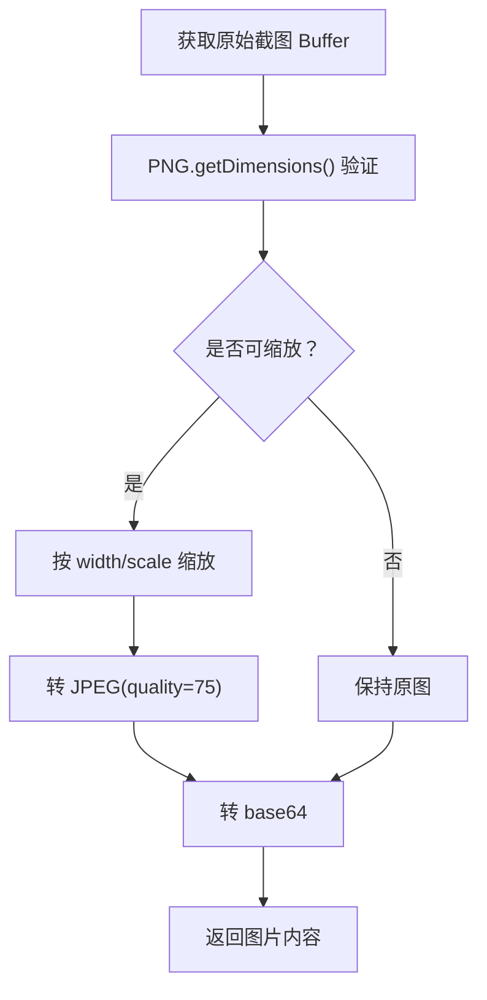
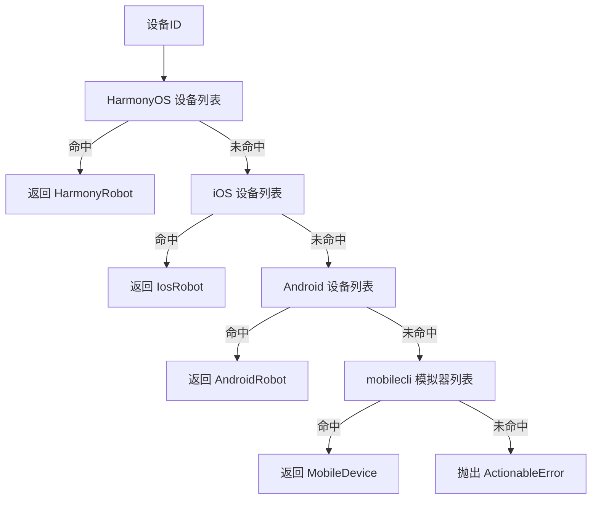
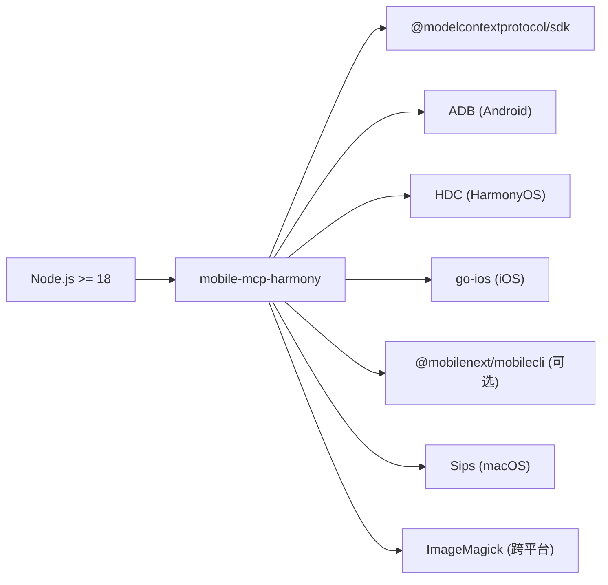

# 性能分析

<cite>
**本文引用的文件**
- [package.json](file://package.json)
- [README.md](file://README.md)
- [DEEPWIKI.md](file://DEEPWIKI.md)
- [src/index.ts](file://src/index.ts)
- [src/server.ts](file://src/server.ts)
- [src/robot.ts](file://src/robot.ts)
- [src/android.ts](file://src/android.ts)
- [src/ios.ts](file://src/ios.ts)
- [src/harmony.ts](file://src/harmony.ts)
- [src/mobile-device.ts](file://src/mobile-device.ts)
- [src/mobilecli.ts](file://src/mobilecli.ts)
- [src/image-utils.ts](file://src/image-utils.ts)
- [src/png.ts](file://src/png.ts)
- [src/logger.ts](file://src/logger.ts)
- [test/mobilecli.test.ts](file://test/mobilecli.test.ts)
</cite>

## 目录
1. [简介](#简介)
2. [项目结构](#项目结构)
3. [核心组件](#核心组件)
4. [架构总览](#架构总览)
5. [详细组件分析](#详细组件分析)
6. [依赖关系分析](#依赖关系分析)
7. [性能考量](#性能考量)
8. [故障排查指南](#故障排查指南)
9. [结论](#结论)
10. [附录](#附录)

## 简介
本项目是一个基于 Model Context Protocol (MCP) 的移动端自动化服务器，支持 iOS、Android 与 HarmonyOS（鸿蒙）设备的统一自动化接口。其性能分析重点在于：
- 响应时间测量：工具调用耗时统计与遥测上报。
- 并发处理能力：传输层（Stdio/SSE）与子进程调用的并发特性。
- 资源使用监控：截图处理、图像缩放与缓冲区大小限制。
- 内存管理优化：子进程调用的超时与缓冲区上限，避免内存膨胀。
- 平台差异优化：Android（ADB）、iOS（go-ios/WDA）、HarmonyOS（HDC）的调用特性与性能权衡。
- 基准与压力测试：建议的实施方法与指标采集。

## 项目结构
项目采用分层架构，核心文件如下：
- 传输层：入口与传输协议（Stdio/SSE）。
- 服务层：MCP 工具注册、设备路由与遥测。
- 抽象层：Robot 接口定义。
- 实现层：各平台具体实现（Android、iOS、HarmonyOS、通用 mobilecli）。
- 工具层：图像处理、日志与 PNG 解析。

**图表来源**
- [src/index.ts:1-67](file://src/index.ts#L1-L67)
- [src/server.ts:1-708](file://src/server.ts#L1-L708)
- [src/robot.ts:1-148](file://src/robot.ts#L1-L148)
- [src/android.ts:1-593](file://src/android.ts#L1-L593)
- [src/ios.ts:1-294](file://src/ios.ts#L1-L294)
- [src/harmony.ts:1-462](file://src/harmony.ts#L1-L462)
- [src/mobile-device.ts:1-217](file://src/mobile-device.ts#L1-L217)
- [src/image-utils.ts:1-165](file://src/image-utils.ts#L1-L165)
- [src/png.ts:1-21](file://src/png.ts#L1-L21)
- [src/logger.ts:1-22](file://src/logger.ts#L1-L22)

**章节来源**
- [README.md:1-198](file://README.md#L1-L198)
- [DEEPWIKI.md:32-54](file://DEEPWIKI.md#L32-L54)

## 核心组件
- 传输层：提供 Stdio 与 SSE 两种传输模式，Stdio 默认，SSE 用于 HTTP 场景。
- 服务层：注册 20 个 MCP 工具，实现设备路由与遥测上报。
- 抽象层：Robot 接口统一设备能力，便于多平台实现。
- 实现层：Android（ADB）、iOS（go-ios/WDA）、HarmonyOS（HDC）、通用 mobilecli。
- 工具层：图像处理（缩放、JPEG 压缩）、PNG 解析、日志记录。

**章节来源**
- [src/index.ts:1-67](file://src/index.ts#L1-L67)
- [src/server.ts:35-708](file://src/server.ts#L35-L708)
- [src/robot.ts:48-148](file://src/robot.ts#L48-L148)
- [src/android.ts:74-504](file://src/android.ts#L74-L504)
- [src/ios.ts:42-232](file://src/ios.ts#L42-L232)
- [src/harmony.ts:43-416](file://src/harmony.ts#L43-L416)
- [src/mobile-device.ts:62-216](file://src/mobile-device.ts#L62-L216)
- [src/image-utils.ts:9-165](file://src/image-utils.ts#L9-L165)
- [src/png.ts:6-21](file://src/png.ts#L6-L21)
- [src/logger.ts:1-22](file://src/logger.ts#L1-L22)

## 架构总览
MCP 工具调用流程：客户端发送请求 → 传输层接收 → 服务层路由到具体 Robot 实现 → 平台子进程调用 → 返回结果。

**图表来源**
- [src/index.ts:9-67](file://src/index.ts#L9-L67)
- [src/server.ts:149-197](file://src/server.ts#L149-L197)
- [src/android.ts:79-84](file://src/android.ts#L79-L84)
- [src/harmony.ts:48-53](file://src/harmony.ts#L48-L53)
- [src/ios.ts:94-96](file://src/ios.ts#L94-L96)

## 详细组件分析

### 响应时间测量与遥测
- 工具调用耗时：每个工具在执行前后记录时间戳，计算耗时并上报 PostHog。
- 遥测事件：launch、tool_invoked、tool_failed，包含平台、版本、Node 版本、Agent 名称、工具名、耗时等。
- 日志：trace/error 输出到 stderr，并可选写入文件。

**图表来源**
- [src/server.ts:70-95](file://src/server.ts#L70-L95)
- [src/server.ts:97-133](file://src/server.ts#L97-L133)
- [src/logger.ts:15-21](file://src/logger.ts#L15-L21)

**章节来源**
- [src/server.ts:70-133](file://src/server.ts#L70-L133)
- [src/logger.ts:1-22](file://src/logger.ts#L1-L22)

### 截图与图像处理优化
- 截图来源：Android 使用 screencap，iOS 通过 WDA，HarmonyOS 通过 snapshot_display，通用 mobilecli 通过截图命令。
- PNG 验证：使用 PNG 类解析宽高，确保截图有效。
- 图像缩放：若可用（Sips/ImageMagick），先按 scale 缩放再转 JPEG（质量 75），降低传输体积。
- 缓冲区限制：子进程调用设置 maxBuffer 与 timeout，防止大截图导致内存暴涨。

**图表来源**
- [src/server.ts:605-672](file://src/server.ts#L605-L672)
- [src/png.ts:10-20](file://src/png.ts#L10-L20)
- [src/image-utils.ts:34-114](file://src/image-utils.ts#L34-L114)
- [src/android.ts:295-310](file://src/android.ts#L295-L310)
- [src/harmony.ts:159-182](file://src/harmony.ts#L159-L182)
- [src/mobile-device.ts:139-142](file://src/mobile-device.ts#L139-L142)

**章节来源**
- [src/server.ts:605-672](file://src/server.ts#L605-L672)
- [src/image-utils.ts:9-165](file://src/image-utils.ts#L9-L165)
- [src/png.ts:1-21](file://src/png.ts#L1-L21)
- [src/android.ts:69-71](file://src/android.ts#L69-L71)
- [src/harmony.ts:9-11](file://src/harmony.ts#L9-L11)
- [src/mobile-device.ts:44-51](file://src/mobile-device.ts#L44-L51)

### 并发处理与线程池配置
- 传输层并发：Stdio 与 SSE 均为事件驱动，理论上可并发处理多个请求。
- 子进程并发：各平台通过 execFileSync 调用外部工具（ADB/HDC/go-ios），默认串行执行。
- 建议：对独立设备的多次调用可并行，但同一设备的连续操作建议串行，避免 UI 状态冲突。

**章节来源**
- [src/index.ts:9-67](file://src/index.ts#L9-L67)
- [src/android.ts:79-84](file://src/android.ts#L79-L84)
- [src/harmony.ts:48-53](file://src/harmony.ts#L48-L53)
- [src/ios.ts:94-96](file://src/ios.ts#L94-L96)

### 平台差异与优化要点
- Android（ADB）
  - 截图：screencap，多屏设备需指定 display ID。
  - 文本输入：ASCII 直接输入，非 ASCII 通过剪贴板（需安装 devicekit）。
  - 方向设置：关闭自动旋转后设置 user_rotation。
- iOS（go-ios/WDA）
  - 需要 tunnel（端口 60105）与端口转发（端口 8100），WDA 在设备上运行。
  - 截图与动作通过 WDA HTTP API。
- HarmonyOS（HDC）
  - 无需 mobilecli，直接通过 hdc/uitest/hidumper 等工具。
  - 截图通过 snapshot_display，布局 dump 通过 uitest dumpLayout。

**章节来源**
- [src/android.ts:295-464](file://src/android.ts#L295-L464)
- [src/android.ts:466-491](file://src/android.ts#L466-L491)
- [src/ios.ts:69-92](file://src/ios.ts#L69-L92)
- [src/ios.ts:104-108](file://src/ios.ts#L104-L108)
- [src/harmony.ts:159-332](file://src/harmony.ts#L159-L332)

### 设备路由与发现
- 设备路由：根据设备 ID 优先匹配 HarmonyOS、iOS、Android，最后 fallback 到 mobilecli 模拟器。
- 设备发现：Android 通过 ADB devices，iOS 通过 go-ios list/info，HarmonyOS 通过 hdc list targets。

**图表来源**
- [src/server.ts:149-197](file://src/server.ts#L149-L197)
- [src/server.ts:209-294](file://src/server.ts#L209-L294)
- [src/android.ts:551-591](file://src/android.ts#L551-L591)
- [src/ios.ts:258-292](file://src/ios.ts#L258-L292)
- [src/harmony.ts:418-461](file://src/harmony.ts#L418-L461)

**章节来源**
- [src/server.ts:149-294](file://src/server.ts#L149-L294)
- [src/android.ts:506-593](file://src/android.ts#L506-L593)
- [src/ios.ts:234-294](file://src/ios.ts#L234-L294)
- [src/harmony.ts:418-462](file://src/harmony.ts#L418-L462)

## 依赖关系分析
- 运行时与脚本：Node >= 18，构建与测试工具链。
- MCP SDK：@modelcontextprotocol/sdk，提供传输与工具注册能力。
- 平台工具：ADB（Android）、HDC（HarmonyOS）、go-ios（iOS）、mobilecli（通用）。
- 图像处理：Sips（macOS）或 ImageMagick（跨平台）。

**图表来源**
- [package.json:13-15](file://package.json#L13-L15)
- [package.json:30-39](file://package.json#L30-L39)
- [README.md:94-99](file://README.md#L94-L99)
- [src/image-utils.ts:137-165](file://src/image-utils.ts#L137-L165)

**章节来源**
- [package.json:1-74](file://package.json#L1-L74)
- [README.md:90-198](file://README.md#L90-L198)
- [src/image-utils.ts:133-165](file://src/image-utils.ts#L133-L165)

## 性能考量

### 响应时间测量
- 工具调用耗时：在工具处理器中记录开始与结束时间，计算耗时并上报。
- 建议：对关键工具（如截图、元素解析）单独记录耗时，便于定位瓶颈。

**章节来源**
- [src/server.ts:70-95](file://src/server.ts#L70-L95)

### 并发处理能力
- 传输层：Stdio/SSE 事件驱动，可并发处理多个请求。
- 子进程：execFileSync 串行执行，建议对不同设备并行、同设备串行。
- 建议：在业务层引入轻量队列，按设备维度串行化高频操作。

**章节来源**
- [src/index.ts:9-67](file://src/index.ts#L9-L67)
- [src/android.ts:79-84](file://src/android.ts#L79-L84)
- [src/harmony.ts:48-53](file://src/harmony.ts#L48-L53)
- [src/ios.ts:94-96](file://src/ios.ts#L94-L96)

### 资源使用监控
- 截图缓冲区：设置 maxBuffer 与 timeout，避免大图导致内存溢出。
- 图像缩放：优先使用 Sips（macOS）或 ImageMagick，减少传输体积。
- 建议：在高分辨率设备上启用缩放，结合质量参数平衡清晰度与体积。

**章节来源**
- [src/android.ts:69-71](file://src/android.ts#L69-L71)
- [src/harmony.ts:9-11](file://src/harmony.ts#L9-L11)
- [src/mobile-device.ts:44-51](file://src/mobile-device.ts#L44-L51)
- [src/image-utils.ts:34-114](file://src/image-utils.ts#L34-L114)

### 内存管理优化
- 子进程调用：限制 maxBuffer 与 timeout，避免长时间运行导致内存累积。
- 截图清理：临时文件在使用后清理，避免磁盘与句柄泄漏。
- 建议：对频繁截图场景，缓存缩略图而非原图，定期清理缓存。

**章节来源**
- [src/android.ts:79-84](file://src/android.ts#L79-L84)
- [src/harmony.ts:164-181](file://src/harmony.ts#L164-L181)
- [src/mobile-device.ts:164-170](file://src/mobile-device.ts#L164-L170)

### 平台差异优化
- Android：多屏设备需指定 display ID；文本输入非 ASCII 时走剪贴板路径。
- iOS：17+ 需要 tunnel 与端口转发；WDA 会话管理建议短生命周期。
- HarmonyOS：无需 mobilecli，HDC 命令直接驱动，注意布局 dump 的解析差异。

**章节来源**
- [src/android.ts:295-310](file://src/android.ts#L295-L310)
- [src/android.ts:409-427](file://src/android.ts#L409-L427)
- [src/ios.ts:69-92](file://src/ios.ts#L69-L92)
- [src/harmony.ts:159-332](file://src/harmony.ts#L159-L332)

### 基准与压力测试实施
- 基准测试：针对关键工具（截图、元素解析、点击）在不同分辨率与设备上测量平均耗时与 P95/P99。
- 压力测试：并发调用多个设备的同一工具，观察 CPU、内存、IO 使用率与错误率。
- 指标采集：工具耗时、截图大小、图像缩放耗时、子进程执行时间、错误次数。
- 建议：使用系统监控工具（如 top/dyldstat/Activity Monitor）与 Node 性能分析工具（如 v8 profiler）配合。

**章节来源**
- [src/server.ts:70-95](file://src/server.ts#L70-L95)
- [src/server.ts:605-672](file://src/server.ts#L605-L672)

### 性能监控工具与指标解读
- 遥测：PostHog 事件包含工具名、耗时、平台、版本等，可用于趋势分析。
- 日志：trace/error 输出到 stderr，可选写入文件，便于离线分析。
- 指标解读：关注工具失败率、P95 耗时、截图体积变化、子进程超时次数。

**章节来源**
- [src/server.ts:97-133](file://src/server.ts#L97-L133)
- [src/logger.ts:15-21](file://src/logger.ts#L15-L21)

## 故障排查指南
- 移动 CLI 可用性：mobilecli 版本检查失败时抛出可修复错误，指引安装文档。
- 设备未发现：检查平台工具（ADB/HDC/go-ios）是否就绪，设备连接状态。
- 截图无效：验证 PNG 头部与尺寸，确认图像处理工具可用。
- 子进程超时：调整 TIMEOUT 与 maxBuffer，或优化图像处理链路。
- 日志定位：通过 LOG_FILE 环境变量输出到文件，结合 trace/error 信息定位问题。

**章节来源**
- [src/server.ts:138-147](file://src/server.ts#L138-L147)
- [src/server.ts:665-671](file://src/server.ts#L665-L671)
- [src/mobilecli.ts:94-105](file://src/mobilecli.ts#L94-L105)
- [src/png.ts:10-20](file://src/png.ts#L10-L20)
- [src/logger.ts:1-22](file://src/logger.ts#L1-L22)

## 结论
本项目通过清晰的分层架构与平台抽象，提供了跨 iOS、Android、HarmonyOS 的统一自动化能力。性能方面，已在工具调用耗时统计、图像处理优化与子进程资源限制上做了基础保障。建议在生产环境中进一步完善：
- 引入设备级并发队列与会话复用。
- 增强图像处理链路的可配置性与缓存策略。
- 建立持续的基准与压力测试体系，结合遥测与日志进行持续优化。

## 附录
- 平台支持与安装配置参见 README。
- 构建与运行脚本、测试与代码规范参见 package.json 与 DEEPWIKI。

**章节来源**
- [README.md:90-198](file://README.md#L90-L198)
- [package.json:17-25](file://package.json#L17-L25)
- [DEEPWIKI.md:651-688](file://DEEPWIKI.md#L651-L688)