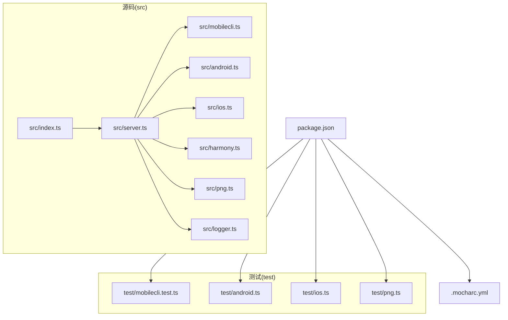
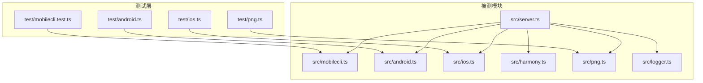
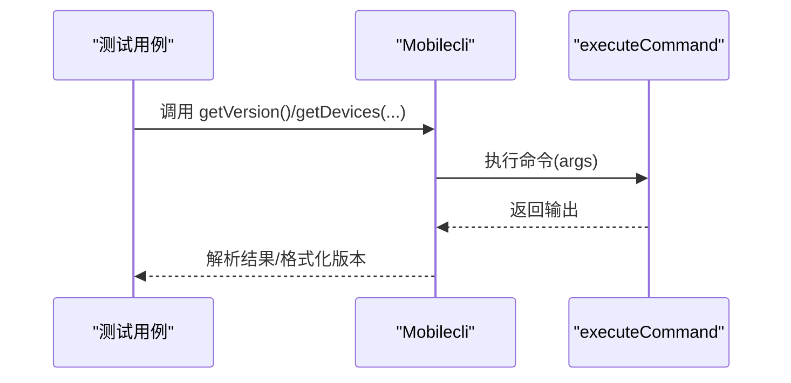
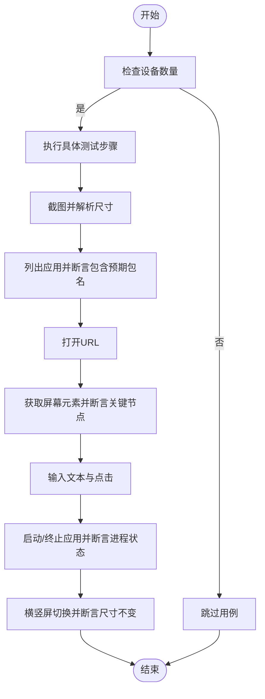
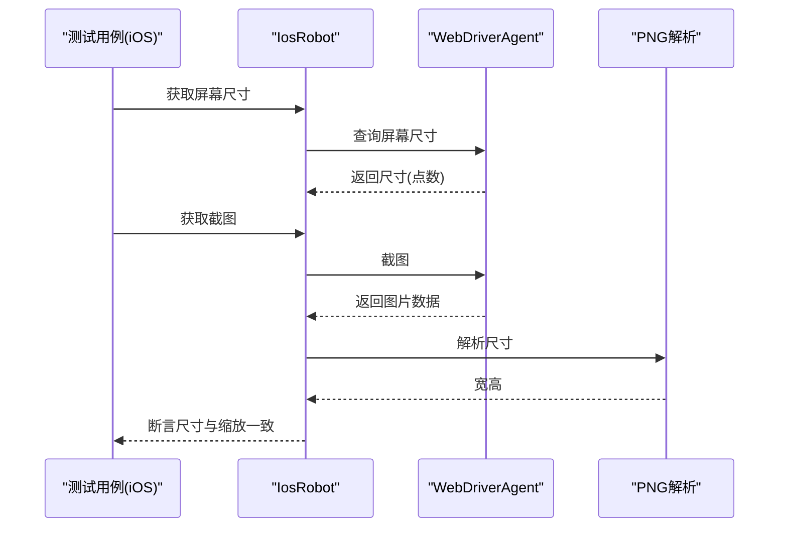
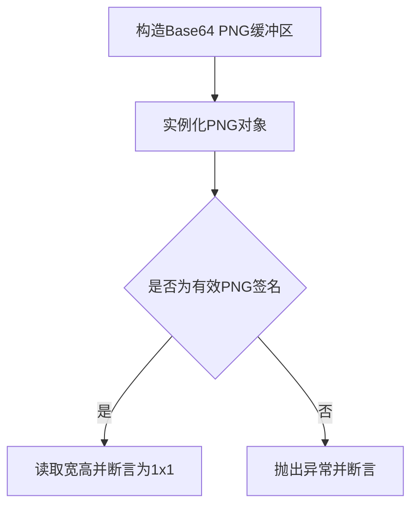
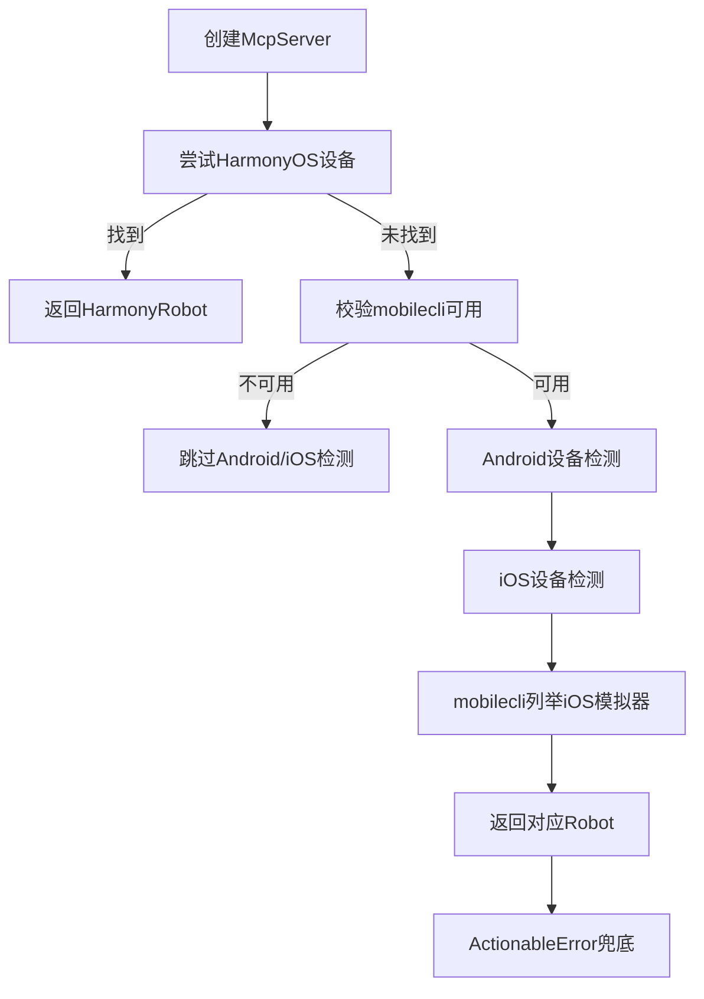
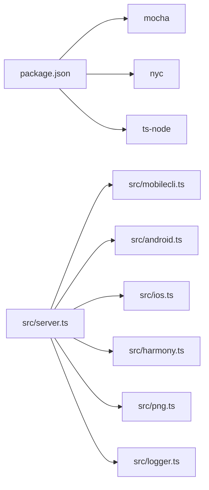

# 测试与调试

<cite>
**本文引用的文件**
- [package.json](file://package.json)
- [.mocharc.yml](file://.mocharc.yml)
- [src/index.ts](file://src/index.ts)
- [src/server.ts](file://src/server.ts)
- [src/mobilecli.ts](file://src/mobilecli.ts)
- [src/logger.ts](file://src/logger.ts)
- [src/android.ts](file://src/android.ts)
- [src/ios.ts](file://src/ios.ts)
- [src/harmony.ts](file://src/harmony.ts)
- [src/png.ts](file://src/png.ts)
- [test/mobilecli.test.ts](file://test/mobilecli.test.ts)
- [test/android.ts](file://test/android.ts)
- [test/ios.ts](file://test/ios.ts)
- [test/png.ts](file://test/png.ts)
</cite>

## 目录
1. [简介](#简介)
2. [项目结构](#项目结构)
3. [核心组件](#核心组件)
4. [架构总览](#架构总览)
5. [详细组件分析](#详细组件分析)
6. [依赖关系分析](#依赖关系分析)
7. [性能考虑](#性能考虑)
8. [故障排查指南](#故障排查指南)
9. [结论](#结论)
10. [附录](#附录)

## 简介
本文件系统性阐述本项目的测试策略与调试方法，覆盖单元测试与集成测试的组织方式、Mocha 配置与使用、跨平台（Android、iOS、HarmonyOS）测试方法与用例规范、调试技巧与工具（日志、网络诊断、平台特定调试）、以及测试覆盖率工具 NYC 的使用与报告解读，并提供常见问题排查与性能/压力测试建议。

## 项目结构
项目采用“源码在 src 下、测试在 test 下”的分层组织，配合 Mocha 作为测试运行器、NYC 作为覆盖率收集器、ts-node 提供 TypeScript 直跑支持。整体结构清晰，便于按平台拆分测试用例与平台无关的核心逻辑测试。

图表来源
- [package.json:17-24](file://package.json#L17-L24)
- [test/mobilecli.test.ts:1-120](file://test/mobilecli.test.ts#L1-L120)
- [test/android.ts:1-140](file://test/android.ts#L1-L140)
- [test/ios.ts:1-29](file://test/ios.ts#L1-L29)
- [test/png.ts:1-24](file://test/png.ts#L1-L24)
- [src/server.ts:135-136](file://src/server.ts#L135-L136)
- [src/index.ts:1-67](file://src/index.ts#L1-L67)

章节来源
- [package.json:17-24](file://package.json#L17-L24)
- [src/index.ts:1-67](file://src/index.ts#L1-L67)
- [src/server.ts:135-136](file://src/server.ts#L135-L136)

## 核心组件
- 测试运行与覆盖率
  - 使用 Mocha 作为测试运行器，通过脚本命令统一执行测试。
  - 使用 NYC 作为覆盖率收集器，结合 Mocha 运行时生成覆盖率报告。
- 日志与可观测性
  - 统一的日志写入封装，支持将日志输出到文件或标准错误流。
- 平台抽象与设备管理
  - 通过 Mobilecli 封装外部二进制调用，统一版本检测与设备枚举。
  - Android/iOS/HarmonyOS 分别实现 Robot 接口，提供一致的设备操作能力。
- 截图与图像处理
  - PNG 解析类用于校验截图格式与尺寸，保障图像有效性。

章节来源
- [package.json:21](file://package.json#L21)
- [src/logger.ts:1-22](file://src/logger.ts#L1-L22)
- [src/mobilecli.ts:27-136](file://src/mobilecli.ts#L27-L136)
- [src/android.ts:74-200](file://src/android.ts#L74-L200)
- [src/ios.ts:42-200](file://src/ios.ts#L42-L200)
- [src/harmony.ts:43-200](file://src/harmony.ts#L43-L200)
- [src/png.ts:6-21](file://src/png.ts#L6-L21)

## 架构总览
下图展示测试与被测模块之间的交互关系：测试通过直接实例化或注入依赖的方式对核心模块进行验证；部分测试需要真实设备或模拟器环境。

图表来源
- [test/mobilecli.test.ts:1-120](file://test/mobilecli.test.ts#L1-L120)
- [test/android.ts:1-140](file://test/android.ts#L1-L140)
- [test/ios.ts:1-29](file://test/ios.ts#L1-L29)
- [test/png.ts:1-24](file://test/png.ts#L1-L24)
- [src/server.ts:135-136](file://src/server.ts#L135-L136)

## 详细组件分析

### 单元测试：mobilecli 模块
- 测试目标
  - 版本查询行为与错误兜底。
  - 设备列表命令参数组合（平台过滤、类型过滤、包含离线设备等）。
  - 命令调用参数序列与返回值解析。
- Mock 策略
  - 通过替换执行函数以捕获命令参数并返回可控输出，避免真实外部二进制依赖。
- 断言要点
  - 返回字符串长度与格式匹配。
  - 参数序列与期望完全一致。
  - 异常路径中返回“失败”提示信息。

图表来源
- [test/mobilecli.test.ts:24-57](file://test/mobilecli.test.ts#L24-L57)
- [test/mobilecli.test.ts:75-118](file://test/mobilecli.test.ts#L75-L118)
- [src/mobilecli.ts:39-105](file://src/mobilecli.ts#L39-L105)

章节来源
- [test/mobilecli.test.ts:1-120](file://test/mobilecli.test.ts#L1-L120)
- [src/mobilecli.ts:27-136](file://src/mobilecli.ts#L27-L136)

### 集成测试：Android 平台
- 测试目标
  - 屏幕尺寸获取、截图尺寸一致性、应用列表、URL 打开、元素识别、按键输入与点击、应用启停、横竖屏切换。
- 设备条件
  - 仅当存在单个可用设备时执行，否则跳过当前用例。
- 断言策略
  - 截图尺寸与屏幕尺寸一致（含缩放换算）。
  - 元素类型、文本、标签等属性存在性校验。
  - 应用进程列表变化验证启停效果。
- 注意事项
  - 需要真实设备或模拟器在线且可访问。

图表来源
- [test/android.ts:10-139](file://test/android.ts#L10-L139)
- [src/android.ts:103-131](file://src/android.ts#L103-L131)
- [src/png.ts:6-21](file://src/png.ts#L6-L21)

章节来源
- [test/android.ts:1-140](file://test/android.ts#L1-L140)
- [src/android.ts:74-200](file://src/android.ts#L74-L200)

### 集成测试：iOS 平台
- 测试目标
  - 截图尺寸与屏幕尺寸一致性（点数与缩放换算）。
- 设备条件
  - 仅当存在单个可用设备时执行，否则跳过当前用例。
- 断言策略
  - 截图尺寸与屏幕尺寸按缩放换算后一致。

图表来源
- [test/ios.ts:6-28](file://test/ios.ts#L6-L28)
- [src/ios.ts:110-113](file://src/ios.ts#L110-L113)
- [src/png.ts:6-21](file://src/png.ts#L6-L21)

章节来源
- [test/ios.ts:1-29](file://test/ios.ts#L1-L29)
- [src/ios.ts:42-200](file://src/ios.ts#L42-L200)

### 单元测试：PNG 图像解析
- 测试目标
  - 正常 PNG 解析尺寸正确。
  - 非 PNG 抛出异常。
- 断言策略
  - Base64 构造 1x1 图像并断言宽高。
  - 非法数据断言抛错。

图表来源
- [test/png.ts:5-23](file://test/png.ts#L5-L23)
- [src/png.ts:6-21](file://src/png.ts#L6-L21)

章节来源
- [test/png.ts:1-24](file://test/png.ts#L1-L24)
- [src/png.ts:1-21](file://src/png.ts#L1-L21)

### 跨平台设备选择与工具注册
- 设备选择流程
  - 优先识别 HarmonyOS（无需外部依赖），其次通过 Mobilecli 列举 iOS 模拟器，最后通过各平台管理器识别真实设备。
- 工具注册
  - 服务端集中注册各类工具（设备列举、应用管理、截图、手势、按键、方向等），统一错误处理与埋点上报。

图表来源
- [src/server.ts:149-197](file://src/server.ts#L149-L197)
- [src/server.ts:199-295](file://src/server.ts#L199-L295)

章节来源
- [src/server.ts:135-136](file://src/server.ts#L135-L136)
- [src/server.ts:149-197](file://src/server.ts#L149-L197)
- [src/server.ts:199-295](file://src/server.ts#L199-L295)

## 依赖关系分析
- 测试与被测模块耦合
  - 单元测试对 Mobilecli 采用注入式替换，降低对外部二进制的耦合。
  - 集成测试依赖真实设备或模拟器，耦合度较高但更贴近实际使用场景。
- 外部依赖
  - Mocha、NYC、ts-node 由开发依赖提供；运行时依赖包括 SDK、Express、Zod 等。
- 可能的循环依赖
  - 当前结构清晰，无明显循环依赖迹象。

图表来源
- [package.json:40-60](file://package.json#L40-L60)
- [src/server.ts:135-136](file://src/server.ts#L135-L136)

章节来源
- [package.json:40-60](file://package.json#L40-L60)
- [src/server.ts:135-136](file://src/server.ts#L135-L136)

## 性能考虑
- 截图与图像处理
  - 截图尺寸较大时，服务端会根据可用性进行缩放并转换为 JPEG，以减少传输体积与内存占用。
- 工具调用超时与缓冲区限制
  - 各平台调用设置统一的超时与最大缓冲区，避免长时间阻塞与内存溢出。
- 并发与稳定性
  - 在多设备或多并发场景下，建议控制测试并发度，避免设备资源争用导致不稳定。

章节来源
- [src/server.ts:615-650](file://src/server.ts#L615-L650)
- [src/android.ts:69-71](file://src/android.ts#L69-L71)
- [src/ios.ts:47-59](file://src/ios.ts#L47-L59)
- [src/harmony.ts:9-11](file://src/harmony.ts#L9-L11)

## 故障排查指南

### 测试执行与覆盖率
- 执行命令
  - 使用统一脚本触发 Mocha + NYC，确保覆盖率统计生效。
- 覆盖率报告
  - NYC 默认生成 HTML 报告目录，可在浏览器打开查看未覆盖路径与热点区域。
- 常见问题
  - 脚本缺失：确认 package.json 中 test 脚本存在。
  - 类型注册：ts-node 注册需与测试文件扩展名匹配。

章节来源
- [package.json:21](file://package.json#L21)

### 日志与可观测性
- 日志输出
  - 通过统一接口输出至标准错误与可选文件，便于定位问题。
- 使用建议
  - 在 CI 或长时任务中开启文件日志，保留现场证据。

章节来源
- [src/logger.ts:1-22](file://src/logger.ts#L1-L22)

### 移动端调试要点
- Android
  - 依赖 ADB，确保 ANDROID_HOME 或默认路径可达。
  - 截图与元素识别依赖 UIAutomator，需保证设备已授权与无障碍服务可用。
- iOS
  - 需要 go-ios 与 WebDriverAgent，以及隧道端口转发。
  - iOS 17+ 需要隧道常驻，否则工具调用会失败。
- HarmonyOS
  - 依赖 hdc，注意设备连接与权限。
  - 截图通过设备快照与文件收发，注意清理临时文件。

章节来源
- [src/android.ts:32-54](file://src/android.ts#L32-L54)
- [src/ios.ts:33-40](file://src/ios.ts#L33-L40)
- [src/ios.ts:69-92](file://src/ios.ts#L69-L92)
- [src/harmony.ts:12-18](file://src/harmony.ts#L12-L18)
- [src/harmony.ts:159-182](file://src/harmony.ts#L159-L182)

### 网络与代理诊断
- 服务端启动
  - 支持 STDIO 与 SSE 两种模式，SSE 模式下通过 Express 暴露 /mcp 接口。
- 常见问题
  - 端口占用：更换 --port 或停止占用进程。
  - CORS/代理：SSE 模式下注意客户端跨域策略。

章节来源
- [src/index.ts:9-33](file://src/index.ts#L9-L33)
- [src/index.ts:35-48](file://src/index.ts#L35-L48)

### 常见问题与解决方案
- mobilecli 不可用
  - 现象：版本检测失败或抛出可操作错误。
  - 处理：安装并配置 mobilecli，设置路径环境变量，确保二进制可执行。
- iOS 设备无法连接
  - 现象：端口转发或 WebDriverAgent 不可用。
  - 处理：检查隧道、端口转发与设备 UDID。
- 截图无效
  - 现象：尺寸为 0 或非 PNG/JPEG。
  - 处理：确认设备截图通道可用，检查图像解析逻辑与缩放策略。

章节来源
- [src/server.ts:138-147](file://src/server.ts#L138-L147)
- [src/server.ts:627-633](file://src/server.ts#L627-L633)
- [src/ios.ts:69-92](file://src/ios.ts#L69-L92)

## 结论
本项目测试体系以 Mocha 为核心，结合 NYC 实现覆盖率统计；单元测试通过依赖注入与参数捕获规避外部依赖，集成测试覆盖 Android/iOS/HarmonyOS 关键路径。配合统一日志与平台特定的调试手段，能够高效定位问题并持续改进质量。建议在 CI 中启用覆盖率阈值与平台矩阵测试，进一步提升稳定性与可维护性。

## 附录

### 测试框架与配置
- Mocha 配置
  - 超时时间通过全局配置文件设定，适用于所有测试套件。
- 执行命令
  - 使用统一脚本运行测试，自动加载 ts-node 以支持 TypeScript 测试文件。

章节来源
- [.mocharc.yml:1-2](file://.mocharc.yml#L1-L2)
- [package.json:21](file://package.json#L21)

### 覆盖率工具 NYC 使用与报告解读
- 使用方式
  - 通过 test 脚本统一触发，NYC 自动收集覆盖率数据。
- 报告解读
  - 查看 HTML 报告中的分支、行、函数、语句覆盖率，关注未覆盖路径并补充用例。

章节来源
- [package.json:21](file://package.json#L21)

### 平台测试用例编写规范
- 单元测试
  - 对外部依赖进行注入或替换，确保可重复与可预测。
  - 对边界条件与异常路径进行断言。
- 集成测试
  - 明确前置条件（设备在线、权限授予、环境变量），必要时跳过用例。
  - 对关键流程（截图、元素识别、应用启停、手势）进行断言。

章节来源
- [test/mobilecli.test.ts:1-120](file://test/mobilecli.test.ts#L1-L120)
- [test/android.ts:1-140](file://test/android.ts#L1-L140)
- [test/ios.ts:1-29](file://test/ios.ts#L1-L29)
- [test/png.ts:1-24](file://test/png.ts#L1-L24)

### 性能测试与压力测试建议
- 场景设计
  - 连续截图与元素识别、高频应用启停、多设备并发等。
- 指标采集
  - 工具调用耗时、内存占用、CPU 占用、设备响应延迟。
- 工具建议
  - Node.js 内置性能分析或第三方采样工具；平台侧使用 ADB/iOS 性能工具。

[本节为通用指导，不直接分析具体文件，故无章节来源]