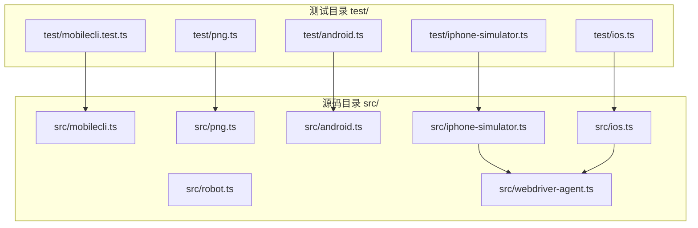
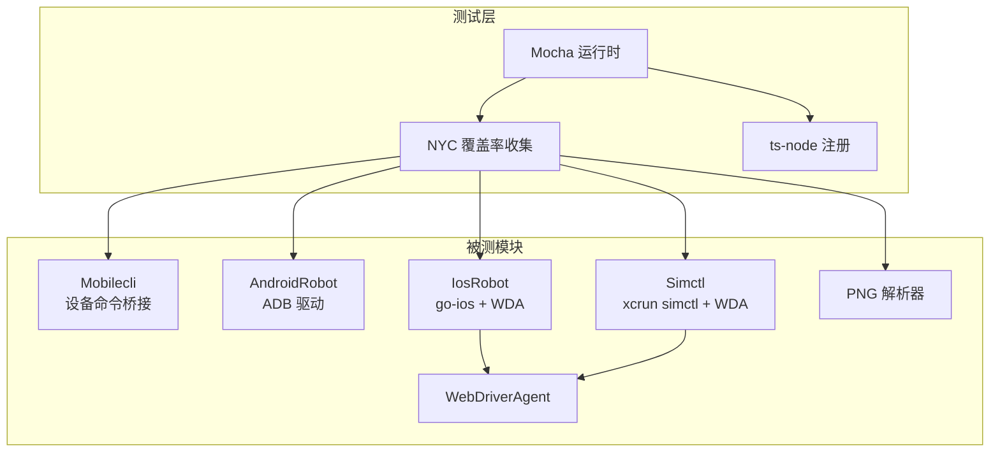
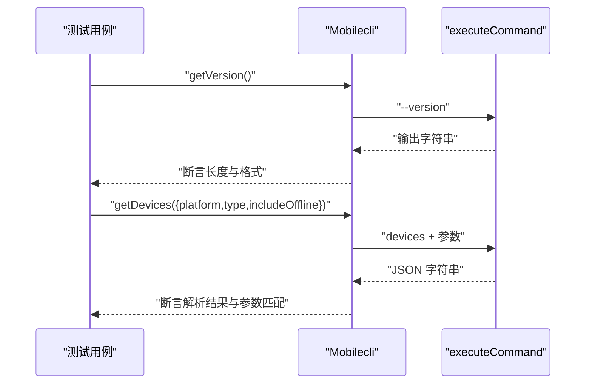
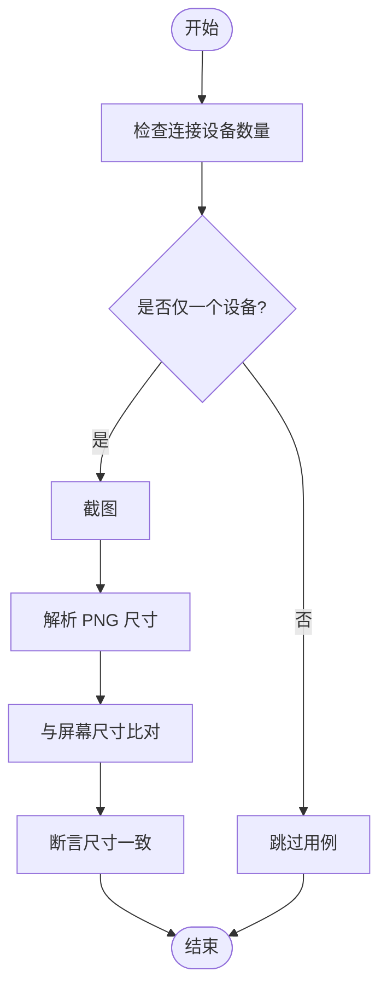
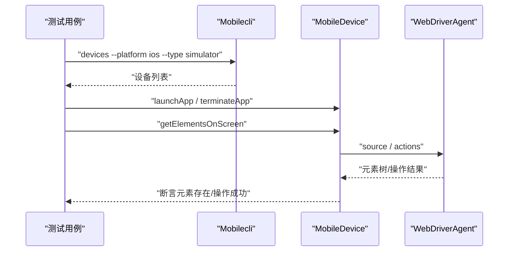
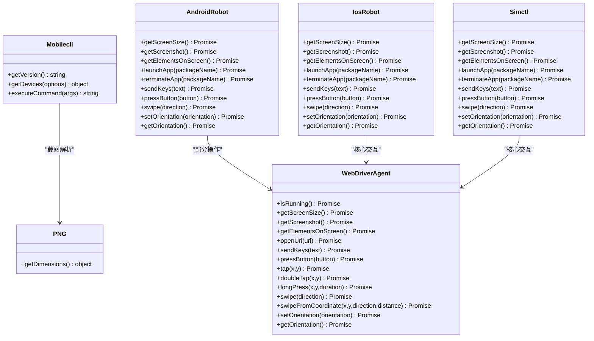

# 测试策略

<cite>
**本文引用的文件**
- [.mocharc.yml](file://.mocharc.yml)
- [package.json](file://package.json)
- [test/mobilecli.test.ts](file://test/mobilecli.test.ts)
- [test/android.ts](file://test/android.ts)
- [test/ios.ts](file://test/ios.ts)
- [test/iphone-simulator.ts](file://test/iphone-simulator.ts)
- [test/png.ts](file://test/png.ts)
- [src/mobilecli.ts](file://src/mobilecli.ts)
- [src/png.ts](file://src/png.ts)
- [src/android.ts](file://src/android.ts)
- [src/ios.ts](file://src/ios.ts)
- [src/iphone-simulator.ts](file://src/iphone-simulator.ts)
- [src/robot.ts](file://src/robot.ts)
- [src/webdriver-agent.ts](file://src/webdriver-agent.ts)
</cite>

## 目录
1. [引言](#引言)
2. [项目结构](#项目结构)
3. [核心组件](#核心组件)
4. [架构总览](#架构总览)
5. [详细组件分析](#详细组件分析)
6. [依赖分析](#依赖分析)
7. [性能考量](#性能考量)
8. [故障排查指南](#故障排查指南)
9. [结论](#结论)
10. [附录](#附录)

## 引言
本文件系统性阐述本项目的测试策略与测试框架配置，重点覆盖以下方面：
- Mocha 测试框架的配置与使用方式
- 测试文件组织结构与命名规范
- 单元测试与集成测试的设计原则
- Mobilecli 类的测试设计
- 平台特定测试（Android、iOS、iPhone Simulator）
- 图像处理测试（PNG）
- 测试用例编写规范（断言、模拟对象、测试数据）
- 覆盖率工具 NYC 的配置与报告解读
- 测试环境搭建与测试执行流程

## 项目结构
测试相关文件位于仓库根目录下的 test 目录，与源码 src 目录一一对应，形成“按功能/平台分层”的测试组织方式。Mocha 配置通过 .mocharc.yml 文件集中管理；覆盖率工具 NYC 通过 npm scripts 统一调用。

图表来源
- [test/mobilecli.test.ts:1-120](file://test/mobilecli.test.ts#L1-L120)
- [test/android.ts:1-140](file://test/android.ts#L1-L140)
- [test/ios.ts:1-29](file://test/ios.ts#L1-L29)
- [test/iphone-simulator.ts:1-196](file://test/iphone-simulator.ts#L1-L196)
- [test/png.ts:1-24](file://test/png.ts#L1-L24)
- [src/mobilecli.ts:1-136](file://src/mobilecli.ts#L1-L136)
- [src/png.ts:1-21](file://src/png.ts#L1-L21)
- [src/android.ts:1-593](file://src/android.ts#L1-L593)
- [src/ios.ts:1-294](file://src/ios.ts#L1-L294)
- [src/iphone-simulator.ts:1-273](file://src/iphone-simulator.ts#L1-L273)
- [src/webdriver-agent.ts:1-455](file://src/webdriver-agent.ts#L1-L455)

章节来源
- [package.json:17-24](file://package.json#L17-L24)
- [.mocharc.yml:1-2](file://.mocharc.yml#L1-L2)

## 核心组件
- 测试框架与工具链
  - Mocha：用于组织测试套件与用例，支持异步测试与超时控制
  - NYC：基于 istanbul 的 TypeScript 覆盖率收集器
  - ts-node：在运行时编译 TypeScript 测试文件
- 测试脚本入口
  - 通过 npm scripts 中的 test 命令统一执行，自动注册 ts-node 并启用 NYC 包裹

章节来源
- [package.json:21](file://package.json#L21)
- [.mocharc.yml:1-2](file://.mocharc.yml#L1-L2)

## 架构总览
测试体系围绕“单元测试 + 平台集成测试”展开，Mobilecli 作为外部二进制桥接器的代表，承担设备发现与命令执行职责；Android/iOS/iPhone Simulator 分别通过各自驱动（ADB、go-ios、WebDriverAgent）实现端到端交互；PNG 模块负责屏幕截图解析校验。

图表来源
- [test/mobilecli.test.ts:1-120](file://test/mobilecli.test.ts#L1-L120)
- [test/android.ts:1-140](file://test/android.ts#L1-L140)
- [test/ios.ts:1-29](file://test/ios.ts#L1-L29)
- [test/iphone-simulator.ts:1-196](file://test/iphone-simulator.ts#L1-L196)
- [test/png.ts:1-24](file://test/png.ts#L1-L24)
- [src/mobilecli.ts:1-136](file://src/mobilecli.ts#L1-L136)
- [src/android.ts:1-593](file://src/android.ts#L1-L593)
- [src/ios.ts:1-294](file://src/ios.ts#L1-L294)
- [src/iphone-simulator.ts:1-273](file://src/iphone-simulator.ts#L1-L273)
- [src/png.ts:1-21](file://src/png.ts#L1-L21)
- [src/webdriver-agent.ts:1-455](file://src/webdriver-agent.ts#L1-L455)

## 详细组件分析

### Mobilecli 类测试（单元测试）
- 测试目标
  - 版本查询：验证 getVersion 返回格式化版本字符串，异常路径返回失败提示
  - 设备列表：验证 getDevices 在不同过滤条件下的参数拼装与 JSON 解析
  - 命令执行：通过自定义 executeCommand 实现对命令参数的断言
- 关键设计点
  - 使用函数式 Mock 将 executeCommand 替换为可控实现，记录调用参数
  - 利用环境变量 MOBILECLI_PATH 验证无效路径场景
  - 断言参数顺序与组合选项的正确性

图表来源
- [test/mobilecli.test.ts:24-57](file://test/mobilecli.test.ts#L24-L57)
- [test/mobilecli.test.ts:75-118](file://test/mobilecli.test.ts#L75-L118)
- [src/mobilecli.ts:94-134](file://src/mobilecli.ts#L94-L134)

章节来源
- [test/mobilecli.test.ts:1-120](file://test/mobilecli.test.ts#L1-L120)
- [src/mobilecli.ts:1-136](file://src/mobilecli.ts#L1-L136)

### Android 平台测试（集成测试）
- 测试目标
  - 屏幕尺寸、截图、应用列表、URL 打开、元素识别、按键与点击、进程管理、方向切换等
- 关键设计点
  - 使用 this.skip() 在无可用设备时跳过用例，避免 CI 失败
  - 截图后通过 PNG 解析器校验尺寸一致性
  - 元素识别基于 UiAutomator 输出解析，断言关键控件存在性
  - 通过 adb 原生命令与应用交互，确保真实设备行为一致性

图表来源
- [test/android.ts:14-35](file://test/android.ts#L14-L35)
- [src/png.ts:10-20](file://src/png.ts#L10-L20)

章节来源
- [test/android.ts:1-140](file://test/android.ts#L1-L140)
- [src/android.ts:1-593](file://src/android.ts#L1-L593)
- [src/png.ts:1-21](file://src/png.ts#L1-L21)

### iOS 平台测试（集成测试）
- 测试目标
  - 截图尺寸与缩放关系校验，WDA 状态与隧道要求检查
- 关键设计点
  - 通过 WebDriverAgent 获取屏幕尺寸，与 PNG 尺寸进行比例校验
  - 对 go-ios 安装状态与设备列表进行前置检查

章节来源
- [test/ios.ts:1-29](file://test/ios.ts#L1-L29)
- [src/ios.ts:1-294](file://src/ios.ts#L1-L294)
- [src/webdriver-agent.ts:1-455](file://src/webdriver-agent.ts#L1-L455)

### iPhone Simulator 测试（集成测试）
- 测试目标
  - 滑动、输入与回车、屏幕尺寸、截图、打开 URL、应用列表、元素识别、启动/终止应用、按钮错误处理
- 关键设计点
  - 通过 mobilecli 获取已开机模拟器列表，并以 MobileDevice 作为统一入口
  - 使用 WebDriverAgent 进行手势、输入、截图、元素树解析
  - 对不支持按钮进行错误断言，提升健壮性

图表来源
- [test/iphone-simulator.ts:10-56](file://test/iphone-simulator.ts#L10-L56)
- [src/iphone-simulator.ts:32-83](file://src/iphone-simulator.ts#L32-L83)
- [src/webdriver-agent.ts:274-284](file://src/webdriver-agent.ts#L274-L284)

章节来源
- [test/iphone-simulator.ts:1-196](file://test/iphone-simulator.ts#L1-L196)
- [src/iphone-simulator.ts:1-273](file://src/iphone-simulator.ts#L1-L273)
- [src/webdriver-agent.ts:1-455](file://src/webdriver-agent.ts#L1-L455)

### PNG 图像处理测试（单元测试）
- 测试目标
  - 正常 PNG 的尺寸解析、非法 PNG 的错误检测
- 关键设计点
  - 使用 base64 编码的最小有效 PNG 进行尺寸断言
  - 通过 try/catch 或 done 回调捕获异常，确保错误路径覆盖

章节来源
- [test/png.ts:1-24](file://test/png.ts#L1-L24)
- [src/png.ts:1-21](file://src/png.ts#L1-L21)

## 依赖分析
- 测试与被测模块的耦合关系
  - Mobilecli 与外部二进制强耦合，测试通过 Mock 控制其命令执行路径
  - Android/iOS/Simulator 依赖系统工具（ADB、go-ios、xcrun simctl、WDA），测试需在具备相应环境的机器上执行
  - PNG 解析器为纯函数式模块，便于独立单元测试
- 外部依赖与集成点
  - WebDriverAgent 提供统一的移动端交互接口，贯穿 iOS 与 iPhone Simulator 测试
  - Robot 接口抽象了跨平台交互能力，便于扩展与替换实现

图表来源
- [src/mobilecli.ts:1-136](file://src/mobilecli.ts#L1-L136)
- [src/android.ts:74-504](file://src/android.ts#L74-L504)
- [src/ios.ts:42-232](file://src/ios.ts#L42-L232)
- [src/iphone-simulator.ts:32-272](file://src/iphone-simulator.ts#L32-L272)
- [src/webdriver-agent.ts:25-455](file://src/webdriver-agent.ts#L25-L455)
- [src/png.ts:6-20](file://src/png.ts#L6-L20)

章节来源
- [src/robot.ts:1-148](file://src/robot.ts#L1-L148)
- [src/webdriver-agent.ts:1-455](file://src/webdriver-agent.ts#L1-L455)

## 性能考量
- 测试超时与缓冲区
  - Mocha 默认超时由 .mocharc.yml 配置；各平台驱动在执行系统命令时设置合理超时与缓冲区上限，避免长时间阻塞
- 截图与解析
  - 截图体积较大，测试中通过断言最小阈值与 PNG 尺寸一致性进行快速验证，减少解析成本
- 设备可用性判断
  - 在无设备或设备不可用时尽早 skip，降低无效等待与失败重试成本

章节来源
- [.mocharc.yml:1-2](file://.mocharc.yml#L1-L2)
- [src/android.ts:69-71](file://src/android.ts#L69-L71)
- [src/ios.ts:7-8](file://src/ios.ts#L7-L8)
- [src/iphone-simulator.ts:28-30](file://src/iphone-simulator.ts#L28-L30)

## 故障排查指南
- Mobilecli 命令失败
  - 确认外部二进制路径解析逻辑与环境变量 MOBILECLI_PATH 设置
  - 检查平台与架构对应的可执行文件是否存在
- Android 设备未连接
  - 确认 ANDROID_HOME 或默认路径下 adb 可用；检查 devices 列表
  - 若多显示器设备，关注 screencap 多显示选择分支
- iOS 隧道与 WDA
  - 检查 go-ios 是否安装、隧道端口是否开放、WDA 是否已启动并就绪
- iPhone Simulator
  - 确认 WebDriverAgent 已安装并可启动；xcrun simctl 可用；URL 打开与元素识别依赖 WDA
- PNG 解析失败
  - 确保输入为合法 PNG；检查签名与尺寸字段读取

章节来源
- [src/mobilecli.ts:53-92](file://src/mobilecli.ts#L53-L92)
- [src/android.ts:32-54](file://src/android.ts#L32-L54)
- [src/ios.ts:33-40](file://src/ios.ts#L33-L40)
- [src/iphone-simulator.ts:36-68](file://src/iphone-simulator.ts#L36-L68)
- [src/png.ts:10-19](file://src/png.ts#L10-L19)

## 结论
本项目的测试策略以“单元测试保障核心逻辑，平台集成测试覆盖真实设备行为”为核心，结合 Mocha 与 NYC 形成完整的测试与覆盖率闭环。通过合理的 Mock 与 skip 机制，既保证了测试稳定性，又提升了可维护性。建议持续完善平台无关的工具类测试与边界条件覆盖，逐步引入更多自动化设备资源以增强稳定性。

## 附录

### 测试文件组织与命名规范
- 文件命名
  - 平台/功能对应：如 android.ts、ios.ts、iphone-simulator.ts、mobilecli.test.ts、png.ts
- 目录组织
  - test/ 下与 src/ 功能模块一一对应，便于定位与维护
- 命名约定
  - describe 描述模块/平台名称，it 描述具体行为与断言

章节来源
- [test/mobilecli.test.ts:20-118](file://test/mobilecli.test.ts#L20-L118)
- [test/android.ts:10-139](file://test/android.ts#L10-L139)
- [test/ios.ts:6-28](file://test/ios.ts#L6-L28)
- [test/iphone-simulator.ts:8-195](file://test/iphone-simulator.ts#L8-L195)
- [test/png.ts:5-23](file://test/png.ts#L5-L23)

### 单元测试与集成测试设计原则
- 单元测试
  - 以 Mobilecli 为例，通过 Mock 控制外部依赖，聚焦内部逻辑与参数拼装
  - 对异常路径（无效路径、错误返回）进行显式断言
- 集成测试
  - 以 Android/iOS/Simulator 为代表，强调真实设备/模拟器交互
  - 使用 this.skip() 在前置条件不满足时优雅跳过
  - 截图与元素识别通过 PNG 解析与 WDA 页面源进行交叉验证

章节来源
- [test/mobilecli.test.ts:8-18](file://test/mobilecli.test.ts#L8-L18)
- [test/android.ts:14-138](file://test/android.ts#L14-L138)
- [test/ios.ts:13-27](file://test/ios.ts#L13-L27)
- [test/iphone-simulator.ts:35-194](file://test/iphone-simulator.ts#L35-L194)

### 测试用例编写规范
- 断言方法
  - 使用 assert.ok、assert.equal、assert.deepEqual、正则断言等
- 模拟对象
  - 通过函数替换或构造函数注入实现可控行为
- 测试数据准备
  - 截图使用 base64 编码的最小有效 PNG；设备列表使用 JSON 模拟响应
- 错误处理
  - 对不支持按钮、无效路径等场景进行显式断言

章节来源
- [test/mobilecli.test.ts:25-56](file://test/mobilecli.test.ts#L25-L56)
- [test/png.ts:6-22](file://test/png.ts#L6-L22)
- [test/iphone-simulator.ts:185-194](file://test/iphone-simulator.ts#L185-L194)

### NYC 覆盖率配置与报告解读
- 配置与执行
  - 通过 npm scripts 中的 test 命令统一执行，自动启用 NYC 包裹 Mocha
  - ts-node 注册使 TypeScript 测试文件可直接运行
- 报告解读
  - 覆盖率报告包含语句、分支、函数、行四个维度，关注关键路径（如命令参数拼装、异常分支、平台差异逻辑）

章节来源
- [package.json:21](file://package.json#L21)
- [package.json:56-59](file://package.json#L56-L59)

### 测试环境搭建与执行流程
- 环境要求
  - Node.js 版本满足 engines 要求
  - Android：配置 ANDROID_HOME 或默认路径，确保 adb 可用
  - iOS：安装 go-ios，确保隧道与 WDA 可用
  - iPhone Simulator：确保 xcrun simctl 可用，WebDriverAgent 已安装
- 执行流程
  - 安装依赖后，执行 npm test 触发 NYC + Mocha + ts-node 的完整流程
  - 根据设备可用性动态跳过用例，最终输出覆盖率报告

章节来源
- [package.json:13-15](file://package.json#L13-L15)
- [test/android.ts:14-15](file://test/android.ts#L14-L15)
- [test/ios.ts:13-14](file://test/ios.ts#L13-L14)
- [test/iphone-simulator.ts:35-36](file://test/iphone-simulator.ts#L35-L36)
- [package.json:21](file://package.json#L21)