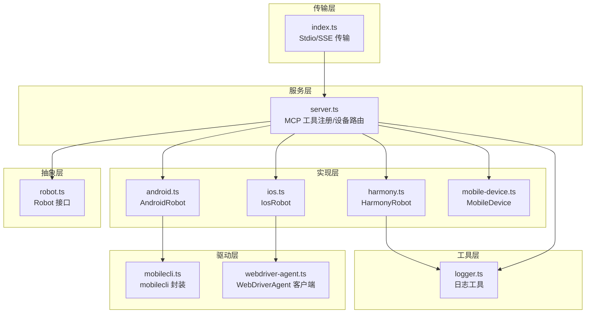
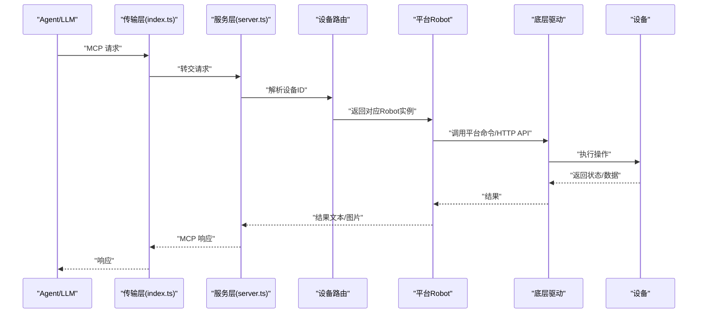
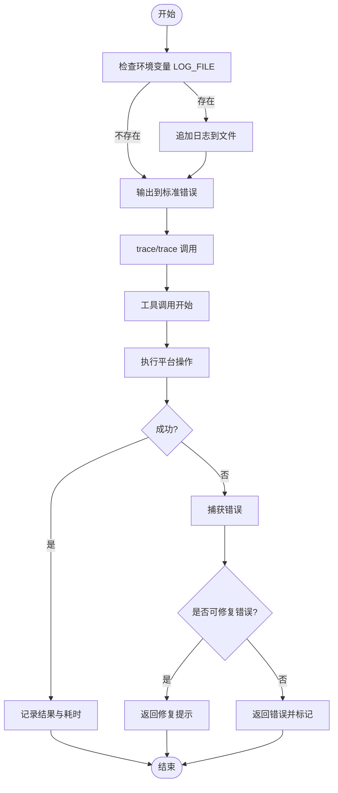
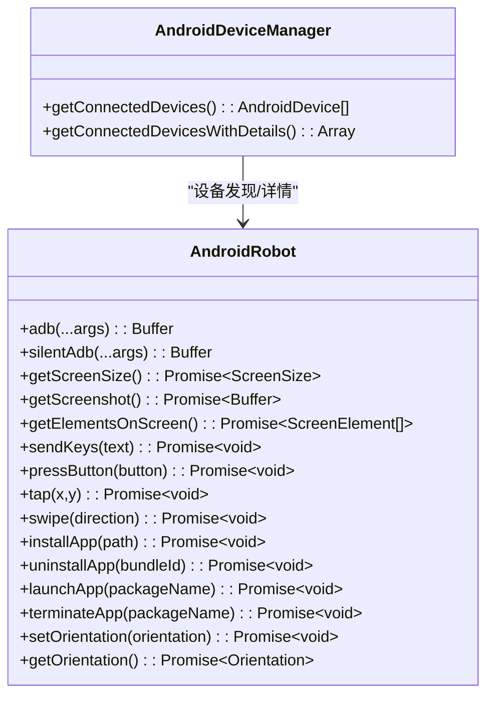
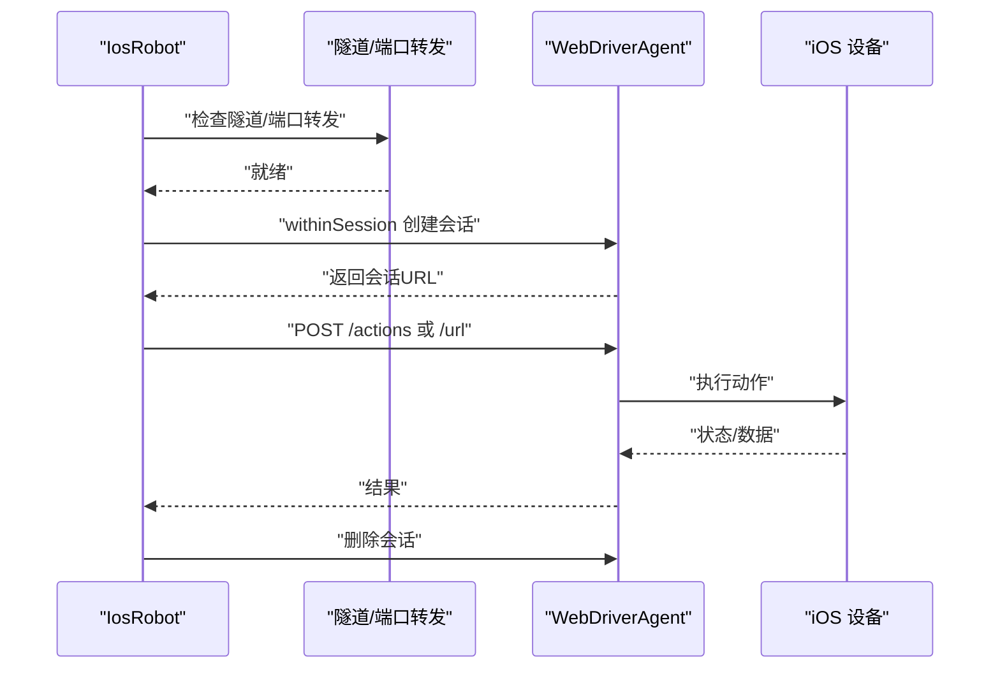
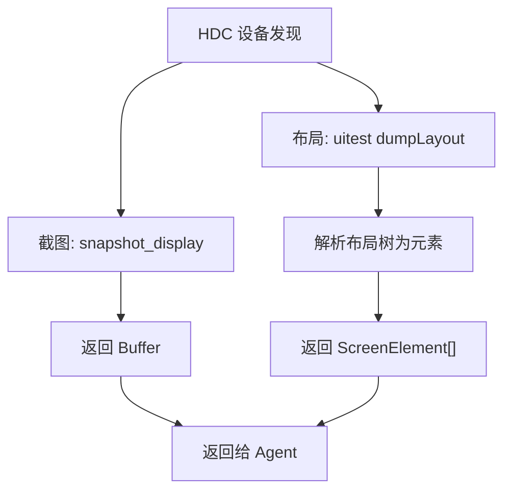
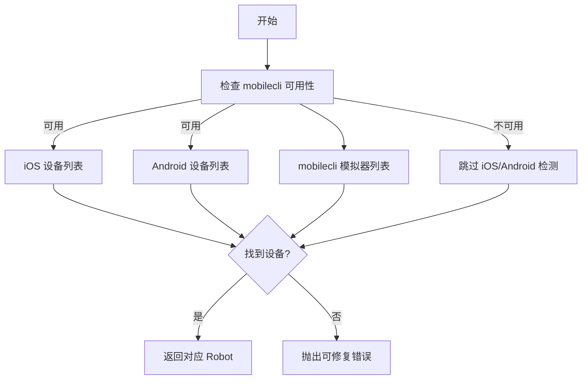
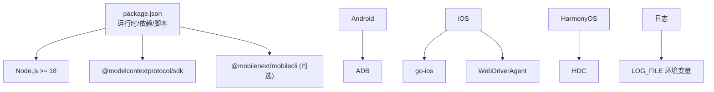

# 调试技巧

<cite>
**本文引用的文件**   
- [logger.ts](file://src/logger.ts)
- [server.ts](file://src/server.ts)
- [robot.ts](file://src/robot.ts)
- [android.ts](file://src/android.ts)
- [ios.ts](file://src/ios.ts)
- [harmony.ts](file://src/harmony.ts)
- [mobilecli.ts](file://src/mobilecli.ts)
- [webdriver-agent.ts](file://src/webdriver-agent.ts)
- [mobile-device.ts](file://src/mobile-device.ts)
- [mobilecli.test.ts](file://test/mobilecli.test.ts)
- [android.ts](file://test/android.ts)
- [ios.ts](file://test/ios.ts)
- [package.json](file://package.json)
- [README.md](file://README.md)
- [DEEPWIKI.md](file://DEEPWIKI.md)
</cite>

## 目录
1. [简介](#简介)
2. [项目结构](#项目结构)
3. [核心组件](#核心组件)
4. [架构总览](#架构总览)
5. [详细组件分析](#详细组件分析)
6. [依赖关系分析](#依赖关系分析)
7. [性能考量](#性能考量)
8. [故障排查指南](#故障排查指南)
9. [结论](#结论)
10. [附录](#附录)

## 简介
本指南围绕移动MCP项目的调试体系与工具使用，覆盖日志系统、错误追踪、平台特定调试方法（HarmonyOS、iOS、Android）、网络与设备连接诊断、常见问题与性能瓶颈定位，以及实用的调试案例与排查流程。目标是帮助开发者快速定位问题、提升自动化稳定性与效率。

## 项目结构
该项目采用分层架构：传输层（Stdio/SSE）、服务层（MCP工具注册与设备路由）、抽象层（Robot接口）、实现层（各平台Robot实现）、驱动层（底层工具封装）与工具层（日志、图像处理等）。核心入口通过MCP协议对外提供统一的移动设备自动化能力。

图表来源
- [server.ts:35-707](file://src/server.ts#L35-L707)
- [robot.ts:48-147](file://src/robot.ts#L48-L147)
- [android.ts:74-504](file://src/android.ts#L74-L504)
- [ios.ts:42-232](file://src/ios.ts#L42-L232)
- [harmony.ts:43-416](file://src/harmony.ts#L43-L416)
- [mobile-device.ts:62-216](file://src/mobile-device.ts#L62-L216)
- [mobilecli.ts:27-135](file://src/mobilecli.ts#L27-L135)
- [webdriver-agent.ts:25-454](file://src/webdriver-agent.ts#L25-L454)
- [logger.ts:1-22](file://src/logger.ts#L1-L22)

章节来源
- [README.md:1-198](file://README.md#L1-L198)
- [DEEPWIKI.md:32-54](file://DEEPWIKI.md#L32-L54)

## 核心组件
- 日志系统：统一输出到标准错误，并可选写入文件，便于离线分析与问题复现。
- 错误处理：区分“可修复错误”与“系统异常”，前者引导用户修复，后者返回错误并标记。
- 设备路由：根据设备类型与可用依赖选择对应Robot实现，确保操作正确下发。
- 截图与图像处理：对大体积截图进行尺寸与格式优化，降低传输与渲染成本。
- 平台实现：Android（ADB/UIAutomator）、iOS（go-ios/WDA）、HarmonyOS（HDC/uitest），均遵循Robot接口。

章节来源
- [logger.ts:1-22](file://src/logger.ts#L1-L22)
- [server.ts:62-95](file://src/server.ts#L62-L95)
- [server.ts:585-672](file://src/server.ts#L585-L672)
- [robot.ts:48-147](file://src/robot.ts#L48-L147)
- [android.ts:74-504](file://src/android.ts#L74-L504)
- [ios.ts:42-232](file://src/ios.ts#L42-L232)
- [harmony.ts:43-416](file://src/harmony.ts#L43-L416)

## 架构总览
MCP工具调用到设备执行的关键路径如下：Agent发起请求 → 传输层接收 → 服务层工具处理器 → 设备路由 → 平台Robot → 底层驱动 → 设备执行 → 结果返回。

图表来源
- [server.ts:62-95](file://src/server.ts#L62-L95)
- [server.ts:149-197](file://src/server.ts#L149-L197)
- [webdriver-agent.ts:42-77](file://src/webdriver-agent.ts#L42-L77)
- [android.ts:79-92](file://src/android.ts#L79-L92)
- [ios.ts:94-96](file://src/ios.ts#L94-L96)
- [harmony.ts:48-53](file://src/harmony.ts#L48-L53)

## 详细组件分析

### 日志系统与错误追踪
- 日志输出：统一写入标准错误，避免干扰Stdio通信；可通过环境变量将日志追加到文件，便于离线分析。
- 错误分类：ActionableError用于可修复错误（如设备未连接、工具未安装），普通Error用于系统异常（如网络超时、权限不足）。
- 调试信息：工具调用前后记录参数与耗时，有助于定位慢操作与失败原因。

图表来源
- [logger.ts:3-21](file://src/logger.ts#L3-L21)
- [server.ts:69-94](file://src/server.ts#L69-L94)
- [server.ts:665-671](file://src/server.ts#L665-L671)

章节来源
- [logger.ts:1-22](file://src/logger.ts#L1-L22)
- [server.ts:62-95](file://src/server.ts#L62-L95)
- [server.ts:665-671](file://src/server.ts#L665-L671)

### Android 平台调试要点
- ADB 路径与环境：优先从环境变量与系统路径解析ADB；若未找到，需检查ANDROID_HOME或PATH。
- UIAutomator XML 解析：当dump返回空根节点时会重试，必要时可抓取截图辅助定位。
- 文本输入：ASCII字符直接输入；非ASCII字符需借助剪贴板方案或安装设备工具链。
- 截图与尺寸：多屏设备通过display ID选择屏幕；截图后进行尺寸校验，避免无效数据。
- 应用管理：安装/卸载/启动/终止需结合设备状态与权限，注意异常输出解析。

图表来源
- [android.ts:74-504](file://src/android.ts#L74-L504)
- [android.ts:506-592](file://src/android.ts#L506-L592)

章节来源
- [android.ts:32-54](file://src/android.ts#L32-L54)
- [android.ts:466-481](file://src/android.ts#L466-L481)
- [android.ts:402-427](file://src/android.ts#L402-L427)
- [android.ts:295-310](file://src/android.ts#L295-L310)
- [android.ts:551-591](file://src/android.ts#L551-L591)

### iOS 平台调试要点
- 连接前置条件：iOS 17+ 需要隧道与端口转发，且WebDriverAgent必须在设备上运行。
- WDA 会话：每次操作通过withinSession自动创建/销毁会话，确保动作原子性。
- URL 打开与输入：通过WDA Actions API与URL接口完成，注意会话状态与设备方向。
- 截图与尺寸：WDA返回的屏幕尺寸以point为单位，需考虑scale换算。

图表来源
- [ios.ts:69-92](file://src/ios.ts#L69-L92)
- [ios.ts:42-96](file://src/ios.ts#L42-L96)
- [webdriver-agent.ts:42-77](file://src/webdriver-agent.ts#L42-L77)

章节来源
- [ios.ts:104-108](file://src/ios.ts#L104-L108)
- [ios.ts:69-92](file://src/ios.ts#L69-L92)
- [webdriver-agent.ts:25-454](file://src/webdriver-agent.ts#L25-L454)

### HarmonyOS 平台调试要点
- 设备发现：通过HDC列出目标设备，支持获取设备名称与软件版本。
- 截图与布局：使用snapshot_display截图，uitest dumpLayout导出布局树，再解析为结构化元素。
- 输入与按键：通过uitest输入文本与按键事件，注意按键映射与坐标定位。
- 应用管理：通过HDC与aa命令进行安装、启动、终止与卸载。

图表来源
- [harmony.ts:418-461](file://src/harmony.ts#L418-L461)
- [harmony.ts:159-182](file://src/harmony.ts#L159-L182)
- [harmony.ts:294-332](file://src/harmony.ts#L294-L332)

章节来源
- [harmony.ts:12-18](file://src/harmony.ts#L12-L18)
- [harmony.ts:418-461](file://src/harmony.ts#L418-L461)
- [harmony.ts:294-332](file://src/harmony.ts#L294-L332)

### 网络与设备连接诊断
- mobilecli 二进制：自动定位平台对应的二进制，支持环境变量覆盖；版本检查失败需检查安装与权限。
- 设备路由：先尝试HarmonyOS（无需mobilecli），再检查iOS/Android，最后回退到mobilecli模拟器。
- 端口与隧道：iOS 17+ 需要隧道端口与WDA端口转发，确保防火墙与代理不阻断。

图表来源
- [server.ts:138-147](file://src/server.ts#L138-L147)
- [server.ts:149-197](file://src/server.ts#L149-L197)
- [server.ts:209-294](file://src/server.ts#L209-L294)
- [mobilecli.ts:53-92](file://src/mobilecli.ts#L53-L92)

章节来源
- [mobilecli.ts:27-135](file://src/mobilecli.ts#L27-L135)
- [server.ts:138-197](file://src/server.ts#L138-L197)

## 依赖关系分析
- 运行时要求：Node.js >= 18，MCP SDK，可选依赖mobilecli。
- 平台依赖：Android（ADB）、iOS（go-ios + WebDriverAgent）、HarmonyOS（HDC）。
- 环境变量：ANDROID_HOME、GO_IOS_PATH、MOBILECLI_PATH、LOG_FILE。

图表来源
- [package.json:13-73](file://package.json#L13-L73)
- [README.md:90-99](file://README.md#L90-L99)
- [logger.ts:3-12](file://src/logger.ts#L3-L12)

章节来源
- [package.json:13-73](file://package.json#L13-L73)
- [README.md:90-99](file://README.md#L90-L99)

## 性能考量
- 截图优化：优先使用Sips（macOS）或ImageMagick进行缩放与JPEG压缩，显著降低传输体积。
- 超时与缓冲：底层调用设置合理超时与最大缓冲区，避免长时间阻塞。
- 工具调用统计：记录工具耗时，便于识别慢操作与热点路径。

章节来源
- [server.ts:615-650](file://src/server.ts#L615-L650)
- [server.ts:74-75](file://src/server.ts#L74-L75)
- [android.ts:69-71](file://src/android.ts#L69-L71)
- [ios.ts:42-45](file://src/ios.ts#L42-L45)
- [harmony.ts:9-11](file://src/harmony.ts#L9-L11)

## 故障排查指南

### 常见问题与解决方案
- 设备发现失败
  - Android：检查ADB路径与环境变量，确认设备已授权与连接。
  - iOS：确认go-ios安装、设备列表可用；iOS 17+需隧道与端口转发。
  - HarmonyOS：确认HDC在PATH或HDC_SDK_PATH指向正确路径。
- 权限问题
  - Android：授予USB调试与安装未知来源应用权限；ADB需root或设备已授权。
  - iOS：信任开发者证书与设备；WDA需在设备上运行并允许自动化。
  - HarmonyOS：确保HDC权限与设备允许自动化。
- 性能瓶颈
  - 截图过大：启用图像缩放与压缩；避免频繁截图。
  - 动作延迟：检查网络与隧道延迟；合并多次操作减少往返。

### 调试工具与最佳实践
- 日志：设置LOG_FILE记录详细日志，结合trace与error输出定位问题。
- 断点与最小复现：针对单一工具调用构造最小用例，逐步缩小范围。
- 环境隔离：分别测试Android/iOS/HarmonyOS，排除平台差异影响。
- 超时与重试：为关键命令设置超时与指数退避重试策略。

### 实际调试案例与排查流程
- 案例1：iOS 17+无法连接
  - 现象：工具报错提示隧道或WDA未运行。
  - 步骤：检查隧道端口、端口转发、WDA状态；确认设备方向与会话。
  - 参考：[ios.ts:69-92](file://src/ios.ts#L69-L92)、[webdriver-agent.ts:30-40](file://src/webdriver-agent.ts#L30-L40)
- 案例2：Android 输入非ASCII字符失败
  - 现象：ActionableError提示需安装设备工具链。
  - 步骤：安装设备工具链并通过剪贴板发送文本。
  - 参考：[android.ts:402-427](file://src/android.ts#L402-L427)
- 案例3：HarmonyOS 截图为空
  - 现象：布局dump失败或截图为空。
  - 步骤：确认snapshot_display与dumpLayout命令可用；检查设备权限。
  - 参考：[harmony.ts:159-182](file://src/harmony.ts#L159-L182)、[harmony.ts:294-332](file://src/harmony.ts#L294-L332)

章节来源
- [ios.ts:69-92](file://src/ios.ts#L69-L92)
- [webdriver-agent.ts:30-40](file://src/webdriver-agent.ts#L30-L40)
- [android.ts:402-427](file://src/android.ts#L402-L427)
- [harmony.ts:159-182](file://src/harmony.ts#L159-L182)
- [harmony.ts:294-332](file://src/harmony.ts#L294-L332)

## 结论
通过统一的日志与错误处理机制、清晰的设备路由与平台实现、以及完善的截图与性能优化策略，该系统在多平台移动自动化调试方面具备良好的可维护性与可观测性。建议在生产环境中开启日志文件记录、定期监控工具耗时、并针对平台差异制定标准化的调试流程。

## 附录
- 测试参考：单元测试覆盖mobilecli版本与设备过滤逻辑，集成测试覆盖Android/iOS截图与元素解析。
- 配置参考：README与DeepWiki提供了MCP配置示例与平台依赖说明。

章节来源
- [mobilecli.test.ts:24-57](file://test/mobilecli.test.ts#L24-L57)
- [mobilecli.test.ts:59-118](file://test/mobilecli.test.ts#L59-L118)
- [android.ts:14-21](file://test/android.ts#L14-L21)
- [ios.ts:13-27](file://test/ios.ts#L13-L27)
- [README.md:100-171](file://README.md#L100-L171)
- [DEEPWIKI.md:651-687](file://DEEPWIKI.md#L651-L687)